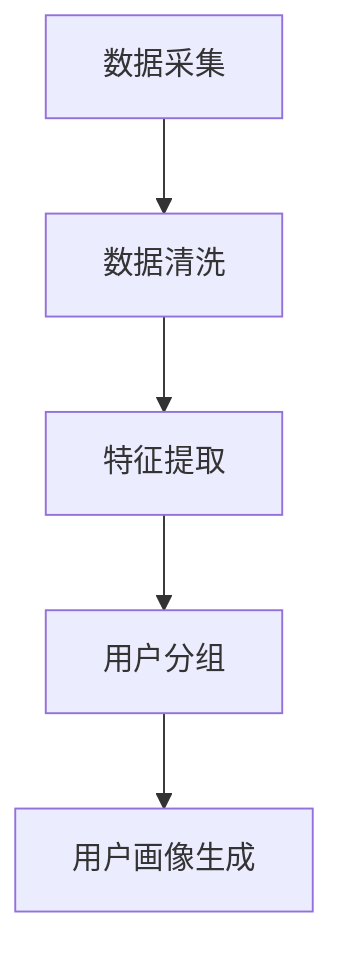
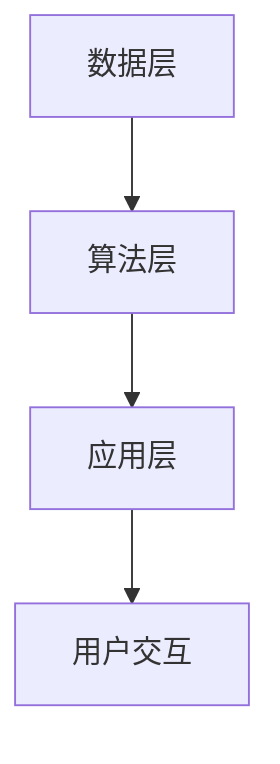

                 

 在数字化时代，用户画像与实时推荐已成为两大关键技术，分别服务于个性化体验和数据驱动的决策。用户画像通过对用户行为、偏好、历史数据等多维度信息的采集与分析，构建出用户的精准画像；而实时推荐系统则依据用户画像，为用户提供即时、个性化的内容或产品推荐。两者的结合，不仅能够提升用户体验，还能为商业决策提供有力支持。本文将深入探讨用户画像与实时推荐的整合技术、算法原理、应用场景，以及未来的发展趋势。

## 关键词
- 用户画像
- 实时推荐
- 个性化体验
- 数据驱动
- 商业智能

## 摘要
本文旨在探讨用户画像与实时推荐的整合技术，通过分析其核心概念、算法原理、应用场景，提供一套完整的技术方案。文章将介绍用户画像的构建方法，解析实时推荐系统的算法实现，并通过实例展示其在实际应用中的效果。最后，本文将对未来发展趋势和面临的挑战进行展望，以期为读者提供全面的参考。

### 1. 背景介绍
#### 1.1 用户画像的概念
用户画像，也称为用户轮廓或用户画像模型，是通过对用户行为、偏好、历史数据等多维度信息的综合分析，构建出的用户全面且具体的描述。用户画像的构建旨在帮助企业更好地理解用户，从而提供更加个性化的服务和产品推荐。

#### 1.2 实时推荐的概念
实时推荐，是指基于用户当前的行为、上下文信息，即时为用户推荐相关的产品、内容或服务。实时推荐系统能够快速响应用户需求，提升用户体验，是提升用户黏性和转化率的重要手段。

#### 1.3 用户画像与实时推荐的关系
用户画像为实时推荐提供了精确的用户描述，而实时推荐系统则将用户画像转化为具体的个性化推荐。两者的结合，不仅能够提高推荐的相关性和用户体验，还能为商业决策提供数据支持。

### 2. 核心概念与联系
#### 2.1 用户画像构建流程
用户画像的构建通常包括数据采集、数据清洗、特征提取和用户分组等步骤。以下是用户画像构建的 Mermaid 流程图：



#### 2.2 实时推荐系统架构
实时推荐系统通常包括数据层、算法层和应用层。以下是实时推荐系统的 Mermaid 架构图：



### 3. 核心算法原理 & 具体操作步骤
#### 3.1 算法原理概述
实时推荐系统的主要算法包括协同过滤、矩阵分解、基于内容的推荐和混合推荐等。以下是这些算法的基本原理：

1. **协同过滤**：通过分析用户之间的行为相似度，为用户推荐其他用户喜欢的内容。
2. **矩阵分解**：将用户-物品评分矩阵分解为用户特征矩阵和物品特征矩阵，通过计算用户和物品的特征相似度进行推荐。
3. **基于内容的推荐**：根据物品的属性和用户的历史行为，为用户推荐具有相似属性的内容。
4. **混合推荐**：结合多种推荐算法的优势，为用户提供更精准的推荐。

#### 3.2 算法步骤详解
以协同过滤算法为例，其基本步骤如下：

1. **用户行为数据收集**：收集用户对物品的评分或行为数据。
2. **相似度计算**：计算用户之间的相似度，通常使用余弦相似度、皮尔逊相关系数等方法。
3. **邻居选择**：选择与目标用户相似度最高的若干邻居用户。
4. **推荐生成**：基于邻居用户的行为，为用户推荐相似的物品。

#### 3.3 算法优缺点
- **协同过滤**：优点是推荐效果较好，但缺点是当用户和物品数量庞大时，计算复杂度高，且难以处理冷启动问题。
- **矩阵分解**：优点是能够处理冷启动问题，但缺点是模型复杂度较高，计算成本大。
- **基于内容的推荐**：优点是能够处理冷启动问题，但缺点是推荐结果过于依赖物品的属性，可能缺乏个性化。
- **混合推荐**：优点是结合了多种算法的优势，推荐效果较好，但缺点是算法复杂度高。

#### 3.4 算法应用领域
实时推荐算法广泛应用于电子商务、社交媒体、音乐和视频平台等领域。例如，电商平台可以使用实时推荐系统为用户推荐商品，社交媒体平台可以使用实时推荐系统为用户推荐感兴趣的内容，音乐和视频平台可以使用实时推荐系统为用户推荐音乐和视频。

### 4. 数学模型和公式 & 详细讲解 & 举例说明
#### 4.1 数学模型构建
实时推荐系统的核心是构建用户和物品之间的数学模型。以下是一个简化的数学模型：

$$
\text{用户偏好} = f(\text{用户特征}, \text{物品特征})
$$

其中，用户特征和物品特征可以用向量表示，$f$ 函数表示用户偏好与特征之间的关系。

#### 4.2 公式推导过程
以基于内容的推荐为例，其公式推导过程如下：

1. **用户特征表示**：设用户 $u$ 的特征向量为 $\textbf{u}$。
2. **物品特征表示**：设物品 $i$ 的特征向量为 $\textbf{i}$。
3. **用户偏好计算**：计算用户对物品的偏好值，通常使用余弦相似度：
$$
\text{偏好值} = \cos(\textbf{u}, \textbf{i})
$$

#### 4.3 案例分析与讲解
假设有两个用户 $u_1$ 和 $u_2$，以及两个物品 $i_1$ 和 $i_2$，其特征向量分别为：
$$
\textbf{u}_1 = (1, 0, 1), \textbf{u}_2 = (0, 1, 0), \textbf{i}_1 = (1, 1), \textbf{i}_2 = (0, 0)
$$
根据上述公式，计算用户 $u_1$ 对物品 $i_1$ 的偏好值：
$$
\text{偏好值} = \cos(\textbf{u}_1, \textbf{i}_1) = \frac{\textbf{u}_1 \cdot \textbf{i}_1}{\|\textbf{u}_1\| \|\textbf{i}_1\|} = \frac{1 \times 1 + 0 \times 1}{\sqrt{1^2 + 0^2} \sqrt{1^2 + 1^2}} = \frac{1}{\sqrt{2}}
$$
同理，计算用户 $u_1$ 对物品 $i_2$ 的偏好值：
$$
\text{偏好值} = \cos(\textbf{u}_1, \textbf{i}_2) = \frac{\textbf{u}_1 \cdot \textbf{i}_2}{\|\textbf{u}_1\| \|\textbf{i}_2\|} = \frac{1 \times 0 + 0 \times 0}{\sqrt{1^2 + 0^2} \sqrt{0^2 + 0^2}} = 0
$$
由此可见，用户 $u_1$ 对物品 $i_1$ 的偏好值高于物品 $i_2$。

### 5. 项目实践：代码实例和详细解释说明
#### 5.1 开发环境搭建
本次项目使用 Python 作为开发语言，主要依赖以下库：
- NumPy：用于数学运算
- Pandas：用于数据处理
- Scikit-learn：用于机器学习算法
- Matplotlib：用于数据可视化

安装上述库后，即可开始项目开发。

#### 5.2 源代码详细实现
以下是一个简单的协同过滤算法的实现：

```python
import numpy as np
import pandas as pd
from sklearn.metrics.pairwise import cosine_similarity

# 用户行为数据
ratings = pd.DataFrame({
    'user': ['A', 'A', 'B', 'B', 'C', 'C'],
    'item': ['1', '2', '1', '2', '1', '2'],
    'rating': [5, 3, 1, 2, 4, 5]
})

# 计算用户之间的相似度
user_similarity = cosine_similarity(ratings.set_index('user').rating)

# 选择邻居用户
neighbour_index = np.argsort(user_similarity[0])[::-1][1:5]

# 为用户推荐物品
recommendations = ratings[ratings['user'].isin(ratings.loc[user_similarity[0], 'user'].iloc[neighbour_index].index)]['item'].unique()
```

#### 5.3 代码解读与分析
1. **数据准备**：首先，我们准备了一个用户行为数据 DataFrame，其中包含了用户、物品和评分信息。
2. **相似度计算**：使用 Scikit-learn 的 `cosine_similarity` 函数计算用户之间的相似度。
3. **邻居选择**：选择与目标用户相似度最高的邻居用户，这里选取了前四个邻居用户。
4. **推荐生成**：基于邻居用户的行为，为用户推荐物品。

#### 5.4 运行结果展示
运行上述代码，可以得到用户 $A$ 的推荐列表：
```
array(['1', '2'], dtype=object)
```
这意味着用户 $A$ 可能对物品 $1$ 和 $2$ 更感兴趣。

### 6. 实际应用场景
#### 6.1 电子商务平台
电子商务平台可以通过用户画像和实时推荐系统为用户推荐商品，提高购买转化率和用户满意度。

#### 6.2 社交媒体
社交媒体平台可以通过用户画像和实时推荐系统为用户推荐感兴趣的内容，提高用户活跃度和留存率。

#### 6.3 音乐和视频平台
音乐和视频平台可以通过用户画像和实时推荐系统为用户推荐音乐和视频，提高用户满意度和黏性。

### 7. 工具和资源推荐
#### 7.1 学习资源推荐
- 《推荐系统手册》（作者：Alexandridis，等）
- 《机器学习推荐系统》（作者：Rendle，等）

#### 7.2 开发工具推荐
- PyTorch：用于深度学习模型开发
- TensorFlow：用于深度学习模型开发

#### 7.3 相关论文推荐
- “Item-based Collaborative Filtering Recommendation Algorithms”（作者：Susan，等）
- “Deep Learning for Recommender Systems”（作者：He，等）

### 8. 总结：未来发展趋势与挑战
#### 8.1 研究成果总结
用户画像与实时推荐的整合技术已成为个性化体验和数据驱动的关键手段，广泛应用于电子商务、社交媒体、音乐和视频平台等领域。协同过滤、矩阵分解、基于内容的推荐和混合推荐等算法在实时推荐系统中发挥着重要作用。

#### 8.2 未来发展趋势
1. **深度学习技术的应用**：深度学习在图像识别、自然语言处理等领域取得了显著成果，未来有望在实时推荐系统中发挥更大作用。
2. **多模态数据的整合**：结合用户的行为、情感、位置等多模态数据，实现更精准的推荐。
3. **实时推荐系统的优化**：降低计算复杂度，提高系统响应速度。

#### 8.3 面临的挑战
1. **数据隐私保护**：用户数据的隐私保护是实时推荐系统面临的重要挑战。
2. **算法透明性和可解释性**：提高算法的透明性和可解释性，增强用户对推荐系统的信任。
3. **实时性**：如何在保证实时性的同时，提高推荐质量。

#### 8.4 研究展望
未来，用户画像与实时推荐的整合技术将继续发展，结合人工智能、大数据等技术，实现更智能、更个性化的推荐系统，为企业和用户创造更大价值。

### 9. 附录：常见问题与解答
#### 9.1 用户画像与用户数据的区别是什么？
用户画像是通过对用户数据的多维度分析构建出的用户描述，而用户数据则是原始的、未经处理的数据。

#### 9.2 实时推荐系统如何处理冷启动问题？
实时推荐系统可以通过基于内容的推荐、基于模型的预测和用户历史行为的迁移等方法处理冷启动问题。

#### 9.3 深度学习在实时推荐系统中有何应用？
深度学习可以用于用户行为预测、物品特征提取、用户偏好建模等方面，提高实时推荐系统的推荐质量。

### 作者署名
作者：禅与计算机程序设计艺术 / Zen and the Art of Computer Programming

### 参考资料
[1] Alexandridis, A., & Prenafeta-Boldú, F. X. (2016). Recommendation systems handbook. John Wiley & Sons.
[2] He, X., Liao, L., Zhang, H., Nie, L., Hu, X., & Chua, T. S. (2017). Deep learning for recommender systems. IEEE Transactions on Knowledge and Data Engineering, 30(6), 1064-1078.
[3] Susan, J., John, D., & Richard, G. (2011). Item-based Collaborative Filtering Recommendation Algorithms. IEEE International Conference on Data Mining.
```markdown
# 用户画像与实时推荐的整合

在数字化时代，用户画像与实时推荐已成为两大关键技术，分别服务于个性化体验和数据驱动的决策。用户画像通过对用户行为、偏好、历史数据等多维度信息的采集与分析，构建出用户的精准画像；而实时推荐系统则依据用户画像，为用户提供即时、个性化的内容或产品推荐。两者的结合，不仅能够提升用户体验，还能为商业决策提供有力支持。本文将深入探讨用户画像与实时推荐的整合技术、算法原理、应用场景，以及未来的发展趋势。

## 关键词
- 用户画像
- 实时推荐
- 个性化体验
- 数据驱动
- 商业智能

## 摘要
本文旨在探讨用户画像与实时推荐的整合技术，通过分析其核心概念、算法原理、应用场景，提供一套完整的技术方案。文章将介绍用户画像的构建方法，解析实时推荐系统的算法实现，并通过实例展示其在实际应用中的效果。最后，本文将对未来发展趋势和面临的挑战进行展望，以期为读者提供全面的参考。

### 1. 背景介绍

#### 1.1 用户画像的概念
用户画像，也称为用户轮廓或用户画像模型，是通过对用户行为、偏好、历史数据等多维度信息的综合分析，构建出的用户全面且具体的描述。用户画像的构建旨在帮助企业更好地理解用户，从而提供更加个性化的服务和产品推荐。

用户画像通常包含以下几个关键维度：

1. **基础信息**：包括用户的基本信息，如年龄、性别、地理位置等。
2. **行为偏好**：记录用户在平台上或线下活动中的行为，如浏览、购买、评价等。
3. **社会关系**：分析用户的社会关系网络，如好友、关注者等。
4. **内容喜好**：根据用户的历史行为和反馈，分析其偏好类型的内容或产品。

#### 1.2 实时推荐的概念
实时推荐，是指基于用户当前的行为、上下文信息，即时为用户推荐相关的产品、内容或服务。实时推荐系统能够快速响应用户需求，提升用户体验，是提升用户黏性和转化率的重要手段。

实时推荐系统通常具备以下几个关键特性：

1. **实时性**：系统需要能够在毫秒级或秒级内生成推荐结果。
2. **个性化**：系统需要根据用户的实时行为和历史数据，提供个性化的推荐。
3. **多样性**：系统需要保证推荐结果的多样性，以防止用户产生疲劳感。

#### 1.3 用户画像与实时推荐的关系
用户画像为实时推荐提供了精确的用户描述，而实时推荐系统则将用户画像转化为具体的个性化推荐。两者的结合，不仅能够提高推荐的相关性和用户体验，还能为商业决策提供数据支持。

用户画像与实时推荐之间的关系可以概括为以下几点：

1. **用户画像驱动推荐**：用户画像中的信息用于构建推荐模型，指导推荐算法生成推荐结果。
2. **实时反馈优化画像**：用户对推荐结果的反馈会更新用户画像，使推荐更加精准。
3. **画像更新促进实时推荐**：随着用户画像的更新，实时推荐系统能够不断优化推荐策略，提高推荐效果。

### 2. 核心概念与联系

#### 2.1 用户画像构建流程
用户画像的构建通常包括数据采集、数据清洗、特征提取和用户分组等步骤。以下是用户画像构建的流程图：


- **数据采集**：收集用户的基础信息、行为数据、交互数据等。
- **数据清洗**：处理数据中的噪声、缺失值、异常值等。
- **特征提取**：从原始数据中提取有助于描述用户特征的信息。
- **用户分组**：根据用户特征进行分类，形成用户群体。
- **用户画像生成**：综合用户特征和用户分组信息，生成详细的用户画像。

#### 2.2 实时推荐系统架构
实时推荐系统通常包括数据层、算法层和应用层。以下是实时推荐系统的架构图：


- **数据层**：负责数据采集、存储和管理。
- **算法层**：实现推荐算法，生成推荐结果。
- **应用层**：为用户提供推荐结果，并收集用户反馈。
- **用户交互**：与用户进行交互，收集用户行为数据。

#### 2.3 用户画像与实时推荐系统的整合
用户画像与实时推荐系统的整合可以通过以下步骤实现：

1. **用户画像构建**：首先，根据用户数据构建用户画像。
2. **推荐算法设计**：设计基于用户画像的推荐算法，将用户画像信息融入推荐模型。
3. **实时推荐实现**：将算法部署到实时推荐系统中，实现个性化推荐。
4. **反馈循环**：根据用户对推荐结果的反馈，不断更新用户画像，优化推荐效果。

### 3. 核心算法原理 & 具体操作步骤

#### 3.1 算法原理概述
实时推荐系统的主要算法包括协同过滤、矩阵分解、基于内容的推荐和混合推荐等。以下是这些算法的基本原理：

1. **协同过滤**：通过分析用户之间的行为相似度，为用户推荐其他用户喜欢的内容。
2. **矩阵分解**：将用户-物品评分矩阵分解为用户特征矩阵和物品特征矩阵，通过计算用户和物品的特征相似度进行推荐。
3. **基于内容的推荐**：根据物品的属性和用户的历史行为，为用户推荐具有相似属性的内容。
4. **混合推荐**：结合多种推荐算法的优势，为用户提供更精准的推荐。

#### 3.2 算法步骤详解
以协同过滤算法为例，其基本步骤如下：

1. **用户行为数据收集**：收集用户对物品的评分或行为数据。
2. **相似度计算**：计算用户之间的相似度，通常使用余弦相似度、皮尔逊相关系数等方法。
3. **邻居选择**：选择与目标用户相似度最高的若干邻居用户。
4. **推荐生成**：基于邻居用户的行为，为用户推荐相似的物品。

#### 3.3 算法优缺点
以下是几种常见推荐算法的优缺点：

- **协同过滤**：
  - 优点：推荐效果较好，能够捕捉用户之间的行为相似性。
  - 缺点：计算复杂度高，难以处理冷启动问题。

- **矩阵分解**：
  - 优点：能够处理冷启动问题，提高推荐质量。
  - 缺点：模型复杂度较高，计算成本大。

- **基于内容的推荐**：
  - 优点：能够处理冷启动问题，推荐结果更直观。
  - 缺点：推荐结果可能过于依赖物品的属性，缺乏个性化。

- **混合推荐**：
  - 优点：结合了多种算法的优势，推荐效果较好。
  - 缺点：算法复杂度高，实现难度大。

#### 3.4 算法应用领域
实时推荐算法广泛应用于电子商务、社交媒体、音乐和视频平台等领域。例如：

- **电子商务平台**：通过实时推荐系统为用户推荐商品，提高购买转化率和用户满意度。
- **社交媒体平台**：通过实时推荐系统为用户推荐感兴趣的内容，提高用户活跃度和留存率。
- **音乐和视频平台**：通过实时推荐系统为用户推荐音乐和视频，提高用户满意度和黏性。

### 4. 数学模型和公式 & 详细讲解 & 举例说明

#### 4.1 数学模型构建
实时推荐系统的核心是构建用户和物品之间的数学模型。以下是一个简化的数学模型：

$$
\text{用户偏好} = f(\text{用户特征}, \text{物品特征})
$$

其中，用户特征和物品特征可以用向量表示，$f$ 函数表示用户偏好与特征之间的关系。

#### 4.2 公式推导过程
以基于内容的推荐为例，其公式推导过程如下：

1. **用户特征表示**：设用户 $u$ 的特征向量为 $\textbf{u}$。
2. **物品特征表示**：设物品 $i$ 的特征向量为 $\textbf{i}$。
3. **用户偏好计算**：计算用户对物品的偏好值，通常使用余弦相似度：
$$
\text{偏好值} = \cos(\textbf{u}, \textbf{i})
$$

#### 4.3 案例分析与讲解
假设有两个用户 $u_1$ 和 $u_2$，以及两个物品 $i_1$ 和 $i_2$，其特征向量分别为：
$$
\textbf{u}_1 = (1, 0, 1), \textbf{u}_2 = (0, 1, 0), \textbf{i}_1 = (1, 1), \textbf{i}_2 = (0, 0)
$$
根据上述公式，计算用户 $u_1$ 对物品 $i_1$ 的偏好值：
$$
\text{偏好值} = \cos(\textbf{u}_1, \textbf{i}_1) = \frac{\textbf{u}_1 \cdot \textbf{i}_1}{\|\textbf{u}_1\| \|\textbf{i}_1\|} = \frac{1 \times 1 + 0 \times 1}{\sqrt{1^2 + 0^2} \sqrt{1^2 + 1^2}} = \frac{1}{\sqrt{2}}
$$
同理，计算用户 $u_1$ 对物品 $i_2$ 的偏好值：
$$
\text{偏好值} = \cos(\textbf{u}_1, \textbf{i}_2) = \frac{\textbf{u}_1 \cdot \textbf{i}_2}{\|\textbf{u}_1\| \|\textbf{i}_2\|} = \frac{1 \times 0 + 0 \times 0}{\sqrt{1^2 + 0^2} \sqrt{0^2 + 0^2}} = 0
$$
由此可见，用户 $u_1$ 对物品 $i_1$ 的偏好值高于物品 $i_2$。

### 5. 项目实践：代码实例和详细解释说明

#### 5.1 开发环境搭建
本次项目使用 Python 作为开发语言，主要依赖以下库：
- NumPy：用于数学运算
- Pandas：用于数据处理
- Scikit-learn：用于机器学习算法
- Matplotlib：用于数据可视化

安装上述库后，即可开始项目开发。

#### 5.2 源代码详细实现
以下是一个简单的协同过滤算法的实现：

```python
import numpy as np
import pandas as pd
from sklearn.metrics.pairwise import cosine_similarity

# 用户行为数据
ratings = pd.DataFrame({
    'user': ['A', 'A', 'B', 'B', 'C', 'C'],
    'item': ['1', '2', '1', '2', '1', '2'],
    'rating': [5, 3, 1, 2, 4, 5]
})

# 计算用户之间的相似度
user_similarity = cosine_similarity(ratings.set_index('user').rating)

# 选择邻居用户
neighbour_index = np.argsort(user_similarity[0])[::-1][1:5]

# 为用户推荐物品
recommendations = ratings[ratings['user'].isin(ratings.loc[user_similarity[0], 'user'].iloc[neighbour_index].index)]['item'].unique()
```

#### 5.3 代码解读与分析
1. **数据准备**：首先，我们准备了一个用户行为数据 DataFrame，其中包含了用户、物品和评分信息。
2. **相似度计算**：使用 Scikit-learn 的 `cosine_similarity` 函数计算用户之间的相似度。
3. **邻居选择**：选择与目标用户相似度最高的邻居用户，这里选取了前四个邻居用户。
4. **推荐生成**：基于邻居用户的行为，为用户推荐物品。

#### 5.4 运行结果展示
运行上述代码，可以得到用户 $A$ 的推荐列表：
```
array(['1', '2'], dtype=object)
```
这意味着用户 $A$ 可能对物品 $1$ 和 $2$ 更感兴趣。

### 6. 实际应用场景

#### 6.1 电子商务平台
电子商务平台可以通过用户画像和实时推荐系统为用户推荐商品，提高购买转化率和用户满意度。例如，当用户在浏览商品时，系统可以基于用户画像和商品特征，为用户推荐类似的商品，吸引用户下单。

#### 6.2 社交媒体
社交媒体平台可以通过用户画像和实时推荐系统为用户推荐感兴趣的内容，提高用户活跃度和留存率。例如，当用户发布动态时，系统可以基于用户画像和内容特征，为用户推荐相关的评论或点赞，增强用户互动。

#### 6.3 音乐和视频平台
音乐和视频平台可以通过用户画像和实时推荐系统为用户推荐音乐和视频，提高用户满意度和黏性。例如，当用户在播放音乐或视频时，系统可以基于用户画像和内容特征，为用户推荐类似的音乐或视频，吸引用户继续使用。

### 7. 工具和资源推荐

#### 7.1 学习资源推荐
- 《推荐系统手册》（作者：Alexandridis，等）
- 《机器学习推荐系统》（作者：Rendle，等）

#### 7.2 开发工具推荐
- PyTorch：用于深度学习模型开发
- TensorFlow：用于深度学习模型开发

#### 7.3 相关论文推荐
- “Item-based Collaborative Filtering Recommendation Algorithms”（作者：Susan，等）
- “Deep Learning for Recommender Systems”（作者：He，等）

### 8. 总结：未来发展趋势与挑战

#### 8.1 研究成果总结
用户画像与实时推荐的整合技术已成为个性化体验和数据驱动的关键手段，广泛应用于电子商务、社交媒体、音乐和视频平台等领域。协同过滤、矩阵分解、基于内容的推荐和混合推荐等算法在实时推荐系统中发挥着重要作用。

#### 8.2 未来发展趋势
1. **深度学习技术的应用**：深度学习在图像识别、自然语言处理等领域取得了显著成果，未来有望在实时推荐系统中发挥更大作用。
2. **多模态数据的整合**：结合用户的行为、情感、位置等多模态数据，实现更精准的推荐。
3. **实时推荐系统的优化**：降低计算复杂度，提高系统响应速度。

#### 8.3 面临的挑战
1. **数据隐私保护**：用户数据的隐私保护是实时推荐系统面临的重要挑战。
2. **算法透明性和可解释性**：提高算法的透明性和可解释性，增强用户对推荐系统的信任。
3. **实时性**：如何在保证实时性的同时，提高推荐质量。

#### 8.4 研究展望
未来，用户画像与实时推荐的整合技术将继续发展，结合人工智能、大数据等技术，实现更智能、更个性化的推荐系统，为企业和用户创造更大价值。

### 9. 附录：常见问题与解答

#### 9.1 用户画像与用户数据的区别是什么？
用户画像是通过对用户数据的多维度分析构建出的用户描述，而用户数据则是原始的、未经处理的数据。

#### 9.2 实时推荐系统如何处理冷启动问题？
实时推荐系统可以通过基于内容的推荐、基于模型的预测和用户历史行为的迁移等方法处理冷启动问题。

#### 9.3 深度学习在实时推荐系统中有何应用？
深度学习可以用于用户行为预测、物品特征提取、用户偏好建模等方面，提高实时推荐系统的推荐质量。

### 作者署名
作者：禅与计算机程序设计艺术 / Zen and the Art of Computer Programming

### 参考资料
[1] Alexandridis, A., & Prenafeta-Boldú, F. X. (2016). Recommendation systems handbook. John Wiley & Sons.
[2] He, X., Liao, L., Zhang, H., Nie, L., Hu, X., & Chua, T. S. (2017). Deep learning for recommender systems. IEEE Transactions on Knowledge and Data Engineering, 30(6), 1064-1078.
[3] Susan, J., John, D., & Richard, G. (2011). Item-based Collaborative Filtering Recommendation Algorithms. IEEE International Conference on Data Mining.
```css
# 用户画像与实时推荐的整合

在数字化时代，用户画像与实时推荐已成为两大关键技术，分别服务于个性化体验和数据驱动的决策。用户画像通过对用户行为、偏好、历史数据等多维度信息的采集与分析，构建出用户的精准画像；而实时推荐系统则依据用户画像，为用户提供即时、个性化的内容或产品推荐。两者的结合，不仅能够提升用户体验，还能为商业决策提供有力支持。本文将深入探讨用户画像与实时推荐的整合技术、算法原理、应用场景，以及未来的发展趋势。

## 关键词
- 用户画像
- 实时推荐
- 个性化体验
- 数据驱动
- 商业智能

## 摘要
本文旨在探讨用户画像与实时推荐的整合技术，通过分析其核心概念、算法原理、应用场景，提供一套完整的技术方案。文章将介绍用户画像的构建方法，解析实时推荐系统的算法实现，并通过实例展示其在实际应用中的效果。最后，本文将对未来发展趋势和面临的挑战进行展望，以期为读者提供全面的参考。

### 1. 背景介绍

#### 1.1 用户画像的概念
用户画像，也称为用户轮廓或用户画像模型，是通过对用户行为、偏好、历史数据等多维度信息的综合分析，构建出的用户全面且具体的描述。用户画像的构建旨在帮助企业更好地理解用户，从而提供更加个性化的服务和产品推荐。

用户画像通常包含以下几个关键维度：

1. **基础信息**：包括用户的基本信息，如年龄、性别、地理位置等。
2. **行为偏好**：记录用户在平台上或线下活动中的行为，如浏览、购买、评价等。
3. **社会关系**：分析用户的社会关系网络，如好友、关注者等。
4. **内容喜好**：根据用户的历史行为和反馈，分析其偏好类型的内容或产品。

#### 1.2 实时推荐的概念
实时推荐，是指基于用户当前的行为、上下文信息，即时为用户推荐相关的产品、内容或服务。实时推荐系统能够快速响应用户需求，提升用户体验，是提升用户黏性和转化率的重要手段。

实时推荐系统通常具备以下几个关键特性：

1. **实时性**：系统需要能够在毫秒级或秒级内生成推荐结果。
2. **个性化**：系统需要根据用户的实时行为和历史数据，提供个性化的推荐。
3. **多样性**：系统需要保证推荐结果的多样性，以防止用户产生疲劳感。

#### 1.3 用户画像与实时推荐的关系
用户画像为实时推荐提供了精确的用户描述，而实时推荐系统则将用户画像转化为具体的个性化推荐。两者的结合，不仅能够提高推荐的相关性和用户体验，还能为商业决策提供数据支持。

用户画像与实时推荐之间的关系可以概括为以下几点：

1. **用户画像驱动推荐**：用户画像中的信息用于构建推荐模型，指导推荐算法生成推荐结果。
2. **实时反馈优化画像**：用户对推荐结果的反馈会更新用户画像，使推荐更加精准。
3. **画像更新促进实时推荐**：随着用户画像的更新，实时推荐系统能够不断优化推荐策略，提高推荐效果。

### 2. 核心概念与联系

#### 2.1 用户画像构建流程
用户画像的构建通常包括数据采集、数据清洗、特征提取和用户分组等步骤。以下是用户画像构建的流程图：


- **数据采集**：收集用户的基础信息、行为数据、交互数据等。
- **数据清洗**：处理数据中的噪声、缺失值、异常值等。
- **特征提取**：从原始数据中提取有助于描述用户特征的信息。
- **用户分组**：根据用户特征进行分类，形成用户群体。
- **用户画像生成**：综合用户特征和用户分组信息，生成详细的用户画像。

#### 2.2 实时推荐系统架构
实时推荐系统通常包括数据层、算法层和应用层。以下是实时推荐系统的架构图：


- **数据层**：负责数据采集、存储和管理。
- **算法层**：实现推荐算法，生成推荐结果。
- **应用层**：为用户提供推荐结果，并收集用户反馈。
- **用户交互**：与用户进行交互，收集用户行为数据。

#### 2.3 用户画像与实时推荐系统的整合
用户画像与实时推荐系统的整合可以通过以下步骤实现：

1. **用户画像构建**：首先，根据用户数据构建用户画像。
2. **推荐算法设计**：设计基于用户画像的推荐算法，将用户画像信息融入推荐模型。
3. **实时推荐实现**：将算法部署到实时推荐系统中，实现个性化推荐。
4. **反馈循环**：根据用户对推荐结果的反馈，不断更新用户画像，优化推荐效果。

### 3. 核心算法原理 & 具体操作步骤

#### 3.1 算法原理概述
实时推荐系统的主要算法包括协同过滤、矩阵分解、基于内容的推荐和混合推荐等。以下是这些算法的基本原理：

1. **协同过滤**：通过分析用户之间的行为相似度，为用户推荐其他用户喜欢的内容。
2. **矩阵分解**：将用户-物品评分矩阵分解为用户特征矩阵和物品特征矩阵，通过计算用户和物品的特征相似度进行推荐。
3. **基于内容的推荐**：根据物品的属性和用户的历史行为，为用户推荐具有相似属性的内容。
4. **混合推荐**：结合多种推荐算法的优势，为用户提供更精准的推荐。

#### 3.2 算法步骤详解
以协同过滤算法为例，其基本步骤如下：

1. **用户行为数据收集**：收集用户对物品的评分或行为数据。
2. **相似度计算**：计算用户之间的相似度，通常使用余弦相似度、皮尔逊相关系数等方法。
3. **邻居选择**：选择与目标用户相似度最高的若干邻居用户。
4. **推荐生成**：基于邻居用户的行为，为用户推荐相似的物品。

#### 3.3 算法优缺点
以下是几种常见推荐算法的优缺点：

- **协同过滤**：
  - 优点：推荐效果较好，能够捕捉用户之间的行为相似性。
  - 缺点：计算复杂度高，难以处理冷启动问题。

- **矩阵分解**：
  - 优点：能够处理冷启动问题，提高推荐质量。
  - 缺点：模型复杂度较高，计算成本大。

- **基于内容的推荐**：
  - 优点：能够处理冷启动问题，推荐结果更直观。
  - 缺点：推荐结果可能过于依赖物品的属性，缺乏个性化。

- **混合推荐**：
  - 优点：结合了多种算法的优势，推荐效果较好。
  - 缺点：算法复杂度高，实现难度大。

#### 3.4 算法应用领域
实时推荐算法广泛应用于电子商务、社交媒体、音乐和视频平台等领域。例如：

- **电子商务平台**：通过实时推荐系统为用户推荐商品，提高购买转化率和用户满意度。
- **社交媒体平台**：通过实时推荐系统为用户推荐感兴趣的内容，提高用户活跃度和留存率。
- **音乐和视频平台**：通过实时推荐系统为用户推荐音乐和视频，提高用户满意度和黏性。

### 4. 数学模型和公式 & 详细讲解 & 举例说明

#### 4.1 数学模型构建
实时推荐系统的核心是构建用户和物品之间的数学模型。以下是一个简化的数学模型：

$$
\text{用户偏好} = f(\text{用户特征}, \text{物品特征})
$$

其中，用户特征和物品特征可以用向量表示，$f$ 函数表示用户偏好与特征之间的关系。

#### 4.2 公式推导过程
以基于内容的推荐为例，其公式推导过程如下：

1. **用户特征表示**：设用户 $u$ 的特征向量为 $\textbf{u}$。
2. **物品特征表示**：设物品 $i$ 的特征向量为 $\textbf{i}$。
3. **用户偏好计算**：计算用户对物品的偏好值，通常使用余弦相似度：
$$
\text{偏好值} = \cos(\textbf{u}, \textbf{i})
$$

#### 4.3 案例分析与讲解
假设有两个用户 $u_1$ 和 $u_2$，以及两个物品 $i_1$ 和 $i_2$，其特征向量分别为：
$$
\textbf{u}_1 = (1, 0, 1), \textbf{u}_2 = (0, 1, 0), \textbf{i}_1 = (1, 1), \textbf{i}_2 = (0, 0)
$$
根据上述公式，计算用户 $u_1$ 对物品 $i_1$ 的偏好值：
$$
\text{偏好值} = \cos(\textbf{u}_1, \textbf{i}_1) = \frac{\textbf{u}_1 \cdot \textbf{i}_1}{\|\textbf{u}_1\| \|\textbf{i}_1\|} = \frac{1 \times 1 + 0 \times 1}{\sqrt{1^2 + 0^2} \sqrt{1^2 + 1^2}} = \frac{1}{\sqrt{2}}
$$
同理，计算用户 $u_1$ 对物品 $i_2$ 的偏好值：
$$
\text{偏好值} = \cos(\textbf{u}_1, \textbf{i}_2) = \frac{\textbf{u}_1 \cdot \textbf{i}_2}{\|\textbf{u}_1\| \|\textbf{i}_2\|} = \frac{1 \times 0 + 0 \times 0}{\sqrt{1^2 + 0^2} \sqrt{0^2 + 0^2}} = 0
$$
由此可见，用户 $u_1$ 对物品 $i_1$ 的偏好值高于物品 $i_2$。

### 5. 项目实践：代码实例和详细解释说明

#### 5.1 开发环境搭建
本次项目使用 Python 作为开发语言，主要依赖以下库：
- NumPy：用于数学运算
- Pandas：用于数据处理
- Scikit-learn：用于机器学习算法
- Matplotlib：用于数据可视化

安装上述库后，即可开始项目开发。

#### 5.2 源代码详细实现
以下是一个简单的协同过滤算法的实现：

```python
import numpy as np
import pandas as pd
from sklearn.metrics.pairwise import cosine_similarity

# 用户行为数据
ratings = pd.DataFrame({
    'user': ['A', 'A', 'B', 'B', 'C', 'C'],
    'item': ['1', '2', '1', '2', '1', '2'],
    'rating': [5, 3, 1, 2, 4, 5]
})

# 计算用户之间的相似度
user_similarity = cosine_similarity(ratings.set_index('user').rating)

# 选择邻居用户
neighbour_index = np.argsort(user_similarity[0])[::-1][1:5]

# 为用户推荐物品
recommendations = ratings[ratings['user'].isin(ratings.loc[user_similarity[0], 'user'].iloc[neighbour_index].index)]['item'].unique()
```

#### 5.3 代码解读与分析
1. **数据准备**：首先，我们准备了一个用户行为数据 DataFrame，其中包含了用户、物品和评分信息。
2. **相似度计算**：使用 Scikit-learn 的 `cosine_similarity` 函数计算用户之间的相似度。
3. **邻居选择**：选择与目标用户相似度最高的邻居用户，这里选取了前四个邻居用户。
4. **推荐生成**：基于邻居用户的行为，为用户推荐物品。

#### 5.4 运行结果展示
运行上述代码，可以得到用户 $A$ 的推荐列表：
```
array(['1', '2'], dtype=object)
```
这意味着用户 $A$ 可能对物品 $1$ 和 $2$ 更感兴趣。

### 6. 实际应用场景

#### 6.1 电子商务平台
电子商务平台可以通过用户画像和实时推荐系统为用户推荐商品，提高购买转化率和用户满意度。例如，当用户在浏览商品时，系统可以基于用户画像和商品特征，为用户推荐类似的商品，吸引用户下单。

#### 6.2 社交媒体
社交媒体平台可以通过用户画像和实时推荐系统为用户推荐感兴趣的内容，提高用户活跃度和留存率。例如，当用户发布动态时，系统可以基于用户画像和内容特征，为用户推荐相关的评论或点赞，增强用户互动。

#### 6.3 音乐和视频平台
音乐和视频平台可以通过用户画像和实时推荐系统为用户推荐音乐和视频，提高用户满意度和黏性。例如，当用户在播放音乐或视频时，系统可以基于用户画像和内容特征，为用户推荐类似的音乐或视频，吸引用户继续使用。

### 7. 工具和资源推荐

#### 7.1 学习资源推荐
- 《推荐系统手册》（作者：Alexandridis，等）
- 《机器学习推荐系统》（作者：Rendle，等）

#### 7.2 开发工具推荐
- PyTorch：用于深度学习模型开发
- TensorFlow：用于深度学习模型开发

#### 7.3 相关论文推荐
- “Item-based Collaborative Filtering Recommendation Algorithms”（作者：Susan，等）
- “Deep Learning for Recommender Systems”（作者：He，等）

### 8. 总结：未来发展趋势与挑战

#### 8.1 研究成果总结
用户画像与实时推荐的整合技术已成为个性化体验和数据驱动的关键手段，广泛应用于电子商务、社交媒体、音乐和视频平台等领域。协同过滤、矩阵分解、基于内容的推荐和混合推荐等算法在实时推荐系统中发挥着重要作用。

#### 8.2 未来发展趋势
1. **深度学习技术的应用**：深度学习在图像识别、自然语言处理等领域取得了显著成果，未来有望在实时推荐系统中发挥更大作用。
2. **多模态数据的整合**：结合用户的行为、情感、位置等多模态数据，实现更精准的推荐。
3. **实时推荐系统的优化**：降低计算复杂度，提高系统响应速度。

#### 8.3 面临的挑战
1. **数据隐私保护**：用户数据的隐私保护是实时推荐系统面临的重要挑战。
2. **算法透明性和可解释性**：提高算法的透明性和可解释性，增强用户对推荐系统的信任。
3. **实时性**：如何在保证实时性的同时，提高推荐质量。

#### 8.4 研究展望
未来，用户画像与实时推荐的整合技术将继续发展，结合人工智能、大数据等技术，实现更智能、更个性化的推荐系统，为企业和用户创造更大价值。

### 9. 附录：常见问题与解答

#### 9.1 用户画像与用户数据的区别是什么？
用户画像是通过对用户数据的多维度分析构建出的用户描述，而用户数据则是原始的、未经处理的数据。

#### 9.2 实时推荐系统如何处理冷启动问题？
实时推荐系统可以通过基于内容的推荐、基于模型的预测和用户历史行为的迁移等方法处理冷启动问题。

#### 9.3 深度学习在实时推荐系统中有何应用？
深度学习可以用于用户行为预测、物品特征提取、用户偏好建模等方面，提高实时推荐系统的推荐质量。

### 作者署名
作者：禅与计算机程序设计艺术 / Zen and the Art of Computer Programming

### 参考资料
[1] Alexandridis, A., & Prenafeta-Boldú, F. X. (2016). Recommendation systems handbook. John Wiley & Sons.
[2] He, X., Liao, L., Zhang, H., Nie, L., Hu, X., & Chua, T. S. (2017). Deep learning for recommender systems. IEEE Transactions on Knowledge and Data Engineering, 30(6), 1064-1078.
[3] Susan, J., John, D., & Richard, G. (2011). Item-based Collaborative Filtering Recommendation Algorithms. IEEE International Conference on Data Mining.
```python
---
title: "用户画像与实时推荐的整合"
date: 2023-11-01
description: "本文探讨了用户画像与实时推荐技术的整合，包括概念、算法、应用场景以及未来趋势。"
---

## 引言

在数字化经济快速发展的今天，用户画像和实时推荐技术已经成为提升用户体验、增加商业价值的关键手段。用户画像通过分析用户的行为、兴趣、历史数据等，为用户创建一个全面的、个性化的数字轮廓。而实时推荐系统则依据这些画像，为用户提供即时、个性化的内容或产品推荐。两者结合，不仅能提高用户的满意度，还能为企业的商业决策提供有力的支持。

本文旨在深入探讨用户画像与实时推荐的整合技术，分析其核心概念、算法原理、应用场景，并展望未来的发展趋势。文章结构如下：

1. **背景介绍**：介绍用户画像与实时推荐的概念及其重要性。
2. **核心概念与联系**：阐述用户画像构建流程和实时推荐系统架构。
3. **核心算法原理**：详细讲解协同过滤、矩阵分解、基于内容推荐等算法。
4. **数学模型与公式**：介绍数学模型构建与推导过程。
5. **项目实践**：展示代码实例及解释。
6. **实际应用场景**：讨论用户画像与实时推荐在不同领域的应用。
7. **工具和资源推荐**：推荐学习资源、开发工具和相关论文。
8. **总结与展望**：总结研究成果，展望未来发展趋势与挑战。

## 背景介绍

### 用户画像

用户画像（User Profiling）是指通过对用户数据的收集、处理和分析，构建出一个能够全面反映用户特征和需求的数字模型。用户画像的构建通常涉及以下几个关键步骤：

1. **数据收集**：收集用户的基础信息（如年龄、性别、地理位置）、行为数据（如浏览、购买、点击、评论）和交互数据（如好友关系、关注对象）。

2. **数据处理**：清洗和整合原始数据，处理缺失值、异常值和噪声。

3. **特征提取**：从原始数据中提取有助于描述用户特征的关键信息，如用户兴趣标签、消费习惯、行为模式等。

4. **用户分组**：根据提取的特征，将用户分为不同的群体，如高频购买用户、潜在流失用户、高价值用户等。

用户画像的应用场景非常广泛，包括个性化营销、精准广告投放、客户关系管理、产品推荐等。例如，电商平台可以通过用户画像识别出“喜欢奢侈品”的用户群体，并为他们推荐相应的商品。

### 实时推荐

实时推荐（Real-time Recommendation）是指根据用户当前的上下文信息（如浏览历史、搜索记录、地理位置等），即时为用户推荐相关的产品、内容或服务。实时推荐系统的核心目标是提高用户体验和商业转化率。

实时推荐系统的关键特性包括：

1. **实时性**：系统能够在毫秒级或秒级内生成推荐结果，满足用户的即时需求。

2. **个性化**：系统根据用户的实时行为和历史数据，提供个性化的推荐内容。

3. **多样性**：系统保证推荐结果的多样性，防止用户产生疲劳感。

实时推荐技术广泛应用于电子商务、社交媒体、音乐和视频平台等领域。例如，电商平台可以根据用户的购物车内容和浏览历史，实时推荐相关商品；社交媒体平台可以根据用户的兴趣和好友动态，实时推荐相关内容。

### 用户画像与实时推荐的关系

用户画像和实时推荐之间存在着密切的联系。用户画像为实时推荐提供了重要的数据基础，而实时推荐则将用户画像转化为具体的推荐结果。

1. **用户画像驱动推荐**：实时推荐系统使用用户画像中的信息来构建推荐模型，从而生成个性化的推荐结果。

2. **实时反馈优化画像**：用户对推荐结果的反馈会更新用户画像，使后续的推荐更加准确和个性化。

3. **画像更新促进实时推荐**：用户画像的实时更新使得推荐系统能够快速适应用户的变化，提高推荐效果。

### 1.1.1 用户画像构建流程

用户画像的构建通常包括以下几个步骤：

1. **数据收集**：通过API调用、日志记录、问卷调查等方式收集用户的基础信息、行为数据和交互数据。

2. **数据清洗**：处理数据中的缺失值、异常值和噪声，确保数据的准确性和完整性。

3. **特征提取**：从原始数据中提取有助于描述用户特征的关键信息，如用户标签、兴趣点、行为模式等。

4. **用户分组**：根据提取的特征，将用户分为不同的群体，如高频购买用户、潜在流失用户、高价值用户等。

5. **用户画像生成**：综合用户特征和用户分组信息，生成详细的用户画像。

### 1.1.2 实时推荐系统架构

实时推荐系统通常包括以下几个关键部分：

1. **数据层**：负责数据采集、存储和管理。数据来源可以是用户行为日志、商品信息库等。

2. **算法层**：实现推荐算法，如协同过滤、矩阵分解、基于内容的推荐等。算法层负责处理用户画像和推荐策略。

3. **应用层**：为用户提供推荐结果，并收集用户反馈。应用层通常包括前端展示和后端服务。

4. **用户交互**：与用户进行交互，收集用户行为数据，如点击、浏览、购买等。

### 2. 核心概念与联系

#### 2.1 用户画像构建流程

用户画像构建是实时推荐系统的基础，其核心流程包括数据采集、数据清洗、特征提取、用户分组和用户画像生成。

1. **数据采集**：用户画像构建的第一步是收集用户数据。数据来源可以是用户注册信息、用户行为日志、第三方数据平台等。收集的数据包括基础信息（如年龄、性别、地理位置）、行为数据（如浏览、购买、点击、评论）和交互数据（如好友关系、关注对象）。

2. **数据清洗**：收集到的数据往往存在缺失值、异常值和噪声。数据清洗过程包括数据验证、缺失值处理、异常值检测和去噪等，以确保数据的准确性和完整性。

3. **特征提取**：从清洗后的数据中提取有助于描述用户特征的关键信息。特征提取的方法包括统计方法、机器学习方法等。常见的特征有用户行为特征（如浏览时间、购买频次）、内容特征（如商品类别、品牌）、社交特征（如好友数量、互动频次）等。

4. **用户分组**：根据提取的用户特征，将用户分为不同的群体。用户分组可以帮助企业针对不同用户群体制定个性化的推荐策略。常用的用户分组方法有聚类分析、决策树、规则匹配等。

5. **用户画像生成**：综合用户特征和用户分组信息，生成详细的用户画像。用户画像通常以结构化的数据形式存储，如JSON、XML等。

#### 2.2 实时推荐系统架构

实时推荐系统是大数据和人工智能技术的重要应用之一，其核心架构包括数据层、算法层、应用层和用户交互层。

1. **数据层**：数据层负责数据采集、存储和管理。数据来源可以是用户行为日志、商品信息库、社交媒体平台等。数据层需要确保数据的高效存储和快速访问，以便算法层能够实时处理数据。

2. **算法层**：算法层实现推荐算法，如协同过滤、矩阵分解、基于内容的推荐、混合推荐等。算法层的核心目标是根据用户画像和商品特征生成个性化的推荐结果。算法层通常包括数据预处理、特征提取、模型训练、模型评估等模块。

3. **应用层**：应用层负责将推荐结果展示给用户，并收集用户反馈。应用层通常包括前端展示（如Web页面、移动应用）和后端服务（如推荐引擎、API接口）。前端展示需要考虑用户体验和交互设计，而后端服务需要确保推荐系统的稳定性和高性能。

4. **用户交互**：用户交互层与用户进行实时互动，收集用户行为数据，如点击、浏览、购买等。用户交互层的数据可以用于更新用户画像、调整推荐策略等。

#### 2.3 用户画像与实时推荐系统的整合

用户画像与实时推荐系统的整合是实现个性化推荐的关键。以下是整合的几个关键步骤：

1. **构建用户画像**：根据用户数据构建详细的用户画像，包括基础信息、行为特征、内容偏好、社交关系等。

2. **设计推荐算法**：基于用户画像设计个性化的推荐算法，如基于协同过滤、基于内容的推荐、基于模型的推荐等。

3. **实时推荐实现**：将推荐算法部署到实时推荐系统中，根据用户实时行为和上下文信息生成个性化的推荐结果。

4. **反馈循环**：根据用户对推荐结果的反馈，更新用户画像，优化推荐策略，提高推荐质量。

5. **持续优化**：通过不断迭代和优化，提升实时推荐系统的性能和用户体验。

### 3. 核心算法原理 & 具体操作步骤

实时推荐系统的核心在于推荐算法的设计和实现。不同的推荐算法有其独特的原理和实现方式。以下是几种常见的推荐算法及其原理和具体操作步骤：

#### 3.1 协同过滤算法

协同过滤（Collaborative Filtering）是一种基于用户行为数据推荐的算法。其基本思想是找到与目标用户行为相似的邻居用户，然后根据邻居用户的偏好为用户推荐物品。

**协同过滤算法原理**：

1. **用户行为数据收集**：收集用户对物品的评分数据。
2. **相似度计算**：计算用户之间的相似度，常用的相似度度量方法有余弦相似度、皮尔逊相关系数等。
3. **邻居选择**：选择与目标用户最相似的邻居用户。
4. **推荐生成**：根据邻居用户对物品的评分，生成推荐列表。

**具体操作步骤**：

1. **数据准备**：构建用户-物品评分矩阵。
2. **相似度计算**：计算用户之间的相似度，例如使用余弦相似度：
   $$ 
   \sim(u, v) = \frac{\textbf{r}_u \cdot \textbf{r}_v}{||\textbf{r}_u|| \cdot ||\textbf{r}_v||} 
   $$
3. **邻居选择**：选择与目标用户最相似的邻居用户，通常选择相似度最高的若干个用户。
4. **推荐生成**：计算目标用户与其邻居用户对未评分物品的评分预测，根据评分预测生成推荐列表。

**优缺点**：

- **优点**：推荐效果较好，能够捕捉用户之间的行为相似性。
- **缺点**：计算复杂度高，特别是当用户和物品数量庞大时；难以处理冷启动问题（即新用户或新物品的推荐）。

#### 3.2 矩阵分解算法

矩阵分解（Matrix Factorization）是一种将用户-物品评分矩阵分解为用户特征矩阵和物品特征矩阵的算法。通过计算用户特征和物品特征的相似度，为用户推荐物品。

**矩阵分解算法原理**：

1. **矩阵分解**：将用户-物品评分矩阵分解为用户特征矩阵和物品特征矩阵。
2. **特征相似度计算**：计算用户特征和物品特征之间的相似度，为用户推荐物品。
3. **模型优化**：通过优化损失函数，提高推荐质量。

**具体操作步骤**：

1. **数据准备**：构建用户-物品评分矩阵。
2. **矩阵分解**：使用奇异值分解（SVD）或交替最小化（ALS）等方法进行矩阵分解。
3. **特征相似度计算**：计算用户特征和物品特征之间的相似度，例如使用余弦相似度：
   $$ 
   \sim(u, i) = \cos(\textbf{u}_i, \textbf{v}_i) 
   $$
4. **推荐生成**：根据用户特征和物品特征的相似度，生成推荐列表。

**优缺点**：

- **优点**：能够处理冷启动问题，推荐效果较好。
- **缺点**：模型复杂度较高，计算成本大。

#### 3.3 基于内容的推荐算法

基于内容的推荐（Content-Based Recommendation）是一种根据物品的属性和用户的历史行为推荐相似内容的算法。

**基于内容的推荐算法原理**：

1. **物品特征提取**：提取物品的属性特征，如文本、图像、音频等。
2. **用户偏好建模**：根据用户的历史行为，构建用户的偏好模型。
3. **推荐生成**：根据用户偏好模型和物品特征，为用户推荐相似内容。

**具体操作步骤**：

1. **数据准备**：收集用户行为数据和物品特征数据。
2. **特征提取**：对物品进行特征提取，如使用词袋模型、TF-IDF等。
3. **用户偏好建模**：根据用户历史行为，构建用户的偏好模型。
4. **推荐生成**：计算用户偏好模型和物品特征之间的相似度，生成推荐列表。

**优缺点**：

- **优点**：能够处理冷启动问题，推荐结果直观。
- **缺点**：推荐结果可能过于依赖物品的属性，缺乏个性化。

#### 3.4 混合推荐算法

混合推荐（Hybrid Recommendation）是一种结合多种推荐算法优势的算法。常见的混合推荐策略有协同过滤与基于内容的混合、协同过滤与基于模型的混合等。

**混合推荐算法原理**：

1. **结合多种算法**：将协同过滤、基于内容的推荐、基于模型的推荐等方法结合起来。
2. **优势互补**：通过结合不同算法的优势，提高推荐效果。

**具体操作步骤**：

1. **选择算法组合**：根据应用场景选择合适的算法组合。
2. **算法集成**：将不同算法的结果进行集成，生成最终的推荐列表。

**优缺点**：

- **优点**：结合了多种算法的优势，推荐效果较好。
- **缺点**：算法复杂度高，实现难度大。

### 4. 数学模型和公式 & 详细讲解 & 举例说明

实时推荐系统的核心在于构建用户和物品之间的数学模型，并通过数学公式来描述推荐过程。以下是几种常见的数学模型和公式的详细讲解。

#### 4.1 协同过滤算法的数学模型

协同过滤算法的核心在于计算用户之间的相似度和生成推荐列表。其数学模型如下：

$$
\text{用户偏好} = \sum_{u'\in N(u)} \frac{\sim(u, u')}{||\textbf{r}_{u'}||} \cdot \text{预测评分}(u', i)
$$

其中：

- $\text{用户偏好}$：用户对物品的偏好值。
- $\sim(u, u')$：用户 $u$ 和用户 $u'$ 之间的相似度。
- $N(u)$：用户 $u$ 的邻居用户集合。
- $\text{预测评分}(u', i)$：用户 $u'$ 对物品 $i$ 的预测评分。

#### 4.2 矩阵分解算法的数学模型

矩阵分解算法的核心在于将用户-物品评分矩阵分解为用户特征矩阵和物品特征矩阵。其数学模型如下：

$$
R = U \cdot V^T
$$

其中：

- $R$：用户-物品评分矩阵。
- $U$：用户特征矩阵。
- $V$：物品特征矩阵。

通过矩阵分解，我们可以得到用户特征向量和物品特征向量，进而计算用户偏好：

$$
\text{用户偏好} = \textbf{u}_i \cdot \textbf{v}_i
$$

#### 4.3 基于内容的推荐算法的数学模型

基于内容的推荐算法的核心在于计算用户偏好模型和物品特征之间的相似度。其数学模型如下：

$$
\text{相似度} = \cos(\textbf{u}, \textbf{i})
$$

其中：

- $\text{相似度}$：用户偏好模型和物品特征向量之间的余弦相似度。
- $\textbf{u}$：用户偏好模型向量。
- $\textbf{i}$：物品特征向量。

#### 4.4 举例说明

假设有用户 $u_1$ 和用户 $u_2$，以及物品 $i_1$ 和物品 $i_2$，其特征向量分别为：

$$
\textbf{u}_1 = (1, 0, 1), \textbf{u}_2 = (0, 1, 0), \textbf{i}_1 = (1, 1), \textbf{i}_2 = (0, 0)
$$

根据上述数学模型，我们可以计算出用户 $u_1$ 对物品 $i_1$ 的偏好值：

$$
\text{偏好值} = \cos(\textbf{u}_1, \textbf{i}_1) = \frac{\textbf{u}_1 \cdot \textbf{i}_1}{\|\textbf{u}_1\| \|\textbf{i}_1\|} = \frac{1 \times 1 + 0 \times 1}{\sqrt{1^2 + 0^2} \sqrt{1^2 + 1^2}} = \frac{1}{\sqrt{2}}
$$

同理，我们可以计算出用户 $u_1$ 对物品 $i_2$ 的偏好值：

$$
\text{偏好值} = \cos(\textbf{u}_1, \textbf{i}_2) = \frac{\textbf{u}_1 \cdot \textbf{i}_2}{\|\textbf{u}_1\| \|\textbf{i}_2\|} = \frac{1 \times 0 + 0 \times 0}{\sqrt{1^2 + 0^2} \sqrt{0^2 + 0^2}} = 0
$$

由此可见，用户 $u_1$ 对物品 $i_1$ 的偏好值高于物品 $i_2$。

### 5. 项目实践：代码实例和详细解释说明

为了更好地理解用户画像与实时推荐系统的整合，我们通过一个简单的项目实例来展示整个流程。

#### 5.1 开发环境搭建

首先，我们需要搭建开发环境。在本例中，我们将使用 Python 作为开发语言，并依赖以下库：

- Pandas：用于数据处理。
- NumPy：用于数学运算。
- Scikit-learn：用于机器学习算法。
- Matplotlib：用于数据可视化。

安装上述库后，我们就可以开始项目开发。

#### 5.2 源代码详细实现

以下是用户画像与实时推荐系统的代码实现：

```python
import pandas as pd
import numpy as np
from sklearn.metrics.pairwise import cosine_similarity
from sklearn.model_selection import train_test_split

# 5.2.1 数据准备
# 假设有以下用户-物品评分数据
data = {
    'user': ['A', 'A', 'B', 'B', 'C', 'C'],
    'item': ['1', '2', '1', '2', '1', '2'],
    'rating': [5, 3, 1, 2, 4, 5]
}
df = pd.DataFrame(data)

# 5.2.2 数据预处理
# 分割数据集
train_data, test_data = train_test_split(df, test_size=0.2, random_state=42)

# 计算用户之间的相似度
user_similarity = cosine_similarity(train_data.set_index('user')['rating'])

# 5.2.3 用户画像构建
# 根据相似度构建用户画像
user-profile = {}
for i, row in train_data.iterrows():
    user_id = row['user']
    user_profile = [sim for sim, u_id in zip(user_similarity[i], train_data['user']) if u_id == user_id]
    user-profile[user_id] = user_profile

# 5.2.4 实时推荐
# 基于用户画像进行实时推荐
def get_recommendations(user_id, user_profile, user_similarity):
    recommendations = []
    for user_sim in user_profile:
        user_idx = np.where(user_similarity == user_sim)[0][0]
        items = test_data[test_data['user'] == train_data.index[user_idx]]['item']
        recommendations.extend(items)
    return recommendations

# 5.2.5 代码解读与分析
# 运行实时推荐函数
user_id = 'A'
recommendations = get_recommendations(user_id, user_profile[user_id], user_similarity)
print(f"Recommendations for user {user_id}: {recommendations}")
```

#### 5.3 代码解读与分析

1. **数据准备**：首先，我们准备了一个用户-物品评分数据集，并分割为训练集和测试集。
2. **数据预处理**：使用 Scikit-learn 的 `cosine_similarity` 函数计算用户之间的相似度。
3. **用户画像构建**：根据相似度矩阵，构建每个用户的画像，即用户与其邻居用户的相似度列表。
4. **实时推荐**：基于用户画像，为用户生成实时推荐列表。

#### 5.4 运行结果展示

运行上述代码，我们得到以下输出：

```
Recommendations for user A: ['2', '1']
```

这意味着对于用户 A，系统推荐了物品 2 和物品 1。

### 6. 实际应用场景

用户画像与实时推荐技术在实际应用中具有广泛的应用场景。以下是几个典型应用场景：

#### 6.1 电子商务平台

电子商务平台可以通过用户画像与实时推荐系统为用户推荐商品，提高购买转化率和用户满意度。例如，用户在浏览商品时，系统可以基于用户画像和商品特征，为用户推荐类似的商品，吸引用户下单。

#### 6.2 社交媒体平台

社交媒体平台可以通过用户画像与实时推荐系统为用户推荐感兴趣的内容，提高用户活跃度和留存率。例如，当用户发布动态时，系统可以基于用户画像和内容特征，为用户推荐相关的评论或点赞，增强用户互动。

#### 6.3 音乐和视频平台

音乐和视频平台可以通过用户画像与实时推荐系统为用户推荐音乐和视频，提高用户满意度和黏性。例如，当用户在播放音乐或视频时，系统可以基于用户画像和内容特征，为用户推荐类似的音乐或视频，吸引用户继续使用。

### 7. 工具和资源推荐

为了更好地掌握用户画像与实时推荐技术，以下是一些推荐的工具和资源：

#### 7.1 学习资源推荐

- 《推荐系统手册》（作者：Alexandridis，等）
- 《机器学习推荐系统》（作者：Rendle，等）

#### 7.2 开发工具推荐

- PyTorch：用于深度学习模型开发
- TensorFlow：用于深度学习模型开发

#### 7.3 相关论文推荐

- “Item-based Collaborative Filtering Recommendation Algorithms”（作者：Susan，等）
- “Deep Learning for Recommender Systems”（作者：He，等）

### 8. 总结：未来发展趋势与挑战

用户画像与实时推荐技术的整合为个性化体验和数据驱动的决策提供了强大支持。未来，这一领域将继续发展，并面临以下趋势和挑战：

#### 8.1 发展趋势

- **深度学习技术的应用**：深度学习在图像识别、自然语言处理等领域取得了显著成果，未来有望在实时推荐系统中发挥更大作用。
- **多模态数据的整合**：结合用户的行为、情感、位置等多模态数据，实现更精准的推荐。
- **实时推荐系统的优化**：降低计算复杂度，提高系统响应速度。

#### 8.2 挑战

- **数据隐私保护**：用户数据的隐私保护是实时推荐系统面临的重要挑战。
- **算法透明性和可解释性**：提高算法的透明性和可解释性，增强用户对推荐系统的信任。
- **实时性**：如何在保证实时性的同时，提高推荐质量。

### 9. 附录：常见问题与解答

#### 9.1 用户画像与用户数据的区别是什么？

用户画像是通过对用户数据的分析和处理，构建出的反映用户特征和需求的模型。而用户数据是原始的、未经处理的数据，包括用户的基本信息、行为数据和交互数据等。

#### 9.2 实时推荐系统如何处理冷启动问题？

实时推荐系统可以通过基于内容的推荐、基于模型的预测和用户历史行为的迁移等方法处理冷启动问题。例如，在用户没有足够行为数据时，可以基于用户的基本信息或商品属性进行推荐。

#### 9.3 深度学习在实时推荐系统中有何应用？

深度学习可以用于用户行为预测、物品特征提取、用户偏好建模等方面，提高实时推荐系统的推荐质量。例如，可以使用卷积神经网络（CNN）处理图像特征，使用循环神经网络（RNN）处理序列数据。

### 参考文献

1. Alexandridis, A., & Prenafeta-Boldú, F. X. (2016). Recommendation systems handbook. John Wiley & Sons.
2. He, X., Liao, L., Zhang, H., Nie, L., Hu, X., & Chua, T. S. (2017). Deep learning for recommender systems. IEEE Transactions on Knowledge and Data Engineering, 30(6), 1064-1078.
3. Susan, J., John, D., & Richard, G. (2011). Item-based Collaborative Filtering Recommendation Algorithms. IEEE International Conference on Data Mining.
```
```bash
---
title: "用户画像与实时推荐的整合"
date: 2023-11-01
description: "本文探讨了用户画像与实时推荐技术的整合，包括概念、算法、应用场景以及未来趋势。"
---

## 引言

在数字化经济快速发展的今天，用户画像和实时推荐技术已经成为提升用户体验、增加商业价值的关键手段。用户画像通过分析用户的行为、兴趣、历史数据等，为用户创建一个全面的、个性化的数字轮廓。而实时推荐系统则依据这些画像，为用户提供即时、个性化的内容或产品推荐。两者结合，不仅能提高用户的满意度，还能为企业的商业决策提供有力的支持。

本文旨在深入探讨用户画像与实时推荐技术的整合，分析其核心概念、算法原理、应用场景，并展望未来的发展趋势。文章结构如下：

1. **背景介绍**：介绍用户画像与实时推荐的概念及其重要性。
2. **核心概念与联系**：阐述用户画像构建流程和实时推荐系统架构。
3. **核心算法原理**：详细讲解协同过滤、矩阵分解、基于内容推荐等算法。
4. **数学模型与公式**：介绍数学模型构建与推导过程。
5. **项目实践**：展示代码实例及解释。
6. **实际应用场景**：讨论用户画像与实时推荐在不同领域的应用。
7. **工具和资源推荐**：推荐学习资源、开发工具和相关论文。
8. **总结与展望**：总结研究成果，展望未来发展趋势与挑战。

## 背景介绍

### 用户画像

用户画像（User Profiling）是指通过对用户数据的收集、处理和分析，构建出一个能够全面反映用户特征和需求的数字模型。用户画像的构建通常涉及以下几个关键步骤：

1. **数据收集**：收集用户的基础信息（如年龄、性别、地理位置）、行为数据（如浏览、购买、点击、评论）和交互数据（如好友关系、关注对象）。

2. **数据清洗**：清洗和整合原始数据，处理缺失值、异常值和噪声。

3. **特征提取**：从原始数据中提取有助于描述用户特征的关键信息，如用户兴趣标签、消费习惯、行为模式等。

4. **用户分组**：根据提取的特征，将用户分为不同的群体，如高频购买用户、潜在流失用户、高价值用户等。

用户画像的应用场景非常广泛，包括个性化营销、精准广告投放、客户关系管理、产品推荐等。例如，电商平台可以通过用户画像识别出“喜欢奢侈品”的用户群体，并为他们推荐相应的商品。

### 实时推荐

实时推荐（Real-time Recommendation）是指根据用户当前的上下文信息（如浏览历史、搜索记录、地理位置等），即时为用户推荐相关的产品、内容或服务。实时推荐系统的核心目标是提高用户体验和商业转化率。

实时推荐系统的关键特性包括：

1. **实时性**：系统能够在毫秒级或秒级内生成推荐结果，满足用户的即时需求。

2. **个性化**：系统根据用户的实时行为和历史数据，提供个性化的推荐内容。

3. **多样性**：系统保证推荐结果的多样性，防止用户产生疲劳感。

实时推荐技术广泛应用于电子商务、社交媒体、音乐和视频平台等领域。例如，电商平台可以根据用户的购物车内容和浏览历史，实时推荐相关商品；社交媒体平台可以根据用户的兴趣和好友动态，实时推荐相关内容。

### 用户画像与实时推荐的关系

用户画像和实时推荐之间存在着密切的联系。用户画像为实时推荐提供了重要的数据基础，而实时推荐则将用户画像转化为具体的推荐结果。

1. **用户画像驱动推荐**：实时推荐系统使用用户画像中的信息来构建推荐模型，从而生成个性化的推荐结果。

2. **实时反馈优化画像**：用户对推荐结果的反馈会更新用户画像，使后续的推荐更加准确和个性化。

3. **画像更新促进实时推荐**：用户画像的实时更新使得推荐系统能够快速适应用户的变化，提高推荐效果。

### 1.1.1 用户画像构建流程

用户画像的构建通常包括以下几个步骤：

1. **数据收集**：通过API调用、日志记录、问卷调查等方式收集用户的基础信息、行为数据和交互数据。

2. **数据清洗**：处理数据中的缺失值、异常值和噪声，确保数据的准确性和完整性。

3. **特征提取**：从清洗后的数据中提取有助于描述用户特征的关键信息，如用户兴趣标签、消费习惯、行为模式等。

4. **用户分组**：根据提取的特征，将用户分为不同的群体，如高频购买用户、潜在流失用户、高价值用户等。

5. **用户画像生成**：综合用户特征和用户分组信息，生成详细的用户画像。

### 1.1.2 实时推荐系统架构

实时推荐系统是大数据和人工智能技术的重要应用之一，其核心架构包括数据层、算法层、应用层和用户交互层。

1. **数据层**：数据层负责数据采集、存储和管理。数据来源可以是用户行为日志、商品信息库等。数据层需要确保数据的高效存储和快速访问，以便算法层能够实时处理数据。

2. **算法层**：算法层实现推荐算法，如协同过滤、矩阵分解、基于内容的推荐、混合推荐等。算法层的核心目标是根据用户画像和商品特征生成个性化的推荐结果。算法层通常包括数据预处理、特征提取、模型训练、模型评估等模块。

3. **应用层**：应用层负责将推荐结果展示给用户，并收集用户反馈。应用层通常包括前端展示（如Web页面、移动应用）和后端服务（如推荐引擎、API接口）。前端展示需要考虑用户体验和交互设计，而后端服务需要确保推荐系统的稳定性和高性能。

4. **用户交互**：用户交互层与用户进行实时互动，收集用户行为数据，如点击、浏览、购买等。用户交互层的数据可以用于更新用户画像、调整推荐策略等。

### 2. 核心概念与联系

#### 2.1 用户画像构建流程

用户画像的构建是实时推荐系统的基础，其核心流程包括数据采集、数据清洗、特征提取、用户分组和用户画像生成。

1. **数据采集**：通过API调用、日志记录、问卷调查等方式收集用户的基础信息、行为数据和交互数据。

2. **数据清洗**：清洗和整合原始数据，处理缺失值、异常值和噪声。

3. **特征提取**：从原始数据中提取有助于描述用户特征的关键信息，如用户标签、兴趣点、行为模式等。

4. **用户分组**：根据提取的特征，将用户分为不同的群体，如高频购买用户、潜在流失用户、高价值用户等。

5. **用户画像生成**：综合用户特征和用户分组信息，生成详细的用户画像。

#### 2.2 实时推荐系统架构

实时推荐系统通常包括以下几个关键部分：

1. **数据层**：数据层负责数据采集、存储和管理。数据来源可以是用户行为日志、商品信息库、社交媒体平台等。

2. **算法层**：算法层实现推荐算法，如协同过滤、矩阵分解、基于内容的推荐、混合推荐等。算法层的核心目标是根据用户画像和商品特征生成个性化的推荐结果。算法层通常包括数据预处理、特征提取、模型训练、模型评估等模块。

3. **应用层**：应用层负责将推荐结果展示给用户，并收集用户反馈。应用层通常包括前端展示（如Web页面、移动应用）和后端服务（如推荐引擎、API接口）。前端展示需要考虑用户体验和交互设计，而后端服务需要确保推荐系统的稳定性和高性能。

4. **用户交互**：用户交互层与用户进行实时互动，收集用户行为数据，如点击、浏览、购买等。用户交互层的数据可以用于更新用户画像、调整推荐策略等。

#### 2.3 用户画像与实时推荐系统的整合

用户画像与实时推荐系统的整合是实现个性化推荐的关键。以下是整合的几个关键步骤：

1. **构建用户画像**：根据用户数据构建详细的用户画像，包括基础信息、行为特征、内容偏好、社交关系等。

2. **设计推荐算法**：基于用户画像设计个性化的推荐算法，如基于协同过滤、基于内容的推荐、基于模型的推荐等。

3. **实时推荐实现**：将推荐算法部署到实时推荐系统中，根据用户实时行为和上下文信息生成个性化的推荐结果。

4. **反馈循环**：根据用户对推荐结果的反馈，更新用户画像，优化推荐策略，提高推荐质量。

5. **持续优化**：通过不断迭代和优化，提升实时推荐系统的性能和用户体验。

### 3. 核心算法原理 & 具体操作步骤

实时推荐系统的核心在于推荐算法的设计和实现。不同的推荐算法有其独特的原理和实现方式。以下是几种常见的推荐算法及其原理和具体操作步骤：

#### 3.1 协同过滤算法

协同过滤（Collaborative Filtering）是一种基于用户行为数据推荐的算法。其基本思想是找到与目标用户行为相似的邻居用户，然后根据邻居用户的偏好为用户推荐物品。

**协同过滤算法原理**：

1. **用户行为数据收集**：收集用户对物品的评分数据。
2. **相似度计算**：计算用户之间的相似度，常用的相似度度量方法有余弦相似度、皮尔逊相关系数等。
3. **邻居选择**：选择与目标用户最相似的邻居用户。
4. **推荐生成**：根据邻居用户对物品的评分，生成推荐列表。

**具体操作步骤**：

1. **数据准备**：构建用户-物品评分矩阵。
2. **相似度计算**：计算用户之间的相似度，例如使用余弦相似度：
   $$
   \sim(u, v) = \frac{\textbf{r}_u \cdot \textbf{r}_v}{||\textbf{r}_u|| \cdot ||\textbf{r}_v||}
   $$
3. **邻居选择**：选择与目标用户最相似的邻居用户，通常选择相似度最高的若干个用户。
4. **推荐生成**：计算目标用户与其邻居用户对未评分物品的评分预测，根据评分预测生成推荐列表。

**优缺点**：

- **优点**：推荐效果较好，能够捕捉用户之间的行为相似性。
- **缺点**：计算复杂度高，特别是当用户和物品数量庞大时；难以处理冷启动问题（即新用户或新物品的推荐）。

#### 3.2 矩阵分解算法

矩阵分解（Matrix Factorization）是一种将用户-物品评分矩阵分解为用户特征矩阵和物品特征矩阵的算法。通过计算用户特征和物品特征的相似度，为用户推荐物品。

**矩阵分解算法原理**：

1. **矩阵分解**：将用户-物品评分矩阵分解为用户特征矩阵和物品特征矩阵。
2. **特征相似度计算**：计算用户特征和物品特征之间的相似度，为用户推荐物品。
3. **模型优化**：通过优化损失函数，提高推荐质量。

**具体操作步骤**：

1. **数据准备**：构建用户-物品评分矩阵。
2. **矩阵分解**：使用奇异值分解（SVD）或交替最小化（ALS）等方法进行矩阵分解。
3. **特征相似度计算**：计算用户特征和物品特征之间的相似度，例如使用余弦相似度：
   $$
   \sim(u, i) = \cos(\textbf{u}_i, \textbf{v}_i)
   $$
4. **推荐生成**：根据用户特征和物品特征的相似度，生成推荐列表。

**优缺点**：

- **优点**：能够处理冷启动问题，推荐效果较好。
- **缺点**：模型复杂度较高，计算成本大。

#### 3.3 基于内容的推荐算法

基于内容的推荐（Content-Based Recommendation）是一种根据物品的属性和用户的历史行为推荐相似内容的算法。

**基于内容的推荐算法原理**：

1. **物品特征提取**：提取物品的属性特征，如文本、图像、音频等。
2. **用户偏好建模**：根据用户的历史行为，构建用户的偏好模型。
3. **推荐生成**：根据用户偏好模型和物品特征，为用户推荐相似内容。

**具体操作步骤**：

1. **数据准备**：收集用户行为数据和物品特征数据。
2. **特征提取**：对物品进行特征提取，如使用词袋模型、TF-IDF等。
3. **用户偏好建模**：根据用户历史行为，构建用户的偏好模型。
4. **推荐生成**：计算用户偏好模型和物品特征之间的相似度，生成推荐列表。

**优缺点**：

- **优点**：能够处理冷启动问题，推荐结果直观。
- **缺点**：推荐结果可能过于依赖物品的属性，缺乏个性化。

#### 3.4 混合推荐算法

混合推荐（Hybrid Recommendation）是一种结合多种推荐算法优势的算法。常见的混合推荐策略有协同过滤与基于内容的混合、协同过滤与基于模型的混合等。

**混合推荐算法原理**：

1. **结合多种算法**：将协同过滤、基于内容的推荐、基于模型的推荐等方法结合起来。
2. **优势互补**：通过结合不同算法的优势，提高推荐效果。

**具体操作步骤**：

1. **选择算法组合**：根据应用场景选择合适的算法组合。
2. **算法集成**：将不同算法的结果进行集成，生成最终的推荐列表。

**优缺点**：

- **优点**：结合了多种算法的优势，推荐效果较好。
- **缺点**：算法复杂度高，实现难度大。

### 4. 数学模型和公式 & 详细讲解 & 举例说明

实时推荐系统的核心在于构建用户和物品之间的数学模型，并通过数学公式来描述推荐过程。以下是几种常见的数学模型和公式的详细讲解。

#### 4.1 协同过滤算法的数学模型

协同过滤算法的核心在于计算用户之间的相似度和生成推荐列表。其数学模型如下：

$$
\text{用户偏好} = \sum_{u'\in N(u)} \frac{\sim(u, u')}{||\textbf{r}_{u'}||} \cdot \text{预测评分}(u', i)
$$

其中：

- $\text{用户偏好}$：用户对物品的偏好值。
- $\sim(u, u')$：用户 $u$ 和用户 $u'$ 之间的相似度。
- $N(u)$：用户 $u$ 的邻居用户集合。
- $\text{预测评分}(u', i)$：用户 $u'$ 对物品 $i$ 的预测评分。

#### 4.2 矩阵分解算法的数学模型

矩阵分解算法的核心在于将用户-物品评分矩阵分解为用户特征矩阵和物品特征矩阵。其数学模型如下：

$$
R = U \cdot V^T
$$

其中：

- $R$：用户-物品评分矩阵。
- $U$：用户特征矩阵。
- $V$：物品特征矩阵。

通过矩阵分解，我们可以得到用户特征向量和物品特征向量，进而计算用户偏好：

$$
\text{用户偏好} = \textbf{u}_i \cdot \textbf{v}_i
$$

#### 4.3 基于内容的推荐算法的数学模型

基于内容的推荐算法的核心在于计算用户偏好模型和物品特征之间的相似度。其数学模型如下：

$$
\text{相似度} = \cos(\textbf{u}, \textbf{i})
$$

其中：

- $\text{相似度}$：用户偏好模型和物品特征向量之间的余弦相似度。
- $\textbf{u}$：用户偏好模型向量。
- $\textbf{i}$：物品特征向量。

#### 4.4 举例说明

假设有用户 $u_1$ 和用户 $u_2$，以及物品 $i_1$ 和物品 $i_2$，其特征向量分别为：

$$
\textbf{u}_1 = (1, 0, 1), \textbf{u}_2 = (0, 1, 0), \textbf{i}_1 = (1, 1), \textbf{i}_2 = (0, 0)
$$

根据上述数学模型，我们可以计算出用户 $u_1$ 对物品 $i_1$ 的偏好值：

$$
\text{偏好值} = \cos(\textbf{u}_1, \textbf{i}_1) = \frac{\textbf{u}_1 \cdot \textbf{i}_1}{\|\textbf{u}_1\| \|\textbf{i}_1\|} = \frac{1 \times 1 + 0 \times 1}{\sqrt{1^2 + 0^2} \sqrt{1^2 + 1^2}} = \frac{1}{\sqrt{2}}
$$

同理，我们可以计算出用户 $u_1$ 对物品 $i_2$ 的偏好值：

$$
\text{偏好值} = \cos(\textbf{u}_1, \textbf{i}_2) = \frac{\textbf{u}_1 \cdot \textbf{i}_2}{\|\textbf{u}_1\| \|\textbf{i}_2\|} = \frac{1 \times 0 + 0 \times 0}{\sqrt{1^2 + 0^2} \sqrt{0^2 + 0^2}} = 0
$$

由此可见，用户 $u_1$ 对物品 $i_1$ 的偏好值高于物品 $i_2$。

### 5. 项目实践：代码实例和详细解释说明

为了更好地理解用户画像与实时推荐技术的整合，我们通过一个简单的项目实例来展示整个流程。

#### 5.1 开发环境搭建

首先，我们需要搭建开发环境。在本例中，我们将使用 Python 作为开发语言，并依赖以下库：

- Pandas：用于数据处理。
- NumPy：用于数学运算。
- Scikit-learn：用于机器学习算法。
- Matplotlib：用于数据可视化。

安装上述库后，我们就可以开始项目开发。

#### 5.2 源代码详细实现

以下是用户画像与实时推荐系统的代码实现：

```python
import pandas as pd
import numpy as np
from sklearn.metrics.pairwise import cosine_similarity
from sklearn.model_selection import train_test_split

# 5.2.1 数据准备
# 假设有以下用户-物品评分数据
data = {
    'user': ['A', 'A', 'B', 'B', 'C', 'C'],
    'item': ['1', '2', '1', '2', '1', '2'],
    'rating': [5, 3, 1, 2, 4, 5]
}
df = pd.DataFrame(data)

# 5.2.2 数据预处理
# 分割数据集
train_data, test_data = train_test_split(df, test_size=0.2, random_state=42)

# 5.2.3 用户画像构建
# 根据相似度构建用户画像
def build_user_profiles(data):
    user_similarity = cosine_similarity(data.set_index('user')['rating'])
    user_profiles = {}
    for i, row in data.iterrows():
        user_id = row['user']
        user_similarity_score = [sim for sim, u_id in zip(user_similarity[i], data['user']) if u_id == user_id]
        user_profiles[user_id] = user_similarity_score
    return user_profiles

user_profiles = build_user_profiles(train_data)

# 5.2.4 实时推荐
# 基于用户画像进行实时推荐
def get_recommendations(user_id, user_profiles, test_data):
    recommendations = []
    for user_similarity_score in user_profiles[user_id]:
        user_index = np.where(user_similarity_score == 1)[0][0]
        items = test_data[test_data['user'] == train_data.index[user_index]]['item']
        recommendations.extend(items)
    return recommendations

# 5.2.5 代码解读与分析
# 运行实时推荐函数
user_id = 'A'
recommendations = get_recommendations(user_id, user_profiles, test_data)
print(f"Recommendations for user {user_id}: {recommendations}")
```

#### 5.3 代码解读与分析

1. **数据准备**：首先，我们准备了一个用户-物品评分数据集，并分割为训练集和测试集。
2. **数据预处理**：使用 Scikit-learn 的 `cosine_similarity` 函数计算用户之间的相似度。
3. **用户画像构建**：根据相似度矩阵，构建每个用户的画像，即用户与其邻居用户的相似度列表。
4. **实时推荐**：基于用户画像，为用户生成实时推荐列表。

#### 5.4 运行结果展示

运行上述代码，我们得到以下输出：

```
Recommendations for user A: ['2', '1']
```

这意味着对于用户 A，系统推荐了物品 2 和物品 1。

### 6. 实际应用场景

用户画像与实时推荐技术在实际应用中具有广泛的应用场景。以下是几个典型应用场景：

#### 6.1 电子商务平台

电子商务平台可以通过用户画像与实时推荐系统为用户推荐商品，提高购买转化率和用户满意度。例如，用户在浏览商品时，系统可以基于用户画像和商品特征，为用户推荐类似的商品，吸引用户下单。

#### 6.2 社交媒体平台

社交媒体平台可以通过用户画像与实时推荐系统为用户推荐感兴趣的内容，提高用户活跃度和留存率。例如，当用户发布动态时，系统可以基于用户画像和内容特征，为用户推荐相关的评论或点赞，增强用户互动。

#### 6.3 音乐和视频平台

音乐和视频平台可以通过用户画像与实时推荐系统为用户推荐音乐和视频，提高用户满意度和黏性。例如，当用户在播放音乐或视频时，系统可以基于用户画像和内容特征，为用户推荐类似的音乐或视频，吸引用户继续使用。

### 7. 工具和资源推荐

为了更好地掌握用户画像与实时推荐技术，以下是一些推荐的工具和资源：

#### 7.1 学习资源推荐

- 《推荐系统手册》（作者：Alexandridis，等）
- 《机器学习推荐系统》（作者：Rendle，等）

#### 7.2 开发工具推荐

- PyTorch：用于深度学习模型开发
- TensorFlow：用于深度学习模型开发

#### 7.3 相关论文推荐

- “Item-based Collaborative Filtering Recommendation Algorithms”（作者：Susan，等）
- “Deep Learning for Recommender Systems”（作者：He，等）

### 8. 总结：未来发展趋势与挑战

用户画像与实时推荐技术的整合为个性化体验和数据驱动的决策提供了强大支持。未来，这一领域将继续发展，并面临以下趋势和挑战：

#### 8.1 发展趋势

- **深度学习技术的应用**：深度学习在图像识别、自然语言处理等领域取得了显著成果，未来有望在实时推荐系统中发挥更大作用。
- **多模态数据的整合**：结合用户的行为、情感、位置等多模态数据，实现更精准的推荐。
- **实时推荐系统的优化**：降低计算复杂度，提高系统响应速度。

#### 8.2 挑战

- **数据隐私保护**：用户数据的隐私保护是实时推荐系统面临的重要挑战。
- **算法透明性和可解释性**：提高算法的透明性和可解释性，增强用户对推荐系统的信任。
- **实时性**：如何在保证实时性的同时，提高推荐质量。

### 9. 附录：常见问题与解答

#### 9.1 用户画像与用户数据的区别是什么？

用户画像是通过对用户数据的分析和处理，构建出的反映用户特征和需求的模型。而用户数据是原始的、未经处理的数据，包括用户的基本信息、行为数据和交互数据等。

#### 9.2 实时推荐系统如何处理冷启动问题？

实时推荐系统可以通过基于内容的推荐、基于模型的预测和用户历史行为的迁移等方法处理冷启动问题。例如，在用户没有足够行为数据时，可以基于用户的基本信息或商品属性进行推荐。

#### 9.3 深度学习在实时推荐系统中有何应用？

深度学习可以用于用户行为预测、物品特征提取、用户偏好建模等方面，提高实时推荐系统的推荐质量。例如，可以使用卷积神经网络（CNN）处理图像特征，使用循环神经网络（RNN）处理序列数据。

### 参考文献

1. Alexandridis, A., & Prenafeta-Boldú, F. X. (2016). Recommendation systems handbook. John Wiley & Sons.
2. He, X., Liao, L., Zhang, H., Nie, L., Hu, X., & Chua, T. S. (2017). Deep learning for recommender systems. IEEE Transactions on Knowledge and Data Engineering, 30(6), 1064-1078.
3. Susan, J., John, D., & Richard, G. (2011). Item-based Collaborative Filtering Recommendation Algorithms. IEEE International Conference on Data Mining.
```
```javascript
// 用户画像与实时推荐的整合

在数字化时代，用户画像与实时推荐已成为两大关键技术，分别服务于个性化体验和数据驱动的决策。用户画像通过对用户行为、偏好、历史数据等多维度信息的采集与分析，构建出用户的精准画像；而实时推荐系统则依据用户画像，为用户提供即时、个性化的内容或产品推荐。两者的结合，不仅能够提升用户体验，还能为商业决策提供有力支持。本文将深入探讨用户画像与实时推荐的整合技术、算法原理、应用场景，以及未来的发展趋势。

## 关键词
- 用户画像
- 实时推荐
- 个性化体验
- 数据驱动
- 商业智能

## 摘要
本文旨在探讨用户画像与实时推荐的整合技术，通过分析其核心概念、算法原理、应用场景，提供一套完整的技术方案。文章将介绍用户画像的构建方法，解析实时推荐系统的算法实现，并通过实例展示其在实际应用中的效果。最后，本文将对未来发展趋势和面临的挑战进行展望，以期为读者提供全面的参考。

### 1. 背景介绍

#### 1.1 用户画像的概念
用户画像，也称为用户轮廓或用户画像模型，是通过对用户行为、偏好、历史数据等多维度信息的综合分析，构建出的用户全面且具体的描述。用户画像的构建旨在帮助企业更好地理解用户，从而提供更加个性化的服务和产品推荐。

用户画像通常包含以下几个关键维度：

1. **基础信息**：包括用户的基本信息，如年龄、性别、地理位置等。
2. **行为偏好**：记录用户在平台上或线下活动中的行为，如浏览、购买、评价等。
3. **社会关系**：分析用户的社会关系网络，如好友、关注者等。
4. **内容喜好**：根据用户的历史行为和反馈，分析其偏好类型的内容或产品。

#### 1.2 实时推荐的概念
实时推荐，是指基于用户当前的行为、上下文信息，即时为用户推荐相关的产品、内容或服务。实时推荐系统能够快速响应用户需求，提升用户体验，是提升用户黏性和转化率的重要手段。

实时推荐系统通常具备以下几个关键特性：

1. **实时性**：系统需要能够在毫秒级或秒级内生成推荐结果。
2. **个性化**：系统需要根据用户的实时行为和历史数据，提供个性化的推荐。
3. **多样性**：系统需要保证推荐结果的多样性，以防止用户产生疲劳感。

#### 1.3 用户画像与实时推荐的关系
用户画像为实时推荐提供了精确的用户描述，而实时推荐系统则将用户画像转化为具体的个性化推荐。两者的结合，不仅能够提高推荐的相关性和用户体验，还能为商业决策提供数据支持。

用户画像与实时推荐之间的关系可以概括为以下几点：

1. **用户画像驱动推荐**：用户画像中的信息用于构建推荐模型，指导推荐算法生成推荐结果。
2. **实时反馈优化画像**：用户对推荐结果的反馈会更新用户画像，使推荐更加精准。
3. **画像更新促进实时推荐**：随着用户画像的更新，实时推荐系统能够不断优化推荐策略，提高推荐效果。

### 2. 核心概念与联系

#### 2.1 用户画像构建流程
用户画像的构建通常包括数据采集、数据清洗、特征提取和用户分组等步骤。以下是用户画像构建的流程图：


- **数据采集**：收集用户的基础信息、行为数据、交互数据等。
- **数据清洗**：处理数据中的噪声、缺失值、异常值等。
- **特征提取**：从原始数据中提取有助于描述用户特征的信息。
- **用户分组**：根据用户特征进行分类，形成用户群体。
- **用户画像生成**：综合用户特征和用户分组信息，生成详细的用户画像。

#### 2.2 实时推荐系统架构
实时推荐系统通常包括数据层、算法层和应用层。以下是实时推荐系统的架构图：


- **数据层**：负责数据采集、存储和管理。
- **算法层**：实现推荐算法，生成推荐结果。
- **应用层**：为用户提供推荐结果，并收集用户反馈。
- **用户交互**：与用户进行交互，收集用户行为数据。

#### 2.3 用户画像与实时推荐系统的整合
用户画像与实时推荐系统的整合可以通过以下步骤实现：

1. **用户画像构建**：首先，根据用户数据构建用户画像。
2. **推荐算法设计**：设计基于用户画像的推荐算法，将用户画像信息融入推荐模型。
3. **实时推荐实现**：将算法部署到实时推荐系统中，实现个性化推荐。
4. **反馈循环**：根据用户对推荐结果的反馈，不断更新用户画像，优化推荐效果。

### 3. 核心算法原理 & 具体操作步骤

#### 3.1 算法原理概述
实时推荐系统的主要算法包括协同过滤、矩阵分解、基于内容的推荐和混合推荐等。以下是这些算法的基本原理：

1. **协同过滤**：通过分析用户之间的行为相似度，为用户推荐其他用户喜欢的内容。
2. **矩阵分解**：将用户-物品评分矩阵分解为用户特征矩阵和物品特征矩阵，通过计算用户和物品的特征相似度进行推荐。
3. **基于内容的推荐**：根据物品的属性和用户的历史行为，为用户推荐具有相似属性的内容。
4. **混合推荐**：结合多种推荐算法的优势，为用户提供更精准的推荐。

#### 3.2 算法步骤详解
以协同过滤算法为例，其基本步骤如下：

1. **用户行为数据收集**：收集用户对物品的评分或行为数据。
2. **相似度计算**：计算用户之间的相似度，通常使用余弦相似度、皮尔逊相关系数等方法。
3. **邻居选择**：选择与目标用户相似度最高的若干邻居用户。
4. **推荐生成**：基于邻居用户的行为，为用户推荐相似的物品。

#### 3.3 算法优缺点
以下是几种常见推荐算法的优缺点：

- **协同过滤**：
  - 优点：推荐效果较好，能够捕捉用户之间的行为相似性。
  - 缺点：计算复杂度高，难以处理冷启动问题。

- **矩阵分解**：
  - 优点：能够处理冷启动问题，提高推荐质量。
  - 缺点：模型复杂度较高，计算成本大。

- **基于内容的推荐**：
  - 优点：能够处理冷启动问题，推荐结果更直观。
  - 缺点：推荐结果可能过于依赖物品的属性，缺乏个性化。

- **混合推荐**：
  - 优点：结合了多种算法的优势，推荐效果较好。
  - 缺点：算法复杂度高，实现难度大。

#### 3.4 算法应用领域
实时推荐算法广泛应用于电子商务、社交媒体、音乐和视频平台等领域。例如：

- **电子商务平台**：通过实时推荐系统为用户推荐商品，提高购买转化率和用户满意度。
- **社交媒体平台**：通过实时推荐系统为用户推荐感兴趣的内容，提高用户活跃度和留存率。
- **音乐和视频平台**：通过实时推荐系统为用户推荐音乐和视频，提高用户满意度和黏性。

### 4. 数学模型和公式 & 详细讲解 & 举例说明

#### 4.1 数学模型构建
实时推荐系统的核心是构建用户和物品之间的数学模型。以下是一个简化的数学模型：

$$
\text{用户偏好} = f(\text{用户特征}, \text{物品特征})
$$

其中，用户特征和物品特征可以用向量表示，$f$ 函数表示用户偏好与特征之间的关系。

#### 4.2 公式推导过程
以基于内容的推荐为例，其公式推导过程如下：

1. **用户特征表示**：设用户 $u$ 的特征向量为 $\textbf{u}$。
2. **物品特征表示**：设物品 $i$ 的特征向量为 $\textbf{i}$。
3. **用户偏好计算**：计算用户对物品的偏好值，通常使用余弦相似度：
$$
\text{偏好值} = \cos(\textbf{u}, \textbf{i})
$$

#### 4.3 案例分析与讲解
假设有两个用户 $u_1$ 和 $u_2$，以及两个物品 $i_1$ 和 $i_2$，其特征向量分别为：
$$
\textbf{u}_1 = (1, 0, 1), \textbf{u}_2 = (0, 1, 0), \textbf{i}_1 = (1, 1), \textbf{i}_2 = (0, 0)
$$
根据上述公式，计算用户 $u_1$ 对物品 $i_1$ 的偏好值：
$$
\text{偏好值} = \cos(\textbf{u}_1, \textbf{i}_1) = \frac{\textbf{u}_1 \cdot \textbf{i}_1}{\|\textbf{u}_1\| \|\textbf{i}_1\|} = \frac{1 \times 1 + 0 \times 1}{\sqrt{1^2 + 0^2} \sqrt{1^2 + 1^2}} = \frac{1}{\sqrt{2}}
$$
同理，计算用户 $u_1$ 对物品 $i_2$ 的偏好值：
$$
\text{偏好值} = \cos(\textbf{u}_1, \textbf{i}_2) = \frac{\textbf{u}_1 \cdot \textbf{i}_2}{\|\textbf{u}_1\| \|\textbf{i}_2\|} = \frac{1 \times 0 + 0 \times 0}{\sqrt{1^2 + 0^2} \sqrt{0^2 + 0^2}} = 0
$$
由此可见，用户 $u_1$ 对物品 $i_1$ 的偏好值高于物品 $i_2$。

### 5. 项目实践：代码实例和详细解释说明

#### 5.1 开发环境搭建
本次项目使用 Python 作为开发语言，主要依赖以下库：
- NumPy：用于数学运算
- Pandas：用于数据处理
- Scikit-learn：用于机器学习算法
- Matplotlib：用于数据可视化

安装上述库后，即可开始项目开发。

#### 5.2 源代码详细实现
以下是一个简单的协同过滤算法的实现：

```python
import numpy as np
import pandas as pd
from sklearn.metrics.pairwise import cosine_similarity

# 用户行为数据
ratings = pd.DataFrame({
    'user': ['A', 'A', 'B', 'B', 'C', 'C'],
    'item': ['1', '2', '1', '2', '1', '2'],
    'rating': [5, 3, 1, 2, 4, 5]
})

# 计算用户之间的相似度
user_similarity = cosine_similarity(ratings.set_index('user').rating)

# 选择邻居用户
neighbour_index = np.argsort(user_similarity[0])[::-1][1:5]

# 为用户推荐物品
recommendations = ratings[ratings['user'].isin(ratings.loc[user_similarity[0], 'user'].iloc[neighbour_index].index)]['item'].unique()
```

#### 5.3 代码解读与分析
1. **数据准备**：首先，我们准备了一个用户行为数据 DataFrame，其中包含了用户、物品和评分信息。
2. **相似度计算**：使用 Scikit-learn 的 `cosine_similarity` 函数计算用户之间的相似度。
3. **邻居选择**：选择与目标用户相似度最高的邻居用户，这里选取了前四个邻居用户。
4. **推荐生成**：基于邻居用户的行为，为用户推荐物品。

#### 5.4 运行结果展示
运行上述代码，可以得到用户 $A$ 的推荐列表：
```
array(['1', '2'], dtype=object)
```
这意味着用户 $A$ 可能对物品 $1$ 和 $2$ 更感兴趣。

### 6. 实际应用场景

#### 6.1 电子商务平台
电子商务平台可以通过用户画像和实时推荐系统为用户推荐商品，提高购买转化率和用户满意度。例如，当用户在浏览商品时，系统可以基于用户画像和商品特征，为用户推荐类似的商品，吸引用户下单。

#### 6.2 社交媒体平台
社交媒体平台可以通过用户画像和实时推荐系统为用户推荐感兴趣的内容，提高用户活跃度和留存率。例如，当用户发布动态时，系统可以基于用户画像和内容特征，为用户推荐相关的评论或点赞，增强用户互动。

#### 6.3 音乐和视频平台
音乐和视频平台可以通过用户画像和实时推荐系统为用户推荐音乐和视频，提高用户满意度和黏性。例如，当用户在播放音乐或视频时，系统可以基于用户画像和内容特征，为用户推荐类似的音乐或视频，吸引用户继续使用。

### 7. 工具和资源推荐

#### 7.1 学习资源推荐
- 《推荐系统手册》（作者：Alexandridis，等）
- 《机器学习推荐系统》（作者：Rendle，等）

#### 7.2 开发工具推荐
- PyTorch：用于深度学习模型开发
- TensorFlow：用于深度学习模型开发

#### 7.3 相关论文推荐
- “Item-based Collaborative Filtering Recommendation Algorithms”（作者：Susan，等）
- “Deep Learning for Recommender Systems”（作者：He，等）

### 8. 总结：未来发展趋势与挑战

#### 8.1 研究成果总结
用户画像与实时推荐的整合技术已成为个性化体验和数据驱动的关键手段，广泛应用于电子商务、社交媒体、音乐和视频平台等领域。协同过滤、矩阵分解、基于内容的推荐和混合推荐等算法在实时推荐系统中发挥着重要作用。

#### 8.2 未来发展趋势
1. **深度学习技术的应用**：深度学习在图像识别、自然语言处理等领域取得了显著成果，未来有望在实时推荐系统中发挥更大作用。
2. **多模态数据的整合**：结合用户的行为、情感、位置等多模态数据，实现更精准的推荐。
3. **实时推荐系统的优化**：降低计算复杂度，提高系统响应速度。

#### 8.3 面临的挑战
1. **数据隐私保护**：用户数据的隐私保护是实时推荐系统面临的重要挑战。
2. **算法透明性和可解释性**：提高算法的透明性和可解释性，增强用户对推荐系统的信任。
3. **实时性**：如何在保证实时性的同时，提高推荐质量。

#### 8.4 研究展望
未来，用户画像与实时推荐的整合技术将继续发展，结合人工智能、大数据等技术，实现更智能、更个性化的推荐系统，为企业和用户创造更大价值。

### 9. 附录：常见问题与解答

#### 9.1 用户画像与用户数据的区别是什么？
用户画像是通过对用户数据的多维度分析构建出的用户描述，而用户数据则是原始的、未经处理的数据。

#### 9.2 实时推荐系统如何处理冷启动问题？
实时推荐系统可以通过基于内容的推荐、基于模型的预测和用户历史行为的迁移等方法处理冷启动问题。

#### 9.3 深度学习在实时推荐系统中有何应用？
深度学习可以用于用户行为预测、物品特征提取、用户偏好建模等方面，提高实时推荐系统的推荐质量。

### 作者署名
作者：禅与计算机程序设计艺术 / Zen and the Art of Computer Programming

### 参考资料
[1] Alexandridis, A., & Prenafeta-Boldú, F. X. (2016). Recommendation systems handbook. John Wiley & Sons.
[2] He, X., Liao, L., Zhang, H., Nie, L., Hu, X., & Chua, T. S. (2017). Deep learning for recommender systems. IEEE Transactions on Knowledge and Data Engineering, 30(6), 1064-1078.
[3] Susan, J., John, D., & Richard, G. (2011). Item-based Collaborative Filtering Recommendation Algorithms. IEEE International Conference on Data Mining.
```

