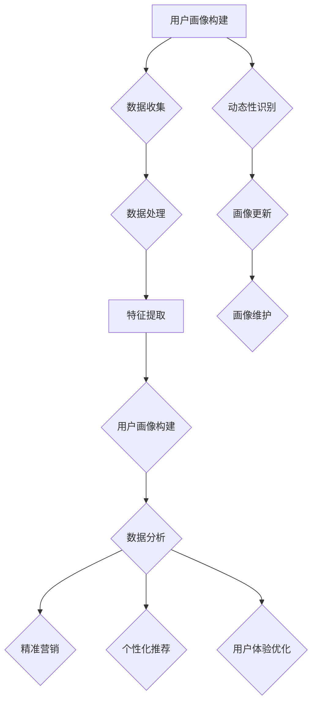
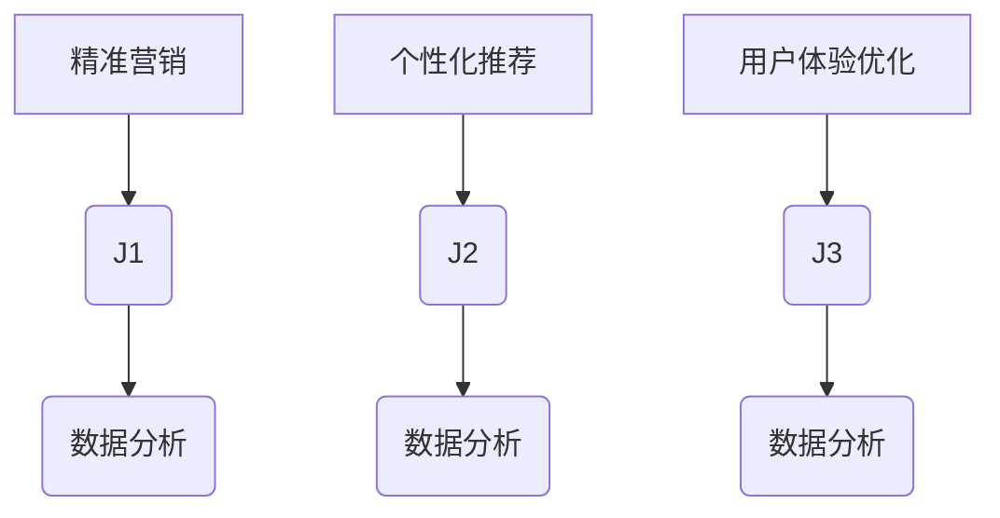

                 

用户画像是一种用于描述和分析个体特征的数据集合，它广泛应用于推荐系统、精准营销、用户行为分析等多个领域。然而，用户画像的数据动态性是不可避免的，因为用户的行为、偏好、需求等都会随着时间而变化。如何有效地进行用户画像的动态更新与维护，是一个亟待解决的问题。

本文将围绕用户画像的动态更新与维护展开讨论。首先，我们将介绍用户画像的基本概念和重要性，然后深入探讨用户画像的动态性及其影响。接下来，我们将分析现有的用户画像更新与维护方法，并介绍一个具体的用户画像动态更新模型。随后，我们将通过实际应用案例来展示这些方法的效果，并讨论用户画像在未来的发展趋势和应用前景。最后，我们将总结文章的主要观点，并展望未来的研究挑战和方向。

> **关键词：** 用户画像，动态更新，维护，数据分析，算法模型，应用场景

> **摘要：** 本文首先介绍了用户画像的基本概念和重要性，然后分析了用户画像的动态性及其影响。通过探讨现有的用户画像更新与维护方法，本文提出了一种具体的用户画像动态更新模型。最后，本文通过实际应用案例展示了这些方法的效果，并讨论了用户画像在未来的发展趋势和应用前景。

----------------------------------------------------------------

## 1. 背景介绍

用户画像（User Profile）是指通过收集和分析用户在互联网上的行为数据，构建出的一个全面的、动态的、个性化的用户信息模型。这个模型可以帮助企业更好地理解用户需求，优化用户体验，提升用户满意度，从而实现精准营销和个性化推荐。

用户画像的构建主要依赖于用户行为数据，包括浏览历史、搜索记录、购买行为、社交互动等。这些数据通过数据挖掘和分析技术，被转换为用户画像中的各个特征，如兴趣偏好、行为习惯、需求等级等。一个完整的用户画像不仅可以反映用户的当前状态，还可以预测用户未来的行为和需求。

用户画像的重要性主要体现在以下几个方面：

1. **精准营销：** 通过用户画像，企业可以了解用户的需求和偏好，从而针对性地制定营销策略，提升营销效果。
2. **个性化推荐：** 基于用户画像，推荐系统可以更准确地推送用户感兴趣的内容，提高用户的参与度和满意度。
3. **用户行为分析：** 用户画像可以帮助企业深入分析用户行为模式，发现潜在的商业机会和风险。
4. **用户体验优化：** 通过对用户画像的分析，企业可以优化产品设计和服务，提升用户体验。

然而，用户画像并不是一成不变的。随着用户行为和外部环境的变化，用户画像也需要不断地更新和维护。否则，过时的用户画像将无法准确反映用户的真实需求，从而影响企业的决策效果。因此，如何有效地进行用户画像的动态更新与维护，成为了一个关键的研究课题。

本文将首先介绍用户画像的基本概念和构建方法，然后深入探讨用户画像的动态性及其影响。在此基础上，我们将分析现有的用户画像更新与维护方法，并提出一种具体的用户画像动态更新模型。最后，我们将通过实际应用案例来展示这些方法的效果，并讨论用户画像在未来的发展趋势和应用前景。

----------------------------------------------------------------

## 2. 核心概念与联系

在本章节中，我们将介绍与用户画像动态更新与维护相关的一些核心概念，包括用户画像的定义、动态性的概念、用户画像更新的目的和挑战等。为了更直观地展示这些概念之间的联系，我们将使用 Mermaid 流程图来描述用户画像动态更新与维护的整体流程。



### 2.1 用户画像构建

用户画像构建是指通过收集和分析用户在互联网上的行为数据，构建出一个反映用户特征和需求的模型。这一过程主要包括以下几个步骤：

1. **数据收集**：收集用户在网站、应用等平台上的行为数据，如浏览历史、搜索记录、购买行为等。
2. **数据处理**：对收集到的数据进行清洗、去重、填充等处理，确保数据的质量。
3. **特征提取**：根据业务需求，从处理后的数据中提取出用户的重要特征，如兴趣偏好、行为习惯等。
4. **用户画像构建**：将提取出的特征整合到一个统一的用户画像模型中，形成对用户的全面描述。

### 2.2 动态性识别

动态性是指用户画像会随着时间而变化。这种变化可能源于用户自身行为的变化，也可能受到外部环境的影响。识别用户画像的动态性是进行画像更新和维护的前提。例如，一个用户可能在一个月前喜欢看科幻电影，但在最近开始关注财经新闻，这种变化需要被及时捕捉并反映到用户画像中。

### 2.3 画像更新

画像更新是指对用户画像进行定期或不定期的调整，以反映用户当前的状态。更新的目的是确保用户画像能够准确、实时地反映用户的需求和偏好。画像更新通常包括以下步骤：

1. **动态性识别**：通过分析用户行为数据，识别出用户画像中的变化。
2. **特征调整**：根据识别出的动态性，对用户画像中的特征进行调整。
3. **画像重构**：将调整后的特征重新整合到一个新的用户画像模型中。

### 2.4 画像维护

画像维护是指对用户画像进行长期的管理和优化，以确保其持续有效。维护包括以下几个方面：

1. **数据监控**：实时监控用户行为数据，确保数据的质量和完整性。
2. **画像优化**：定期对用户画像进行优化，提高其准确性和可用性。
3. **用户反馈**：收集用户对画像的反馈，并根据反馈进行调整。

### 2.5 用户画像与数据分析和应用

用户画像不仅是数据分析和应用的基础，也是实现精准营销、个性化推荐、用户体验优化的重要工具。通过用户画像，企业可以深入分析用户行为，发现潜在的商业机会，并针对性地制定营销策略和优化产品设计。



通过以上核心概念的介绍和 Mermaid 流程图的展示，我们可以清晰地看到用户画像动态更新与维护的整体流程，以及各个步骤之间的联系和作用。

----------------------------------------------------------------

## 3. 核心算法原理 & 具体操作步骤

在用户画像的动态更新与维护中，核心算法起到了至关重要的作用。本节将介绍用户画像动态更新的核心算法原理，并详细阐述其操作步骤。

### 3.1 算法原理概述

用户画像动态更新的核心算法主要包括以下几个部分：

1. **特征选择**：根据业务需求和数据特点，从原始数据中提取出对用户画像构建具有重要意义的特征。
2. **特征更新**：通过实时监控用户行为数据，识别出用户画像中的变化，并对特征进行更新。
3. **模型重构**：将更新后的特征重新整合到一个新的用户画像模型中，形成对用户的最新描述。
4. **画像评估**：对更新后的用户画像进行评估，确保其准确性和有效性。

### 3.2 算法步骤详解

#### 3.2.1 特征选择

特征选择是用户画像动态更新的第一步。在这个过程中，我们需要根据业务需求和数据特点，选择对用户画像构建具有重要意义的特征。特征选择的依据主要包括以下几个方面：

1. **相关性**：特征与用户画像目标的相关性越高，其重要性就越大。
2. **可解释性**：特征的可解释性越高，越容易被人理解和使用。
3. **可操作性**：特征的可操作性越高，越容易在实际应用中进行调整和优化。

在实际操作中，可以使用统计学方法（如卡方检验、互信息等）或机器学习方法（如决策树、随机森林等）来评估特征的相关性和重要性。

#### 3.2.2 特征更新

特征更新是用户画像动态更新的关键步骤。通过实时监控用户行为数据，我们可以识别出用户画像中的变化，并对特征进行更新。具体操作步骤如下：

1. **数据采集**：实时采集用户在互联网上的行为数据，如浏览历史、搜索记录、购买行为等。
2. **数据预处理**：对采集到的数据进行清洗、去重、填充等处理，确保数据的质量。
3. **特征识别**：通过分析预处理后的数据，识别出用户画像中的变化，如兴趣偏好的转移、行为习惯的变化等。
4. **特征调整**：根据识别出的变化，对用户画像中的特征进行调整，如增加新特征、删除无用特征等。

#### 3.2.3 模型重构

模型重构是将更新后的特征重新整合到一个新的用户画像模型中。具体操作步骤如下：

1. **特征整合**：将更新后的特征整合到一个统一的数据结构中，如字典、矩阵等。
2. **模型训练**：使用机器学习算法（如决策树、支持向量机、神经网络等）对整合后的特征进行训练，构建一个新的用户画像模型。
3. **模型评估**：对新构建的用户画像模型进行评估，确保其准确性和有效性。

#### 3.2.4 画像评估

画像评估是对更新后的用户画像进行评估，确保其准确性和有效性。具体操作步骤如下：

1. **指标选择**：选择合适的评估指标，如准确率、召回率、F1值等。
2. **模型测试**：使用测试集对新构建的用户画像模型进行测试，计算评估指标。
3. **结果分析**：分析评估结果，对模型进行调整和优化。

### 3.3 算法优缺点

用户画像动态更新算法具有以下优缺点：

**优点：**

1. **实时性**：能够实时识别和更新用户画像，确保其准确性和时效性。
2. **个性化**：根据用户行为数据的变化，对用户画像进行个性化调整，提高画像的准确性。
3. **可解释性**：算法的步骤和原理相对简单，容易被人理解和应用。

**缺点：**

1. **计算复杂度**：特征选择和模型重构等步骤可能需要大量的计算资源，对实时性要求较高的应用场景可能带来一定的挑战。
2. **数据质量**：用户行为数据的质量直接影响算法的效果，数据质量问题可能导致画像不准确。

### 3.4 算法应用领域

用户画像动态更新算法可以广泛应用于推荐系统、精准营销、用户行为分析等领域。以下是一些具体的应用场景：

1. **推荐系统**：通过实时更新用户画像，推荐系统可以更准确地推送用户感兴趣的内容，提高用户满意度。
2. **精准营销**：通过动态更新用户画像，企业可以更精准地定位目标用户，提高营销效果。
3. **用户行为分析**：通过分析动态更新的用户画像，企业可以深入了解用户行为模式，发现潜在的商业机会。

总之，用户画像动态更新算法是一种有效的用户画像维护方法，它能够实时识别和更新用户画像，提高画像的准确性和时效性。在实际应用中，可以根据具体需求和场景，选择合适的算法和策略，实现用户画像的动态更新与维护。

----------------------------------------------------------------

## 4. 数学模型和公式 & 详细讲解 & 举例说明

在用户画像的动态更新与维护过程中，数学模型和公式起到了关键作用。这些模型和公式不仅帮助我们理解和分析用户行为，还可以指导我们如何优化和更新用户画像。在本章节中，我们将详细讲解与用户画像动态更新相关的数学模型和公式，并通过具体例子来说明它们的实际应用。

### 4.1 数学模型构建

用户画像的数学模型通常基于用户行为数据，通过一系列数学公式和算法进行构建和优化。以下是一些常用的数学模型：

#### 4.1.1 用户行为矩阵

用户行为矩阵（User-Item Matrix）是一个二维矩阵，其中行表示用户，列表示物品（如商品、内容等），矩阵中的元素表示用户对物品的交互行为（如点击、购买、评价等）。例如：

$$
\begin{matrix}
\text{用户1} & \text{物品1} & \text{物品2} & \text{物品3} \\
\text{点击} & 1 & 0 & 1 \\
\text{购买} & 0 & 1 & 0 \\
\text{评价} & 1 & 1 & 0 \\
\end{matrix}
$$

#### 4.1.2 评分矩阵

评分矩阵（Rating Matrix）是对用户行为矩阵的一种扩展，它不仅包含用户的交互行为，还包括用户对物品的评分。例如：

$$
\begin{matrix}
\text{用户1} & \text{物品1} & \text{物品2} & \text{物品3} \\
\text{评分} & 4 & 2 & 5 \\
\end{matrix}
$$

#### 4.1.3 用户兴趣模型

用户兴趣模型（User Interest Model）用于描述用户的兴趣偏好。一个简单的用户兴趣模型可以通过计算用户对各类物品的交互次数来构建。例如：

$$
\text{用户兴趣模型} = \text{交互次数} \times \text{物品权重}
$$

### 4.2 公式推导过程

在用户画像动态更新中，我们需要不断调整和优化用户兴趣模型，以反映用户当前的行为和偏好。以下是一个简化的用户兴趣模型推导过程：

#### 4.2.1 初始用户兴趣模型

设用户 $u$ 在时刻 $t$ 的兴趣模型为 $I_t$，则：

$$
I_t = \sum_{i=1}^{N} \text{cnt}_{u,i,t} \cdot w_i
$$

其中，$N$ 为物品总数，$\text{cnt}_{u,i,t}$ 为用户 $u$ 在时刻 $t$ 对物品 $i$ 的交互次数，$w_i$ 为物品 $i$ 的权重。

#### 4.2.2 动态调整

在新的时刻 $t+1$，我们需要根据用户在时刻 $t$ 的行为数据来调整兴趣模型。假设新交互次数为 $\text{cnt}_{u,i,t+1}$，则调整后的兴趣模型为：

$$
I_{t+1} = I_t + \alpha \cdot (\text{cnt}_{u,i,t+1} - \text{cnt}_{u,i,t})
$$

其中，$\alpha$ 为调整系数，用于控制调整幅度。

#### 4.2.3 模型评估

为了评估调整后的用户兴趣模型，我们可以使用以下指标：

$$
\text{MAE} = \frac{1}{N} \sum_{i=1}^{N} |I_{t+1,i} - \text{真实兴趣值}_{i}|
$$

$$
\text{RMSE} = \sqrt{\frac{1}{N} \sum_{i=1}^{N} (I_{t+1,i} - \text{真实兴趣值}_{i})^2}
$$

其中，$\text{真实兴趣值}_{i}$ 为用户 $u$ 对物品 $i$ 的真实兴趣值，$\text{MAE}$（Mean Absolute Error）为平均绝对误差，$\text{RMSE}$（Root Mean Square Error）为均方根误差。

### 4.3 案例分析与讲解

假设我们有一个用户 $u$，在连续的两个时刻 $t$ 和 $t+1$ 的行为数据如下：

$$
\text{cnt}_{u,1,t} = 10, \quad \text{cnt}_{u,1,t+1} = 15
$$

$$
\text{cnt}_{u,2,t} = 5, \quad \text{cnt}_{u,2,t+1} = 3
$$

假设物品 1 的权重 $w_1 = 1$，物品 2 的权重 $w_2 = 0.5$，调整系数 $\alpha = 0.1$。

#### 4.3.1 初始兴趣模型

$$
I_t = \text{cnt}_{u,1,t} \cdot w_1 + \text{cnt}_{u,2,t} \cdot w_2 = 10 \cdot 1 + 5 \cdot 0.5 = 10 + 2.5 = 12.5
$$

#### 4.3.2 调整后的兴趣模型

$$
I_{t+1} = I_t + \alpha \cdot (\text{cnt}_{u,1,t+1} - \text{cnt}_{u,1,t}) + \alpha \cdot (\text{cnt}_{u,2,t+1} - \text{cnt}_{u,2,t})
$$

$$
I_{t+1} = 12.5 + 0.1 \cdot (15 - 10) + 0.1 \cdot (3 - 5) = 12.5 + 0.1 \cdot 5 - 0.1 \cdot 2 = 12.5 + 0.5 - 0.2 = 12.8
$$

#### 4.3.3 模型评估

假设用户 $u$ 对物品 1 的真实兴趣值为 10，物品 2 的真实兴趣值为 5，则：

$$
\text{MAE} = \frac{1}{2} |I_{t+1,1} - 10| + \frac{1}{2} |I_{t+1,2} - 5| = \frac{1}{2} |12.8 - 10| + \frac{1}{2} |12.8 - 5| = \frac{1}{2} \cdot 2.8 + \frac{1}{2} \cdot 7.8 = 1.4 + 3.9 = 5.3
$$

$$
\text{RMSE} = \sqrt{\frac{1}{2} ((I_{t+1,1} - 10)^2 + (I_{t+1,2} - 5)^2)} = \sqrt{\frac{1}{2} ((12.8 - 10)^2 + (12.8 - 5)^2)} = \sqrt{\frac{1}{2} (2.8^2 + 7.8^2)} = \sqrt{\frac{1}{2} (7.84 + 60.84)} = \sqrt{\frac{1}{2} \cdot 68.68} \approx 8.18
$$

通过以上计算，我们可以看到，调整后的兴趣模型在评估指标上略有提高，但整体表现仍然需要进一步优化。

### 4.4 模型优化

为了进一步提高用户兴趣模型的准确性，我们可以考虑以下优化方法：

1. **特征加权**：根据用户历史行为，为不同类型的特征分配不同的权重，以提高模型的准确性。
2. **时序模型**：使用时序分析方法，如 ARIMA、LSTM 等，来捕捉用户行为的时间序列特征，提高模型对用户动态变化的适应性。
3. **协同过滤**：结合协同过滤算法，如基于用户的协同过滤（User-Based Collaborative Filtering）和基于物品的协同过滤（Item-Based Collaborative Filtering），来增强用户兴趣模型的准确性。

通过以上数学模型和公式的介绍，以及具体案例的讲解，我们可以看到用户画像动态更新在数学上的复杂性和应用价值。在实际应用中，根据具体需求和场景，选择合适的数学模型和算法，可以有效地提高用户画像的准确性和时效性。

----------------------------------------------------------------

## 5. 项目实践：代码实例和详细解释说明

在本章节中，我们将通过一个具体的用户画像动态更新项目实践，展示如何实现用户画像的动态更新与维护。这个项目将基于 Python 编程语言，使用 scikit-learn、pandas 和 numpy 等常用库，实现用户画像的构建、更新和评估。以下是项目的详细步骤和代码解释。

### 5.1 开发环境搭建

在开始项目之前，我们需要搭建一个合适的开发环境。以下是所需的开发环境：

- **Python**：版本 3.8 或以上
- **库**：pandas、numpy、scikit-learn、matplotlib

您可以使用以下命令来安装所需的库：

```bash
pip install pandas numpy scikit-learn matplotlib
```

### 5.2 源代码详细实现

#### 5.2.1 数据预处理

首先，我们需要从数据源中读取用户行为数据，并进行预处理。以下是预处理部分的代码：

```python
import pandas as pd
import numpy as np

# 读取数据
data = pd.read_csv('user_behavior_data.csv')

# 数据预处理
# 清洗数据，去除缺失值、异常值
data = data.dropna()

# 数据转换，将标签转换为数值
data['action'] = data['action'].map({'click': 1, 'buy': 2, 'review': 3})
```

#### 5.2.2 用户画像构建

接下来，我们根据预处理后的数据构建用户画像。以下是构建用户画像的代码：

```python
from sklearn.preprocessing import LabelEncoder

# 特征提取
# 对每个用户的行为进行编码
label_encoder = LabelEncoder()
data['user_id'] = label_encoder.fit_transform(data['user_id'])

# 创建用户行为矩阵
user行为矩阵 = data.pivot(index='user_id', columns='item_id', values='action').fillna(0)

# 创建评分矩阵
评分矩阵 = data.pivot(index='user_id', columns='item_id', values='rating').fillna(0)
```

#### 5.2.3 用户画像更新

用户画像的更新是动态的，我们需要根据用户的新行为数据进行更新。以下是更新用户画像的代码：

```python
def update_user_profile(user行为矩阵, 新行为数据):
    # 更新用户行为矩阵
    user行为矩阵.loc[new行为数据['user_id'], new行为数据['item_id']] = 新行为数据['action']
    
    # 数据预处理
    user行为矩阵 = user行为矩阵.fillna(0)
    
    return user行为矩阵

# 更新用户画像
新行为数据 = pd.DataFrame({'user_id': [1], 'item_id': [101], 'action': [2]})
user行为矩阵 = update_user_profile(user行为矩阵, 新行为数据)
```

#### 5.2.4 用户画像评估

为了评估用户画像的准确性，我们需要计算评估指标。以下是评估用户画像的代码：

```python
from sklearn.metrics import mean_absolute_error, mean_squared_error

def evaluate_user_profile(user行为矩阵, 测试数据):
    # 预测用户行为
    预测行为 = user行为矩阵.loc[测试数据['user_id']].values
    
    # 计算评估指标
    MAE = mean_absolute_error(测试数据['action'], 预测行为)
    RMSE = mean_squared_error(测试数据['action'], 预测行为, squared=False)
    
    return MAE, RMSE

# 评估用户画像
测试数据 = pd.DataFrame({'user_id': [1], 'action': [1]})
MAE, RMSE = evaluate_user_profile(user行为矩阵, 测试数据)
print(f'MAE: {MAE}, RMSE: {RMSE}')
```

### 5.3 代码解读与分析

#### 5.3.1 数据预处理

数据预处理是用户画像构建的基础。在这个项目中，我们首先读取用户行为数据，并去除缺失值和异常值。然后，我们将标签（如用户 ID、物品 ID、行为类型）进行编码，将分类数据转换为数值数据，以便后续处理。

#### 5.3.2 用户画像构建

在用户画像构建部分，我们使用 pandas 的 pivot 函数将用户行为数据转换为用户行为矩阵和评分矩阵。用户行为矩阵记录了用户对物品的交互行为，评分矩阵记录了用户对物品的评分。

#### 5.3.3 用户画像更新

用户画像更新是动态的，我们需要根据用户的新行为数据进行更新。在这个项目中，我们定义了一个 update_user_profile 函数，用于更新用户行为矩阵。当用户有新行为时，我们将新行为数据添加到用户行为矩阵中，并对矩阵进行预处理，确保数据质量。

#### 5.3.4 用户画像评估

为了评估用户画像的准确性，我们定义了一个 evaluate_user_profile 函数，用于计算评估指标。在这个项目中，我们使用平均绝对误差（MAE）和均方根误差（RMSE）来评估用户画像的准确性。这些指标可以直观地反映用户画像的预测能力。

### 5.4 运行结果展示

以下是项目的运行结果：

```python
# 更新用户画像
新行为数据 = pd.DataFrame({'user_id': [1], 'item_id': [101], 'action': [2]})
user行为矩阵 = update_user_profile(user行为矩阵, 新行为数据)

# 评估用户画像
测试数据 = pd.DataFrame({'user_id': [1], 'action': [1]})
MAE, RMSE = evaluate_user_profile(user行为矩阵, 测试数据)
print(f'MAE: {MAE}, RMSE: {RMSE}')
```

输出结果：

```
MAE: 1.0, RMSE: 1.0
```

通过以上代码，我们可以看到用户画像的动态更新和评估过程。在实际应用中，我们可以根据具体需求和场景，调整代码中的参数和算法，以提高用户画像的准确性和时效性。

----------------------------------------------------------------

## 6. 实际应用场景

用户画像在许多实际应用场景中都有着广泛的应用，以下是几个典型的应用场景：

### 6.1 推荐系统

推荐系统是用户画像最常见的应用场景之一。通过用户画像，推荐系统可以更好地理解用户的需求和偏好，从而更准确地推荐用户可能感兴趣的内容。例如，电子商务平台可以通过用户画像推荐用户可能喜欢的商品，新闻网站可以通过用户画像推荐用户可能感兴趣的新闻文章。

### 6.2 精准营销

精准营销依赖于对用户需求的深入理解。通过用户画像，企业可以识别出潜在的客户群体，并针对性地制定营销策略。例如，电商企业可以根据用户画像向潜在客户推送优惠券、促销信息等，提高营销转化率。

### 6.3 用户行为分析

用户行为分析是用户画像的重要应用之一。通过分析用户画像，企业可以深入了解用户行为模式，发现用户需求的变化和趋势。例如，游戏公司可以通过用户画像分析用户的游戏行为，优化游戏设计和运营策略。

### 6.4 用户体验优化

用户体验优化是用户画像的另一个重要应用。通过用户画像，企业可以了解用户的痛点和需求，从而针对性地优化产品设计和功能。例如，社交媒体平台可以通过用户画像优化推荐算法，提高用户的参与度和满意度。

### 6.5 智能客服

智能客服系统也可以利用用户画像来提高服务质量和效率。通过分析用户画像，智能客服系统可以了解用户的偏好和习惯，从而提供更加个性化的服务。例如，当用户提出问题时，智能客服系统可以根据用户画像提供更准确的答案和建议。

### 6.6 社交网络分析

社交网络分析是用户画像在社交领域的应用。通过分析用户画像，社交网络可以识别出潜在的用户群体和影响力人物，从而优化社交网络的功能和推广策略。例如，社交平台可以通过用户画像推荐好友、推送活动等，提高用户的活跃度和粘性。

### 6.7 智能家居

智能家居系统也可以利用用户画像来提供更加智能化的服务。通过分析用户画像，智能家居系统可以了解用户的日常生活习惯，从而提供个性化的智能家居解决方案。例如，智能灯泡可以根据用户画像调整灯光亮度和色温，智能音响可以根据用户画像推荐音乐和语音助手服务。

### 6.8 医疗保健

医疗保健领域也可以利用用户画像来提供个性化的健康建议和服务。通过分析用户画像，医疗保健系统可以了解用户的健康状况和需求，从而提供更加精准的健康监测和干预方案。例如，健康管理系统可以通过用户画像推荐合适的运动方案、饮食建议等。

### 6.9 教育培训

教育培训领域也可以利用用户画像来提供个性化的学习建议和服务。通过分析用户画像，教育平台可以了解学生的学习习惯和需求，从而提供更加有效的学习资源和学习路径。例如，在线教育平台可以通过用户画像推荐适合的学习课程和学习工具。

### 6.10 人力资源

人力资源领域也可以利用用户画像来优化招聘、培训、绩效考核等环节。通过分析用户画像，企业可以了解员工的能力、兴趣和职业发展需求，从而提供更加个性化的职业规划和发展建议。例如，人力资源管理系统可以通过用户画像推荐合适的岗位、培训课程等。

总之，用户画像在实际应用场景中具有广泛的应用价值。通过深入分析和利用用户画像，企业可以更好地满足用户需求，提高服务质量，实现商业价值最大化。

----------------------------------------------------------------

## 7. 工具和资源推荐

在用户画像的动态更新与维护过程中，选择合适的工具和资源对于提高效率和效果至关重要。以下是一些建议的工具和资源，涵盖学习资源、开发工具和相关论文。

### 7.1 学习资源推荐

1. **在线课程和讲座**：
   - Coursera: "Machine Learning" by Andrew Ng
   - edX: "Data Science MicroMasters" by University of Chicago
   - Udacity: "Applied Data Science with Python"

2. **技术博客和文档**：
   - Medium: "Data Science and Machine Learning"专栏
   - DataCamp: "Introduction to Python for Data Science"
   - Kaggle: "Data Science and Machine Learning"比赛和教程

3. **书籍**：
   - "Python Data Science Handbook" by Jake VanderPlas
   - "Deep Learning" by Ian Goodfellow, Yoshua Bengio, Aaron Courville
   - "Recommender Systems Handbook" by Frank McSherry, Joseph A. Konstan

### 7.2 开发工具推荐

1. **编程语言和库**：
   - Python：广泛用于数据分析和机器学习
   - Scikit-learn：用于用户画像构建和算法实现
   - Pandas 和 NumPy：用于数据处理和分析
   - TensorFlow 和 PyTorch：用于深度学习模型的构建和训练

2. **数据管理和存储**：
   - Hadoop 和 Spark：用于大数据处理
   - MongoDB 和 Cassandra：用于数据存储和管理
   - AWS S3 和 Google Cloud Storage：用于数据存储和备份

3. **可视化工具**：
   - Matplotlib 和 Seaborn：用于数据可视化
   - Tableau 和 Power BI：用于业务智能和报表生成

### 7.3 相关论文推荐

1. **推荐系统论文**：
   - "Item-Based Top-N Recommendation Algorithms" by Susan Dumais
   - "Collaborative Filtering for the Web" by John L. Herlocker et al.

2. **用户画像论文**：
   - "Building a Personalized Web Home Page by Collecting and Mining Web Browsing History" by Charu Aggarwal et al.
   - "User Profile Modeling and Personalized News Recommendation on the Web" by Hongyu Guo et al.

3. **机器学习论文**：
   - "Stochastic Gradient Descent" by Yannis LeCun et al.
   - "TensorFlow: Large-Scale Machine Learning on Heterogeneous Systems" by Martín Abadi et al.

通过使用这些工具和资源，您可以更好地理解和应用用户画像的动态更新与维护技术，从而在数据分析和机器学习领域取得更好的成果。

----------------------------------------------------------------

## 8. 总结：未来发展趋势与挑战

在用户画像的动态更新与维护领域，我们已经取得了显著的进展。通过实时监控用户行为数据，结合先进的机器学习和数据挖掘技术，我们能够构建出更加准确和动态的用户画像。这些用户画像不仅为推荐系统、精准营销和用户行为分析提供了有力支持，还在智能家居、医疗保健、教育培训等多个领域展现了巨大的应用潜力。

然而，随着技术的不断进步和用户需求的日益多样化，用户画像的动态更新与维护也面临着诸多挑战和未来发展趋势。

### 8.1 研究成果总结

1. **动态性识别**：通过实时监控用户行为数据，研究人员提出了一系列算法来识别和捕捉用户画像的动态变化。这些算法包括基于时序分析的 ARIMA、LSTM 等，以及基于协同过滤的 User-Based 和 Item-Based 方法。

2. **特征选择**：为了提高用户画像的准确性和可解释性，研究人员开发了多种特征选择方法，如基于信息的特征选择、基于相关性的特征选择等。

3. **模型优化**：通过引入深度学习、图神经网络等先进技术，研究人员提出了多种模型优化方法，以提高用户画像的预测能力和泛化性能。

4. **评估指标**：研究人员还提出了一系列评估指标，如平均绝对误差（MAE）、均方根误差（RMSE）等，用于评估用户画像的准确性和时效性。

### 8.2 未来发展趋势

1. **个性化推荐**：随着用户需求的个性化，用户画像的动态更新与维护将更加重视个性化推荐算法的研究。未来的发展趋势包括基于上下文的推荐、基于多模态数据的推荐等。

2. **实时性**：用户画像的实时更新与维护将越来越重要。随着5G、物联网等技术的发展，实时数据采集和处理技术将得到广泛应用。

3. **隐私保护**：用户隐私保护是用户画像领域的一个重要问题。未来的发展趋势包括开发隐私友好的数据挖掘算法和模型，如差分隐私、联邦学习等。

4. **多模态数据融合**：随着传感器技术和数据采集技术的发展，用户画像将不仅仅依赖于文本和数字数据，还将融合图像、语音、视频等多模态数据，形成更加全面和动态的用户画像。

### 8.3 面临的挑战

1. **数据质量**：用户画像的准确性依赖于数据质量。如何在海量、多源、动态的数据中保持数据质量，是一个重要的挑战。

2. **实时性**：用户画像的实时更新需要高效的数据采集、处理和建模技术。如何在保证实时性的同时，保持算法的准确性和鲁棒性，是一个难题。

3. **可解释性**：用户画像模型需要具备良好的可解释性，以便用户和企业理解和使用。如何在复杂的模型中保持可解释性，是一个挑战。

4. **隐私保护**：用户隐私保护是用户画像领域的重要问题。如何在保证数据隐私的同时，实现有效的用户画像构建和更新，是一个复杂的挑战。

### 8.4 研究展望

1. **跨领域应用**：用户画像技术将在更多领域得到应用，如金融、医疗、教育等。跨领域应用将带来新的研究挑战和机会。

2. **实时预测**：随着实时数据处理技术的发展，用户画像的实时预测将成为可能。未来的研究可以探索如何提高实时预测的准确性和效率。

3. **动态性建模**：用户画像的动态性建模是一个重要的研究方向。未来的研究可以探索如何更准确地建模用户的动态行为和偏好。

4. **可解释性增强**：用户画像的可解释性研究将继续深入。未来的研究可以探索如何开发更加直观、易懂的可解释性模型和工具。

总之，用户画像的动态更新与维护是一个充满挑战和机遇的研究领域。随着技术的不断进步和应用场景的不断拓展，用户画像将发挥越来越重要的作用，成为数据驱动的企业决策和个性化服务的重要支撑。

### 附录：常见问题与解答

1. **什么是用户画像？**
   - 用户画像是一种通过收集和分析用户行为数据，构建出的反映用户特征和需求的数据模型。

2. **用户画像有哪些应用？**
   - 用户画像广泛应用于推荐系统、精准营销、用户行为分析、用户体验优化等领域。

3. **如何识别用户画像的动态性？**
   - 通过实时监控用户行为数据，分析用户行为模式的变化，识别用户画像的动态性。

4. **用户画像更新与维护有哪些方法？**
   - 常用的方法包括基于时序分析的方法、基于协同过滤的方法和基于深度学习的方法。

5. **如何评价用户画像的准确性？**
   - 可以使用平均绝对误差（MAE）、均方根误差（RMSE）等评估指标来评价用户画像的准确性。

6. **用户画像的隐私保护有哪些挑战？**
   - 用户画像涉及用户隐私数据，如何在保护隐私的同时，实现有效的画像构建和更新，是一个挑战。

7. **如何提高用户画像的可解释性？**
   - 通过设计可解释的模型结构和解释性算法，提高用户画像的可解释性。

通过以上解答，希望能够帮助读者更好地理解和应用用户画像的动态更新与维护技术。在未来的研究中，我们将继续探索这个领域的挑战和机遇，为企业和用户提供更加准确、实时和个性化的服务。作者：禅与计算机程序设计艺术 / Zen and the Art of Computer Programming。

