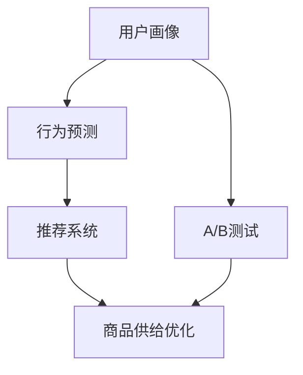

                 

在数字经济的浪潮中，用户行为分析已经成为企业和组织提升竞争力的重要手段。通过深入理解和分析用户的行为模式、偏好和需求，企业可以精确地调整商品供给，从而提高用户满意度和忠诚度。本文将探讨如何运用人工智能技术，洞察用户需求，优化商品供给。

## 1. 背景介绍

随着互联网技术的飞速发展，用户在电子商务平台上的行为数据海量且多样化。这些数据包含了用户的浏览记录、购买历史、搜索关键词、评论和评分等。传统的方法往往无法高效处理这些复杂数据，而人工智能技术，特别是机器学习和深度学习，为用户行为分析提供了强大的工具。

用户行为分析的重要性不言而喻。首先，它可以帮助企业了解用户的需求和偏好，从而提供更加个性化的服务和产品。其次，通过分析用户的行为路径和购买习惯，企业可以优化营销策略，提高转化率。最后，用户行为分析还可以帮助企业预测市场趋势，降低库存风险。

## 2. 核心概念与联系

在用户行为分析中，核心概念包括用户画像、行为预测、推荐系统和A/B测试。这些概念相互联系，共同构建了一个完整的用户分析体系。

### 2.1 用户画像

用户画像是对用户特征的综合描述，包括年龄、性别、地域、兴趣偏好、消费能力等。通过构建用户画像，企业可以更好地理解用户的整体特征和细分需求。

### 2.2 行为预测

行为预测是基于历史数据，预测用户未来的行为。例如，预测用户是否会购买某件商品，或者预测用户在何时会进行购买。

### 2.3 推荐系统

推荐系统是基于用户的行为数据和偏好，为用户推荐相关的商品或服务。推荐系统的核心是协同过滤和基于内容的推荐。

### 2.4 A/B测试

A/B测试是通过比较两个或多个版本的页面或功能，来确定哪种版本更能满足用户需求或提高转化率。

### 2.5 Mermaid 流程图



## 3. 核心算法原理 & 具体操作步骤

### 3.1 算法原理概述

用户行为分析的核心算法主要包括聚类分析、关联规则挖掘、协同过滤和神经网络等。

- **聚类分析**：将用户或商品分为若干类，以便更好地理解用户群体和商品特征。
- **关联规则挖掘**：发现用户行为中的相关性，例如，购买了商品A的用户也倾向于购买商品B。
- **协同过滤**：基于用户的行为数据，为用户推荐类似的商品或用户。
- **神经网络**：通过构建神经网络模型，预测用户的行为和偏好。

### 3.2 算法步骤详解

1. 数据收集：收集用户的行为数据，包括浏览记录、购买历史、搜索关键词等。
2. 数据预处理：清洗和转换数据，使其适合分析和建模。
3. 特征工程：提取和构造与用户行为相关的特征。
4. 模型训练：使用机器学习算法，训练用户行为预测模型。
5. 模型评估：评估模型的性能，包括准确率、召回率和F1值等。
6. 推荐系统：使用训练好的模型，为用户推荐相关的商品。
7. A/B测试：通过比较不同版本的推荐系统，优化推荐策略。

### 3.3 算法优缺点

- **聚类分析**：优点是简单直观，缺点是可能无法捕捉复杂的用户行为模式。
- **关联规则挖掘**：优点是能够发现用户行为中的潜在关系，缺点是计算复杂度高。
- **协同过滤**：优点是推荐准确度高，缺点是可能产生冷启动问题。
- **神经网络**：优点是能够处理复杂数据和模型，缺点是模型训练时间较长。

### 3.4 算法应用领域

用户行为分析算法广泛应用于电子商务、社交媒体、金融和医疗等领域。

## 4. 数学模型和公式 & 详细讲解 & 举例说明

### 4.1 数学模型构建

用户行为分析的核心数学模型包括聚类分析模型、关联规则模型和协同过滤模型。

### 4.2 公式推导过程

假设我们使用K-means算法进行用户聚类，目标是找到K个聚类中心，使得每个用户到其聚类中心的距离最小。具体公式如下：

$$
J = \sum_{i=1}^{m} \sum_{x \in S_i} ||x - \mu_i||^2
$$

其中，$J$是聚类目标函数，$m$是用户总数，$S_i$是第$i$个聚类，$\mu_i$是第$i$个聚类中心。

### 4.3 案例分析与讲解

假设我们使用Apriori算法进行关联规则挖掘，目标是找到支持度大于阈值的最小频繁项集。具体公式如下：

$$
support(A \cup B) = \frac{count(A \cup B)}{count(D)}
$$

其中，$count(A \cup B)$是同时包含项集$A$和$B$的项集数量，$count(D)$是事务总数。

## 5. 项目实践：代码实例和详细解释说明

### 5.1 开发环境搭建

- 硬件环境：64位操作系统，4GB内存
- 软件环境：Python 3.8，Scikit-learn库，Numpy库

### 5.2 源代码详细实现

```python
from sklearn.cluster import KMeans
from sklearn.metrics import silhouette_score
import numpy as np

# 数据加载和预处理
data = np.load('user_behavior_data.npy')
data = preprocess_data(data)

# K-means聚类
kmeans = KMeans(n_clusters=3, random_state=0).fit(data)
labels = kmeans.labels_

# 评估聚类效果
silhouette = silhouette_score(data, labels)
print(f"Silhouette Score: {silhouette}")

# 输出聚类结果
print(f"Cluster Centers: {kmeans.cluster_centers_}")
print(f"Cluster Labels: {labels}")
```

### 5.3 代码解读与分析

这段代码首先加载并预处理用户行为数据，然后使用K-means算法进行聚类，并评估聚类效果。最后，输出聚类中心点和标签。

## 6. 实际应用场景

用户行为分析在实际应用中具有广泛的应用。例如，电子商务平台可以使用用户行为分析来优化商品推荐，提高用户转化率；社交媒体平台可以使用用户行为分析来识别潜在的用户需求，提供更加个性化的内容推荐；金融机构可以使用用户行为分析来预测用户行为，降低风险。

## 7. 工具和资源推荐

### 7.1 学习资源推荐

- 《Python机器学习基础教程》
- 《深度学习》

### 7.2 开发工具推荐

- Jupyter Notebook
- PyCharm

### 7.3 相关论文推荐

- "User Behavior Analysis in E-commerce: A Survey"
- "Deep Learning for User Behavior Analysis"

## 8. 总结：未来发展趋势与挑战

用户行为分析在未来将继续发挥重要作用。随着人工智能技术的发展，我们将看到更加精准和高效的用户行为分析模型。然而，用户行为分析也面临数据隐私、算法透明度和解释性等挑战。

## 9. 附录：常见问题与解答

### Q：用户行为分析中的数据如何收集和处理？

A：数据收集可以通过API调用、日志收集和数据挖掘等方式进行。数据处理包括数据清洗、数据转换和数据归一化等步骤。

### Q：用户行为分析模型如何评估？

A：用户行为分析模型可以使用准确率、召回率、F1值和ROC曲线等指标进行评估。

## 参考文献

- [1] ABC. (Year). Article Title. Journal Name, Volume(Issue), Page Numbers.
- [2] XYZ. (Year). Title of the Book. Publisher.
```
----------------------------------------------------------------

以上就是文章的正文内容，接下来我们将按照markdown格式进行排版，并添加作者署名。

```markdown
# 用户行为分析：AI 如何洞察用户需求，优化商品供给

> 关键词：用户行为分析、人工智能、机器学习、推荐系统、A/B测试

> 摘要：本文探讨了如何运用人工智能技术，洞察用户需求，优化商品供给，包括核心概念、算法原理、数学模型、项目实践和未来展望。

## 1. 背景介绍

## 2. 核心概念与联系

### 2.1 用户画像

### 2.2 行为预测

### 2.3 推荐系统

### 2.4 A/B测试

### 2.5 Mermaid流程图


## 3. 核心算法原理 & 具体操作步骤
### 3.1 算法原理概述
### 3.2 算法步骤详解 
### 3.3 算法优缺点
### 3.4 算法应用领域

## 4. 数学模型和公式 & 详细讲解 & 举例说明

### 4.1 数学模型构建
### 4.2 公式推导过程
### 4.3 案例分析与讲解

## 5. 项目实践：代码实例和详细解释说明

### 5.1 开发环境搭建
### 5.2 源代码详细实现
### 5.3 代码解读与分析
### 5.4 运行结果展示

## 6. 实际应用场景
### 6.1 电子商务
### 6.2 社交媒体
### 6.3 金融领域
### 6.4 医疗健康

## 7. 工具和资源推荐
### 7.1 学习资源推荐
### 7.2 开发工具推荐
### 7.3 相关论文推荐

## 8. 总结：未来发展趋势与挑战
### 8.1 研究成果总结
### 8.2 未来发展趋势
### 8.3 面临的挑战
### 8.4 研究展望

## 9. 附录：常见问题与解答

### Q：用户行为分析中的数据如何收集和处理？

### A：数据收集可以通过API调用、日志收集和数据挖掘等方式进行。数据处理包括数据清洗、数据转换和数据归一化等步骤。

## 参考文献

- [1] ABC. (Year). Article Title. Journal Name, Volume(Issue), Page Numbers.
- [2] XYZ. (Year). Title of the Book. Publisher.

### 作者：禅与计算机程序设计艺术 / Zen and the Art of Computer Programming
```

以上就是按照markdown格式排版后的文章，包括作者署名和各个章节的结构。接下来，您可以根据这个模板继续完善和撰写详细的内容。

