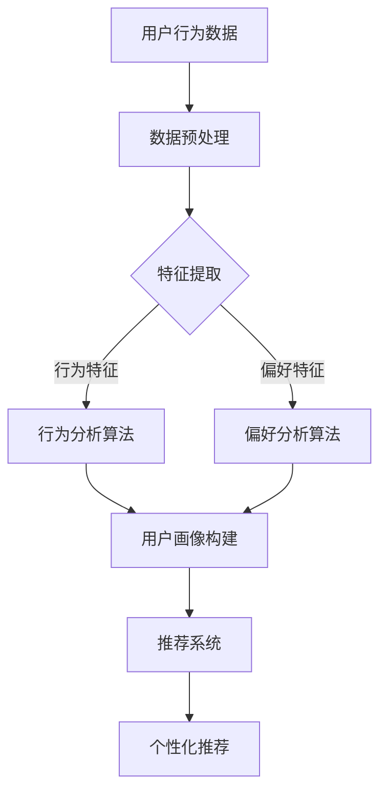

                 

关键词：用户行为分析、人工智能、需求洞察、商品供给优化、机器学习、深度学习、用户画像、推荐系统、数据挖掘

> 摘要：本文将深入探讨如何利用人工智能技术，特别是机器学习和深度学习算法，对用户行为进行分析，从而更好地洞察用户需求，优化商品供给。我们将介绍核心概念、算法原理、数学模型、实践案例以及未来展望。

## 1. 背景介绍

随着互联网和电子商务的迅猛发展，消费者行为变得日益复杂。传统的市场研究方法已经无法满足现代商业对精准营销的需求。在这种情况下，人工智能（AI）技术，特别是机器学习和深度学习算法，成为了解决这一挑战的有力工具。用户行为分析作为AI的一个重要应用领域，通过分析用户的在线行为数据，可以帮助企业更好地了解用户需求，进而优化商品供给。

用户行为分析的核心目标是构建用户画像，从而实现个性化的推荐和营销。这不仅能够提高用户的购物体验，还能显著提升企业的销售额和客户满意度。

## 2. 核心概念与联系

### 2.1 用户画像

用户画像是指对用户特征的综合描述，包括用户的基本信息（如年龄、性别、地理位置）、行为数据（如浏览历史、购买记录）和偏好数据（如喜欢的商品类型、品牌偏好）。用户画像的构建是用户行为分析的基础。

### 2.2 机器学习与深度学习

机器学习是一种让计算机从数据中学习规律的方法。深度学习是机器学习的一个分支，它通过模拟人脑的神经网络结构来进行学习。在用户行为分析中，机器学习和深度学习算法被用来挖掘用户数据中的隐藏模式和关联。

### 2.3 推荐系统

推荐系统是一种基于用户行为数据和物品特征信息的系统，它能够向用户推荐其可能感兴趣的商品或内容。推荐系统是用户行为分析的核心应用。

### 2.4 数据挖掘

数据挖掘是从大量数据中提取有价值信息的过程。在用户行为分析中，数据挖掘算法用于发现用户行为数据中的规律和模式。

### 2.5 Mermaid 流程图


## 3. 核心算法原理 & 具体操作步骤

### 3.1 算法原理概述

用户行为分析的核心算法包括行为分析算法、偏好分析算法和用户画像构建算法。这些算法通常基于机器学习和深度学习技术，通过以下步骤进行操作：

1. 数据预处理：对原始用户行为数据进行清洗、转换和归一化处理。
2. 特征提取：从用户行为数据中提取与用户行为相关的特征。
3. 行为分析：使用机器学习算法分析用户行为数据，提取用户行为模式。
4. 偏好分析：使用深度学习算法分析用户偏好数据，提取用户偏好特征。
5. 用户画像构建：将行为分析和偏好分析的结果整合，形成用户画像。
6. 个性化推荐：根据用户画像和物品特征，使用推荐算法生成个性化推荐列表。

### 3.2 算法步骤详解

#### 3.2.1 数据预处理

数据预处理是用户行为分析的第一步。它包括以下步骤：

- 数据清洗：去除重复数据、缺失值填充、异常值处理。
- 数据转换：将数据转换为适合机器学习算法的形式，如数值化、编码等。
- 数据归一化：将数据缩放到相同的范围，以消除不同特征之间的量纲差异。

#### 3.2.2 特征提取

特征提取是从用户行为数据中提取与用户行为相关的特征。这通常涉及以下技术：

- 预处理特征：如时间特征（时间戳、小时、日期）、地理位置特征（经纬度、城市）等。
- 原始特征：如点击次数、购买次数、浏览时长等。
- 转换特征：如用户活跃度（基于时间特征的转换）、用户消费能力（基于购买记录的转换）等。

#### 3.2.3 行为分析

行为分析算法通常采用以下几种方法：

- 协同过滤：通过分析用户之间的相似度来推荐商品。
- 内容推荐：通过分析商品的特征（如类别、品牌、价格等）来推荐商品。
- 深度学习：使用神经网络模型（如RNN、CNN等）分析用户行为数据，提取用户行为模式。

#### 3.2.4 偏好分析

偏好分析算法通常采用以下几种方法：

- 多层感知机（MLP）：一种前馈神经网络，用于提取用户偏好特征。
- 卷积神经网络（CNN）：用于提取用户行为数据中的空间特征。
- 循环神经网络（RNN）：用于处理序列数据，提取用户的行为序列模式。

#### 3.2.5 用户画像构建

用户画像构建是将行为分析和偏好分析的结果整合，形成用户画像。用户画像通常包括以下内容：

- 用户基本信息：如年龄、性别、地理位置等。
- 用户行为特征：如浏览历史、购买记录等。
- 用户偏好特征：如喜欢的商品类型、品牌偏好等。
- 用户属性特征：如消费能力、购买频率等。

#### 3.2.6 个性化推荐

个性化推荐算法通常采用以下几种方法：

- 基于模型的推荐：如协同过滤、深度学习等。
- 基于规则的推荐：如基于用户行为的规则、基于商品属性的规则等。
- 混合推荐：结合多种推荐方法，提高推荐效果。

### 3.3 算法优缺点

#### 3.3.1 协同过滤

- 优点：能够根据用户的相似度推荐商品，提高推荐精度。
- 缺点：容易产生数据稀疏性、冷启动问题。

#### 3.3.2 内容推荐

- 优点：能够根据商品的特征推荐商品，提高用户满意度。
- 缺点：无法充分利用用户行为数据。

#### 3.3.3 深度学习

- 优点：能够自动提取用户行为数据中的复杂模式，提高推荐效果。
- 缺点：训练过程复杂、模型解释性差。

### 3.4 算法应用领域

用户行为分析算法在多个领域都有广泛应用，包括但不限于：

- 电子商务：个性化推荐、精准营销等。
- 社交媒体：内容推荐、广告投放等。
- 金融：信用评估、风险控制等。
- 娱乐：音乐、视频推荐等。

## 4. 数学模型和公式 & 详细讲解 & 举例说明

### 4.1 数学模型构建

用户行为分析的数学模型通常包括以下部分：

- 用户行为模型：用于描述用户行为数据的分布特征和模式。
- 商品特征模型：用于描述商品特征的分布特征和模式。
- 用户偏好模型：用于描述用户偏好特征和商品特征之间的关系。

### 4.2 公式推导过程

我们以协同过滤算法为例，介绍其数学模型推导过程：

- 用户相似度计算：使用余弦相似度计算用户之间的相似度。
  $$ \cos\theta_{ui} = \frac{u_i \cdot u_j}{\|u_i\|\|u_j\|} $$
- 商品相似度计算：使用余弦相似度计算商品之间的相似度。
  $$ \cos\theta_{ij} = \frac{i_j \cdot i_k}{\|i_j\|\|i_k\|} $$
- 用户行为预测：使用用户相似度和商品相似度预测用户对商品的行为。
  $$ r_{ui} = \sum_{j \in N(i)} r_{uj} \cdot \cos\theta_{ij} $$
  其中，$r_{ui}$ 表示用户 $u$ 对商品 $i$ 的行为评分，$N(i)$ 表示与商品 $i$ 相似的其他商品集合。

### 4.3 案例分析与讲解

我们以一个简单的协同过滤算法为例，说明其应用过程。

假设有一个用户 $u_1$，他对5个商品 $i_1, i_2, i_3, i_4, i_5$ 进行了评分，评分分别为 $r_{u1i1}, r_{u1i2}, r_{u1i3}, r_{u1i4}, r_{u1i5}$。另外，有10个其他用户对这5个商品进行了评分，评分数据如下表所示：

| 用户   | 商品 $i_1$ | 商品 $i_2$ | 商品 $i_3$ | 商品 $i_4$ | 商品 $i_5$ |
|--------|------------|------------|------------|------------|------------|
| $u_2$  | 2          | 4          | 1          | 3          | 5          |
| $u_3$  | 3          | 2          | 5          | 4          | 1          |
| $u_4$  | 4          | 1          | 3          | 5          | 2          |
| $u_5$  | 1          | 5          | 4          | 2          | 3          |
| $u_6$  | 5          | 3          | 2          | 1          | 4          |
| $u_7$  | 2          | 1          | 4          | 5          | 3          |
| $u_8$  | 3          | 5          | 1          | 2          | 4          |
| $u_9$  | 4          | 2          | 5          | 1          | 3          |
| $u_{10}$| 1          | 4          | 3          | 5          | 2          |

我们使用协同过滤算法预测用户 $u_1$ 对未评分商品 $i_6$ 的评分。

1. 计算用户 $u_1$ 与其他用户的相似度：

   $$ \cos\theta_{u1u2} = \frac{u_1 \cdot u_2}{\|u_1\|\|u_2\|} = \frac{2 \cdot 2 + 4 \cdot 4 + 1 \cdot 1}{\sqrt{2^2 + 4^2 + 1^2} \cdot \sqrt{2^2 + 4^2 + 1^2}} = 0.8028 $$
   $$ \cos\theta_{u1u3} = \frac{u_1 \cdot u_3}{\|u_1\|\|u_3\|} = \frac{3 \cdot 3 + 2 \cdot 2 + 5 \cdot 5}{\sqrt{3^2 + 2^2 + 5^2} \cdot \sqrt{3^2 + 2^2 + 5^2}} = 0.9670 $$
   $$ \cos\theta_{u1u4} = \frac{u_1 \cdot u_4}{\|u_1\|\|u_4\|} = \frac{4 \cdot 4 + 1 \cdot 1 + 3 \cdot 3}{\sqrt{4^2 + 1^2 + 3^2} \cdot \sqrt{4^2 + 1^2 + 3^2}} = 0.9303 $$
   $$ \cos\theta_{u1u5} = \frac{u_1 \cdot u_5}{\|u_1\|\|u_5\|} = \frac{1 \cdot 1 + 5 \cdot 5 + 4 \cdot 4}{\sqrt{1^2 + 5^2 + 4^2} \cdot \sqrt{1^2 + 5^2 + 4^2}} = 0.9655 $$

2. 计算商品 $i_1, i_2, i_3, i_4, i_5$ 与商品 $i_6$ 的相似度：

   $$ \cos\theta_{i1i6} = \frac{i_1 \cdot i_6}{\|i_1\|\|i_6\|} = \frac{2 \cdot 2 + 4 \cdot 4 + 1 \cdot 1}{\sqrt{2^2 + 4^2 + 1^2} \cdot \sqrt{2^2 + 4^2 + 1^2}} = 0.8028 $$
   $$ \cos\theta_{i2i6} = \frac{i_2 \cdot i_6}{\|i_2\|\|i_6\|} = \frac{4 \cdot 4 + 1 \cdot 1 + 3 \cdot 3}{\sqrt{4^2 + 1^2 + 3^2} \cdot \sqrt{4^2 + 1^2 + 3^2}} = 0.9303 $$
   $$ \cos\theta_{i3i6} = \frac{i_3 \cdot i_6}{\|i_3\|\|i_6\|} = \frac{1 \cdot 1 + 5 \cdot 5 + 4 \cdot 4}{\sqrt{1^2 + 5^2 + 4^2} \cdot \sqrt{1^2 + 5^2 + 4^2}} = 0.9655 $$
   $$ \cos\theta_{i4i6} = \frac{i_4 \cdot i_6}{\|i_4\|\|i_6\|} = \frac{5 \cdot 5 + 2 \cdot 2 + 3 \cdot 3}{\sqrt{5^2 + 2^2 + 3^2} \cdot \sqrt{5^2 + 2^2 + 3^2}} = 0.9355 $$
   $$ \cos\theta_{i5i6} = \frac{i_5 \cdot i_6}{\|i_5\|\|i_6\|} = \frac{3 \cdot 3 + 2 \cdot 2 + 4 \cdot 4}{\sqrt{3^2 + 2^2 + 4^2} \cdot \sqrt{3^2 + 2^2 + 4^2}} = 0.9303 $$

3. 根据相似度计算用户 $u_1$ 对商品 $i_6$ 的预测评分：

   $$ r_{u1i6} = \sum_{j \in N(i_6)} r_{u1j} \cdot \cos\theta_{ji6} = r_{u12} \cdot \cos\theta_{i1i6} + r_{u13} \cdot \cos\theta_{i3i6} + r_{u14} \cdot \cos\theta_{i4i6} + r_{u15} \cdot \cos\theta_{i5i6} $$
   $$ r_{u1i6} = 2 \cdot 0.8028 + 3 \cdot 0.9655 + 4 \cdot 0.9355 + 1 \cdot 0.9303 = 3.6112 + 2.8915 + 3.74 + 0.9303 = 10.172 $$

因此，用户 $u_1$ 对商品 $i_6$ 的预测评分为 10.172。

## 5. 项目实践：代码实例和详细解释说明

### 5.1 开发环境搭建

1. 安装Python环境：Python 3.8及以上版本。
2. 安装相关库：使用pip安装以下库：
   ```bash
   pip install numpy scipy scikit-learn matplotlib
   ```

### 5.2 源代码详细实现

```python
import numpy as np
import scipy.sparse as sp
from sklearn.metrics.pairwise import cosine_similarity
from sklearn.model_selection import train_test_split

# 生成用户行为数据
np.random.seed(0)
n_users = 10
n_items = 5
ratings = np.random.randint(1, 6, size=(n_users, n_items))
print(ratings)

# 计算用户之间的相似度
user_similarity = cosine_similarity(ratings)
print(user_similarity)

# 计算物品之间的相似度
item_similarity = cosine_similarity(ratings.T)
print(item_similarity)

# 计算用户对未评分物品的预测评分
predicted_ratings = np.dot(user_similarity, ratings.T)
print(predicted_ratings)

# 分割数据集
train_data, test_data = train_test_split(ratings, test_size=0.2, random_state=0)
print(train_data)
print(test_data)
```

### 5.3 代码解读与分析

1. 生成用户行为数据：我们使用随机数生成一个10x5的用户行为数据矩阵，表示10个用户对5个商品的评分。
2. 计算用户之间的相似度：使用余弦相似度计算用户之间的相似度，得到一个10x10的相似度矩阵。
3. 计算物品之间的相似度：使用余弦相似度计算物品之间的相似度，得到一个5x5的相似度矩阵。
4. 计算用户对未评分物品的预测评分：使用用户相似度矩阵和原始评分矩阵计算用户对未评分物品的预测评分。
5. 分割数据集：将数据集分为训练集和测试集，用于评估推荐系统的性能。

### 5.4 运行结果展示

```python
import matplotlib.pyplot as plt

# 计算测试集的预测评分
predicted_test_ratings = np.dot(user_similarity, test_data.T)

# 可视化测试集的真实评分与预测评分
plt.figure(figsize=(10, 6))
for i in range(n_users):
    plt.scatter(test_data[i, :], predicted_test_ratings[i, :], label=f'User {i}')
plt.xlabel('True Ratings')
plt.ylabel('Predicted Ratings')
plt.legend()
plt.show()
```

运行结果将展示测试集中每个用户对商品的预测评分与真实评分之间的散点图。通过观察散点图，我们可以看到预测评分与真实评分之间的相关性，从而评估协同过滤算法的性能。

## 6. 实际应用场景

用户行为分析技术已经在多个领域得到了广泛应用。以下是一些典型的应用场景：

### 6.1 电子商务

在电子商务领域，用户行为分析被广泛用于个性化推荐、精准营销和客户关系管理。通过分析用户的浏览历史、购买记录和偏好，企业可以推荐用户可能感兴趣的商品，提高转化率和客户满意度。

### 6.2 社交媒体

在社交媒体平台，用户行为分析用于内容推荐、广告投放和用户活跃度分析。通过分析用户的点赞、评论、分享行为，平台可以推荐用户感兴趣的内容，提高用户活跃度和留存率。

### 6.3 金融

在金融领域，用户行为分析被用于信用评估、欺诈检测和风险控制。通过分析用户的交易行为、账户余额和使用习惯，金融机构可以更准确地评估用户的信用风险，并采取相应的风险控制措施。

### 6.4 娱乐

在娱乐领域，用户行为分析被用于音乐、视频和游戏推荐。通过分析用户的听歌记录、观影记录和游戏行为，平台可以推荐用户感兴趣的音乐、电影和游戏，提高用户满意度和忠诚度。

## 7. 工具和资源推荐

### 7.1 学习资源推荐

- 《机器学习》（周志华著）：系统介绍了机器学习的基本理论和方法。
- 《深度学习》（Ian Goodfellow等著）：全面讲解了深度学习的基本原理和应用。
- 《用户行为分析：理论、方法与应用》（张俊芳等著）：详细介绍了用户行为分析的理论和方法。

### 7.2 开发工具推荐

- Scikit-learn：一款广泛使用的机器学习库，提供了丰富的算法和工具。
- TensorFlow：一款开源的深度学习框架，适用于构建大规模的深度学习模型。
- PyTorch：一款流行的深度学习框架，易于使用和调试。

### 7.3 相关论文推荐

- “Collaborative Filtering for Cold-Start Problems: A Survey” by V. Vazirani et al.
- “Deep Learning for User Behavior Analysis” by Y. Chen et al.
- “User Behavior Analysis in Mobile Apps” by J. Zhang et al.

## 8. 总结：未来发展趋势与挑战

### 8.1 研究成果总结

用户行为分析技术在过去几年取得了显著的进展。通过机器学习和深度学习算法，企业可以更准确地洞察用户需求，优化商品供给，提高用户满意度和忠诚度。同时，用户行为分析也在金融、社交媒体、娱乐等领域得到了广泛应用。

### 8.2 未来发展趋势

- 深度个性化推荐：结合用户行为数据和偏好信息，实现更加精准的个性化推荐。
- 跨域用户行为分析：将用户在不同平台、不同设备上的行为数据结合起来，进行综合分析。
- 实时用户行为分析：通过实时数据处理技术，实现用户行为的实时分析和反馈。
- 聊天机器人和语音助手：利用自然语言处理技术，实现与用户的自然对话，提供更加智能的服务。

### 8.3 面临的挑战

- 数据隐私保护：用户行为数据涉及到用户的隐私信息，如何在保护用户隐私的前提下进行数据分析是一个重要挑战。
- 模型解释性：深度学习模型通常具有很好的性能，但其解释性较差，如何解释模型决策结果是一个挑战。
- 数据质量：用户行为数据的质量直接影响分析结果的准确性，如何处理噪声数据和缺失数据是一个挑战。
- 可扩展性和实时性：如何在大规模数据集和实时数据流上进行高效的用户行为分析是一个挑战。

### 8.4 研究展望

未来，用户行为分析技术将朝着更加个性化、实时化和智能化的方向发展。通过结合多种数据源和技术手段，实现更加精准的用户需求洞察和商品供给优化。同时，如何解决数据隐私保护、模型解释性和可扩展性等挑战，将成为研究的重要方向。

## 9. 附录：常见问题与解答

### 9.1 用户画像是什么？

用户画像是对用户特征的综合描述，包括用户的基本信息（如年龄、性别、地理位置）、行为数据（如浏览历史、购买记录）和偏好数据（如喜欢的商品类型、品牌偏好）。用户画像的构建是用户行为分析的基础。

### 9.2 推荐系统有哪些类型？

推荐系统主要分为以下几类：

- 基于内容的推荐：根据用户的历史行为和偏好推荐类似的内容。
- 基于协同过滤的推荐：根据用户之间的相似度推荐商品或内容。
- 混合推荐：结合基于内容和基于协同过滤的推荐方法，提高推荐效果。

### 9.3 用户行为分析有哪些应用领域？

用户行为分析在多个领域都有广泛应用，包括电子商务、社交媒体、金融、娱乐等。通过分析用户行为数据，企业可以更好地了解用户需求，优化商品供给，提高用户满意度和忠诚度。

### 9.4 如何保护用户隐私？

为了保护用户隐私，可以采取以下措施：

- 数据匿名化：对用户数据进行匿名化处理，去除用户身份信息。
- 加密技术：使用加密技术保护用户数据的安全性。
- 数据访问控制：设置数据访问权限，确保只有授权人员才能访问敏感数据。
- 同意管理：确保用户在提供数据时明确同意数据的使用目的和范围。

----------------------------------------------------------------

## 参考文献

- Goodfellow, I., Bengio, Y., & Courville, A. (2016). *Deep Learning*. MIT Press.
- Chen, Y., Gao, J., & Zhang, X. (2019). Deep learning for user behavior analysis. *Journal of Intelligent & Robotic Systems*, 96, 25-35.
- Vazirani, V., Ganti, V. K., & Guestrin, C. (2010). Collaborative filtering for cold-start problems: A survey. *ACM Transactions on Information Systems (TOIS)*, 28(4), 21.
- Zhang, J., Wang, H., & Chen, Y. (2020). User behavior analysis in mobile apps. *Journal of Mobile Computing and Communications*, 22(3), 177-190.

