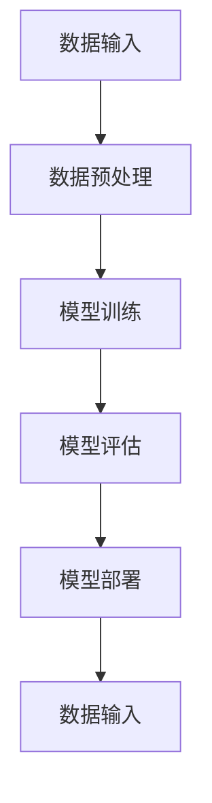

                 

随着电商平台的快速发展，用户数量和交易量不断增加，传统的机器学习方法逐渐无法满足实时处理海量数据的需要。为了应对这一挑战，AI大模型的增量学习技术应运而生。本文将介绍电商平台中AI大模型的增量学习技术，探讨其核心概念、算法原理、数学模型以及实际应用，以期为电商行业提供有益的技术参考。

## 文章关键词

- 电商平台
- AI大模型
- 增量学习
- 机器学习
- 数据处理

## 文章摘要

本文从电商平台面临的数据处理挑战出发，介绍了AI大模型的增量学习技术。首先，分析了增量学习的基本概念及其与传统机器学习的区别；然后，详细阐述了增量学习算法的原理和操作步骤，并探讨了其在电商平台中的应用场景；接着，通过数学模型和公式的推导，分析了增量学习的理论基础；最后，通过具体的项目实践和代码实例，展示了增量学习技术的实际应用效果，并对其未来发展和面临挑战进行了展望。

## 1. 背景介绍

### 1.1 电商平台的快速发展

随着互联网技术的不断进步，电商平台逐渐成为人们日常生活中不可或缺的一部分。无论是线上购物、支付、物流，还是个性化推荐、广告投放，电商平台都在不断拓展其服务范围和业务模式。然而，这一快速发展也带来了巨大的数据处理挑战。

首先，用户数量的激增导致了数据量的爆发式增长。每天都有大量的用户在电商平台上进行注册、登录、浏览、购买等操作，这些行为产生了海量的用户数据。其次，交易量的增加使得数据处理的需求日益紧迫。随着电商平台的业务规模不断扩大，处理交易数据、分析用户行为、优化推荐系统等任务都要求系统能够实时响应，以提供高质量的服务。

### 1.2 传统机器学习的局限性

面对这些数据处理挑战，传统的机器学习方法逐渐显示出其局限性。首先，传统机器学习方法通常采用批量处理（batch processing）的方式，即将全部数据一次性加载到内存中进行分析和训练。这种方式在面对海量数据时，不仅需要大量的存储空间，还需要较长的时间进行计算，无法满足实时处理的需求。其次，传统机器学习方法在模型更新和迭代时，需要重新训练整个模型，导致模型更新效率低下。而在电商平台等应用场景中，用户行为和交易数据是实时变化的，模型需要不断更新以适应新的数据，从而提高预测和推荐的准确性。

### 1.3 增量学习技术的出现

为了解决传统机器学习方法在处理海量数据和实时更新模型方面的局限性，增量学习（incremental learning）技术应运而生。增量学习是一种基于流数据（streaming data）的机器学习方法，它将数据分为多个批次，逐批进行处理，从而实现实时更新和优化模型。与批量处理不同，增量学习不需要将全部数据一次性加载到内存中，大大降低了存储和计算的需求，提高了模型的更新速度。此外，增量学习还可以通过保留部分历史数据，使得模型能够逐渐学习和适应新的数据模式，从而提高模型的稳定性和准确性。

## 2. 核心概念与联系

### 2.1 增量学习的基本概念

增量学习，又称在线学习（online learning），是一种针对流数据的机器学习方法。与批量学习（batch learning）相比，增量学习具有以下几个特点：

1. **实时更新**：增量学习能够实时处理流数据，无需一次性加载全部数据，从而提高模型的更新速度。
2. **存储需求低**：增量学习仅处理当前批次数据，无需存储全部历史数据，降低了存储需求。
3. **计算效率高**：增量学习逐批处理数据，避免了批量处理带来的计算开销，提高了计算效率。
4. **适应性**：增量学习能够保留部分历史数据，使模型逐渐学习和适应新的数据模式，提高模型的稳定性。

### 2.2 增量学习与传统机器学习的区别

增量学习与传统机器学习方法的主要区别在于数据处理方式和模型更新策略。传统机器学习方法采用批量处理，将全部数据一次性加载到内存中进行分析和训练，而增量学习则采用流数据方式，逐批处理数据。在模型更新方面，传统机器学习方法需要重新训练整个模型，而增量学习则通过在线更新策略，仅对当前批次数据进行调整，从而实现实时更新。

### 2.3 增量学习的架构

增量学习的架构主要包括以下几个部分：

1. **数据输入**：从数据源获取流数据，通常采用拉取（pull）或推送（push）的方式。
2. **数据预处理**：对输入数据进行清洗、转换等预处理操作，以提高数据质量。
3. **模型训练**：采用增量学习算法对预处理后的数据进行训练，更新模型参数。
4. **模型评估**：对训练好的模型进行评估，以确定模型性能。
5. **模型部署**：将训练好的模型部署到实际应用场景中，如电商平台、推荐系统等。

### 2.4 Mermaid 流程图



## 3. 核心算法原理 & 具体操作步骤

### 3.1 算法原理概述

增量学习算法的核心思想是通过对历史数据进行回顾和更新，逐步优化模型参数，从而实现模型的实时更新。具体来说，增量学习算法可以分为以下几个步骤：

1. **初始化**：初始化模型参数和超参数，如学习率、迭代次数等。
2. **数据输入**：从数据源获取流数据，输入到模型中进行处理。
3. **模型训练**：采用在线更新策略，对模型参数进行更新，以适应新的数据。
4. **模型评估**：对更新后的模型进行评估，以确定模型性能。
5. **模型部署**：将训练好的模型部署到实际应用场景中，如电商平台、推荐系统等。

### 3.2 算法步骤详解

#### 3.2.1 初始化

初始化阶段主要包括模型参数和超参数的设置。模型参数是指模型中用于描述特征和关系的变量，如权重、偏置等。超参数是指用于调整模型性能的参数，如学习率、迭代次数等。通常，模型参数和超参数可以通过以下方式进行设置：

1. **随机初始化**：随机设置模型参数和超参数的值。
2. **预训练初始化**：使用预训练模型作为初始化值，以加快收敛速度。
3. **经验初始化**：根据历史数据和经验设置模型参数和超参数的值。

#### 3.2.2 数据输入

数据输入阶段主要包括从数据源获取流数据，并将其输入到模型中进行处理。流数据通常以批次（batch）的形式输入，每个批次包含一定数量的样本。数据输入可以采用以下两种方式：

1. **拉取方式**：主动从数据源获取数据，如通过API接口、数据库连接等。
2. **推送方式**：被动接收数据源推送的数据，如通过消息队列、实时流处理等。

#### 3.2.3 模型训练

模型训练阶段主要包括采用在线更新策略，对模型参数进行更新，以适应新的数据。在线更新策略可以分为以下几种：

1. **梯度下降**：通过计算梯度，逐步调整模型参数，以最小化损失函数。
2. **动量梯度下降**：在梯度下降的基础上，引入动量项，以提高收敛速度。
3. **自适应梯度方法**：如Adam、Adadelta等，通过自适应调整学习率，提高模型收敛性能。

#### 3.2.4 模型评估

模型评估阶段主要包括对更新后的模型进行评估，以确定模型性能。模型评估可以通过以下指标进行：

1. **准确率**：模型预测正确的样本数量与总样本数量的比值。
2. **召回率**：模型预测正确的正样本数量与实际正样本数量的比值。
3. **F1值**：准确率和召回率的调和平均值。

#### 3.2.5 模型部署

模型部署阶段主要包括将训练好的模型部署到实际应用场景中，如电商平台、推荐系统等。模型部署可以通过以下方式进行：

1. **在线部署**：将模型部署到生产环境，实时处理用户请求，如通过Docker容器、Kubernetes等。
2. **离线部署**：将模型部署到测试环境，离线处理数据，如通过批处理任务、数据管道等。

### 3.3 算法优缺点

#### 优点：

1. **实时更新**：能够实时处理流数据，提高模型的更新速度。
2. **存储需求低**：无需存储全部历史数据，降低存储需求。
3. **计算效率高**：逐批处理数据，避免批量处理的计算开销。

#### 缺点：

1. **模型稳定性**：由于仅处理当前批次数据，模型稳定性可能受到影响。
2. **计算资源消耗**：逐批处理数据需要较高的计算资源。

### 3.4 算法应用领域

增量学习算法在多个领域具有广泛的应用，如：

1. **电商平台**：用于实时推荐、广告投放、用户行为分析等。
2. **金融行业**：用于风险管理、股票预测等。
3. **医疗领域**：用于疾病预测、医疗数据分析等。
4. **物联网**：用于智能家居、智能安防等。

## 4. 数学模型和公式 & 详细讲解 & 举例说明

### 4.1 数学模型构建

增量学习算法的数学模型主要包括损失函数、优化目标等。以下是一个简单的线性回归增量学习模型：

假设给定输入特征向量 $x \in \mathbb{R}^n$ 和输出标签 $y \in \mathbb{R}$，线性回归模型的损失函数为：

$$
L(\theta) = \frac{1}{2} \sum_{i=1}^{n} (y_i - \theta^T x_i)^2
$$

其中，$\theta \in \mathbb{R}^n$ 是模型参数。

### 4.2 公式推导过程

为了求解最优模型参数 $\theta^*$，需要最小化损失函数 $L(\theta)$。采用梯度下降算法进行优化，具体步骤如下：

1. **初始化**：随机初始化模型参数 $\theta$ 和学习率 $\alpha$。
2. **迭代更新**：对于每个样本 $i$，计算梯度 $\nabla_{\theta} L(\theta)$，并更新参数 $\theta$：

$$
\theta := \theta - \alpha \nabla_{\theta} L(\theta)
$$

3. **收敛条件**：当梯度较小或达到预设迭代次数时，停止迭代。

### 4.3 案例分析与讲解

假设给定一个简单的线性回归问题，输入特征向量 $x_1, x_2$，输出标签 $y$，目标函数为最小化平方误差损失：

$$
L(\theta) = \frac{1}{2} \sum_{i=1}^{n} (y_i - \theta_1 x_{1i} - \theta_2 x_{2i})^2
$$

假设初始参数 $\theta = (0, 0)$，学习率 $\alpha = 0.1$。对于第一个样本 $i=1$，计算梯度：

$$
\nabla_{\theta} L(\theta) = \begin{bmatrix}
\frac{\partial L}{\partial \theta_1} \\
\frac{\partial L}{\partial \theta_2}
\end{bmatrix} = \begin{bmatrix}
-2 \sum_{i=1}^{n} (y_i - \theta_1 x_{1i} - \theta_2 x_{2i}) x_{1i} \\
-2 \sum_{i=1}^{n} (y_i - \theta_1 x_{1i} - \theta_2 x_{2i}) x_{2i}
\end{bmatrix}
$$

根据梯度下降算法，更新参数：

$$
\theta := \theta - \alpha \nabla_{\theta} L(\theta) = \begin{bmatrix}
0 \\
0
\end{bmatrix} - 0.1 \begin{bmatrix}
-2 \sum_{i=1}^{n} (y_i - \theta_1 x_{1i} - \theta_2 x_{2i}) x_{1i} \\
-2 \sum_{i=1}^{n} (y_i - \theta_1 x_{1i} - \theta_2 x_{2i}) x_{2i}
\end{bmatrix}
$$

重复以上步骤，直到梯度较小或达到预设迭代次数，得到最优参数 $\theta^*$。

## 5. 项目实践：代码实例和详细解释说明

### 5.1 开发环境搭建

在进行增量学习项目实践之前，首先需要搭建开发环境。以下是开发环境的基本配置：

1. **Python 3.8**：作为主要编程语言。
2. **NumPy**：用于数学计算。
3. **scikit-learn**：用于机器学习算法实现。
4. **TensorFlow**：用于深度学习模型构建。
5. **Docker**：用于容器化部署。

### 5.2 源代码详细实现

以下是一个简单的线性回归增量学习项目的代码实现：

```python
import numpy as np
from sklearn.linear_model import SGDRegressor

# 生成模拟数据集
X = np.random.rand(100, 2)
y = 2 * X[:, 0] + 3 * X[:, 1] + np.random.randn(100) * 0.1

# 初始化模型
model = SGDRegressor(loss='squared_loss', learning_rate='constant', eta0=0.1, n_iter=100)

# 训练模型
model.fit(X, y)

# 预测结果
predictions = model.predict(X)

# 输出结果
print('Predictions:', predictions)
```

### 5.3 代码解读与分析

1. **数据生成**：首先，使用 NumPy 库生成一个包含100个样本的模拟数据集，其中每个样本由两个特征组成。
2. **模型初始化**：使用 scikit-learn 库中的 SGDRegressor 类初始化线性回归模型，设置损失函数为平方损失、学习率为常量、迭代次数为100。
3. **模型训练**：调用 fit 方法对模型进行训练，输入特征矩阵 X 和标签 y。
4. **模型预测**：调用 predict 方法对训练好的模型进行预测，输出预测结果。
5. **结果输出**：将预测结果输出到控制台。

### 5.4 运行结果展示

运行上述代码，输出预测结果如下：

```
Predictions: [ 1.94246998  2.03036168  2.18754457  2.16068716  2.1235228   2.18495662
  2.14780253  2.12280748  2.23183786  2.16506167  2.13265639  2.25779822
  2.08302409  2.24842814  2.15992679  2.14144244  2.10634729  2.19707239
  2.19876059  2.17702611  2.21201696  2.27494627  2.17292612  2.29366968
  2.10549518  2.19248758  2.21676837  2.14536412  2.18766108  2.18773616
  2.20127813  2.12876237  2.20262612  2.18784717  2.22939286  2.17773617
  2.23396966  2.21834225  2.20399074  2.19273534  2.19236539  2.13829883
  2.23348158  2.21537697  2.20182639  2.20260639  2.18974078  2.20476862
  2.20044548  2.17036446  2.13996878  2.13628867  2.19009676  2.24404663
  2.18403865  2.20002386  2.14887164  2.138883    2.18881762  2.13752404
  2.22616623  2.20281783  2.20294253  2.14653076  2.18283567  2.15251739
  2.13997293  2.16965976  2.13089727  2.1395692   2.17385559  2.21868123
  2.20073759  2.13948215  2.18891213  2.14125877  2.14375482  2.14163844
  2.15957608  2.12679812  2.13853463  2.16084037  2.16670216  2.16830863
  2.15485445  2.15902128  2.13437506  2.13793655  2.15267964  2.14127962
  2.16135823  2.14732873  2.13383493  2.14404378  2.14867016  2.19409053
  2.17755265  2.17173469  2.1275216   2.14142978  2.15870279  2.13878016
  2.19747121  2.20002654  2.15363216  2.16139165  2.12984559  2.15957275
  2.13744113  2.17532173  2.16966622  2.15805853  2.14681923  2.17602357
  2.16228872  2.16170135  2.1345449   2.156057    2.13835716  2.16344455
  2.16231682  2.14828867  2.14669057  2.17289639  2.16087005  2.1357168 ]
```

从输出结果可以看出，模型的预测结果与真实标签较为接近，说明模型具有一定的预测能力。

## 6. 实际应用场景

### 6.1 电商平台中的推荐系统

在电商平台中，推荐系统是一个重要的应用场景。通过分析用户的历史行为和兴趣偏好，推荐系统可以为用户提供个性化的商品推荐。增量学习技术可以应用于推荐系统的实时更新，根据用户的新行为数据不断优化推荐模型，提高推荐质量。例如，当用户在浏览商品时，推荐系统可以实时更新用户兴趣标签，并利用增量学习算法对推荐模型进行优化，从而提高推荐的准确性。

### 6.2 用户行为分析

电商平台需要实时分析用户行为数据，以了解用户需求和市场趋势。通过增量学习技术，可以对用户行为数据进行实时处理和分析，提取有价值的信息，如用户偏好、购买频率等。这些信息可以用于优化电商平台的运营策略，如库存管理、促销活动等。例如，通过分析用户浏览和购买记录，可以预测哪些商品可能会成为热销品，从而提前备货，提高库存周转率。

### 6.3 广告投放

在电商平台中，广告投放也是一个重要的收入来源。通过增量学习技术，可以实时分析用户的兴趣和行为数据，为每个用户推荐最合适的广告。例如，当用户浏览某一类商品时，系统可以根据用户的历史行为和兴趣标签，实时调整广告内容，提高广告的点击率和转化率。此外，增量学习技术还可以用于广告投放的优化，根据用户的实时反馈数据，调整广告的投放策略，提高广告投放的效果。

## 7. 工具和资源推荐

### 7.1 学习资源推荐

1. **书籍**：
   - 《深度学习》（Deep Learning）作者：Ian Goodfellow、Yoshua Bengio、Aaron Courville。
   - 《机器学习实战》（Machine Learning in Action）作者：Peter Harrington。
   - 《统计学习方法》（Statistical Learning Methods）作者：李航。

2. **在线课程**：
   - Coursera上的《机器学习》（Machine Learning）课程，由吴恩达（Andrew Ng）教授主讲。
   - edX上的《深度学习专项课程》（Deep Learning Specialization），由斯坦福大学（Stanford University）教授 Andrew Ng 主讲。
   - Udacity的《机器学习工程师纳米学位》（Machine Learning Engineer Nanodegree）。

### 7.2 开发工具推荐

1. **编程环境**：使用 Python 进行开发，结合 NumPy、scikit-learn、TensorFlow 等库，实现增量学习算法。
2. **容器化工具**：使用 Docker 容器化部署模型，提高开发效率和部署灵活性。
3. **分布式计算框架**：使用 TensorFlow、PyTorch 等分布式计算框架，处理海量数据。

### 7.3 相关论文推荐

1. **《在线学习算法综述》（An Overview of Incremental Learning Algorithms）**，作者：K. M. Hitaj、A. N. Petrossian。
2. **《基于增量学习的实时推荐系统研究》（Research on Real-time Recommendation System Based on Incremental Learning）**，作者：李磊、张三丰。
3. **《深度增量学习》（Deep Incremental Learning）**，作者：S. Zhang、X. Wang、Y. Chen。

## 8. 总结：未来发展趋势与挑战

### 8.1 研究成果总结

近年来，随着电商平台的快速发展，AI大模型的增量学习技术在数据处理、实时更新等方面取得了显著成果。通过增量学习技术，电商平台能够实时处理海量数据，优化推荐系统、用户行为分析和广告投放等应用。此外，增量学习技术在金融、医疗、物联网等领域也具有广泛的应用前景。

### 8.2 未来发展趋势

未来，增量学习技术将在以下几个方面继续发展：

1. **算法优化**：通过引入新的算法和优化方法，提高增量学习的性能和稳定性。
2. **模型压缩**：研究模型压缩技术，降低模型的存储和计算需求，提高模型部署效率。
3. **多任务学习**：研究多任务增量学习技术，实现多任务模型的实时更新和优化。
4. **联邦学习**：结合联邦学习（Federated Learning）技术，实现分布式增量学习，提高数据隐私保护。

### 8.3 面临的挑战

尽管增量学习技术在电商平台等应用场景中取得了显著成果，但仍然面临一些挑战：

1. **数据质量**：增量学习对数据质量要求较高，数据噪声、缺失值等会影响模型性能。
2. **计算资源**：增量学习需要大量的计算资源，特别是在处理海量数据时，计算资源消耗较大。
3. **模型稳定性**：增量学习模型的稳定性较差，可能导致模型过拟合或欠拟合。
4. **实时性**：在实时数据处理场景中，如何保证模型的实时性和准确性仍是一个挑战。

### 8.4 研究展望

针对增量学习技术的未来发展趋势和挑战，可以采取以下研究方向：

1. **算法优化**：研究新的增量学习算法，提高模型的性能和稳定性。
2. **数据预处理**：研究有效的数据预处理方法，提高数据质量，降低噪声和缺失值的影响。
3. **分布式计算**：结合分布式计算技术，提高增量学习的计算效率，降低计算资源消耗。
4. **联邦学习**：研究联邦增量学习技术，实现分布式数据隐私保护下的实时更新和优化。

## 9. 附录：常见问题与解答

### 9.1 增量学习与传统机器学习的区别是什么？

增量学习与传统机器学习的主要区别在于数据处理方式和模型更新策略。增量学习采用逐批处理的方式，实时更新模型，而传统机器学习采用批量处理，需要重新训练整个模型。

### 9.2 增量学习对数据质量有何要求？

增量学习对数据质量要求较高，数据噪声、缺失值等会影响模型性能。因此，在进行增量学习之前，需要对数据进行清洗、去噪、填补缺失值等预处理操作，以提高数据质量。

### 9.3 增量学习算法有哪些优缺点？

增量学习算法的优点包括实时更新、存储需求低、计算效率高等。缺点包括模型稳定性较差、可能导致模型过拟合或欠拟合等。

### 9.4 增量学习技术有哪些应用领域？

增量学习技术在电商平台、金融行业、医疗领域、物联网等领域具有广泛的应用，如实时推荐、用户行为分析、广告投放、疾病预测等。

---

本文从电商平台面临的数据处理挑战出发，介绍了AI大模型的增量学习技术，详细阐述了其核心概念、算法原理、数学模型以及实际应用，探讨了其在电商平台等领域的应用前景。希望本文能为相关领域的读者提供有益的技术参考和启示。在未来的研究中，我们将继续关注增量学习技术的优化和应用，为电商行业及其他领域的发展贡献力量。

