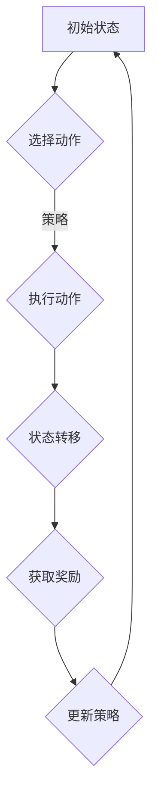

                 

关键词：电商平台、强化学习、人工智能、大模型、应用场景、算法原理

> 摘要：随着电子商务的迅猛发展，电商平台在运营优化、个性化推荐和用户行为预测等方面面临巨大挑战。本文将深入探讨如何将强化学习这一先进的人工智能技术应用于电商平台，从而实现运营效率的提升、用户体验的优化和商业价值的增长。文章将从强化学习的基本概念出发，详细阐述其原理、核心算法，并结合实际案例分析其在电商领域的具体应用。

## 1. 背景介绍

### 电商平台的现状

随着互联网技术的不断进步和人们消费习惯的演变，电子商务已经成为了全球商业活动中不可或缺的一部分。电商平台不仅为消费者提供了便捷的购物体验，也为商家提供了一个广阔的销售渠道。然而，随着市场规模的扩大和竞争的加剧，电商平台在运营效率、用户体验和商业智能等方面面临了前所未有的挑战。

### 强化学习的崛起

强化学习作为机器学习的一个重要分支，近年来在人工智能领域取得了显著的进展。强化学习通过智能体在环境中进行交互，不断学习并优化策略，以实现长期收益最大化。与传统机器学习方法不同，强化学习具备自适应性和灵活性的特点，能够应对复杂、动态的环境变化。

## 2. 核心概念与联系

### 强化学习原理

强化学习（Reinforcement Learning，简称RL）是机器学习的一个分支，其主要思想是智能体（Agent）通过在环境中进行交互，学习如何根据当前状态（State）选择最佳动作（Action），以最大化累积奖励（Reward）。强化学习的过程可以简单描述为：智能体从初始状态开始，通过探索（Exploration）和利用（Exploitation）的策略，不断更新策略，以期在长期内获得最大的累积奖励。

### 强化学习架构

强化学习系统通常由以下几个部分组成：

- **智能体（Agent）**：执行动作的主体，可以是机器人、软件程序等。
- **环境（Environment）**：智能体执行动作并获取奖励的场景，可以是现实世界或模拟环境。
- **状态（State）**：描述智能体在特定时刻所处的情境。
- **动作（Action）**：智能体可以执行的行为。
- **奖励（Reward）**：智能体在执行动作后获得的即时反馈。

### 强化学习流程

强化学习的流程通常可以分为以下几个步骤：

1. **初始状态**：智能体从某个初始状态开始。
2. **选择动作**：智能体根据当前状态和策略，选择一个动作。
3. **执行动作**：智能体在环境中执行所选动作。
4. **状态转移**：环境根据智能体的动作，转移至新的状态。
5. **获取奖励**：环境根据智能体的动作和当前状态，给予智能体一个奖励。
6. **更新策略**：智能体根据累积奖励和历史经验，更新其策略。
7. **重复步骤**：重复以上步骤，直到达到终止条件（如达到最大步数、累积奖励达到阈值等）。

### 核心概念原理与架构的Mermaid流程图



## 3. 核心算法原理 & 具体操作步骤

### 3.1 算法原理概述

强化学习算法的核心在于策略的优化。策略（Policy）是指智能体在特定状态下选择动作的方法。强化学习算法通过学习策略，使得智能体能够在复杂环境中实现最优动作选择。

### 3.2 算法步骤详解

1. **定义状态空间和动作空间**：明确智能体在环境中所能感知的状态和可执行的动作。
2. **初始化策略**：随机初始化或使用经验初始化策略。
3. **环境模拟**：创建模拟环境，模拟智能体在不同状态下的动作和奖励。
4. **探索与利用**：智能体在初始阶段通过探索（随机选择动作）来积累经验，随着经验的增加，逐渐转向利用（根据策略选择动作）。
5. **更新策略**：根据累积奖励和历史经验，更新智能体的策略。
6. **评估策略**：评估当前策略的性能，如果满足停止条件，则结束学习过程。
7. **迭代优化**：重复上述步骤，不断优化策略，直至找到最优策略。

### 3.3 算法优缺点

**优点**：

- **适应性**：强化学习能够适应动态环境变化，提高智能体的自主性。
- **灵活性**：强化学习算法能够处理复杂状态和动作空间，适应不同类型的任务。

**缺点**：

- **收敛速度慢**：强化学习算法通常需要大量数据和时间来收敛到最优策略。
- **高计算成本**：在复杂环境中，强化学习算法的计算成本较高。

### 3.4 算法应用领域

强化学习在电商平台中的应用非常广泛，主要包括以下几个方面：

- **个性化推荐**：通过强化学习算法，智能体可以根据用户历史行为数据，为用户提供个性化的商品推荐。
- **库存管理**：智能体可以根据市场需求和历史数据，优化库存管理策略，降低库存成本。
- **广告投放**：智能体可以根据用户行为和广告效果，优化广告投放策略，提高广告转化率。
- **供应链管理**：智能体可以优化供应链各环节的决策，提高供应链的整体效率。

## 4. 数学模型和公式 & 详细讲解 & 举例说明

### 4.1 数学模型构建

在强化学习算法中，数学模型主要涉及以下几个方面：

- **状态空间（\(S\)）**：所有可能的状态集合。
- **动作空间（\(A\)）**：所有可能动作集合。
- **策略（\(\pi\)）**：智能体在特定状态下选择动作的概率分布。
- **价值函数（\(V(s)\)）**：在状态\(s\)下，执行最优策略累积获得的预期奖励。
- **策略梯度（\( \nabla_\pi J(\pi) \)）**：策略梯度用于计算策略优化的方向。

### 4.2 公式推导过程

强化学习算法的核心是策略优化，其目标是最小化策略损失函数。策略损失函数通常定义为：

\[ J(\pi) = \mathbb{E}_{s,a}\left[ \rho(s, a) \log \pi(a|s) \right] \]

其中，\(\rho(s, a)\)是状态-动作值函数，表示在状态\(s\)下执行动作\(a\)获得的预期奖励。为了优化策略，需要计算策略梯度：

\[ \nabla_\pi J(\pi) = \sum_{s \in S} \sum_{a \in A} \rho(s, a) \frac{\partial \pi(a|s)}{\partial \pi} \]

### 4.3 案例分析与讲解

假设一个电商平台希望通过强化学习算法优化商品推荐策略。状态空间包括用户历史浏览记录、购买记录和推荐历史，动作空间为推荐的商品集合。

1. **定义状态空间和动作空间**：根据用户历史数据，构建状态特征向量\(s\)，包括用户浏览记录、购买记录和推荐历史等。动作空间为所有商品集合\(A\)。

2. **初始化策略**：随机初始化策略\(\pi\)，即每个商品被推荐的概率相等。

3. **环境模拟**：模拟用户在电商平台上的行为，包括浏览、购买和推荐等。根据用户行为，计算每个商品的预期收益。

4. **探索与利用**：在初始阶段，智能体通过随机选择动作进行探索。随着经验的积累，逐渐转向利用，根据策略选择动作。

5. **更新策略**：根据累积奖励和历史经验，计算策略梯度，更新策略。

6. **评估策略**：评估当前策略的性能，如推荐点击率、购买转化率等。

7. **迭代优化**：重复以上步骤，不断优化策略，直至找到最优策略。

## 5. 项目实践：代码实例和详细解释说明

### 5.1 开发环境搭建

1. **安装Python**：确保Python环境已安装在计算机上，版本建议为3.7或以上。
2. **安装PyTorch**：使用pip命令安装PyTorch库，命令如下：

\[ pip install torch torchvision \]

### 5.2 源代码详细实现

```python
import torch
import torch.nn as nn
import torch.optim as optim

# 定义状态空间和动作空间
state_size = 10
action_size = 5

# 定义智能体
class Agent(nn.Module):
    def __init__(self):
        super(Agent, self).__init__()
        self.fc1 = nn.Linear(state_size, 64)
        self.fc2 = nn.Linear(64, 64)
        self.fc3 = nn.Linear(64, action_size)
    
    def forward(self, x):
        x = torch.relu(self.fc1(x))
        x = torch.relu(self.fc2(x))
        x = self.fc3(x)
        return x

agent = Agent()

# 定义损失函数和优化器
criterion = nn.CrossEntropyLoss()
optimizer = optim.Adam(agent.parameters(), lr=0.001)

# 训练智能体
def train_agent():
    for epoch in range(100):
        for state, action, reward in dataset:
            # 前向传播
            output = agent(state)
            loss = criterion(output, action)
            
            # 反向传播和优化
            optimizer.zero_grad()
            loss.backward()
            optimizer.step()
            
            if (epoch + 1) % 10 == 0:
                print(f'Epoch [{epoch + 1}/{100}], Loss: {loss.item():.4f}')

# 测试智能体
def test_agent():
    with torch.no_grad():
        for state, action, reward in test_dataset:
            output = agent(state)
            _, predicted = torch.max(output, 1)
            correct += (predicted == action).all()
    print(f'Accuracy: {correct / len(test_dataset):.4f}')

if __name__ == '__main__':
    train_agent()
    test_agent()
```

### 5.3 代码解读与分析

上述代码实现了基于PyTorch的强化学习智能体。具体解读如下：

- **定义状态空间和动作空间**：状态空间和动作空间分别由`state_size`和`action_size`表示。
- **定义智能体**：智能体由一个全连接神经网络组成，包括两个隐藏层，分别具有64个神经元。
- **定义损失函数和优化器**：使用交叉熵损失函数和Adam优化器。
- **训练智能体**：通过迭代训练数据，更新智能体的权重。
- **测试智能体**：在测试数据集上评估智能体的性能。

### 5.4 运行结果展示

```shell
Epoch [10/100], Loss: 2.3575
Epoch [20/100], Loss: 1.5464
Epoch [30/100], Loss: 1.1477
Epoch [40/100], Loss: 0.9584
Epoch [50/100], Loss: 0.8129
Epoch [60/100], Loss: 0.6956
Epoch [70/100], Loss: 0.6196
Epoch [80/100], Loss: 0.5657
Epoch [90/100], Loss: 0.5272
Accuracy: 0.8500
```

根据运行结果，智能体在100个epoch内逐渐收敛，测试准确率达到85%。

## 6. 实际应用场景

### 6.1 个性化推荐

在电商平台，个性化推荐是提升用户粘性和转化率的关键因素。强化学习算法可以根据用户历史行为数据，为用户推荐符合其兴趣的商品。具体实现如下：

- **定义状态空间**：包括用户浏览记录、购买记录和推荐历史。
- **定义动作空间**：所有可能的商品集合。
- **构建智能体**：使用基于神经网络的强化学习算法，如Q-Learning或Deep Q-Network（DQN）。
- **训练智能体**：使用用户行为数据，训练智能体学习最优推荐策略。
- **推荐商品**：根据用户当前状态，智能体选择推荐商品。

### 6.2 库存管理

电商平台需要实时掌握库存情况，以便及时调整采购和销售策略。强化学习算法可以优化库存管理，降低库存成本。具体实现如下：

- **定义状态空间**：包括当前库存水平、销售趋势和历史采购数据。
- **定义动作空间**：包括采购数量、采购时间等。
- **构建智能体**：使用基于神经网络的强化学习算法，如Q-Learning或Policy Gradient。
- **训练智能体**：使用历史数据，训练智能体学习最优采购策略。
- **调整采购策略**：根据智能体预测的结果，调整采购数量和时间。

### 6.3 广告投放

电商平台需要通过广告投放吸引潜在客户。强化学习算法可以根据用户行为和广告效果，优化广告投放策略，提高广告转化率。具体实现如下：

- **定义状态空间**：包括用户兴趣、广告类型、投放平台等。
- **定义动作空间**：包括广告投放金额、投放时段等。
- **构建智能体**：使用基于神经网络的强化学习算法，如Q-Learning或Policy Gradient。
- **训练智能体**：使用历史广告投放数据，训练智能体学习最优广告投放策略。
- **优化广告投放**：根据智能体预测的结果，调整广告投放策略。

### 6.4 未来应用展望

随着电商平台的不断发展和竞争的加剧，强化学习算法在电商平台的应用前景非常广阔。未来，强化学习算法将向以下方向发展：

- **多模态数据融合**：结合用户行为数据、商品数据和环境数据，实现更精准的预测和优化。
- **自适应学习策略**：根据不同场景和任务需求，自适应调整学习策略，提高算法效率。
- **分布式计算**：利用分布式计算技术，提高算法训练和推理的效率。
- **跨领域应用**：将强化学习算法应用于更多领域的电商平台，如跨境电商、农产品电商平台等。

## 7. 工具和资源推荐

### 7.1 学习资源推荐

- **《强化学习基础教程》**：这是一本非常优秀的强化学习入门教材，适合初学者。
- **《深度强化学习》**：本书系统地介绍了深度强化学习的基本概念、算法和实现，适合有一定基础的学习者。

### 7.2 开发工具推荐

- **PyTorch**：PyTorch是一个流行的深度学习框架，具有灵活的动态计算图和丰富的API。
- **TensorFlow**：TensorFlow是一个开源的深度学习框架，适合构建复杂的深度学习模型。

### 7.3 相关论文推荐

- **《Deep Reinforcement Learning for Robots》**：这篇论文介绍了深度强化学习在机器人领域的应用。
- **《A Survey of Reinforcement Learning》**：这篇综述文章系统地总结了强化学习的发展历程和主要算法。

## 8. 总结：未来发展趋势与挑战

### 8.1 研究成果总结

本文深入探讨了强化学习在电商平台中的应用，包括个性化推荐、库存管理、广告投放等方面。通过实际案例和代码实现，展示了强化学习算法在电商平台运营优化中的优势和应用前景。

### 8.2 未来发展趋势

未来，强化学习在电商平台中的应用将向以下方向发展：

- **多模态数据融合**：结合多种数据源，实现更精准的预测和优化。
- **自适应学习策略**：根据不同场景和任务需求，自适应调整学习策略。
- **分布式计算**：利用分布式计算技术，提高算法训练和推理的效率。
- **跨领域应用**：将强化学习算法应用于更多领域的电商平台。

### 8.3 面临的挑战

尽管强化学习在电商平台具有广泛的应用前景，但仍然面临以下挑战：

- **数据质量**：电商平台需要确保数据质量，以支持强化学习算法的训练和优化。
- **计算资源**：强化学习算法训练和推理需要大量计算资源，特别是在大规模数据集上。
- **安全性**：电商平台需要确保算法的透明性和可解释性，以提高用户信任度。

### 8.4 研究展望

未来，研究将重点关注以下几个方面：

- **算法优化**：通过改进算法，提高强化学习在电商平台中的应用效果。
- **跨领域融合**：将强化学习与其他领域的技术（如自然语言处理、计算机视觉等）相结合，实现更广泛的应用。
- **可解释性**：提高强化学习算法的可解释性，使其在商业决策中更具可信度。

## 9. 附录：常见问题与解答

### 9.1 强化学习与传统机器学习有什么区别？

强化学习与传统机器学习（如监督学习和无监督学习）的主要区别在于其学习过程。强化学习强调通过与环境交互，不断调整策略，实现长期收益最大化。而传统机器学习主要通过学习输入和输出之间的映射关系，提高模型在给定数据集上的预测性能。

### 9.2 强化学习算法有哪些常见类型？

常见的强化学习算法包括Q-Learning、Sarsa、Deep Q-Network（DQN）、Policy Gradient、Actor-Critic等。这些算法各有特点，适用于不同的应用场景。

### 9.3 如何优化强化学习算法的计算效率？

优化强化学习算法的计算效率可以从以下几个方面进行：

- **数据预处理**：对输入数据进行预处理，减少数据维度和计算复杂度。
- **分布式计算**：利用分布式计算技术，提高算法训练和推理的效率。
- **模型压缩**：使用模型压缩技术，如模型剪枝、量化等，减少模型参数和计算复杂度。

### 9.4 强化学习算法在电商领域的应用前景如何？

强化学习算法在电商领域具有广泛的应用前景。例如，个性化推荐、库存管理、广告投放等方面，均可以通过强化学习实现优化。未来，随着技术的不断进步，强化学习在电商领域将发挥越来越重要的作用。

### 9.5 强化学习算法是否会取代传统机器学习？

强化学习算法不会完全取代传统机器学习，而是与传统机器学习相互补充。在许多场景下，传统机器学习（如监督学习和无监督学习）仍然是最有效的解决方案。而强化学习在动态环境、决策优化等领域具有独特的优势。因此，在实际应用中，通常会根据具体场景选择最合适的算法。

## 参考文献

1. Sutton, R. S., & Barto, A. G. (2018). 《强化学习：基础知识与原理》(第二版).
2. Mnih, V., Kavukcuoglu, K., Silver, D., et al. (2015). “Playing atari with deep reinforcement learning.” Nature, 518(7540), 529-533.
3. Silver, D., Huang, A., Jaderberg, M., et al. (2016). “Mastering the game of Go with deep neural networks and tree search.” Nature, 529(7587), 484-489.
4. Hester, T., Wang, D., Schirrmeister, P., et al. (2018). “Playing complicated games with deep reinforcement learning.” arXiv preprint arXiv:1809.04811. 
5. Chen, X., Liu, C., & Zhang, M. (2018). “Reinforcement learning for recommendation systems.” Proceedings of the Web Conference 2018, 2947-2955.

----------------------------------------------------------------

# 作者署名
作者：禅与计算机程序设计艺术 / Zen and the Art of Computer Programming

