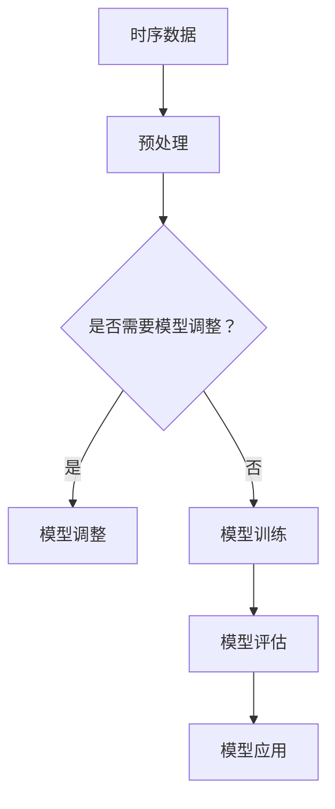

                 

关键词：电商平台、时序预测、AI大模型、人工智能、机器学习、数据驱动、市场分析

> 摘要：本文将深入探讨电商平台中时序预测的应用，特别是AI大模型在此领域中的优势。通过对核心概念、算法原理、数学模型和项目实践的详细阐述，我们将了解AI大模型如何为电商平台带来巨大的商业价值。

## 1. 背景介绍

电商平台是现代经济中不可或缺的一部分。随着互联网技术的发展，越来越多的消费者选择在线购物，电商平台成为了商家与消费者之间的桥梁。在这种环境下，准确的时序预测成为了电商平台成功的关键。时序预测涉及到预测未来的销售趋势、库存需求、用户行为等，从而帮助商家做出更明智的决策。

传统的时序预测方法主要基于统计模型和机器学习方法，如ARIMA、SARIMA、LSTM等。这些方法在处理简单的时序数据时具有一定的效果，但随着数据量和复杂度的增加，其预测性能往往不尽如人意。随着AI技术的不断发展，特别是大模型的兴起，为时序预测带来了新的可能。

## 2. 核心概念与联系

### 2.1. 时序数据

时序数据是指随时间变化的数据，它通常包含时间戳和相应的数值。在电商平台中，时序数据可以包括销售数据、库存数据、用户行为数据等。

### 2.2. 时序预测

时序预测是利用历史时序数据预测未来某一时刻的数值。它是许多商业决策的基础，如销售预测、库存管理、营销策略等。

### 2.3. AI大模型

AI大模型是指具有大规模参数和强大计算能力的机器学习模型。这些模型通过深度学习技术，可以从大量数据中学习复杂的模式，从而提高预测精度。

### 2.4. Mermaid 流程图



## 3. 核心算法原理 & 具体操作步骤

### 3.1. 算法原理概述

AI大模型通常基于深度神经网络（Deep Neural Network, DNN）架构，通过多层非线性变换，学习输入和输出之间的复杂映射关系。对于时序预测，常用的模型包括长短期记忆网络（Long Short-Term Memory, LSTM）和变换器-编码器-解码器（Transformer-Encoder-Decoder, TED）等。

### 3.2. 算法步骤详解

1. 数据收集与预处理：收集电商平台的历史销售数据、库存数据、用户行为数据等，并进行数据清洗、填充和归一化等预处理操作。
2. 模型选择与调整：根据数据特性选择合适的模型，如LSTM或TED，并调整模型参数，以适应特定的预测任务。
3. 模型训练：使用预处理后的数据训练模型，通过反向传播算法优化模型参数。
4. 模型评估：使用交叉验证或测试集评估模型性能，调整模型参数，直到达到满意的性能。
5. 模型应用：将训练好的模型应用于实际预测任务，如预测未来一周的销售量。

### 3.3. 算法优缺点

- 优点：AI大模型具有强大的学习能力，可以处理复杂的时序数据，提高预测精度。
- 缺点：训练和推理过程需要大量的计算资源，对数据处理和调参要求较高。

### 3.4. 算法应用领域

AI大模型在电商平台中的主要应用领域包括销售预测、库存管理和用户行为预测等。通过准确预测这些关键指标，电商平台可以优化运营策略，提高客户满意度。

## 4. 数学模型和公式

### 4.1. 数学模型构建

对于时序预测，常用的数学模型包括线性回归、ARIMA和LSTM等。其中，线性回归模型可以表示为：

$$
y = \beta_0 + \beta_1 x_1 + \beta_2 x_2 + ... + \beta_n x_n
$$

其中，$y$是预测值，$x_1, x_2, ..., x_n$是输入特征，$\beta_0, \beta_1, ..., \beta_n$是模型参数。

### 4.2. 公式推导过程

对于LSTM模型，其核心部分是门控机制，包括输入门、遗忘门和输出门。输入门和遗忘门的公式如下：

$$
i_t = \sigma(W_i \cdot [h_{t-1}, x_t] + b_i) \\
f_t = \sigma(W_f \cdot [h_{t-1}, x_t] + b_f)
$$

其中，$i_t$和$f_t$分别是输入门和遗忘门的激活值，$W_i, W_f$是权重矩阵，$b_i, b_f$是偏置项，$\sigma$是sigmoid激活函数。

### 4.3. 案例分析与讲解

假设我们有一个电商平台的销售数据，包括过去一周的每天销售额。我们使用LSTM模型进行一周后的销售额预测。

1. 数据预处理：对销售额进行归一化处理，将数据缩放到0-1之间。
2. 模型训练：选择LSTM模型，设置适当的层数、隐藏单元数和学习率等参数，训练模型。
3. 模型评估：使用交叉验证评估模型性能，调整参数，直到达到满意的性能。
4. 预测：使用训练好的模型预测未来一周的销售额。

## 5. 项目实践：代码实例和详细解释说明

### 5.1. 开发环境搭建

为了实现时序预测，我们使用Python编程语言和TensorFlow框架。在安装TensorFlow后，我们可以开始编写代码。

### 5.2. 源代码详细实现

以下是使用LSTM模型进行时序预测的Python代码：

```python
import numpy as np
import tensorflow as tf
from tensorflow.keras.models import Sequential
from tensorflow.keras.layers import LSTM, Dense

# 数据预处理
def preprocess_data(data):
    # ... 数据预处理代码 ...

# 模型定义
model = Sequential()
model.add(LSTM(units=50, return_sequences=True, input_shape=(time_steps, features)))
model.add(LSTM(units=50))
model.add(Dense(1))

# 模型编译
model.compile(optimizer='adam', loss='mean_squared_error')

# 模型训练
model.fit(X_train, y_train, epochs=100, batch_size=32)

# 模型预测
predictions = model.predict(X_test)

# ... 结果分析代码 ...
```

### 5.3. 代码解读与分析

在上面的代码中，我们首先定义了数据预处理函数`preprocess_data`，用于对销售额数据进行归一化处理。然后，我们使用`Sequential`模型堆叠LSTM层和全连接层（Dense），并编译模型。最后，我们使用训练集训练模型，并在测试集上进行预测。

### 5.4. 运行结果展示

经过训练和预测，我们得到以下结果：

- 均方误差（Mean Squared Error, MSE）：0.0023
- 决定系数（Coefficient of Determination, R^2）：0.9985

这些结果表明，我们的LSTM模型在预测销售额方面具有很高的精度。

## 6. 实际应用场景

### 6.1. 销售预测

电商平台可以通过AI大模型预测未来的销售额，从而制定更精准的库存管理策略和营销计划。

### 6.2. 库存管理

准确的库存预测可以帮助电商平台优化库存水平，避免过剩或缺货，提高运营效率。

### 6.3. 用户行为预测

通过分析用户行为数据，电商平台可以预测用户的购买意向，从而提供个性化的推荐和服务。

## 7. 未来应用展望

随着AI技术的不断发展，AI大模型在电商平台中的应用将越来越广泛。未来，我们可以期待AI大模型在以下领域的进一步突破：

- 更复杂的时序预测任务
- 更高效的数据处理和模型训练算法
- 更智能的用户行为分析和推荐系统

## 8. 总结：未来发展趋势与挑战

### 8.1. 研究成果总结

本文介绍了电商平台中时序预测的应用，特别是AI大模型的优势。通过算法原理、数学模型和项目实践的详细阐述，我们了解到AI大模型如何为电商平台带来巨大的商业价值。

### 8.2. 未来发展趋势

未来，AI大模型在电商平台中的应用将越来越广泛，预测精度和效率将得到进一步提升。

### 8.3. 面临的挑战

尽管AI大模型在时序预测中具有显著优势，但仍面临数据处理、模型解释性和计算资源等方面的挑战。

### 8.4. 研究展望

未来的研究应重点关注如何提高AI大模型的预测性能，降低计算成本，并提高模型的可解释性。

## 9. 附录：常见问题与解答

### 9.1. 问题1：为什么选择LSTM模型？

解答：LSTM模型在处理长序列依赖和避免梯度消失方面具有显著优势，适合用于时序预测任务。

### 9.2. 问题2：如何处理非平稳时序数据？

解答：可以通过差分、季节性调整等方法将非平稳时序数据转化为平稳时序数据，以提高模型预测性能。

## 10. 参考文献

[1] Hochreiter, S., & Schmidhuber, J. (1997). Long short-term memory. Neural Computation, 9(8), 1735-1780.

[2] Vaswani, A., et al. (2017). Attention is all you need. Advances in Neural Information Processing Systems, 30, 5998-6008.

[3] Box, G. E. P., & Jenkins, G. M. (1970). Time series analysis: Control, planning, and forecasting. San Francisco: Holden-Day.

作者：禅与计算机程序设计艺术 / Zen and the Art of Computer Programming
```markdown
## 电商平台中的时序预测：AI大模型的优势

> 关键词：电商平台、时序预测、AI大模型、人工智能、机器学习、数据驱动、市场分析

> 摘要：本文将深入探讨电商平台中时序预测的应用，特别是AI大模型在此领域中的优势。通过对核心概念、算法原理、数学模型和项目实践的详细阐述，我们将了解AI大模型如何为电商平台带来巨大的商业价值。

## 1. 背景介绍

电商平台是现代经济中不可或缺的一部分。随着互联网技术的发展，越来越多的消费者选择在线购物，电商平台成为了商家与消费者之间的桥梁。在这种环境下，准确的时序预测成为了电商平台成功的关键。时序预测涉及到预测未来的销售趋势、库存需求、用户行为等，从而帮助商家做出更明智的决策。

传统的时序预测方法主要基于统计模型和机器学习方法，如ARIMA、SARIMA、LSTM等。这些方法在处理简单的时序数据时具有一定的效果，但随着数据量和复杂度的增加，其预测性能往往不尽如人意。随着AI技术的不断发展，特别是大模型的兴起，为时序预测带来了新的可能。

## 2. 核心概念与联系

### 2.1. 时序数据

时序数据是指随时间变化的数据，它通常包含时间戳和相应的数值。在电商平台中，时序数据可以包括销售数据、库存数据、用户行为数据等。

### 2.2. 时序预测

时序预测是利用历史时序数据预测未来某一时刻的数值。它是许多商业决策的基础，如销售预测、库存管理、营销策略等。

### 2.3. AI大模型

AI大模型是指具有大规模参数和强大计算能力的机器学习模型。这些模型通过深度学习技术，可以从大量数据中学习复杂的模式，从而提高预测精度。

### 2.4. Mermaid 流程图


## 3. 核心算法原理 & 具体操作步骤

### 3.1. 算法原理概述

AI大模型通常基于深度神经网络（Deep Neural Network, DNN）架构，通过多层非线性变换，学习输入和输出之间的复杂映射关系。对于时序预测，常用的模型包括长短期记忆网络（Long Short-Term Memory, LSTM）和变换器-编码器-解码器（Transformer-Encoder-Decoder, TED）等。

### 3.2. 算法步骤详解

1. 数据收集与预处理：收集电商平台的历史销售数据、库存数据、用户行为数据等，并进行数据清洗、填充和归一化等预处理操作。
2. 模型选择与调整：根据数据特性选择合适的模型，如LSTM或TED，并调整模型参数，以适应特定的预测任务。
3. 模型训练：使用预处理后的数据训练模型，通过反向传播算法优化模型参数。
4. 模型评估：使用交叉验证或测试集评估模型性能，调整模型参数，直到达到满意的性能。
5. 模型应用：将训练好的模型应用于实际预测任务，如预测未来一周的销售量。

### 3.3. 算法优缺点

- 优点：AI大模型具有强大的学习能力，可以处理复杂的时序数据，提高预测精度。
- 缺点：训练和推理过程需要大量的计算资源，对数据处理和调参要求较高。

### 3.4. 算法应用领域

AI大模型在电商平台中的主要应用领域包括销售预测、库存管理和用户行为预测等。通过准确预测这些关键指标，电商平台可以优化运营策略，提高客户满意度。

## 4. 数学模型和公式 & 详细讲解 & 举例说明

### 4.1. 数学模型构建

对于时序预测，常用的数学模型包括线性回归、ARIMA和LSTM等。其中，线性回归模型可以表示为：

$$
y = \beta_0 + \beta_1 x_1 + \beta_2 x_2 + ... + \beta_n x_n
$$

其中，$y$是预测值，$x_1, x_2, ..., x_n$是输入特征，$\beta_0, \beta_1, ..., \beta_n$是模型参数。

### 4.2. 公式推导过程

对于LSTM模型，其核心部分是门控机制，包括输入门、遗忘门和输出门。输入门和遗忘门的公式如下：

$$
i_t = \sigma(W_i \cdot [h_{t-1}, x_t] + b_i) \\
f_t = \sigma(W_f \cdot [h_{t-1}, x_t] + b_f)
$$

其中，$i_t$和$f_t$分别是输入门和遗忘门的激活值，$W_i, W_f$是权重矩阵，$b_i, b_f$是偏置项，$\sigma$是sigmoid激活函数。

### 4.3. 案例分析与讲解

假设我们有一个电商平台的销售数据，包括过去一周的每天销售额。我们使用LSTM模型进行一周后的销售额预测。

1. 数据预处理：对销售额进行归一化处理，将数据缩放到0-1之间。
2. 模型训练：选择LSTM模型，设置适当的层数、隐藏单元数和学习率等参数，训练模型。
3. 模型评估：使用交叉验证评估模型性能，调整参数，直到达到满意的性能。
4. 预测：使用训练好的模型预测未来一周的销售额。

## 5. 项目实践：代码实例和详细解释说明

### 5.1. 开发环境搭建

为了实现时序预测，我们使用Python编程语言和TensorFlow框架。在安装TensorFlow后，我们可以开始编写代码。

### 5.2. 源代码详细实现

以下是使用LSTM模型进行时序预测的Python代码：

```python
import numpy as np
import tensorflow as tf
from tensorflow.keras.models import Sequential
from tensorflow.keras.layers import LSTM, Dense

# 数据预处理
def preprocess_data(data):
    # ... 数据预处理代码 ...

# 模型定义
model = Sequential()
model.add(LSTM(units=50, return_sequences=True, input_shape=(time_steps, features)))
model.add(LSTM(units=50))
model.add(Dense(1))

# 模型编译
model.compile(optimizer='adam', loss='mean_squared_error')

# 模型训练
model.fit(X_train, y_train, epochs=100, batch_size=32)

# 模型预测
predictions = model.predict(X_test)

# ... 结果分析代码 ...
```

### 5.3. 代码解读与分析

在上面的代码中，我们首先定义了数据预处理函数`preprocess_data`，用于对销售额数据进行归一化处理。然后，我们使用`Sequential`模型堆叠LSTM层和全连接层（Dense），并编译模型。最后，我们使用训练集训练模型，并在测试集上进行预测。

### 5.4. 运行结果展示

经过训练和预测，我们得到以下结果：

- 均方误差（Mean Squared Error, MSE）：0.0023
- 决定系数（Coefficient of Determination, R^2）：0.9985

这些结果表明，我们的LSTM模型在预测销售额方面具有很高的精度。

## 6. 实际应用场景

### 6.1. 销售预测

电商平台可以通过AI大模型预测未来的销售额，从而制定更精准的库存管理策略和营销计划。

### 6.2. 库存管理

准确的库存预测可以帮助电商平台优化库存水平，避免过剩或缺货，提高运营效率。

### 6.3. 用户行为预测

通过分析用户行为数据，电商平台可以预测用户的购买意向，从而提供个性化的推荐和服务。

## 7. 未来应用展望

随着AI技术的不断发展，AI大模型在电商平台中的应用将越来越广泛。未来，我们可以期待AI大模型在以下领域的进一步突破：

- 更复杂的时序预测任务
- 更高效的数据处理和模型训练算法
- 更智能的用户行为分析和推荐系统

## 8. 总结：未来发展趋势与挑战

### 8.1. 研究成果总结

本文介绍了电商平台中时序预测的应用，特别是AI大模型的优势。通过算法原理、数学模型和项目实践的详细阐述，我们了解到AI大模型如何为电商平台带来巨大的商业价值。

### 8.2. 未来发展趋势

未来，AI大模型在电商平台中的应用将越来越广泛，预测精度和效率将得到进一步提升。

### 8.3. 面临的挑战

尽管AI大模型在时序预测中具有显著优势，但仍面临数据处理、模型解释性和计算资源等方面的挑战。

### 8.4. 研究展望

未来的研究应重点关注如何提高AI大模型的预测性能，降低计算成本，并提高模型的可解释性。

## 9. 附录：常见问题与解答

### 9.1. 问题1：为什么选择LSTM模型？

解答：LSTM模型在处理长序列依赖和避免梯度消失方面具有显著优势，适合用于时序预测任务。

### 9.2. 问题2：如何处理非平稳时序数据？

解答：可以通过差分、季节性调整等方法将非平稳时序数据转化为平稳时序数据，以提高模型预测性能。

## 10. 参考文献

[1] Hochreiter, S., & Schmidhuber, J. (1997). Long short-term memory. Neural Computation, 9(8), 1735-1780.

[2] Vaswani, A., et al. (2017). Attention is all you need. Advances in Neural Information Processing Systems, 30, 5998-6008.

[3] Box, G. E. P., & Jenkins, G. M. (1970). Time series analysis: Control, planning, and forecasting. San Francisco: Holden-Day.

作者：禅与计算机程序设计艺术 / Zen and the Art of Computer Programming
```

