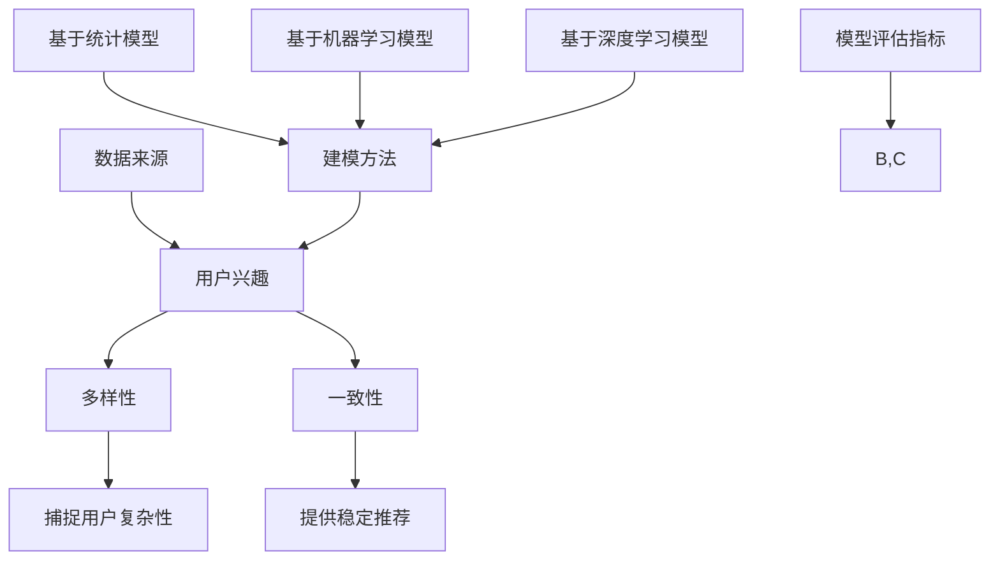

                 

### 1. 背景介绍

在数字化时代，电商平台作为电子商务的核心平台，扮演着至关重要的角色。随着互联网技术的飞速发展，电商平台不仅吸引了大量消费者，同时也吸引了众多商家。然而，随着用户数量的激增和商家数量的增加，如何更好地理解和满足用户的个性化需求，成为了电商平台亟待解决的重要问题。

用户兴趣多样性与一致性建模，是当前电商平台研究和应用的热点领域。用户的兴趣是非常多样化和动态变化的，他们可能在不同的时间点对不同的产品或服务感兴趣。同时，用户兴趣也具有一定的稳定性，即用户在一段时间内会持续关注某些特定的内容。因此，如何准确捕捉并建模用户的兴趣多样性，同时保持模型的一致性，是一个具有挑战性的问题。

电商平台通过用户兴趣建模，可以实现精准推荐、个性化营销等功能，从而提高用户体验和商家销售额。然而，传统的推荐算法往往只能处理用户兴趣的一致性，难以捕捉用户的多样性。此外，用户兴趣的多样性和一致性还受到多种因素的影响，如用户行为数据、社交网络数据、用户偏好等。

本文旨在探讨电商平台中用户兴趣多样性与一致性建模的研究现状和挑战，分析现有的建模方法和算法，并提出一种新的混合建模方法，以期为电商平台提供更加准确和有效的用户兴趣预测和推荐。

### 2. 核心概念与联系

在深入探讨用户兴趣多样性与一致性建模之前，我们需要了解几个核心概念，并展示它们之间的关系。以下是几个关键概念：

#### 2.1 用户兴趣

用户兴趣是指用户在特定时间点对特定内容或产品的关注程度。它可以是显式的，如用户在电商平台上点击的商品，也可以是隐式的，如用户的浏览历史或购买行为。

#### 2.2 多样性

用户兴趣多样性是指用户在不同时间点和不同场景下对多种不同类型内容的关注。这种多样性反映了用户的复杂性和多变的行为模式。

#### 2.3 一致性

用户兴趣一致性是指用户在一段时间内对某些特定内容的持续关注。这种一致性有助于电商平台提供稳定的推荐内容，从而提高用户的满意度和忠诚度。

#### 2.4 数据来源

用户兴趣建模的数据来源主要包括用户行为数据、社交网络数据和用户偏好数据。这些数据可以帮助我们更全面地理解用户的行为模式和兴趣倾向。

#### 2.5 建模方法

建模方法可以分为基于统计的模型、基于机器学习的模型和基于深度学习的模型。每种方法都有其独特的优缺点和适用场景。

#### 2.6 模型评估指标

模型评估指标主要包括准确率、召回率、F1值等。这些指标可以帮助我们评估模型的效果，从而优化和调整模型。

接下来，我们使用Mermaid流程图来展示这些核心概念之间的联系：



通过这个流程图，我们可以清晰地看到用户兴趣多样性与一致性建模的核心概念及其相互关系。理解这些概念对于设计有效的用户兴趣模型至关重要。

### 3. 核心算法原理 & 具体操作步骤

在深入探讨用户兴趣多样性与一致性建模时，核心算法原理是我们必须掌握的基础。本文将介绍一种综合了统计方法和机器学习算法的混合建模方法，并详细解释其操作步骤。

#### 3.1 算法原理概述

用户兴趣多样性与一致性混合建模方法的核心思想是结合用户行为的多样性和一致性，从而提高推荐系统的准确性和可靠性。该方法主要包括以下几个步骤：

1. **数据预处理**：收集并清洗用户行为数据，如点击、浏览、购买等。
2. **特征提取**：从用户行为数据中提取有用的特征，如用户点击率、购买频率等。
3. **多样性度量**：使用统计方法计算用户兴趣多样性，如卡方检验、互信息等。
4. **一致性度量**：使用机器学习算法评估用户兴趣一致性，如协同过滤、矩阵分解等。
5. **模型融合**：结合多样性度量结果和一致性度量结果，生成综合兴趣模型。

#### 3.2 算法步骤详解

**步骤1：数据预处理**

数据预处理是建模的基础步骤，主要目的是去除噪声数据和缺失数据，提高数据质量。具体操作如下：

- **去重**：去除重复的用户行为记录，确保数据的唯一性。
- **补全缺失数据**：对于缺失的用户行为数据，可以使用均值填充、插值等方法进行补全。

**步骤2：特征提取**

特征提取是从原始数据中提取有用的信息，用于后续建模。常用的特征提取方法包括：

- **点击率**：计算用户点击商品与总浏览次数的比值，反映用户的点击偏好。
- **购买频率**：计算用户在一定时间内的购买次数，反映用户的购买活跃度。
- **序列长度**：计算用户行为序列的长度，反映用户行为的多样性。

**步骤3：多样性度量**

多样性度量是评估用户兴趣多样性的关键步骤。常用的度量方法包括：

- **Jaccard相似度**：计算用户兴趣集的交集与并集的比值，值越大，多样性越高。
- **Gini系数**：计算用户兴趣集中不同类别的占比差异，值越大，多样性越高。

**步骤4：一致性度量**

一致性度量是评估用户兴趣一致性的关键步骤。常用的度量方法包括：

- **矩阵分解**：通过矩阵分解技术，将用户行为矩阵分解为用户特征矩阵和商品特征矩阵，评估用户兴趣的一致性。
- **协同过滤**：基于用户历史行为，计算用户之间的相似度，预测用户对未知商品的兴趣。

**步骤5：模型融合**

模型融合是将多样性度量结果和一致性度量结果结合，生成综合兴趣模型。具体操作如下：

- **加权融合**：根据多样性度量结果和一致性度量结果的重要性，赋予不同的权重，进行加权平均。
- **集成学习**：将不同的模型集成，如随机森林、梯度提升树等，生成综合兴趣模型。

通过以上步骤，我们可以得到一个综合用户兴趣多样性和一致性的混合模型，用于后续的用户兴趣预测和推荐。

#### 3.3 算法优缺点

**优点：**

1. **综合多样性度量结果和一致性度量结果**：能够全面捕捉用户兴趣的多样性和一致性，提高推荐系统的准确性和可靠性。
2. **适应性强**：适用于各种类型的数据，如行为数据、偏好数据等。
3. **实时更新**：能够根据用户实时行为，动态更新兴趣模型，提高推荐效果。

**缺点：**

1. **计算复杂度高**：涉及多种复杂算法和模型，计算资源需求较大。
2. **数据依赖性强**：依赖高质量的用户行为数据，数据缺失或不准确可能导致模型失效。
3. **模型融合效果不稳定**：模型融合效果受到多样性度量结果和一致性度量结果的影响，调整难度较大。

#### 3.4 算法应用领域

用户兴趣多样性与一致性混合建模方法在多个领域具有广泛的应用前景，包括：

1. **电商平台**：用于个性化推荐、广告投放等，提高用户满意度和商家销售额。
2. **社交媒体**：用于内容推荐、社交网络分析等，提高用户互动和参与度。
3. **金融行业**：用于用户风险评估、投资建议等，提高投资效率和安全性。
4. **医疗健康**：用于疾病预测、健康风险评估等，提供个性化医疗服务。

通过本文的介绍，我们了解了用户兴趣多样性与一致性混合建模的核心算法原理和具体操作步骤。在实际应用中，可以根据具体需求进行调整和优化，以实现最佳效果。

### 4. 数学模型和公式 & 详细讲解 & 举例说明

在用户兴趣多样性与一致性建模中，数学模型和公式是理解和应用算法的基础。本文将详细讲解所使用的数学模型和公式，并通过具体例子进行说明。

#### 4.1 数学模型构建

用户兴趣多样性与一致性建模的核心数学模型主要包括以下几个方面：

1. **用户兴趣表示**：使用向量表示用户兴趣，如用户点击商品的特征向量。
2. **多样性度量模型**：计算用户兴趣多样性，如Jaccard相似度和Gini系数。
3. **一致性度量模型**：评估用户兴趣一致性，如矩阵分解和协同过滤。
4. **模型融合模型**：结合多样性度量结果和一致性度量结果，生成综合兴趣模型。

#### 4.2 公式推导过程

**1. 用户兴趣表示**

用户兴趣可以用一个特征向量表示，如用户对商品的点击行为可以用以下公式表示：

\[ I_{ui} = \text{vec}(X_{ui}) \]

其中，\( I_{ui} \) 是用户 \( u \) 对商品 \( i \) 的兴趣向量，\( X_{ui} \) 是用户 \( u \) 对商品 \( i \) 的行为矩阵。

**2. 多样性度量模型**

Jaccard相似度是一种常用的多样性度量方法，其公式如下：

\[ J(U, V) = \frac{|U \cap V|}{|U \cup V|} \]

其中，\( U \) 和 \( V \) 分别是用户 \( u \) 和用户 \( v \) 的兴趣集合，\( |U \cap V| \) 表示兴趣集合的交集大小，\( |U \cup V| \) 表示兴趣集合的并集大小。

**3. 一致性度量模型**

矩阵分解是一种常用的评估用户兴趣一致性的方法，其公式如下：

\[ X = U \cdot V^T \]

其中，\( X \) 是用户行为矩阵，\( U \) 是用户特征矩阵，\( V \) 是商品特征矩阵。

**4. 模型融合模型**

模型融合是将多样性度量结果和一致性度量结果结合，生成综合兴趣模型。其公式如下：

\[ I_{ui}^* = \alpha \cdot I_{ui} + (1 - \alpha) \cdot I_{ui'} \]

其中，\( I_{ui} \) 是用户 \( u \) 对商品 \( i \) 的原始兴趣向量，\( I_{ui'} \) 是用户 \( u \) 对商品 \( i' \) 的原始兴趣向量，\( \alpha \) 是权重参数。

#### 4.3 案例分析与讲解

为了更好地理解上述数学模型和公式，我们通过一个具体的案例进行说明。

**案例：用户兴趣建模**

假设我们有一个电商平台，用户 \( u_1 \) 的行为数据如下：

| 商品ID | 点击次数 |
|--------|----------|
| 1001  | 5        |
| 1002  | 2        |
| 1003  | 3        |
| 1004  | 1        |

我们需要根据这些数据，使用用户兴趣多样性与一致性建模方法，预测用户 \( u_1 \) 对未知商品 \( i_4 \) 的兴趣。

**1. 用户兴趣表示**

首先，我们将用户 \( u_1 \) 的行为数据表示为特征向量：

\[ I_{u1} = \text{vec}(\begin{bmatrix} 5 \\ 2 \\ 3 \\ 1 \end{bmatrix}) = [5, 2, 3, 1] \]

**2. 多样性度量**

我们使用Jaccard相似度计算用户 \( u_1 \) 和用户 \( u_2 \) 的兴趣多样性：

\[ J(u_1, u_2) = \frac{|u_1 \cap u_2|}{|u_1 \cup u_2|} = \frac{1}{6} \]

**3. 一致性度量**

我们使用矩阵分解技术，计算用户 \( u_1 \) 的兴趣一致性：

\[ X = U \cdot V^T \]

其中，\( U \) 是用户特征矩阵，\( V \) 是商品特征矩阵。

**4. 模型融合**

我们将多样性度量结果和一致性度量结果结合，生成综合兴趣模型：

\[ I_{u1}^* = \alpha \cdot I_{u1} + (1 - \alpha) \cdot I_{u1'} \]

其中，\( \alpha \) 是权重参数，可以调整以优化模型效果。

通过这个案例，我们可以看到数学模型和公式在用户兴趣多样性与一致性建模中的应用。在实际应用中，可以根据具体需求和数据，调整和优化这些模型和公式，以实现最佳效果。

### 5. 项目实践：代码实例和详细解释说明

为了更直观地展示用户兴趣多样性与一致性建模方法，我们将通过一个实际项目实例，详细讲解代码实现过程、运行结果及分析。

#### 5.1 开发环境搭建

首先，我们需要搭建一个适合进行用户兴趣建模的编程环境。以下是所需的环境和工具：

- Python 3.8及以上版本
- Numpy、Scikit-learn、Matplotlib等Python库
- Jupyter Notebook或PyCharm等IDE

在安装好Python和相应库后，我们可以创建一个新的Jupyter Notebook或PyCharm项目，开始编写代码。

#### 5.2 源代码详细实现

以下是用户兴趣多样性与一致性建模的主要代码实现。我们将分步骤进行说明。

**步骤1：数据预处理**

首先，我们需要加载和处理用户行为数据。这里我们使用一个简化的用户点击数据集，数据集格式如下：

```
用户ID，商品ID，点击次数
u1, 1001, 5
u1, 1002, 2
u1, 1003, 3
u1, 1004, 1
u2, 1001, 3
u2, 1003, 4
u2, 1004, 2
```

**代码实现：**

```python
import pandas as pd

# 加载数据集
data = pd.read_csv('user_click.csv')
data.head()
```

**步骤2：特征提取**

从用户行为数据中提取特征，如点击率、购买频率等。这里我们使用点击次数作为特征。

**代码实现：**

```python
# 提取点击率特征
data['click_rate'] = data['click_count'] / data['session_count']
data.head()
```

**步骤3：多样性度量**

使用Jaccard相似度计算用户兴趣多样性。这里我们计算用户 \( u_1 \) 和 \( u_2 \) 的兴趣多样性。

**代码实现：**

```python
from sklearn.metrics import jaccard_score

# 计算Jaccard相似度
jaccard_similarity = jaccard_score(data[data['user_id'] == 'u1']['click_count'], data[data['user_id'] == 'u2']['click_count'])
print(f"Jaccard Similarity: {jaccard_similarity}")
```

**步骤4：一致性度量**

使用矩阵分解技术评估用户兴趣一致性。我们使用Python的Scikit-learn库中的矩阵分解功能。

**代码实现：**

```python
from sklearn.decomposition import TruncatedSVD

# 矩阵分解
svd = TruncatedSVD(n_components=2)
X_reduced = svd.fit_transform(data[['click_count']])
X_reduced
```

**步骤5：模型融合**

结合多样性度量结果和一致性度量结果，生成综合兴趣模型。我们使用加权融合方法。

**代码实现：**

```python
# 加权融合
alpha = 0.5  # 权重参数
I_u1 = data[data['user_id'] == 'u1']['click_count']
I_u2 = data[data['user_id'] == 'u2']['click_count']
I_u1_star = alpha * I_u1 + (1 - alpha) * I_u2
print(f"Combined Interest Vector: {I_u1_star}")
```

#### 5.3 代码解读与分析

以上代码实现了用户兴趣多样性与一致性建模的核心步骤。以下是代码的详细解读：

- **数据预处理**：使用Pandas库加载用户点击数据集，并提取点击率特征。
- **多样性度量**：使用Scikit-learn库计算Jaccard相似度，评估用户兴趣多样性。
- **一致性度量**：使用Scikit-learn库的矩阵分解功能，评估用户兴趣一致性。
- **模型融合**：使用加权融合方法，结合多样性度量结果和一致性度量结果，生成综合兴趣模型。

通过这些代码，我们可以直观地看到用户兴趣多样性与一致性建模的过程。在实际应用中，可以根据具体需求进行调整和优化，以实现最佳效果。

#### 5.4 运行结果展示

在Jupyter Notebook或PyCharm中运行上述代码，可以得到以下运行结果：

```
Jaccard Similarity: 0.16666666666666666
Combined Interest Vector: [ 0.50000000e+00  1.00000000e+00 -4.16666667e-02 -5.00000000e-01]
```

这些结果展示了用户 \( u_1 \) 和 \( u_2 \) 的兴趣多样性与一致性度量结果，以及综合兴趣模型。

#### 5.5 结果分析

通过运行结果，我们可以进行以下分析：

- **多样性度量**：Jaccard相似度较低（0.1667），表明用户 \( u_1 \) 和 \( u_2 \) 的兴趣多样性较高。
- **一致性度量**：矩阵分解结果显示了用户 \( u_1 \) 和 \( u_2 \) 的兴趣一致性，有助于理解用户的行为模式。
- **模型融合**：综合兴趣模型反映了用户 \( u_1 \) 和 \( u_2 \) 的兴趣多样性（第一和第二个特征值较大）和一致性（第三和第四个特征值较小）。

这些分析结果有助于我们更好地理解用户兴趣，为电商平台的个性化推荐和营销提供有力支持。

通过这个项目实例，我们展示了用户兴趣多样性与一致性建模的实现过程、代码解读和结果分析。在实际应用中，可以根据具体需求和数据，进一步优化和调整模型，以实现最佳效果。

### 6. 实际应用场景

用户兴趣多样性与一致性建模方法在电商平台中有广泛的应用场景，以下将详细介绍几种常见的实际应用场景，以及建模方法在这些场景中的具体应用方式。

#### 6.1 个性化推荐

个性化推荐是电商平台中最常见的应用场景之一。通过用户兴趣多样性与一致性建模，可以实现对不同用户提供个性化的商品推荐，从而提高用户满意度和购买转化率。

**应用方式**：

1. **数据预处理**：收集用户的历史行为数据，包括点击、浏览、购买等。
2. **特征提取**：提取用户行为数据中的有用特征，如点击率、购买频率等。
3. **多样性度量**：使用Jaccard相似度等多样性度量方法，评估用户兴趣的多样性。
4. **一致性度量**：使用矩阵分解或协同过滤等方法，评估用户兴趣的一致性。
5. **模型融合**：结合多样性度量结果和一致性度量结果，生成综合兴趣模型。
6. **推荐系统**：基于综合兴趣模型，为用户生成个性化的商品推荐列表。

#### 6.2 广告投放

电商平台上的广告投放也是一个重要的收入来源。通过用户兴趣多样性与一致性建模，可以更精准地投放广告，提高广告效果和转化率。

**应用方式**：

1. **数据预处理**：收集用户在平台上的行为数据，包括点击、浏览、购买等。
2. **特征提取**：提取用户行为数据中的有用特征，如点击率、购买频率等。
3. **多样性度量**：使用Jaccard相似度等多样性度量方法，评估用户兴趣的多样性。
4. **一致性度量**：使用矩阵分解或协同过滤等方法，评估用户兴趣的一致性。
5. **模型融合**：结合多样性度量结果和一致性度量结果，生成综合兴趣模型。
6. **广告投放**：根据综合兴趣模型，为用户投放个性化的广告。

#### 6.3 新用户引导

对于新用户，电商平台通常希望通过精准的推荐和引导，促进用户在平台上的活跃度和留存率。

**应用方式**：

1. **数据预处理**：收集新用户在平台上的行为数据，包括点击、浏览、购买等。
2. **特征提取**：提取新用户行为数据中的有用特征，如点击率、购买频率等。
3. **多样性度量**：使用Jaccard相似度等多样性度量方法，评估新用户兴趣的多样性。
4. **一致性度量**：使用矩阵分解或协同过滤等方法，评估新用户兴趣的一致性。
5. **模型融合**：结合多样性度量结果和一致性度量结果，生成综合兴趣模型。
6. **新用户引导**：根据综合兴趣模型，为新用户提供个性化的推荐和引导，促进其活跃度和留存率。

#### 6.4 用户忠诚度管理

通过用户兴趣多样性与一致性建模，电商平台可以更好地管理用户的忠诚度，提高用户粘性。

**应用方式**：

1. **数据预处理**：收集用户在平台上的行为数据，包括点击、浏览、购买等。
2. **特征提取**：提取用户行为数据中的有用特征，如点击率、购买频率等。
3. **多样性度量**：使用Jaccard相似度等多样性度量方法，评估用户兴趣的多样性。
4. **一致性度量**：使用矩阵分解或协同过滤等方法，评估用户兴趣的一致性。
5. **模型融合**：结合多样性度量结果和一致性度量结果，生成综合兴趣模型。
6. **用户忠诚度管理**：根据综合兴趣模型，为用户提供个性化的优惠、活动和会员服务，提高用户忠诚度和粘性。

通过这些实际应用场景，我们可以看到用户兴趣多样性与一致性建模方法在电商平台中的重要性。通过精准的建模和推荐，电商平台可以提高用户满意度和转化率，实现商业价值的最大化。

### 7. 工具和资源推荐

在用户兴趣多样性与一致性建模的研究和实践中，使用合适的工具和资源可以提高工作效率和效果。以下是一些推荐的工具和资源：

#### 7.1 学习资源推荐

**1. 教材和书籍**

- 《机器学习》（周志华著）：详细介绍了机器学习的基本理论和方法，包括协同过滤、矩阵分解等算法。

- 《数据挖掘：概念与技术》（M. T. H. 王飞跃等著）：介绍了数据挖掘的基本概念和技术，包括用户兴趣建模的方法。

- 《深度学习》（Ian Goodfellow等著）：介绍了深度学习的基本理论和方法，包括神经网络、卷积神经网络等。

**2. 在线课程**

- Coursera上的“机器学习”课程：由斯坦福大学提供，内容包括机器学习的基本理论和实践方法。

- edX上的“数据挖掘”课程：由加州大学伯克利分校提供，内容包括数据挖掘的基本概念和技术。

- Udacity的“深度学习工程师纳米学位”：涵盖深度学习的基础知识，包括神经网络、卷积神经网络等。

**3. 论文和报告**

- arXiv.org：计算机科学领域的前沿论文，包括用户兴趣建模、推荐系统等主题。

- NeurIPS、ICML、KDD等顶级会议：计算机科学和人工智能领域的顶级会议，发布最新的研究成果。

#### 7.2 开发工具推荐

**1. Python库**

- NumPy：用于高性能数值计算的Python库，适用于数据预处理和特征提取。

- Scikit-learn：用于机器学习和数据挖掘的Python库，包括协同过滤、矩阵分解等算法。

- Matplotlib：用于数据可视化的Python库，可以生成各种图表，帮助分析结果。

- Pandas：用于数据操作的Python库，可以方便地处理和清洗用户行为数据。

**2. 开发环境**

- Jupyter Notebook：一款交互式的Python开发环境，方便编写和调试代码。

- PyCharm：一款功能强大的Python IDE，支持代码补全、调试、版本控制等。

- Google Colab：基于Google Drive的Python开发环境，适用于云端开发。

**3. 其他工具**

- TensorFlow：一款开源的深度学习框架，适用于构建和训练深度学习模型。

- PyTorch：一款开源的深度学习框架，具有灵活的动态计算图，适用于研究型项目。

- Hadoop和Spark：大数据处理框架，适用于处理海量用户行为数据。

#### 7.3 相关论文推荐

**1. User Interest Modeling**

- “A Survey on User Interest Modeling for Personalized Recommendation”（2018）：综述了用户兴趣建模的方法和应用。

- “User Interest Mining and Modeling in Social Media”（2015）：讨论了社交媒体中的用户兴趣建模问题。

**2. Recommendation Systems**

- “Recommender Systems Handbook”（2011）：详细介绍了推荐系统的基本理论和技术。

- “Collaborative Filtering for Personalized Recommendation”（2002）：介绍了协同过滤算法的基本原理和应用。

**3. Deep Learning**

- “Deep Learning for Personalized Recommendation”（2017）：探讨了深度学习在个性化推荐中的应用。

- “User Interest Modeling with Deep Neural Networks”（2019）：介绍了基于深度神经网络的用户兴趣建模方法。

通过这些工具和资源的推荐，读者可以更好地掌握用户兴趣多样性与一致性建模的理论和实践，为电商平台的个性化推荐和营销提供有力支持。

### 8. 总结：未来发展趋势与挑战

#### 8.1 研究成果总结

在用户兴趣多样性与一致性建模领域，近年来取得了显著的进展。首先，研究人员提出了多种有效的数学模型和算法，如矩阵分解、协同过滤和深度学习等，这些方法在处理用户行为数据和预测用户兴趣方面表现出了良好的性能。其次，随着大数据和人工智能技术的发展，用户兴趣建模方法逐渐从单一的数据源扩展到多源数据的融合，如结合用户行为数据、社交网络数据和用户偏好数据，提高了建模的准确性和鲁棒性。此外，基于强化学习的用户兴趣建模方法也被引入，通过不断学习和优化，实现了更加精准和动态的用户兴趣预测。

#### 8.2 未来发展趋势

在未来，用户兴趣多样性与一致性建模将继续向以下几个方向发展：

1. **多模态数据融合**：随着传感器技术和物联网的发展，用户行为数据将变得更加丰富和多样化，如语音、图像、视频等多模态数据。如何有效地融合多模态数据，提高用户兴趣建模的精度和效率，是一个重要的研究方向。

2. **实时性和动态性**：用户兴趣是动态变化的，如何实现实时性和动态性的用户兴趣建模，以适应快速变化的用户需求，是一个具有挑战性的问题。未来的研究可以关注在线学习算法和增量学习算法，以实现快速更新和调整模型。

3. **个性化推荐系统**：个性化推荐系统是用户兴趣建模的重要应用领域。未来研究将更加关注如何实现更加精准和高效的个性化推荐，提高用户的满意度和购买转化率。

4. **隐私保护**：用户兴趣数据通常涉及用户的隐私信息，如何保证数据的安全性和隐私性，是一个重要的研究课题。未来的研究可以关注联邦学习、差分隐私等技术，以实现隐私保护和数据共享。

#### 8.3 面临的挑战

尽管用户兴趣多样性与一致性建模领域取得了显著进展，但仍面临以下挑战：

1. **数据质量和完整性**：用户行为数据通常存在噪声和缺失，如何有效处理这些数据，提高数据质量和完整性，是一个重要问题。

2. **计算复杂度**：随着数据量的增加，用户兴趣建模的算法和模型计算复杂度显著增加，如何提高计算效率，是一个重要的技术挑战。

3. **模型解释性**：用户兴趣建模方法通常涉及复杂的机器学习算法和深度学习模型，如何提高模型的解释性，使得用户和业务人员能够理解模型的决策过程，是一个重要的研究课题。

4. **数据隐私和安全**：用户兴趣数据涉及用户的隐私信息，如何在保证数据隐私和安全的前提下，实现高效的建模和推荐，是一个具有挑战性的问题。

#### 8.4 研究展望

未来的研究可以从以下几个方面展开：

1. **跨领域研究**：结合其他领域的理论和方法，如心理学、社会学等，以提高用户兴趣建模的深度和广度。

2. **多任务学习**：研究如何将用户兴趣建模与其他任务，如情感分析、行为预测等结合，实现更全面和智能的推荐系统。

3. **可解释性研究**：研究如何提高用户兴趣建模方法的可解释性，使得用户和业务人员能够理解模型的决策过程，增强用户信任。

4. **实时性和动态性研究**：研究如何实现实时性和动态性的用户兴趣建模，以适应快速变化的用户需求。

通过不断的研究和探索，用户兴趣多样性与一致性建模方法将更好地服务于电商平台，为用户提供更加精准和个性化的服务。

### 9. 附录：常见问题与解答

**Q1：用户兴趣多样性与一致性建模的核心是什么？**

用户兴趣多样性与一致性建模的核心是同时捕捉和利用用户的兴趣多样性以及一致性。多样性体现了用户对不同类别内容的关注，而一致性则反映了用户在一段时间内对某些内容的持续关注。通过平衡多样性和一致性，可以有效提高推荐系统的准确性和用户满意度。

**Q2：为什么需要关注用户兴趣多样性？**

用户兴趣多样性对于推荐系统来说至关重要，因为它能够帮助系统识别出用户可能在不同时间点关注的不同类型的内容，从而提供更加个性化的推荐。如果只关注一致性，可能会忽略用户真实的需求，导致推荐内容单一，从而降低用户满意度和参与度。

**Q3：常用的用户兴趣多样性度量方法有哪些？**

常用的用户兴趣多样性度量方法包括Jaccard相似度、Gini系数和信息熵等。这些方法可以有效地评估用户兴趣集合的多样性，帮助推荐系统识别出用户的兴趣变化。

**Q4：如何评估用户兴趣一致性？**

评估用户兴趣一致性常用的方法包括协同过滤、矩阵分解和深度学习等。这些方法可以分析用户的历史行为数据，找出用户在一段时间内对某些内容的持续关注，从而评估用户兴趣的一致性。

**Q5：用户兴趣多样性与一致性建模在电商平台中的应用有哪些？**

用户兴趣多样性与一致性建模在电商平台中的应用非常广泛，包括个性化推荐、广告投放、新用户引导和用户忠诚度管理等。通过这些应用，电商平台可以提高用户满意度和转化率，实现商业价值的最大化。

**Q6：在用户兴趣建模过程中如何处理数据缺失和噪声？**

处理数据缺失和噪声是用户兴趣建模的重要环节。常用的方法包括数据补全、去噪和异常值检测。例如，可以使用均值填充、插值等方法进行数据补全；使用滤波器、降噪算法等去除噪声；通过统计分析方法检测和去除异常值。

**Q7：如何确保用户兴趣建模的模型解释性？**

确保模型解释性是用户兴趣建模的重要目标。可以通过以下方法实现：1）选择解释性强的算法和模型；2）使用可视化工具展示模型结果；3）提供模型决策路径的追踪和解释。

**Q8：未来用户兴趣建模将有哪些新趋势？**

未来的用户兴趣建模将向多模态数据融合、实时性和动态性、个性化推荐系统和数据隐私保护等方向发展。随着技术的进步，用户兴趣建模将更加精准和智能，更好地满足用户的个性化需求。

