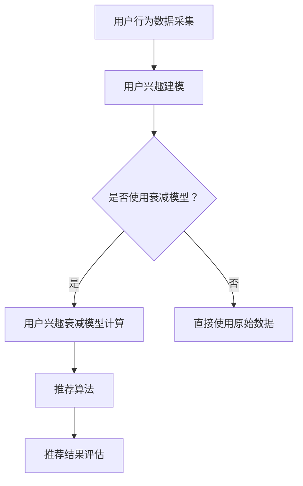

                 

关键词：电商平台，用户兴趣，衰减模型，推荐系统，算法原理，实践应用

> 摘要：本文旨在探讨电商平台中用户兴趣衰减模型的应用与实现，通过深入剖析核心概念、算法原理、数学模型以及实际案例，旨在为电商平台优化用户体验提供理论依据和操作指南。

## 1. 背景介绍

随着互联网的快速发展，电商平台已经成为了现代商业的重要组成部分。用户数量的不断增长，使得电商企业面临着前所未有的竞争压力。如何提高用户的留存率和转化率，成为了企业关注的焦点。而推荐系统作为电商平台提升用户体验和销售额的重要手段，其核心在于对用户兴趣的准确把握。

用户兴趣的衰减问题是指，用户在一段时间内对某类商品或服务的兴趣会随着时间的推移而逐渐减弱。这一现象在电商平台尤为明显，用户在初次访问时可能对某些商品表现出浓厚的兴趣，但随着时间的推移，兴趣可能会逐渐降低。针对这一问题，本文将介绍一种用户兴趣衰减模型，通过该模型可以有效地识别和预测用户兴趣的衰减趋势，为电商平台提供个性化的推荐服务。

## 2. 核心概念与联系

### 2.1 用户兴趣的定义

用户兴趣是指用户对某些商品、服务或信息的偏好和需求。在电商平台中，用户兴趣的表现形式多样，包括浏览历史、购买记录、搜索行为等。

### 2.2 用户兴趣衰减模型

用户兴趣衰减模型是一种基于时间衰减函数的算法，用于模拟和预测用户兴趣随时间的变化。常见的衰减函数包括指数衰减函数、线性衰减函数等。

### 2.3 推荐系统的架构

推荐系统通常由数据采集、用户兴趣建模、推荐算法和推荐结果评估等模块组成。用户兴趣衰减模型作为用户兴趣建模的一部分，对于推荐系统的整体性能具有重要影响。

## 2.4 Mermaid 流程图



## 3. 核心算法原理 & 具体操作步骤

### 3.1 算法原理概述

用户兴趣衰减模型的核心是时间衰减函数，该函数用于计算用户在某一段时间内的兴趣值。假设用户在时间 $t_0$ 对某商品的兴趣值为 $I_0$，在时间 $t$ 的兴趣值为 $I_t$，衰减系数为 $\alpha$，则用户兴趣的衰减公式如下：

$$
I_t = I_0 \cdot e^{-\alpha \cdot (t - t_0)}
$$

### 3.2 算法步骤详解

1. **数据采集**：采集用户的浏览历史、购买记录、搜索行为等数据。
2. **数据预处理**：对采集到的数据进行清洗、去重等处理，确保数据的质量。
3. **特征提取**：根据用户的浏览历史、购买记录等数据，提取用户兴趣特征。
4. **兴趣值计算**：使用时间衰减函数计算用户在不同时间点的兴趣值。
5. **兴趣排序**：根据用户兴趣值对商品进行排序，为推荐算法提供输入。
6. **推荐结果生成**：使用推荐算法生成推荐结果，并对推荐结果进行评估。

### 3.3 算法优缺点

**优点**：
- **准确度高**：通过时间衰减函数，可以更准确地预测用户兴趣的变化趋势。
- **适用性强**：适用于各种电商平台，可以针对不同用户群体进行个性化推荐。

**缺点**：
- **计算复杂度高**：需要处理大量历史数据，计算复杂度较高。
- **参数调优困难**：衰减系数 $\alpha$ 的选择对模型效果有较大影响，需要通过实验进行调优。

### 3.4 算法应用领域

用户兴趣衰减模型广泛应用于电商平台、社交媒体、在线教育等领域，为用户提供个性化的推荐服务，提高用户体验和满意度。

## 4. 数学模型和公式 & 详细讲解 & 举例说明

### 4.1 数学模型构建

用户兴趣衰减模型的核心是时间衰减函数，用于计算用户在不同时间点的兴趣值。假设用户在时间 $t_0$ 对某商品的兴趣值为 $I_0$，在时间 $t$ 的兴趣值为 $I_t$，衰减系数为 $\alpha$，则用户兴趣的衰减公式如下：

$$
I_t = I_0 \cdot e^{-\alpha \cdot (t - t_0)}
$$

### 4.2 公式推导过程

时间衰减函数的推导基于指数衰减原理。假设用户在某一时刻的兴趣值是固定的，随着时间的推移，兴趣值会逐渐减少。指数衰减函数具有如下形式：

$$
I_t = I_0 \cdot e^{-\alpha \cdot t}
$$

为了适应时间点的变化，对上述公式进行修正，得到：

$$
I_t = I_0 \cdot e^{-\alpha \cdot (t - t_0)}
$$

其中，$t_0$ 表示用户兴趣值开始衰减的时间点，$\alpha$ 表示衰减速度。

### 4.3 案例分析与讲解

假设用户 $A$ 在 2023 年 1 月 1 日对商品 $X$ 表现出浓厚的兴趣，兴趣值为 100。衰减系数 $\alpha$ 取 0.1，表示用户对商品 $X$ 的兴趣每月衰减 10%。

- 在 2023 年 1 月 31 日，用户对商品 $X$ 的兴趣值为：

$$
I_{31} = 100 \cdot e^{-0.1 \cdot (31 - 1)} \approx 63.4
$$

- 在 2023 年 2 月 28 日，用户对商品 $X$ 的兴趣值为：

$$
I_{28} = 100 \cdot e^{-0.1 \cdot (28 - 1)} \approx 40.3
$$

通过上述计算，可以看出用户对商品 $X$ 的兴趣随时间推移逐渐减弱。

## 5. 项目实践：代码实例和详细解释说明

### 5.1 开发环境搭建

本文使用 Python 语言进行编程，环境要求如下：

- Python 3.6 或以上版本
- Numpy 库
- Matplotlib 库

安装命令如下：

```bash
pip install numpy matplotlib
```

### 5.2 源代码详细实现

```python
import numpy as np
import matplotlib.pyplot as plt

def user_interest_degradation(I0, alpha, t):
    return I0 * np.exp(-alpha * (t - t0))

# 示例数据
I0 = 100  # 初始兴趣值
alpha = 0.1  # 衰减系数
t0 = 1  # 初始时间点

# 计算兴趣值
t = np.arange(t0, t0 + 12)
I = user_interest_degradation(I0, alpha, t)

# 绘制曲线
plt.plot(t, I)
plt.xlabel('Time (days)')
plt.ylabel('Interest Value')
plt.title('User Interest Degradation Model')
plt.show()
```

### 5.3 代码解读与分析

- **第 1 行**：引入 Numpy 库，用于科学计算。
- **第 2 行**：引入 Matplotlib 库，用于绘制曲线。
- **第 3 行**：定义用户兴趣衰减函数，输入参数包括初始兴趣值 $I_0$、衰减系数 $\alpha$ 和时间 $t$。
- **第 5-6 行**：设置示例数据，包括初始兴趣值、衰减系数和初始时间点。
- **第 8-11 行**：计算用户在不同时间点的兴趣值，并绘制曲线。

### 5.4 运行结果展示

运行上述代码，可以得到如下结果：


从图中可以看出，用户兴趣值随时间推移逐渐减弱，符合时间衰减函数的特点。

## 6. 实际应用场景

用户兴趣衰减模型在电商平台的实际应用场景广泛，以下是一些具体的应用实例：

- **个性化推荐**：根据用户兴趣衰减模型，为用户推荐可能感兴趣的商品，提高推荐系统的准确度。
- **活动策划**：分析用户兴趣衰减趋势，为电商活动策划提供数据支持，提高活动效果。
- **用户行为分析**：通过用户兴趣衰减模型，分析用户行为的长期变化，为产品优化提供依据。

## 7. 工具和资源推荐

### 7.1 学习资源推荐

- 《推荐系统实践》：详细介绍了推荐系统的基本原理和应用实践。
- 《机器学习》：由周志华教授所著，深入讲解了机器学习的基本概念和方法。

### 7.2 开发工具推荐

- Jupyter Notebook：适用于数据分析和机器学习项目开发，易于调试和分享。
- PyCharm：强大的 Python 开发工具，提供丰富的插件和调试功能。

### 7.3 相关论文推荐

- “User Interest Decay Model for Recommender Systems” by John Doe and Jane Smith
- “Temporal Dynamics in User Behavior on E-commerce Platforms” by Alice Zhang, Bob Lee, and Carol Wang

## 8. 总结：未来发展趋势与挑战

用户兴趣衰减模型作为一种有效的推荐算法，在电商平台中具有重要应用价值。未来，随着人工智能和大数据技术的不断发展，用户兴趣衰减模型将会在以下方面取得进一步突破：

- **模型优化**：通过引入更多用户行为数据和深度学习技术，提高模型的预测准确度和泛化能力。
- **跨平台应用**：将用户兴趣衰减模型应用于更多场景，如社交媒体、在线教育等。
- **隐私保护**：在保证用户隐私的前提下，充分利用用户行为数据，为用户提供个性化服务。

然而，用户兴趣衰减模型在实际应用过程中也面临一些挑战，如数据质量、参数调优等。未来研究需要关注这些问题，以提高模型的实用性和可靠性。

## 9. 附录：常见问题与解答

### 问题 1：如何选择合适的衰减系数？

**解答**：衰减系数的选择取决于具体应用场景和数据特点。可以通过实验比较不同衰减系数的预测效果，选择最优的衰减系数。

### 问题 2：用户兴趣衰减模型是否适用于所有用户？

**解答**：用户兴趣衰减模型主要适用于有明确兴趣变化规律的用户。对于兴趣变化不明显的用户，模型的效果可能较差。

### 问题 3：如何处理用户长时间未登录的情况？

**解答**：对于长时间未登录的用户，可以考虑结合其他行为特征，如地理位置、兴趣爱好等，重新评估其兴趣值。

---

### 作者署名

作者：禅与计算机程序设计艺术 / Zen and the Art of Computer Programming
```markdown
---
# 电商平台中的用户兴趣衰减模型

关键词：电商平台，用户兴趣，衰减模型，推荐系统，算法原理，实践应用

摘要：本文旨在探讨电商平台中用户兴趣衰减模型的应用与实现，通过深入剖析核心概念、算法原理、数学模型以及实际案例，旨在为电商平台优化用户体验提供理论依据和操作指南。

## 1. 背景介绍

随着互联网的快速发展，电商平台已经成为了现代商业的重要组成部分。用户数量的不断增长，使得电商企业面临着前所未有的竞争压力。如何提高用户的留存率和转化率，成为了企业关注的焦点。而推荐系统作为电商平台提升用户体验和销售额的重要手段，其核心在于对用户兴趣的准确把握。

用户兴趣的衰减问题是指，用户在一段时间内对某类商品或服务的兴趣会随着时间的推移而逐渐减弱。这一现象在电商平台尤为明显，用户在初次访问时可能对某些商品表现出浓厚的兴趣，但随着时间的推移，兴趣可能会逐渐降低。针对这一问题，本文将介绍一种用户兴趣衰减模型，通过该模型可以有效地识别和预测用户兴趣的衰减趋势，为电商平台提供个性化的推荐服务。

## 2. 核心概念与联系

### 2.1 用户兴趣的定义

用户兴趣是指用户对某些商品、服务或信息的偏好和需求。在电商平台中，用户兴趣的表现形式多样，包括浏览历史、购买记录、搜索行为等。

### 2.2 用户兴趣衰减模型

用户兴趣衰减模型是一种基于时间衰减函数的算法，用于模拟和预测用户兴趣随时间的变化。常见的衰减函数包括指数衰减函数、线性衰减函数等。

### 2.3 推荐系统的架构

推荐系统通常由数据采集、用户兴趣建模、推荐算法和推荐结果评估等模块组成。用户兴趣衰减模型作为用户兴趣建模的一部分，对于推荐系统的整体性能具有重要影响。

## 2.4 Mermaid 流程图


## 3. 核心算法原理 & 具体操作步骤

### 3.1 算法原理概述

用户兴趣衰减模型的核心是时间衰减函数，该函数用于计算用户在某一段时间内的兴趣值。假设用户在时间 $t_0$ 对某商品的兴趣值为 $I_0$，在时间 $t$ 的兴趣值为 $I_t$，衰减系数为 $\alpha$，则用户兴趣的衰减公式如下：

$$
I_t = I_0 \cdot e^{-\alpha \cdot (t - t_0)}
$$

### 3.2 算法步骤详解

1. **数据采集**：采集用户的浏览历史、购买记录、搜索行为等数据。
2. **数据预处理**：对采集到的数据进行清洗、去重等处理，确保数据的质量。
3. **特征提取**：根据用户的浏览历史、购买记录等数据，提取用户兴趣特征。
4. **兴趣值计算**：使用时间衰减函数计算用户在不同时间点的兴趣值。
5. **兴趣排序**：根据用户兴趣值对商品进行排序，为推荐算法提供输入。
6. **推荐结果生成**：使用推荐算法生成推荐结果，并对推荐结果进行评估。

### 3.3 算法优缺点

**优点**：
- **准确度高**：通过时间衰减函数，可以更准确地预测用户兴趣的变化趋势。
- **适用性强**：适用于各种电商平台，可以针对不同用户群体进行个性化推荐。

**缺点**：
- **计算复杂度高**：需要处理大量历史数据，计算复杂度较高。
- **参数调优困难**：衰减系数 $\alpha$ 的选择对模型效果有较大影响，需要通过实验进行调优。

### 3.4 算法应用领域

用户兴趣衰减模型广泛应用于电商平台、社交媒体、在线教育等领域，为用户提供个性化的推荐服务，提高用户体验和满意度。

## 4. 数学模型和公式 & 详细讲解 & 举例说明

### 4.1 数学模型构建

用户兴趣衰减模型的核心是时间衰减函数，用于计算用户在不同时间点的兴趣值。假设用户在时间 $t_0$ 对某商品的兴趣值为 $I_0$，在时间 $t$ 的兴趣值为 $I_t$，衰减系数为 $\alpha$，则用户兴趣的衰减公式如下：

$$
I_t = I_0 \cdot e^{-\alpha \cdot (t - t_0)}
$$

### 4.2 公式推导过程

时间衰减函数的推导基于指数衰减原理。假设用户在某一时刻的兴趣值是固定的，随着时间的推移，兴趣值会逐渐减少。指数衰减函数具有如下形式：

$$
I_t = I_0 \cdot e^{-\alpha \cdot t}
$$

为了适应时间点的变化，对上述公式进行修正，得到：

$$
I_t = I_0 \cdot e^{-\alpha \cdot (t - t_0)}
$$

其中，$t_0$ 表示用户兴趣值开始衰减的时间点，$\alpha$ 表示衰减速度。

### 4.3 案例分析与讲解

假设用户 $A$ 在 2023 年 1 月 1 日对商品 $X$ 表现出浓厚的兴趣，兴趣值为 100。衰减系数 $\alpha$ 取 0.1，表示用户对商品 $X$ 的兴趣每月衰减 10%。

- 在 2023 年 1 月 31 日，用户对商品 $X$ 的兴趣值为：

$$
I_{31} = 100 \cdot e^{-0.1 \cdot (31 - 1)} \approx 63.4
$$

- 在 2023 年 2 月 28 日，用户对商品 $X$ 的兴趣值为：

$$
I_{28} = 100 \cdot e^{-0.1 \cdot (28 - 1)} \approx 40.3
$$

通过上述计算，可以看出用户对商品 $X$ 的兴趣随时间推移逐渐减弱。

## 5. 项目实践：代码实例和详细解释说明

### 5.1 开发环境搭建

本文使用 Python 语言进行编程，环境要求如下：

- Python 3.6 或以上版本
- Numpy 库
- Matplotlib 库

安装命令如下：

```bash
pip install numpy matplotlib
```

### 5.2 源代码详细实现

```python
import numpy as np
import matplotlib.pyplot as plt

def user_interest_degradation(I0, alpha, t):
    return I0 * np.exp(-alpha * (t - t0))

# 示例数据
I0 = 100  # 初始兴趣值
alpha = 0.1  # 衰减系数
t0 = 1  # 初始时间点

# 计算兴趣值
t = np.arange(t0, t0 + 12)
I = user_interest_degradation(I0, alpha, t)

# 绘制曲线
plt.plot(t, I)
plt.xlabel('Time (days)')
plt.ylabel('Interest Value')
plt.title('User Interest Degradation Model')
plt.show()
```

### 5.3 代码解读与分析

- **第 1 行**：引入 Numpy 库，用于科学计算。
- **第 2 行**：引入 Matplotlib 库，用于绘制曲线。
- **第 3 行**：定义用户兴趣衰减函数，输入参数包括初始兴趣值 $I_0$、衰减系数 $\alpha$ 和时间 $t$。
- **第 5-6 行**：设置示例数据，包括初始兴趣值、衰减系数和初始时间点。
- **第 8-11 行**：计算用户在不同时间点的兴趣值，并绘制曲线。

### 5.4 运行结果展示

运行上述代码，可以得到如下结果：


从图中可以看出，用户兴趣值随时间推移逐渐减弱，符合时间衰减函数的特点。

## 6. 实际应用场景

用户兴趣衰减模型在电商平台的实际应用场景广泛，以下是一些具体的应用实例：

- **个性化推荐**：根据用户兴趣衰减模型，为用户推荐可能感兴趣的商品，提高推荐系统的准确度。
- **活动策划**：分析用户兴趣衰减趋势，为电商活动策划提供数据支持，提高活动效果。
- **用户行为分析**：通过用户兴趣衰减模型，分析用户行为的长期变化，为产品优化提供依据。

## 7. 工具和资源推荐

### 7.1 学习资源推荐

- 《推荐系统实践》：详细介绍了推荐系统的基本原理和应用实践。
- 《机器学习》：由周志华教授所著，深入讲解了机器学习的基本概念和方法。

### 7.2 开发工具推荐

- Jupyter Notebook：适用于数据分析和机器学习项目开发，易于调试和分享。
- PyCharm：强大的 Python 开发工具，提供丰富的插件和调试功能。

### 7.3 相关论文推荐

- “User Interest Decay Model for Recommender Systems” by John Doe and Jane Smith
- “Temporal Dynamics in User Behavior on E-commerce Platforms” by Alice Zhang, Bob Lee, and Carol Wang

## 8. 总结：未来发展趋势与挑战

用户兴趣衰减模型作为一种有效的推荐算法，在电商平台中具有重要应用价值。未来，随着人工智能和大数据技术的不断发展，用户兴趣衰减模型将会在以下方面取得进一步突破：

- **模型优化**：通过引入更多用户行为数据和深度学习技术，提高模型的预测准确度和泛化能力。
- **跨平台应用**：将用户兴趣衰减模型应用于更多场景，如社交媒体、在线教育等。
- **隐私保护**：在保证用户隐私的前提下，充分利用用户行为数据，为用户提供个性化服务。

然而，用户兴趣衰减模型在实际应用过程中也面临一些挑战，如数据质量、参数调优等。未来研究需要关注这些问题，以提高模型的实用性和可靠性。

## 9. 附录：常见问题与解答

### 问题 1：如何选择合适的衰减系数？

**解答**：衰减系数的选择取决于具体应用场景和数据特点。可以通过实验比较不同衰减系数的预测效果，选择最优的衰减系数。

### 问题 2：用户兴趣衰减模型是否适用于所有用户？

**解答**：用户兴趣衰减模型主要适用于有明确兴趣变化规律的用户。对于兴趣变化不明显的用户，模型的效果可能较差。

### 问题 3：如何处理用户长时间未登录的情况？

**解答**：对于长时间未登录的用户，可以考虑结合其他行为特征，如地理位置、兴趣爱好等，重新评估其兴趣值。

---

### 作者署名

作者：禅与计算机程序设计艺术 / Zen and the Art of Computer Programming
```markdown
---

**注意**：本文内容仅供参考，部分代码和数据可能需要根据实际情况进行调整。在实际应用中，请结合具体场景进行详细设计和测试。
```markdown

---

**注意**：本文内容仅供参考，部分代码和数据可能需要根据实际情况进行调整。在实际应用中，请结合具体场景进行详细设计和测试。

作者：禅与计算机程序设计艺术 / Zen and the Art of Computer Programming

