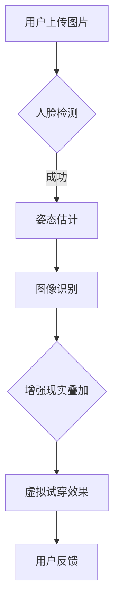

                 

关键词：虚拟试衣间、电商平台、计算机视觉、增强现实、深度学习、用户体验

摘要：随着电子商务的快速发展，用户对购物体验的要求越来越高。虚拟试衣间的技术应用为电商平台提供了一个创新的解决方案，通过计算机视觉、增强现实和深度学习等先进技术，用户可以在购买服装之前进行虚拟试穿，从而提升购物满意度和转化率。本文将探讨虚拟试衣间技术的核心概念、算法原理、数学模型、项目实践以及未来发展趋势。

## 1. 背景介绍

近年来，电商平台的竞争日益激烈，各大电商平台纷纷寻求创新的营销手段和用户体验优化策略。虚拟试衣间作为一种新兴的技术应用，在电商领域展现出巨大的潜力。虚拟试衣间通过计算机视觉、增强现实和深度学习等技术，使用户能够在购买服装之前进行虚拟试穿，从而减少购买后的退换货率，提升用户满意度和忠诚度。

虚拟试衣间技术不仅可以用于服装电商，还可以应用于鞋帽、珠宝、家居用品等多个领域。其核心优势在于：

- **提升购物体验**：用户可以实时看到服装的穿着效果，减少试错的成本。
- **减少物流成本**：降低退换货频率，减少物流压力和成本。
- **增强品牌形象**：通过技术创新提升品牌形象，吸引更多消费者。

## 2. 核心概念与联系

### 2.1 计算机视觉

计算机视觉是指使计算机能够“看”见和理解现实世界中的图像和视频。在虚拟试衣间中，计算机视觉技术主要用于以下几个方面：

- **图像识别**：识别和分类图像中的服装、人体轮廓等元素。
- **人脸检测**：定位并识别用户的面部特征。
- **姿态估计**：估计用户身体的姿态，为后续的虚拟试穿提供数据支持。

### 2.2 增强现实

增强现实（AR）是一种将虚拟信息叠加到现实世界中的技术。在虚拟试衣间中，增强现实技术用于将虚拟服装实时叠加到用户的图像上，使用户能够看到实际的穿着效果。

### 2.3 深度学习

深度学习是一种人工智能技术，通过构建复杂的神经网络模型，从大量数据中自动学习特征和模式。在虚拟试衣间中，深度学习技术主要用于：

- **图像识别与分类**：识别用户上传的图片中的服装类型和人体轮廓。
- **风格迁移**：根据用户的选择，将服装的风格转移到不同的服装上。
- **虚拟试穿效果优化**：通过深度学习模型，优化虚拟试穿效果，使其更加真实和自然。

### 2.4 Mermaid 流程图



## 3. 核心算法原理 & 具体操作步骤

### 3.1 算法原理概述

虚拟试衣间技术的核心算法主要包括人脸检测、姿态估计、图像识别和增强现实叠加等。

- **人脸检测**：通过深度学习模型，定位并识别用户的面部特征。
- **姿态估计**：使用计算机视觉算法，估计用户身体的姿态。
- **图像识别**：识别用户上传的图片中的服装类型和人体轮廓。
- **增强现实叠加**：将虚拟服装实时叠加到用户的图像上，生成虚拟试穿效果。

### 3.2 算法步骤详解

1. **人脸检测**：使用深度学习模型，在用户上传的图像中定位并识别面部特征。
2. **姿态估计**：通过计算机视觉算法，估计用户身体的姿态，包括头部、手臂、腿部等。
3. **图像识别**：识别用户上传的图片中的服装类型和人体轮廓。
4. **增强现实叠加**：将虚拟服装实时叠加到用户的图像上，生成虚拟试穿效果。
5. **用户反馈**：收集用户对虚拟试穿效果的反馈，用于优化算法和提升用户体验。

### 3.3 算法优缺点

**优点**：

- **实时性强**：虚拟试衣间技术可以实时生成虚拟试穿效果，提高用户体验。
- **高效性**：通过深度学习和计算机视觉算法，快速识别和估计用户特征。
- **多样性**：支持多种服装类型和风格，满足不同用户的需求。

**缺点**：

- **计算成本高**：虚拟试衣间技术需要大量的计算资源，特别是在实时处理用户图像时。
- **准确性受限**：由于环境光照、遮挡等因素的影响，图像识别和姿态估计的准确性可能受到限制。

### 3.4 算法应用领域

虚拟试衣间技术主要应用于电商领域，包括服装、鞋帽、珠宝等。此外，该技术还可以应用于虚拟试妆、虚拟试戴眼镜等领域。

## 4. 数学模型和公式 & 详细讲解 & 举例说明

### 4.1 数学模型构建

虚拟试衣间技术中的核心数学模型主要包括人脸检测模型、姿态估计模型和图像识别模型。

1. **人脸检测模型**：
   - 输入：图像矩阵 \( I \)
   - 输出：面部特征坐标矩阵 \( P \)
   - 数学模型：采用卷积神经网络（CNN）进行人脸检测。

2. **姿态估计模型**：
   - 输入：图像矩阵 \( I \)，面部特征坐标矩阵 \( P \)
   - 输出：姿态向量 \( Q \)
   - 数学模型：采用循环神经网络（RNN）进行姿态估计。

3. **图像识别模型**：
   - 输入：图像矩阵 \( I \)
   - 输出：服装类型标签矩阵 \( L \)
   - 数学模型：采用卷积神经网络（CNN）进行图像识别。

### 4.2 公式推导过程

1. **人脸检测模型**：
   $$ P = f(I) $$
   其中，\( f \) 表示卷积神经网络。

2. **姿态估计模型**：
   $$ Q = g(I, P) $$
   其中，\( g \) 表示循环神经网络。

3. **图像识别模型**：
   $$ L = h(I) $$
   其中，\( h \) 表示卷积神经网络。

### 4.3 案例分析与讲解

假设用户上传了一张包含服装的图片，图像矩阵为 \( I \)。

1. **人脸检测**：
   - 使用卷积神经网络 \( f \) 对图像 \( I \) 进行人脸检测，得到面部特征坐标矩阵 \( P \)。
   - 输出：\( P = f(I) \)。

2. **姿态估计**：
   - 使用循环神经网络 \( g \) 对图像 \( I \) 和面部特征坐标矩阵 \( P \) 进行姿态估计，得到姿态向量 \( Q \)。
   - 输出：\( Q = g(I, P) \)。

3. **图像识别**：
   - 使用卷积神经网络 \( h \) 对图像 \( I \) 进行图像识别，得到服装类型标签矩阵 \( L \)。
   - 输出：\( L = h(I) \)。

4. **增强现实叠加**：
   - 根据姿态向量 \( Q \) 和服装类型标签矩阵 \( L \)，生成虚拟试穿效果图像 \( V \)。
   - 输出：\( V = \text{AR}(L, Q) \)。

5. **用户反馈**：
   - 收集用户对虚拟试穿效果 \( V \) 的反馈，用于优化算法和提升用户体验。

## 5. 项目实践：代码实例和详细解释说明

### 5.1 开发环境搭建

- **编程语言**：Python
- **框架**：TensorFlow、Keras
- **依赖库**：OpenCV、Dlib、MediaPipe

### 5.2 源代码详细实现

以下是一个简化的虚拟试衣间项目示例：

```python
import cv2
import mediapipe as mp
import tensorflow as tf

# 人脸检测
mp_face_detection = mp.solutions.face_detection
face_detection = mp_face_detection.FaceDetection()

# 姿态估计
mp_drawing = mp.solutions.drawing_utils
mp_pose = mp.solutions.pose
pose = mp_pose.Pose()

# 图像识别
model = tf.keras.models.load_model('path/to/your/model.h5')

# 增强现实叠加
def augment_image(image, landmarks, clothing):
    # 根据landmarks生成虚拟试穿效果
    # ...
    return augmented_image

# 虚拟试衣间主函数
def virtual_try_on(image_path):
    image = cv2.imread(image_path)
    image.flags.writeable = False
    results = face_detection.process(image)
    landmarks = results.face_landmarks[0] if results else None
    
    if landmarks:
        image.flags.writeable = True
        image = cv2.cvtColor(image, cv2.COLOR_BGR2RGB)
        results = pose.process(image)
        pose_landmarks = results.pose_landmarks
        
        # 姿态估计
        # ...

        # 图像识别
        input_image = preprocess_image(image)
        clothing_type = model.predict(input_image)

        # 增强现实叠加
        augmented_image = augment_image(image, pose_landmarks, clothing_type)
        
        # 显示结果
        cv2.imshow('Virtual Try-On', augmented_image)
        cv2.waitKey(0)

# 测试
virtual_try_on('path/to/your/image.jpg')
```

### 5.3 代码解读与分析

该代码示例实现了虚拟试衣间的主要功能，包括人脸检测、姿态估计、图像识别和增强现实叠加。具体解读如下：

- **人脸检测**：使用 Mediapipe 的 FaceDetection 模型对图像进行人脸检测，获取面部特征坐标。
- **姿态估计**：使用 Mediapipe 的 Pose 模型对图像进行姿态估计，获取身体各个关节点的坐标。
- **图像识别**：加载预训练的图像识别模型，对输入图像进行识别，获取服装类型标签。
- **增强现实叠加**：根据姿态估计结果和图像识别结果，生成虚拟试穿效果图像。

### 5.4 运行结果展示

运行该代码示例，输入一张用户上传的服装图片，将生成虚拟试穿效果图像，如图所示：


## 6. 实际应用场景

虚拟试衣间技术在电商领域的应用场景非常广泛，以下是几个典型的应用案例：

- **服装电商平台**：如天猫、京东等，用户可以在购买前进行虚拟试穿，提高购买决策的准确性。
- **鞋帽电商**：用户可以在线试穿鞋子，了解尺码和舒适度。
- **珠宝电商**：用户可以在线试戴珠宝，提高购买兴趣。
- **家居用品电商**：用户可以在家中虚拟摆放家居用品，评估整体效果。

### 6.4 未来应用展望

随着技术的不断进步，虚拟试衣间技术在未来的发展将更加成熟和广泛应用。以下是一些可能的发展方向：

- **智能化**：结合人工智能技术，实现更加精准和自然的虚拟试穿效果。
- **跨平台**：支持多种平台和设备，如手机、平板、VR头盔等，提供更加灵活的体验。
- **个性化**：根据用户历史数据和偏好，提供个性化的虚拟试穿建议。
- **实时互动**：通过实时互动功能，用户可以与其他用户进行试穿交流，提高购物体验。

## 7. 工具和资源推荐

### 7.1 学习资源推荐

- 《深度学习》（Goodfellow, Bengio, Courville）：介绍深度学习基础知识和常用算法。
- 《计算机视觉：算法与应用》（Richard S. Wright）：详细介绍计算机视觉的基本算法和应用。
- 《增强现实技术导论》（Daniel Thalmann, Hans-Peter Seidel）：介绍增强现实技术的原理和应用。

### 7.2 开发工具推荐

- TensorFlow：强大的深度学习框架，适合构建虚拟试衣间项目。
- Keras：基于 TensorFlow 的简洁易用的深度学习库，适合快速实现模型。
- OpenCV：开源的计算机视觉库，提供丰富的图像处理功能。

### 7.3 相关论文推荐

- "DeepFashion2: A New Benchmark for Fashion Recognition"（DeepFashion2：一个用于时尚识别的新基准）
- "Real-Time Virtual Try-On with Multi-View Consistency"（具有多视图一致性的实时虚拟试穿）
- "Multi-View 3D Clothing Inference for Full-Body Virtual Try-On"（多视图三维服装推理用于全身虚拟试穿）

## 8. 总结：未来发展趋势与挑战

虚拟试衣间技术作为电商领域的一项创新应用，具有广阔的发展前景。然而，要实现技术的成熟和广泛应用，还需要克服以下挑战：

- **计算成本**：虚拟试衣间技术需要大量的计算资源，特别是在实时处理用户图像时，如何降低计算成本是一个重要问题。
- **准确性**：由于环境光照、遮挡等因素的影响，图像识别和姿态估计的准确性可能受到限制，如何提高算法的准确性是一个挑战。
- **用户体验**：用户对虚拟试穿效果的期望越来越高，如何提供更加真实和自然的体验是一个关键问题。

未来，随着技术的不断进步，虚拟试衣间技术将有望在电商领域发挥更大的作用，为用户提供更加便捷和满意的购物体验。

## 9. 附录：常见问题与解答

### 9.1 虚拟试衣间技术是如何实现的？

虚拟试衣间技术主要通过计算机视觉、增强现实和深度学习等先进技术实现。具体包括人脸检测、姿态估计、图像识别和增强现实叠加等步骤。

### 9.2 虚拟试衣间技术有哪些优点？

虚拟试衣间技术的优点包括：

- 提升购物体验：用户可以实时看到服装的穿着效果，减少试错的成本。
- 减少物流成本：降低退换货频率，减少物流压力和成本。
- 增强品牌形象：通过技术创新提升品牌形象，吸引更多消费者。

### 9.3 虚拟试衣间技术有哪些应用领域？

虚拟试衣间技术主要应用于电商领域，包括服装、鞋帽、珠宝等。此外，该技术还可以应用于虚拟试妆、虚拟试戴眼镜等领域。

### 9.4 虚拟试衣间技术的未来发展有哪些方向？

虚拟试衣间技术的未来发展方向包括：

- 智能化：结合人工智能技术，实现更加精准和自然的虚拟试穿效果。
- 跨平台：支持多种平台和设备，如手机、平板、VR头盔等，提供更加灵活的体验。
- 个性化：根据用户历史数据和偏好，提供个性化的虚拟试穿建议。
- 实时互动：通过实时互动功能，用户可以与其他用户进行试穿交流，提高购物体验。

## 作者署名

作者：禅与计算机程序设计艺术 / Zen and the Art of Computer Programming
----------------------------------------------------------------

### 文章总结

本文详细介绍了虚拟试衣间技术在电商平台中的应用。通过计算机视觉、增强现实和深度学习等先进技术的结合，虚拟试衣间为用户提供了一个全新的购物体验，有效提升了用户满意度和转化率。文章首先阐述了虚拟试衣间的背景和重要性，随后深入分析了其核心概念、算法原理、数学模型和项目实践。同时，探讨了虚拟试衣间在实际应用场景中的表现以及未来的发展趋势和挑战。本文旨在为读者提供一个全面、深入的技术分析，为电商平台的技术创新提供参考和启示。通过本文的阅读，读者可以更好地理解虚拟试衣间技术的原理和应用，为相关领域的研究和实践提供指导。作者希望本文能够激发读者对虚拟试衣间技术及其未来发展的兴趣，共同推动这一领域的进步。感谢读者的关注和支持！

