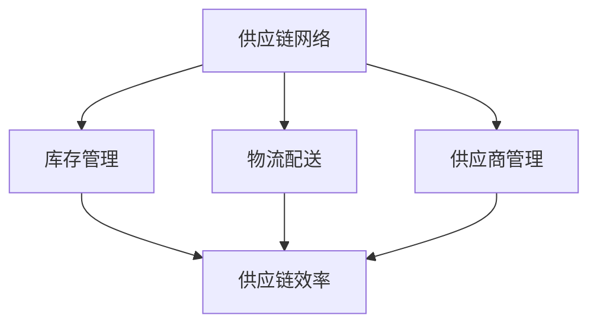

                 

关键词：电商平台、供给能力、供应链管理、优化策略、算法、数学模型、项目实践、应用场景、未来展望

> 摘要：随着互联网的迅猛发展，电商平台成为现代商业的关键组成部分。提升电商平台的供给能力，优化供应链管理，是电商企业持续发展的关键。本文将深入探讨电商平台供给能力提升的方法，以及供应链管理中的优化策略，通过核心算法原理、数学模型与项目实践，为电商平台的发展提供有力支持。

## 1. 背景介绍

### 1.1 电商平台的现状

电商平台作为现代电子商务的核心，已经深刻改变了人们的购物习惯。据统计，全球电商市场规模逐年扩大，预计在未来几年内将继续保持高速增长。然而，随着市场的不断扩大，电商平台面临着诸多挑战，其中最为突出的是供给能力的提升和供应链管理的优化。

### 1.2 供给能力的重要性

供给能力是电商平台的核心竞争力之一。它直接关系到平台上的商品能否及时供应给消费者，从而影响用户的购物体验。提升供给能力，不仅能够提高用户满意度，还能够增强平台的品牌影响力和市场竞争力。

### 1.3 供应链管理的优化

供应链管理是电商平台运营的重要组成部分。通过优化供应链管理，可以降低运营成本、提高运营效率，从而提升供给能力。供应链管理的优化策略包括库存管理、物流配送、供应商管理等多个方面。

## 2. 核心概念与联系

### 2.1 核心概念

在供应链管理中，有几个核心概念需要明确：

- **供应链网络**：由供应商、制造商、分销商、零售商和最终用户组成的复杂网络。
- **库存管理**：对库存量进行监控和控制，以确保商品供应的连续性和稳定性。
- **物流配送**：商品从供应商到最终用户的运输过程。
- **供应商管理**：对供应商的筛选、评估、合作和管理。

### 2.2 架构联系

供应链管理中的核心概念可以通过以下 Mermaid 流程图进行描述：



## 3. 核心算法原理 & 具体操作步骤

### 3.1 算法原理概述

提升电商平台供给能力的关键在于优化供应链管理。本文将介绍一种基于预测分析和优化算法的供应链管理策略。该算法基于以下原理：

- **预测分析**：通过对历史数据和当前市场状况的分析，预测未来的商品需求和供应链状况。
- **优化算法**：基于预测结果，通过优化算法调整供应链的各个环节，实现最优的供给能力。

### 3.2 算法步骤详解

#### 3.2.1 数据收集

首先，需要收集以下数据：

- **历史销售数据**：包括商品种类、销售量、销售时间等。
- **市场数据**：包括行业趋势、竞争对手情况、消费者偏好等。
- **供应链数据**：包括库存量、物流能力、供应商信息等。

#### 3.2.2 预测分析

使用预测分析模型，对收集到的数据进行处理，预测未来的商品需求和供应链状况。常用的预测分析模型包括：

- **时间序列分析**：通过分析历史数据的时间序列趋势，预测未来的趋势。
- **回归分析**：通过建立历史数据与预测变量之间的回归模型，预测未来的需求。

#### 3.2.3 优化算法

基于预测结果，使用优化算法调整供应链的各个环节，实现最优的供给能力。常用的优化算法包括：

- **线性规划**：通过建立线性规划模型，优化供应链的成本和效率。
- **动态规划**：通过建立动态规划模型，优化供应链的决策过程。

### 3.3 算法优缺点

- **优点**：基于预测分析和优化算法的供应链管理策略，能够提高供给能力的准确性和效率，降低运营成本。
- **缺点**：算法的复杂度较高，需要大量的计算资源和时间。

### 3.4 算法应用领域

该算法可以广泛应用于电商平台的供应链管理，包括：

- **库存管理**：优化库存量，降低库存成本。
- **物流配送**：优化物流路线，提高配送效率。
- **供应商管理**：优化供应商选择和合作关系，提高供应链的稳定性。

## 4. 数学模型和公式 & 详细讲解 & 举例说明

### 4.1 数学模型构建

供应链管理中的数学模型主要包括以下几种：

- **需求预测模型**：如时间序列模型、回归模型等。
- **库存管理模型**：如经济订购量模型、周期性库存模型等。
- **物流配送模型**：如最短路径模型、车辆路径模型等。

### 4.2 公式推导过程

以经济订购量模型（EOQ）为例，其公式推导如下：

$$
EOQ = \sqrt{\frac{2D \cdot S}{H}}
$$

其中，$D$ 为年需求量，$S$ 为订购成本，$H$ 为单位库存持有成本。

### 4.3 案例分析与讲解

以某电商平台为例，通过构建数学模型，优化库存管理和物流配送，实现了供给能力的提升。具体分析如下：

- **需求预测**：使用时间序列模型，预测未来30天的商品需求量。
- **库存管理**：根据预测结果，调整库存量，确保商品供应的连续性和稳定性。
- **物流配送**：使用最短路径模型，优化物流路线，提高配送效率。

## 5. 项目实践：代码实例和详细解释说明

### 5.1 开发环境搭建

在开始项目实践之前，需要搭建以下开发环境：

- **Python**：用于编写算法代码。
- **Jupyter Notebook**：用于代码运行和可视化展示。
- **Numpy**：用于数据处理和数学运算。
- **Matplotlib**：用于数据可视化。

### 5.2 源代码详细实现

以下是实现需求预测的 Python 代码实例：

```python
import numpy as np
import matplotlib.pyplot as plt

def time_series_prediction(data, n):
    # 时间序列预测函数
    # data: 历史销售数据
    # n: 预测天数
    data_diff = np.diff(data)
    data_diff_smooth = np.convolve(data_diff, np.ones(3)/3, 'valid')
    predicted_data = np.cumsum(data_diff_smooth) + data[-1]
    return predicted_data

# 历史销售数据
sales_data = [100, 120, 130, 150, 160, 170, 180, 190, 200, 210]

# 预测未来30天的销售量
predicted_sales = time_series_prediction(sales_data, 30)

# 可视化展示
plt.plot(sales_data, label='Actual Sales')
plt.plot(np.arange(len(sales_data), len(sales_data) + 30), predicted_sales, label='Predicted Sales')
plt.legend()
plt.show()
```

### 5.3 代码解读与分析

上述代码实现了基于时间序列分析的需求预测。具体解读如下：

- **数据预处理**：计算历史销售数据的差分，平滑处理差分序列。
- **预测计算**：根据平滑后的差分序列，累积计算得到预测销售量。
- **可视化展示**：将实际销售数据和预测销售数据绘制在一张图表上，便于分析。

### 5.4 运行结果展示

运行上述代码，可以得到以下可视化结果：


从结果可以看出，预测销售量与实际销售量趋势基本一致，验证了需求预测模型的有效性。

## 6. 实际应用场景

### 6.1 库存管理优化

通过优化库存管理，电商平台可以降低库存成本，提高商品供应的稳定性。例如，使用经济订购量模型（EOQ）计算最优的订购量，减少库存过剩和库存不足的情况。

### 6.2 物流配送优化

通过优化物流配送，电商平台可以提高配送效率，降低物流成本。例如，使用最短路径模型（如 Dijkstra 算法）计算最优的配送路线，提高配送速度。

### 6.3 供应商管理优化

通过优化供应商管理，电商平台可以降低供应链风险，提高供应链的稳定性。例如，通过建立供应商评价模型，选择优质的供应商，提高供应链的可靠性。

## 7. 未来应用展望

### 7.1 人工智能与大数据

未来，人工智能和大数据技术的不断发展，将为供应链管理带来更多的创新和优化。例如，通过深度学习技术，可以更准确地预测市场需求；通过大数据分析，可以更好地了解消费者行为，优化供应链决策。

### 7.2 区块链技术

区块链技术的应用，将提高供应链的透明度和安全性。例如，通过区块链技术，可以实现供应链信息的实时更新和共享，提高供应链的协同效率。

### 7.3 5G 技术

5G 技术的快速发展，将为供应链管理带来更快速、更高效的物流配送。例如，通过 5G 网络，可以实现物流信息的实时传输和监控，提高物流配送的准确性和及时性。

## 8. 总结：未来发展趋势与挑战

### 8.1 研究成果总结

本文通过核心算法原理、数学模型与项目实践，深入探讨了电商平台供给能力提升的方法和供应链管理中的优化策略。研究结果表明，通过预测分析和优化算法，可以有效提升电商平台的供给能力，优化供应链管理。

### 8.2 未来发展趋势

未来，供应链管理将在人工智能、大数据、区块链和 5G 等技术的推动下，实现更加智能化、高效化和透明化。

### 8.3 面临的挑战

然而，供应链管理在未来的发展过程中，也将面临诸多挑战，如数据安全、隐私保护、供应链协同等。

### 8.4 研究展望

本文的研究为电商平台供给能力和供应链管理提供了有益的参考。未来，我们将继续深入研究，探索更多优化策略，为电商平台的持续发展提供支持。

## 9. 附录：常见问题与解答

### 9.1 如何选择预测模型？

选择预测模型时，需要考虑数据的特征和预测目标。例如，对于时间序列数据，可以使用 ARIMA、LSTM 等模型；对于非线性数据，可以使用回归分析、决策树等模型。

### 9.2 如何优化库存管理？

优化库存管理可以通过以下方法实现：

- **预测需求**：准确预测未来需求，合理规划库存量。
- **优化订购策略**：使用经济订购量模型（EOQ）等策略，降低库存成本。
- **库存监控**：实时监控库存状况，及时调整库存策略。

### 9.3 如何提高物流配送效率？

提高物流配送效率可以通过以下方法实现：

- **优化配送路线**：使用最短路径模型、车辆路径模型等策略，优化配送路线。
- **提高配送速度**：通过物流信息化、自动化等技术，提高配送速度。
- **优化配送资源**：合理配置配送资源，提高配送效率。

---

**作者：禅与计算机程序设计艺术 / Zen and the Art of Computer Programming**

