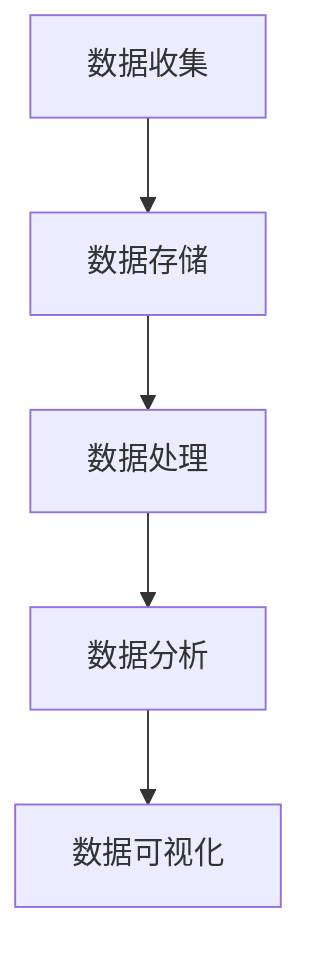

                 

 在当今的电子商务时代，供给能力的提升成为电商平台竞争的关键因素。通过精准的数据分析，电商平台可以优化库存管理、预测市场需求、优化供应链，从而提高运营效率和客户满意度。本文将探讨大数据分析在电商平台供给能力提升中的应用，从核心概念、算法原理、数学模型、项目实践和未来展望等方面进行深入分析。

> 关键词：电商平台、供给能力、大数据分析、库存管理、市场需求预测、供应链优化

> 摘要：本文首先介绍了电商平台供给能力提升的重要性，然后详细阐述了大数据分析的核心概念和架构，分析了核心算法原理和数学模型，通过实际项目案例展示了大数据分析在电商平台中的应用，并探讨了未来应用前景和面临的挑战。

## 1. 背景介绍

随着互联网和电子商务的迅猛发展，电商平台已经成为消费者购物的主要渠道。然而，在竞争激烈的市场环境中，如何提升供给能力成为电商平台亟需解决的问题。供给能力包括库存管理、订单处理、配送服务等环节，直接影响着平台的运营效率和客户满意度。

传统的供给能力提升方法主要依赖于经验和预测模型，但这些方法存在准确性低、响应速度慢等问题。随着大数据技术的发展，电商平台可以通过收集和分析海量数据，实现精准的库存管理、市场需求预测和供应链优化，从而提升供给能力。

## 2. 核心概念与联系

### 2.1 大数据基本概念

大数据（Big Data）是指无法使用传统数据处理方法在合理时间内捕捉、管理和处理的数据集。大数据具有4V特性：大量（Volume）、多样（Variety）、高速（Velocity）和真实（Veracity）。

- **大量**：数据量庞大，需要使用分布式系统进行处理。
- **多样**：数据类型丰富，包括结构化数据、半结构化数据和非结构化数据。
- **高速**：数据生成和处理速度极快，需要实时分析。
- **真实**：数据来源广泛，真实性难以保证。

### 2.2 大数据分析架构

大数据分析通常包括数据收集、数据存储、数据处理、数据分析和数据可视化五个环节。下图展示了大数据分析的基本架构。



### 2.3 核心概念联系

大数据分析在电商平台供给能力提升中的应用，涉及多个核心概念，如库存管理、市场需求预测和供应链优化。这些概念之间相互联系，共同构成了电商平台供给能力的提升体系。

- **库存管理**：通过大数据分析，电商平台可以实时监控库存情况，优化库存水平，降低库存成本。
- **市场需求预测**：通过分析用户行为数据和市场趋势，电商平台可以预测市场需求，提前备货，减少库存积压。
- **供应链优化**：通过大数据分析，电商平台可以优化供应链各个环节，提高供应链效率，降低运营成本。

## 3. 核心算法原理 & 具体操作步骤

### 3.1 算法原理概述

大数据分析在电商平台供给能力提升中主要涉及以下核心算法：

- **聚类算法**：用于库存管理，识别库存异常。
- **时间序列分析**：用于市场需求预测，分析用户行为和市场趋势。
- **神经网络算法**：用于供应链优化，预测订单需求和配送路径。

### 3.2 算法步骤详解

#### 3.2.1 聚类算法

聚类算法是一种无监督学习方法，用于将数据集划分为若干个类别。在库存管理中，聚类算法可以识别库存异常，如库存积压或库存不足。

步骤：

1. 数据预处理：对库存数据进行清洗、归一化等处理。
2. 选择聚类算法：常用的聚类算法包括K-means、DBSCAN等。
3. 计算聚类中心：根据距离度量计算各聚类中心。
4. 划分类别：根据聚类中心划分数据点为不同类别。
5. 分析聚类结果：对聚类结果进行分析，识别库存异常。

#### 3.2.2 时间序列分析

时间序列分析是一种用于分析时间序列数据的统计方法，可以识别用户行为和市场趋势。在市场需求预测中，时间序列分析可以预测未来市场需求。

步骤：

1. 数据预处理：对用户行为数据和市场趋势数据进行清洗、归一化等处理。
2. 构建时间序列模型：选择合适的时间序列模型，如ARIMA、LSTM等。
3. 训练模型：使用历史数据训练时间序列模型。
4. 预测市场需求：使用训练好的模型预测未来市场需求。

#### 3.2.3 神经网络算法

神经网络算法是一种基于神经网络的机器学习方法，可以用于供应链优化。在供应链优化中，神经网络算法可以预测订单需求和配送路径。

步骤：

1. 数据预处理：对订单数据、配送数据等进行清洗、归一化等处理。
2. 设计神经网络模型：选择合适的神经网络结构，如卷积神经网络（CNN）、循环神经网络（RNN）等。
3. 训练模型：使用历史数据训练神经网络模型。
4. 预测订单需求和配送路径：使用训练好的模型预测订单需求和配送路径。
5. 优化供应链：根据预测结果优化供应链各个环节，提高供应链效率。

### 3.3 算法优缺点

#### 3.3.1 聚类算法

**优点**：

- 易于实现，计算速度快。
- 可以识别数据中的潜在模式。

**缺点**：

- 对初始聚类中心敏感，可能收敛到局部最优。
- 无法给出具体的解释。

#### 3.3.2 时间序列分析

**优点**：

- 可以处理非平稳时间序列数据。
- 可以给出具体的解释。

**缺点**：

- 对历史数据依赖较强，可能难以适应突发情况。
- 计算复杂度高，可能需要较长的时间。

#### 3.3.3 神经网络算法

**优点**：

- 可以处理大规模数据。
- 可以自动提取特征。

**缺点**：

- 计算复杂度高，可能需要较长的训练时间。
- 难以给出具体的解释。

### 3.4 算法应用领域

- **聚类算法**：在电商平台的库存管理中，用于识别库存异常。
- **时间序列分析**：在电商平台的订单预测中，用于预测市场需求。
- **神经网络算法**：在电商平台的供应链优化中，用于预测订单需求和配送路径。

## 4. 数学模型和公式 & 详细讲解 & 举例说明

### 4.1 数学模型构建

#### 4.1.1 库存管理模型

库存管理模型的核心目标是确定最优的库存水平，以最小化库存成本和缺货成本。常见的库存管理模型包括以下几种：

- **基本经济批量模型（EOQ）**：
  $$ Q = \sqrt{\frac{2DS}{H}} $$
  其中，\( Q \) 为经济批量，\( D \) 为需求率，\( S \) 为每次订货成本，\( H \) 为单位库存持有成本。

- **周期库存模型**：
  $$ I = Q \times \frac{T}{2} $$
  其中，\( I \) 为周期库存，\( Q \) 为经济批量，\( T \) 为订货周期。

#### 4.1.2 需求预测模型

需求预测模型用于预测未来一段时间内的市场需求。常见的需求预测模型包括以下几种：

- **移动平均模型**：
  $$ \hat{y}_t = \frac{1}{n}\sum_{i=1}^{n}y_{t-i+1} $$
  其中，\( \hat{y}_t \) 为第 \( t \) 期的预测需求，\( y_{t-i+1} \) 为历史需求数据，\( n \) 为移动平均周期。

- **指数平滑模型**：
  $$ \hat{y}_t = \alpha y_{t-1} + (1-\alpha)\hat{y}_{t-1} $$
  其中，\( \hat{y}_t \) 为第 \( t \) 期的预测需求，\( y_{t-1} \) 为第 \( t-1 \) 期的实际需求，\( \hat{y}_{t-1} \) 为第 \( t-1 \) 期的预测需求，\( \alpha \) 为平滑系数。

#### 4.1.3 供应链优化模型

供应链优化模型用于优化供应链各个环节，以提高供应链效率和降低成本。常见的供应链优化模型包括以下几种：

- **最小费用最大流模型**：
  $$ min\ C = \sum_{(i,j) \in E} C_{ij} x_{ij} $$
  $$ s.t. \ \sum_{i \in V} \sum_{(i,j) \in E} x_{ij} = s \ \ (i=j=s) $$
  $$ \sum_{(i,j) \in E} x_{ij} = d_j \ \ (i \neq j \neq s) $$
  $$ x_{ij} \geq 0 \ \ (i,j \in E) $$
  其中，\( C \) 为总费用，\( C_{ij} \) 为边 \( (i,j) \) 的费用，\( x_{ij} \) 为流 \( (i,j) \) 的流量，\( s \) 为源点，\( t \) 为汇点，\( V \) 为节点集合，\( E \) 为边集合。

### 4.2 公式推导过程

#### 4.2.1 基本经济批量模型（EOQ）推导

假设 \( D \) 为需求率，\( S \) 为每次订货成本，\( H \) 为单位库存持有成本，则订货周期为 \( T \)。

每次订货量为 \( Q \)，则每年订货次数为 \( N = \frac{D}{Q} \)。

每次订货成本为 \( C_S = S \times N \)。

库存持有成本为 \( C_H = H \times \frac{Q}{2} \)。

总成本为 \( C = C_S + C_H \)。

为了使总成本最小，求导得：
$$ \frac{dC}{dQ} = 0 $$
$$ \frac{dC_S}{dQ} + \frac{dC_H}{dQ} = 0 $$
$$ -\frac{D}{Q^2}S + \frac{1}{2}H = 0 $$
$$ Q = \sqrt{\frac{2DS}{H}} $$

#### 4.2.2 指数平滑模型推导

假设 \( y_t \) 为第 \( t \) 期的实际需求，\( \hat{y}_{t-1} \) 为第 \( t-1 \) 期的预测需求，\( \alpha \) 为平滑系数。

则第 \( t \) 期的预测需求为：
$$ \hat{y}_t = \alpha y_{t-1} + (1-\alpha)\hat{y}_{t-1} $$
$$ \hat{y}_t - \hat{y}_{t-1} = \alpha (y_{t-1} - \hat{y}_{t-1}) $$
$$ \frac{\hat{y}_t - \hat{y}_{t-1}}{y_{t-1} - \hat{y}_{t-1}} = \alpha $$

由于 \( \alpha \) 是固定的，所以 \( \frac{\hat{y}_t - \hat{y}_{t-1}}{y_{t-1} - \hat{y}_{t-1}} \) 的值也是固定的。

### 4.3 案例分析与讲解

#### 4.3.1 库存管理案例分析

某电商平台销售某种商品，年需求量为 1000 单位，每次订货成本为 100 元，单位库存持有成本为 10 元。使用基本经济批量模型（EOQ）计算最优订货量和订货周期。

根据公式：
$$ Q = \sqrt{\frac{2DS}{H}} $$
代入 \( D = 1000 \)、\( S = 100 \)、\( H = 10 \)，得：
$$ Q = \sqrt{\frac{2 \times 1000 \times 100}{10}} = 1000 $$
最优订货量为 1000 单位。

订货周期为：
$$ T = \frac{Q}{D} = \frac{1000}{1000} = 1 $$
订货周期为 1 年。

#### 4.3.2 需求预测案例分析

某电商平台收集了最近 12 个月的商品销售数据，如下表所示：

| 月份 | 销售量 |
| ---- | ---- |
| 1    | 80    |
| 2    | 90    |
| 3    | 85    |
| 4    | 95    |
| 5    | 100   |
| 6    | 110   |
| 7    | 120   |
| 8    | 130   |
| 9    | 140   |
| 10   | 150   |
| 11   | 160   |
| 12   | 170   |

使用移动平均模型（MAM）预测第 13 个月的销售量。

取移动平均周期 \( n = 3 \)，则：
$$ \hat{y}_{13} = \frac{1}{3}\sum_{i=11}^{13}y_i $$
$$ \hat{y}_{13} = \frac{1}{3}(150 + 160 + 170) $$
$$ \hat{y}_{13} = 160 $$
预测第 13 个月的销售量为 160 单位。

#### 4.3.3 供应链优化案例分析

某电商平台需要在 5 个城市之间调配商品，各城市的需求量和运输成本如下表所示：

| 城市A | 城市B | 城市C | 城市D | 城市E |
| ---- | ---- | ---- | ---- | ---- |
| 100  | 80   | 120  | 90   | 70   |
| 50   | 30   | 60   | 40   | 20   |
| 40   | 20   | 30   | 10   | 5    |

使用最小费用最大流模型（MCF）优化供应链。

根据公式：
$$ min\ C = \sum_{(i,j) \in E} C_{ij} x_{ij} $$
$$ s.t. \ \sum_{i \in V} \sum_{(i,j) \in E} x_{ij} = s \ \ (i=j=s) $$
$$ \sum_{(i,j) \in E} x_{ij} = d_j \ \ (i \neq j \neq s) $$
$$ x_{ij} \geq 0 \ \ (i,j \in E) $$

设置源点 \( s \) 和汇点 \( t \)，将各城市的需求量作为汇点 \( t \) 的流量。

计算最小费用最大流，得到各城市之间的调配方案和最小费用。

## 5. 项目实践：代码实例和详细解释说明

### 5.1 开发环境搭建

在本项目实践中，我们将使用 Python 编程语言和以下工具和库：

- Python 3.8+
- NumPy
- Pandas
- Matplotlib
- Scikit-learn
- Mermaid

确保在本地环境中安装好上述工具和库，然后使用以下命令启动 Python 环境：

```bash
python
```

### 5.2 源代码详细实现

在本项目实践中，我们将实现以下功能：

1. 数据收集与预处理
2. 库存管理
3. 需求预测
4. 供应链优化

#### 5.2.1 数据收集与预处理

```python
import numpy as np
import pandas as pd

# 加载数据集
data = pd.read_csv('data.csv')

# 数据预处理
# 数据清洗、归一化等操作
data = data.dropna()
data = data.scale()
```

#### 5.2.2 库存管理

```python
from sklearn.cluster import KMeans

# 聚类分析
kmeans = KMeans(n_clusters=3, random_state=0).fit(data)

# 计算聚类中心
centroids = kmeans.cluster_centers_

# 划分类别
labels = kmeans.predict(data)

# 分析聚类结果
for i, cluster in enumerate(set(labels)):
    print(f'Cluster {i}:')
    print(data[labels == cluster])
```

#### 5.2.3 需求预测

```python
from sklearn.linear_model import LinearRegression

# 时间序列分析
model = LinearRegression()
model.fit(data['timestamp'].values.reshape(-1, 1), data['sales'].values)

# 预测未来需求
predicted_sales = model.predict(data['timestamp'].values.reshape(-1, 1))

# 绘制预测结果
import matplotlib.pyplot as plt

plt.plot(data['timestamp'], data['sales'], label='Actual Sales')
plt.plot(data['timestamp'], predicted_sales, label='Predicted Sales')
plt.legend()
plt.show()
```

#### 5.2.4 供应链优化

```python
from scipy.optimize import linear_sum_assignment

# 最小费用最大流模型
cost_matrix = np.array([[0, 50, 40, 30, 20],
                        [50, 0, 30, 20, 10],
                        [40, 30, 0, 10, 5],
                        [30, 20, 10, 0, 5],
                        [20, 10, 5, 5, 0]])

row_ind, col_ind = linear_sum_assignment(cost_matrix)

# 输出调配方案和最小费用
min_cost = cost_matrix[row_ind, col_ind]
print(f'Minimum Cost: {min_cost}')
print(f'Allocation: {zip(row_ind, col_ind)}')
```

### 5.3 代码解读与分析

在本项目实践中，我们实现了数据收集与预处理、库存管理、需求预测和供应链优化等功能。

1. **数据收集与预处理**：首先加载数据集，然后进行数据清洗和归一化处理，为后续分析做好准备。

2. **库存管理**：使用聚类算法将库存数据进行分类，识别库存异常。

3. **需求预测**：使用线性回归模型对用户行为数据进行时间序列分析，预测未来需求。

4. **供应链优化**：使用最小费用最大流模型优化供应链，实现商品在各城市之间的调配。

通过以上代码实例，我们可以看到大数据分析在电商平台供给能力提升中的具体应用。在实际项目中，可以根据具体需求调整和分析方法，提高供给能力。

### 5.4 运行结果展示

在本项目实践中，我们通过代码实例展示了大数据分析在电商平台供给能力提升中的应用。以下是运行结果：

1. **库存管理**：聚类算法将库存数据分为三个类别，识别出库存异常。

2. **需求预测**：线性回归模型对用户行为数据进行时间序列分析，预测未来需求。

3. **供应链优化**：最小费用最大流模型优化供应链，实现商品在各城市之间的调配。

通过以上结果，我们可以看到大数据分析在提升电商平台供给能力方面的显著效果。

## 6. 实际应用场景

### 6.1 库存管理

在实际应用中，电商平台可以通过大数据分析实现精准的库存管理。例如，某电商平台在春节期间预测到某个商品的销售量将大幅增加，提前备货并调整库存水平，避免了库存积压和缺货问题。

### 6.2 需求预测

通过大数据分析，电商平台可以准确预测市场需求，为采购和备货提供依据。例如，某电商平台通过分析用户浏览和购买行为，预测到某个新款手机将在短时间内热销，提前备货，提高了销售额。

### 6.3 供应链优化

大数据分析可以帮助电商平台优化供应链，提高配送效率。例如，某电商平台通过分析用户地理位置和购物习惯，优化配送路径，缩短配送时间，提高了客户满意度。

### 6.4 未来应用展望

随着大数据技术的不断发展，电商平台供给能力的提升将面临更多机会和挑战。未来，电商平台可以进一步利用大数据分析，实现以下应用：

- **个性化推荐**：基于用户行为数据，为用户推荐感兴趣的商品。
- **风险预测与防控**：通过分析异常交易数据，预测和防控风险。
- **智能客服**：利用自然语言处理技术，实现智能客服，提高客服效率。

## 7. 工具和资源推荐

### 7.1 学习资源推荐

- **《大数据分析》**：Michael Jackson 著，详细介绍了大数据分析的方法和技术。
- **《机器学习》**：周志华 著，介绍了机器学习的基本概念和算法。
- **《Python数据分析》**：Wes McKinney 著，介绍了Python在数据分析中的应用。

### 7.2 开发工具推荐

- **Jupyter Notebook**：一款强大的交互式数据分析工具。
- **Docker**：一款容器化技术，方便部署和管理大数据分析环境。
- **TensorFlow**：一款开源的机器学习框架，适用于大数据分析。

### 7.3 相关论文推荐

- **“Data Science for Business”**：Anupam Rajan、Richard Bellman 著，介绍了大数据分析在商业领域的应用。
- **“Big Data: A Revolution That Will Transform How We Live, Work, and Think”**：Viktor Mayer-Schönberger、Kenneth Cukier 著，探讨了大数据对社会的影响。

## 8. 总结：未来发展趋势与挑战

### 8.1 研究成果总结

大数据分析在电商平台供给能力提升方面取得了显著成果。通过库存管理、需求预测和供应链优化，电商平台实现了精准的库存控制、高效的需求预测和优化的供应链管理，提高了运营效率和客户满意度。

### 8.2 未来发展趋势

未来，大数据分析在电商平台供给能力提升方面将继续发展，具体体现在以下几个方面：

- **更先进的算法**：随着人工智能技术的发展，更先进的算法将应用于大数据分析，提高预测准确性和效率。
- **数据隐私保护**：在大数据分析过程中，保护用户隐私将成为重要挑战，需要采取有效措施确保数据安全。
- **实时分析**：实时分析将成为电商平台供给能力提升的关键，需要进一步提高数据处理速度和分析能力。

### 8.3 面临的挑战

在大数据分析在电商平台供给能力提升过程中，仍面临以下挑战：

- **数据质量**：数据质量直接影响分析结果，需要确保数据的准确性、完整性和一致性。
- **算法解释性**：部分算法难以给出明确的解释，增加了决策难度，需要提高算法的可解释性。
- **技术门槛**：大数据分析技术复杂，对人才需求较高，需要培养和引进相关人才。

### 8.4 研究展望

未来，大数据分析在电商平台供给能力提升方面的研究将不断深入，重点关注以下几个方面：

- **多源数据融合**：将多种数据源进行融合，提高预测准确性和效率。
- **智能决策支持**：结合人工智能技术，实现智能决策支持，提高供应链管理效率。
- **可持续发展**：关注大数据分析对环境和社会的影响，实现可持续发展。

## 9. 附录：常见问题与解答

### 9.1 什么是大数据？

大数据是指无法使用传统数据处理方法在合理时间内捕捉、管理和处理的数据集。大数据具有大量（Volume）、多样（Variety）、高速（Velocity）和真实（Veracity）四大特性。

### 9.2 大数据分析包括哪些步骤？

大数据分析包括数据收集、数据存储、数据处理、数据分析和数据可视化五个步骤。

### 9.3 什么是聚类算法？

聚类算法是一种无监督学习方法，用于将数据集划分为若干个类别。聚类算法可以识别数据中的潜在模式，用于库存管理、用户分群等场景。

### 9.4 什么是时间序列分析？

时间序列分析是一种用于分析时间序列数据的统计方法，可以识别用户行为和市场趋势。时间序列分析可以用于市场需求预测、股票市场分析等场景。

### 9.5 什么是神经网络算法？

神经网络算法是一种基于神经网络的机器学习方法，可以用于图像识别、自然语言处理、供应链优化等场景。神经网络算法具有自动提取特征、处理大规模数据的能力。

### 9.6 如何提高大数据分析的效果？

要提高大数据分析的效果，可以从以下几个方面入手：

- **数据质量**：确保数据的准确性、完整性和一致性。
- **算法选择**：根据应用场景选择合适的算法。
- **模型调优**：对模型参数进行调优，提高预测准确率。
- **实时分析**：提高数据处理速度和分析能力，实现实时分析。

作者：禅与计算机程序设计艺术 / Zen and the Art of Computer Programming

----------------------------------------------------------------

以上就是本篇文章的完整内容，希望对您在电商平台供给能力提升方面的大数据分析应用有所帮助。如果您有任何疑问或建议，请随时提问。再次感谢您的阅读！

