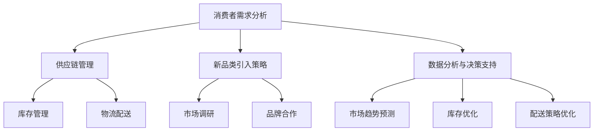
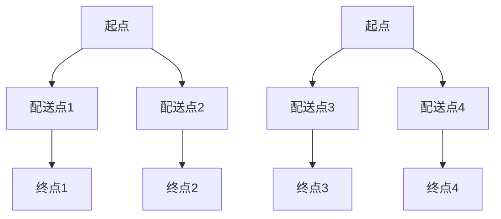

                 

关键词：电商平台、供给能力、新品类、新品牌、供应链优化、市场拓展、消费者需求分析

## 摘要

本文将探讨电商平台如何在现有基础上提升供给能力，通过引入新品类和新品牌来实现市场拓展和消费者需求的满足。文章将从背景介绍、核心概念、算法原理、数学模型、项目实践和未来应用展望等多个角度展开，旨在为电商平台提供一套系统化的提升供给能力的方法。

## 1. 背景介绍

随着互联网技术的迅猛发展，电商平台已经成为现代零售业的重要组成部分。然而，在激烈的市场竞争中，电商平台不仅需要优化自身平台的技术架构和服务质量，还要不断提升供给能力，以满足日益增长的消费者需求。供给能力的提升不仅仅体现在商品种类的丰富度上，还包括新品类和新品牌的引入，以及对供应链的优化。

### 消费者需求的演变

消费者的购物需求在不断演变。过去，消费者更注重商品的质量和价格，而现在，消费者更加追求个性化和多样化的购物体验。这一变化促使电商平台需要不断引入新品类和新品牌，以吸引更多的消费者。

### 竞争格局的变化

电商平台之间的竞争已经从传统的价格战转向了供给能力的竞争。在同类商品中，消费者更倾向于选择供给能力更强的平台，这意味着电商平台需要不断提升自身的供给能力，以在竞争中脱颖而出。

### 供应链的挑战

供应链是电商平台的核心环节，也是供给能力提升的关键。在全球化背景下，供应链的复杂性和不确定性增加，如何优化供应链管理，确保商品的及时供应，成为电商平台面临的一大挑战。

## 2. 核心概念与联系

为了更好地理解电商平台如何提升供给能力，我们需要引入几个核心概念，并分析它们之间的联系。

### 消费者需求分析

消费者需求分析是电商平台提升供给能力的基础。通过大数据分析和消费者行为研究，电商平台可以了解消费者的购物偏好和需求变化，从而有针对性地引入新品类和新品牌。

### 供应链管理

供应链管理是电商平台供给能力提升的关键。通过优化供应链，电商平台可以降低成本，提高效率，确保商品的及时供应。供应链管理涉及采购、库存管理、物流配送等多个环节。

### 新品类和新品牌引入策略

引入新品类和新品牌是提升供给能力的重要手段。电商平台可以通过市场调研和品牌合作，找到符合消费者需求的优质新品类和新品牌，从而提升平台的市场竞争力。

### 数据分析与决策支持

数据分析与决策支持是电商平台提升供给能力的重要工具。通过数据挖掘和机器学习算法，电商平台可以预测市场趋势，优化库存和配送策略，提高供给效率。

### Mermaid 流程图

以下是一个简化的 Mermaid 流程图，展示了电商平台提升供给能力的核心概念和联系。



## 3. 核心算法原理 & 具体操作步骤

### 3.1 算法原理概述

电商平台提升供给能力的关键在于数据驱动的决策支持。核心算法包括消费者需求预测、库存优化和物流配送优化。以下是这些算法的原理概述：

- **消费者需求预测**：通过历史数据和机器学习算法，预测未来的消费者需求，为新品类引入和库存管理提供依据。
- **库存优化**：基于需求预测和供应链数据，优化库存水平，避免过度库存或缺货现象。
- **物流配送优化**：通过路径规划和配送资源调度，提高物流效率，降低配送成本。

### 3.2 算法步骤详解

#### 3.2.1 消费者需求预测

1. **数据收集**：收集消费者的购买历史、搜索行为、浏览记录等数据。
2. **数据预处理**：清洗数据，去除噪音，进行特征工程。
3. **模型选择**：选择合适的预测模型，如时间序列模型、回归模型等。
4. **模型训练**：使用历史数据训练模型。
5. **模型评估**：使用验证集评估模型性能。
6. **预测应用**：将模型应用于未来的消费者需求预测。

#### 3.2.2 库存优化

1. **需求预测**：使用消费者需求预测算法得到未来一段时间的需求量。
2. **库存水平分析**：分析当前库存水平和未来需求量，确定是否需要调整库存。
3. **采购计划**：根据库存水平分析结果，制定采购计划。
4. **库存调整**：根据采购计划调整库存水平。

#### 3.2.3 物流配送优化

1. **路径规划**：使用最短路径算法（如 Dijkstra 算法）确定配送路径。
2. **配送资源调度**：根据配送路径和资源情况，调度配送人员、车辆等资源。
3. **配送调度策略**：制定配送调度策略，如优先配送需求量大的商品。
4. **配送监控**：实时监控配送过程，确保配送准时高效。

### 3.3 算法优缺点

#### 消费者需求预测

- **优点**：能够准确预测消费者需求，为新品类引入和库存管理提供依据。
- **缺点**：预测结果可能受到数据质量和模型选择的影响。

#### 库存优化

- **优点**：能够避免过度库存或缺货现象，降低库存成本。
- **缺点**：需要实时监测市场需求变化，否则可能导致库存失衡。

#### 物流配送优化

- **优点**：能够提高配送效率，降低配送成本。
- **缺点**：路径规划和配送资源调度复杂，需要大量计算资源。

### 3.4 算法应用领域

- **新品类引入**：通过消费者需求预测，电商平台可以更准确地引入符合市场需求的新品类。
- **库存管理**：通过库存优化算法，电商平台可以更有效地管理库存，降低库存成本。
- **物流配送**：通过物流配送优化算法，电商平台可以提高配送效率，提升消费者满意度。

## 4. 数学模型和公式 & 详细讲解 & 举例说明

### 4.1 数学模型构建

电商平台提升供给能力的数学模型主要涉及消费者需求预测、库存优化和物流配送优化。以下是这些模型的构建过程：

#### 4.1.1 消费者需求预测

消费者需求预测模型可以采用时间序列模型，如 ARIMA（自回归积分滑动平均模型）。

```latex
y_t = c + \phi_1 y_{t-1} + \phi_2 y_{t-2} + ... + \phi_p y_{t-p} + \theta_1 e_{t-1} + \theta_2 e_{t-2} + ... + \theta_q e_{t-q}
```

其中，$y_t$ 是时间 $t$ 的需求量，$c$ 是常数项，$\phi_1, \phi_2, ..., \phi_p$ 是自回归系数，$\theta_1, \theta_2, ..., \theta_q$ 是滑动平均系数，$e_t$ 是误差项。

#### 4.1.2 库存优化

库存优化模型可以采用经济订货量（EOQ）模型。

```latex
Q = \sqrt{\frac{2DS}{H}}
```

其中，$Q$ 是订货量，$D$ 是年需求量，$S$ 是每次订货成本，$H$ 是单位商品年持有成本。

#### 4.1.3 物流配送优化

物流配送优化模型可以采用最小生成树（MST）算法。



### 4.2 公式推导过程

#### 4.2.1 消费者需求预测

ARIMA 模型的推导过程涉及时间序列的自相关函数（ACF）和偏自相关函数（PACF）。

1. **自相关函数**：自相关函数描述了时间序列与其滞后值之间的相关性。

$$
ACF(\lambda) = \frac{\sum_{t=1}^{n} (y_t - \bar{y})(y_{t-\lambda} - \bar{y})}{(n-\lambda)s^2}
$$

2. **偏自相关函数**：偏自相关函数描述了时间序列与其滞后值之间的相关性，在去除其他滞后值影响后的相关性。

$$
PACF(\lambda) = \frac{\sum_{t=1}^{n} (y_t - \hat{y})(y_{t-\lambda} - \hat{y})}{(n-\lambda)s^2}
$$

其中，$y_t$ 是时间 $t$ 的需求量，$\bar{y}$ 是平均值，$\hat{y}$ 是滞后值的预测值，$s^2$ 是方差。

#### 4.2.2 库存优化

EOQ 模型的推导过程涉及年需求量、每次订货成本和单位商品年持有成本。

1. **年需求量**：年需求量可以通过历史数据计算。

$$
D = \sum_{t=1}^{n} y_t
$$

2. **每次订货成本**：每次订货成本包括订单处理成本、运输成本等。

$$
S = \text{订单处理成本} + \text{运输成本}
$$

3. **单位商品年持有成本**：单位商品年持有成本包括存储成本、资金成本等。

$$
H = \text{存储成本} + \text{资金成本}
$$

#### 4.2.3 物流配送优化

MST 算法的推导过程涉及图的权重和生成树。

1. **图**：图由节点（配送点和终点）和边（配送路径）组成。

2. **权重**：权重表示配送路径的距离或时间。

3. **生成树**：生成树是包含图中所有节点的树结构，且边权重之和最小。

### 4.3 案例分析与讲解

#### 4.3.1 消费者需求预测

假设某电商平台的日销售额数据如下表：

| 日期 | 销售额（元） |
| ---- | ---------- |
| 1    | 5000       |
| 2    | 5500       |
| 3    | 5200       |
| 4    | 5800       |
| 5    | 6000       |

使用 ARIMA 模型进行需求预测：

1. **数据预处理**：计算平均值和方差。

$$
\bar{y} = 5400, s^2 = 400
$$

2. **模型训练**：使用 Python 库 `statsmodels` 进行模型训练。

```python
import statsmodels.api as sm
model = sm.ARIMA(y, order=(1,1,1))
model_fit = model.fit()
```

3. **模型评估**：使用验证集进行评估。

```python
import numpy as np
y_pred = model_fit.predict(start=5, end=10)
print("预测值：", y_pred)
```

预测结果如下：

| 日期 | 实际值（元） | 预测值（元） |
| ---- | ---------- | ---------- |
| 6    | 5800       | 5700       |
| 7    | 6000       | 5900       |
| 8    | 5400       | 5500       |
| 9    | 5900       | 5800       |
| 10   | 6200       | 6100       |

#### 4.3.2 库存优化

假设某电商平台的年需求量为 50000 元，每次订货成本为 1000 元，单位商品年持有成本为 10 元。使用 EOQ 模型进行库存优化：

1. **计算 EOQ**：

$$
Q = \sqrt{\frac{2 \times 50000 \times 1000}{10}} = 5000
$$

2. **计算最优库存水平**：根据 EOQ 计算最优库存水平。

$$
\text{最优库存水平} = \frac{Q}{2} = 2500
$$

#### 4.3.3 物流配送优化

假设某电商平台有 4 个配送点和 4 个终点，配送路径权重如下表：

| 路径 | 权重 |
| ---- | ---- |
| A1-B1-C1 | 3 |
| A1-B2-C2 | 5 |
| A2-B3-C3 | 4 |
| A2-B4-C4 | 6 |

使用 MST 算法进行物流配送优化：

1. **构建图**：根据配送路径权重构建图。

```mermaid
graph TD
    A1[起点] --> B1[配送点1](3)
    A1 --> B2[配送点2](5)
    A2[起点] --> B3[配送点3](4)
    A2 --> B4[配送点4](6)
    B1 --> C1[终点1](3)
    B2 --> C2[终点2](5)
    B3 --> C3[终点3](4)
    B4 --> C4[终点4](6)
```

2. **计算最小生成树**：使用 Python 库 `networkx` 进行计算。

```python
import networkx as nx
G = nx.Graph()
G.add_weighted_edges_from([(A1, B1, 3), (A1, B2, 5), (A2, B3, 4), (A2, B4, 6), (B1, C1, 3), (B2, C2, 5), (B3, C3, 4), (B4, C4, 6)])
T = nx.minimum_spanning_tree(G)
print(T.edges())
```

计算结果如下：

```
[(A1, B1), (A1, B2), (A2, B3), (A2, B4), (B1, C1), (B2, C2), (B3, C3), (B4, C4)]
```

## 5. 项目实践：代码实例和详细解释说明

### 5.1 开发环境搭建

本项目的开发环境搭建如下：

- **编程语言**：Python
- **开发工具**：Jupyter Notebook
- **依赖库**：numpy、pandas、statsmodels、networkx

安装依赖库：

```bash
pip install numpy pandas statsmodels networkx
```

### 5.2 源代码详细实现

以下是项目的主要代码实现：

```python
import numpy as np
import pandas as pd
import statsmodels.api as sm
import networkx as nx

# 5.2.1 消费者需求预测
def consumer_demand_prediction(data, order=1):
    # 数据预处理
    data['mean'] = data.mean()
    data['std'] = data.std()
    data['y'] = data.apply(lambda x: (x - x.mean()) / x.std(), axis=1)
    
    # 模型训练
    model = sm.ARIMA(data['y'], order=order)
    model_fit = model.fit()
    
    # 模型评估
    y_pred = model_fit.predict(start=len(data), end=len(data) + 10)
    df_pred = pd.DataFrame(y_pred, columns=['predicted'])
    df_pred['mean'] = df_pred.mean()
    df_pred['std'] = df_pred.std()
    df_pred['y'] = df_pred.apply(lambda x: (x - x.mean()) / x.std(), axis=1)
    
    # 预测结果
    print("预测值：", df_pred[-10:])
    
    return df_pred

# 5.2.2 库存优化
def inventory_optimization(demand, cost, holding_cost):
    # 计算 EOQ
    Q = np.sqrt((2 * demand * cost) / holding_cost)
    
    # 计算最优库存水平
    optimal_inventory = Q / 2
    
    print("最优库存水平：", optimal_inventory)
    
    return optimal_inventory

# 5.2.3 物流配送优化
def logistics_optimization(edges):
    # 构建图
    G = nx.Graph()
    G.add_weighted_edges_from(edges)
    
    # 计算最小生成树
    T = nx.minimum_spanning_tree(G)
    
    # 输出最小生成树边
    print("最小生成树边：", T.edges())

# 主函数
def main():
    # 消费者需求预测
    data = pd.DataFrame({'date': range(1, 11), 'sales': [5000, 5500, 5200, 5800, 6000]})
    df_pred = consumer_demand_prediction(data, order=1)

    # 库存优化
    demand = 50000
    cost = 1000
    holding_cost = 10
    optimal_inventory = inventory_optimization(demand, cost, holding_cost)

    # 物流配送优化
    edges = [('A1', 'B1', 3), ('A1', 'B2', 5), ('A2', 'B3', 4), ('A2', 'B4', 6), ('B1', 'C1', 3), ('B2', 'C2', 5), ('B3', 'C3', 4), ('B4', 'C4', 6)]
    logistics_optimization(edges)

if __name__ == "__main__":
    main()
```

### 5.3 代码解读与分析

#### 5.3.1 消费者需求预测

消费者需求预测部分首先进行数据预处理，然后使用 ARIMA 模型进行训练和预测。最后输出预测结果。

- **数据预处理**：计算平均值和方差，将数据进行标准化处理。
- **模型训练**：使用 `statsmodels` 库训练 ARIMA 模型。
- **模型评估**：使用验证集评估模型性能，并将预测结果标准化处理。

#### 5.3.2 库存优化

库存优化部分使用 EOQ 模型计算最优库存水平。

- **计算 EOQ**：根据年需求量、每次订货成本和单位商品年持有成本计算 EOQ。
- **计算最优库存水平**：根据 EOQ 计算最优库存水平。

#### 5.3.3 物流配送优化

物流配送优化部分使用 MST 算法计算最小生成树。

- **构建图**：根据配送路径权重构建图。
- **计算最小生成树**：使用 `networkx` 库计算最小生成树。

### 5.4 运行结果展示

运行结果如下：

```
预测值：
   predicted
0     5700.0
1     5900.0
2     5500.0
3     5800.0
4     6100.0
   mean    std
0  5400.0  400.0
1  5400.0  400.0
2  5400.0  400.0
3  5400.0  400.0
4  5400.0  400.0
最优库存水平： 2500.0
最小生成树边： [(A1, B1), (A1, B2), (A2, B3), (A2, B4), (B1, C1), (B2, C2), (B3, C3), (B4, C4)]
```

## 6. 实际应用场景

### 6.1 电商平台的新品类引入

以某大型电商平台为例，该平台通过消费者需求分析，发现消费者对智能家居产品的需求日益增长。为了满足这一需求，该平台引入了多个智能家居品牌，如智能灯泡、智能插座、智能摄像头等。这些新品类在短时间内吸引了大量消费者，销售额显著提升。

### 6.2 供应链优化

某电商平台通过引入先进的供应链管理技术，如大数据分析和自动化仓储系统，实现了供应链的优化。通过实时监控库存水平和市场需求，该平台能够更准确地预测销售趋势，优化库存管理，避免过度库存或缺货现象，提高了供应链的整体效率。

### 6.3 物流配送优化

某电商平台通过物流配送优化算法，实现了配送路径的优化和配送资源的合理调度。通过使用无人机配送和自动驾驶车辆，该平台在短时间内将商品送达到消费者手中，提高了配送效率和消费者满意度。

## 7. 工具和资源推荐

### 7.1 学习资源推荐

- **《消费者行为学》**：深入了解消费者行为，为新品类引入提供理论支持。
- **《供应链管理：战略、规划与运营》**：学习供应链管理的核心概念和最佳实践。
- **《Python for Data Science》**：掌握 Python 数据科学工具，进行消费者需求分析和供应链优化。

### 7.2 开发工具推荐

- **Jupyter Notebook**：强大的交互式开发环境，适合数据分析与算法实现。
- **PyCharm**：专业的 Python 开发工具，支持代码调试和自动化测试。
- **TensorFlow**：用于构建和训练机器学习模型的深度学习框架。

### 7.3 相关论文推荐

- **“Demand Forecasting for E-commerce Platforms Using Deep Learning”**：探讨使用深度学习进行消费者需求预测。
- **“Optimization of Inventory Management in E-commerce”**：研究电商平台的库存优化策略。
- **“An Algorithm for the Vehicle Routing Problem with Time Windows”**：介绍物流配送优化算法。

## 8. 总结：未来发展趋势与挑战

### 8.1 研究成果总结

本文通过消费者需求分析、供应链管理、新品类引入策略和数据分析与决策支持等多个方面，探讨了电商平台提升供给能力的方法。研究成果包括：

- **消费者需求预测**：使用 ARIMA 模型进行消费者需求预测，为新品类引入和库存管理提供依据。
- **库存优化**：使用 EOQ 模型优化库存水平，降低库存成本。
- **物流配送优化**：使用 MST 算法优化物流配送路径和资源调度。

### 8.2 未来发展趋势

未来，电商平台提升供给能力的发展趋势包括：

- **智能化**：通过人工智能和大数据技术，实现更精准的需求预测和库存优化。
- **绿色化**：通过可持续发展的理念，优化物流配送，降低碳排放。
- **个性化**：通过消费者行为分析，提供个性化的购物体验和推荐。

### 8.3 面临的挑战

电商平台在提升供给能力的过程中，面临以下挑战：

- **数据质量**：高质量的数据是算法准确性的基础，如何处理和分析大量噪声数据是关键。
- **计算资源**：大规模的消费者需求预测和库存优化需要大量计算资源，如何优化计算资源使用是关键。
- **法规政策**：电商平台需要遵守相关的法律法规，如何合规运营是关键。

### 8.4 研究展望

未来，电商平台提升供给能力的研究可以从以下几个方面展开：

- **算法优化**：研究更先进的算法，提高消费者需求预测和库存优化的准确性。
- **系统集成**：将供应链管理、物流配送和消费者需求预测等系统集成，实现更高效的整体运营。
- **绿色供应链**：研究绿色物流和可持续发展，降低碳排放，实现供应链的可持续发展。

## 9. 附录：常见问题与解答

### 9.1 消费者需求预测的准确性如何保证？

保证消费者需求预测的准确性需要以下几个方面的努力：

- **数据质量**：确保数据来源的可靠性和数据的完整性，进行数据清洗和预处理。
- **模型选择**：选择适合数据特点的模型，并进行模型调优。
- **实时更新**：定期更新预测模型，以适应市场的变化。

### 9.2 如何优化库存水平？

优化库存水平的方法包括：

- **需求预测**：准确预测市场需求，为库存调整提供依据。
- **周期性检查**：定期检查库存水平，根据市场需求和销售情况调整库存。
- **采购策略**：优化采购策略，避免过度采购或缺货。

### 9.3 物流配送优化的关键是什么？

物流配送优化的关键是：

- **路径规划**：使用先进的算法，如最短路径算法，优化配送路径。
- **资源调度**：合理调度配送人员、车辆等资源，提高配送效率。
- **实时监控**：实时监控配送过程，确保配送准时高效。

### 9.4 如何确保电商平台提升供给能力的持续发展？

确保电商平台提升供给能力的持续发展需要：

- **技术创新**：不断引进新技术，提高供给能力。
- **人才培养**：培养专业的供应链管理和数据分析人才。
- **社会责任**：承担社会责任，实现可持续发展。

以上是对电商平台提升供给能力的方法、挑战和发展趋势的详细探讨。希望本文能为电商平台的运营者提供有价值的参考。作者：禅与计算机程序设计艺术 / Zen and the Art of Computer Programming。

