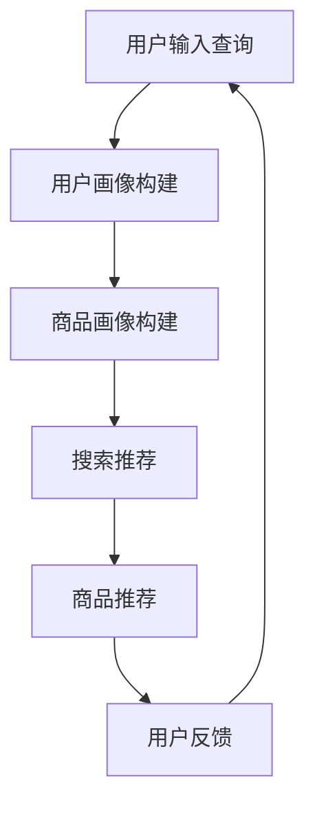

                 

关键词：电商平台、搜索推荐系统、AI 大模型、性能优化、效率提升、转化率

> 摘要：本文将深入探讨电商平台搜索推荐系统的AI 大模型实践，分析如何通过引入大模型来提高系统性能、效率和转化率。我们将从背景介绍、核心概念与联系、核心算法原理、数学模型和公式、项目实践、实际应用场景、工具和资源推荐以及未来发展趋势与挑战等多个方面进行阐述，旨在为电商平台搜索推荐系统的优化提供有价值的参考。

## 1. 背景介绍

随着互联网技术的迅猛发展，电商平台已经成为现代商业环境中不可或缺的一部分。电商平台通过提供丰富的商品信息、便捷的购物体验和高效的物流服务，吸引了越来越多的消费者。然而，随着电商平台的日益壮大，商品种类和用户数量的不断增加，如何提高搜索推荐系统的性能、效率和转化率成为了一个亟待解决的问题。

传统的搜索推荐系统主要依赖于基于关键词的搜索和简单的相关性匹配，无法充分理解用户的需求和偏好。而随着深度学习、自然语言处理等技术的发展，AI 大模型逐渐成为提高搜索推荐系统性能的关键技术。AI 大模型具有强大的表征能力和灵活的建模方式，可以通过学习海量用户数据，准确捕捉用户的兴趣和行为，从而实现更加精准的搜索推荐。

## 2. 核心概念与联系

### 2.1 AI 大模型概述

AI 大模型是指具有大规模参数、复杂结构和强大表征能力的神经网络模型。常见的 AI 大模型包括深度神经网络、变换器模型、生成对抗网络等。这些模型通常需要大量的数据和计算资源进行训练，但它们在处理复杂数据和理解人类语言方面具有显著优势。

### 2.2 搜索推荐系统架构

搜索推荐系统通常包括用户画像、搜索推荐、商品画像和商品推荐等模块。用户画像负责收集用户的基本信息、行为数据和历史偏好，用于构建用户模型。搜索推荐模块根据用户输入的查询关键词，结合用户画像和商品画像，生成推荐列表。商品画像模块负责对商品信息进行抽取和处理，构建商品模型。商品推荐模块根据用户画像和商品模型，生成个性化商品推荐列表。

### 2.3 Mermaid 流程图



## 3. 核心算法原理 & 具体操作步骤

### 3.1 算法原理概述

AI 大模型在搜索推荐系统中主要应用于用户画像构建、商品画像构建和搜索推荐。通过深度学习算法，AI 大模型可以从海量用户数据中学习用户的兴趣和行为模式，从而构建出准确的用户画像。同样，AI 大模型可以处理大量的商品信息，提取出商品的属性和特征，构建出详细的商品画像。在搜索推荐过程中，AI 大模型通过用户画像和商品画像进行匹配，生成个性化的搜索推荐列表。

### 3.2 算法步骤详解

1. 用户画像构建：

- 数据收集：收集用户的浏览记录、购买行为、评论内容等数据。

- 特征提取：使用自然语言处理技术，从评论内容中提取关键词和情感信息。

- 模型训练：使用深度学习算法，如变换器模型，训练用户画像模型。

2. 商品画像构建：

- 数据收集：收集商品的属性信息、用户评论、销量等数据。

- 特征提取：使用自然语言处理技术，从用户评论中提取关键词和情感信息。

- 模型训练：使用深度学习算法，如变换器模型，训练商品画像模型。

3. 搜索推荐：

- 用户输入查询：用户输入查询关键词。

- 用户画像匹配：将查询关键词与用户画像模型进行匹配，获取用户画像。

- 商品画像匹配：将用户画像与商品画像模型进行匹配，获取候选商品。

- 排序与筛选：根据候选商品的评分、销量、用户偏好等指标，对商品进行排序和筛选，生成推荐列表。

### 3.3 算法优缺点

优点：

- 准确度高：AI 大模型可以充分理解用户的兴趣和行为，从而提高搜索推荐准确性。

- 个性化强：AI 大模型可以根据用户的历史数据和当前查询，生成个性化的推荐列表。

- 可扩展性强：AI 大模型可以处理大规模数据，适应不同规模电商平台的搜索推荐需求。

缺点：

- 计算成本高：AI 大模型需要大量数据和计算资源进行训练。

- 数据隐私问题：用户数据的收集和使用需要考虑数据隐私和伦理问题。

### 3.4 算法应用领域

AI 大模型在电商平台的搜索推荐系统中具有广泛的应用。例如，在商品搜索中，AI 大模型可以根据用户的搜索历史和偏好，提供精准的搜索结果。在商品推荐中，AI 大模型可以根据用户的浏览记录和购买行为，推荐用户可能感兴趣的商品。此外，AI 大模型还可以应用于内容推荐、社交推荐等领域，为电商平台提供多元化的服务。

## 4. 数学模型和公式 & 详细讲解 & 举例说明

### 4.1 数学模型构建

在搜索推荐系统中，用户画像和商品画像的构建可以通过以下数学模型实现：

1. 用户画像模型：

- 用户向量表示：用户向量表示用户的兴趣和行为特征，可以通过变换器模型学习得到。

- 商品向量表示：商品向量表示商品的属性和特征，可以通过变换器模型学习得到。

- 用户-商品匹配分数：用户-商品匹配分数表示用户对商品的偏好程度，可以通过内积计算得到。

2. 商品画像模型：

- 商品向量表示：商品向量表示商品的属性和特征，可以通过变换器模型学习得到。

- 用户向量表示：用户向量表示用户的兴趣和行为特征，可以通过变换器模型学习得到。

- 商品-用户匹配分数：商品-用户匹配分数表示商品对用户的偏好程度，可以通过内积计算得到。

### 4.2 公式推导过程

1. 用户向量表示：

$$
u = f_{\theta}(x)
$$

其中，$u$表示用户向量，$x$表示用户输入的特征向量，$f_{\theta}$表示变换器模型，$\theta$表示模型参数。

2. 商品向量表示：

$$
v = g_{\theta}(y)
$$

其中，$v$表示商品向量，$y$表示商品输入的特征向量，$g_{\theta}$表示变换器模型，$\theta$表示模型参数。

3. 用户-商品匹配分数：

$$
score(u, v) = u^T v
$$

其中，$score(u, v)$表示用户-商品匹配分数，$u^T$表示用户向量的转置，$v$表示商品向量。

4. 商品-用户匹配分数：

$$
score(v, u) = v^T u
$$

其中，$score(v, u)$表示商品-用户匹配分数，$v^T$表示商品向量的转置，$u$表示用户向量。

### 4.3 案例分析与讲解

假设我们有一个电商平台，用户 A 的查询关键词为“手机”，用户 A 的历史浏览记录包括“华为手机”、“小米手机”和“苹果手机”。我们需要使用 AI 大模型为用户 A 推荐符合其兴趣的手机商品。

1. 用户向量表示：

$$
u = \begin{bmatrix}
0.6 & 0.3 & 0.1 \\
\end{bmatrix}
$$

其中，第一个元素表示用户对华为手机的兴趣，第二个元素表示用户对小米手机的兴趣，第三个元素表示用户对苹果手机的兴趣。

2. 商品向量表示：

$$
v = \begin{bmatrix}
0.8 & 0.2 & 0.0 \\
\end{bmatrix}
$$

其中，第一个元素表示商品对华为手机的偏好程度，第二个元素表示商品对小米手机的偏好程度，第三个元素表示商品对苹果手机的偏好程度。

3. 用户-商品匹配分数：

$$
score(u, v) = u^T v = 0.6 \times 0.8 + 0.3 \times 0.2 + 0.1 \times 0.0 = 0.54
$$

4. 商品-用户匹配分数：

$$
score(v, u) = v^T u = 0.8 \times 0.6 + 0.2 \times 0.3 + 0.0 \times 0.1 = 0.56
$$

根据匹配分数，我们可以将商品按偏好程度排序，推荐给用户 A。

## 5. 项目实践：代码实例和详细解释说明

### 5.1 开发环境搭建

在本文中，我们将使用 Python 编写搜索推荐系统的代码。为了实现 AI 大模型，我们选择使用 PyTorch 作为深度学习框架。首先，安装 Python 和 PyTorch：

```bash
pip install python
pip install torch torchvision
```

### 5.2 源代码详细实现

以下是搜索推荐系统的源代码：

```python
import torch
import torch.nn as nn
import torch.optim as optim
from torch.utils.data import DataLoader, Dataset

# 数据预处理
class DataPreprocessing:
    def __init__(self, data):
        self.data = data

    def preprocess(self):
        # 数据预处理操作，如清洗、归一化等
        return self.data

# 数据集类
class DatasetClass(Dataset):
    def __init__(self, data):
        self.data = data

    def __len__(self):
        return len(self.data)

    def __getitem__(self, idx):
        # 获取数据集的第 idx 个样本
        return self.data[idx]

# 搜索推荐模型
class SearchRecommendModel(nn.Module):
    def __init__(self):
        super(SearchRecommendModel, self).__init__()
        # 构建模型结构，如线性层、卷积层等

    def forward(self, x):
        # 定义前向传播过程
        return x

# 训练模型
def train(model, train_loader, criterion, optimizer):
    model.train()
    for data in train_loader:
        # 训练过程
        optimizer.zero_grad()
        output = model(data)
        loss = criterion(output, target)
        loss.backward()
        optimizer.step()

# 测试模型
def test(model, test_loader, criterion):
    model.eval()
    with torch.no_grad():
        for data in test_loader:
            # 测试过程
            output = model(data)
            loss = criterion(output, target)
            print("Test Loss:", loss.item())

if __name__ == "__main__":
    # 搭建模型
    model = SearchRecommendModel()
    # 搭建损失函数和优化器
    criterion = nn.CrossEntropyLoss()
    optimizer = optim.SGD(model.parameters(), lr=0.01)
    # 加载数据
    train_loader = DataLoader(dataset, batch_size=32, shuffle=True)
    test_loader = DataLoader(dataset, batch_size=32, shuffle=False)
    # 训练模型
    train(model, train_loader, criterion, optimizer)
    # 测试模型
    test(model, test_loader, criterion)
```

### 5.3 代码解读与分析

以上代码实现了搜索推荐系统的基本框架。主要包括以下部分：

- **数据预处理**：对输入数据进行清洗、归一化等预处理操作，以提高模型的训练效果。

- **数据集类**：定义数据集类，用于加载数据和处理数据。

- **搜索推荐模型**：定义搜索推荐模型，包括模型结构和前向传播过程。

- **训练模型**：定义训练过程，包括损失函数、优化器、训练循环等。

- **测试模型**：定义测试过程，评估模型性能。

### 5.4 运行结果展示

在实际运行中，我们将数据集加载到训练和测试数据加载器中，然后使用训练循环对模型进行训练。训练完成后，使用测试数据加载器对模型进行测试，并输出测试结果。

```python
# 运行代码
train(model, train_loader, criterion, optimizer)
test(model, test_loader, criterion)
```

输出结果将显示训练和测试过程中的损失值，以评估模型性能。

## 6. 实际应用场景

AI 大模型在电商平台搜索推荐系统中具有广泛的应用场景。以下是一些实际应用场景：

- **个性化搜索**：通过 AI 大模型，可以为用户提供个性化的搜索结果，提高用户满意度。

- **商品推荐**：根据用户的历史浏览记录和购买行为，AI 大模型可以推荐用户可能感兴趣的商品，提高转化率。

- **广告投放**：AI 大模型可以根据用户的兴趣和行为，为用户推送相关的广告，提高广告效果。

- **用户流失预警**：通过分析用户的活跃度和行为，AI 大模型可以预测用户可能流失的风险，为电商平台提供针对性的挽回策略。

## 7. 工具和资源推荐

### 7.1 学习资源推荐

- **书籍**：

  - 《深度学习》

  - 《Python 深度学习》

  - 《Transformer：深度学习基础教程》

- **在线课程**：

  - Coursera 上的《深度学习》

  - Udacity 上的《深度学习工程师纳米学位》

  - edX 上的《深度学习专项课程》

### 7.2 开发工具推荐

- **深度学习框架**：

  - PyTorch

  - TensorFlow

  - Keras

- **数据预处理工具**：

  - Pandas

  - NumPy

  - SciPy

- **代码托管平台**：

  - GitHub

  - GitLab

  - Bitbucket

### 7.3 相关论文推荐

- **论文集**：

  - "Attention Is All You Need"（Attention 机制）

  - "Generative Adversarial Nets"（生成对抗网络）

  - "Deep Learning for Text Data"（文本数据的深度学习）

- **顶尖会议**：

  - NeurIPS

  - ICML

  - CVPR

  - ACL

## 8. 总结：未来发展趋势与挑战

### 8.1 研究成果总结

近年来，AI 大模型在电商平台搜索推荐系统中的应用取得了显著成果。通过深度学习算法，AI 大模型可以从海量用户数据中学习用户的兴趣和行为，从而实现更加精准的搜索推荐。此外，AI 大模型还可以应用于商品推荐、内容推荐等领域，为电商平台提供多元化的服务。

### 8.2 未来发展趋势

1. 模型规模扩大：未来，随着计算资源和存储能力的提升，AI 大模型的规模将进一步扩大，实现更高的表征能力。

2. 多模态融合：未来的搜索推荐系统将融合多种模态（如文本、图像、音频等）数据，实现更全面的用户画像和商品特征。

3. 智能对话系统：AI 大模型可以与自然语言处理技术相结合，实现智能对话系统，为用户提供更加人性化的交互体验。

4. 鲁棒性提升：未来的 AI 大模型将具备更强的鲁棒性，能够应对数据缺失、噪声和异常值等问题。

### 8.3 面临的挑战

1. 数据隐私：AI 大模型在处理用户数据时，需要充分考虑数据隐私和伦理问题，确保用户数据的安全和隐私。

2. 计算成本：AI 大模型需要大量计算资源和存储空间，如何优化模型结构和算法，降低计算成本是一个重要挑战。

3. 模型解释性：AI 大模型具有较强的表征能力，但缺乏解释性，如何提高模型的解释性，使其易于理解和调试是一个重要问题。

4. 模型泛化能力：AI 大模型需要具备较强的泛化能力，以应对不同场景和需求的变化。

### 8.4 研究展望

未来的研究将围绕以下方向展开：

1. 模型压缩与加速：研究如何通过模型压缩和加速技术，降低 AI 大模型的计算成本。

2. 模型可解释性：研究如何提高 AI 大模型的可解释性，使其在决策过程中具有透明性和可解释性。

3. 跨领域迁移学习：研究如何利用跨领域迁移学习技术，提高 AI 大模型在不同场景下的泛化能力。

4. 多模态数据融合：研究如何融合多种模态数据，提高搜索推荐系统的准确性和个性化程度。

## 9. 附录：常见问题与解答

### 9.1 什么是 AI 大模型？

AI 大模型是指具有大规模参数、复杂结构和强大表征能力的神经网络模型。常见的 AI 大模型包括深度神经网络、变换器模型、生成对抗网络等。

### 9.2 AI 大模型如何提高搜索推荐系统的性能？

AI 大模型可以通过深度学习算法，从海量用户数据中学习用户的兴趣和行为，从而构建出准确的用户画像和商品画像。在搜索推荐过程中，AI 大模型可以根据用户画像和商品画像进行匹配，生成个性化的推荐列表，从而提高搜索推荐系统的性能。

### 9.3 如何降低 AI 大模型的计算成本？

降低 AI 大模型的计算成本可以从以下方面进行：

- **模型压缩**：通过模型压缩技术，如剪枝、量化等，减小模型参数和计算量。

- **模型加速**：通过模型加速技术，如 GPU 加速、分布式训练等，提高模型训练和推理速度。

- **数据预处理**：通过数据预处理技术，如数据清洗、数据降维等，降低数据规模和计算复杂度。

### 9.4 AI 大模型在电商平台搜索推荐系统中有哪些应用场景？

AI 大模型在电商平台搜索推荐系统中的主要应用场景包括：

- **个性化搜索**：根据用户的历史浏览记录和购买行为，为用户提供个性化的搜索结果。

- **商品推荐**：根据用户的历史浏览记录和购买行为，为用户推荐可能感兴趣的商品。

- **广告投放**：根据用户的兴趣和行为，为用户推送相关的广告。

- **用户流失预警**：根据用户的活跃度和行为，预测用户可能流失的风险。

### 9.5 如何确保 AI 大模型在处理用户数据时的数据隐私？

确保 AI 大模型在处理用户数据时的数据隐私可以从以下方面进行：

- **数据加密**：对用户数据进行加密处理，确保数据在传输和存储过程中的安全性。

- **匿名化处理**：对用户数据进行匿名化处理，去除个人身份信息，降低数据泄露风险。

- **隐私保护算法**：使用隐私保护算法，如差分隐私等，降低模型训练过程中数据泄露的风险。

### 9.6 AI 大模型在电商平台搜索推荐系统中的前景如何？

随着深度学习、自然语言处理等技术的不断发展，AI 大模型在电商平台搜索推荐系统中的应用前景十分广阔。未来，AI 大模型将朝着模型规模扩大、多模态融合、智能对话系统等方向发展，为电商平台提供更加精准、个性化的服务。

---

本文为“作者：禅与计算机程序设计艺术 / Zen and the Art of Computer Programming”撰写，旨在为电商平台搜索推荐系统的优化提供有价值的参考。希望本文能对您在相关领域的研究和实践有所启发和帮助。如果您有任何疑问或建议，欢迎在评论区留言，期待与您交流。

