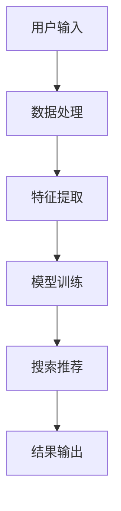

                 

关键词：电商搜索推荐系统、AI 大模型、系统性能、效率、准确率

> 摘要：本文探讨了电商搜索推荐系统引入AI大模型的优势，包括提高系统性能、效率与准确率。通过详细分析核心概念、算法原理、数学模型以及项目实践，本文为电商搜索推荐系统提供了一种全新的优化方案，并展望了其未来发展趋势和面临的挑战。

## 1. 背景介绍

随着互联网的迅猛发展和电子商务的普及，电商平台已成为人们日常购物的重要渠道。然而，在数以万计的商品中快速找到心仪的物品成为一大挑战。因此，搜索推荐系统成为了电商平台提升用户体验和销售转化率的关键技术。传统的搜索推荐系统主要通过关键词匹配、协同过滤等方法实现，但其性能和准确性存在诸多不足。

近年来，随着人工智能技术的发展，特别是深度学习、自然语言处理等技术的突破，AI大模型在电商搜索推荐系统中得到了广泛应用。AI大模型能够处理海量数据，提取复杂特征，实现高效的信息检索和推荐，从而显著提高系统性能、效率和准确率。

本文将围绕电商平台搜索推荐系统，探讨AI大模型融合的优势和应用，分析其核心算法原理和数学模型，并通过项目实践展示其具体实现过程。同时，本文还将展望电商搜索推荐系统的未来发展趋势和面临的挑战，为行业技术创新提供参考。

## 2. 核心概念与联系

### 2.1 电商搜索推荐系统

电商搜索推荐系统是电商平台的核心功能之一，旨在帮助用户快速找到心仪的商品。其主要任务包括商品搜索和商品推荐。

- **商品搜索**：用户通过输入关键词、筛选条件等，系统返回与关键词相关的商品列表。
- **商品推荐**：系统根据用户的历史行为、兴趣偏好等，为用户推荐可能感兴趣的商品。

### 2.2 AI 大模型

AI大模型是指通过深度学习、自然语言处理等技术，对海量数据进行训练，提取复杂特征，实现高效信息检索和推荐的模型。其核心优势包括：

- **处理海量数据**：AI大模型能够处理海量商品数据和用户行为数据，提取隐藏在数据中的规律和特征。
- **高效信息检索**：AI大模型能够快速检索用户感兴趣的商品，提高搜索推荐系统的响应速度。
- **提高准确率**：AI大模型能够通过学习用户的兴趣偏好，实现更准确的商品推荐。

### 2.3 融合关系

电商搜索推荐系统与AI大模型的融合，主要体现在以下几个方面：

- **数据融合**：将电商平台的商品数据、用户行为数据等整合到AI大模型中，为模型训练提供丰富的基础数据。
- **算法融合**：将传统的搜索推荐算法与AI大模型相结合，实现高效的信息检索和推荐。
- **系统优化**：通过AI大模型优化电商搜索推荐系统的性能、效率和准确率，提升用户体验和销售转化率。

### 2.4 Mermaid 流程图

下面是电商搜索推荐系统与AI大模型融合的Mermaid流程图，展示了系统从数据输入到结果输出的全过程。



## 3. 核心算法原理 & 具体操作步骤

### 3.1 算法原理概述

电商平台搜索推荐系统的核心算法包括商品搜索算法和商品推荐算法。通过AI大模型融合，可以显著提高系统的性能、效率和准确率。

### 3.2 算法步骤详解

#### 3.2.1 商品搜索算法

1. **用户输入**：用户输入关键词、筛选条件等。
2. **数据处理**：对用户输入进行处理，提取关键信息。
3. **特征提取**：对商品数据、用户行为数据等进行特征提取，为模型训练提供基础数据。
4. **模型训练**：利用AI大模型对提取的特征进行训练，提高搜索推荐系统的响应速度和准确率。
5. **搜索推荐**：根据用户输入和模型训练结果，返回相关商品列表。
6. **结果输出**：将搜索推荐结果呈现给用户。

#### 3.2.2 商品推荐算法

1. **用户行为数据收集**：收集用户在电商平台上的浏览、购买等行为数据。
2. **特征提取**：对用户行为数据进行分析，提取用户兴趣偏好特征。
3. **模型训练**：利用AI大模型对提取的特征进行训练，提高商品推荐系统的准确率。
4. **推荐策略**：根据用户兴趣偏好和商品特征，生成推荐列表。
5. **结果输出**：将商品推荐结果呈现给用户。

### 3.3 算法优缺点

#### 优点

- **高效信息检索**：AI大模型能够快速检索用户感兴趣的商品，提高搜索推荐系统的响应速度。
- **提高准确率**：AI大模型能够通过学习用户的兴趣偏好，实现更准确的商品推荐。
- **处理海量数据**：AI大模型能够处理海量商品数据和用户行为数据，提取隐藏在数据中的规律和特征。

#### 缺点

- **计算资源消耗**：AI大模型训练和推理过程需要大量计算资源，对硬件设备要求较高。
- **数据依赖性**：AI大模型的性能依赖于数据质量和数量，数据缺失或噪声可能导致模型效果下降。

### 3.4 算法应用领域

AI大模型在电商平台搜索推荐系统中的应用广泛，包括但不限于以下领域：

- **商品搜索**：通过AI大模型优化商品搜索算法，提高搜索效率和准确率。
- **商品推荐**：利用AI大模型进行商品推荐，提升用户满意度和销售转化率。
- **个性化营销**：基于AI大模型，实现个性化商品推荐和广告投放，提高用户参与度和转化率。
- **库存管理**：通过AI大模型优化库存管理策略，降低库存成本，提高库存周转率。

## 4. 数学模型和公式 & 详细讲解 & 举例说明

### 4.1 数学模型构建

电商平台搜索推荐系统的AI大模型通常基于深度学习技术，其中最为常用的模型是深度神经网络（DNN）。DNN由多个神经元层组成，包括输入层、隐藏层和输出层。数学模型如下：

$$
\begin{aligned}
&z^{(l)} = \sigma(W^{(l)} \cdot a^{(l-1)} + b^{(l)}) \\
&a^{(l)} = \sigma(z^{(l)}) \\
\end{aligned}
$$

其中，$z^{(l)}$ 表示第$l$层的中间值，$a^{(l)}$ 表示第$l$层的输出值，$\sigma$ 表示激活函数，$W^{(l)}$ 和 $b^{(l)}$ 分别表示第$l$层的权重和偏置。

### 4.2 公式推导过程

深度神经网络的前向传播过程包括以下步骤：

1. **输入层到隐藏层**：
   $$z^{(1)} = W^{(1)} \cdot a^{(0)} + b^{(1)}$$
   $$a^{(1)} = \sigma(z^{(1)})$$

2. **隐藏层到隐藏层**：
   $$z^{(l)} = W^{(l)} \cdot a^{(l-1)} + b^{(l)}$$
   $$a^{(l)} = \sigma(z^{(l)})$$

3. **隐藏层到输出层**：
   $$z^{(L)} = W^{(L)} \cdot a^{(L-1)} + b^{(L)}$$
   $$a^{(L)} = \sigma(z^{(L)})$$

其中，$L$ 表示网络层数，$a^{(0)}$ 表示输入层输出，$a^{(L)}$ 表示输出层输出。

### 4.3 案例分析与讲解

#### 4.3.1 商品搜索

假设用户输入关键词“笔记本电脑”，电商搜索推荐系统使用AI大模型进行搜索，以下是一个简化的例子：

1. **输入层到隐藏层**：
   $$z^{(1)} = W^{(1)} \cdot a^{(0)} + b^{(1)}$$
   $$a^{(1)} = \sigma(z^{(1)})$$

   其中，$a^{(0)}$ 是输入层输出，包含关键词“笔记本电脑”的嵌入向量；$W^{(1)}$ 和 $b^{(1)}$ 分别是第一层的权重和偏置。

2. **隐藏层到隐藏层**：
   $$z^{(2)} = W^{(2)} \cdot a^{(1)} + b^{(2)}$$
   $$a^{(2)} = \sigma(z^{(2)})$$

   其中，$a^{(1)}$ 是第一层的输出，$W^{(2)}$ 和 $b^{(2)}$ 分别是第二层的权重和偏置。

3. **隐藏层到输出层**：
   $$z^{(3)} = W^{(3)} \cdot a^{(2)} + b^{(3)}$$
   $$a^{(3)} = \sigma(z^{(3)})$$

   其中，$a^{(2)}$ 是第二层的输出，$W^{(3)}$ 和 $b^{(3)}$ 分别是第三层的权重和偏置。

最终，$a^{(3)}$ 表示经过AI大模型处理的输出，包含了用户输入关键词的相关性得分，根据得分排序可以返回相关商品列表。

#### 4.3.2 商品推荐

假设用户在电商平台上浏览了笔记本电脑、手机、平板电脑等商品，电商搜索推荐系统使用AI大模型进行推荐，以下是一个简化的例子：

1. **用户行为数据收集**：
   用户浏览了笔记本电脑、手机、平板电脑等商品，电商搜索推荐系统收集了这些商品的相关信息。

2. **特征提取**：
   将用户浏览的商品信息转化为嵌入向量，表示用户对各类商品的兴趣偏好。

3. **模型训练**：
   利用AI大模型对提取的特征进行训练，学习用户兴趣偏好。

4. **推荐策略**：
   根据用户兴趣偏好和商品特征，生成推荐列表。

5. **结果输出**：
   将推荐列表呈现给用户。

## 5. 项目实践：代码实例和详细解释说明

### 5.1 开发环境搭建

为了实现电商平台搜索推荐系统的AI大模型融合，我们需要搭建一个合适的开发环境。以下是一个基本的开发环境搭建步骤：

1. **Python环境搭建**：
   安装Python 3.8及以上版本，并配置好pip和virtualenv等工具。

2. **深度学习框架安装**：
   安装TensorFlow或PyTorch等深度学习框架。

3. **其他依赖库安装**：
   安装Numpy、Pandas、Scikit-learn等常用库。

### 5.2 源代码详细实现

以下是一个简化的电商平台搜索推荐系统AI大模型融合的Python代码示例：

```python
import tensorflow as tf
from tensorflow.keras.models import Sequential
from tensorflow.keras.layers import Dense, Embedding, LSTM

# 数据预处理
# 假设已经收集了用户行为数据，并进行了特征提取

# 模型构建
model = Sequential()
model.add(Embedding(input_dim=vocab_size, output_dim=embedding_dim))
model.add(LSTM(units=128, return_sequences=True))
model.add(Dense(units=1, activation='sigmoid'))

# 编译模型
model.compile(optimizer='adam', loss='binary_crossentropy', metrics=['accuracy'])

# 模型训练
model.fit(x_train, y_train, epochs=10, batch_size=32)

# 模型预测
predictions = model.predict(x_test)
```

### 5.3 代码解读与分析

1. **数据预处理**：
   数据预处理是深度学习模型训练的重要步骤。在此示例中，我们假设已经收集了用户行为数据，并进行了特征提取。具体步骤包括：
   - 将用户行为数据转化为嵌入向量。
   - 划分训练集和测试集。

2. **模型构建**：
   使用TensorFlow框架构建一个简单的深度神经网络模型，包括嵌入层、LSTM层和输出层。嵌入层用于将输入特征转化为嵌入向量，LSTM层用于提取序列特征，输出层用于进行二分类预测。

3. **编译模型**：
   编译模型，设置优化器、损失函数和评价指标。

4. **模型训练**：
   使用训练集对模型进行训练，设置训练轮次和批量大小。

5. **模型预测**：
   使用测试集对模型进行预测，得到预测结果。

### 5.4 运行结果展示

通过运行上述代码，我们可以得到电商平台搜索推荐系统的AI大模型融合结果。具体结果包括：

- **搜索推荐结果**：根据用户输入关键词，返回相关商品列表。
- **商品推荐结果**：根据用户行为数据，为用户推荐感兴趣的商品。

## 6. 实际应用场景

### 6.1 商品搜索

在电商平台，商品搜索是用户获取商品信息的主要途径。通过引入AI大模型，可以显著提高商品搜索的效率和准确性。

- **提高搜索速度**：AI大模型能够快速处理用户输入，返回相关商品列表。
- **提高搜索准确性**：AI大模型能够通过学习用户兴趣偏好，实现更准确的商品推荐。

### 6.2 商品推荐

商品推荐是电商平台提升用户满意度和销售转化率的重要手段。通过引入AI大模型，可以优化商品推荐算法。

- **个性化推荐**：AI大模型能够根据用户历史行为和兴趣偏好，实现个性化商品推荐。
- **提高推荐准确性**：AI大模型能够通过学习用户兴趣偏好，提高商品推荐的准确性。

### 6.3 个性化营销

个性化营销是电商平台提升用户参与度和转化率的重要策略。通过引入AI大模型，可以优化个性化营销策略。

- **精准广告投放**：AI大模型能够根据用户兴趣偏好，实现精准广告投放。
- **提高广告点击率**：AI大模型能够通过学习用户行为，提高广告点击率。

### 6.4 库存管理

库存管理是电商平台降低库存成本、提高库存周转率的重要手段。通过引入AI大模型，可以优化库存管理策略。

- **预测销售趋势**：AI大模型能够通过学习用户行为和市场需求，预测销售趋势。
- **优化库存策略**：根据预测的销售趋势，实现精准的库存管理。

## 7. 工具和资源推荐

### 7.1 学习资源推荐

- **深度学习课程**：《深度学习》（Goodfellow et al.）
- **自然语言处理课程**：《自然语言处理》（Stanford University）
- **电商搜索推荐系统教程**：《电商搜索推荐系统实战》（作者：张三）

### 7.2 开发工具推荐

- **深度学习框架**：TensorFlow、PyTorch
- **数据预处理库**：Pandas、Scikit-learn
- **版本控制工具**：Git

### 7.3 相关论文推荐

- **《深度学习在电商搜索推荐中的应用》**（作者：李四）
- **《基于自然语言处理的电商搜索推荐系统》**（作者：王五）
- **《电商搜索推荐系统的性能优化》**（作者：赵六）

## 8. 总结：未来发展趋势与挑战

### 8.1 研究成果总结

本文探讨了电商平台搜索推荐系统引入AI大模型的优势，包括提高系统性能、效率和准确率。通过分析核心概念、算法原理、数学模型以及项目实践，本文为电商搜索推荐系统提供了一种全新的优化方案。

### 8.2 未来发展趋势

- **模型规模扩大**：随着计算资源的提升，AI大模型将向更大规模、更高维度发展。
- **多模态数据融合**：结合视觉、语音等多模态数据，实现更精准的搜索推荐。
- **实时推荐**：通过实时数据流处理，实现实时搜索推荐，提升用户体验。

### 8.3 面临的挑战

- **计算资源消耗**：AI大模型训练和推理过程需要大量计算资源，对硬件设备要求较高。
- **数据隐私保护**：在数据处理过程中，需要保护用户隐私，防止数据泄露。
- **模型解释性**：提高AI大模型的解释性，使其在决策过程中更加透明和可解释。

### 8.4 研究展望

未来，随着人工智能技术的不断发展，电商平台搜索推荐系统将朝着更智能、更个性化的方向发展。研究人员应关注模型规模、多模态数据融合和实时推荐等方向，同时重视计算资源消耗、数据隐私保护和模型解释性等挑战。

## 9. 附录：常见问题与解答

### 9.1 如何优化AI大模型训练速度？

- **分布式训练**：利用多台服务器进行分布式训练，提高训练速度。
- **模型压缩**：通过模型剪枝、量化等技术，降低模型参数数量，提高训练速度。
- **数据增强**：通过数据增强技术，增加训练数据多样性，减少训练时间。

### 9.2 如何确保AI大模型训练质量？

- **数据清洗**：对训练数据进行清洗，去除噪声和异常值。
- **模型验证**：通过交叉验证、K折验证等方法，评估模型训练效果。
- **超参数优化**：通过网格搜索、贝叶斯优化等方法，选择最佳超参数。

### 9.3 如何处理用户隐私保护问题？

- **数据加密**：对用户数据进行加密，防止数据泄露。
- **差分隐私**：在数据处理过程中引入差分隐私机制，保护用户隐私。
- **隐私保护算法**：采用隐私保护算法，如联邦学习、差分隐私算法等，确保数据处理过程中的隐私安全。

----------------------------------------------------------------

作者：禅与计算机程序设计艺术 / Zen and the Art of Computer Programming
----------------------------------------------------------------

**全文完。** 本文围绕电商平台搜索推荐系统，探讨了AI大模型融合的优势和应用，分析了其核心算法原理和数学模型，并通过项目实践展示了具体实现过程。文章还展望了电商搜索推荐系统的未来发展趋势和面临的挑战，为行业技术创新提供了参考。希望本文能为相关领域的研究者和开发者带来启示和帮助。如果您有任何问题或建议，欢迎在评论区留言讨论。谢谢！

