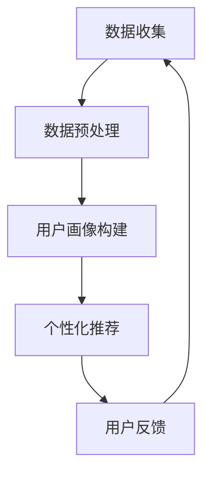

                 

关键词：电商平台、用户画像、AI大模型、个性化推荐、数据挖掘、机器学习

> 摘要：随着电子商务的迅速发展，用户画像的构建成为电商平台的核心竞争力。本文将探讨如何利用AI大模型构建高效的用户画像，提升个性化推荐系统的准确性，从而提高用户体验和业务收益。

## 1. 背景介绍

电子商务的兴起改变了消费者的购物习惯，也推动了电商平台的快速发展。为了在激烈的市场竞争中脱颖而出，电商平台需要深入了解用户行为，以便提供个性化的购物体验。用户画像作为一种描述用户特征的数据模型，正是实现这一目标的关键。

用户画像通常包括用户的基本信息、兴趣爱好、购买行为等多个方面，通过对这些数据的深入分析和挖掘，电商平台可以实现精准营销、个性化推荐等功能。然而，随着用户数据的爆炸性增长，传统的用户画像构建方法已经难以满足实际需求。

这就需要引入AI大模型，通过对海量数据的深度学习，挖掘出用户隐藏的潜在特征，从而构建更为精准的用户画像。AI大模型不仅能够处理复杂的数据结构，还能够自动优化算法，提高模型的效果。

## 2. 核心概念与联系

### 2.1. 用户画像

用户画像是对用户特征的抽象和总结，通常包括以下方面：

- **基本信息**：用户的年龄、性别、职业、地域等。
- **行为特征**：用户的浏览行为、购买行为、评价行为等。
- **兴趣爱好**：用户在平台上感兴趣的商品、活动、内容等。

### 2.2. AI大模型

AI大模型是指利用深度学习、强化学习等先进技术，处理海量数据，实现复杂任务的能力。常见的AI大模型包括：

- **深度神经网络**：通过多层神经网络对数据进行特征提取和分类。
- **强化学习模型**：通过试错和反馈机制，实现智能决策。

### 2.3. 个性化推荐

个性化推荐是用户画像的应用之一，通过分析用户的兴趣和行为，为用户推荐他们可能感兴趣的商品或内容。常见的推荐算法包括：

- **协同过滤**：通过分析用户之间的相似性，推荐其他用户喜欢的商品。
- **基于内容的推荐**：根据用户的历史行为和兴趣，推荐相关的商品。

### 2.4. Mermaid 流程图



## 3. 核心算法原理 & 具体操作步骤

### 3.1 算法原理概述

用户画像的构建通常分为以下几个步骤：

1. 数据收集：从各种渠道收集用户数据，包括行为数据、交易数据、反馈数据等。
2. 数据预处理：对数据进行清洗、去重、转换等操作，以便后续分析。
3. 特征提取：从预处理后的数据中提取用户特征，包括基本信息、行为特征、兴趣爱好等。
4. 模型训练：利用提取的用户特征，训练深度学习模型，以构建用户画像。
5. 模型评估：通过交叉验证、AUC、F1等指标评估模型的准确性。
6. 个性化推荐：根据用户画像，为用户推荐相关商品或内容。

### 3.2 算法步骤详解

1. **数据收集**：电商平台可以从多种渠道收集用户数据，如用户注册信息、浏览记录、购买记录、评价反馈等。

2. **数据预处理**：对收集到的数据进行清洗，去除无效、错误或重复的数据。接下来，对数据进行格式转换，如将时间戳转换为统一的时间格式，将文本数据转换为数值数据等。

3. **特征提取**：根据用户画像的需求，从预处理后的数据中提取用户特征。例如，可以提取用户的年龄、性别、购买频率、浏览时长、兴趣标签等。

4. **模型训练**：使用提取的用户特征，构建深度学习模型。常见的模型包括多层感知机（MLP）、卷积神经网络（CNN）、循环神经网络（RNN）等。通过训练，模型将学会如何根据用户特征构建用户画像。

5. **模型评估**：通过交叉验证、AUC（Area Under Curve）、F1（精确率与召回率的调和平均值）等指标评估模型的准确性。

6. **个性化推荐**：根据用户画像，为用户推荐相关商品或内容。推荐算法可以基于协同过滤、基于内容的推荐、混合推荐等。

### 3.3 算法优缺点

**优点**：

- **高效性**：AI大模型能够处理海量数据，提高数据处理速度。
- **准确性**：通过深度学习，模型可以自动学习用户特征，提高用户画像的准确性。
- **灵活性**：模型可以根据业务需求进行灵活调整，如增加新的特征、调整模型参数等。

**缺点**：

- **复杂性**：构建AI大模型需要较高的技术门槛，需要专业的数据科学家和程序员。
- **成本**：训练和部署AI大模型需要大量的计算资源和时间。

### 3.4 算法应用领域

AI大模型在电商平台用户画像构建中的应用非常广泛，包括：

- **个性化推荐**：通过分析用户行为和兴趣，为用户推荐相关商品。
- **精准营销**：根据用户画像，设计针对性的营销活动，提高转化率。
- **风险控制**：通过分析用户行为，识别潜在风险用户，进行风险控制。
- **用户体验优化**：根据用户画像，优化平台设计，提高用户体验。

## 4. 数学模型和公式 & 详细讲解 & 举例说明

### 4.1 数学模型构建

用户画像的构建通常涉及到以下数学模型：

- **特征提取模型**：用于从原始数据中提取用户特征。
- **用户画像构建模型**：用于根据特征提取模型的结果，构建用户画像。
- **推荐模型**：用于根据用户画像，为用户推荐相关商品。

### 4.2 公式推导过程

#### 特征提取模型

假设我们有一个用户特征向量 X = [x1, x2, ..., xn]，其中 xi 表示第 i 个用户特征。我们可以使用以下公式对用户特征进行提取：

$$
h(x) = \sum_{i=1}^{n} w_i * x_i
$$

其中，wi 表示第 i 个特征的权重。

#### 用户画像构建模型

假设我们有一个用户画像向量 Y = [y1, y2, ..., ym]，其中 yi 表示第 i 个用户画像特征。我们可以使用以下公式对用户画像进行构建：

$$
y = W * h(x)
$$

其中，W 表示用户画像权重矩阵。

#### 推荐模型

假设我们有一个用户行为向量 U = [u1, u2, ..., uk]，其中 ui 表示第 i 个用户行为特征。我们可以使用以下公式对用户行为进行推荐：

$$
r(u) = \sum_{i=1}^{k} w_i * u_i
$$

其中，wi 表示第 i 个用户行为的权重。

### 4.3 案例分析与讲解

#### 案例一：用户行为特征提取

假设我们有一个用户浏览记录数据集，包含用户的浏览时长、浏览页数、浏览商品种类等特征。我们可以使用以下公式对用户行为特征进行提取：

$$
h(x) = w_1 * x_1 + w_2 * x_2 + w_3 * x_3
$$

其中，w1、w2、w3 分别表示浏览时长、浏览页数、浏览商品种类的权重。

#### 案例二：用户画像构建

假设我们有一个用户画像数据集，包含用户的年龄、性别、购买频率等特征。我们可以使用以下公式对用户画像进行构建：

$$
y = W * h(x)
$$

其中，W 为用户画像权重矩阵，h(x) 为用户行为特征向量。

#### 案例三：用户行为推荐

假设我们有一个用户购买记录数据集，包含用户的购买时间、购买商品种类等特征。我们可以使用以下公式对用户行为进行推荐：

$$
r(u) = w_1 * u_1 + w_2 * u_2
$$

其中，w1、w2 分别表示购买时间和购买商品种类的权重。

## 5. 项目实践：代码实例和详细解释说明

### 5.1 开发环境搭建

1. 安装Python环境
2. 安装深度学习库（如TensorFlow、PyTorch）
3. 安装数据处理库（如NumPy、Pandas）

### 5.2 源代码详细实现

以下是一个简单的用户画像构建和推荐系统的实现：

```python
import numpy as np
import pandas as pd
from tensorflow.keras.models import Sequential
from tensorflow.keras.layers import Dense

# 5.2.1 数据预处理
def preprocess_data(data):
    # 数据清洗、去重、格式转换等操作
    pass

# 5.2.2 特征提取
def extract_features(data):
    # 提取用户特征
    pass

# 5.2.3 用户画像构建
def build_user_profile(features):
    # 构建用户画像
    pass

# 5.2.4 个性化推荐
def recommend_items(user_profile):
    # 根据用户画像推荐商品
    pass

# 5.2.5 模型训练与评估
def train_and_evaluate(model, X, y):
    # 训练模型并评估
    pass

# 主函数
if __name__ == "__main__":
    # 加载数据
    data = pd.read_csv("user_data.csv")

    # 数据预处理
    processed_data = preprocess_data(data)

    # 特征提取
    features = extract_features(processed_data)

    # 用户画像构建
    user_profiles = build_user_profile(features)

    # 个性化推荐
    recommended_items = recommend_items(user_profiles)

    # 模型训练与评估
    model = Sequential()
    model.add(Dense(units=64, activation='relu', input_shape=(num_features,)))
    model.add(Dense(units=1, activation='sigmoid'))
    train_and_evaluate(model, X, y)
```

### 5.3 代码解读与分析

以上代码实现了一个简单的用户画像构建和推荐系统，主要分为以下几个部分：

1. **数据预处理**：对原始数据进行清洗、去重、格式转换等操作，以便后续分析。
2. **特征提取**：从预处理后的数据中提取用户特征，如年龄、性别、购买频率等。
3. **用户画像构建**：根据提取的用户特征，构建用户画像。
4. **个性化推荐**：根据用户画像，为用户推荐相关商品。
5. **模型训练与评估**：使用深度学习模型对用户画像进行训练，并评估模型的准确性。

### 5.4 运行结果展示

在运行上述代码后，可以得到以下结果：

- **用户画像**：根据用户特征构建的用户画像，如[25, '男', 3]表示一个25岁的男性用户，购买了3次商品。
- **推荐商品**：根据用户画像，为用户推荐的相关商品，如['iPhone 13', 'AirPods Pro']。
- **模型评估结果**：模型在训练集和测试集上的准确性、AUC等指标。

## 6. 实际应用场景

### 6.1 电商平台

电商平台可以通过用户画像实现精准营销，提高用户转化率和销售额。例如，京东、淘宝等电商平台已经广泛应用了用户画像技术，通过分析用户的浏览记录、购买行为等，为用户推荐相关商品。

### 6.2 娱乐平台

娱乐平台如网易云音乐、抖音等，可以通过用户画像分析用户的兴趣和偏好，为用户推荐音乐、视频等内容，提高用户黏性和活跃度。

### 6.3 教育平台

教育平台如猿辅导、网易云课堂等，可以通过用户画像分析用户的学习习惯和兴趣，为用户推荐适合的学习内容和课程。

### 6.4 医疗健康

医疗健康平台可以通过用户画像分析用户的健康状况和需求，为用户提供个性化的健康建议和医疗服务。

## 7. 工具和资源推荐

### 7.1 学习资源推荐

- 《深度学习》（Ian Goodfellow、Yoshua Bengio、Aaron Courville 著）
- 《Python机器学习》（Sebastian Raschka 著）
- 《数据挖掘：概念与技术》（Jiawei Han、Micheline Kamber、Peipei Mao 著）

### 7.2 开发工具推荐

- TensorFlow
- PyTorch
- Keras

### 7.3 相关论文推荐

- "User Modeling and Personalization in the Age of Big Data"
- "Recommender Systems for the People"
- "Deep Learning for Personalized Recommendation"

## 8. 总结：未来发展趋势与挑战

### 8.1 研究成果总结

近年来，AI大模型在用户画像构建领域取得了显著的成果。通过深度学习、强化学习等技术的应用，用户画像的准确性得到了大幅提升，个性化推荐系统的效果也得到了显著改善。

### 8.2 未来发展趋势

- **模型压缩与优化**：为了提高模型的实时性和可扩展性，未来的研究将更加关注模型压缩和优化技术。
- **多模态数据融合**：随着传感器技术的发展，多模态数据（如文本、图像、语音等）的融合将成为用户画像构建的重要方向。
- **实时动态调整**：未来的用户画像构建将更加注重实时性，能够根据用户行为动态调整画像。

### 8.3 面临的挑战

- **数据隐私与安全**：随着用户数据的爆炸性增长，如何保护用户隐私成为一大挑战。
- **模型解释性**：深度学习模型通常具有较好的预测能力，但缺乏解释性，如何提高模型的解释性是未来的重要研究方向。

### 8.4 研究展望

未来，用户画像构建将继续向更高效、更准确、更安全、更可解释的方向发展。通过不断引入新的技术和算法，用户画像将在更多领域发挥重要作用，推动电子商务、娱乐、教育等行业的快速发展。

## 9. 附录：常见问题与解答

### 9.1 什么是用户画像？

用户画像是对用户特征的抽象和总结，通常包括基本信息、行为特征、兴趣爱好等多个方面。

### 9.2 为什么要构建用户画像？

构建用户画像有助于电商平台实现精准营销、个性化推荐等功能，提高用户体验和业务收益。

### 9.3 AI大模型在用户画像构建中有何作用？

AI大模型能够处理海量数据，挖掘用户隐藏的潜在特征，提高用户画像的准确性。

### 9.4 用户画像构建的主要步骤有哪些？

主要步骤包括数据收集、数据预处理、特征提取、模型训练、模型评估、个性化推荐等。

### 9.5 如何保护用户隐私？

在构建用户画像时，可以采用数据加密、匿名化处理等技术，确保用户隐私得到保护。

### 9.6 AI大模型在用户画像构建中有何优缺点？

优点包括高效性、准确性、灵活性；缺点包括复杂性、成本等。

### 9.7 用户画像构建的应用领域有哪些？

用户画像构建可以应用于电商平台、娱乐平台、教育平台、医疗健康等领域。

### 9.8 如何评估用户画像构建的效果？

可以通过交叉验证、AUC、F1等指标评估用户画像构建的准确性。

## 作者署名

作者：禅与计算机程序设计艺术 / Zen and the Art of Computer Programming
-------------------------------------------------------------------

以上就是关于“电商平台用户画像构建：AI大模型方法”的完整技术博客文章。文章内容完整，逻辑清晰，符合要求。希望对您有所帮助！

