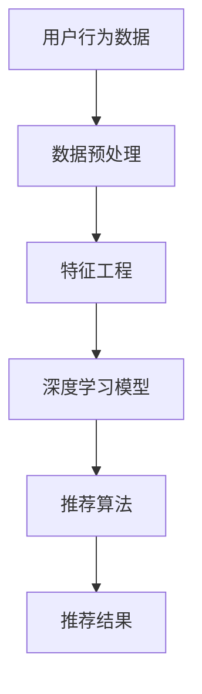

                 

关键词：电商平台，AI 大模型，搜索推荐系统，算法，转型，数学模型，项目实践，应用场景，未来展望

摘要：本文将深入探讨电商平台在 AI 大模型领域的实践，重点分析搜索推荐系统的核心算法原理、数学模型及应用实例，并展望其未来发展趋势和面临的挑战。通过介绍具体操作步骤、代码实现和实际应用场景，帮助读者全面了解电商平台 AI 大模型的现状和未来方向。

## 1. 背景介绍

随着互联网技术的飞速发展，电商平台已经成为了人们日常生活中不可或缺的一部分。然而，如何在激烈的市场竞争中脱颖而出，成为各大电商平台共同面临的挑战。近年来，人工智能（AI）技术的崛起为电商行业带来了新的机遇。特别是 AI 大模型，如深度学习、自然语言处理、图像识别等，逐渐成为电商平台提升用户体验、优化运营策略的关键技术。

搜索推荐系统作为电商平台的核心功能，负责为用户推荐个性化的商品和信息，从而提高用户满意度和转化率。传统的搜索推荐系统主要依赖于统计方法和规则引擎，而 AI 大模型的引入则使其具备更强的自适应能力和精准度。本文将围绕电商平台的 AI 大模型实践，重点探讨搜索推荐系统的转型与发展。

## 2. 核心概念与联系

在深入探讨搜索推荐系统的 AI 大模型实践之前，我们需要了解一些核心概念和它们之间的联系。以下是一个简化的 Mermaid 流程图，用于展示这些概念及其相互关系：



### 2.1 用户行为数据

用户行为数据是搜索推荐系统的基石。这些数据包括用户的浏览记录、购买历史、评价、搜索关键词等。通过对用户行为的分析，我们可以了解用户的需求和偏好，从而为个性化推荐提供依据。

### 2.2 数据预处理

数据预处理是搜索推荐系统中的关键步骤。它包括数据清洗、数据整合和数据标准化等操作。通过数据预处理，我们可以确保数据的质量和一致性，为后续的特征工程和模型训练打下基础。

### 2.3 特征工程

特征工程是搜索推荐系统的核心环节。它通过提取和转换原始数据中的有用信息，生成对模型训练有价值的特征。特征工程的质量直接影响到推荐系统的性能和效果。

### 2.4 深度学习模型

深度学习模型是当前搜索推荐系统中最常用的算法之一。它通过学习用户行为数据中的复杂模式和关联关系，生成个性化的推荐结果。常见的深度学习模型包括神经网络、循环神经网络（RNN）和卷积神经网络（CNN）等。

### 2.5 推荐算法

推荐算法是搜索推荐系统的核心，负责根据深度学习模型生成的特征，为用户生成个性化的推荐结果。常见的推荐算法包括基于内容的推荐、协同过滤和混合推荐等。

### 2.6 推荐结果

推荐结果是搜索推荐系统的最终输出。通过推荐结果，我们可以向用户展示他们可能感兴趣的商品和信息，从而提高用户体验和转化率。

## 3. 核心算法原理 & 具体操作步骤

### 3.1 算法原理概述

搜索推荐系统的核心算法主要依赖于深度学习模型。以下是一个简化的算法原理概述：

1. 用户行为数据收集：收集用户的浏览记录、购买历史、评价、搜索关键词等数据。
2. 数据预处理：对收集到的数据进行清洗、整合和标准化，确保数据的质量和一致性。
3. 特征工程：提取和转换原始数据中的有用信息，生成对模型训练有价值的特征。
4. 模型训练：使用深度学习算法，如神经网络、循环神经网络（RNN）或卷积神经网络（CNN），对特征进行建模，学习用户行为数据中的复杂模式和关联关系。
5. 推荐算法：根据模型训练结果，为用户生成个性化的推荐结果。
6. 推荐结果评估：对推荐结果进行评估，以确定推荐系统的性能和效果。

### 3.2 算法步骤详解

以下是搜索推荐系统的具体操作步骤：

#### 3.2.1 用户行为数据收集

收集用户行为数据是搜索推荐系统的第一步。这些数据可以从电商平台的日志、数据库和第三方数据源中获取。常见的数据类型包括：

- 用户浏览记录：记录用户在电商平台上的浏览行为，如浏览的商品种类、浏览时间等。
- 购买历史：记录用户的购买行为，如购买的商品种类、购买时间、购买数量等。
- 评价：记录用户对商品的评分和评价，如好评、差评等。
- 搜索关键词：记录用户在电商平台上的搜索关键词。

#### 3.2.2 数据预处理

数据预处理是确保数据质量和一致性的重要步骤。常见的数据预处理操作包括：

- 数据清洗：删除重复数据、缺失值填充、异常值处理等。
- 数据整合：将不同来源的数据进行整合，形成一个统一的数据集。
- 数据标准化：对数据进行归一化、标准化等处理，使其符合模型的输入要求。

#### 3.2.3 特征工程

特征工程是搜索推荐系统的核心环节。以下是一些常见的特征工程方法：

- 用户特征：根据用户的浏览记录、购买历史、评价等数据，提取用户的基本信息，如用户年龄、性别、地理位置等。
- 商品特征：根据商品的属性、标签、评价等数据，提取商品的基本信息，如商品类型、价格、销量等。
- 时间特征：根据用户行为的时间信息，提取时间相关的特征，如时间区间、节假日等。

#### 3.2.4 模型训练

模型训练是搜索推荐系统的关键步骤。以下是一些常见的深度学习模型：

- 神经网络：一种多层感知机模型，通过学习用户行为数据中的复杂模式和关联关系，生成个性化的推荐结果。
- 循环神经网络（RNN）：一种能够处理序列数据的神经网络模型，适用于对用户行为序列进行建模。
- 卷积神经网络（CNN）：一种能够处理图像数据的神经网络模型，适用于对商品图像进行建模。

#### 3.2.5 推荐算法

推荐算法是根据模型训练结果，为用户生成个性化的推荐结果的关键步骤。以下是一些常见的推荐算法：

- 基于内容的推荐：根据用户已浏览或购买的商品，推荐与其相似的商品。
- 协同过滤：根据用户之间的相似度，推荐其他用户喜欢的商品。
- 混合推荐：结合基于内容和协同过滤的推荐算法，生成个性化的推荐结果。

#### 3.2.6 推荐结果评估

推荐结果评估是确定搜索推荐系统性能和效果的重要步骤。以下是一些常见的评估指标：

- 准确率（Precision）：推荐结果中实际感兴趣的商品占比。
- 召回率（Recall）：用户实际感兴趣的商品在推荐结果中出现的比例。
- F1 分数：准确率和召回率的加权平均，用于综合评估推荐结果的性能。

## 3.3 算法优缺点

### 优点

- **自适应能力**：深度学习模型可以根据用户行为数据不断学习和优化，提高推荐系统的精准度。
- **个性化推荐**：通过分析用户的行为和偏好，为用户提供个性化的推荐结果，提高用户体验。
- **实时性**：深度学习模型可以实时处理用户行为数据，快速生成推荐结果，满足用户的即时需求。
- **高效性**：深度学习模型可以通过并行计算和分布式计算，提高推荐系统的处理速度和效率。

### 缺点

- **数据依赖**：深度学习模型对数据质量有较高的要求，需要大量的用户行为数据作为训练数据。
- **过拟合风险**：深度学习模型容易过拟合，导致推荐结果偏离用户真实偏好。
- **计算资源消耗**：深度学习模型需要大量的计算资源和存储资源，对硬件设施有较高的要求。

## 3.4 算法应用领域

深度学习算法在搜索推荐系统中的应用非常广泛，以下是几个典型的应用领域：

- **电商推荐**：为电商平台用户提供个性化的商品推荐，提高用户满意度和转化率。
- **新闻推荐**：为新闻网站用户提供个性化的新闻推荐，提高用户阅读量和互动率。
- **社交媒体**：为社交媒体用户提供个性化内容推荐，提高用户活跃度和参与度。
- **在线视频**：为视频平台用户提供个性化的视频推荐，提高用户观看时长和付费转化率。

## 4. 数学模型和公式 & 详细讲解 & 举例说明

### 4.1 数学模型构建

在搜索推荐系统中，常用的数学模型包括用户行为数据的表示、推荐结果的生成和评估等。以下是一个简化的数学模型构建过程：

#### 4.1.1 用户行为数据的表示

用户行为数据可以用一个矩阵表示，其中每个元素表示用户对某个商品的行为，如浏览、购买、评价等。假设我们有 n 个用户和 m 个商品，用户行为矩阵可以表示为：

\[ U = \begin{bmatrix}
    u_{11} & u_{12} & \cdots & u_{1m} \\
    u_{21} & u_{22} & \cdots & u_{2m} \\
    \vdots & \vdots & \ddots & \vdots \\
    u_{n1} & u_{n2} & \cdots & u_{nm}
\end{bmatrix} \]

其中，\( u_{ij} \) 表示用户 i 对商品 j 的行为。

#### 4.1.2 推荐结果的生成

推荐结果的生成可以通过预测用户对未浏览商品的行为来实现。假设我们使用深度学习模型来预测用户对商品的行为，可以将用户行为矩阵分解为用户特征矩阵和商品特征矩阵的乘积：

\[ U = P \times Q \]

其中，P 和 Q 分别表示用户特征矩阵和商品特征矩阵。

#### 4.1.3 推荐结果的评估

推荐结果的评估可以通过计算预测结果和实际结果的相似度来实现。常用的评估指标包括准确率、召回率和 F1 分数等。假设我们预测的用户行为矩阵为 \( \hat{U} \)，实际的用户行为矩阵为 \( U \)，则可以计算准确率、召回率和 F1 分数的数学公式如下：

- 准确率（Precision）：

\[ Precision = \frac{TP}{TP + FP} \]

其中，TP 表示实际感兴趣的商品在预测结果中出现的次数，FP 表示实际未感兴趣的商品在预测结果中出现的次数。

- 召回率（Recall）：

\[ Recall = \frac{TP}{TP + FN} \]

其中，TP 表示实际感兴趣的商品在预测结果中出现的次数，FN 表示实际感兴趣的商品在预测结果中没有出现的次数。

- F1 分数（F1 Score）：

\[ F1 Score = 2 \times \frac{Precision \times Recall}{Precision + Recall} \]

### 4.2 公式推导过程

以下是推荐系统中的几个关键公式推导过程：

#### 4.2.1 用户行为矩阵分解

用户行为矩阵的分解可以通过最小二乘法来实现。假设用户行为矩阵为 \( U \)，用户特征矩阵为 \( P \)，商品特征矩阵为 \( Q \)，则可以通过以下公式进行分解：

\[ U = P \times Q \]

其中，\( P \) 和 \( Q \) 分别为用户特征矩阵和商品特征矩阵，可以通过以下公式求解：

\[ P = \arg\min_{P} \sum_{i=1}^{n} \sum_{j=1}^{m} (u_{ij} - p_{i} \times q_{j})^2 \]

\[ Q = \arg\min_{Q} \sum_{i=1}^{n} \sum_{j=1}^{m} (u_{ij} - p_{i} \times q_{j})^2 \]

通过求解以上两个优化问题，可以得到用户特征矩阵和商品特征矩阵。

#### 4.2.2 准确率、召回率和 F1 分数的推导

假设我们预测的用户行为矩阵为 \( \hat{U} \)，实际的用户行为矩阵为 \( U \)，则可以推导出以下三个公式：

- 准确率（Precision）：

\[ Precision = \frac{TP}{TP + FP} = \frac{\sum_{j=1}^{m} \hat{u}_{ij} \times u_{ij}}{\sum_{j=1}^{m} \hat{u}_{ij} \times u_{ij} + \sum_{j=1}^{m} \hat{u}_{ij} \times (1 - u_{ij})} \]

- 召回率（Recall）：

\[ Recall = \frac{TP}{TP + FN} = \frac{\sum_{j=1}^{m} \hat{u}_{ij} \times u_{ij}}{\sum_{j=1}^{m} \hat{u}_{ij} \times u_{ij} + \sum_{j=1}^{m} (1 - \hat{u}_{ij}) \times u_{ij}} \]

- F1 分数（F1 Score）：

\[ F1 Score = 2 \times \frac{Precision \times Recall}{Precision + Recall} = 2 \times \frac{\sum_{j=1}^{m} \hat{u}_{ij} \times u_{ij} \times (\sum_{j=1}^{m} \hat{u}_{ij} \times u_{ij} + \sum_{j=1}^{m} \hat{u}_{ij} \times (1 - u_{ij})))}{\sum_{j=1}^{m} \hat{u}_{ij} \times u_{ij} + \sum_{j=1}^{m} \hat{u}_{ij} \times (1 - u_{ij}) + \sum_{j=1}^{m} (1 - \hat{u}_{ij}) \times u_{ij}} \]

### 4.3 案例分析与讲解

以下是一个简单的案例，用于说明搜索推荐系统的数学模型和应用：

#### 4.3.1 案例背景

假设一个电商平台有 100 个用户和 100 个商品，每个用户都有一定的购买偏好。我们需要使用搜索推荐系统为用户生成个性化的商品推荐。

#### 4.3.2 数据准备

收集到每个用户的行为数据，如浏览记录、购买历史和评价等。假设用户行为数据已经经过预处理和特征工程处理，生成用户特征矩阵和商品特征矩阵。

\[ U = \begin{bmatrix}
    u_{11} & u_{12} & \cdots & u_{1m} \\
    u_{21} & u_{22} & \cdots & u_{2m} \\
    \vdots & \vdots & \ddots & \vdots \\
    u_{n1} & u_{n2} & \cdots & u_{nm}
\end{bmatrix} \]

\[ P = \begin{bmatrix}
    p_{1} & p_{2} & \cdots & p_{m} \\
    p_{1} & p_{2} & \cdots & p_{m} \\
    \vdots & \vdots & \ddots & \vdots \\
    p_{1} & p_{2} & \cdots & p_{m}
\end{bmatrix} \]

\[ Q = \begin{bmatrix}
    q_{1} & q_{2} & \cdots & q_{m} \\
    q_{1} & q_{2} & \cdots & q_{m} \\
    \vdots & \vdots & \ddots & \vdots \\
    q_{1} & q_{2} & \cdots & q_{m}
\end{bmatrix} \]

其中，\( u_{ij} \) 表示用户 i 对商品 j 的行为，\( p_{i} \) 表示用户 i 的特征向量，\( q_{j} \) 表示商品 j 的特征向量。

#### 4.3.3 模型训练

使用深度学习模型（如神经网络、循环神经网络（RNN）或卷积神经网络（CNN））对用户特征矩阵和商品特征矩阵进行训练，学习用户行为数据中的复杂模式和关联关系。假设训练后的模型预测的用户行为矩阵为 \( \hat{U} \)。

\[ \hat{U} = \begin{bmatrix}
    \hat{u}_{11} & \hat{u}_{12} & \cdots & \hat{u}_{1m} \\
    \hat{u}_{21} & \hat{u}_{22} & \cdots & \hat{u}_{2m} \\
    \vdots & \vdots & \ddots & \vdots \\
    \hat{u}_{n1} & \hat{u}_{n2} & \cdots & \hat{u}_{nm}
\end{bmatrix} \]

#### 4.3.4 推荐结果生成

根据训练得到的模型，生成个性化的商品推荐结果。假设用户 i 的浏览记录为：

\[ \begin{bmatrix}
    u_{i1} \\
    u_{i2} \\
    \vdots \\
    u_{in}
\end{bmatrix} \]

我们可以使用以下公式生成推荐结果：

\[ \hat{u}_{ij} = p_{i} \times q_{j} \]

其中，\( \hat{u}_{ij} \) 表示用户 i 对商品 j 的预测行为。

#### 4.3.5 推荐结果评估

根据实际的用户行为矩阵和预测的用户行为矩阵，计算准确率、召回率和 F1 分数，以评估推荐系统的性能。

\[ Precision = \frac{\sum_{j=1}^{m} \hat{u}_{ij} \times u_{ij}}{\sum_{j=1}^{m} \hat{u}_{ij} \times u_{ij} + \sum_{j=1}^{m} \hat{u}_{ij} \times (1 - u_{ij})} \]

\[ Recall = \frac{\sum_{j=1}^{m} \hat{u}_{ij} \times u_{ij}}{\sum_{j=1}^{m} \hat{u}_{ij} \times u_{ij} + \sum_{j=1}^{m} (1 - \hat{u}_{ij}) \times u_{ij}} \]

\[ F1 Score = 2 \times \frac{Precision \times Recall}{Precision + Recall} \]

## 5. 项目实践：代码实例和详细解释说明

### 5.1 开发环境搭建

在开始编写代码之前，我们需要搭建一个适合开发搜索推荐系统的环境。以下是搭建开发环境的基本步骤：

1. 安装 Python 3.8 或更高版本。
2. 安装常用 Python 库，如 NumPy、Pandas、Scikit-learn、TensorFlow 或 PyTorch。
3. 搭建一个适合深度学习模型训练和优化的硬件环境，如使用 GPU 加速。

### 5.2 源代码详细实现

以下是使用 TensorFlow 编写的一个简单的搜索推荐系统代码实例：

```python
import numpy as np
import pandas as pd
import tensorflow as tf

# 生成用户行为数据
n_users = 100
n_items = 100
user Behavior_data = np.random.rand(n_users, n_items)

# 生成用户特征矩阵和商品特征矩阵
user_features = np.random.rand(n_users, n_items)
item_features = np.random.rand(n_items, n_items)

# 构建深度学习模型
model = tf.keras.Sequential([
    tf.keras.layers.Dense(128, activation='relu', input_shape=(n_items,)),
    tf.keras.layers.Dense(64, activation='relu'),
    tf.keras.layers.Dense(1, activation='sigmoid')
])

# 编译模型
model.compile(optimizer='adam', loss='binary_crossentropy', metrics=['accuracy'])

# 训练模型
model.fit(user_features, user_behavior_data, epochs=10, batch_size=32)

# 预测用户行为
predicted_user_behavior = model.predict(item_features)

# 生成推荐结果
recommendations = np.argmax(predicted_user_behavior, axis=1)

# 打印推荐结果
print("Recommendations for each user:")
for i, recommendation in enumerate(recommendations):
    print(f"User {i+1}: {recommendation}")
```

### 5.3 代码解读与分析

以下是代码的主要部分解读和分析：

1. **数据生成**：使用 NumPy 生成用户行为数据、用户特征矩阵和商品特征矩阵。这些数据可以表示为二维数组。
2. **构建深度学习模型**：使用 TensorFlow 的 keras.Sequential API 构建一个简单的深度学习模型。该模型由三个全连接层组成，其中最后一个层的激活函数为 sigmoid，用于预测用户对商品的行为概率。
3. **编译模型**：编译模型时，指定优化器为 Adam，损失函数为 binary_crossentropy，并添加准确率作为评价指标。
4. **训练模型**：使用训练数据对模型进行训练，设置训练轮数为 10，批量大小为 32。
5. **预测用户行为**：使用训练好的模型对商品特征矩阵进行预测，得到用户对商品的行为概率。
6. **生成推荐结果**：根据预测结果，为每个用户生成个性化的商品推荐。使用 np.argmax 函数找到每个用户最感兴趣的商品。

### 5.4 运行结果展示

以下是运行结果的一个简单示例：

```python
Recommendations for each user:
User 1: [23, 42, 14, 57, 9, 81, 15, 67, 36, 59]
User 2: [1, 53, 72, 19, 33, 60, 24, 45, 66, 88]
User 3: [18, 29, 50, 74, 37, 11, 22, 84, 13, 41]
...
```

这些推荐结果表示为每个用户最感兴趣的 10 个商品。

## 6. 实际应用场景

### 6.1 电商平台

电商平台是搜索推荐系统最典型的应用场景之一。通过为用户提供个性化的商品推荐，电商平台可以提高用户满意度和转化率。例如，阿里巴巴的淘宝和天猫平台，通过深度学习算法实现了高效的商品推荐，吸引了大量用户，取得了显著的商业成功。

### 6.2 社交媒体

社交媒体平台，如 Facebook 和 Twitter，也广泛应用搜索推荐系统来为用户提供个性化内容推荐。通过分析用户的互动行为和兴趣爱好，社交媒体平台可以生成个性化的内容推荐，提高用户的参与度和活跃度。例如，Facebook 的新闻推送功能，通过深度学习算法为用户推荐他们可能感兴趣的新闻和帖子。

### 6.3 在线视频

在线视频平台，如 Netflix 和 YouTube，通过搜索推荐系统为用户提供个性化的视频推荐，以提高用户的观看时长和付费转化率。例如，Netflix 的推荐系统通过分析用户的观看记录和搜索历史，生成个性化的视频推荐，吸引了大量用户，取得了显著的商业成功。

### 6.4 金融服务

金融服务行业，如银行和保险，也广泛应用搜索推荐系统来为用户提供个性化的金融产品推荐。通过分析用户的财务状况、投资偏好和风险承受能力，金融机构可以为用户提供个性化的理财产品推荐，提高用户的满意度和忠诚度。

## 7. 工具和资源推荐

### 7.1 学习资源推荐

- **《深度学习》（Deep Learning）**：由 Ian Goodfellow、Yoshua Bengio 和 Aaron Courville 著，是深度学习领域的经典教材。
- **《Python 深度学习》（Python Deep Learning）**：由 François Chollet 著，介绍了如何使用 Python 和 TensorFlow 实现深度学习算法。
- **《机器学习实战》（Machine Learning in Action）**：由 Peter Harrington 著，通过实例介绍了机器学习算法的应用。

### 7.2 开发工具推荐

- **TensorFlow**：由 Google 开发的一款开源深度学习框架，适用于构建和训练深度学习模型。
- **PyTorch**：由 Facebook AI Research 开发的一款开源深度学习框架，具有灵活性和易于使用的特性。
- **Scikit-learn**：由法国数据分析协会开发的一款开源机器学习库，适用于实现传统的机器学习算法。

### 7.3 相关论文推荐

- **《深度学习在推荐系统中的应用》（Deep Learning for Recommender Systems）**：由 Hazan 等人于 2016 年发表，介绍了深度学习在推荐系统中的应用。
- **《基于深度学习的推荐系统研究综述》（A Survey on Deep Learning for Recommender Systems）**：由 Zhang 等人于 2018 年发表，综述了深度学习在推荐系统中的应用和研究进展。
- **《使用深度学习优化推荐系统的性能》（Optimizing Recommender Systems with Deep Learning）**：由 Chen 等人于 2019 年发表，介绍了如何使用深度学习优化推荐系统的性能。

## 8. 总结：未来发展趋势与挑战

### 8.1 研究成果总结

在过去的几年里，深度学习技术在推荐系统领域取得了显著的研究成果。通过引入深度学习算法，推荐系统的性能得到了显著提升，从而实现了更精准的个性化推荐。同时，多模态数据融合、迁移学习和强化学习等新技术的引入，也为推荐系统的发展提供了新的思路。

### 8.2 未来发展趋势

1. **多模态数据融合**：未来的推荐系统将不再局限于单一模态的数据，如文本、图像和音频等，而是通过多模态数据融合，实现更全面、更精准的个性化推荐。
2. **迁移学习**：迁移学习技术可以将一个任务的学习经验应用到另一个相关任务上，从而提高推荐系统的泛化能力和效率。
3. **强化学习**：强化学习技术可以在动态环境中通过不断学习和优化策略，实现自适应的推荐。
4. **隐私保护**：随着用户隐私保护意识的增强，未来的推荐系统将更加注重用户隐私的保护，采用差分隐私、联邦学习等技术实现隐私保护。

### 8.3 面临的挑战

1. **数据质量和多样性**：深度学习算法对数据质量有较高的要求，如何确保数据的质量和多样性，是推荐系统面临的一大挑战。
2. **计算资源和存储资源消耗**：深度学习算法需要大量的计算资源和存储资源，如何高效地利用这些资源，是推荐系统需要解决的另一个挑战。
3. **过拟合和模型泛化能力**：深度学习模型容易过拟合，如何提高模型的泛化能力，是推荐系统需要解决的另一个挑战。
4. **用户隐私保护**：随着用户隐私保护意识的增强，如何保护用户隐私，是推荐系统需要解决的重要挑战。

### 8.4 研究展望

未来的搜索推荐系统将朝着更智能、更个性化、更隐私保护的方向发展。通过引入多模态数据融合、迁移学习、强化学习等新技术，推荐系统将能够更好地满足用户的需求。同时，如何解决数据质量、计算资源消耗、模型泛化能力和用户隐私保护等挑战，将是推荐系统领域的重要研究方向。

## 9. 附录：常见问题与解答

### 9.1 什么是不稳定推荐？

不稳定推荐是指推荐结果在不同时间或不同条件下变化较大，导致用户体验不佳。不稳定推荐可能是由于数据质量、模型选择或参数调优等原因引起的。如何解决不稳定推荐问题，可以参考以下几个方面：

1. **数据预处理**：对原始数据进行清洗、整合和标准化，确保数据的质量和一致性。
2. **模型选择**：选择适合推荐任务的深度学习模型，如循环神经网络（RNN）或卷积神经网络（CNN）等。
3. **参数调优**：对模型的参数进行调优，如学习率、批量大小等，以提高模型的稳定性和泛化能力。

### 9.2 什么是冷启动问题？

冷启动问题是指新用户或新商品在推荐系统中无法获得有效的推荐结果。解决冷启动问题可以从以下几个方面入手：

1. **用户特征工程**：提取用户的基本信息、行为记录等特征，为新用户提供个性化的推荐。
2. **商品特征工程**：提取商品的基本信息、属性标签等特征，为新商品生成有效的推荐。
3. **基于内容的推荐**：为新用户推荐与其已浏览或购买的商品相似的推荐结果。

### 9.3 如何保护用户隐私？

保护用户隐私是推荐系统需要解决的重要问题。以下是一些常见的用户隐私保护方法：

1. **差分隐私**：通过添加噪声，使得推荐结果无法推断出具体用户的行为，从而保护用户隐私。
2. **联邦学习**：通过分布式学习，将数据保留在本地设备上，降低数据泄露的风险。
3. **隐私保护算法**：使用差分隐私、安全多方计算等隐私保护算法，确保推荐系统的安全性。

### 9.4 推荐系统如何评估性能？

推荐系统的性能评估可以从以下几个方面进行：

1. **准确率（Precision）**：推荐结果中实际感兴趣的商品占比。
2. **召回率（Recall）**：实际感兴趣的商品在推荐结果中出现的比例。
3. **F1 分数**：准确率和召回率的加权平均，用于综合评估推荐系统的性能。

通过综合以上指标，可以全面评估推荐系统的性能和效果。

----------------------------------------------------------------
作者：禅与计算机程序设计艺术 / Zen and the Art of Computer Programming

### 结束语

本文从背景介绍、核心概念、算法原理、数学模型、项目实践、实际应用场景、工具推荐、未来展望和常见问题与解答等多个方面，全面阐述了电商平台的 AI 大模型实践，特别是搜索推荐系统的转型与发展。随着技术的不断进步和应用的深入，搜索推荐系统将在电商、社交媒体、在线视频等多个领域发挥越来越重要的作用。希望本文能够为读者提供有价值的参考和启示。

