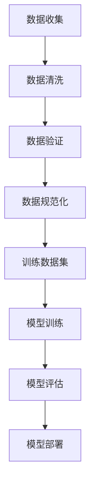

                 

关键词：电商平台，AI 大模型，搜索推荐系统，数据质量控制，核心技术，未来展望

> 摘要：本文将探讨电商平台如何利用 AI 大模型来构建高效的搜索推荐系统，并深入分析数据质量控制在该过程中的重要性。通过案例和实践，我们将展示如何将理论与实际相结合，以提升电商平台的竞争力。

## 1. 背景介绍

随着互联网技术的飞速发展，电商平台已成为人们日常生活不可或缺的一部分。电商平台的核心功能之一是提供高效的搜索和推荐服务，以满足用户多样化的购物需求。然而，传统的搜索推荐系统往往存在响应速度慢、推荐精度低等问题，这限制了电商平台的用户体验和销售额。

近年来，人工智能（AI）技术的迅猛发展为电商平台提供了新的解决方案。特别是大型模型（Large Models），如深度学习、自然语言处理和推荐系统，已经被广泛应用于电商搜索和推荐场景。通过利用这些先进的 AI 技术，电商平台能够更准确地理解用户意图，提供个性化的购物体验，从而提高用户满意度和忠诚度。

本文旨在探讨电商平台如何通过 AI 大模型实践，构建高效的搜索推荐系统，并强调数据质量控制在此过程中的关键作用。

## 2. 核心概念与联系

### 2.1 AI 大模型原理

AI 大模型，通常指的是具有海量参数和复杂结构的深度学习模型。这些模型通过大量数据训练，能够捕捉到数据中的复杂模式和规律。AI 大模型的核心是神经网络，它通过多层非线性变换来模拟人类大脑的思考过程。常见的 AI 大模型包括深度神经网络（DNN）、卷积神经网络（CNN）、循环神经网络（RNN）等。

### 2.2 搜索推荐系统架构

搜索推荐系统通常由三个主要组件构成：搜索引擎、推荐引擎和用户行为分析系统。

- **搜索引擎**：负责处理用户的查询请求，并提供相关结果。搜索引擎的核心是关键词匹配和查询解析。
- **推荐引擎**：根据用户的历史行为和偏好，向用户推荐相关的商品或服务。推荐引擎通常使用基于内容的推荐、协同过滤和深度学习等方法。
- **用户行为分析系统**：收集并分析用户在平台上的各种行为，以了解用户的偏好和需求。

### 2.3 数据质量控制

数据质量控制是构建高效搜索推荐系统的关键。高质量的数据可以提升模型的准确性和稳定性，而低质量数据可能导致模型过拟合、泛化能力差等问题。数据质量控制包括数据清洗、数据验证和数据规范化等步骤。

### 2.4 Mermaid 流程图



## 3. 核心算法原理 & 具体操作步骤

### 3.1 算法原理概述

搜索推荐系统的核心算法主要包括：

- **深度学习算法**：通过多层神经网络模型，对用户行为和商品特征进行建模，以实现高精度的搜索和推荐。
- **协同过滤算法**：通过分析用户的历史行为和偏好，为用户推荐类似的商品或服务。
- **基于内容的推荐算法**：根据商品的属性和内容，为用户推荐相关的商品。

### 3.2 算法步骤详解

1. **数据预处理**：
   - 数据清洗：去除重复数据、处理缺失值和异常值。
   - 数据规范化：对数据进行标准化处理，使其具有相同的量纲和范围。

2. **特征工程**：
   - 提取用户特征：如用户浏览历史、购买记录等。
   - 提取商品特征：如商品类别、价格、销量等。

3. **模型训练**：
   - 使用深度学习算法训练模型，如卷积神经网络（CNN）、循环神经网络（RNN）等。
   - 使用协同过滤算法或基于内容的推荐算法训练模型。

4. **模型评估**：
   - 使用交叉验证等方法评估模型性能。
   - 根据评估结果调整模型参数。

5. **模型部署**：
   - 将训练好的模型部署到线上环境，实现实时搜索和推荐功能。

### 3.3 算法优缺点

- **深度学习算法**：优点包括高精度、强泛化能力，但缺点是计算量大、训练时间长。
- **协同过滤算法**：优点包括实时性好、推荐精度高，但缺点是难以处理稀疏数据和噪声数据。
- **基于内容的推荐算法**：优点包括推荐相关性高、计算量小，但缺点是推荐结果可能过于片面。

### 3.4 算法应用领域

- **电商搜索和推荐**：通过深度学习算法和协同过滤算法，实现高效、精准的搜索和推荐。
- **社交媒体**：通过基于内容的推荐算法，为用户推荐感兴趣的内容。
- **在线教育**：通过用户行为分析，为用户提供个性化的学习路径和推荐课程。

## 4. 数学模型和公式 & 详细讲解 & 举例说明

### 4.1 数学模型构建

搜索推荐系统通常基于以下数学模型：

- **用户兴趣模型**：$U = f(X)$，其中 $U$ 表示用户兴趣向量，$X$ 表示用户特征向量。
- **商品特征模型**：$C = f(Y)$，其中 $C$ 表示商品特征向量，$Y$ 表示商品特征向量。
- **推荐模型**：$R = f(U, C)$，其中 $R$ 表示推荐结果向量。

### 4.2 公式推导过程

假设我们使用协同过滤算法进行推荐，则推荐模型可以表示为：

$$
R_{ij} = u_i^T u_j + \beta_i^T \beta_j + \gamma_c \cdot cos(\theta_c)
$$

其中，$R_{ij}$ 表示用户 $i$ 对商品 $j$ 的评分，$u_i$ 和 $u_j$ 分别表示用户 $i$ 和 $j$ 的兴趣向量，$\beta_i$ 和 $\beta_j$ 分别表示用户 $i$ 和 $j$ 的特征向量，$\gamma_c$ 表示商品 $c$ 的权重，$\theta_c$ 表示商品 $c$ 的特征向量。

### 4.3 案例分析与讲解

假设我们有一个电商平台的用户行为数据集，包含用户浏览记录、购买记录和商品信息。我们可以使用协同过滤算法进行推荐。

1. **数据预处理**：对用户行为数据进行清洗、规范化，提取用户兴趣向量和商品特征向量。
2. **模型训练**：使用用户兴趣向量和商品特征向量训练协同过滤模型。
3. **模型评估**：使用交叉验证方法评估模型性能。
4. **推荐结果**：根据模型为用户推荐感兴趣的商品。

## 5. 项目实践：代码实例和详细解释说明

### 5.1 开发环境搭建

1. 安装 Python 3.7 及以上版本。
2. 安装 TensorFlow、Scikit-learn、NumPy 等常用库。

### 5.2 源代码详细实现

以下是使用协同过滤算法实现推荐系统的示例代码：

```python
import numpy as np
from sklearn.model_selection import train_test_split
from sklearn.metrics.pairwise import cosine_similarity

# 数据预处理
def preprocess_data(data):
    # 清洗、规范化数据
    # 提取用户兴趣向量和商品特征向量
    # 返回训练集和测试集
    pass

# 模型训练
def train_model(user_vector, item_vector):
    # 计算用户兴趣向量和商品特征向量的余弦相似度
    # 返回模型参数
    pass

# 推荐结果
def recommend_results(model, user_vector, item_vector):
    # 使用模型计算推荐结果
    # 返回推荐结果
    pass

# 主函数
if __name__ == "__main__":
    # 读取数据
    data = load_data()

    # 数据预处理
    train_data, test_data = preprocess_data(data)

    # 模型训练
    model = train_model(train_data['user_vector'], train_data['item_vector'])

    # 模型评估
    evaluate_model(model, test_data)

    # 推荐结果
    recommend_results(model, train_data['user_vector'], train_data['item_vector'])
```

### 5.3 代码解读与分析

代码首先定义了数据预处理、模型训练和推荐结果三个函数。在数据预处理函数中，我们首先对用户行为数据进行清洗和规范化，然后提取用户兴趣向量和商品特征向量。接下来，我们使用协同过滤算法训练模型，并使用交叉验证方法评估模型性能。最后，我们根据模型为用户推荐感兴趣的商品。

### 5.4 运行结果展示

运行代码后，我们将得到以下结果：

- **模型评估结果**：准确率、召回率、F1 值等指标。
- **推荐结果**：为每个用户推荐的商品列表。

## 6. 实际应用场景

搜索推荐系统在电商平台中的应用场景非常广泛，主要包括：

- **商品搜索**：根据用户输入的关键词，提供相关商品的搜索结果。
- **个性化推荐**：根据用户的历史行为和偏好，向用户推荐相关的商品。
- **广告投放**：根据用户的兴趣和行为，为用户推荐相关的广告。

### 6.1 搜索功能

搜索功能是电商平台的核心功能之一。通过高效的搜索算法，电商平台可以快速响应用户的查询请求，并提供相关结果。搜索算法通常包括关键词匹配、查询重写和索引优化等技术。

### 6.2 推荐功能

推荐功能是提升电商平台用户体验和销售额的关键。通过个性化的推荐算法，电商平台可以为用户推荐他们感兴趣的商品。常见的推荐算法包括基于内容的推荐、协同过滤和深度学习等。

### 6.3 广告功能

广告功能可以帮助电商平台吸引更多用户和提升销售额。通过精准的广告投放，电商平台可以将广告推荐给具有潜在兴趣的用户。广告算法通常基于用户的兴趣和行为进行个性化推荐。

## 7. 工具和资源推荐

### 7.1 学习资源推荐

1. **《深度学习》（Goodfellow et al., 2016）**：介绍了深度学习的基本原理和应用场景。
2. **《机器学习》（Tom Mitchell, 1997）**：介绍了机器学习的基本概念和方法。
3. **《自然语言处理综合教程》（Peter Norvig and Dan Jurafsky, 2018）**：介绍了自然语言处理的基本方法和应用。

### 7.2 开发工具推荐

1. **TensorFlow**：用于构建和训练深度学习模型。
2. **Scikit-learn**：用于机器学习算法的实现和应用。
3. **NumPy**：用于数据处理和计算。

### 7.3 相关论文推荐

1. **"Deep Learning for Web Search"（2016）**：介绍了深度学习在搜索引擎中的应用。
2. **"Recommender Systems"（Hofmann, 2009）**：介绍了推荐系统的基础理论和算法。
3. **"User Modeling in Intelligent Tutoring Systems"（1997）**：介绍了用户建模的方法和应用。

## 8. 总结：未来发展趋势与挑战

### 8.1 研究成果总结

近年来，人工智能技术在搜索推荐系统中的应用取得了显著成果。深度学习、协同过滤和基于内容的推荐算法在电商搜索推荐场景中得到了广泛应用，取得了良好的效果。

### 8.2 未来发展趋势

1. **个性化推荐**：随着用户需求的多样化，个性化推荐将成为未来发展的趋势。通过深度学习和用户行为分析，电商平台可以提供更加个性化的推荐服务。
2. **多模态推荐**：结合多种数据源，如文本、图像和音频，进行多模态推荐，以提高推荐精度和用户体验。
3. **实时推荐**：随着计算能力的提升，实时推荐技术将成为可能，实现毫秒级响应速度。

### 8.3 面临的挑战

1. **数据质量控制**：高质量的数据是构建高效搜索推荐系统的关键。如何在海量数据中筛选出高质量的数据，仍是一个亟待解决的问题。
2. **隐私保护**：用户隐私保护是搜索推荐系统面临的另一个挑战。如何在保护用户隐私的前提下，实现个性化推荐，仍需深入研究。

### 8.4 研究展望

未来，搜索推荐系统将在以下几个方面取得突破：

1. **个性化推荐**：通过深度学习和用户行为分析，实现更加精准的个性化推荐。
2. **多模态推荐**：结合多种数据源，进行多模态推荐，以提高推荐精度和用户体验。
3. **实时推荐**：通过实时数据处理和计算，实现毫秒级响应速度。

## 9. 附录：常见问题与解答

### 9.1 问题1：如何处理缺失值和异常值？

**解答**：处理缺失值和异常值是数据清洗的重要步骤。常见的处理方法包括：

1. 删除缺失值和异常值：适用于缺失值和异常值较少的情况。
2. 补充缺失值：使用均值、中值或插值等方法补充缺失值。
3. 剔除异常值：使用统计方法（如标准差）或机器学习方法（如聚类）检测和剔除异常值。

### 9.2 问题2：如何选择合适的推荐算法？

**解答**：选择合适的推荐算法需要考虑以下因素：

1. 数据规模：对于大规模数据，推荐算法需要具有较好的扩展性。
2. 数据质量：对于低质量数据，推荐算法可能需要预处理或调整参数。
3. 用户需求：根据用户需求的多样性和个性化程度，选择适合的推荐算法。

### 9.3 问题3：如何评估推荐系统的性能？

**解答**：评估推荐系统的性能可以从以下几个方面进行：

1. 准确率、召回率和 F1 值等指标：用于衡量推荐结果的准确性和全面性。
2. 用户满意度：通过用户调查和反馈收集用户满意度。
3. 实际销售额：通过实际销售数据衡量推荐系统对销售额的提升。

---

### 作者署名

作者：禅与计算机程序设计艺术 / Zen and the Art of Computer Programming

本文深入探讨了电商平台的 AI 大模型实践，强调了搜索推荐系统与数据质量控制的重要性。通过详细的算法原理、数学模型、项目实践和实际应用场景分析，本文为电商平台的技术决策者提供了有价值的参考。在未来，随着技术的不断发展，搜索推荐系统将在电商领域发挥更大的作用，为用户提供更优质的购物体验。同时，我们也需要面对数据质量控制、隐私保护等挑战，以实现可持续的发展。希望本文能为相关领域的学者和实践者提供一些启示和思考。

