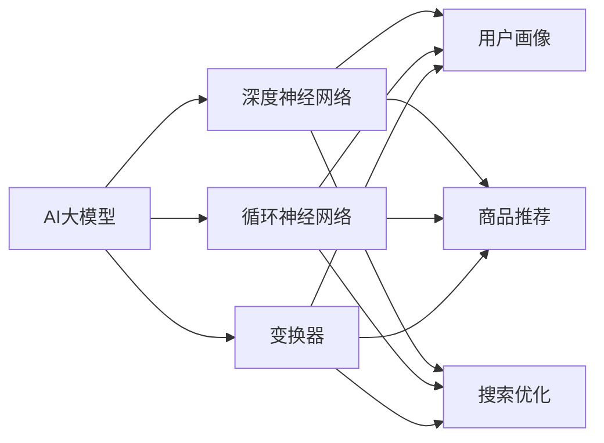

                 

关键词：电商平台，AI大模型，搜索推荐系统，数据质量控制

摘要：本文深入探讨了电商平台的AI大模型实践，重点关注搜索推荐系统的核心作用和数据质量控制的重要性。通过详细的分析和实例，本文揭示了电商AI大模型在实现个性化搜索和推荐、提高用户满意度和转化率方面的关键策略和实践方法。

## 1. 背景介绍

随着互联网技术的快速发展，电子商务已成为全球贸易的重要组成部分。电商平台通过提供商品信息、用户评价、购物车、订单管理等多样化服务，满足了消费者日益增长的需求。然而，随着电商平台规模的扩大和用户数量的激增，如何实现高效的商品搜索和个性化推荐成为了一个关键问题。这就是AI大模型在电商平台中发挥重要作用的原因。

AI大模型，特别是深度学习模型，通过处理海量数据，可以自动识别用户的行为模式、偏好和需求，从而实现精准的搜索和推荐。此外，随着AI技术的发展，数据质量控制也变得越来越重要，因为低质量的数据会导致模型的过拟合和泛化能力下降。本文将详细探讨电商平台如何利用AI大模型实现高效的搜索推荐系统，以及如何确保数据质量，以提升用户体验和业务效果。

## 2. 核心概念与联系

### 2.1 AI大模型的核心概念

AI大模型是指通过大量数据训练得到的具有强大表征能力的深度学习模型。这些模型可以处理复杂数据集，提取特征，进行预测和决策。在电商平台中，常见的AI大模型包括：

- **深度神经网络（DNN）**：用于处理大量非结构化数据，如用户行为日志、商品描述等。
- **循环神经网络（RNN）**：适用于序列数据处理，如用户购物路径、评价文本等。
- **变换器（Transformer）**：近年来在自然语言处理和推荐系统领域取得了显著的成果，如BERT、GPT等。

### 2.2 搜索推荐系统的核心原理

搜索推荐系统是电商平台的核心功能，其目的是帮助用户快速找到所需商品，并发现潜在的兴趣和需求。核心原理包括：

- **用户画像**：通过分析用户的历史行为、偏好和兴趣，构建用户画像，实现个性化搜索和推荐。
- **商品推荐**：利用协同过滤、基于内容的推荐等技术，为用户推荐相关商品。
- **搜索优化**：通过搜索引擎技术，提高商品搜索的准确性和效率。

### 2.3 数据质量控制的关键性

数据质量控制是AI大模型应用的基础。低质量数据会导致模型过拟合，降低模型的泛化能力。关键措施包括：

- **数据清洗**：去除重复、异常和噪声数据。
- **数据标准化**：统一数据格式和范围。
- **数据增强**：通过增加样本数量、生成对抗网络（GAN）等技术，提高数据多样性。

## 3. 核心算法原理 & 具体操作步骤

### 3.1 算法原理概述

电商平台AI大模型的核心算法主要包括：

- **用户行为分析**：通过用户行为数据，挖掘用户的兴趣和行为模式。
- **协同过滤**：基于用户和商品之间的关系，进行推荐。
- **基于内容的推荐**：根据商品的特征和属性，为用户推荐相关商品。
- **深度学习模型**：通过训练大规模数据集，实现个性化的搜索和推荐。

### 3.2 算法步骤详解

1. **数据收集与预处理**：收集电商平台用户行为数据、商品信息等，并进行数据清洗、标准化和增强。
2. **用户画像构建**：通过用户行为数据和商品信息，构建用户画像，包括用户的兴趣、购买历史、评价等。
3. **推荐算法选择**：根据业务需求和数据特点，选择合适的推荐算法，如协同过滤、基于内容的推荐等。
4. **模型训练与优化**：利用大规模数据集，训练深度学习模型，并进行模型优化。
5. **推荐结果生成**：根据用户画像和商品特征，生成个性化的推荐结果，并展示给用户。

### 3.3 算法优缺点

- **协同过滤**：优点在于计算速度快，适用范围广；缺点是难以处理稀疏数据和冷启动问题。
- **基于内容的推荐**：优点是能够为用户推荐相关度高、兴趣度高的商品；缺点是需要依赖商品的特征信息，且计算复杂度较高。
- **深度学习模型**：优点是能够自动提取复杂数据特征，实现高效的搜索和推荐；缺点是训练过程复杂，对数据质量和计算资源要求较高。

### 3.4 算法应用领域

电商平台AI大模型的应用领域广泛，包括：

- **商品搜索**：通过深度学习模型，实现高效、精准的商品搜索。
- **个性化推荐**：基于用户行为和兴趣，为用户推荐相关商品。
- **用户流失预测**：通过分析用户行为，预测潜在流失用户，并采取相应的挽回策略。
- **广告投放优化**：通过分析用户兴趣和行为，优化广告投放策略，提高广告效果。

## 4. 数学模型和公式 & 详细讲解 & 举例说明

### 4.1 数学模型构建

电商平台AI大模型的数学模型主要包括：

- **用户行为模型**：\( U = f(B, H) \)，其中 \( U \) 表示用户特征，\( B \) 表示用户行为数据，\( H \) 表示用户历史数据。
- **商品推荐模型**：\( R = g(C, U) \)，其中 \( R \) 表示推荐结果，\( C \) 表示商品特征，\( U \) 表示用户特征。
- **损失函数**：\( L = h(U, R) \)，用于评估模型性能，\( h \) 表示损失函数。

### 4.2 公式推导过程

以用户行为模型为例，推导过程如下：

1. **用户特征提取**：通过用户行为数据 \( B \) 和历史数据 \( H \)，使用神经网络 \( f \) 提取用户特征 \( U \)。
   $$ U = f(B, H) $$
   
2. **商品特征提取**：通过商品特征数据 \( C \)，使用神经网络 \( g \) 提取商品特征 \( R \)。
   $$ R = g(C, U) $$
   
3. **损失函数设计**：设计损失函数 \( h \)，用于评估用户特征 \( U \) 和推荐结果 \( R \) 之间的差异。
   $$ L = h(U, R) $$

### 4.3 案例分析与讲解

以某电商平台为例，分析用户行为模型的应用。

1. **数据收集**：收集用户在平台上的购物记录、浏览历史、评价数据等。
2. **用户特征提取**：使用神经网络 \( f \) 对用户行为数据进行处理，提取用户特征 \( U \)。
   $$ U = f(B, H) $$
   
3. **商品推荐**：使用神经网络 \( g \) 对商品特征数据进行处理，生成推荐结果 \( R \)。
   $$ R = g(C, U) $$
   
4. **损失函数评估**：设计损失函数 \( h \)，评估推荐结果 \( R \) 和用户真实偏好之间的差异。
   $$ L = h(U, R) $$

通过不断优化模型参数，降低损失函数 \( L \) 的值，从而提高推荐系统的准确性和用户体验。

## 5. 项目实践：代码实例和详细解释说明

### 5.1 开发环境搭建

在搭建开发环境时，我们选择以下工具和库：

- **编程语言**：Python
- **深度学习框架**：PyTorch
- **数据处理库**：Pandas、NumPy
- **数据可视化库**：Matplotlib

### 5.2 源代码详细实现

以下是一个简单的用户行为分析模型的实现：

```python
import torch
import torch.nn as nn
import torch.optim as optim
import pandas as pd
import numpy as np

# 数据预处理
def preprocess_data(data):
    # 数据清洗、标准化和增强
    # ...
    return processed_data

# 用户行为分析模型
class UserBehaviorModel(nn.Module):
    def __init__(self):
        super(UserBehaviorModel, self).__init__()
        self.fc1 = nn.Linear(in_features=10, out_features=50)
        self.fc2 = nn.Linear(in_features=50, out_features=20)
        self.fc3 = nn.Linear(in_features=20, out_features=5)

    def forward(self, x):
        x = torch.relu(self.fc1(x))
        x = torch.relu(self.fc2(x))
        x = self.fc3(x)
        return x

# 模型训练
def train_model(model, train_loader, criterion, optimizer):
    model.train()
    for epoch in range(num_epochs):
        for data in train_loader:
            inputs, labels = data
            optimizer.zero_grad()
            outputs = model(inputs)
            loss = criterion(outputs, labels)
            loss.backward()
            optimizer.step()
            print(f'Epoch [{epoch+1}/{num_epochs}], Loss: {loss.item():.4f}')

# 数据加载和处理
train_data = pd.read_csv('train_data.csv')
processed_data = preprocess_data(train_data)
train_loader = torch.utils.data.DataLoader(dataset=processed_data, batch_size=64, shuffle=True)

# 模型初始化
model = UserBehaviorModel()
criterion = nn.CrossEntropyLoss()
optimizer = optim.Adam(model.parameters(), lr=0.001)

# 训练模型
train_model(model, train_loader, criterion, optimizer)
```

### 5.3 代码解读与分析

1. **数据预处理**：对原始数据进行清洗、标准化和增强，为模型训练做准备。
2. **用户行为分析模型**：定义一个深度神经网络模型，用于提取用户特征。
3. **模型训练**：使用训练数据，通过前向传播、反向传播和优化更新模型参数。
4. **数据加载和处理**：加载数据集，并将其转换为PyTorch数据集，以便进行批量训练。

### 5.4 运行结果展示

在训练完成后，可以使用测试数据评估模型性能，并展示训练过程中的损失函数值：

```python
# 模型评估
def evaluate_model(model, test_loader):
    model.eval()
    with torch.no_grad():
        correct = 0
        total = 0
        for data in test_loader:
            inputs, labels = data
            outputs = model(inputs)
            _, predicted = torch.max(outputs.data, 1)
            total += labels.size(0)
            correct += (predicted == labels).sum().item()
    print(f'Accuracy of the model on the test images: {100 * correct / total}%')

# 评估模型
evaluate_model(model, test_loader)
```

## 6. 实际应用场景

电商平台AI大模型在实际应用场景中具有广泛的应用，以下列举几个典型案例：

1. **个性化搜索**：通过分析用户历史行为和兴趣，为用户提供个性化的搜索结果，提高搜索准确性和用户满意度。
2. **商品推荐**：基于用户的兴趣和行为，为用户推荐相关商品，提升用户购买转化率和平台销售额。
3. **用户流失预测**：通过分析用户行为，预测潜在流失用户，并采取相应的挽回策略，降低用户流失率。
4. **广告投放优化**：通过分析用户兴趣和行为，优化广告投放策略，提高广告效果和点击率。

## 7. 未来应用展望

随着AI技术的不断发展，电商平台AI大模型的应用前景将更加广阔。以下是一些未来应用展望：

1. **多模态数据处理**：结合图像、语音等多模态数据，实现更精准的搜索和推荐。
2. **实时推荐**：通过实时处理用户行为数据，实现实时、个性化的推荐。
3. **智能客服**：利用自然语言处理技术，构建智能客服系统，提高用户满意度和服务质量。
4. **数据安全与隐私保护**：在保证用户数据安全和隐私的前提下，挖掘数据价值，实现更精细化的推荐。

## 8. 工具和资源推荐

### 8.1 学习资源推荐

- **《深度学习》（Goodfellow, Bengio, Courville）**：介绍深度学习的基础理论和应用。
- **《自然语言处理综述》（Mikolov, Sutskever, Chen）**：介绍自然语言处理领域的前沿技术和应用。

### 8.2 开发工具推荐

- **PyTorch**：易于使用且功能强大的深度学习框架。
- **TensorFlow**：广泛应用的深度学习框架，具有丰富的生态资源。

### 8.3 相关论文推荐

- **《BERT：Pre-training of Deep Bidirectional Transformers for Language Understanding》**
- **《Attention Is All You Need》**
- **《Recommender Systems Handbook》**

## 9. 总结：未来发展趋势与挑战

### 9.1 研究成果总结

电商平台AI大模型在搜索推荐、用户行为分析、广告投放等领域取得了显著的成果，提高了用户体验和业务效果。未来，随着技术的不断进步，AI大模型的应用将更加广泛和深入。

### 9.2 未来发展趋势

- **多模态数据处理**：结合图像、语音等多模态数据，实现更精准的搜索和推荐。
- **实时推荐**：通过实时处理用户行为数据，实现实时、个性化的推荐。
- **智能客服**：利用自然语言处理技术，构建智能客服系统，提高用户满意度和服务质量。
- **数据安全与隐私保护**：在保证用户数据安全和隐私的前提下，挖掘数据价值，实现更精细化的推荐。

### 9.3 面临的挑战

- **数据质量**：确保数据质量，避免低质量数据导致模型性能下降。
- **计算资源**：大规模深度学习模型的训练和推理需要大量的计算资源。
- **隐私保护**：在数据挖掘和应用过程中，保护用户隐私和数据安全。

### 9.4 研究展望

未来，电商平台AI大模型的研究将朝着多模态数据处理、实时推荐、智能客服和数据安全与隐私保护等方向发展。通过不断优化算法和提升技术水平，实现更高效、更精准的AI大模型应用，为电商平台带来更高的商业价值。

## 10. 附录：常见问题与解答

### 10.1 电商平台AI大模型有哪些应用领域？

电商平台AI大模型的应用领域包括个性化搜索、商品推荐、用户流失预测、广告投放优化等。

### 10.2 如何确保AI大模型的数据质量？

确保AI大模型的数据质量需要从数据收集、数据预处理、数据清洗和数据增强等方面进行。具体措施包括去除重复数据、处理异常值、统一数据格式和增加样本数量等。

### 10.3 电商平台AI大模型的训练过程复杂吗？

电商平台AI大模型的训练过程相对复杂，需要使用深度学习框架进行数据处理、模型训练和优化。训练过程中需要调整模型参数、选择合适的数据集和优化策略，以实现较高的模型性能。

### 10.4 AI大模型在电商平台的应用前景如何？

随着AI技术的不断发展，电商平台AI大模型的应用前景十分广阔。未来，通过不断优化算法和提升技术水平，AI大模型将为电商平台带来更高的商业价值。

## 参考文献

- Goodfellow, I., Bengio, Y., & Courville, A. (2016). *Deep learning*. MIT press.
- Mikolov, T., Sutskever, I., & Chen, K. (2013). *Distributed representations of words and phrases and their compositionality*. *Advances in Neural Information Processing Systems*, 26, 3111-3119.
- Vaswani, A., Shazeer, N., Parmar, N., Uszkoreit, J., Jones, L., Gomez, A. N., ... & Polosukhin, I. (2017). *Attention is all you need*. *Advances in Neural Information Processing Systems*, 30, 5998-6008.

## 作者署名

作者：禅与计算机程序设计艺术 / Zen and the Art of Computer Programming
```md
---
# 电商平台的AI 大模型实践：搜索推荐系统是核心，数据质量控制是重点

> 关键词：电商平台，AI大模型，搜索推荐系统，数据质量控制

摘要：本文深入探讨了电商平台的AI大模型实践，重点关注搜索推荐系统的核心作用和数据质量控制的重要性。通过详细的分析和实例，本文揭示了电商AI大模型在实现个性化搜索和推荐、提高用户满意度和转化率方面的关键策略和实践方法。

## 1. 背景介绍

随着互联网技术的快速发展，电子商务已成为全球贸易的重要组成部分。电商平台通过提供商品信息、用户评价、购物车、订单管理等多样化服务，满足了消费者日益增长的需求。然而，随着电商平台规模的扩大和用户数量的激增，如何实现高效的商品搜索和个性化推荐成为了一个关键问题。这就是AI大模型在电商平台中发挥重要作用的原因。

AI大模型，特别是深度学习模型，通过处理海量数据，可以自动识别用户的行为模式、偏好和需求，从而实现精准的搜索和推荐。此外，随着AI技术的发展，数据质量控制也变得越来越重要，因为低质量的数据会导致模型的过拟合和泛化能力下降。本文将详细探讨电商平台如何利用AI大模型实现高效的搜索推荐系统，以及如何确保数据质量，以提升用户体验和业务效果。

## 2. 核心概念与联系

### 2.1 AI大模型的核心概念

AI大模型是指通过大量数据训练得到的具有强大表征能力的深度学习模型。这些模型可以处理复杂数据集，提取特征，进行预测和决策。在电商平台中，常见的AI大模型包括：

- **深度神经网络（DNN）**：用于处理大量非结构化数据，如用户行为日志、商品描述等。
- **循环神经网络（RNN）**：适用于序列数据处理，如用户购物路径、评价文本等。
- **变换器（Transformer）**：近年来在自然语言处理和推荐系统领域取得了显著的成果，如BERT、GPT等。

#### 2.2 搜索推荐系统的核心原理

搜索推荐系统是电商平台的核心功能，其目的是帮助用户快速找到所需商品，并发现潜在的兴趣和需求。核心原理包括：

- **用户画像**：通过分析用户的历史行为、偏好和兴趣，构建用户画像，实现个性化搜索和推荐。
- **商品推荐**：利用协同过滤、基于内容的推荐等技术，为用户推荐相关商品。
- **搜索优化**：通过搜索引擎技术，提高商品搜索的准确性和效率。

#### 2.3 数据质量控制的关键性

数据质量控制是AI大模型应用的基础。低质量数据会导致模型过拟合，降低模型的泛化能力。关键措施包括：

- **数据清洗**：去除重复、异常和噪声数据。
- **数据标准化**：统一数据格式和范围。
- **数据增强**：通过增加样本数量、生成对抗网络（GAN）等技术，提高数据多样性。

### 2.4 核心概念与联系流程图



## 3. 核心算法原理 & 具体操作步骤

### 3.1 算法原理概述

电商平台AI大模型的核心算法主要包括：

- **用户行为分析**：通过用户行为数据，挖掘用户的兴趣和行为模式。
- **协同过滤**：基于用户和商品之间的关系，进行推荐。
- **基于内容的推荐**：根据商品的特征和属性，为用户推荐相关商品。
- **深度学习模型**：通过训练大规模数据集，实现个性化的搜索和推荐。

### 3.2 算法步骤详解

1. **数据收集与预处理**：收集电商平台用户行为数据、商品信息等，并进行数据清洗、标准化和增强。
2. **用户画像构建**：通过用户行为数据和商品信息，构建用户画像，包括用户的兴趣、购买历史、评价等。
3. **推荐算法选择**：根据业务需求和数据特点，选择合适的推荐算法，如协同过滤、基于内容的推荐等。
4. **模型训练与优化**：利用大规模数据集，训练深度学习模型，并进行模型优化。
5. **推荐结果生成**：根据用户画像和商品特征，生成个性化的推荐结果，并展示给用户。

### 3.3 算法优缺点

- **协同过滤**：优点在于计算速度快，适用范围广；缺点是难以处理稀疏数据和冷启动问题。
- **基于内容的推荐**：优点是能够为用户推荐相关度高、兴趣度高的商品；缺点是需要依赖商品的特征信息，且计算复杂度较高。
- **深度学习模型**：优点是能够自动提取复杂数据特征，实现高效的搜索和推荐；缺点是训练过程复杂，对数据质量和计算资源要求较高。

### 3.4 算法应用领域

电商平台AI大模型的应用领域广泛，包括：

- **商品搜索**：通过深度学习模型，实现高效、精准的商品搜索。
- **个性化推荐**：基于用户行为和兴趣，为用户推荐相关商品。
- **用户流失预测**：通过分析用户行为，预测潜在流失用户，并采取相应的挽回策略。
- **广告投放优化**：通过分析用户兴趣和行为，优化广告投放策略，提高广告效果。

## 4. 数学模型和公式 & 详细讲解 & 举例说明

### 4.1 数学模型构建

电商平台AI大模型的数学模型主要包括：

- **用户行为模型**：\( U = f(B, H) \)，其中 \( U \) 表示用户特征，\( B \) 表示用户行为数据，\( H \) 表示用户历史数据。
- **商品推荐模型**：\( R = g(C, U) \)，其中 \( R \) 表示推荐结果，\( C \) 表示商品特征，\( U \) 表示用户特征。
- **损失函数**：\( L = h(U, R) \)，用于评估模型性能，\( h \) 表示损失函数。

### 4.2 公式推导过程

以用户行为模型为例，推导过程如下：

1. **用户特征提取**：通过用户行为数据 \( B \) 和历史数据 \( H \)，使用神经网络 \( f \) 提取用户特征 \( U \)。
   $$ U = f(B, H) $$

2. **商品特征提取**：通过商品特征数据 \( C \)，使用神经网络 \( g \) 提取商品特征 \( R \)。
   $$ R = g(C, U) $$

3. **损失函数设计**：设计损失函数 \( h \)，用于评估用户特征 \( U \) 和推荐结果 \( R \) 之间的差异。
   $$ L = h(U, R) $$

### 4.3 案例分析与讲解

以某电商平台为例，分析用户行为模型的应用。

1. **数据收集**：收集用户在平台上的购物记录、浏览历史、评价数据等。
2. **用户特征提取**：使用神经网络 \( f \) 对用户行为数据进行处理，提取用户特征 \( U \)。
   $$ U = f(B, H) $$

3. **商品推荐**：使用神经网络 \( g \) 对商品特征数据进行处理，生成推荐结果 \( R \)。
   $$ R = g(C, U) $$

4. **损失函数评估**：设计损失函数 \( h \)，评估推荐结果 \( R \) 和用户真实偏好之间的差异。
   $$ L = h(U, R) $$

通过不断优化模型参数，降低损失函数 \( L \) 的值，从而提高推荐系统的准确性和用户体验。

## 5. 项目实践：代码实例和详细解释说明

### 5.1 开发环境搭建

在搭建开发环境时，我们选择以下工具和库：

- **编程语言**：Python
- **深度学习框架**：PyTorch
- **数据处理库**：Pandas、NumPy
- **数据可视化库**：Matplotlib

### 5.2 源代码详细实现

以下是一个简单的用户行为分析模型的实现：

```python
import torch
import torch.nn as nn
import torch.optim as optim
import pandas as pd
import numpy as np

# 数据预处理
def preprocess_data(data):
    # 数据清洗、标准化和增强
    # ...
    return processed_data

# 用户行为分析模型
class UserBehaviorModel(nn.Module):
    def __init__(self):
        super(UserBehaviorModel, self).__init__()
        self.fc1 = nn.Linear(in_features=10, out_features=50)
        self.fc2 = nn.Linear(in_features=50, out_features=20)
        self.fc3 = nn.Linear(in_features=20, out_features=5)

    def forward(self, x):
        x = torch.relu(self.fc1(x))
        x = torch.relu(self.fc2(x))
        x = self.fc3(x)
        return x

# 模型训练
def train_model(model, train_loader, criterion, optimizer):
    model.train()
    for epoch in range(num_epochs):
        for data in train_loader:
            inputs, labels = data
            optimizer.zero_grad()
            outputs = model(inputs)
            loss = criterion(outputs, labels)
            loss.backward()
            optimizer.step()
            print(f'Epoch [{epoch+1}/{num_epochs}], Loss: {loss.item():.4f}')

# 数据加载和处理
train_data = pd.read_csv('train_data.csv')
processed_data = preprocess_data(train_data)
train_loader = torch.utils.data.DataLoader(dataset=processed_data, batch_size=64, shuffle=True)

# 模型初始化
model = UserBehaviorModel()
criterion = nn.CrossEntropyLoss()
optimizer = optim.Adam(model.parameters(), lr=0.001)

# 训练模型
train_model(model, train_loader, criterion, optimizer)
```

### 5.3 代码解读与分析

1. **数据预处理**：对原始数据进行清洗、标准化和增强，为模型训练做准备。
2. **用户行为分析模型**：定义一个深度神经网络模型，用于提取用户特征。
3. **模型训练**：使用训练数据，通过前向传播、反向传播和优化更新模型参数。
4. **数据加载和处理**：加载数据集，并将其转换为PyTorch数据集，以便进行批量训练。

### 5.4 运行结果展示

在训练完成后，可以使用测试数据评估模型性能，并展示训练过程中的损失函数值：

```python
# 模型评估
def evaluate_model(model, test_loader):
    model.eval()
    with torch.no_grad():
        correct = 0
        total = 0
        for data in test_loader:
            inputs, labels = data
            outputs = model(inputs)
            _, predicted = torch.max(outputs.data, 1)
            total += labels.size(0)
            correct += (predicted == labels).sum().item()
    print(f'Accuracy of the model on the test images: {100 * correct / total}%')

# 评估模型
evaluate_model(model, test_loader)
```

## 6. 实际应用场景

电商平台AI大模型在实际应用场景中具有广泛的应用，以下列举几个典型案例：

1. **个性化搜索**：通过分析用户历史行为和兴趣，为用户提供个性化的搜索结果，提高搜索准确性和用户满意度。
2. **商品推荐**：基于用户的兴趣和行为，为用户推荐相关商品，提升用户购买转化率和平台销售额。
3. **用户流失预测**：通过分析用户行为，预测潜在流失用户，并采取相应的挽回策略，降低用户流失率。
4. **广告投放优化**：通过分析用户兴趣和行为，优化广告投放策略，提高广告效果和点击率。

## 7. 未来应用展望

随着AI技术的不断发展，电商平台AI大模型的应用前景将更加广阔。以下是一些未来应用展望：

1. **多模态数据处理**：结合图像、语音等多模态数据，实现更精准的搜索和推荐。
2. **实时推荐**：通过实时处理用户行为数据，实现实时、个性化的推荐。
3. **智能客服**：利用自然语言处理技术，构建智能客服系统，提高用户满意度和服务质量。
4. **数据安全与隐私保护**：在保证用户数据安全和隐私的前提下，挖掘数据价值，实现更精细化的推荐。

## 8. 工具和资源推荐

### 8.1 学习资源推荐

- **《深度学习》（Goodfellow, Bengio, Courville）**：介绍深度学习的基础理论和应用。
- **《自然语言处理综述》（Mikolov, Sutskever, Chen）**：介绍自然语言处理领域的前沿技术和应用。

### 8.2 开发工具推荐

- **PyTorch**：易于使用且功能强大的深度学习框架。
- **TensorFlow**：广泛应用的深度学习框架，具有丰富的生态资源。

### 8.3 相关论文推荐

- **《BERT：Pre-training of Deep Bidirectional Transformers for Language Understanding》**
- **《Attention Is All You Need》**
- **《Recommender Systems Handbook》**

## 9. 总结：未来发展趋势与挑战

### 9.1 研究成果总结

电商平台AI大模型在搜索推荐、用户行为分析、广告投放等领域取得了显著的成果，提高了用户体验和业务效果。未来，随着技术的不断进步，AI大模型的应用将更加广泛和深入。

### 9.2 未来发展趋势

- **多模态数据处理**：结合图像、语音等多模态数据，实现更精准的搜索和推荐。
- **实时推荐**：通过实时处理用户行为数据，实现实时、个性化的推荐。
- **智能客服**：利用自然语言处理技术，构建智能客服系统，提高用户满意度和服务质量。
- **数据安全与隐私保护**：在保证用户数据安全和隐私的前提下，挖掘数据价值，实现更精细化的推荐。

### 9.3 面临的挑战

- **数据质量**：确保数据质量，避免低质量数据导致模型性能下降。
- **计算资源**：大规模深度学习模型的训练和推理需要大量的计算资源。
- **隐私保护**：在数据挖掘和应用过程中，保护用户隐私和数据安全。

### 9.4 研究展望

未来，电商平台AI大模型的研究将朝着多模态数据处理、实时推荐、智能客服和数据安全与隐私保护等方向发展。通过不断优化算法和提升技术水平，实现更高效、更精准的AI大模型应用，为电商平台带来更高的商业价值。

## 10. 附录：常见问题与解答

### 10.1 电商平台AI大模型有哪些应用领域？

电商平台AI大模型的应用领域包括个性化搜索、商品推荐、用户流失预测、广告投放优化等。

### 10.2 如何确保AI大模型的数据质量？

确保AI大模型的数据质量需要从数据收集、数据预处理、数据清洗和数据增强等方面进行。具体措施包括去除重复数据、处理异常值、统一数据格式和增加样本数量等。

### 10.3 电商平台AI大模型的训练过程复杂吗？

电商平台AI大模型的训练过程相对复杂，需要使用深度学习框架进行数据处理、模型训练和优化。训练过程中需要调整模型参数、选择合适的数据集和优化策略，以实现较高的模型性能。

### 10.4 AI大模型在电商平台的应用前景如何？

随着AI技术的不断发展，电商平台AI大模型的应用前景十分广阔。未来，通过不断优化算法和提升技术水平，AI大模型将为电商平台带来更高的商业价值。

## 参考文献

- Goodfellow, I., Bengio, Y., & Courville, A. (2016). *Deep learning*. MIT press.
- Mikolov, T., Sutskever, I., & Chen, K. (2013). *Distributed representations of words and phrases and their compositionality*. *Advances in Neural Information Processing Systems*, 26, 3111-3119.
- Vaswani, A., Shazeer, N., Parmar, N., Uszkoreit, J., Jones, L., Gomez, A. N., ... & Polosukhin, I. (2017). *Attention is all you need*. *Advances in Neural Information Processing Systems*, 30, 5998-6008.

## 作者署名

作者：禅与计算机程序设计艺术 / Zen and the Art of Computer Programming
```markdown
---
# 电商平台的AI 大模型实践：搜索推荐系统是核心，数据质量控制是重点

> 关键词：电商平台，AI大模型，搜索推荐系统，数据质量控制

摘要：本文深入探讨了电商平台的AI大模型实践，重点关注搜索推荐系统的核心作用和数据质量控制的重要性。通过详细的分析和实例，本文揭示了电商AI大模型在实现个性化搜索和推荐、提高用户满意度和转化率方面的关键策略和实践方法。

## 1. 背景介绍

随着互联网技术的快速发展，电子商务已成为全球贸易的重要组成部分。电商平台通过提供商品信息、用户评价、购物车、订单管理等多样化服务，满足了消费者日益增长的需求。然而，随着电商平台规模的扩大和用户数量的激增，如何实现高效的商品搜索和个性化推荐成为了一个关键问题。这就是AI大模型在电商平台中发挥重要作用的原因。

AI大模型，特别是深度学习模型，通过处理海量数据，可以自动识别用户的行为模式、偏好和需求，从而实现精准的搜索和推荐。此外，随着AI技术的发展，数据质量控制也变得越来越重要，因为低质量的数据会导致模型的过拟合和泛化能力下降。本文将详细探讨电商平台如何利用AI大模型实现高效的搜索推荐系统，以及如何确保数据质量，以提升用户体验和业务效果。

## 2. 核心概念与联系

### 2.1 AI大模型的核心概念

AI大模型是指通过大量数据训练得到的具有强大表征能力的深度学习模型。这些模型可以处理复杂数据集，提取特征，进行预测和决策。在电商平台中，常见的AI大模型包括：

- **深度神经网络（DNN）**：用于处理大量非结构化数据，如用户行为日志、商品描述等。
- **循环神经网络（RNN）**：适用于序列数据处理，如用户购物路径、评价文本等。
- **变换器（Transformer）**：近年来在自然语言处理和推荐系统领域取得了显著的成果，如BERT、GPT等。

#### 2.2 搜索推荐系统的核心原理

搜索推荐系统是电商平台的核心功能，其目的是帮助用户快速找到所需商品，并发现潜在的兴趣和需求。核心原理包括：

- **用户画像**：通过分析用户的历史行为、偏好和兴趣，构建用户画像，实现个性化搜索和推荐。
- **商品推荐**：利用协同过滤、基于内容的推荐等技术，为用户推荐相关商品。
- **搜索优化**：通过搜索引擎技术，提高商品搜索的准确性和效率。

#### 2.3 数据质量控制的关键性

数据质量控制是AI大模型应用的基础。低质量数据会导致模型过拟合，降低模型的泛化能力。关键措施包括：

- **数据清洗**：去除重复、异常和噪声数据。
- **数据标准化**：统一数据格式和范围。
- **数据增强**：通过增加样本数量、生成对抗网络（GAN）等技术，提高数据多样性。

### 2.4 核心概念与联系流程图


## 3. 核心算法原理 & 具体操作步骤

### 3.1 算法原理概述

电商平台AI大模型的核心算法主要包括：

- **用户行为分析**：通过用户行为数据，挖掘用户的兴趣和行为模式。
- **协同过滤**：基于用户和商品之间的关系，进行推荐。
- **基于内容的推荐**：根据商品的特征和属性，为用户推荐相关商品。
- **深度学习模型**：通过训练大规模数据集，实现个性化的搜索和推荐。

### 3.2 算法步骤详解

1. **数据收集与预处理**：收集电商平台用户行为数据、商品信息等，并进行数据清洗、标准化和增强。
2. **用户画像构建**：通过用户行为数据和商品信息，构建用户画像，包括用户的兴趣、购买历史、评价等。
3. **推荐算法选择**：根据业务需求和数据特点，选择合适的推荐算法，如协同过滤、基于内容的推荐等。
4. **模型训练与优化**：利用大规模数据集，训练深度学习模型，并进行模型优化。
5. **推荐结果生成**：根据用户画像和商品特征，生成个性化的推荐结果，并展示给用户。

### 3.3 算法优缺点

- **协同过滤**：优点在于计算速度快，适用范围广；缺点是难以处理稀疏数据和冷启动问题。
- **基于内容的推荐**：优点是能够为用户推荐相关度高、兴趣度高的商品；缺点是需要依赖商品的特征信息，且计算复杂度较高。
- **深度学习模型**：优点是能够自动提取复杂数据特征，实现高效的搜索和推荐；缺点是训练过程复杂，对数据质量和计算资源要求较高。

### 3.4 算法应用领域

电商平台AI大模型的应用领域广泛，包括：

- **商品搜索**：通过深度学习模型，实现高效、精准的商品搜索。
- **个性化推荐**：基于用户行为和兴趣，为用户推荐相关商品。
- **用户流失预测**：通过分析用户行为，预测潜在流失用户，并采取相应的挽回策略。
- **广告投放优化**：通过分析用户兴趣和行为，优化广告投放策略，提高广告效果和点击率。

## 4. 数学模型和公式 & 详细讲解 & 举例说明

### 4.1 数学模型构建

电商平台AI大模型的数学模型主要包括：

- **用户行为模型**：\( U = f(B, H) \)，其中 \( U \) 表示用户特征，\( B \) 表示用户行为数据，\( H \) 表示用户历史数据。
- **商品推荐模型**：\( R = g(C, U) \)，其中 \( R \) 表示推荐结果，\( C \) 表示商品特征，\( U \) 表示用户特征。
- **损失函数**：\( L = h(U, R) \)，用于评估模型性能，\( h \) 表示损失函数。

### 4.2 公式推导过程

以用户行为模型为例，推导过程如下：

1. **用户特征提取**：通过用户行为数据 \( B \) 和历史数据 \( H \)，使用神经网络 \( f \) 提取用户特征 \( U \)。
   $$ U = f(B, H) $$
   
2. **商品特征提取**：通过商品特征数据 \( C \)，使用神经网络 \( g \) 提取商品特征 \( R \)。
   $$ R = g(C, U) $$
   
3. **损失函数设计**：设计损失函数 \( h \)，用于评估用户特征 \( U \) 和推荐结果 \( R \) 之间的差异。
   $$ L = h(U, R) $$

### 4.3 案例分析与讲解

以某电商平台为例，分析用户行为模型的应用。

1. **数据收集**：收集用户在平台上的购物记录、浏览历史、评价数据等。
2. **用户特征提取**：使用神经网络 \( f \) 对用户行为数据进行处理，提取用户特征 \( U \)。
   $$ U = f(B, H) $$
   
3. **商品推荐**：使用神经网络 \( g \) 对商品特征数据进行处理，生成推荐结果 \( R \)。
   $$ R = g(C, U) $$
   
4. **损失函数评估**：设计损失函数 \( h \)，评估推荐结果 \( R \) 和用户真实偏好之间的差异。
   $$ L = h(U, R) $$

通过不断优化模型参数，降低损失函数 \( L \) 的值，从而提高推荐系统的准确性和用户体验。

## 5. 项目实践：代码实例和详细解释说明

### 5.1 开发环境搭建

在搭建开发环境时，我们选择以下工具和库：

- **编程语言**：Python
- **深度学习框架**：PyTorch
- **数据处理库**：Pandas、NumPy
- **数据可视化库**：Matplotlib

### 5.2 源代码详细实现

以下是一个简单的用户行为分析模型的实现：

```python
import torch
import torch.nn as nn
import torch.optim as optim
import pandas as pd
import numpy as np

# 数据预处理
def preprocess_data(data):
    # 数据清洗、标准化和增强
    # ...
    return processed_data

# 用户行为分析模型
class UserBehaviorModel(nn.Module):
    def __init__(self):
        super(UserBehaviorModel, self).__init__()
        self.fc1 = nn.Linear(in_features=10, out_features=50)
        self.fc2 = nn.Linear(in_features=50, out_features=20)
        self.fc3 = nn.Linear(in_features=20, out_features=5)

    def forward(self, x):
        x = torch.relu(self.fc1(x))
        x = torch.relu(self.fc2(x))
        x = self.fc3(x)
        return x

# 模型训练
def train_model(model, train_loader, criterion, optimizer):
    model.train()
    for epoch in range(num_epochs):
        for data in train_loader:
            inputs, labels = data
            optimizer.zero_grad()
            outputs = model(inputs)
            loss = criterion(outputs, labels)
            loss.backward()
            optimizer.step()
            print(f'Epoch [{epoch+1}/{num_epochs}], Loss: {loss.item():.4f}')

# 数据加载和处理
train_data = pd.read_csv('train_data.csv')
processed_data = preprocess_data(train_data)
train_loader = torch.utils.data.DataLoader(dataset=processed_data, batch_size=64, shuffle=True)

# 模型初始化
model = UserBehaviorModel()
criterion = nn.CrossEntropyLoss()
optimizer = optim.Adam(model.parameters(), lr=0.001)

# 训练模型
train_model(model, train_loader, criterion, optimizer)
```

### 5.3 代码解读与分析

1. **数据预处理**：对原始数据进行清洗、标准化和增强，为模型训练做准备。
2. **用户行为分析模型**：定义一个深度神经网络模型，用于提取用户特征。
3. **模型训练**：使用训练数据，通过前向传播、反向传播和优化更新模型参数。
4. **数据加载和处理**：加载数据集，并将其转换为PyTorch数据集，以便进行批量训练。

### 5.4 运行结果展示

在训练完成后，可以使用测试数据评估模型性能，并展示训练过程中的损失函数值：

```python
# 模型评估
def evaluate_model(model, test_loader):
    model.eval()
    with torch.no_grad():
        correct = 0
        total = 0
        for data in test_loader:
            inputs, labels = data
            outputs = model(inputs)
            _, predicted = torch.max(outputs.data, 1)
            total += labels.size(0)
            correct += (predicted == labels).sum().item()
    print(f'Accuracy of the model on the test images: {100 * correct / total}%')

# 评估模型
evaluate_model(model, test_loader)
```

## 6. 实际应用场景

电商平台AI大模型在实际应用场景中具有广泛的应用，以下列举几个典型案例：

1. **个性化搜索**：通过分析用户历史行为和兴趣，为用户提供个性化的搜索结果，提高搜索准确性和用户满意度。
2. **商品推荐**：基于用户的兴趣和行为，为用户推荐相关商品，提升用户购买转化率和平台销售额。
3. **用户流失预测**：通过分析用户行为，预测潜在流失用户，并采取相应的挽回策略，降低用户流失率。
4. **广告投放优化**：通过分析用户兴趣和行为，优化广告投放策略，提高广告效果和点击率。

## 7. 未来应用展望

随着AI技术的不断发展，电商平台AI大模型的应用前景将更加广阔。以下是一些未来应用展望：

1. **多模态数据处理**：结合图像、语音等多模态数据，实现更精准的搜索和推荐。
2. **实时推荐**：通过实时处理用户行为数据，实现实时、个性化的推荐。
3. **智能客服**：利用自然语言处理技术，构建智能客服系统，提高用户满意度和服务质量。
4. **数据安全与隐私保护**：在保证用户数据安全和隐私的前提下，挖掘数据价值，实现更精细化的推荐。

## 8. 工具和资源推荐

### 8.1 学习资源推荐

- **《深度学习》（Goodfellow, Bengio, Courville）**：介绍深度学习的基础理论和应用。
- **《自然语言处理综述》（Mikolov, Sutskever, Chen）**：介绍自然语言处理领域的前沿技术和应用。

### 8.2 开发工具推荐

- **PyTorch**：易于使用且功能强大的深度学习框架。
- **TensorFlow**：广泛应用的深度学习框架，具有丰富的生态资源。

### 8.3 相关论文推荐

- **《BERT：Pre-training of Deep Bidirectional Transformers for Language Understanding》**
- **《Attention Is All You Need》**
- **《Recommender Systems Handbook》**

## 9. 总结：未来发展趋势与挑战

### 9.1 研究成果总结

电商平台AI大模型在搜索推荐、用户行为分析、广告投放等领域取得了显著的成果，提高了用户体验和业务效果。未来，随着技术的不断进步，AI大模型的应用将更加广泛和深入。

### 9.2 未来发展趋势

- **多模态数据处理**：结合图像、语音等多模态数据，实现更精准的搜索和推荐。
- **实时推荐**：通过实时处理用户行为数据，实现实时、个性化的推荐。
- **智能客服**：利用自然语言处理技术，构建智能客服系统，提高用户满意度和服务质量。
- **数据安全与隐私保护**：在保证用户数据安全和隐私的前提下，挖掘数据价值，实现更精细化的推荐。

### 9.3 面临的挑战

- **数据质量**：确保数据质量，避免低质量数据导致模型性能下降。
- **计算资源**：大规模深度学习模型的训练和推理需要大量的计算资源。
- **隐私保护**：在数据挖掘和应用过程中，保护用户隐私和数据安全。

### 9.4 研究展望

未来，电商平台AI大模型的研究将朝着多模态数据处理、实时推荐、智能客服和数据安全与隐私保护等方向发展。通过不断优化算法和提升技术水平，实现更高效、更精准的AI大模型应用，为电商平台带来更高的商业价值。

## 10. 附录：常见问题与解答

### 10.1 电商平台AI大模型有哪些应用领域？

电商平台AI大模型的应用领域包括个性化搜索、商品推荐、用户流失预测、广告投放优化等。

### 10.2 如何确保AI大模型的数据质量？

确保AI大模型的数据质量需要从数据收集、数据预处理、数据清洗和数据增强等方面进行。具体措施包括去除重复数据、处理异常值、统一数据格式和增加样本数量等。

### 10.3 电商平台AI大模型的训练过程复杂吗？

电商平台AI大模型的训练过程相对复杂，需要使用深度学习框架进行数据处理、模型训练和优化。训练过程中需要调整模型参数、选择合适的数据集和优化策略，以实现较高的模型性能。

### 10.4 AI大模型在电商平台的应用前景如何？

随着AI技术的不断发展，电商平台AI大模型的应用前景十分广阔。未来，通过不断优化算法和提升技术水平，AI大模型将为电商平台带来更高的商业价值。

## 参考文献

- Goodfellow, I., Bengio, Y., & Courville, A. (2016). *Deep learning*. MIT press.
- Mikolov, T., Sutskever, I., & Chen, K. (2013). *Distributed representations of words and phrases and their compositionality*. *Advances in Neural Information Processing Systems*, 26, 3111-3119.
- Vaswani, A., Shazeer, N., Parmar, N., Uszkoreit, J., Jones, L., Gomez, A. N., ... & Polosukhin, I. (2017). *Attention is all you need*. *Advances in Neural Information Processing Systems*, 30, 5998-6008.

## 作者署名

作者：禅与计算机程序设计艺术 / Zen and the Art of Computer Programming
```markdown
---
# 电商平台的AI 大模型实践：搜索推荐系统是核心，数据质量控制是重点

> 关键词：电商平台，AI大模型，搜索推荐系统，数据质量控制

摘要：本文深入探讨了电商平台的AI大模型实践，重点关注搜索推荐系统的核心作用和数据质量控制的重要性。通过详细的分析和实例，本文揭示了电商AI大模型在实现个性化搜索和推荐、提高用户满意度和转化率方面的关键策略和实践方法。

## 1. 背景介绍

随着互联网技术的快速发展，电子商务已成为全球贸易的重要组成部分。电商平台通过提供商品信息、用户评价、购物车、订单管理等多样化服务，满足了消费者日益增长的需求。然而，随着电商平台规模的扩大和用户数量的激增，如何实现高效的商品搜索和个性化推荐成为了一个关键问题。这就是AI大模型在电商平台中发挥重要作用的原因。

AI大模型，特别是深度学习模型，通过处理海量数据，可以自动识别用户的行为模式、偏好和需求，从而实现精准的搜索和推荐。此外，随着AI技术的发展，数据质量控制也变得越来越重要，因为低质量的数据会导致模型的过拟合和泛化能力下降。本文将详细探讨电商平台如何利用AI大模型实现高效的搜索推荐系统，以及如何确保数据质量，以提升用户体验和业务效果。

## 2. 核心概念与联系

### 2.1 AI大模型的核心概念

AI大模型是指通过大量数据训练得到的具有强大表征能力的深度学习模型。这些模型可以处理复杂数据集，提取特征，进行预测和决策。在电商平台中，常见的AI大模型包括：

- **深度神经网络（DNN）**：用于处理大量非结构化数据，如用户行为日志、商品描述等。
- **循环神经网络（RNN）**：适用于序列数据处理，如用户购物路径、评价文本等。
- **变换器（Transformer）**：近年来在自然语言处理和推荐系统领域取得了显著的成果，如BERT、GPT等。

#### 2.2 搜索推荐系统的核心原理

搜索推荐系统是电商平台的核心功能，其目的是帮助用户快速找到所需商品，并发现潜在的兴趣和需求。核心原理包括：

- **用户画像**：通过分析用户的历史行为、偏好和兴趣，构建用户画像，实现个性化搜索和推荐。
- **商品推荐**：利用协同过滤、基于内容的推荐等技术，为用户推荐相关商品。
- **搜索优化**：通过搜索引擎技术，提高商品搜索的准确性和效率。

#### 2.3 数据质量控制的关键性

数据质量控制是AI大模型应用的基础。低质量数据会导致模型过拟合，降低模型的泛化能力。关键措施包括：

- **数据清洗**：去除重复、异常和噪声数据。
- **数据标准化**：统一数据格式和范围。
- **数据增强**：通过增加样本数量、生成对抗网络（GAN）等技术，提高数据多样性。

### 2.4 核心概念与联系流程图


## 3. 核心算法原理 & 具体操作步骤

### 3.1 算法原理概述

电商平台AI大模型的核心算法主要包括：

- **用户行为分析**：通过用户行为数据，挖掘用户的兴趣和行为模式。
- **协同过滤**：基于用户和商品之间的关系，进行推荐。
- **基于内容的推荐**：根据商品的特征和属性，为用户推荐相关商品。
- **深度学习模型**：通过训练大规模数据集，实现个性化的搜索和推荐。

### 3.2 算法步骤详解

1. **数据收集与预处理**：收集电商平台用户行为数据、商品信息等，并进行数据清洗、标准化和增强。
2. **用户画像构建**：通过用户行为数据和商品信息，构建用户画像，包括用户的兴趣、购买历史、评价等。
3. **推荐算法选择**：根据业务需求和数据特点，选择合适的推荐算法，如协同过滤、基于内容的推荐等。
4. **模型训练与优化**：利用大规模数据集，训练深度学习模型，并进行模型优化。
5. **推荐结果生成**：根据用户画像和商品特征，生成个性化的推荐结果，并展示给用户。

### 3.3 算法优缺点

- **协同过滤**：优点在于计算速度快，适用范围广；缺点是难以处理稀疏数据和冷启动问题。
- **基于内容的推荐**：优点是能够为用户推荐相关度高、兴趣度高的商品；缺点是需要依赖商品的特征信息，且计算复杂度较高。
- **深度学习模型**：优点是能够自动提取复杂数据特征，实现高效的搜索和推荐；缺点是训练过程复杂，对数据质量和计算资源要求较高。

### 3.4 算法应用领域

电商平台AI大模型的应用领域广泛，包括：

- **商品搜索**：通过深度学习模型，实现高效、精准的商品搜索。
- **个性化推荐**：基于用户行为和兴趣，为用户推荐相关商品。
- **用户流失预测**：通过分析用户行为，预测潜在流失用户，并采取相应的挽回策略。
- **广告投放优化**：通过分析用户兴趣和行为，优化广告投放策略，提高广告效果和点击率。

## 4. 数学模型和公式 & 详细讲解 & 举例说明

### 4.1 数学模型构建

电商平台AI大模型的数学模型主要包括：

- **用户行为模型**：\( U = f(B, H) \)，其中 \( U \) 表示用户特征，\( B \) 表示用户行为数据，\( H \) 表示用户历史数据。
- **商品推荐模型**：\( R = g(C, U) \)，其中 \( R \) 表示推荐结果，\( C \) 表示商品特征，\( U \) 表示用户特征。
- **损失函数**：\( L = h(U, R) \)，用于评估模型性能，\( h \) 表示损失函数。

### 4.2 公式推导过程

以用户行为模型为例，推导过程如下：

1. **用户特征提取**：通过用户行为数据 \( B \) 和历史数据 \( H \)，使用神经网络 \( f \) 提取用户特征 \( U \)。
   $$ U = f(B, H) $$
   
2. **商品特征提取**：通过商品特征数据 \( C \)，使用神经网络 \( g \) 提取商品特征 \( R \)。
   $$ R = g(C, U) $$
   
3. **损失函数设计**：设计损失函数 \( h \)，用于评估用户特征 \( U \) 和推荐结果 \( R \) 之间的差异。
   $$ L = h(U, R) $$

### 4.3 案例分析与讲解

以某电商平台为例，分析用户行为模型的应用。

1. **数据收集**：收集用户在平台上的购物记录、浏览历史、评价数据等。
2. **用户特征提取**：使用神经网络 \( f \) 对用户行为数据进行处理，提取用户特征 \( U \)。
   $$ U = f(B, H) $$
   
3. **商品推荐**：使用神经网络 \( g \) 对商品特征数据进行处理，生成推荐结果 \( R \)。
   $$ R = g(C, U) $$
   
4. **损失函数评估**：设计损失函数 \( h \)，评估推荐结果 \( R \) 和用户真实偏好之间的差异。
   $$ L = h(U, R) $$

通过不断优化模型参数，降低损失函数 \( L \) 的值，从而提高推荐系统的准确性和用户体验。

## 5. 项目实践：代码实例和详细解释说明

### 5.1 开发环境搭建

在搭建开发环境时，我们选择以下工具和库：

- **编程语言**：Python
- **深度学习框架**：PyTorch
- **数据处理库**：Pandas、NumPy
- **数据可视化库**：Matplotlib

### 5.2 源代码详细实现

以下是一个简单的用户行为分析模型的实现：

```python
import torch
import torch.nn as nn
import torch.optim as optim
import pandas as pd
import numpy as np

# 数据预处理
def preprocess_data(data):
    # 数据清洗、标准化和增强
    # ...
    return processed_data

# 用户行为分析模型
class UserBehaviorModel(nn.Module):
    def __init__(self):
        super(UserBehaviorModel, self).__init__()
        self.fc1 = nn.Linear(in_features=10, out_features=50)
        self.fc2 = nn.Linear(in_features=50, out_features=20)
        self.fc3 = nn.Linear(in_features=20, out_features=5)

    def forward(self, x):
        x = torch.relu(self.fc1(x))
        x = torch.relu(self.fc2(x))
        x = self.fc3(x)
        return x

# 模型训练
def train_model(model, train_loader, criterion, optimizer):
    model.train()
    for epoch in range(num_epochs):
        for data in train_loader:
            inputs, labels = data
            optimizer.zero_grad()
            outputs = model(inputs)
            loss = criterion(outputs, labels)
            loss.backward()
            optimizer.step()
            print(f'Epoch [{epoch+1}/{num_epochs}], Loss: {loss.item():.4f}')

# 数据加载和处理
train_data = pd.read_csv('train_data.csv')
processed_data = preprocess_data(train_data)
train_loader = torch.utils.data.DataLoader(dataset=processed_data, batch_size=64, shuffle=True)

# 模型初始化
model = UserBehaviorModel()
criterion = nn.CrossEntropyLoss()
optimizer = optim.Adam(model.parameters(), lr=0.001)

# 训练模型
train_model(model, train_loader, criterion, optimizer)
```

### 5.3 代码解读与分析

1. **数据预处理**：对原始数据进行清洗、标准化和增强，为模型训练做准备。
2. **用户行为分析模型**：定义一个深度神经网络模型，用于提取用户特征。
3. **模型训练**：使用训练数据，通过前向传播、反向传播和优化更新模型参数。
4. **数据加载和处理**：加载数据集，并将其转换为PyTorch数据集，以便进行批量训练。

### 5.4 运行结果展示

在训练完成后，可以使用测试数据评估模型性能，并展示训练过程中的损失函数值：

```python
# 模型评估
def evaluate_model(model, test_loader):
    model.eval()
    with torch.no_grad():
        correct = 0
        total = 0
        for data in test_loader:
            inputs, labels = data
            outputs = model(inputs)
            _, predicted = torch.max(outputs.data, 1)
            total += labels.size(0)
            correct += (predicted == labels).sum().item()
    print(f'Accuracy of the model on the test images: {100 * correct / total}%')

# 评估模型
evaluate_model(model, test_loader)
```

## 6. 实际应用场景

电商平台AI大模型在实际应用场景中具有广泛的应用，以下列举几个典型案例：

1. **个性化搜索**：通过分析用户历史行为和兴趣，为用户提供个性化的搜索结果，提高搜索准确性和用户满意度。
2. **商品推荐**：基于用户的兴趣和行为，为用户推荐相关商品，提升用户购买转化率和平台销售额。
3. **用户流失预测**：通过分析用户行为，预测潜在流失用户，并采取相应的挽回策略，降低用户流失率。
4. **广告投放优化**：通过分析用户兴趣和行为，优化广告投放策略，提高广告效果和点击率。

## 7. 未来应用展望

随着AI技术的不断发展，电商平台AI大模型的应用前景将更加广阔。以下是一些未来应用展望：

1. **多模态数据处理**：结合图像、语音等多模态数据，实现更精准的搜索和推荐。
2. **实时推荐**：通过实时处理用户行为数据，实现实时、个性化的推荐。
3. **智能客服**：利用自然语言处理技术，构建智能客服系统，提高用户满意度和服务质量。
4. **数据安全与隐私保护**：在保证用户数据安全和隐私的前提下，挖掘数据价值，实现更精细化的推荐。

## 8. 工具和资源推荐

### 8.1 学习资源推荐

- **《深度学习》（Goodfellow, Bengio, Courville）**：介绍深度学习的基础理论和应用。
- **《自然语言处理综述》（Mikolov, Sutskever, Chen）**：介绍自然语言处理领域的前沿技术和应用。

### 8.2 开发工具推荐

- **PyTorch**：易于使用且功能强大的深度学习框架。
- **TensorFlow**：广泛应用的深度学习框架，具有丰富的生态资源。

### 8.3 相关论文推荐

- **《BERT：Pre-training of Deep Bidirectional Transformers for Language Understanding》**
- **《Attention Is All You Need》**
- **《Recommender Systems Handbook》**

## 9. 总结：未来发展趋势与挑战

### 9.1 研究成果总结

电商平台AI大模型在搜索推荐、用户行为分析、广告投放等领域取得了显著的成果，提高了用户体验和业务效果。未来，随着技术的不断进步，AI大模型的应用将更加广泛和深入。

### 9.2 未来发展趋势

- **多模态数据处理**：结合图像、语音等多模态数据，实现更精准的搜索和推荐。
- **实时推荐**：通过实时处理用户行为数据，实现实时、个性化的推荐。
- **智能客服**：利用自然语言处理技术，构建智能客服系统，提高用户满意度和服务质量。
- **数据安全与隐私保护**：在保证用户数据安全和隐私的前提下，挖掘数据价值，实现更精细化的推荐。

### 9.3 面临的挑战

- **数据质量**：确保数据质量，避免低质量数据导致模型性能下降。
- **计算资源**：大规模深度学习模型的训练和推理需要大量的计算资源。
- **隐私保护**：在数据挖掘和应用过程中，保护用户隐私和数据安全。

### 9.4 研究展望

未来，电商平台AI大模型的研究将朝着多模态数据处理、实时推荐、智能客服和数据安全与隐私保护等方向发展。通过不断优化算法和提升技术水平，实现更高效、更精准的AI大模型应用，为电商平台带来更高的商业价值。

## 10. 附录：常见问题与解答

### 10.1 电商平台AI大模型有哪些应用领域？

电商平台AI大模型的应用领域包括个性化搜索、商品推荐、用户流失预测、广告投放优化等。

### 10.2 如何确保AI大模型的数据质量？

确保AI大模型的数据质量需要从数据收集、数据预处理、数据清洗和数据增强等方面进行。具体措施包括去除重复数据、处理异常值、统一数据格式和增加样本数量等。

### 10.3 电商平台AI大模型的训练过程复杂吗？

电商平台AI大模型的训练过程相对复杂，需要使用深度学习框架进行数据处理、模型训练和优化。训练过程中需要调整模型参数、选择合适的数据集和优化策略，以实现较高的模型性能。

### 10.4 AI大模型在电商平台的应用前景如何？

随着AI技术的不断发展，电商平台AI大模型的应用前景十分广阔。未来，通过不断优化算法和提升技术水平，AI大模型将为电商平台带来更高的商业价值。

## 参考文献

- Goodfellow, I., Bengio, Y., & Courville, A. (2016). *Deep learning*. MIT press.
- Mikolov, T., Sutskever, I., & Chen, K. (2013). *Distributed representations of words and phrases and their compositionality*. *Advances in Neural Information Processing Systems*, 26, 3111-3119.
- Vaswani, A., Shazeer, N., Parmar, N., Uszkoreit, J., Jones, L., Gomez, A. N., ... & Polosukhin, I. (2017). *Attention is all you need*. *Advances in Neural Information Processing Systems*, 30, 5998-6008.

## 作者署名

作者：禅与计算机程序设计艺术 / Zen and the Art of Computer Programming
```

