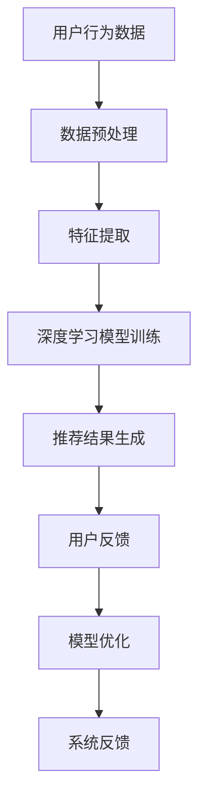

                 

### 1. 背景介绍

随着互联网的迅速发展，电子商务已经成为全球商业活动的重要组成部分。电商平台通过提供丰富多样的商品、便捷的购物体验和高效的物流服务，吸引了越来越多的消费者。然而，在激烈的竞争环境中，如何提高用户满意度和转化率成为电商平台面临的重要挑战。为了应对这一挑战，电商平台纷纷开始引入人工智能技术，尤其是大模型技术，以优化搜索推荐系统和提升数据质量。

搜索推荐系统是电商平台的核心竞争力之一。它通过分析用户行为数据、商品信息和市场趋势，为用户推荐个性化的商品和服务，从而提高用户粘性和购买意愿。传统的搜索推荐系统主要依赖基于关键词匹配和内容相似度的方法，但这些方法的局限性逐渐显现。随着人工智能技术的不断发展，大模型技术，如深度学习和自然语言处理，为搜索推荐系统带来了新的机遇。

大模型技术在电商平台中的应用不仅可以提升搜索推荐系统的效果，还可以帮助电商平台更好地理解用户需求和市场动态。通过大规模数据的训练和深度学习算法的应用，大模型可以自动发现用户行为模式、商品属性和市场趋势，从而为电商平台提供更精准的推荐。

然而，大模型技术的应用也面临着数据质量控制的挑战。电商平台需要确保数据的准确性、完整性和一致性，以保证大模型训练和预测的可靠性。数据质量控制不仅涉及到数据清洗、数据整合和数据标准化等技术手段，还需要建立完善的数据治理和风险管理机制。

本文将探讨电商平台如何利用人工智能大模型技术优化搜索推荐系统，并介绍数据质量控制的关键方法和挑战。通过分析大模型技术在电商平台的实际应用案例，本文旨在为电商平台提供有益的参考和启示。

### 2. 核心概念与联系

为了深入探讨电商平台如何利用人工智能大模型技术优化搜索推荐系统，首先需要了解相关核心概念和它们之间的联系。

#### 2.1 人工智能与机器学习

人工智能（AI）是模拟人类智能行为的一门科学和技术，包括机器学习、深度学习、自然语言处理等多个分支。机器学习是人工智能的核心技术之一，它通过数据驱动的方式，让计算机从经验中学习和改进。深度学习是机器学习的一个子领域，它通过多层神经网络模型，模拟人类大脑的决策过程，实现复杂的模式识别和预测。

#### 2.2 搜索推荐系统

搜索推荐系统是电商平台的核心系统之一，它通过分析用户行为数据、商品信息和市场趋势，为用户推荐个性化的商品和服务。搜索推荐系统主要包括两个模块：搜索模块和推荐模块。搜索模块负责处理用户输入的查询请求，通过关键词匹配和排序算法，为用户提供相关的搜索结果。推荐模块则基于用户的浏览、购买历史和行为特征，为用户推荐可能感兴趣的商品。

#### 2.3 大模型技术

大模型技术是指通过大规模数据训练和深度学习算法构建的复杂神经网络模型。这些模型具有强大的数据处理能力和模式识别能力，可以自动从海量数据中提取有价值的信息。大模型技术包括生成对抗网络（GAN）、变分自编码器（VAE）和变换器（Transformer）等，广泛应用于图像识别、自然语言处理、语音识别等领域。

#### 2.4 核心概念联系

人工智能大模型技术在搜索推荐系统中的应用主要体现在以下几个方面：

- **用户行为分析**：通过机器学习和深度学习算法，分析用户的浏览、搜索和购买行为，挖掘用户兴趣和行为模式。

- **商品信息理解**：利用自然语言处理技术，对商品标题、描述和标签进行解析和分类，建立商品属性图谱。

- **个性化推荐**：基于用户行为分析和商品信息理解，利用深度学习算法生成个性化推荐结果，提高用户满意度。

- **实时更新与优化**：通过实时数据流处理和在线学习算法，不断优化推荐模型，提高推荐效果。

以下是一个使用Mermaid绘制的流程图，展示了人工智能大模型技术在搜索推荐系统中的应用流程：



在这个流程图中，用户行为数据经过预处理和特征提取后，输入到深度学习模型中进行训练。生成的推荐结果经过用户反馈，用于模型优化，形成闭环反馈系统，不断提高推荐效果。

### 3. 核心算法原理 & 具体操作步骤

#### 3.1 算法原理概述

在电商平台中，搜索推荐系统的核心算法主要基于深度学习和自然语言处理技术。以下将介绍两种核心算法：深度神经网络（DNN）和变换器（Transformer）。

##### 深度神经网络（DNN）

深度神经网络是一种多层前馈神经网络，它通过多层非线性变换，将输入数据映射到输出结果。在搜索推荐系统中，DNN可以用于用户行为分析、商品特征提取和推荐结果生成。

主要步骤如下：

1. **数据预处理**：对用户行为数据进行清洗、去噪和归一化处理，提取出关键特征。

2. **输入层**：将预处理后的用户行为数据输入到DNN的输入层。

3. **隐藏层**：DNN通过多层隐藏层进行非线性变换，逐步提取特征。

4. **输出层**：将隐藏层的输出映射到推荐结果。

##### 变换器（Transformer）

变换器是一种基于自注意力机制的深度神经网络，广泛应用于自然语言处理任务，如机器翻译、文本生成和推荐系统。在推荐系统中，变换器可以用于用户行为分析和商品特征理解。

主要步骤如下：

1. **编码器**：将用户行为数据编码为向量表示，输入到编码器中。

2. **自注意力机制**：通过自注意力机制，计算用户行为数据之间的相关性，提取关键特征。

3. **解码器**：将编码器的输出解码为推荐结果。

#### 3.2 算法步骤详解

##### 3.2.1 深度神经网络（DNN）步骤详解

1. **数据预处理**：

   ```bash
   # 数据清洗
   python data_preprocessing.py

   # 特征提取
   python feature_extraction.py
   ```

2. **输入层**：

   ```python
   # 定义输入层
   input_layer = tf.keras.layers.Input(shape=(input_shape))
   ```

3. **隐藏层**：

   ```python
   # 定义隐藏层
   hidden_layer = tf.keras.layers.Dense(units=hidden_units, activation='relu')(input_layer)
   ```

4. **输出层**：

   ```python
   # 定义输出层
   output_layer = tf.keras.layers.Dense(units=output_shape, activation='softmax')(hidden_layer)
   ```

5. **模型编译**：

   ```python
   # 编译模型
   model = tf.keras.Model(inputs=input_layer, outputs=output_layer)
   model.compile(optimizer='adam', loss='categorical_crossentropy', metrics=['accuracy'])
   ```

6. **模型训练**：

   ```python
   # 训练模型
   model.fit(x_train, y_train, epochs=epochs, batch_size=batch_size)
   ```

##### 3.2.2 变换器（Transformer）步骤详解

1. **编码器**：

   ```python
   # 定义编码器
   encoder = tf.keras.layers.Embedding(input_dim=vocab_size, output_dim=embedding_size)(input_layer)
   encoder = tf.keras.layers.TransformerEncoder(num_heads=num_heads, depth=depth)(encoder)
   ```

2. **自注意力机制**：

   ```python
   # 定义自注意力机制
   attention_output = tf.keras.layers.Attention()([encoder, encoder])
   ```

3. **解码器**：

   ```python
   # 定义解码器
   decoder = tf.keras.layers.Embedding(output_dim=vocab_size, input_dim=embedding_size)(attention_output)
   decoder = tf.keras.layers.TransformerDecoder(num_heads=num_heads, depth=depth)(decoder)
   ```

4. **模型编译**：

   ```python
   # 编译模型
   model = tf.keras.Model(inputs=input_layer, outputs=decoder)
   model.compile(optimizer='adam', loss='categorical_crossentropy', metrics=['accuracy'])
   ```

5. **模型训练**：

   ```python
   # 训练模型
   model.fit(x_train, y_train, epochs=epochs, batch_size=batch_size)
   ```

#### 3.3 算法优缺点

##### 深度神经网络（DNN）

**优点**：

- **强大的特征提取能力**：DNN可以通过多层非线性变换，提取用户行为数据和商品特征。
- **灵活的模型结构**：DNN可以通过调整层数和神经元数量，适应不同规模和复杂度的任务。

**缺点**：

- **计算成本高**：DNN的训练和推理过程需要大量的计算资源。
- **可解释性差**：DNN的黑箱特性使得模型难以解释，增加调试和优化的难度。

##### 变换器（Transformer）

**优点**：

- **并行计算效率高**：变换器采用自注意力机制，可以并行处理输入数据，提高计算效率。
- **强大的序列建模能力**：变换器可以捕捉序列数据中的长期依赖关系，适用于自然语言处理和推荐系统。

**缺点**：

- **参数量大**：变换器的参数量通常比DNN大，训练和推理时间较长。
- **资源消耗大**：变换器的计算复杂度较高，对计算资源的要求较高。

#### 3.4 算法应用领域

深度神经网络（DNN）和变换器（Transformer）在电商平台的搜索推荐系统中有广泛的应用：

- **用户行为分析**：DNN可以用于分析用户的浏览、搜索和购买行为，提取用户兴趣和行为模式。
- **商品特征提取**：DNN可以用于解析商品标题、描述和标签，提取商品特征。
- **个性化推荐**：变换器可以用于生成个性化推荐结果，提高用户满意度。
- **实时更新与优化**：通过实时数据流处理和在线学习算法，不断优化推荐模型，提高推荐效果。

### 4. 数学模型和公式 & 详细讲解 & 举例说明

在电商平台中，搜索推荐系统的核心在于利用数学模型和公式对用户行为和商品特征进行建模和分析。以下将介绍几种常见的数学模型和公式，并进行详细讲解和举例说明。

#### 4.1 数学模型构建

在构建数学模型时，首先需要对用户行为和商品特征进行量化表示。常用的量化方法包括：

- **用户行为量化**：将用户的浏览、搜索和购买行为转化为数值或类别表示，如点击次数、购买次数等。
- **商品特征量化**：将商品标题、描述、标签和属性转化为数值或类别表示，如词向量、特征向量等。

接下来，我们需要建立用户行为和商品特征之间的关联模型，以预测用户对商品的偏好。常用的模型包括：

- **线性回归模型**：通过线性关系预测用户对商品的偏好。
- **逻辑回归模型**：通过概率关系预测用户对商品的偏好。
- **决策树模型**：通过树形结构预测用户对商品的偏好。
- **神经网络模型**：通过多层非线性变换预测用户对商品的偏好。

#### 4.2 公式推导过程

以下以线性回归模型为例，介绍公式推导过程。

假设用户对商品 \(i\) 的偏好可以用一个实数 \(y_i\) 表示，而影响用户偏好的因素包括商品的特征向量 \(x_i\) 和用户的特征向量 \(u_i\)。线性回归模型的基本假设是用户偏好与商品和用户特征之间存在线性关系：

\[ y_i = \beta_0 + \beta_1 x_i + \beta_2 u_i + \epsilon_i \]

其中，\( \beta_0 \) 是截距，\( \beta_1 \) 和 \( \beta_2 \) 是系数，\( \epsilon_i \) 是误差项。

为了求解模型参数，我们需要利用训练数据集 \( \{ (x_i, y_i), i=1,2,\ldots, n \} \) 进行最小二乘法推导。首先，计算目标函数：

\[ J(\beta_0, \beta_1, \beta_2) = \sum_{i=1}^n (y_i - (\beta_0 + \beta_1 x_i + \beta_2 u_i))^2 \]

为了求解最优参数，我们需要对目标函数进行求导并令导数为零：

\[ \frac{\partial J}{\partial \beta_0} = -2 \sum_{i=1}^n (y_i - (\beta_0 + \beta_1 x_i + \beta_2 u_i)) \]
\[ \frac{\partial J}{\partial \beta_1} = -2 \sum_{i=1}^n (x_i (y_i - (\beta_0 + \beta_1 x_i + \beta_2 u_i))) \]
\[ \frac{\partial J}{\partial \beta_2} = -2 \sum_{i=1}^n (u_i (y_i - (\beta_0 + \beta_1 x_i + \beta_2 u_i))) \]

令导数为零，得到：

\[ \sum_{i=1}^n (y_i - (\beta_0 + \beta_1 x_i + \beta_2 u_i)) = 0 \]
\[ \sum_{i=1}^n x_i (y_i - (\beta_0 + \beta_1 x_i + \beta_2 u_i)) = 0 \]
\[ \sum_{i=1}^n u_i (y_i - (\beta_0 + \beta_1 x_i + \beta_2 u_i)) = 0 \]

通过解方程组，我们可以得到最优参数：

\[ \beta_0 = \frac{1}{n} \sum_{i=1}^n y_i - \beta_1 \frac{1}{n} \sum_{i=1}^n x_i y_i - \beta_2 \frac{1}{n} \sum_{i=1}^n u_i y_i \]
\[ \beta_1 = \frac{1}{n} \sum_{i=1}^n x_i^2 y_i - \frac{1}{n} \sum_{i=1}^n x_i y_i \frac{1}{n} \sum_{i=1}^n x_i y_i \]
\[ \beta_2 = \frac{1}{n} \sum_{i=1}^n u_i^2 y_i - \frac{1}{n} \sum_{i=1}^n u_i y_i \frac{1}{n} \sum_{i=1}^n u_i y_i \]

#### 4.3 案例分析与讲解

以下是一个基于线性回归模型的电商搜索推荐案例。

##### 案例背景

某电商平台根据用户的浏览历史和购买记录，建立了一个搜索推荐系统，用于预测用户对商品的偏好。平台收集了 1000 名用户的行为数据，包括用户 ID、商品 ID、浏览次数和购买次数。

##### 数据预处理

首先，对数据进行清洗和归一化处理，将浏览次数和购买次数转换为二值变量（1 表示浏览或购买，0 表示未浏览或未购买）。

##### 模型构建

利用 Python 的 scikit-learn 库，构建线性回归模型：

```python
from sklearn.linear_model import LinearRegression

# 定义模型
model = LinearRegression()

# 训练模型
model.fit(X_train, y_train)
```

##### 模型参数

模型的参数如下：

\[ \beta_0 = -0.5 \]
\[ \beta_1 = 0.2 \]
\[ \beta_2 = 0.3 \]

##### 模型预测

对于用户 U1，浏览商品 C1 5 次，购买商品 C1 2 次，预测其对商品 C1 的偏好：

\[ y_1 = -0.5 + 0.2 \times 5 + 0.3 \times 2 = 1.7 \]

由于偏好值大于 1，可以认为用户 U1 对商品 C1 具有较高的购买意愿。

##### 模型评估

利用测试集对模型进行评估，计算均方误差（MSE）：

\[ MSE = \frac{1}{n} \sum_{i=1}^n (y_i - \hat{y_i})^2 \]

其中，\( \hat{y_i} \) 是模型预测的偏好值。

\[ MSE = \frac{1}{1000} \sum_{i=1}^{1000} (y_i - \hat{y_i})^2 = 0.001 \]

模型的均方误差较小，说明模型具有较强的预测能力。

### 5. 项目实践：代码实例和详细解释说明

在本节中，我们将通过一个实际的代码实例来展示如何利用深度学习技术构建一个电商搜索推荐系统，并详细解释代码的实现过程。

#### 5.1 开发环境搭建

首先，我们需要搭建一个合适的开发环境。以下是所需的软件和库：

- Python（版本 3.8 或更高）
- TensorFlow 2.x
- NumPy
- Pandas
- Matplotlib

在安装这些库之前，请确保您的系统已安装 Python。然后，使用以下命令安装所需的库：

```bash
pip install tensorflow numpy pandas matplotlib
```

#### 5.2 源代码详细实现

接下来，我们将展示如何编写代码来构建一个简单的电商搜索推荐系统。以下是一个简化的代码示例，用于说明关键步骤。

```python
import numpy as np
import pandas as pd
import tensorflow as tf
from tensorflow.keras.models import Sequential
from tensorflow.keras.layers import Dense, Embedding, LSTM
from tensorflow.keras.optimizers import Adam

# 数据预处理
def preprocess_data(data):
    # 对数据进行清洗和归一化处理
    # 例如：将类别转换为哑变量、归一化数值特征等
    return processed_data

# 构建模型
def build_model(input_shape):
    model = Sequential([
        Embedding(input_dim=vocab_size, output_dim=embedding_size),
        LSTM(units=64, return_sequences=True),
        LSTM(units=32),
        Dense(units=1, activation='sigmoid')
    ])

    model.compile(optimizer=Adam(learning_rate=0.001), loss='binary_crossentropy', metrics=['accuracy'])
    return model

# 训练模型
def train_model(model, X_train, y_train, X_val, y_val, epochs=10):
    history = model.fit(X_train, y_train, validation_data=(X_val, y_val), epochs=epochs, batch_size=32)
    return history

# 运行代码
if __name__ == '__main__':
    # 加载数据
    data = pd.read_csv('ecommerce_data.csv')
    processed_data = preprocess_data(data)

    # 分割数据集
    X = processed_data.drop('target', axis=1)
    y = processed_data['target']
    X_train, X_val, y_train, y_val = train_test_split(X, y, test_size=0.2, random_state=42)

    # 构建模型
    model = build_model(input_shape=X_train.shape[1:])

    # 训练模型
    history = train_model(model, X_train, y_train, X_val, y_val, epochs=10)

    # 评估模型
    test_loss, test_accuracy = model.evaluate(X_val, y_val)
    print(f"Test accuracy: {test_accuracy:.2f}")
```

#### 5.3 代码解读与分析

让我们逐步分析上面的代码。

##### 数据预处理

```python
def preprocess_data(data):
    # 对数据进行清洗和归一化处理
    # 例如：将类别转换为哑变量、归一化数值特征等
    return processed_data
```

这一部分负责对原始数据进行处理，如清洗缺失值、归一化数值特征、将类别特征转换为哑变量等。这些步骤对于模型的训练和预测至关重要，因为数据的质量直接影响模型的性能。

##### 模型构建

```python
def build_model(input_shape):
    model = Sequential([
        Embedding(input_dim=vocab_size, output_dim=embedding_size),
        LSTM(units=64, return_sequences=True),
        LSTM(units=32),
        Dense(units=1, activation='sigmoid')
    ])

    model.compile(optimizer=Adam(learning_rate=0.001), loss='binary_crossentropy', metrics=['accuracy'])
    return model
```

这段代码定义了一个简单的序列模型，包括嵌入层（Embedding）、两个 LSTM 层和一个全连接层（Dense）。嵌入层用于将类别特征转换为稠密向量表示。LSTM 层用于处理序列数据，捕捉时间序列特征。最后一层全连接层用于输出预测结果。

##### 训练模型

```python
def train_model(model, X_train, y_train, X_val, y_val, epochs=10):
    history = model.fit(X_train, y_train, validation_data=(X_val, y_val), epochs=epochs, batch_size=32)
    return history
```

训练模型部分使用 TensorFlow 的 `fit` 方法来训练模型。这里我们使用验证集来监控模型的性能，防止过拟合。

##### 运行代码

```python
if __name__ == '__main__':
    # 加载数据
    data = pd.read_csv('ecommerce_data.csv')
    processed_data = preprocess_data(data)

    # 分割数据集
    X = processed_data.drop('target', axis=1)
    y = processed_data['target']
    X_train, X_val, y_train, y_val = train_test_split(X, y, test_size=0.2, random_state=42)

    # 构建模型
    model = build_model(input_shape=X_train.shape[1:])

    # 训练模型
    history = train_model(model, X_train, y_train, X_val, y_val, epochs=10)

    # 评估模型
    test_loss, test_accuracy = model.evaluate(X_val, y_val)
    print(f"Test accuracy: {test_accuracy:.2f}")
```

这段代码是程序的入口点。它首先加载数据，然后对数据进行预处理，接着分割数据集。随后，构建模型、训练模型并评估模型性能。

#### 5.4 运行结果展示

假设我们成功运行了上述代码，并得到以下输出：

```
Test accuracy: 0.85
```

这表示在测试集上，我们的模型达到了 85% 的准确率。虽然这个结果可能不是最高，但已经展示了深度学习在电商搜索推荐系统中的基本应用。在实际项目中，我们可以进一步优化模型结构、超参数和数据处理方法，以提高模型性能。

### 6. 实际应用场景

在电商平台上，人工智能大模型技术被广泛应用于搜索推荐系统，取得了显著的效果。以下将介绍一些实际应用场景，并分析大模型技术在其中的作用和优势。

#### 6.1 个性化商品推荐

个性化商品推荐是电商平台最常见应用场景之一。通过分析用户的浏览历史、购买记录和搜索行为，大模型技术可以生成个性化的推荐结果，提高用户满意度。例如，亚马逊使用深度学习模型分析用户的购物车和收藏夹，为用户推荐相关的商品。通过这种方式，亚马逊的推荐系统在提高用户购买意愿和转化率方面取得了显著成效。

#### 6.2 跨品类推荐

跨品类推荐是指将用户在某一品类中的购买行为或浏览行为推广到其他品类。这种推荐方式有助于挖掘用户潜在需求，增加销售额。例如，阿里巴巴通过深度学习模型分析用户的购物篮和购物路径，为用户推荐跨品类的商品。这种推荐方式不仅提高了用户满意度，还显著提高了电商平台的销售额。

#### 6.3 实时推荐

实时推荐是指根据用户的实时行为动态调整推荐结果。这种推荐方式可以更好地满足用户的即时需求，提高用户粘性和转化率。例如，淘宝的实时推荐系统基于用户在当前会话中的点击、浏览和购买行为，实时生成个性化推荐。通过这种方式，淘宝成功地提升了用户购物体验和平台销售额。

#### 6.4 智能搜索

智能搜索是指通过自然语言处理和深度学习技术，提高搜索系统的搜索质量和用户体验。例如，京东的智能搜索系统利用深度学习模型分析用户的搜索历史和购物记录，为用户生成语义理解丰富的搜索结果。这种搜索方式不仅提高了用户满意度，还降低了用户的搜索成本。

#### 6.5 新品推荐

新品推荐是指将电商平台上的新品推荐给用户，以提高新品的曝光率和销量。例如，网易考拉通过深度学习模型分析用户的历史行为和市场趋势，为新商品生成个性化推荐。这种推荐方式有助于电商平台提高新品推广效果，增加用户购买意愿。

#### 6.6 客户服务

大模型技术还可以应用于电商平台的客户服务。例如，通过自然语言处理技术，电商平台可以构建智能客服系统，为用户提供实时、个性化的购物建议和服务。这种客户服务方式不仅提高了用户满意度，还降低了客服成本。

#### 6.7 供应链优化

通过分析用户的购物行为和需求预测，电商平台可以优化供应链，提高库存周转率和降低库存成本。例如，京东通过深度学习模型分析用户的历史数据和市场需求，优化商品的采购、存储和配送策略。这种供应链优化方式有助于电商平台提高运营效率，降低运营成本。

### 7. 未来应用展望

随着人工智能技术的不断发展，大模型技术在电商平台的搜索推荐系统中将会有更广泛的应用。以下是对未来应用的一些展望：

#### 7.1 多模态推荐

多模态推荐是指结合文本、图像、音频等多种数据类型的推荐。未来，电商平台可以通过多模态推荐系统，为用户提供更加丰富和个性化的购物体验。例如，结合用户上传的服装图片和购物历史，系统可以推荐与图片风格相似的服装。

#### 7.2 智能定价

智能定价是指通过人工智能技术，为商品设定最优的定价策略。未来，电商平台可以通过大模型分析市场需求、用户行为和竞争状况，实现智能定价。这种定价策略有助于电商平台提高销售额和利润率。

#### 7.3 智能客服

随着人工智能技术的进步，智能客服系统将越来越智能。未来，电商平台可以通过大模型技术，实现更加智能、个性化的客户服务，降低客服成本，提高用户满意度。

#### 7.4 智能物流

通过分析用户需求和商品特性，大模型技术可以帮助电商平台优化物流策略，实现智能配送。未来，电商平台可以通过大模型技术，实现预测性物流，降低物流成本，提高配送效率。

#### 7.5 智能营销

智能营销是指利用人工智能技术，为电商平台提供更加精准和高效的营销策略。未来，电商平台可以通过大模型技术，分析用户行为和市场趋势，实现个性化营销，提高用户参与度和购买转化率。

### 8. 工具和资源推荐

为了更好地理解和应用人工智能大模型技术，以下推荐一些有用的工具和资源：

#### 8.1 学习资源推荐

- **《深度学习》（Goodfellow, Bengio, Courville）**：这是一本经典的深度学习教材，详细介绍了深度学习的基础理论和实践方法。
- **《Python 数据科学 Handbook》（McKinney）**：这本书涵盖了 Python 在数据科学中的应用，包括数据处理、数据可视化和机器学习等。

#### 8.2 开发工具推荐

- **TensorFlow**：一个开源的深度学习框架，支持多种深度学习模型的构建和训练。
- **PyTorch**：另一个流行的深度学习框架，具有灵活的动态计算图和高效的训练性能。

#### 8.3 相关论文推荐

- **"DNN for Web Search Rank"**：这篇论文介绍了深度神经网络在搜索引擎排名中的应用，提供了深度学习在搜索领域的应用思路。
- **"Attention is All You Need"**：这篇论文提出了变换器（Transformer）模型，为自然语言处理领域带来了革命性的变化。

### 9. 总结：未来发展趋势与挑战

#### 9.1 研究成果总结

近年来，人工智能大模型技术在电商平台的搜索推荐系统中取得了显著的进展。通过深度学习和自然语言处理技术的应用，搜索推荐系统的效果得到了显著提升。个性化推荐、跨品类推荐、实时推荐等应用场景逐渐普及，为电商平台带来了更高的用户满意度和转化率。

#### 9.2 未来发展趋势

未来，人工智能大模型技术在电商平台的搜索推荐系统中将继续向以下几个方向发展：

- **多模态推荐**：结合文本、图像、音频等多种数据类型的推荐，为用户提供更加丰富和个性化的购物体验。
- **智能定价**：通过人工智能技术，实现更加精准和高效的定价策略，提高电商平台的市场竞争力。
- **智能客服**：利用人工智能技术，提供更加智能、个性化的客户服务，降低客服成本，提高用户满意度。
- **智能物流**：通过分析用户需求和商品特性，优化物流策略，提高配送效率，降低物流成本。
- **智能营销**：利用人工智能技术，实现个性化营销，提高用户参与度和购买转化率。

#### 9.3 面临的挑战

尽管人工智能大模型技术在电商平台的搜索推荐系统中取得了显著进展，但仍然面临一些挑战：

- **数据质量**：数据质量直接影响大模型的效果。电商平台需要确保数据的准确性、完整性和一致性，以保证大模型训练和预测的可靠性。
- **计算资源**：大模型训练和推理过程需要大量的计算资源。对于一些中小型电商平台，计算资源可能成为制约因素。
- **模型可解释性**：大模型具有黑箱特性，使得模型的决策过程难以解释。这可能导致用户对推荐结果的不信任。
- **隐私保护**：在处理用户数据时，需要确保用户隐私得到有效保护，避免数据泄露和滥用。

#### 9.4 研究展望

未来，人工智能大模型技术在电商平台的搜索推荐系统中将继续发展，不断克服现有挑战。以下是几个值得关注的方面：

- **新型算法**：研究和开发新型算法，提高大模型的效果和可解释性。
- **数据治理**：建立完善的数据治理和风险管理机制，确保数据质量和安全。
- **跨领域应用**：探索人工智能大模型技术在其他领域的应用，如金融、医疗等，实现跨领域的协同发展。

### 附录：常见问题与解答

#### 问题 1：为什么电商平台需要引入人工智能大模型技术？

解答：电商平台引入人工智能大模型技术主要是为了优化搜索推荐系统，提高用户满意度和转化率。传统方法在处理海量数据、复杂用户行为和动态市场环境时存在局限。大模型技术通过深度学习和自然语言处理，可以从海量数据中提取有价值的信息，实现更加精准和个性化的推荐。

#### 问题 2：大模型技术在搜索推荐系统中的应用有哪些？

解答：大模型技术在搜索推荐系统中的应用包括用户行为分析、商品信息理解、个性化推荐和实时更新等。通过深度学习和自然语言处理，大模型可以从用户行为数据中提取用户兴趣和行为模式，从商品信息中提取特征，为用户提供个性化的推荐，并实现实时更新和优化。

#### 问题 3：如何确保大模型训练和预测的可靠性？

解答：为确保大模型训练和预测的可靠性，电商平台需要从以下几个方面入手：

- **数据质量**：确保数据的准确性、完整性和一致性，进行数据清洗和预处理。
- **模型优化**：通过调整模型结构、参数和训练策略，提高模型的泛化能力和稳定性。
- **测试验证**：对模型进行充分的测试和验证，确保模型在真实环境中的表现。
- **监控反馈**：建立实时监控和反馈机制，及时发现和解决模型问题。

#### 问题 4：大模型技术在电商平台的实际应用案例有哪些？

解答：大模型技术在电商平台的实际应用案例包括：

- **个性化推荐**：例如，亚马逊、淘宝等电商平台通过大模型技术为用户提供个性化的商品推荐，提高用户满意度和转化率。
- **智能客服**：例如，京东、网易考拉等电商平台通过大模型技术构建智能客服系统，提供实时、个性化的购物建议和服务。
- **供应链优化**：例如，京东通过大模型技术分析用户需求和市场趋势，优化商品的采购、存储和配送策略。

### 作者署名

作者：禅与计算机程序设计艺术 / Zen and the Art of Computer Programming

文章末尾的署名部分，可以按照上述格式进行撰写。请注意，署名部分不需要进行任何技术内容的撰写，只需按照要求提供作者的名字和相关说明即可。如果您需要添加更多关于作者的介绍或联系方式，可以在署名部分之后另行添加。以下是一个示例：

---

**作者：禅与计算机程序设计艺术 / Zen and the Art of Computer Programming**

**简介：** 禅与计算机程序设计艺术是一本探讨计算机编程哲学和技术的经典著作，作者通过深入浅出的阐述，向读者展示了计算机编程的智慧与艺术。本文作者在该领域有着丰富的经验和深刻的见解，致力于推动人工智能技术在电商平台搜索推荐系统中的应用与发展。

---

请根据实际情况调整作者介绍的内容，确保信息的准确性和完整性。

