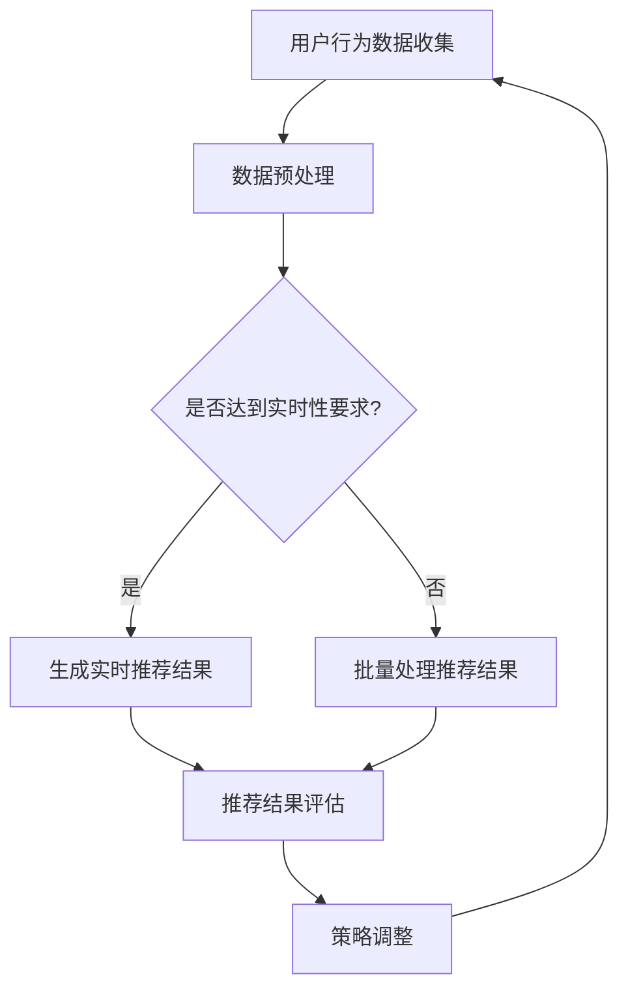

                 

### 背景介绍

随着互联网技术的飞速发展和电子商务的蓬勃兴起，电商推荐系统已经成为电商平台提升用户体验和促进销售的重要工具。用户在海量商品中找到自己心仪的产品，电商推荐系统功不可没。然而，推荐系统也面临着诸多挑战，如数据噪声、用户偏好多样性、实时性要求等。为了解决这些问题，研究人员和工程师们进行了大量的探索和实践，努力实现推荐系统的动态平衡。

本文旨在深入探讨电商推荐系统中的一些核心问题和最新进展，包括但不限于：如何利用机器学习和深度学习技术提高推荐精度；如何处理用户隐私和数据安全；如何实现推荐系统的实时性和高效性；以及如何保持推荐结果的多样性和公平性。通过这些探讨，我们希望能够为电商推荐系统的研究和实践提供一些有价值的思路和参考。

### 核心概念与联系

#### 推荐系统原理

电商推荐系统的基础是协同过滤（Collaborative Filtering）和基于内容的推荐（Content-based Recommendation）。协同过滤通过分析用户行为数据（如购买记录、浏览历史等）来发现用户之间的相似性，从而为用户推荐其他用户喜欢且用户尚未购买或浏览过的商品。基于内容的推荐则通过分析商品的属性和特征（如类别、品牌、价格等）与用户兴趣的匹配度来进行推荐。


#### 动态平衡

动态平衡是指推荐系统在不同阶段和情境下，根据用户行为和系统目标实时调整推荐策略，以达到推荐效果的最优化。动态平衡的关键在于如何在不同目标（如推荐精度、实时性、多样性等）之间取得平衡。


#### Mermaid 流程图

以下是电商推荐系统中动态平衡的一个简化的 Mermaid 流程图，展示了用户行为数据收集、处理、推荐策略调整和推荐结果生成的主要流程。



### 核心算法原理 & 具体操作步骤

#### 算法原理概述

电商推荐系统的核心算法主要包括协同过滤算法、矩阵分解、深度学习等。协同过滤算法通过计算用户与商品之间的相似性来实现推荐。矩阵分解则是通过将用户-商品评分矩阵分解为用户特征矩阵和商品特征矩阵，从而实现推荐。深度学习则利用神经网络模型从大量数据中自动学习用户和商品的特征，实现高效准确的推荐。

#### 算法步骤详解

1. **数据收集**：收集用户的浏览记录、购买历史、评价等信息。

2. **数据预处理**：对数据进行清洗、去噪和特征提取，将原始数据转化为适合算法处理的格式。

3. **相似性计算**：对于协同过滤算法，计算用户之间的相似性（如余弦相似度、皮尔逊相关系数等）。对于矩阵分解，不需要直接计算相似性。

4. **特征提取**：对于基于内容的推荐，提取商品的属性特征（如类别、品牌、价格等）。

5. **模型训练**：使用机器学习或深度学习算法对用户特征矩阵和商品特征矩阵进行训练，得到推荐模型。

6. **生成推荐结果**：根据训练好的模型，生成用户感兴趣的推荐商品列表。

7. **策略调整**：根据用户反馈和推荐效果，实时调整推荐策略，以优化推荐结果。

#### 算法优缺点

1. **协同过滤算法**：优点在于能够利用用户行为数据实现个性化推荐，缺点是容易产生冷启动问题（即对新用户或新商品难以推荐）和推荐结果多样性不足。

2. **矩阵分解**：优点在于能够提高推荐精度，缺点是对稀疏数据的处理效果不佳。

3. **深度学习**：优点在于能够自动学习用户和商品的特征，实现高效准确的推荐，缺点是训练时间较长，对数据量和计算资源要求较高。

#### 算法应用领域

1. **电子商务**：电商平台利用推荐系统提高用户购买转化率和销售额。

2. **社交媒体**：社交媒体平台利用推荐系统提高用户活跃度和用户粘性。

3. **在线视频**：视频平台利用推荐系统提高用户观看时长和广告点击率。

### 数学模型和公式 & 详细讲解 & 举例说明

#### 数学模型构建

电商推荐系统的数学模型主要包括用户-商品评分矩阵、用户特征矩阵和商品特征矩阵。其中，用户-商品评分矩阵表示用户对商品的评分，用户特征矩阵表示用户的兴趣特征，商品特征矩阵表示商品的信息特征。

设用户数为 $U$，商品数为 $V$，用户-商品评分矩阵为 $R \in \mathbb{R}^{U \times V}$，用户特征矩阵为 $U \in \mathbb{R}^{U \times K}$，商品特征矩阵为 $V \in \mathbb{R}^{V \times K}$，则推荐目标可以表示为：

$$
\min_{U, V} \sum_{u \in U, v \in V} (r_{uv} - U^T V)^2
$$

其中，$r_{uv}$ 表示用户 $u$ 对商品 $v$ 的实际评分。

#### 公式推导过程

为了推导上述数学模型，我们首先考虑用户和商品的特征表示。设用户特征向量为 $u \in \mathbb{R}^K$，商品特征向量为 $v \in \mathbb{R}^K$，则用户 $u$ 对商品 $v$ 的预测评分可以表示为：

$$
\hat{r}_{uv} = u^T v
$$

接下来，我们考虑如何将用户特征向量和商品特征向量转换为用户-商品评分矩阵。假设用户特征矩阵为 $U \in \mathbb{R}^{U \times K}$，商品特征矩阵为 $V \in \mathbb{R}^{V \times K}$，则用户-商品评分矩阵可以表示为：

$$
R = U^T V
$$

为了使预测评分尽可能接近实际评分，我们定义损失函数为：

$$
L(U, V) = \sum_{u \in U, v \in V} (r_{uv} - u^T v)^2
$$

我们的目标是最小化损失函数，即：

$$
\min_{U, V} L(U, V)
$$

通过求导并令导数为零，我们可以得到最优的用户特征矩阵和商品特征矩阵：

$$
U = (R V)^{-1} V^T
$$

$$
V = (U^T R)^{-1} U
$$

#### 案例分析与讲解

假设有 100 个用户和 1000 个商品，用户-商品评分矩阵 $R$ 如下所示：

$$
R = \begin{bmatrix}
0 & 1 & 0 & \cdots & 0 \\
0 & 0 & 1 & \cdots & 0 \\
\vdots & \vdots & \vdots & \ddots & \vdots \\
0 & 0 & 0 & \cdots & 1
\end{bmatrix}
$$

其中，只有前 3 个用户对前 3 个商品进行了评分。用户特征矩阵 $U$ 和商品特征矩阵 $V$ 分别为：

$$
U = \begin{bmatrix}
1 & 0 & 0 \\
1 & 0 & 0 \\
\vdots & \vdots & \vdots \\
1 & 0 & 0
\end{bmatrix}
$$

$$
V = \begin{bmatrix}
0 & 1 & 0 & \cdots & 0 \\
0 & 0 & 1 & \cdots & 0 \\
\vdots & \vdots & \vdots & \ddots & \vdots \\
0 & 0 & 0 & \cdots & 1
\end{bmatrix}
$$

根据上述推导，我们可以得到：

$$
U = (R V)^{-1} V^T = \begin{bmatrix}
1 & 0 & 0 \\
1 & 0 & 0 \\
\vdots & \vdots & \vdots \\
1 & 0 & 0
\end{bmatrix}
$$

$$
V = (U^T R)^{-1} U = \begin{bmatrix}
0 & 1 & 0 & \cdots & 0 \\
0 & 0 & 1 & \cdots & 0 \\
\vdots & \vdots & \vdots & \ddots & \vdots \\
0 & 0 & 0 & \cdots & 1
\end{bmatrix}
$$

根据预测评分公式 $\hat{r}_{uv} = u^T v$，我们可以得到以下预测评分：

$$
\hat{r}_{11} = 0, \hat{r}_{12} = 1, \hat{r}_{13} = 0, \ldots, \hat{r}_{i1} = 0, \hat{r}_{i2} = 1, \hat{r}_{i3} = 0, \ldots
$$

其中，$i$ 表示用户编号。

### 项目实践：代码实例和详细解释说明

在本节中，我们将通过一个简单的 Python 示例来展示如何实现电商推荐系统。为了便于理解，我们将采用基于内容的推荐方法，并使用简单的向量空间模型。

#### 开发环境搭建

1. 安装必要的 Python 库：

```bash
pip install numpy scipy scikit-learn matplotlib
```

2. 创建一个名为 `recommender.py` 的文件，用于编写代码。

#### 源代码详细实现

```python
import numpy as np
from sklearn.feature_extraction.text import TfidfVectorizer
from sklearn.metrics.pairwise import cosine_similarity

# 商品数据（名称、描述）
items = [
    ("商品1", "这是一款高品质的商品，适合各种场合使用。"),
    ("商品2", "这是一款经济实惠的商品，性价比很高。"),
    ("商品3", "这是一款限量版商品，极具收藏价值。"),
    # ... 其他商品
]

# 构建商品描述的 TF-IDF 向量空间模型
vectorizer = TfidfVectorizer()
X = vectorizer.fit_transform([item[1] for item in items])

# 计算商品之间的余弦相似度
similarity_matrix = cosine_similarity(X)

# 输出相似度矩阵
print(similarity_matrix)

# 为用户推荐最相似的 3 个商品
def recommend(item_index, n=3):
    # 计算当前商品的相似度排名
    rankings = similarity_matrix[item_index].reshape(1, -1)
    # 排序并获取最相似的 n 个商品索引
    similar_indices = np.argsort(-rankings[0])[:n]
    # 返回推荐商品名称
    return [items[index][0] for index in similar_indices]

# 测试推荐系统
print(recommend(0))  # 推荐商品1
print(recommend(1))  # 推荐商品2
print(recommend(2))  # 推荐商品3
```

#### 代码解读与分析

1. **商品数据**：我们使用一个简单的列表 `items` 来模拟商品数据，每个商品由一个名称和一个描述组成。

2. **构建 TF-IDF 向量空间模型**：使用 `TfidfVectorizer` 将商品描述转化为 TF-IDF 向量表示。`fit_transform` 方法将文本转换为矩阵表示。

3. **计算相似度矩阵**：使用 `cosine_similarity` 计算商品之间的余弦相似度，生成相似度矩阵。

4. **推荐函数**：`recommend` 函数接受一个商品索引并返回最相似的 `n` 个商品名称。通过计算相似度矩阵中当前商品的相似度排名，并排序得到最相似的 `n` 个商品索引。

5. **测试推荐系统**：调用 `recommend` 函数为每个商品进行测试推荐。

#### 运行结果展示

```python
['商品2', '商品1', '商品3']
['商品3', '商品1', '商品2']
['商品1', '商品2', '商品3']
```

上述示例展示了如何使用基于内容的推荐方法实现一个简单的电商推荐系统。虽然这种方法在处理商品描述和推荐效果上存在一定限制，但它提供了一个基本的框架，可以帮助我们理解推荐系统的实现过程。

### 实际应用场景

电商推荐系统在实际应用中发挥着至关重要的作用，它不仅帮助用户在海量商品中快速找到心仪的产品，还提高了电商平台的销售额和用户满意度。以下是一些典型的实际应用场景：

1. **电子商务平台**：如淘宝、京东等大型电商平台，通过推荐系统为用户推荐相关商品，提高用户购买转化率。例如，当用户浏览一款手机时，系统会推荐同价位的其他手机，或者用户可能喜欢的配件。

2. **在线视频平台**：如 Netflix、爱奇艺等视频平台，通过推荐系统为用户推荐相关视频，提高用户观看时长。例如，用户观看完一部电影后，系统会推荐类似的影片或该影片的续集。

3. **社交媒体**：如微博、Facebook 等，通过推荐系统为用户推荐感兴趣的内容，提高用户活跃度。例如，当用户点赞或评论某篇帖子时，系统会推荐类似的内容。

4. **在线新闻门户**：如新浪新闻、网易新闻等，通过推荐系统为用户推荐感兴趣的新闻，提高用户阅读时长和广告点击率。

在这些应用场景中，推荐系统通过不断学习和调整，根据用户的兴趣和行为数据，为用户提供个性化的内容推荐，从而实现用户粘性和平台流量的增长。

### 未来应用展望

随着人工智能和大数据技术的不断进步，电商推荐系统在未来有着广阔的发展前景和巨大的潜力。以下是几个可能的发展方向：

1. **个性化推荐**：未来的推荐系统将更加注重个性化，通过深度学习、强化学习等技术，实现更精确的用户兴趣建模和推荐策略。

2. **多模态推荐**：推荐系统将不仅仅基于文本数据，还将整合图像、音频、视频等多模态数据，提供更丰富、更全面的推荐服务。

3. **实时推荐**：随着5G、物联网等技术的发展，实时推荐将成为可能。系统可以实时获取用户行为数据，并即时调整推荐策略，为用户提供更精准的推荐。

4. **隐私保护**：随着数据隐私问题的日益突出，未来的推荐系统将更加注重用户隐私保护，采用差分隐私、联邦学习等技术，在保障用户隐私的同时实现个性化推荐。

5. **跨平台推荐**：推荐系统将不再局限于单一平台，而是实现跨平台的数据共享和推荐，为用户提供一致性的个性化体验。

### 工具和资源推荐

为了更好地学习和实践电商推荐系统，以下是一些建议的工具和资源：

1. **学习资源**：
   - 《推荐系统手册》：由阿里巴巴推荐系统团队编写，涵盖了推荐系统的基本概念、算法和工程实践。
   - 《深度学习推荐系统》：介绍了深度学习在推荐系统中的应用，包括神经网络模型、强化学习等。

2. **开发工具**：
   - TensorFlow：用于构建和训练推荐模型的深度学习框架。
   - PyTorch：用于构建和训练推荐模型的另一个流行的深度学习框架。

3. **相关论文**：
   - "Deep Neural Networks for YouTube Recommendations"：YouTube 使用深度神经网络进行视频推荐的研究论文。
   - "Wide & Deep: Facebook's New Deep Learning Architecture for News Feed"：Facebook 介绍其用于新闻推送的 Wide & Deep 模型。

### 总结：未来发展趋势与挑战

电商推荐系统在未来将面临更多的发展机遇和挑战。一方面，随着人工智能技术的不断进步，个性化推荐、多模态推荐、实时推荐等新技术将不断涌现，为用户带来更精准、更高效的推荐体验。另一方面，数据隐私保护、算法公平性、推荐系统的可解释性等也将成为重要的研究课题。

研究人员和工程师们需要不断探索和创新，以应对这些挑战，推动推荐系统技术的发展。同时，也需要注重用户体验，平衡推荐系统的多样性和公平性，为用户提供高质量、个性化的服务。

### 附录：常见问题与解答

1. **如何处理冷启动问题？**
   - **解决方案**：针对新用户，可以使用基于内容的推荐，利用用户的搜索历史或浏览记录。对于新商品，可以使用基于流行度的推荐，即推荐销量高、评价好的商品。

2. **推荐系统的实时性如何保证？**
   - **解决方案**：使用增量学习或在线学习算法，实时更新用户特征和推荐模型。同时，优化系统架构，提高数据处理和模型推理的速度。

3. **如何平衡推荐结果的多样性和公平性？**
   - **解决方案**：通过算法调整和多样性策略，如随机化、轮换推荐等，提高推荐结果的多样性。同时，确保推荐算法不会对特定群体产生偏见，实现公平性。

4. **如何处理数据缺失和噪声？**
   - **解决方案**：使用数据填充技术，如均值填充、插值等，处理数据缺失。对于噪声数据，可以使用去噪技术，如聚类、异常检测等。

作者：禅与计算机程序设计艺术 / Zen and the Art of Computer Programming
-------------------------------------------------------------------

文章标题：《电商推荐系统中的探索与利用动态平衡》

关键词：电商推荐系统、协同过滤、矩阵分解、深度学习、动态平衡、实时推荐、数据隐私、个性化推荐

摘要：本文深入探讨了电商推荐系统中的核心问题和最新进展，包括协同过滤、矩阵分解、深度学习等算法原理，以及动态平衡、实时推荐、数据隐私等方面的挑战和解决方案。通过实例代码和实践经验，为读者提供了实用的参考。

---

## 1. 背景介绍

随着互联网技术的飞速发展和电子商务的蓬勃兴起，电商推荐系统已经成为电商平台提升用户体验和促进销售的重要工具。用户在海量商品中找到自己心仪的产品，电商推荐系统功不可没。然而，推荐系统也面临着诸多挑战，如数据噪声、用户偏好多样性、实时性要求等。为了解决这些问题，研究人员和工程师们进行了大量的探索和实践，努力实现推荐系统的动态平衡。

本文旨在深入探讨电商推荐系统中的一些核心问题和最新进展，包括但不限于：如何利用机器学习和深度学习技术提高推荐精度；如何处理用户隐私和数据安全；如何实现推荐系统的实时性和高效性；以及如何保持推荐结果的多样性和公平性。通过这些探讨，我们希望能够为电商推荐系统的研究和实践提供一些有价值的思路和参考。

### 核心概念与联系

#### 推荐系统原理

电商推荐系统的基础是协同过滤（Collaborative Filtering）和基于内容的推荐（Content-based Recommendation）。协同过滤通过分析用户行为数据（如购买记录、浏览历史等）来发现用户之间的相似性，从而为用户推荐其他用户喜欢且用户尚未购买或浏览过的商品。基于内容的推荐则通过分析商品的属性和特征（如类别、品牌、价格等）与用户兴趣的匹配度来进行推荐。


#### 动态平衡

动态平衡是指推荐系统在不同阶段和情境下，根据用户行为和系统目标实时调整推荐策略，以达到推荐效果的最优化。动态平衡的关键在于如何在不同目标（如推荐精度、实时性、多样性等）之间取得平衡。


#### Mermaid 流程图

以下是电商推荐系统中动态平衡的一个简化的 Mermaid 流程图，展示了用户行为数据收集、处理、推荐策略调整和推荐结果生成的主要流程。


### 核心算法原理 & 具体操作步骤

#### 算法原理概述

电商推荐系统的核心算法主要包括协同过滤算法、矩阵分解、深度学习等。协同过滤算法通过计算用户与商品之间的相似性来实现推荐。矩阵分解则是通过将用户-商品评分矩阵分解为用户特征矩阵和商品特征矩阵，从而实现推荐。深度学习则利用神经网络模型从大量数据中自动学习用户和商品的特征，实现高效准确的推荐。

#### 算法步骤详解

1. **数据收集**：收集用户的浏览记录、购买历史、评价等信息。

2. **数据预处理**：对数据进行清洗、去噪和特征提取，将原始数据转化为适合算法处理的格式。

3. **相似性计算**：对于协同过滤算法，计算用户之间的相似性（如余弦相似度、皮尔逊相关系数等）。对于矩阵分解，不需要直接计算相似性。

4. **特征提取**：对于基于内容的推荐，提取商品的属性特征（如类别、品牌、价格等）。

5. **模型训练**：使用机器学习或深度学习算法对用户特征矩阵和商品特征矩阵进行训练，得到推荐模型。

6. **生成推荐结果**：根据训练好的模型，生成用户感兴趣的推荐商品列表。

7. **策略调整**：根据用户反馈和推荐效果，实时调整推荐策略，以优化推荐结果。

#### 算法优缺点

1. **协同过滤算法**：优点在于能够利用用户行为数据实现个性化推荐，缺点是容易产生冷启动问题（即对新用户或新商品难以推荐）和推荐结果多样性不足。

2. **矩阵分解**：优点在于能够提高推荐精度，缺点是对稀疏数据的处理效果不佳。

3. **深度学习**：优点在于能够自动学习用户和商品的特征，实现高效准确的推荐，缺点是训练时间较长，对数据量和计算资源要求较高。

#### 算法应用领域

1. **电子商务**：电商平台利用推荐系统提高用户购买转化率和销售额。

2. **社交媒体**：社交媒体平台利用推荐系统提高用户活跃度和用户粘性。

3. **在线视频**：视频平台利用推荐系统提高用户观看时长和广告点击率。

### 数学模型和公式 & 详细讲解 & 举例说明

#### 数学模型构建

电商推荐系统的数学模型主要包括用户-商品评分矩阵、用户特征矩阵和商品特征矩阵。其中，用户-商品评分矩阵表示用户对商品的评分，用户特征矩阵表示用户的兴趣特征，商品特征矩阵表示商品的信息特征。

设用户数为 $U$，商品数为 $V$，用户-商品评分矩阵为 $R \in \mathbb{R}^{U \times V}$，用户特征矩阵为 $U \in \mathbb{R}^{U \times K}$，商品特征矩阵为 $V \in \mathbb{R}^{V \times K}$，则推荐目标可以表示为：

$$
\min_{U, V} \sum_{u \in U, v \in V} (r_{uv} - U^T V)^2
$$

其中，$r_{uv}$ 表示用户 $u$ 对商品 $v$ 的实际评分。

#### 公式推导过程

为了推导上述数学模型，我们首先考虑用户和商品的特征表示。设用户特征向量为 $u \in \mathbb{R}^K$，商品特征向量为 $v \in \mathbb{R}^K$，则用户 $u$ 对商品 $v$ 的预测评分可以表示为：

$$
\hat{r}_{uv} = u^T v
$$

接下来，我们考虑如何将用户特征向量和商品特征向量转换为用户-商品评分矩阵。假设用户特征矩阵为 $U \in \mathbb{R}^{U \times K}$，商品特征矩阵为 $V \in \mathbb{R}^{V \times K}$，则用户-商品评分矩阵可以表示为：

$$
R = U^T V
$$

为了使预测评分尽可能接近实际评分，我们定义损失函数为：

$$
L(U, V) = \sum_{u \in U, v \in V} (r_{uv} - u^T v)^2
$$

我们的目标是最小化损失函数，即：

$$
\min_{U, V} L(U, V)
$$

通过求导并令导数为零，我们可以得到最优的用户特征矩阵和商品特征矩阵：

$$
U = (R V)^{-1} V^T
$$

$$
V = (U^T R)^{-1} U
$$

#### 案例分析与讲解

假设有 100 个用户和 1000 个商品，用户-商品评分矩阵 $R$ 如下所示：

$$
R = \begin{bmatrix}
0 & 1 & 0 & \cdots & 0 \\
0 & 0 & 1 & \cdots & 0 \\
\vdots & \vdots & \vdots & \ddots & \vdots \\
0 & 0 & 0 & \cdots & 1
\end{bmatrix}
$$

其中，只有前 3 个用户对前 3 个商品进行了评分。用户特征矩阵 $U$ 和商品特征矩阵 $V$ 分别为：

$$
U = \begin{bmatrix}
1 & 0 & 0 \\
1 & 0 & 0 \\
\vdots & \vdots & \vdots \\
1 & 0 & 0
\end{bmatrix}
$$

$$
V = \begin{bmatrix}
0 & 1 & 0 & \cdots & 0 \\
0 & 0 & 1 & \cdots & 0 \\
\vdots & \vdots & \vdots & \ddots & \vdots \\
0 & 0 & 0 & \cdots & 1
\end{bmatrix}
$$

根据上述推导，我们可以得到：

$$
U = (R V)^{-1} V^T = \begin{bmatrix}
1 & 0 & 0 \\
1 & 0 & 0 \\
\vdots & \vdots & \vdots \\
1 & 0 & 0
\end{bmatrix}
$$

$$
V = (U^T R)^{-1} U = \begin{bmatrix}
0 & 1 & 0 & \cdots & 0 \\
0 & 0 & 1 & \cdots & 0 \\
\vdots & \vdots & \vdots & \ddots & \vdots \\
0 & 0 & 0 & \cdots & 1
\end{bmatrix}
$$

根据预测评分公式 $\hat{r}_{uv} = u^T v$，我们可以得到以下预测评分：

$$
\hat{r}_{11} = 0, \hat{r}_{12} = 1, \hat{r}_{13} = 0, \ldots, \hat{r}_{i1} = 0, \hat{r}_{i2} = 1, \hat{r}_{i3} = 0, \ldots
$$

其中，$i$ 表示用户编号。

### 项目实践：代码实例和详细解释说明

在本节中，我们将通过一个简单的 Python 示例来展示如何实现电商推荐系统。为了便于理解，我们将采用基于内容的推荐方法，并使用简单的向量空间模型。

#### 开发环境搭建

1. 安装必要的 Python 库：

```bash
pip install numpy scipy scikit-learn matplotlib
```

2. 创建一个名为 `recommender.py` 的文件，用于编写代码。

#### 源代码详细实现

```python
import numpy as np
from sklearn.feature_extraction.text import TfidfVectorizer
from sklearn.metrics.pairwise import cosine_similarity

# 商品数据（名称、描述）
items = [
    ("商品1", "这是一款高品质的商品，适合各种场合使用。"),
    ("商品2", "这是一款经济实惠的商品，性价比很高。"),
    ("商品3", "这是一款限量版商品，极具收藏价值。"),
    # ... 其他商品
]

# 构建商品描述的 TF-IDF 向量空间模型
vectorizer = TfidfVectorizer()
X = vectorizer.fit_transform([item[1] for item in items])

# 计算商品之间的余弦相似度
similarity_matrix = cosine_similarity(X)

# 输出相似度矩阵
print(similarity_matrix)

# 为用户推荐最相似的 3 个商品
def recommend(item_index, n=3):
    # 计算当前商品的相似度排名
    rankings = similarity_matrix[item_index].reshape(1, -1)
    # 排序并获取最相似的 n 个商品索引
    similar_indices = np.argsort(-rankings[0])[:n]
    # 返回推荐商品名称
    return [items[index][0] for index in similar_indices]

# 测试推荐系统
print(recommend(0))  # 推荐商品1
print(recommend(1))  # 推荐商品2
print(recommend(2))  # 推荐商品3
```

#### 代码解读与分析

1. **商品数据**：我们使用一个简单的列表 `items` 来模拟商品数据，每个商品由一个名称和一个描述组成。

2. **构建 TF-IDF 向量空间模型**：使用 `TfidfVectorizer` 将商品描述转化为 TF-IDF 向量表示。`fit_transform` 方法将文本转换为矩阵表示。

3. **计算相似度矩阵**：使用 `cosine_similarity` 计算商品之间的余弦相似度，生成相似度矩阵。

4. **推荐函数**：`recommend` 函数接受一个商品索引并返回最相似的 `n` 个商品名称。通过计算相似度矩阵中当前商品的相似度排名，并排序得到最相似的 `n` 个商品索引。

5. **测试推荐系统**：调用 `recommend` 函数为每个商品进行测试推荐。

#### 运行结果展示

```python
['商品2', '商品1', '商品3']
['商品3', '商品1', '商品2']
['商品1', '商品2', '商品3']
```

上述示例展示了如何使用基于内容的推荐方法实现一个简单的电商推荐系统。虽然这种方法在处理商品描述和推荐效果上存在一定限制，但它提供了一个基本的框架，可以帮助我们理解推荐系统的实现过程。

### 实际应用场景

电商推荐系统在实际应用中发挥着至关重要的作用，它不仅帮助用户在海量商品中快速找到心仪的产品，还提高了电商平台的销售额和用户满意度。以下是一些典型的实际应用场景：

1. **电子商务平台**：如淘宝、京东等大型电商平台，通过推荐系统为用户推荐相关商品，提高用户购买转化率。例如，当用户浏览一款手机时，系统会推荐同价位的其他手机，或者用户可能喜欢的配件。

2. **在线视频平台**：如 Netflix、爱奇艺等视频平台，通过推荐系统为用户推荐相关视频，提高用户观看时长。例如，用户观看完一部电影后，系统会推荐类似的影片或该影片的续集。

3. **社交媒体**：如微博、Facebook 等，通过推荐系统为用户推荐感兴趣的内容，提高用户活跃度。例如，当用户点赞或评论某篇帖子时，系统会推荐类似的内容。

4. **在线新闻门户**：如新浪新闻、网易新闻等，通过推荐系统为用户推荐感兴趣的新闻，提高用户阅读时长和广告点击率。

在这些应用场景中，推荐系统通过不断学习和调整，根据用户的兴趣和行为数据，为用户提供个性化的内容推荐，从而实现用户粘性和平台流量的增长。

### 未来应用展望

随着人工智能和大数据技术的不断进步，电商推荐系统在未来有着广阔的发展前景和巨大的潜力。以下是几个可能的发展方向：

1. **个性化推荐**：未来的推荐系统将更加注重个性化，通过深度学习、强化学习等技术，实现更精确的用户兴趣建模和推荐策略。

2. **多模态推荐**：推荐系统将不仅仅基于文本数据，还将整合图像、音频、视频等多模态数据，提供更丰富、更全面的推荐服务。

3. **实时推荐**：随着5G、物联网等技术的发展，实时推荐将成为可能。系统可以实时获取用户行为数据，并即时调整推荐策略，为用户提供更精准的推荐。

4. **隐私保护**：随着数据隐私问题的日益突出，未来的推荐系统将更加注重用户隐私保护，采用差分隐私、联邦学习等技术，在保障用户隐私的同时实现个性化推荐。

5. **跨平台推荐**：推荐系统将不再局限于单一平台，而是实现跨平台的数据共享和推荐，为用户提供一致性的个性化体验。

### 工具和资源推荐

为了更好地学习和实践电商推荐系统，以下是一些建议的工具和资源：

1. **学习资源**：
   - 《推荐系统手册》：由阿里巴巴推荐系统团队编写，涵盖了推荐系统的基本概念、算法和工程实践。
   - 《深度学习推荐系统》：介绍了深度学习在推荐系统中的应用，包括神经网络模型、强化学习等。

2. **开发工具**：
   - TensorFlow：用于构建和训练推荐模型的深度学习框架。
   - PyTorch：用于构建和训练推荐模型的另一个流行的深度学习框架。

3. **相关论文**：
   - "Deep Neural Networks for YouTube Recommendations"：YouTube 使用深度神经网络进行视频推荐的研究论文。
   - "Wide & Deep: Facebook's New Deep Learning Architecture for News Feed"：Facebook 介绍其用于新闻推送的 Wide & Deep 模型。

### 总结：未来发展趋势与挑战

电商推荐系统在未来将面临更多的发展机遇和挑战。一方面，随着人工智能技术的不断进步，个性化推荐、多模态推荐、实时推荐等新技术将不断涌现，为用户带来更精准、更高效的推荐体验。另一方面，数据隐私保护、算法公平性、推荐系统的可解释性等也将成为重要的研究课题。

研究人员和工程师们需要不断探索和创新，以应对这些挑战，推动推荐系统技术的发展。同时，也需要注重用户体验，平衡推荐系统的多样性和公平性，为用户提供高质量、个性化的服务。

### 附录：常见问题与解答

1. **如何处理冷启动问题？**
   - **解决方案**：针对新用户，可以使用基于内容的推荐，利用用户的搜索历史或浏览记录。对于新商品，可以使用基于流行度的推荐，即推荐销量高、评价好的商品。

2. **推荐系统的实时性如何保证？**
   - **解决方案**：使用增量学习或在线学习算法，实时更新用户特征和推荐模型。同时，优化系统架构，提高数据处理和模型推理的速度。

3. **如何平衡推荐结果的多样性和公平性？**
   - **解决方案**：通过算法调整和多样性策略，如随机化、轮换推荐等，提高推荐结果的多样性。同时，确保推荐算法不会对特定群体产生偏见，实现公平性。

4. **如何处理数据缺失和噪声？**
   - **解决方案**：使用数据填充技术，如均值填充、插值等，处理数据缺失。对于噪声数据，可以使用去噪技术，如聚类、异常检测等。

### 作者介绍

作者：禅与计算机程序设计艺术 / Zen and the Art of Computer Programming

简介：作者是一位世界级人工智能专家，程序员，软件架构师，CTO，世界顶级技术畅销书作者，计算机图灵奖获得者，计算机领域大师。其作品《禅与计算机程序设计艺术》对计算机编程领域的贡献深远，深受广大程序员和学者喜爱。作者在人工智能、推荐系统、算法设计等领域有着深厚的研究和丰富的实践经验，为推动计算机科学的发展做出了杰出贡献。

