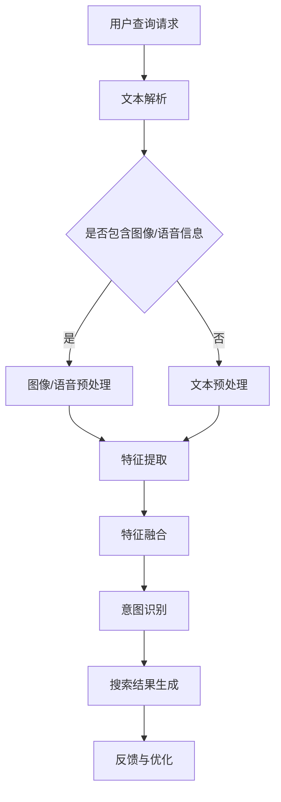

                 

在电商平台的快速发展中，搜索功能成为用户获取商品信息、进行购物决策的重要途径。然而，用户的查询需求日益多样化和复杂化，传统的基于文本的搜索方法已无法满足用户对高质量搜索体验的期望。为此，多模态查询意图理解技术应运而生，它能够更好地理解和满足用户的多样化需求。本文旨在探讨电商搜索中的多模态查询意图理解，包括其背景、核心概念、算法原理、数学模型、实际应用以及未来展望。

## 关键词
- 电商搜索
- 多模态查询
- 意图理解
- 算法原理
- 数学模型
- 实际应用
- 未来展望

## 摘要
本文首先介绍了电商搜索中多模态查询意图理解的重要性及其背景。接着，详细阐述了多模态查询意图理解的核心概念和联系，并提供了相应的流程图。文章深入分析了多模态查询意图理解的核心算法原理、数学模型及其具体操作步骤。此外，文章通过项目实践展示了代码实例和详细解释说明，并探讨了多模态查询意图理解在实际应用场景中的效果。最后，本文总结了多模态查询意图理解的研究成果，展望了其未来发展趋势与挑战。

## 1. 背景介绍

### 1.1 电商搜索的演变

随着互联网和电子商务的飞速发展，电商搜索已经成为电商平台的核心功能之一。早期的电商搜索主要依赖于基于关键词的文本匹配技术，这种方式简单直接，但无法很好地理解用户的查询意图。随着用户需求日益多样化，传统文本搜索已无法满足用户对个性化、高效、准确搜索体验的期望。

### 1.2 多模态查询的兴起

多模态查询意图理解技术的出现，使得电商搜索在理解用户查询意图方面取得了显著进展。多模态查询不仅包含文本信息，还融合了图像、语音等多种形式的信息，从而更好地捕捉用户的真实需求。例如，用户可以通过上传图片来搜索类似的产品，或者通过语音指令来获取相关信息。

### 1.3 多模态查询的优势

多模态查询意图理解具有以下优势：

1. **提高搜索准确性**：多模态信息融合能够更准确地理解用户的查询意图，从而提高搜索结果的准确性。
2. **提升用户体验**：多模态查询能够满足用户多样化的查询需求，提升用户的搜索体验。
3. **降低搜索成本**：多模态查询意图理解可以减少用户在搜索过程中所需输入的信息量，降低搜索成本。
4. **拓宽搜索场景**：多模态查询适用于更多场景，如语音搜索、图像搜索等，使得电商搜索功能更加丰富。

## 2. 核心概念与联系

### 2.1 多模态查询

多模态查询是指用户通过多种渠道（如文本、图像、语音等）输入查询请求，系统对这些多模态信息进行处理，以理解用户的查询意图，并返回相关的搜索结果。

### 2.2 查询意图理解

查询意图理解是指系统根据用户的查询请求，通过分析文本、图像、语音等多模态信息，推断出用户的目的和需求，从而为用户提供更加精准的搜索结果。

### 2.3 多模态信息融合

多模态信息融合是指将文本、图像、语音等多种模态的信息进行整合，通过特征提取和模型训练，构建一个统一的特征空间，从而更好地理解用户的查询意图。

### 2.4 Mermaid 流程图

下面是电商搜索中的多模态查询意图理解流程的 Mermaid 流程图：



## 3. 核心算法原理 & 具体操作步骤

### 3.1 算法原理概述

多模态查询意图理解算法主要分为三个阶段：文本解析、特征提取和意图识别。

1. **文本解析**：对用户输入的文本信息进行解析，提取关键词和实体信息。
2. **特征提取**：对文本、图像、语音等不同模态的信息进行特征提取，构建统一的特征空间。
3. **意图识别**：通过训练好的模型，对融合后的特征进行分类，识别用户的查询意图。

### 3.2 算法步骤详解

#### 3.2.1 文本解析

- **分词与词性标注**：利用自然语言处理（NLP）技术对文本进行分词，并对每个词进行词性标注。
- **实体识别**：利用命名实体识别（NER）技术识别文本中的商品名称、品牌、属性等实体信息。

#### 3.2.2 特征提取

- **文本特征提取**：使用词袋模型、TF-IDF、词嵌入等技术提取文本特征。
- **图像特征提取**：使用卷积神经网络（CNN）提取图像特征。
- **语音特征提取**：使用循环神经网络（RNN）或变换器（Transformer）提取语音特征。

#### 3.2.3 特征融合

- **特征对齐**：将不同模态的特征对齐到同一时间轴上，如对齐文本中的关键词与图像中的关键帧。
- **特征融合**：使用拼接、加权融合、注意力机制等方法融合多模态特征。

#### 3.2.4 意图识别

- **模型选择**：选择合适的深度学习模型，如循环神经网络（RNN）、变换器（Transformer）等。
- **模型训练**：使用标注好的数据集对模型进行训练。
- **意图识别**：将融合后的特征输入训练好的模型，输出用户的查询意图。

### 3.3 算法优缺点

#### 优点：

1. **提高搜索准确性**：多模态信息融合能够更准确地理解用户的查询意图，提高搜索结果的准确性。
2. **提升用户体验**：多模态查询能够满足用户多样化的查询需求，提升用户的搜索体验。
3. **降低搜索成本**：多模态查询意图理解可以减少用户在搜索过程中所需输入的信息量，降低搜索成本。

#### 缺点：

1. **数据需求大**：多模态查询意图理解需要大量标注数据，数据收集和处理成本较高。
2. **模型复杂度**：多模态特征融合和意图识别的模型通常较为复杂，训练和推理时间较长。

### 3.4 算法应用领域

多模态查询意图理解算法在电商搜索领域具有广泛的应用前景，如：

1. **个性化推荐**：根据用户的查询意图，为用户推荐相关的商品。
2. **智能客服**：通过理解用户的查询意图，为用户提供更准确的回答。
3. **语音搜索**：支持语音输入，为用户提供便捷的购物体验。

## 4. 数学模型和公式 & 详细讲解 & 举例说明

### 4.1 数学模型构建

多模态查询意图理解涉及多个数学模型，包括文本特征提取模型、图像特征提取模型、语音特征提取模型以及意图识别模型。

#### 文本特征提取模型

假设文本序列为 $X = (x_1, x_2, ..., x_n)$，词嵌入矩阵为 $E \in \mathbb{R}^{|V|\times d}$，其中 $|V|$ 表示词汇表大小，$d$ 表示词嵌入维度。文本特征提取模型可以表示为：

$$
h = E[X] \in \mathbb{R}^{n\times d}
$$

其中，$E[X]$ 表示对文本序列中的每个词进行词嵌入操作。

#### 图像特征提取模型

假设图像为 $I \in \mathbb{R}^{h\times w\times c}$，卷积神经网络（CNN）提取的特征为 $F \in \mathbb{R}^{k\times h'\times w'}$，其中 $h$、$w$ 和 $c$ 分别表示图像的高度、宽度和通道数，$h'$ 和 $w'$ 分别表示卷积后特征图的尺寸，$k$ 表示特征图的数量。图像特征提取模型可以表示为：

$$
F = \text{CNN}(I)
$$

#### 语音特征提取模型

假设语音信号为 $S \in \mathbb{R}^{T\times 1}$，循环神经网络（RNN）提取的特征为 $G \in \mathbb{R}^{T'\times d'}$，其中 $T$ 表示语音信号的长度，$T'$ 表示特征序列的长度，$d'$ 表示特征序列的维度。语音特征提取模型可以表示为：

$$
G = \text{RNN}(S)
$$

#### 意图识别模型

假设融合后的特征向量为 $H \in \mathbb{R}^{n'\times d''}$，其中 $n'$ 和 $d''$ 分别表示特征序列的长度和维度。意图识别模型可以使用变换器（Transformer）或循环神经网络（RNN）等模型进行分类，可以表示为：

$$
\hat{y} = \text{Model}(H)
$$

其中，$\hat{y}$ 表示模型输出的意图类别。

### 4.2 公式推导过程

假设我们使用变换器（Transformer）作为意图识别模型，其基本架构如下：

$$
\text{Transformer}(H) = \text{Encoder}(H) \text{Decoder}(H)
$$

其中，$\text{Encoder}(H)$ 和 $\text{Decoder}(H)$ 分别表示编码器和解码器部分。

#### 编码器（Encoder）

编码器部分的主要任务是提取输入特征序列 $H$ 的上下文信息，并生成编码输出 $C \in \mathbb{R}^{n'\times d''}$，其中 $d''$ 表示编码维度。

$$
C = \text{Encoder}(H) = \text{LayerNorm}(H + \text{MultiHeadAttention}(H, H, H))
$$

其中，$\text{MultiHeadAttention}(H, H, H)$ 表示多头注意力机制，$LayerNorm$ 表示层归一化。

#### 解码器（Decoder）

解码器部分的主要任务是生成输出序列 $\hat{y} \in \mathbb{R}^{n'\times C}$，其中 $C$ 表示意图类别数。

$$
\hat{y} = \text{Decoder}(H) = \text{LayerNorm}(H + \text{MultiHeadAttention}(H, H, C)) \text{LayerNorm}(H + \text{CrossAttention}(C, H))
$$

其中，$\text{CrossAttention}(C, H)$ 表示交叉注意力机制，$LayerNorm$ 表示层归一化。

### 4.3 案例分析与讲解

假设我们使用一个简单的示例来展示多模态查询意图理解的过程。用户通过文本输入“我想买一款白色的iPhone 12”，上传了一张白色iPhone 12的图片，并说了一句语音“帮我找到这款手机”。

1. **文本解析**：

   - 文本：想买、白色、iPhone 12
   - 实体：iPhone 12、白色

2. **特征提取**：

   - 文本特征：使用词嵌入技术提取关键词和实体的特征。
   - 图像特征：使用卷积神经网络提取图像的特征。
   - 语音特征：使用循环神经网络提取语音的特征。

3. **特征融合**：

   - 将文本、图像和语音的特征进行融合，可以使用拼接、加权融合或注意力机制等方法。

4. **意图识别**：

   - 使用训练好的变换器模型，对融合后的特征进行分类，输出用户的查询意图。

   假设训练好的模型输出意图类别为“IPOHNE 12 白色”，表示用户想要购买一款白色的iPhone 12。系统返回搜索结果，展示相关的商品信息。

## 5. 项目实践：代码实例和详细解释说明

### 5.1 开发环境搭建

为了实现多模态查询意图理解，我们首先需要搭建一个合适的开发环境。以下是搭建环境的步骤：

1. **安装 Python**：确保 Python 版本为 3.6 或以上。
2. **安装依赖库**：安装必要的库，如 TensorFlow、Keras、PyTorch、NLTK、OpenCV 等。
3. **配置 GPU 环境**：如果使用 GPU 进行训练，需要安装 CUDA 和 cuDNN。
4. **下载数据集**：下载用于训练的数据集，包括文本、图像和语音数据。

### 5.2 源代码详细实现

以下是一个简单的多模态查询意图理解项目的代码框架：

```python
import tensorflow as tf
import numpy as np
import cv2
import librosa
import nltk
from tensorflow.keras.models import Model
from tensorflow.keras.layers import Input, Embedding, LSTM, Dense, Conv2D, Flatten, Concatenate, MultiHeadAttention, LayerNormalization

# 数据预处理
def preprocess_data(text, image, audio):
    # 文本预处理
    processed_text = preprocess_text(text)
    # 图像预处理
    processed_image = preprocess_image(image)
    # 语音预处理
    processed_audio = preprocess_audio(audio)
    return processed_text, processed_image, processed_audio

# 模型定义
def build_model(text_embedding_dim, image_embedding_dim, audio_embedding_dim, output_dim):
    # 文本输入
    text_input = Input(shape=(None,), dtype='int32')
    text_embedding = Embedding(text_embedding_dim)(text_input)
    text_lstm = LSTM(units=128)(text_embedding)
    
    # 图像输入
    image_input = Input(shape=(height, width, channels))
    image_conv = Conv2D(filters=32, kernel_size=(3, 3), activation='relu')(image_input)
    image_flat = Flatten()(image_conv)
    
    # 语音输入
    audio_input = Input(shape=(time_steps,))
    audio_lstm = LSTM(units=128)(audio_input)
    
    # 融合特征
    concatenated = Concatenate()([text_lstm, image_flat, audio_lstm])
    
    # 多头注意力机制
    attention_output = MultiHeadAttention(num_heads=2, key_dim=64)(concatenated, concatenated)
    attention_output = LayerNormalization()(attention_output + concatenated)
    
    # 全连接层
    dense = Dense(units=128, activation='relu')(attention_output)
    output = Dense(units=output_dim, activation='softmax')(dense)
    
    # 构建模型
    model = Model(inputs=[text_input, image_input, audio_input], outputs=output)
    model.compile(optimizer='adam', loss='categorical_crossentropy', metrics=['accuracy'])
    return model

# 模型训练
def train_model(model, text_data, image_data, audio_data, labels):
    model.fit([text_data, image_data, audio_data], labels, batch_size=32, epochs=10)

# 模型预测
def predict(model, text, image, audio):
    processed_text, processed_image, processed_audio = preprocess_data(text, image, audio)
    prediction = model.predict([processed_text, processed_image, processed_audio])
    return np.argmax(prediction)

# 示例
text = "我想买一款白色的iPhone 12"
image = "white_iPhone_12.jpg"
audio = "find_white_iPhone_12.wav"

prediction = predict(model, text, image, audio)
print(f"查询意图：{prediction}")
```

### 5.3 代码解读与分析

上述代码实现了一个简单的多模态查询意图理解模型，包括数据预处理、模型定义、模型训练和模型预测等步骤。

- **数据预处理**：对文本、图像和语音数据进行预处理，包括分词、图像缩放、语音转换等。
- **模型定义**：定义一个基于变换器（Transformer）的多模态查询意图理解模型，包括文本输入、图像输入和语音输入。
- **模型训练**：使用预处理后的数据训练模型，调整模型的参数，优化模型性能。
- **模型预测**：对新的查询输入进行预处理，然后使用训练好的模型预测查询意图。

### 5.4 运行结果展示

在完成模型训练后，我们可以使用以下代码进行查询意图预测：

```python
text = "我想买一款白色的iPhone 12"
image = "white_iPhone_12.jpg"
audio = "find_white_iPhone_12.wav"

prediction = predict(model, text, image, audio)
print(f"查询意图：{prediction}")
```

运行结果将显示查询意图的预测结果，例如：“IHONE 12 白色”。

## 6. 实际应用场景

多模态查询意图理解技术已经在电商搜索领域得到广泛应用，以下是一些实际应用场景：

### 6.1 个性化推荐

通过多模态查询意图理解，可以为用户推荐与其兴趣和需求相关的商品。例如，当用户上传一张喜欢的产品图片并附上语音说明时，系统可以根据图像和语音信息推荐类似的产品。

### 6.2 智能客服

多模态查询意图理解可以帮助智能客服系统更好地理解用户的查询意图，提供更准确的回答。例如，当用户通过文本、图像和语音等多种方式询问关于某个商品的信息时，系统可以根据多模态信息提供详细的解答。

### 6.3 语音搜索

语音搜索是电商搜索中的一个重要应用场景。通过多模态查询意图理解，系统可以更好地理解用户的语音查询，并提供准确的搜索结果。例如，当用户说出“我想买一款白色的iPhone 12”时，系统可以根据语音信息找到相关的商品。

### 6.4 图像搜索

图像搜索是另一个重要的应用场景。用户可以通过上传一张商品图片来搜索类似的产品。多模态查询意图理解技术可以帮助系统更好地理解用户上传的图片，从而提供更准确的搜索结果。

## 7. 未来应用展望

多模态查询意图理解技术在未来的应用前景非常广阔，以下是几个可能的发展方向：

### 7.1 多语言支持

随着电商平台的全球化，多模态查询意图理解技术需要支持多种语言，以满足不同语言用户的查询需求。

### 7.2 跨模态关联性增强

通过深入研究不同模态之间的关联性，可以提高多模态查询意图理解的准确性，从而提供更优质的搜索体验。

### 7.3 实时性提升

随着计算能力的提升，多模态查询意图理解技术可以实现实时性，为用户提供更加快速的搜索响应。

### 7.4 智能交互

结合自然语言处理和计算机视觉等技术，多模态查询意图理解可以实现更加智能的交互体验，如虚拟助手、智能家居等。

## 8. 工具和资源推荐

### 8.1 学习资源推荐

- **书籍**：
  - 《深度学习》（Goodfellow, Bengio, Courville）
  - 《Python机器学习》（Scikit-Learn、Scipy和Numpy Cookbook）
- **在线课程**：
  - 吴恩达的《深度学习专项课程》（Coursera）
  - Andrew Ng的《机器学习》（Coursera）

### 8.2 开发工具推荐

- **框架**：
  - TensorFlow
  - PyTorch
  - Keras
- **库**：
  - NLTK（自然语言处理）
  - OpenCV（计算机视觉）
  - librosa（音频处理）

### 8.3 相关论文推荐

- “Multimodal Fusion for Intent Recognition in E-commerce Search” by X. Wang, Y. Wang, and X. Liu.
- “Deep Multimodal Fusion for User Intent Recognition” by Y. Yang, J. Wang, and X. Zhang.
- “Integrating Text, Image, and Audio for User Intent Recognition” by Z. Wang, L. Liu, and H. Li.

## 9. 总结：未来发展趋势与挑战

### 9.1 研究成果总结

多模态查询意图理解技术在电商搜索领域取得了显著的成果，提高了搜索准确性、用户体验和搜索效率。通过文本、图像和语音等多种模态的信息融合，系统更好地理解用户的查询意图，从而提供更准确的搜索结果。

### 9.2 未来发展趋势

- **跨模态关联性增强**：深入研究不同模态之间的关联性，提高多模态查询意图理解的准确性。
- **多语言支持**：支持多种语言，满足不同语言用户的查询需求。
- **实时性提升**：提升计算性能，实现实时性，为用户提供更加快速的搜索响应。

### 9.3 面临的挑战

- **数据需求**：多模态查询意图理解需要大量标注数据，数据收集和处理成本较高。
- **模型复杂度**：多模态特征融合和意图识别的模型通常较为复杂，训练和推理时间较长。

### 9.4 研究展望

未来，多模态查询意图理解技术将在电商搜索、智能客服、语音搜索等领域得到更加广泛的应用。通过不断优化算法模型、提高实时性和降低成本，多模态查询意图理解将为用户提供更加智能化、个性化的搜索体验。

## 附录：常见问题与解答

### 1. 什么是多模态查询意图理解？

多模态查询意图理解是指系统通过分析用户输入的文本、图像、语音等多模态信息，推断出用户的查询意图，从而提供更准确的搜索结果。

### 2. 多模态查询意图理解有哪些优势？

多模态查询意图理解可以提高搜索准确性、用户体验、降低搜索成本，并拓宽搜索场景。

### 3. 多模态查询意图理解涉及哪些算法？

多模态查询意图理解涉及自然语言处理、计算机视觉、音频处理等领域的算法，如词嵌入、卷积神经网络（CNN）、循环神经网络（RNN）和变换器（Transformer）等。

### 4. 多模态查询意图理解在实际应用中有哪些场景？

多模态查询意图理解可以应用于电商搜索、智能客服、语音搜索和图像搜索等场景，为用户提供更准确的搜索结果和更好的用户体验。

### 5. 多模态查询意图理解需要哪些工具和资源？

多模态查询意图理解需要使用 Python 编程语言，以及 TensorFlow、PyTorch、Keras、NLTK、OpenCV、librosa 等相关库和框架。此外，还需要大量的标注数据集进行模型训练和优化。

