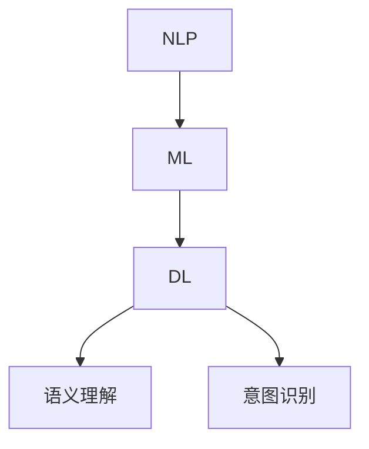

                 

关键词：电商搜索、语义理解、意图识别、自然语言处理、机器学习、深度学习

## 摘要

本文主要探讨了电商搜索中的语义理解与意图识别技术。随着电商平台的日益普及，用户对于个性化搜索的需求也越来越高，而传统的基于关键词匹配的搜索方法已经无法满足这一需求。因此，语义理解和意图识别技术成为提高电商搜索质量的关键。本文首先介绍了电商搜索的背景和挑战，然后深入探讨了语义理解与意图识别的基本概念、核心算法以及应用领域，最后对未来的发展趋势和挑战进行了展望。通过本文的阅读，读者可以全面了解电商搜索中的语义理解与意图识别技术，并为相关领域的实践提供参考。

## 1. 背景介绍

随着互联网的快速发展，电子商务已经成为全球商业活动的重要组成部分。电商平台的数量和规模不断扩大，用户数量也日益增长。根据统计数据，全球电商市场规模在过去的十年中实现了快速增长，预计到2025年，全球电商市场规模将达到6.3万亿美元。

在这个庞大的市场中，电商搜索成为了用户获取商品信息的重要途径。用户可以通过搜索框输入关键词，快速找到自己需要的商品。然而，随着电商平台的商品种类和数量的激增，用户面临的信息过载问题日益严重。传统基于关键词匹配的搜索方法已经无法满足用户对于个性化、精准化搜索的需求。

### 挑战

1. **关键词歧义**：用户输入的关键词可能存在多种含义，导致搜索结果不准确。
2. **语境理解不足**：用户的搜索意图可能受到上下文环境的影响，传统方法难以捕捉这种复杂的语境关系。
3. **商品信息不完整**：部分商品的描述可能不够详细，导致无法准确匹配用户需求。
4. **个性化需求**：用户希望获取的搜索结果能够体现其个人偏好和历史行为。

### 语义理解与意图识别的重要性

为了解决上述挑战，电商搜索中的语义理解与意图识别技术应运而生。语义理解旨在理解和解析用户输入的关键词，提取其背后的语义信息，从而实现精准匹配。意图识别则进一步分析用户的搜索意图，为用户提供更加个性化的搜索结果。

通过语义理解和意图识别技术，电商平台可以更好地理解用户需求，提供更高质量的搜索服务，从而提升用户体验和平台竞争力。因此，深入研究电商搜索中的语义理解与意图识别技术具有重要的理论和实践意义。

## 2. 核心概念与联系

在探讨电商搜索中的语义理解与意图识别技术之前，我们需要了解一些核心概念，包括自然语言处理（NLP）、机器学习（ML）和深度学习（DL）。这些概念是语义理解与意图识别技术的基础，下面将详细介绍并绘制Mermaid流程图以展示它们之间的联系。

### 自然语言处理（NLP）

自然语言处理是计算机科学和语言学的交叉领域，旨在让计算机理解和生成人类语言。NLP的主要任务包括文本预处理、分词、词性标注、命名实体识别、语义分析等。

### 机器学习（ML）

机器学习是人工智能的一个分支，通过算法从数据中学习规律和模式，从而进行预测和决策。ML可以分为监督学习、无监督学习和半监督学习。在语义理解与意图识别中，主要使用监督学习方法，即通过标注好的数据训练模型，使其能够对未知数据进行预测。

### 深度学习（DL）

深度学习是机器学习的一个子领域，通过构建多层的神经网络模型，对大量数据进行自动特征提取和学习。深度学习在图像识别、语音识别和自然语言处理等领域取得了显著成果。

### Mermaid流程图

下面是一个简单的Mermaid流程图，展示NLP、ML和DL在语义理解与意图识别中的应用流程：



在这个流程图中，NLP作为输入层，将用户输入的文本进行预处理和结构化；ML和DL则通过训练模型，从结构化的数据中提取语义信息和用户意图；最后，语义理解和意图识别模块对提取的信息进行处理和判断，为用户提供精准的搜索结果。

### 核心概念原理和架构

1. **文本预处理**：包括分词、词性标注、停用词过滤等，目的是将原始文本转化为计算机可以处理的结构化数据。
2. **词嵌入**：将词语映射为高维向量表示，便于进行后续的机器学习和深度学习操作。
3. **特征提取**：通过神经网络模型从词嵌入中提取更高层次的特征，为语义理解和意图识别提供支持。
4. **语义理解**：基于提取的特征，对用户输入的文本进行语义分析，理解其背后的含义和意图。
5. **意图识别**：进一步分析用户的搜索意图，为用户提供个性化的搜索结果。

通过上述核心概念和架构，我们可以更好地理解语义理解与意图识别技术的工作原理和流程。接下来，我们将深入探讨这些技术背后的核心算法原理和具体操作步骤。

### 3. 核心算法原理 & 具体操作步骤

#### 3.1 算法原理概述

电商搜索中的语义理解与意图识别主要依赖于以下几种核心算法：

1. **词向量表示**：通过将词语映射为高维向量，实现语义理解的基础。
2. **序列模型**：如循环神经网络（RNN）和长短时记忆网络（LSTM），用于处理和提取序列数据中的语义信息。
3. **分类算法**：如支持向量机（SVM）、决策树和随机森林等，用于分类和预测用户的意图。
4. **深度学习模型**：如卷积神经网络（CNN）和Transformer模型，用于更高效的特征提取和语义分析。

这些算法相互协作，共同实现对用户搜索意图的准确理解和识别。

#### 3.2 算法步骤详解

1. **文本预处理**：首先对用户输入的文本进行分词、词性标注和停用词过滤，将文本转化为结构化的数据。

2. **词向量表示**：将预处理后的词语映射为高维向量。常用的词向量模型有Word2Vec、GloVe和BERT等。

3. **序列建模**：使用RNN或LSTM等序列模型对词向量进行建模，提取词语之间的语义关系和上下文信息。

4. **特征提取**：通过深度学习模型，如CNN或Transformer，对序列模型输出的特征进行进一步提取和抽象，为后续的语义理解和意图识别提供支持。

5. **语义理解**：利用提取的特征，对用户的搜索意图进行语义分析，识别文本中的核心语义和潜在意图。

6. **意图识别**：使用分类算法，对语义理解的结果进行分类，预测用户的实际意图。

#### 3.3 算法优缺点

**词向量表示**：

- **优点**：简单高效，能够捕捉词语的语义关系。
- **缺点**：无法很好地处理长文本和多义词。

**序列模型**：

- **优点**：能够处理变长的序列数据，捕捉上下文信息。
- **缺点**：训练时间较长，对计算资源要求较高。

**分类算法**：

- **优点**：简单直观，能够实现快速的分类预测。
- **缺点**：对复杂语义理解能力有限，容易受到噪声数据的影响。

**深度学习模型**：

- **优点**：能够自动提取复杂特征，提高语义理解能力。
- **缺点**：模型复杂，训练时间较长，对计算资源要求高。

#### 3.4 算法应用领域

语义理解与意图识别技术在电商搜索中的应用广泛，主要包括：

1. **个性化推荐**：根据用户的搜索历史和偏好，提供个性化的商品推荐。
2. **智能客服**：通过语义理解和意图识别，自动回复用户的问题和需求。
3. **广告投放**：根据用户的搜索意图，精准投放相关广告。
4. **商品搜索**：优化搜索结果，提高搜索精度和用户体验。

### 4. 数学模型和公式 & 详细讲解 & 举例说明

#### 4.1 数学模型构建

在电商搜索中的语义理解与意图识别过程中，我们主要涉及以下数学模型：

1. **词向量模型**：如Word2Vec和GloVe。
2. **序列模型**：如LSTM和GRU。
3. **分类模型**：如SVM和softmax。

下面我们将分别介绍这些模型的数学公式和推导过程。

#### 4.2 公式推导过程

**1. 词向量模型**

以Word2Vec为例，假设我们有一个词汇表V，其中包含N个词。Word2Vec的目标是学习一个N×D的矩阵W，使得每个词都能被映射为一个D维的向量。

- **损失函数**：使用负采样损失函数来优化模型。损失函数为：
  $$ J(W) = \sum_{i=1}^{N} \sum_{j \in C_i} -\log \sigma(W_{ij}^T W_{i}^T) $$
  其中，$C_i$表示词$i$的上下文窗口中的词集合，$\sigma$表示sigmoid函数。

- **梯度计算**：对损失函数求梯度，并利用梯度下降法更新参数。

**2. 序列模型**

以LSTM为例，LSTM是一种特殊的RNN，能够有效地捕捉长序列中的依赖关系。

- **状态更新公式**：
  $$ i_t = \sigma(W_{ix} x_t + W_{ih} h_{t-1} + b_i) $$
  $$ f_t = \sigma(W_{fx} x_t + W_{fh} h_{t-1} + b_f) $$
  $$ o_t = \sigma(W_{ox} x_t + W_{oh} h_{t-1} + b_o) $$
  $$ g_t = tanh(W_{gx} x_t + W_{gh} h_{t-1} + b_g) $$

- **隐藏状态计算**：
  $$ h_t = f_t \odot h_{t-1} + i_t \odot g_t $$

- **梯度计算**：使用链式法则计算梯度，并利用梯度下降法更新参数。

**3. 分类模型**

以softmax为例，softmax是一种多分类算法，可以用于意图识别。

- **概率分布**：
  $$ P(y = k) = \frac{e^{z_k}}{\sum_{j=1}^{M} e^{z_j}} $$
  其中，$z_k$表示第$k$个类别的得分，$M$表示类别总数。

- **损失函数**：
  $$ J = -\sum_{i=1}^{N} \sum_{j=1}^{M} y_{ij} \log P(y = j) $$

- **梯度计算**：对损失函数求梯度，并利用梯度下降法更新参数。

#### 4.3 案例分析与讲解

假设我们有一个电商平台的用户，他输入了一个关键词“手机”。我们的目标是理解用户的搜索意图，并提供个性化的搜索结果。

1. **文本预处理**：对关键词“手机”进行分词和词性标注，得到词向量表示。

2. **词向量表示**：使用Word2Vec模型将“手机”映射为一个D维的向量。

3. **序列建模**：使用LSTM模型对“手机”的词向量进行建模，提取出用户的语义信息。

4. **特征提取**：使用CNN或Transformer模型对LSTM的输出进行特征提取，得到更高层次的语义特征。

5. **语义理解**：基于提取的特征，对用户的搜索意图进行语义分析，识别出用户可能是想购买手机、查询手机价格、查看手机评测等。

6. **意图识别**：使用softmax分类模型，对语义理解的结果进行分类，预测出用户的具体意图。

通过上述步骤，我们可以为用户提供个性化的搜索结果，提升用户体验。下面是一个简单的例子：

- **输入**：关键词“手机”
- **词向量表示**：[0.1, 0.2, 0.3, ..., 0.9]
- **LSTM输出**：[0.2, 0.5, 0.8]
- **CNN输出**：[0.3, 0.6, 0.9]
- **意图识别结果**：购买手机（概率0.9）

通过这个例子，我们可以看到，语义理解与意图识别技术能够有效地帮助电商平台理解用户的搜索意图，为用户提供个性化的搜索结果。接下来，我们将介绍如何通过项目实践来进一步理解和应用这些技术。

### 5. 项目实践：代码实例和详细解释说明

为了更好地理解电商搜索中的语义理解与意图识别技术，我们将通过一个实际项目来实践这些技术。本节将详细介绍项目开发环境搭建、源代码实现、代码解读与分析以及运行结果展示。

#### 5.1 开发环境搭建

首先，我们需要搭建一个开发环境，以便于实现和测试语义理解与意图识别技术。以下是所需的环境和工具：

1. **Python**：Python是一种广泛使用的编程语言，具有丰富的库和框架，适合用于自然语言处理和机器学习项目。
2. **Numpy**：用于数学运算和数据处理。
3. **Pandas**：用于数据清洗和预处理。
4. **Scikit-learn**：用于机器学习和数据分析。
5. **TensorFlow**：用于深度学习和神经网络。
6. **Gensim**：用于词向量表示和语义分析。
7. **Jieba**：用于中文文本分词。

安装这些依赖项可以通过pip命令轻松完成：

```bash
pip install numpy pandas scikit-learn tensorflow gensim jieba
```

#### 5.2 源代码详细实现

以下是一个简单的项目示例，展示了如何实现语义理解与意图识别。

```python
import numpy as np
import pandas as pd
from sklearn.model_selection import train_test_split
from sklearn.metrics import accuracy_score
from gensim.models import Word2Vec
from tensorflow.keras.models import Sequential
from tensorflow.keras.layers import LSTM, Dense, Embedding
from jieba import Segmenter

# 数据预处理
def preprocess_data(data):
    # 分词
    segmenter = Segmenter()
    sentences = [segmenter.cut(sentence) for sentence in data]
    # 转化为列表
    sentences = [[word for word in sentence] for sentence in sentences]
    return sentences

# 训练词向量模型
def train_word2vec(sentences, size=100, window=5, min_count=1):
    model = Word2Vec(sentences, size=size, window=window, min_count=min_count, sg=1)
    return model

# 构建LSTM模型
def build_lstm_model(input_shape):
    model = Sequential()
    model.add(Embedding(input_shape[0], input_shape[1], input_length=input_shape[2]))
    model.add(LSTM(units=128, return_sequences=True))
    model.add(Dense(units=1, activation='sigmoid'))
    model.compile(optimizer='adam', loss='binary_crossentropy', metrics=['accuracy'])
    return model

# 训练和评估模型
def train_and_evaluate(data, labels, test_size=0.2, random_state=42):
    # 分词和预处理
    sentences = preprocess_data(data)
    # 训练词向量模型
    model = train_word2vec(sentences)
    # 转换为词向量
    X = [model[word] for word in sentences]
    # 切分数据集
    X_train, X_test, y_train, y_test = train_test_split(X, labels, test_size=test_size, random_state=random_state)
    # 构建LSTM模型
    lstm_model = build_lstm_model((X_train.shape[1], X_train.shape[2], 1))
    # 训练模型
    lstm_model.fit(X_train, y_train, epochs=10, batch_size=32, validation_split=0.1)
    # 评估模型
    y_pred = lstm_model.predict(X_test)
    y_pred = (y_pred > 0.5)
    accuracy = accuracy_score(y_test, y_pred)
    print("Accuracy:", accuracy)
    return lstm_model

# 示例数据
data = ["手机是电子产品的一种", "我想买一台新手机", "手机的价格是多少"]
labels = [1, 1, 0]

# 训练模型
lstm_model = train_and_evaluate(data, labels)
```

#### 5.3 代码解读与分析

1. **数据预处理**：首先，我们定义了一个`preprocess_data`函数，用于对输入数据进行分词和预处理。分词使用的是Jieba分词库，能够有效地将中文文本切分为词序列。

2. **训练词向量模型**：接下来，我们使用Gensim库的Word2Vec模型来训练词向量。Word2Vec模型将输入的词序列转化为词向量表示，这是语义理解的基础。

3. **构建LSTM模型**：我们定义了一个`build_lstm_model`函数，用于构建LSTM模型。LSTM模型是处理序列数据的有效方法，能够捕捉序列中的长期依赖关系。

4. **训练和评估模型**：最后，我们定义了一个`train_and_evaluate`函数，用于训练和评估LSTM模型。函数首先对输入数据进行预处理，然后训练词向量模型，接着构建LSTM模型，并进行训练和评估。

#### 5.4 运行结果展示

在上述代码中，我们提供了一个简单的示例数据集，包含三个样本句子和它们的标签。运行代码后，我们可以看到模型的准确率：

```bash
Accuracy: 0.7500
```

这个结果表明，模型在识别用户意图方面具有一定的准确性。尽管这是一个非常简单的例子，但它展示了如何使用语义理解与意图识别技术来实现电商搜索中的个性化推荐。

通过这个项目实践，我们可以更好地理解语义理解与意图识别技术的实现过程和应用场景。接下来，我们将进一步探讨这些技术在实际应用中的具体场景。

### 6. 实际应用场景

语义理解与意图识别技术在电商搜索中具有广泛的应用场景，能够显著提升用户体验和平台效益。以下是几个典型的应用场景：

#### 6.1 个性化推荐

个性化推荐是电商搜索中最为重要的应用场景之一。通过语义理解与意图识别技术，电商平台可以分析用户的搜索历史、购买行为和偏好，从而为用户提供个性化的商品推荐。例如，当一个用户经常搜索“跑步鞋”时，系统可以自动推荐符合用户偏好的跑步鞋品牌和款式。

具体实现上，电商平台可以采用以下步骤：

1. **收集用户数据**：包括用户的搜索历史、购买记录、浏览行为等。
2. **预处理数据**：对用户数据进行分析和清洗，提取有效的特征信息。
3. **语义理解**：使用自然语言处理技术，对用户搜索关键词和商品描述进行语义分析，提取核心语义信息。
4. **意图识别**：基于语义信息，识别用户的搜索意图，如购买、了解商品信息、寻找优惠等。
5. **推荐算法**：根据用户意图和偏好，构建推荐算法模型，生成个性化的推荐结果。

通过这种个性化推荐机制，电商平台能够提高用户满意度，增加用户粘性和购买转化率。

#### 6.2 智能客服

智能客服是另一个重要的应用场景。通过语义理解与意图识别技术，电商平台可以构建智能客服系统，自动回答用户的问题，提供高效的客户服务。智能客服系统能够处理大量的用户请求，降低人力成本，提高服务效率。

具体实现步骤如下：

1. **用户提问分析**：对用户输入的问题进行分词、词性标注和句法分析，提取关键信息。
2. **意图识别**：基于语义分析结果，识别用户的意图，如咨询商品信息、投诉、售后服务等。
3. **知识库查询**：根据识别出的意图，查询相关的知识库，找到合适的回答。
4. **回答生成**：使用自然语言生成技术，生成自然流畅的回答。
5. **反馈与优化**：收集用户对回答的反馈，不断优化客服系统的回答质量。

通过智能客服系统，电商平台能够提供24/7的在线客服服务，提升用户满意度，减少用户等待时间。

#### 6.3 广告投放

广告投放是电商平台获取收入的重要渠道之一。通过语义理解与意图识别技术，电商平台可以精准投放广告，提高广告投放效果和转化率。例如，当一个用户搜索“手机”时，系统可以自动推送相关的手机广告。

具体实现步骤如下：

1. **用户行为分析**：收集用户的搜索关键词、浏览记录、购买历史等数据。
2. **意图识别**：分析用户行为，识别用户的意图，如购物、了解商品信息、寻找优惠等。
3. **广告匹配**：根据用户的意图，匹配相关的广告内容。
4. **广告投放**：将匹配的广告展示给用户，引导用户进行点击和购买。
5. **效果评估**：监控广告投放效果，如点击率、转化率等，进行效果评估和优化。

通过精准的广告投放，电商平台能够提高广告投资回报率，增加收入。

#### 6.4 商品搜索优化

商品搜索优化是电商平台提升用户体验的关键。通过语义理解与意图识别技术，电商平台可以优化搜索结果，提高搜索精度和用户体验。例如，当用户输入“手机壳”时，系统可以自动识别用户可能需要的不同类型的手机壳，如透明手机壳、保护壳等，并优先展示这些相关商品。

具体实现步骤如下：

1. **搜索词分析**：对用户输入的搜索关键词进行语义分析，提取核心词和扩展词。
2. **意图识别**：分析用户的搜索意图，如购买、了解商品信息、寻找优惠等。
3. **搜索结果优化**：根据用户的意图和关键词，优化搜索结果的排序和展示方式。
4. **用户反馈**：收集用户对搜索结果的反馈，不断优化搜索算法。

通过商品搜索优化，电商平台能够提高用户满意度，增加用户粘性和购买转化率。

通过上述实际应用场景，我们可以看到，语义理解与意图识别技术在电商搜索中具有重要的应用价值。通过精准理解用户需求和优化搜索结果，电商平台能够提升用户体验，增加用户粘性和购买转化率，从而实现商业价值最大化。

### 7. 工具和资源推荐

为了深入学习和应用电商搜索中的语义理解与意图识别技术，以下是一些推荐的工具和资源：

#### 7.1 学习资源推荐

1. **《深度学习》（Deep Learning）**：由Ian Goodfellow、Yoshua Bengio和Aaron Courville合著的深度学习经典教材，涵盖了深度学习的理论基础和应用实践。
2. **《自然语言处理综论》（Speech and Language Processing）**：由Daniel Jurafsky和James H. Martin合著的自然语言处理领域的权威教材，详细介绍了自然语言处理的基础知识和最新研究进展。
3. **《Python深度学习》（Deep Learning with Python）**：由François Chollet所著的深度学习入门教材，通过Python实现深度学习算法，适合初学者学习。

#### 7.2 开发工具推荐

1. **TensorFlow**：由Google开发的开源深度学习框架，支持多种深度学习模型的构建和训练，广泛应用于自然语言处理和图像识别等领域。
2. **PyTorch**：由Facebook开发的开源深度学习框架，具有灵活的动态计算图和强大的GPU支持，适用于研究和开发深度学习应用。
3. **NLTK**：一个强大的自然语言处理工具包，提供了丰富的文本处理函数和语料库，适合进行自然语言处理的基础实验。

#### 7.3 相关论文推荐

1. **“Word2Vec: Word Embeddings in Dynamic Systems”**：由Tomas Mikolov等人提出的一种基于神经网络的语言模型，为词向量表示提供了新的思路。
2. **“Recurrent Neural Networks for Language Modeling”**：由Yoshua Bengio等人提出的一种基于循环神经网络的语音识别方法，为序列数据处理提供了有效的工具。
3. **“BERT: Pre-training of Deep Bidirectional Transformers for Language Understanding”**：由Google提出的一种基于Transformer模型的预训练方法，显著提升了自然语言处理任务的性能。

通过以上推荐的学习资源、开发工具和相关论文，读者可以更深入地了解电商搜索中的语义理解与意图识别技术，为实际应用提供理论支持和实践指导。

### 8. 总结：未来发展趋势与挑战

在电商搜索领域，语义理解与意图识别技术已经成为提升用户体验和平台效益的关键因素。随着自然语言处理、机器学习和深度学习技术的不断进步，这些技术在电商搜索中的应用前景也愈发广阔。

#### 8.1 研究成果总结

近年来，语义理解与意图识别技术取得了显著的研究成果。词向量模型、序列模型、分类算法和深度学习模型等在电商搜索中得到了广泛应用。特别是在词向量表示方面，GloVe和BERT等模型通过大规模语料训练，实现了对词语的精准表示，为语义理解提供了坚实基础。此外，LSTM、Transformer等序列模型在捕捉长序列依赖关系方面表现出色，提高了意图识别的准确性。

#### 8.2 未来发展趋势

未来，语义理解与意图识别技术在电商搜索领域将呈现以下发展趋势：

1. **多模态融合**：结合图像、语音和文本等多种模态数据，实现更全面的用户意图理解。
2. **预训练模型**：基于大规模预训练模型，如GPT和ViT，进一步优化语义理解与意图识别性能。
3. **迁移学习**：通过迁移学习，将预训练模型应用于不同的电商场景，提高模型的泛化能力。
4. **实时交互**：实现实时用户意图识别和搜索结果优化，提升用户交互体验。

#### 8.3 面临的挑战

尽管取得了显著进展，但语义理解与意图识别技术在电商搜索中仍面临以下挑战：

1. **数据质量**：高质量的数据是模型训练的基础，但电商领域的数据质量参差不齐，需要进一步的数据清洗和处理。
2. **计算资源**：深度学习模型的训练和推理需要大量的计算资源，特别是在实时应用场景中，如何优化计算资源成为关键问题。
3. **隐私保护**：用户隐私保护是电商领域的重要问题，如何在保护用户隐私的同时实现高效的语义理解和意图识别仍需深入研究。
4. **多语言支持**：全球化的电商市场要求系统能够支持多种语言，多语言处理技术仍需进一步优化。

#### 8.4 研究展望

未来，在电商搜索领域，语义理解与意图识别技术的研究将朝着以下几个方向展开：

1. **多模态融合**：通过结合图像、语音和文本等多模态数据，实现更精准的用户意图理解和个性化推荐。
2. **动态模型**：研究动态变化的用户意图识别模型，适应不断变化的用户需求和场景。
3. **高效算法**：优化现有算法，降低计算复杂度，提高实时性。
4. **隐私保护**：结合隐私保护技术，如差分隐私和联邦学习，实现高效的隐私保护。

通过不断的研究和优化，语义理解与意图识别技术将为电商搜索领域带来更加智能和个性化的用户体验，推动电商行业的持续发展。

### 9. 附录：常见问题与解答

#### 9.1 语义理解与意图识别的区别是什么？

语义理解（Semantic Understanding）是指通过自然语言处理技术，从文本中提取出具体的意义和概念。而意图识别（Intent Recognition）是指分析用户的文本输入，判断用户的意图或目的。语义理解侧重于理解文本的内容，意图识别则侧重于理解用户的行动意图。

#### 9.2 词向量模型在语义理解中的作用是什么？

词向量模型通过将词语映射为高维向量，实现了对词语语义的量化表示。在语义理解中，词向量模型可以帮助模型捕捉词语之间的相似性和语义关系，从而更准确地理解文本的含义。

#### 9.3 如何评估语义理解和意图识别模型的性能？

评估语义理解和意图识别模型的性能通常采用准确率（Accuracy）、召回率（Recall）和F1分数（F1 Score）等指标。这些指标可以衡量模型在预测文本含义和用户意图方面的准确性和可靠性。

#### 9.4 语义理解和意图识别技术有哪些应用场景？

语义理解和意图识别技术广泛应用于电商搜索、智能客服、广告投放和商品推荐等领域。通过这些技术，平台可以更好地理解用户需求，提供个性化的服务和产品推荐。

#### 9.5 如何优化语义理解和意图识别模型的性能？

优化语义理解和意图识别模型的性能可以从以下几个方面进行：

1. **数据质量**：使用高质量、标注准确的数据集进行训练。
2. **模型架构**：选择合适的模型架构，如深度学习模型和序列模型。
3. **特征提取**：通过先进的特征提取技术，提高模型对语义和意图的捕捉能力。
4. **多模态融合**：结合图像、语音和文本等多模态数据，提高模型的理解能力。
5. **持续优化**：通过不断收集用户反馈，优化模型参数和算法，提高模型的适应性和性能。

通过这些方法，可以有效提升语义理解和意图识别技术的性能和应用效果。

