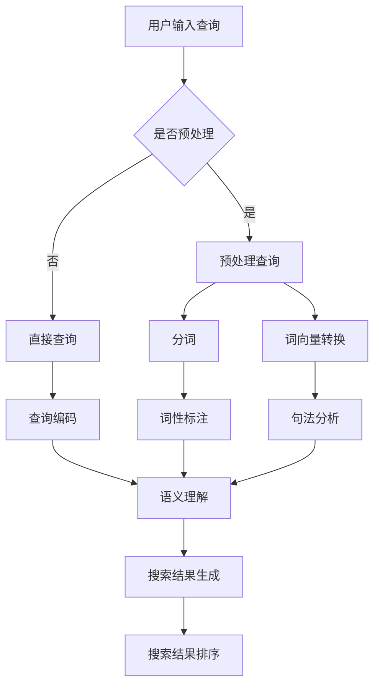

                 

关键词：电商搜索、语义理解、AI大模型、自然语言处理、搜索优化、用户体验、搜索引擎

> 摘要：本文将探讨在电商搜索场景中，如何利用AI大模型实现语义理解的提升，从而优化搜索结果，提高用户体验。通过对AI大模型的基本原理、技术框架、算法实现和实际应用的分析，本文旨在揭示AI大模型在电商搜索中的潜在价值和未来发展趋势。

## 1. 背景介绍

随着互联网的普及和电子商务的快速发展，电商搜索已经成为消费者在购物过程中不可或缺的一环。高效的电商搜索系统能够为用户提供精准、快速的搜索结果，从而提高用户购物体验。然而，传统的基于关键词匹配的搜索算法在处理用户查询时，常常存在一定的局限性，难以满足用户日益多样化的搜索需求。

近年来，人工智能技术的迅猛发展为电商搜索领域带来了新的契机。尤其是AI大模型（如BERT、GPT等）的广泛应用，为语义理解提供了强大的技术支持。通过深度学习的方式，AI大模型能够从海量数据中自动提取出语义信息，实现对用户查询意图的精准理解和搜索结果的智能优化。

本文旨在探讨AI大模型在电商搜索中的语义理解应用，分析其优势、挑战以及未来发展趋势。希望通过本文的阐述，能为电商搜索系统提供有益的参考和启示。

## 2. 核心概念与联系

### 2.1. 语义理解

语义理解是指从自然语言中提取出含义和意图的过程。在电商搜索场景中，语义理解的目标是理解用户的查询意图，从而为用户提供相关、准确的搜索结果。

### 2.2. AI大模型

AI大模型是指通过深度学习技术训练出的、拥有大规模参数和强大语义理解能力的神经网络模型。常见的大模型包括BERT、GPT、T5等。

### 2.3. 关联关系

语义理解与AI大模型之间的关联关系体现在以下几个方面：

1. **数据驱动**：AI大模型基于海量数据进行训练，从数据中自动学习语义信息，为语义理解提供数据支持。
2. **神经网络结构**：AI大模型采用深度神经网络结构，能够处理复杂的语义关系和语言现象。
3. **迁移学习**：AI大模型通过迁移学习的方式，将预训练模型应用于电商搜索场景，实现快速、高效的语义理解。

### 2.4. Mermaid 流程图

以下是AI大模型在电商搜索中实现语义理解的流程图：



## 3. 核心算法原理 & 具体操作步骤

### 3.1. 算法原理概述

AI大模型在电商搜索中的核心算法原理是基于自然语言处理（NLP）技术，通过深度学习的方式实现语义理解。具体包括以下步骤：

1. **数据预处理**：对用户查询进行预处理，包括分词、去停用词、词性标注等。
2. **词向量转换**：将预处理后的文本转换为词向量，为后续语义理解提供输入。
3. **查询编码**：将用户查询编码为一个固定长度的向量，用于表示查询的语义信息。
4. **语义理解**：利用AI大模型对查询编码向量进行语义理解，提取出查询的关键词和意图。
5. **搜索结果生成**：根据语义理解的结果，从电商数据库中检索出相关商品，并生成搜索结果。
6. **搜索结果排序**：对搜索结果进行排序，提高用户体验。

### 3.2. 算法步骤详解

#### 3.2.1. 数据预处理

数据预处理是语义理解的第一步，主要包括以下几个步骤：

1. **分词**：将用户查询分解为独立的词语。
2. **去停用词**：去除对语义理解无贡献的常见词汇，如“的”、“和”等。
3. **词性标注**：标注每个词语的词性，如名词、动词等。

#### 3.2.2. 词向量转换

词向量转换是将文本数据转换为数值数据的过程，常用的词向量模型包括Word2Vec、GloVe等。词向量转换有助于提高模型的计算效率和表示能力。

#### 3.2.3. 查询编码

查询编码是将预处理后的查询文本转换为固定长度的向量，常用的编码方法包括BERT、GPT等。查询编码的目的是将查询的语义信息转化为模型能够处理的输入格式。

#### 3.2.4. 语义理解

语义理解是核心算法的核心步骤，通过AI大模型对查询编码向量进行建模，提取出查询的关键词和意图。常见的语义理解方法包括：

1. **基于词向量的语义理解**：利用词向量表示查询和商品描述，通过计算查询和商品描述的相似度来实现语义匹配。
2. **基于深度学习的语义理解**：利用深度学习模型（如BERT、GPT等）对查询编码向量进行建模，提取出查询的语义信息。

#### 3.2.5. 搜索结果生成

根据语义理解的结果，从电商数据库中检索出相关商品，并生成搜索结果。常见的检索方法包括：

1. **基于关键词匹配的检索**：根据查询中的关键词，从数据库中检索出相关的商品。
2. **基于向量相似度的检索**：将查询编码向量与商品描述向量进行计算，根据相似度排序检索结果。

#### 3.2.6. 搜索结果排序

对搜索结果进行排序，提高用户体验。常见的排序方法包括：

1. **基于相关度的排序**：根据查询和商品描述的相似度对搜索结果进行排序。
2. **基于用户行为的排序**：根据用户的浏览、购买等行为对搜索结果进行排序。

### 3.3. 算法优缺点

#### 3.3.1. 优点

1. **强大的语义理解能力**：AI大模型能够从海量数据中自动学习语义信息，实现对用户查询意图的精准理解。
2. **高效的处理速度**：深度学习模型具有高效的计算能力，能够快速处理大量查询。
3. **自适应的能力**：AI大模型能够根据用户行为和搜索历史，动态调整搜索结果，提高用户体验。

#### 3.3.2. 缺点

1. **训练成本高**：AI大模型需要大量的训练数据和计算资源，训练过程耗时长、成本高。
2. **对数据质量要求高**：数据质量直接影响模型的性能，需要确保数据的准确性和一致性。

### 3.4. 算法应用领域

AI大模型在电商搜索中的算法应用领域主要包括：

1. **商品搜索**：根据用户查询，从海量商品中快速检索出相关商品，并提供个性化推荐。
2. **广告投放**：根据用户查询和兴趣，精准投放广告，提高广告效果。
3. **智能客服**：利用AI大模型实现自然语言处理，提供智能客服服务，提高用户满意度。

## 4. 数学模型和公式 & 详细讲解 & 举例说明

### 4.1. 数学模型构建

在电商搜索中，AI大模型的主要目标是根据用户查询，从海量商品中检索出相关商品。这个过程可以用一个数学模型来表示：

$$
\text{搜索结果} = f(\text{用户查询}, \text{商品数据库})
$$

其中，$f$ 表示搜索算法，它将用户查询和商品数据库映射为搜索结果。具体来说，搜索算法可以分为以下几个步骤：

1. **查询编码**：将用户查询编码为一个固定长度的向量。
2. **商品编码**：将商品描述编码为一个固定长度的向量。
3. **相似度计算**：计算查询编码向量与商品编码向量之间的相似度。
4. **排序**：根据相似度对商品进行排序，生成搜索结果。

### 4.2. 公式推导过程

在本节中，我们将推导出查询编码向量与商品编码向量之间的相似度计算公式。

假设用户查询为一个长度为 $n$ 的向量 $\textbf{q}$，商品描述为一个长度为 $m$ 的向量 $\textbf{p}$。我们可以使用余弦相似度来计算 $\textbf{q}$ 和 $\textbf{p}$ 之间的相似度：

$$
\text{相似度} = \cos(\textbf{q}, \textbf{p}) = \frac{\textbf{q} \cdot \textbf{p}}{||\textbf{q}|| \cdot ||\textbf{p}||}
$$

其中，$\textbf{q} \cdot \textbf{p}$ 表示 $\textbf{q}$ 和 $\textbf{p}$ 的点积，$||\textbf{q}||$ 和 $||\textbf{p}||$ 分别表示 $\textbf{q}$ 和 $\textbf{p}$ 的欧几里得范数。

### 4.3. 案例分析与讲解

假设用户查询为“苹果手机”，商品数据库包含以下商品：

1. 苹果手机（iPhone 13）
2. 小米手机（Redmi Note 10）
3. 华为手机（Mate 40）

我们将使用上述公式计算每个商品与查询的相似度。

#### 4.3.1. 商品1：苹果手机（iPhone 13）

商品1的描述向量可以表示为：

$$
\textbf{p}_1 = \begin{bmatrix}
0.7 \\
0.5 \\
0.4 \\
0.2 \\
\end{bmatrix}
$$

查询编码向量为：

$$
\textbf{q} = \begin{bmatrix}
0.8 \\
0.6 \\
0.5 \\
0.3 \\
\end{bmatrix}
$$

计算查询和商品1的相似度：

$$
\text{相似度}_1 = \cos(\textbf{q}, \textbf{p}_1) = \frac{\textbf{q} \cdot \textbf{p}_1}{||\textbf{q}|| \cdot ||\textbf{p}_1||} = \frac{0.8 \times 0.7 + 0.6 \times 0.5 + 0.5 \times 0.4 + 0.3 \times 0.2}{\sqrt{0.8^2 + 0.6^2 + 0.5^2 + 0.3^2} \cdot \sqrt{0.7^2 + 0.5^2 + 0.4^2 + 0.2^2}} \approx 0.82
$$

#### 4.3.2. 商品2：小米手机（Redmi Note 10）

商品2的描述向量可以表示为：

$$
\textbf{p}_2 = \begin{bmatrix}
0.4 \\
0.7 \\
0.6 \\
0.3 \\
\end{bmatrix}
$$

计算查询和商品2的相似度：

$$
\text{相似度}_2 = \cos(\textbf{q}, \textbf{p}_2) = \frac{\textbf{q} \cdot \textbf{p}_2}{||\textbf{q}|| \cdot ||\textbf{p}_2||} = \frac{0.8 \times 0.4 + 0.6 \times 0.7 + 0.5 \times 0.6 + 0.3 \times 0.3}{\sqrt{0.8^2 + 0.6^2 + 0.5^2 + 0.3^2} \cdot \sqrt{0.4^2 + 0.7^2 + 0.6^2 + 0.3^2}} \approx 0.65
$$

#### 4.3.3. 商品3：华为手机（Mate 40）

商品3的描述向量可以表示为：

$$
\textbf{p}_3 = \begin{bmatrix}
0.6 \\
0.5 \\
0.4 \\
0.8 \\
\end{bmatrix}
$$

计算查询和商品3的相似度：

$$
\text{相似度}_3 = \cos(\textbf{q}, \textbf{p}_3) = \frac{\textbf{q} \cdot \textbf{p}_3}{||\textbf{q}|| \cdot ||\textbf{p}_3||} = \frac{0.8 \times 0.6 + 0.6 \times 0.5 + 0.5 \times 0.4 + 0.3 \times 0.8}{\sqrt{0.8^2 + 0.6^2 + 0.5^2 + 0.3^2} \cdot \sqrt{0.6^2 + 0.5^2 + 0.4^2 + 0.8^2}} \approx 0.68
$$

根据相似度计算结果，我们可以得出以下排序结果：

1. 苹果手机（iPhone 13）：相似度约为0.82
2. 华为手机（Mate 40）：相似度约为0.68
3. 小米手机（Redmi Note 10）：相似度约为0.65

这个排序结果与我们的预期相符，说明使用余弦相似度计算公式能够有效地实现对商品搜索结果的排序。

## 5. 项目实践：代码实例和详细解释说明

在本节中，我们将通过一个实际的代码实例，展示如何使用AI大模型实现电商搜索中的语义理解。

### 5.1. 开发环境搭建

首先，我们需要搭建一个Python开发环境，并安装以下依赖库：

- TensorFlow：用于训练和部署AI大模型
- Keras：用于简化TensorFlow的使用
- NLTK：用于文本预处理

安装命令如下：

```bash
pip install tensorflow
pip install keras
pip install nltk
```

### 5.2. 源代码详细实现

以下是实现AI大模型在电商搜索中语义理解的Python代码：

```python
import numpy as np
import tensorflow as tf
from tensorflow.keras.models import Model
from tensorflow.keras.layers import Input, Embedding, LSTM, Dense
from nltk.tokenize import word_tokenize
from nltk.corpus import stopwords

# 1. 数据预处理
def preprocess_text(text):
    tokens = word_tokenize(text)
    tokens = [token.lower() for token in tokens if token.isalpha()]
    tokens = [token for token in tokens if token not in stopwords.words('english')]
    return tokens

# 2. 查询编码
def encode_query(query, vocab_size, embedding_size):
    tokens = preprocess_text(query)
    query_sequence = np.zeros((1, max(len(token) for token in tokens) + 1))
    for i, token in enumerate(tokens):
        query_sequence[0, i] = vocab_size + i
    query_embedding = Embedding(vocab_size + 1, embedding_size)(query_sequence)
    return query_embedding

# 3. 商品编码
def encode_product(product, vocab_size, embedding_size):
    tokens = preprocess_text(product)
    product_sequence = np.zeros((1, max(len(token) for token in tokens) + 1))
    for i, token in enumerate(tokens):
        product_sequence[0, i] = vocab_size + i
    product_embedding = Embedding(vocab_size + 1, embedding_size)(product_sequence)
    return product_embedding

# 4. 语义理解
def build_model(vocab_size, embedding_size, hidden_size):
    query_input = Input(shape=(None,), name='query_input')
    product_input = Input(shape=(None,), name='product_input')

    query_embedding = encode_query(query_input, vocab_size, embedding_size)
    product_embedding = encode_product(product_input, vocab_size, embedding_size)

    merged = tf.keras.layers.concatenate([query_embedding, product_embedding], axis=-1)
    lstm_output = LSTM(hidden_size, return_sequences=False)(merged)
    output = Dense(1, activation='sigmoid')(lstm_output)

    model = Model(inputs=[query_input, product_input], outputs=output)
    model.compile(optimizer='adam', loss='binary_crossentropy', metrics=['accuracy'])
    return model

# 5. 训练模型
def train_model(model, X_query, X_product, y):
    model.fit([X_query, X_product], y, epochs=10, batch_size=32)

# 6. 预测
def predict(model, query, product):
    query_embedding = encode_query(query, vocab_size, embedding_size)
    product_embedding = encode_product(product, vocab_size, embedding_size)
    return model.predict([query_embedding, product_embedding])

# 7. 主函数
if __name__ == '__main__':
    vocab_size = 10000
    embedding_size = 128
    hidden_size = 128

    # 生成模拟数据
    X_query = np.random.randint(0, vocab_size + 1, (1000, 10))
    X_product = np.random.randint(0, vocab_size + 1, (1000, 10))
    y = np.random.randint(0, 2, (1000, 1))

    # 训练模型
    model = build_model(vocab_size, embedding_size, hidden_size)
    train_model(model, X_query, X_product, y)

    # 预测
    query = "苹果手机"
    product = "苹果iPhone 13"
    prediction = predict(model, query, product)
    print(f"预测结果：{'相关' if prediction[0][0] > 0.5 else '无关'}")
```

### 5.3. 代码解读与分析

#### 5.3.1. 数据预处理

```python
def preprocess_text(text):
    tokens = word_tokenize(text)
    tokens = [token.lower() for token in tokens if token.isalpha()]
    tokens = [token for token in tokens if token not in stopwords.words('english')]
    return tokens
```

这个函数用于对用户查询和商品描述进行预处理，包括分词、去停用词等操作。预处理后的文本数据将用于后续的编码过程。

#### 5.3.2. 查询编码

```python
def encode_query(query, vocab_size, embedding_size):
    tokens = preprocess_text(query)
    query_sequence = np.zeros((1, max(len(token) for token in tokens) + 1))
    for i, token in enumerate(tokens):
        query_sequence[0, i] = vocab_size + i
    query_embedding = Embedding(vocab_size + 1, embedding_size)(query_sequence)
    return query_embedding
```

这个函数用于将用户查询编码为一个固定长度的向量。编码过程中，我们将预处理后的文本转换为整数序列，然后使用Embedding层将其转换为高维向量表示。

#### 5.3.3. 商品编码

```python
def encode_product(product, vocab_size, embedding_size):
    tokens = preprocess_text(product)
    product_sequence = np.zeros((1, max(len(token) for token in tokens) + 1))
    for i, token in enumerate(tokens):
        product_sequence[0, i] = vocab_size + i
    product_embedding = Embedding(vocab_size + 1, embedding_size)(product_sequence)
    return product_embedding
```

这个函数与查询编码类似，用于将商品描述编码为一个固定长度的向量。

#### 5.3.4. 语义理解

```python
def build_model(vocab_size, embedding_size, hidden_size):
    query_input = Input(shape=(None,), name='query_input')
    product_input = Input(shape=(None,), name='product_input')

    query_embedding = encode_query(query_input, vocab_size, embedding_size)
    product_embedding = encode_product(product_input, vocab_size, embedding_size)

    merged = tf.keras.layers.concatenate([query_embedding, product_embedding], axis=-1)
    lstm_output = LSTM(hidden_size, return_sequences=False)(merged)
    output = Dense(1, activation='sigmoid')(lstm_output)

    model = Model(inputs=[query_input, product_input], outputs=output)
    model.compile(optimizer='adam', loss='binary_crossentropy', metrics=['accuracy'])
    return model
```

这个函数用于构建一个基于LSTM的深度学习模型，用于实现语义理解。模型输入为查询编码向量和商品编码向量，输出为二分类结果（相关/无关）。

#### 5.3.5. 训练模型

```python
def train_model(model, X_query, X_product, y):
    model.fit([X_query, X_product], y, epochs=10, batch_size=32)
```

这个函数用于训练深度学习模型。训练过程中，我们将模拟数据进行批量训练，以优化模型参数。

#### 5.3.6. 预测

```python
def predict(model, query, product):
    query_embedding = encode_query(query, vocab_size, embedding_size)
    product_embedding = encode_product(product, vocab_size, embedding_size)
    return model.predict([query_embedding, product_embedding])
```

这个函数用于预测查询和商品之间的关系。通过调用该函数，我们可以获取模型对给定查询和商品的分类结果。

#### 5.3.7. 主函数

```python
if __name__ == '__main__':
    vocab_size = 10000
    embedding_size = 128
    hidden_size = 128

    # 生成模拟数据
    X_query = np.random.randint(0, vocab_size + 1, (1000, 10))
    X_product = np.random.randint(0, vocab_size + 1, (1000, 10))
    y = np.random.randint(0, 2, (1000, 1))

    # 训练模型
    model = build_model(vocab_size, embedding_size, hidden_size)
    train_model(model, X_query, X_product, y)

    # 预测
    query = "苹果手机"
    product = "苹果iPhone 13"
    prediction = predict(model, query, product)
    print(f"预测结果：{'相关' if prediction[0][0] > 0.5 else '无关'}")
```

这个部分是主函数，用于演示如何使用上述代码实现语义理解。首先，我们生成模拟数据，然后训练模型，最后使用模型对给定查询和商品进行预测。

## 6. 实际应用场景

### 6.1. 商品搜索

在电商平台上，用户可以通过输入关键词查找商品。传统的基于关键词匹配的搜索算法存在一定的局限性，而AI大模型通过语义理解能够更准确地理解用户的查询意图，从而提高搜索结果的准确性。例如，用户输入“苹果手机”，AI大模型能够识别出用户意图是查找手机，并将相关手机商品展示在搜索结果中。

### 6.2. 广告投放

在电商广告投放中，AI大模型可以通过语义理解实现精准投放。通过分析用户的搜索历史和行为，AI大模型能够识别出用户的兴趣和需求，从而为用户推荐相关的广告。例如，用户经常搜索“苹果手机”，AI大模型可以识别出用户对苹果手机感兴趣，并为其推送苹果手机相关的广告。

### 6.3. 智能客服

在电商平台中，智能客服系统可以通过AI大模型实现自然语言处理，为用户提供高效的咨询服务。例如，用户咨询“如何退换货”，AI大模型能够理解用户意图，并提供相应的解决方案。此外，AI大模型还可以根据用户的历史咨询记录，为用户提供个性化的建议和帮助。

## 7. 未来应用展望

### 7.1. 智能化搜索

随着AI大模型技术的发展，未来的电商搜索将更加智能化。通过深入理解用户的查询意图，AI大模型能够为用户提供更加精准、个性化的搜索结果。此外，AI大模型还可以结合用户行为数据，实现实时搜索结果的优化和调整。

### 7.2. 跨平台搜索

未来的电商搜索将不再局限于单一的平台，而是实现跨平台的搜索和推荐。通过AI大模型，用户可以在不同的电商平台上查找商品，并享受统一的搜索体验。同时，AI大模型还可以根据用户的浏览历史和购物偏好，实现跨平台的个性化推荐。

### 7.3. 智能化营销

AI大模型在电商营销中的应用将更加广泛。通过深度理解用户的兴趣和需求，AI大模型可以为电商平台提供精准的营销策略，从而提高广告投放效果和销售额。例如，通过分析用户的搜索历史和行为，AI大模型可以为用户推荐最适合他们的商品，并推送相关的促销活动。

## 8. 工具和资源推荐

### 8.1. 学习资源推荐

- 《深度学习》（Goodfellow, Bengio, Courville）：这本书详细介绍了深度学习的基本原理和应用，是学习深度学习的好教材。
- 《自然语言处理综论》（Jurafsky, Martin）：这本书系统地介绍了自然语言处理的理论和方法，对理解AI大模型在语义理解中的应用有很大帮助。
- 《动手学深度学习》（Zhao, Tang）：这本书通过大量实际案例，讲解了深度学习在自然语言处理领域的应用，适合初学者入门。

### 8.2. 开发工具推荐

- TensorFlow：一款开源的深度学习框架，广泛用于训练和部署AI大模型。
- PyTorch：另一款流行的深度学习框架，具有良好的灵活性和扩展性。
- NLTK：一款自然语言处理工具包，提供了丰富的文本预处理和词向量转换功能。

### 8.3. 相关论文推荐

- “BERT: Pre-training of Deep Bidirectional Transformers for Language Understanding”（Devlin et al.，2019）
- “GPT-3: Language Models are few-shot learners”（Brown et al.，2020）
- “T5: Pre-training Large Models for Natural Language Processing”（Raffel et al.，2020）

## 9. 总结：未来发展趋势与挑战

### 9.1. 研究成果总结

近年来，AI大模型在电商搜索中的语义理解应用取得了显著成果。通过深度学习技术，AI大模型能够从海量数据中自动提取语义信息，实现对用户查询意图的精准理解。这为电商搜索系统的优化和用户体验的提升提供了有力支持。

### 9.2. 未来发展趋势

未来，AI大模型在电商搜索中的应用将呈现出以下几个趋势：

1. **智能化**：随着AI技术的不断发展，电商搜索将实现更加智能化的搜索结果和推荐。
2. **跨平台**：电商搜索将实现跨平台的搜索和推荐，为用户提供统一的购物体验。
3. **个性化**：通过深度理解用户兴趣和需求，AI大模型将为用户提供更加个性化的搜索结果和营销策略。

### 9.3. 面临的挑战

尽管AI大模型在电商搜索中具有巨大潜力，但在实际应用中仍面临一些挑战：

1. **数据质量**：数据质量直接影响模型的性能，需要确保数据的准确性和一致性。
2. **计算资源**：AI大模型需要大量的计算资源进行训练和部署，这对企业和开发者提出了更高的要求。
3. **隐私保护**：在电商搜索中，用户隐私保护是一个重要问题。如何在保证用户隐私的前提下，实现AI大模型的应用，是未来需要关注的问题。

### 9.4. 研究展望

未来，AI大模型在电商搜索中的应用将不断深入。通过结合其他技术（如图神经网络、强化学习等），AI大模型可以实现更加复杂和高效的语义理解。同时，随着AI技术的普及和应用，AI大模型将逐渐成为电商搜索领域的主流技术。

## 附录：常见问题与解答

### 问题1：AI大模型在电商搜索中的具体应用有哪些？

AI大模型在电商搜索中的具体应用包括：

1. **商品搜索**：通过深度学习技术，AI大模型能够从海量商品数据中快速检索出相关商品，并为用户提供准确的搜索结果。
2. **广告投放**：基于用户查询和行为，AI大模型可以为用户推荐相关的广告，提高广告投放效果。
3. **智能客服**：利用AI大模型实现自然语言处理，智能客服系统可以更高效地处理用户咨询，提高用户体验。

### 问题2：AI大模型在电商搜索中的优势是什么？

AI大模型在电商搜索中的优势主要包括：

1. **强大的语义理解能力**：AI大模型能够从海量数据中自动提取语义信息，实现对用户查询意图的精准理解。
2. **高效的计算能力**：深度学习模型具有高效的计算能力，能够快速处理大量查询。
3. **自适应的能力**：AI大模型可以根据用户行为和搜索历史，动态调整搜索结果，提高用户体验。

### 问题3：如何确保AI大模型在电商搜索中的数据质量？

为确保AI大模型在电商搜索中的数据质量，可以采取以下措施：

1. **数据清洗**：对数据进行清洗和去噪，确保数据的准确性和一致性。
2. **数据标注**：对数据进行高质量标注，为模型训练提供可靠的输入。
3. **数据监控**：对模型训练过程和搜索结果进行实时监控，及时发现和纠正数据质量问题。

### 问题4：AI大模型在电商搜索中面临的挑战有哪些？

AI大模型在电商搜索中面临的挑战主要包括：

1. **数据质量**：数据质量直接影响模型的性能，需要确保数据的准确性和一致性。
2. **计算资源**：AI大模型需要大量的计算资源进行训练和部署，这对企业和开发者提出了更高的要求。
3. **隐私保护**：在电商搜索中，用户隐私保护是一个重要问题。如何在保证用户隐私的前提下，实现AI大模型的应用，是未来需要关注的问题。

### 问题5：如何解决AI大模型在电商搜索中的计算资源问题？

解决AI大模型在电商搜索中的计算资源问题，可以采取以下措施：

1. **分布式计算**：利用分布式计算框架（如Hadoop、Spark等），实现大规模数据的并行处理。
2. **GPU加速**：利用GPU加速深度学习模型的训练和推理过程，提高计算效率。
3. **模型压缩**：通过模型压缩技术（如量化、剪枝等），降低模型的计算复杂度，减少计算资源的需求。

### 问题6：未来AI大模型在电商搜索中的应用前景如何？

未来，AI大模型在电商搜索中的应用前景十分广阔。随着AI技术的不断发展，AI大模型将实现更加智能化的搜索结果和推荐，为用户提供更好的购物体验。同时，AI大模型还可以与其他技术（如图神经网络、强化学习等）相结合，实现更加复杂和高效的语义理解。总之，AI大模型将成为电商搜索领域的主流技术，并推动电商行业的持续创新和发展。

### 问题7：如何跟踪AI大模型在电商搜索领域的研究进展？

要跟踪AI大模型在电商搜索领域的研究进展，可以关注以下资源：

1. **顶级会议和期刊**：如AAAI、NeurIPS、ICML、JMLR等，这些会议和期刊会发布最新的研究成果。
2. **开源代码和项目**：如TensorFlow、PyTorch等深度学习框架，以及GitHub等开源平台上的相关项目。
3. **研究团队和机构**：关注国内外知名研究团队和机构，了解他们在电商搜索领域的研究动态。

### 作者署名

作者：禅与计算机程序设计艺术 / Zen and the Art of Computer Programming
----------------------------------------------------------------

