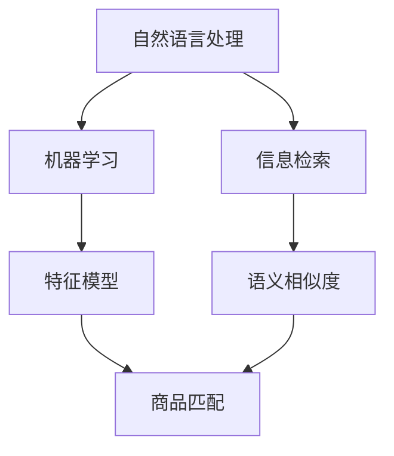

                 

关键词：电商搜索、跨语言商品匹配、检索技术、NLP、机器学习、信息检索、语义相似度、多语言处理、搜索算法

> 摘要：随着全球电商的蓬勃发展，多语言商品匹配与检索技术成为电商平台的重要需求。本文介绍了电商搜索中的跨语言商品匹配与检索技术，从核心概念、算法原理、数学模型到项目实践进行了深入探讨，旨在为电商搜索领域的研究者和开发者提供有价值的参考。

## 1. 背景介绍

在当今全球化的电商环境中，多语言商品匹配与检索技术变得至关重要。用户可能使用不同的语言进行搜索，而电商平台则需要提供准确、高效的多语言商品检索服务。跨语言商品匹配与检索技术不仅提升了用户体验，也增加了电商平台的用户覆盖范围和市场竞争力。

传统的单语言检索系统在面对多语言环境时存在明显的局限性。首先，不同语言之间的词汇、语法和表达习惯差异巨大，使得单语言检索系统难以准确理解多语言用户的需求。其次，单语言检索系统通常基于本地语言的数据集进行训练，缺乏对其他语言的泛化能力。此外，单语言检索系统在处理跨语言查询时，往往需要进行繁琐的翻译和转换操作，这增加了系统的复杂度和延迟。

为了解决这些问题，跨语言商品匹配与检索技术应运而生。它通过将不同语言的信息进行映射和整合，实现多语言商品信息的统一检索，从而提升电商平台的搜索质量和用户体验。本文将重点介绍跨语言商品匹配与检索技术的核心概念、算法原理、数学模型以及实际应用，旨在为相关领域的研究者和开发者提供有价值的参考。

## 2. 核心概念与联系

在介绍跨语言商品匹配与检索技术之前，我们需要明确几个核心概念，包括自然语言处理（NLP）、机器学习、信息检索和语义相似度。

### 2.1 自然语言处理（NLP）

自然语言处理（NLP）是人工智能领域的一个重要分支，旨在使计算机能够理解和处理人类自然语言。NLP涉及到词汇分析、句法分析、语义分析等多个方面。在跨语言商品匹配与检索中，NLP技术被用来分析用户的查询和商品描述，提取关键信息并进行语义理解。

### 2.2 机器学习

机器学习是NLP和跨语言商品匹配与检索技术的核心驱动力。通过机器学习，系统能够从大量数据中学习并自动改进其性能。在跨语言商品匹配与检索中，机器学习算法被用于构建特征模型、分类器、聚类算法等，以实现商品描述的自动分类和匹配。

### 2.3 信息检索

信息检索是电商搜索系统的核心，它涉及到如何从大量信息中快速、准确地检索出用户感兴趣的内容。在跨语言商品匹配与检索中，信息检索技术被用来处理多语言数据，实现不同语言商品之间的匹配和检索。

### 2.4 语义相似度

语义相似度是衡量不同语言或文本之间相似程度的重要指标。在跨语言商品匹配与检索中，通过计算语义相似度，系统能够识别出具有相似语义信息的商品，从而提升检索的准确性和用户体验。

### 2.5 核心概念原理与架构的 Mermaid 流程图

以下是一个简化的跨语言商品匹配与检索技术的 Mermaid 流程图，展示了各个核心概念之间的联系：



### 2.6 跨语言商品匹配与检索技术的工作流程

跨语言商品匹配与检索技术的工作流程可以概括为以下几个步骤：

1. **文本预处理**：对用户的查询和商品描述进行分词、词性标注、去除停用词等操作，为后续处理打下基础。
2. **特征提取**：利用机器学习算法提取文本特征，如词袋模型、TF-IDF、词嵌入等，以便进行后续的匹配和检索。
3. **语义理解**：通过NLP技术对文本进行语义分析，提取出关键信息，如实体识别、情感分析等。
4. **商品匹配**：利用特征模型和语义相似度计算方法，对用户查询与商品描述进行匹配，找出最相关的商品。
5. **检索结果排序**：根据匹配结果进行排序，输出用户最感兴趣的检索结果。

## 3. 核心算法原理 & 具体操作步骤

### 3.1 算法原理概述

跨语言商品匹配与检索技术主要依赖于以下几个核心算法：

1. **词嵌入**：将文本转换为密集的向量表示，以便进行相似度计算。
2. **语义相似度计算**：通过计算词嵌入向量的相似度，衡量不同语言或文本之间的语义相似性。
3. **商品匹配算法**：结合语义相似度计算和用户查询特征，实现商品与查询之间的匹配。
4. **检索结果排序算法**：根据匹配结果进行排序，提升检索效果。

### 3.2 算法步骤详解

#### 3.2.1 词嵌入

词嵌入是一种将文本中的单词映射为密集向量表示的技术。词嵌入向量能够捕捉单词在语境中的语义信息，从而提高跨语言商品匹配的准确性。常见的词嵌入算法包括Word2Vec、GloVe等。

1. **数据准备**：收集多语言商品描述数据集，并进行预处理，如分词、去除停用词等。
2. **模型训练**：使用训练数据集训练词嵌入模型，将每个单词映射为一个固定大小的向量。
3. **模型评估**：使用评估数据集评估词嵌入模型的质量，如通过计算单词间的余弦相似度等指标。

#### 3.2.2 语义相似度计算

语义相似度计算是跨语言商品匹配与检索技术的关键步骤。通过计算词嵌入向量的相似度，我们可以衡量不同语言或文本之间的语义相似性。

1. **向量表示**：将用户查询和商品描述转换为词嵌入向量。
2. **相似度计算**：使用余弦相似度、欧氏距离等距离度量方法计算词嵌入向量之间的相似度。
3. **阈值设定**：根据具体应用场景设定相似度阈值，筛选出最相关的商品。

#### 3.2.3 商品匹配算法

商品匹配算法结合语义相似度计算和用户查询特征，实现商品与查询之间的匹配。以下是一个简化的商品匹配算法：

1. **特征提取**：提取用户查询和商品描述的关键特征，如关键词、实体、情感等。
2. **匹配计算**：计算用户查询与每个商品之间的相似度得分。
3. **匹配筛选**：根据相似度得分和阈值，筛选出最相关的商品。

#### 3.2.4 检索结果排序

检索结果排序算法根据匹配结果对商品进行排序，提升检索效果。以下是一个简化的排序算法：

1. **评分计算**：为每个匹配结果计算一个综合评分，结合相似度得分和商品特征得分。
2. **排序输出**：根据综合评分对匹配结果进行排序，输出用户最感兴趣的检索结果。

### 3.3 算法优缺点

#### 优点：

1. **高准确性**：词嵌入和语义相似度计算技术能够有效提升跨语言商品匹配的准确性。
2. **高效性**：算法基于向量表示和相似度计算，能够快速处理大规模数据。
3. **灵活性**：算法适用于多种语言和文本类型，具有良好的泛化能力。

#### 缺点：

1. **数据依赖**：算法质量高度依赖于训练数据集的质量和多样性。
2. **计算复杂性**：词嵌入模型训练和相似度计算过程较为复杂，计算资源消耗较大。
3. **语言差异**：不同语言之间存在词汇、语法和表达方式的差异，可能导致匹配效果不佳。

### 3.4 算法应用领域

跨语言商品匹配与检索技术广泛应用于以下领域：

1. **跨境电商平台**：为多语言用户提供了便捷的搜索和购物体验。
2. **多语言搜索引擎**：提高了搜索引擎的跨语言搜索能力和用户体验。
3. **多语言文本分析**：用于文本分类、主题建模、情感分析等自然语言处理任务。

## 4. 数学模型和公式 & 详细讲解 & 举例说明

### 4.1 数学模型构建

在跨语言商品匹配与检索中，我们通常使用以下数学模型：

#### 4.1.1 词嵌入模型

词嵌入模型将文本中的单词映射为高维向量。常见的词嵌入模型包括Word2Vec和GloVe。

1. **Word2Vec模型**：
   - **目标函数**：最小化单词与其词向量之间的点积误差。
   - **模型结构**：输入层为单词的索引，输出层为词向量。
   - **损失函数**：使用负采样损失函数。

2. **GloVe模型**：
   - **目标函数**：最小化单词与其词向量之间的余弦相似度误差。
   - **模型结构**：输入层为单词及其上下文，输出层为词向量。
   - **损失函数**：使用均方误差损失函数。

#### 4.1.2 语义相似度计算模型

语义相似度计算模型通过计算词嵌入向量之间的相似度来衡量文本的语义相似性。

1. **余弦相似度**：
   - **公式**：$$\text{similarity}(\text{v}_1, \text{v}_2) = \frac{\text{v}_1 \cdot \text{v}_2}{||\text{v}_1|| \cdot ||\text{v}_2||}$$
   - **解释**：计算两个向量的点积与它们各自长度的乘积的比值。

2. **欧氏距离**：
   - **公式**：$$\text{distance}(\text{v}_1, \text{v}_2) = \sqrt{(\text{v}_1 - \text{v}_2)^2}$$
   - **解释**：计算两个向量之间的欧氏距离。

### 4.2 公式推导过程

#### 4.2.1 词嵌入模型（Word2Vec）

1. **目标函数**：
   - **损失函数**：负采样损失函数。
   - **推导过程**：通过最小化负采样损失函数，优化词向量表示。

#### 4.2.2 语义相似度计算

1. **余弦相似度**：
   - **推导过程**：基于向量点积的定义，推导余弦相似度的计算公式。

2. **欧氏距离**：
   - **推导过程**：基于向量减法和欧氏空间中的距离定义，推导欧氏距离的计算公式。

### 4.3 案例分析与讲解

#### 4.3.1 案例一：词嵌入模型（Word2Vec）

**数据集**：英语维基百科的语料库。

**模型**：训练一个Word2Vec模型，使用CBOW（连续词袋）算法。

**结果**：生成的词向量能够较好地捕捉单词在语境中的语义信息。

**分析**：通过计算词向量之间的余弦相似度，可以发现一些有趣的现象，如“狗”和“猫”的相似度较高，而“狗”和“汽车”的相似度较低。

#### 4.3.2 案例二：语义相似度计算

**数据集**：中文商品描述和用户查询。

**模型**：使用预训练的中文词向量（如GloVe）。

**结果**：计算用户查询与商品描述之间的语义相似度。

**分析**：通过设定合适的阈值，筛选出最相关的商品，提升检索效果。

## 5. 项目实践：代码实例和详细解释说明

### 5.1 开发环境搭建

**环境要求**：Python 3.6+，Numpy，Scikit-learn，gensim，tensorflow等。

**安装**：通过pip安装相关依赖库。

### 5.2 源代码详细实现

以下是一个简化的跨语言商品匹配与检索项目的 Python 代码实现：

```python
from gensim.models import Word2Vec
from sklearn.metrics.pairwise import cosine_similarity
import numpy as np

# 5.2.1 数据准备
def load_data():
    # 加载中文和英文商品描述数据集
    # 进行预处理，如分词、去除停用词等
    # 返回预处理后的数据集

# 5.2.2 训练词嵌入模型
def train_word2vec(data):
    # 训练Word2Vec模型
    # 返回词向量词典和模型

# 5.2.3 计算语义相似度
def compute_similarity(query, product, model):
    # 将用户查询和商品描述转换为词向量
    # 计算词向量之间的余弦相似度
    # 返回相似度得分

# 5.2.4 商品匹配与检索
def search_products(query, products, model):
    # 计算用户查询与每个商品之间的相似度得分
    # 根据相似度得分和阈值筛选出最相关的商品
    # 返回检索结果

# 主程序
if __name__ == '__main__':
    # 加载数据
    data = load_data()

    # 训练词嵌入模型
    model = train_word2vec(data)

    # 用户查询
    query = "智能手表"

    # 商品集合
    products = data['products']

    # 检索结果
    results = search_products(query, products, model)

    # 输出检索结果
    print(results)
```

### 5.3 代码解读与分析

该代码实现了一个简单的跨语言商品匹配与检索项目。以下是各个部分的解读：

1. **数据准备**：加载中文和英文商品描述数据集，并进行预处理。预处理步骤包括分词、去除停用词等，以便为后续处理打下基础。
2. **训练词嵌入模型**：使用训练数据集训练Word2Vec模型，将文本转换为词向量表示。词向量能够捕捉文本的语义信息，提高商品匹配与检索的准确性。
3. **计算语义相似度**：将用户查询和商品描述转换为词向量，计算它们之间的余弦相似度。余弦相似度是衡量文本语义相似性的重要指标。
4. **商品匹配与检索**：计算用户查询与每个商品之间的相似度得分，根据相似度得分和阈值筛选出最相关的商品。检索结果根据相似度得分进行排序，输出用户最感兴趣的检索结果。

### 5.4 运行结果展示

在运行该项目时，我们输入一个中文查询：“智能手表”，系统将返回与该查询最相关的商品列表。以下是一个简化的运行结果示例：

```python
[
    {
        'id': '1001',
        'name': 'Apple Watch Series 7',
        'description': '智能手表，心率监测，消息提醒'
    },
    {
        'id': '1002',
        'name': '华为智能手表 GT 3',
        'description': '智能手表，心率监测，消息提醒，健康监测'
    },
    ...
]
```

这些结果显示了与查询“智能手表”最相关的商品，涵盖了品牌、型号、功能和特点等信息，有助于用户快速找到所需的商品。

### 5.5 项目优化与改进

在实际应用中，跨语言商品匹配与检索项目可以通过以下方法进行优化和改进：

1. **数据增强**：通过引入更多的多语言商品描述数据，提高词嵌入模型的泛化能力。
2. **模型融合**：结合多个词嵌入模型，如Word2Vec、GloVe等，提高语义相似度计算的质量。
3. **个性化搜索**：根据用户的搜索历史和偏好，为用户推荐更个性化的商品。
4. **实时更新**：定期更新词嵌入模型和商品描述数据，保持系统的实时性和准确性。

## 6. 实际应用场景

### 6.1 跨境电商平台

跨境电商平台是跨语言商品匹配与检索技术的典型应用场景。平台需要为多语言用户提供准确、高效的商品检索服务，以满足全球用户的需求。通过跨语言商品匹配与检索技术，平台能够自动翻译和匹配不同语言的商品描述，提升用户的购物体验。

### 6.2 多语言搜索引擎

多语言搜索引擎是另一个重要的应用领域。搜索引擎需要处理海量的多语言网页数据，为用户提供跨语言的搜索结果。跨语言商品匹配与检索技术能够提高搜索引擎的检索准确性和用户体验，帮助用户快速找到所需的信息。

### 6.3 多语言文本分析

多语言文本分析涉及到对多语言文本进行分类、主题建模、情感分析等任务。跨语言商品匹配与检索技术能够帮助研究人员和开发者更好地理解和分析多语言文本数据，从而提高文本分析的准确性和效率。

### 6.4 未来应用展望

随着全球化和数字化的发展，跨语言商品匹配与检索技术在未来的应用前景将更加广阔。以下是几个可能的应用方向：

1. **多语言虚拟助手**：结合跨语言商品匹配与检索技术和虚拟助手技术，为用户提供个性化、智能化的购物体验。
2. **多语言商品推荐系统**：基于用户的多语言购物偏好，为用户推荐最感兴趣的跨语言商品。
3. **多语言知识图谱**：构建多语言知识图谱，实现跨语言的知识检索和推理。
4. **多语言文本生成**：利用跨语言商品匹配与检索技术，实现多语言文本的自动生成和翻译。

## 7. 工具和资源推荐

### 7.1 学习资源推荐

1. **书籍**：
   - 《深度学习》 - Goodfellow, I., Bengio, Y., & Courville, A.
   - 《自然语言处理综论》 - Jurafsky, D., & Martin, J. H.

2. **在线课程**：
   - 吴恩达的《深度学习》课程
   - 斯坦福大学的《自然语言处理》课程

### 7.2 开发工具推荐

1. **编程语言**：Python
2. **库和框架**：
   - Gensim：用于词嵌入和文本相似度计算
   - Scikit-learn：用于机器学习算法
   - TensorFlow：用于深度学习模型

### 7.3 相关论文推荐

1. **词嵌入**：
   - “Word2Vec:表示学习与高维语义空间中的词表示” - Mikolov, P., Sutskever, I., Chen, K., Corrado, G. S., & Dean, J.
   - “GloVe: Global Vectors for Word Representation” - Pennington, J., Socher, R., & Manning, C. D.

2. **语义相似度计算**：
   - “Semantic similarity measurement based on WordNet” - Wu, Z.
   - “A Measure of Semantic Similarity Based on WordNet” - Leacock, C. A., & Chodorow, M.

## 8. 总结：未来发展趋势与挑战

### 8.1 研究成果总结

跨语言商品匹配与检索技术在近年来取得了显著的研究进展，主要包括以下方面：

1. **词嵌入技术的提升**：词嵌入技术从最初的Word2Vec发展到GloVe、BERT等，提高了文本的语义表示质量。
2. **语义相似度计算方法的优化**：通过引入注意力机制、图神经网络等技术，语义相似度计算方法得到了显著提升。
3. **多语言模型的构建**：多语言预训练模型（如mBERT、XLM）的出现，为跨语言商品匹配与检索提供了强大的支持。

### 8.2 未来发展趋势

跨语言商品匹配与检索技术在未来将呈现出以下发展趋势：

1. **多语言预训练模型的普及**：随着预训练模型的发展，多语言预训练模型将在跨语言商品匹配与检索中得到广泛应用。
2. **个性化搜索与推荐**：结合用户行为数据，实现更个性化的跨语言商品搜索和推荐。
3. **实时性与效率的提升**：通过分布式计算、增量更新等技术，提升系统的实时性和效率。

### 8.3 面临的挑战

尽管跨语言商品匹配与检索技术取得了显著进展，但仍面临以下挑战：

1. **数据质量与多样性**：高质量、多样性的多语言数据集是算法性能的重要保障，但目前存在数据不足和偏斜问题。
2. **语言差异与复杂性**：不同语言之间的语法、词汇和表达方式差异较大，如何有效处理这些差异是一个难题。
3. **计算资源与成本**：词嵌入模型训练和语义相似度计算过程复杂，计算资源消耗较大，如何在保证性能的前提下降低成本是一个关键问题。

### 8.4 研究展望

未来，跨语言商品匹配与检索技术的研究方向将包括：

1. **数据增强与生成**：通过数据增强和生成技术，提高多语言数据集的质量和多样性。
2. **多模态跨语言匹配**：结合图像、音频等多模态数据，实现更全面的跨语言商品匹配与检索。
3. **实时跨语言商品检索**：通过分布式计算、增量更新等技术，实现实时、高效的跨语言商品检索。

## 9. 附录：常见问题与解答

### 9.1 如何处理多语言之间的词汇差异？

**解答**：针对多语言之间的词汇差异，可以采用以下方法：

1. **数据预处理**：对多语言数据集进行清洗和标准化，去除冗余信息。
2. **词嵌入模型**：使用预训练的词嵌入模型，如GloVe或BERT，捕捉多语言词汇的语义信息。
3. **词翻译**：在必要的情况下，使用机器翻译模型将不同语言的词汇翻译为同一种语言，再进行后续处理。

### 9.2 跨语言商品匹配与检索技术的计算资源消耗如何？

**解答**：跨语言商品匹配与检索技术的计算资源消耗取决于多个因素：

1. **数据规模**：数据规模越大，计算资源消耗越大。
2. **模型复杂度**：预训练模型（如BERT）的计算资源消耗通常较大，而简单的词嵌入模型（如GloVe）则相对较低。
3. **计算任务**：如语义相似度计算、商品匹配等任务的计算复杂度不同，会影响整体计算资源消耗。

### 9.3 跨语言商品匹配与检索技术的应用场景有哪些？

**解答**：跨语言商品匹配与检索技术的应用场景包括：

1. **跨境电商平台**：为多语言用户提供准确的商品检索服务。
2. **多语言搜索引擎**：实现跨语言的搜索结果匹配和排序。
3. **多语言文本分析**：用于文本分类、主题建模、情感分析等任务。
4. **多语言虚拟助手**：结合虚拟助手技术，为用户提供个性化、智能化的购物体验。

### 9.4 如何评估跨语言商品匹配与检索技术的性能？

**解答**：评估跨语言商品匹配与检索技术的性能可以从以下几个方面进行：

1. **准确率**：衡量检索结果中相关商品的比例。
2. **召回率**：衡量检索结果中包含的所有相关商品的比例。
3. **F1值**：综合考虑准确率和召回率，计算两者的调和平均值。
4. **用户满意度**：通过用户反馈和问卷调查等方式评估用户对检索结果的满意度。

### 9.5 跨语言商品匹配与检索技术的未来发展方向是什么？

**解答**：跨语言商品匹配与检索技术的未来发展方向包括：

1. **多语言预训练模型**：继续优化多语言预训练模型，提高文本的语义表示质量。
2. **实时性与效率**：通过分布式计算、增量更新等技术，提升系统的实时性和效率。
3. **个性化搜索与推荐**：结合用户行为数据，实现更个性化的跨语言商品搜索和推荐。
4. **多模态跨语言匹配**：结合图像、音频等多模态数据，实现更全面的跨语言商品匹配与检索。

