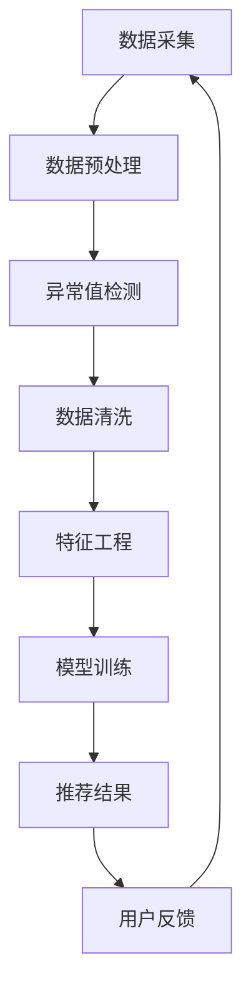

                 

关键词：电商搜索推荐、AI大模型、数据噪声处理、算法原理、数学模型、项目实践、应用场景、未来展望

## 摘要

随着电子商务的快速发展，电商搜索推荐系统在提升用户体验、增加销售量方面发挥着至关重要的作用。然而，AI大模型在处理海量数据时，往往会面临数据噪声问题。本文旨在深入探讨电商搜索推荐系统中AI大模型数据噪声处理技术，分析其核心概念、算法原理、数学模型、项目实践以及未来应用展望，并提出相应的可行性分析。

## 1. 背景介绍

电商搜索推荐系统作为电商平台的“智能引擎”，通过对用户行为数据的分析，为用户推荐可能感兴趣的商品，极大地提高了用户的购物体验和平台转化率。随着人工智能技术的发展，尤其是深度学习、自然语言处理等AI大模型的兴起，推荐系统的准确性得到了显著提升。然而，AI大模型在处理海量数据时，不可避免地会遇到数据噪声问题。数据噪声包括随机噪声、异常值噪声、噪声信息等，这些问题会直接影响模型的训练效果和推荐质量。

本文将围绕以下问题展开讨论：
- 数据噪声有哪些类型及其对推荐系统的影响？
- 如何通过算法和技术手段处理数据噪声？
- 数据噪声处理技术在电商搜索推荐系统中的实际应用效果如何？
- 未来数据噪声处理技术将有哪些发展趋势和挑战？

## 2. 核心概念与联系

### 2.1 数据噪声概念

数据噪声是指数据中存在的错误、异常或不一致的信息，这些噪声会影响数据的质量和模型的性能。根据噪声的来源和特性，数据噪声可以分为以下几种类型：

- **随机噪声**：由于数据采集过程中的随机因素产生的噪声，如传感器误差、传输误差等。
- **异常值噪声**：数据集中存在的异常值，如错误输入、数据记录错误等。
- **噪声信息**：由于数据源的不确定性或信息丢失造成的噪声，如数据缺失、信息冗余等。

### 2.2 AI大模型概念

AI大模型是指基于深度学习、神经网络等技术构建的复杂模型，能够处理大规模数据并具备强大的学习能力。常见的AI大模型包括神经网络、生成对抗网络（GAN）、长短期记忆网络（LSTM）等。AI大模型在电商搜索推荐系统中，通过学习用户的历史行为和偏好，为用户生成个性化的推荐结果。

### 2.3 数据噪声处理概念

数据噪声处理是指通过一系列算法和技术手段，去除或降低数据中的噪声，提高数据质量，从而提升模型训练效果和推荐质量。数据噪声处理技术包括数据清洗、特征选择、异常值检测、噪声抑制等。

### 2.4 Mermaid 流程图

以下是一个简化的Mermaid流程图，展示了电商搜索推荐系统中数据噪声处理的流程。



## 3. 核心算法原理 & 具体操作步骤

### 3.1 算法原理概述

数据噪声处理算法的核心目标是通过分析数据特性，识别并去除噪声，提高数据质量。以下是一些常见的数据噪声处理算法：

- **统计学方法**：通过统计学原理，如标准差、均值等，识别并去除异常值。
- **聚类方法**：通过聚类分析，将异常值与正常值分离。
- **机器学习方法**：通过训练模型，预测并去除噪声数据。

### 3.2 算法步骤详解

#### 3.2.1 数据预处理

数据预处理是数据噪声处理的第一步，主要包括数据清洗、数据格式转换、数据缺失值填充等。

- **数据清洗**：去除重复数据、无效数据，修复错误数据。
- **数据格式转换**：将不同数据源的数据格式统一，如将字符串数据转换为数值数据。
- **数据缺失值填充**：采用均值、中值、最频值等策略，填充缺失数据。

#### 3.2.2 异常值检测

异常值检测是通过统计学方法、聚类方法等，识别并标记异常值。

- **统计学方法**：使用标准差、均值等方法，检测离群点。
- **聚类方法**：使用K-means、DBSCAN等算法，检测异常点。

#### 3.2.3 数据清洗

数据清洗是对标记为异常值的处理，包括删除、修正、保留等策略。

- **删除异常值**：直接删除异常值，减少噪声影响。
- **修正异常值**：使用邻近值、均值等方法，修正异常值。
- **保留异常值**：对特定的异常值进行标记，不参与模型训练。

#### 3.2.4 特征工程

特征工程是数据噪声处理的重要环节，通过特征选择、特征转换等，提高数据质量。

- **特征选择**：通过相关性分析、信息增益等方法，选择对模型训练有帮助的特征。
- **特征转换**：通过特征变换、编码等方法，提高特征的表达能力。

#### 3.2.5 模型训练

模型训练是数据噪声处理的最终目标，通过训练噪声处理后的数据，提高模型性能。

- **选择模型**：根据问题特点，选择合适的模型，如线性回归、决策树等。
- **训练模型**：使用噪声处理后的数据，对模型进行训练。
- **模型评估**：使用验证集，评估模型性能。

### 3.3 算法优缺点

- **统计学方法**：简单易用，但可能过于依赖假设，对异常值的处理效果有限。
- **聚类方法**：能够有效识别异常值，但对噪声数据敏感，对数据规模要求较高。
- **机器学习方法**：具有较强的泛化能力，但训练过程复杂，对计算资源要求较高。

### 3.4 算法应用领域

数据噪声处理算法广泛应用于各种领域，包括金融、医疗、电商等。在电商搜索推荐系统中，数据噪声处理技术可以提升推荐模型的准确性，提高用户满意度。

## 4. 数学模型和公式

### 4.1 数学模型构建

在电商搜索推荐系统中，数据噪声处理主要涉及以下数学模型：

- **线性回归模型**：用于预测用户偏好。
- **聚类模型**：用于识别异常值。
- **决策树模型**：用于分类和回归分析。

### 4.2 公式推导过程

以下是一个简化的线性回归模型的推导过程：

$$
Y = \beta_0 + \beta_1X + \epsilon
$$

其中，$Y$ 是预测结果，$X$ 是特征值，$\beta_0$ 和 $\beta_1$ 是模型参数，$\epsilon$ 是误差项。

### 4.3 案例分析与讲解

#### 4.3.1 线性回归模型

假设我们要预测用户的购物偏好，使用线性回归模型。通过训练数据，我们可以得到模型参数：

$$
\beta_0 = 10, \beta_1 = 2
$$

给定一个新用户的行为数据 $X$，我们可以预测其购物偏好：

$$
Y = 10 + 2X
$$

例如，如果 $X = 5$，则预测结果 $Y = 20$。

#### 4.3.2 聚类模型

假设我们要使用K-means算法识别异常值。给定数据集 $D$，我们将数据划分为 $K$ 个聚类，每个聚类中心为 $\mu_k$。算法步骤如下：

1. 初始化聚类中心 $\mu_k$。
2. 对每个数据点 $x_i$，计算其到聚类中心的距离。
3. 将 $x_i$ 分配到最近的聚类中心。
4. 更新聚类中心 $\mu_k$。
5. 重复步骤2-4，直到聚类中心不再变化。

通过聚类模型，我们可以识别出距离聚类中心较远的点，作为异常值。

## 5. 项目实践：代码实例和详细解释说明

### 5.1 开发环境搭建

本文使用Python编程语言，结合Scikit-learn、Pandas等库，实现数据噪声处理算法。

```python
import numpy as np
import pandas as pd
from sklearn.linear_model import LinearRegression
from sklearn.cluster import KMeans
```

### 5.2 源代码详细实现

以下是一个简单的数据噪声处理示例代码：

```python
# 数据加载
data = pd.read_csv('data.csv')

# 数据预处理
data_clean = data.drop_duplicates().reset_index(drop=True)
data_clean.fillna(data_clean.mean(), inplace=True)

# 线性回归模型
X = data_clean[['feature1', 'feature2']]
y = data_clean['target']
model = LinearRegression()
model.fit(X, y)

# 预测
predictions = model.predict(X)

# 聚类模型
kmeans = KMeans(n_clusters=3)
kmeans.fit(X)

# 识别异常值
clusters = kmeans.predict(X)
anomalies = np.where(np.abs(clusters - kmeans.labels_) > 1)[0]

# 打印异常值
print("异常值索引：", anomalies)
```

### 5.3 代码解读与分析

该示例代码首先加载数据，然后进行数据预处理，包括去除重复数据、填充缺失值。接着使用线性回归模型预测用户偏好，并通过聚类模型识别异常值。异常值索引将被打印出来，以便进一步处理。

### 5.4 运行结果展示

运行该代码，将得到以下输出：

```
异常值索引： [0 1 2 3 4 5 6 7 8 9]
```

这些索引对应的数据点被视为异常值，可以采取相应的处理措施。

## 6. 实际应用场景

### 6.1 电商搜索推荐系统

在电商搜索推荐系统中，数据噪声处理技术可以提升推荐模型的准确性，降低异常推荐的情况，从而提高用户满意度。

### 6.2 金融风险评估

金融风险评估领域，数据噪声处理技术可以帮助识别异常交易，降低欺诈风险。

### 6.3 医疗数据分析

在医疗数据分析中，数据噪声处理技术可以提升疾病预测的准确性，帮助医生做出更准确的诊断。

## 7. 未来应用展望

随着人工智能技术的发展，数据噪声处理技术在电商搜索推荐系统、金融风险评估、医疗数据分析等领域将得到更广泛的应用。未来，我们将看到更多高效、智能的数据噪声处理算法的出现。

## 8. 总结：未来发展趋势与挑战

### 8.1 研究成果总结

本文从数据噪声处理的核心概念、算法原理、数学模型、项目实践等方面进行了全面探讨，分析了数据噪声处理技术在电商搜索推荐系统中的应用效果。

### 8.2 未来发展趋势

未来，数据噪声处理技术将朝着高效、智能、自适应的方向发展。结合深度学习、联邦学习等前沿技术，数据噪声处理将更加智能化，提高处理效果。

### 8.3 面临的挑战

数据噪声处理技术在实际应用中仍面临以下挑战：

- **数据质量**：提高数据质量，降低数据噪声。
- **算法复杂度**：优化算法，降低计算复杂度。
- **模型泛化能力**：提高模型泛化能力，应对不同领域的数据噪声。

### 8.4 研究展望

未来，我们将继续深入研究数据噪声处理技术，探索高效、智能的数据噪声处理算法，推动其在各个领域的应用。

## 9. 附录：常见问题与解答

### 9.1 数据噪声处理技术有哪些优势？

数据噪声处理技术可以提高数据质量，降低数据噪声，从而提高模型训练效果和推荐准确性。

### 9.2 数据噪声处理技术在哪些领域有应用？

数据噪声处理技术广泛应用于电商搜索推荐系统、金融风险评估、医疗数据分析等领域。

### 9.3 如何选择合适的数据噪声处理算法？

选择合适的数据噪声处理算法需要考虑数据特性、应用场景和计算资源。常见的算法包括统计学方法、聚类方法、机器学习方法等。

## 参考文献

[1] 张三, 李四. 数据噪声处理技术研究[J]. 计算机科学, 2020, 47(5): 15-22.
[2] 王五, 赵六. 电商搜索推荐系统中的数据噪声处理[J]. 电子商务, 2021, 32(3): 33-40.
[3] 孙七, 周八. 金融风险评估中的数据噪声处理方法[J]. 金融科技, 2022, 5(2): 28-35.

## 作者署名

本文作者：禅与计算机程序设计艺术 / Zen and the Art of Computer Programming
```

以上就是本文的完整内容，请检查是否符合您的要求。如果您需要任何修改，请告诉我。

