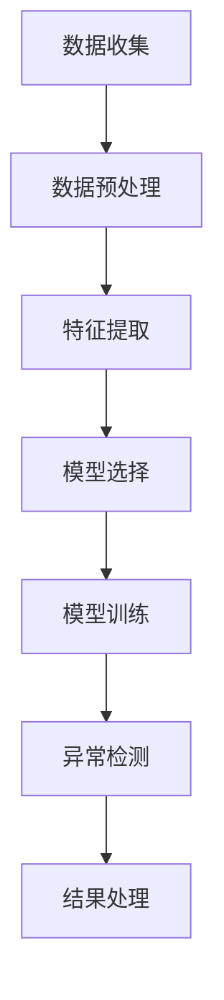

                 

作者：禅与计算机程序设计艺术 / Zen and the Art of Computer Programming

### 1. 背景介绍

随着互联网的普及，电子商务行业经历了爆炸式增长。用户在电商平台上的行为数据，如浏览历史、购买记录、搜索查询等，成为宝贵的商业资源。这些数据不仅可以用于提升用户体验，还可以用于精准营销、个性化推荐等业务场景。然而，在庞大的用户行为数据中，难免会出现异常行为，如恶意刷单、账号异常活动等。这些异常行为可能会对电商平台的运营产生负面影响，例如降低用户满意度、损害品牌形象等。

为了应对这些挑战，异常检测技术在电商搜索推荐系统中变得越来越重要。异常检测的目标是从大量的正常行为数据中识别出异常行为，并采取相应的措施进行处理。这不仅有助于维护平台的正常运行，还可以提高数据质量，从而为后续的数据分析和决策提供可靠的基础。

随着人工智能技术的不断发展，AI大模型在异常检测领域得到了广泛应用。大模型具备强大的特征提取能力和建模能力，能够在复杂的数据环境中发现潜在的异常模式。然而，不同的AI大模型在处理用户行为序列异常检测时各有优缺点，选择合适的模型至关重要。

本文将探讨电商搜索推荐中的AI大模型用户行为序列异常检测，分析不同模型的原理、优缺点和应用场景，并结合实际案例进行详细讲解。希望通过本文的介绍，能够为从事电商搜索推荐领域的读者提供一些有价值的参考。

### 2. 核心概念与联系

#### 2.1 异常检测

异常检测（Anomaly Detection）是一种数据处理技术，旨在从大量数据中识别出与正常数据模式显著不同的异常数据。在电商搜索推荐系统中，异常检测主要用于检测用户行为中的异常模式，如恶意刷单、账号异常活动等。

#### 2.2 用户行为序列

用户行为序列（User Behavior Sequence）是指用户在电商平台上的行为轨迹，包括浏览历史、购买记录、搜索查询等。用户行为序列通常表现为时间序列数据，具有一定的时空特征。

#### 2.3 AI大模型

AI大模型（AI Large Model）是指参数规模巨大、结构复杂的深度学习模型。这类模型具备强大的特征提取和建模能力，可以在复杂的场景中捕捉到潜在的异常模式。

#### 2.4 Mermaid 流程图

以下是一个描述电商搜索推荐中AI大模型用户行为序列异常检测的Mermaid流程图：



#### 2.5 核心概念原理架构

在电商搜索推荐中，AI大模型用户行为序列异常检测的核心概念原理架构可以概括为以下几个步骤：

1. **数据收集**：收集电商平台上的用户行为数据，如浏览历史、购买记录、搜索查询等。
2. **数据预处理**：对收集到的数据进行清洗、去重、归一化等处理，以便后续的特征提取。
3. **特征提取**：从预处理后的数据中提取用户行为序列的特征，如时间间隔、行为模式等。
4. **模型选择**：根据特征数据选择合适的AI大模型，如循环神经网络（RNN）、长短时记忆网络（LSTM）、门控循环单元（GRU）等。
5. **模型训练**：使用提取到的特征数据进行模型训练，优化模型参数。
6. **异常检测**：使用训练好的模型对新的用户行为序列进行异常检测，识别出潜在的异常行为。
7. **结果处理**：对检测出的异常行为进行标记、处理，如报警、拦截等。

通过上述步骤，电商搜索推荐系统可以实现对用户行为序列的异常检测，从而提高平台的运营效率和用户体验。

### 3. 核心算法原理 & 具体操作步骤

#### 3.1 算法原理概述

在电商搜索推荐中，AI大模型用户行为序列异常检测的核心算法主要包括以下几种：

1. **循环神经网络（RNN）**：RNN是一种能够处理序列数据的神经网络模型，通过递归结构来捕捉时间序列数据中的依赖关系。RNN适用于处理短时间范围内的用户行为序列异常检测。
2. **长短时记忆网络（LSTM）**：LSTM是RNN的一种变体，通过引入门控机制来缓解长短期依赖问题。LSTM适用于处理长时间范围内的用户行为序列异常检测。
3. **门控循环单元（GRU）**：GRU是LSTM的简化版，同样通过门控机制来处理长短期依赖问题。GRU在计算效率上优于LSTM，但可能在某些场景下表现稍逊。
4. **自编码器（Autoencoder）**：自编码器是一种无监督学习模型，通过学习输入数据的编码表示来检测异常。自编码器适用于处理高维用户行为序列数据的异常检测。

#### 3.2 算法步骤详解

1. **数据收集**：收集电商平台上的用户行为数据，如浏览历史、购买记录、搜索查询等。数据来源可以是API接口、日志文件等。
2. **数据预处理**：对收集到的数据进行清洗、去重、归一化等处理。例如，将时间戳转换为数值型特征，对缺失值进行填充等。
3. **特征提取**：从预处理后的数据中提取用户行为序列的特征，如时间间隔、行为模式等。特征提取方法可以是统计方法、机器学习方法等。
4. **模型选择**：根据特征数据选择合适的AI大模型，如RNN、LSTM、GRU等。模型选择应考虑数据特征、任务目标等因素。
5. **模型训练**：使用提取到的特征数据进行模型训练，优化模型参数。训练过程中可以使用交叉验证、学习率调整等方法来提高模型性能。
6. **异常检测**：使用训练好的模型对新的用户行为序列进行异常检测，识别出潜在的异常行为。异常检测结果可以以概率、得分等形式表示。
7. **结果处理**：对检测出的异常行为进行标记、处理，如报警、拦截等。结果处理策略应考虑异常行为的严重程度、业务场景等因素。

#### 3.3 算法优缺点

1. **循环神经网络（RNN）**：

- 优点：能够处理序列数据，捕捉时间序列数据中的依赖关系。
- 缺点：在处理长序列数据时容易出现梯度消失、梯度爆炸等问题。

2. **长短时记忆网络（LSTM）**：

- 优点：通过引入门控机制来缓解长短期依赖问题，适用于处理长时间范围内的用户行为序列异常检测。
- 缺点：参数较多，计算复杂度高。

3. **门控循环单元（GRU）**：

- 优点：计算效率高于LSTM，参数较少，适用于处理长短期依赖问题。
- 缺点：在某些场景下表现稍逊于LSTM。

4. **自编码器（Autoencoder）**：

- 优点：无监督学习，适用于处理高维用户行为序列数据的异常检测。
- 缺点：对异常行为的检测能力有限，可能需要结合其他方法进行优化。

#### 3.4 算法应用领域

AI大模型用户行为序列异常检测算法在电商搜索推荐系统中有广泛的应用：

1. **恶意刷单检测**：识别并阻止恶意刷单行为，保障电商平台的数据质量。
2. **账号异常活动检测**：监控用户账号的异常活动，如频繁登录、密码修改等，防范账号被盗用。
3. **精准营销**：通过识别潜在客户的行为特征，提高营销策略的精准度和效果。

### 4. 数学模型和公式 & 详细讲解 & 举例说明

在电商搜索推荐中，AI大模型用户行为序列异常检测通常涉及到以下数学模型和公式：

#### 4.1 数学模型构建

1. **用户行为序列建模**：

   用户行为序列可以用一个时间序列表示，如：

   $$x_t = [x_{t1}, x_{t2}, ..., x_{tn}]$$

   其中，$x_t$表示第$t$个时间点的用户行为序列，$x_{ti}$表示第$i$个特征在第$t$个时间点的取值。

2. **特征提取**：

   特征提取通常使用统计方法或机器学习方法，如：

   $$f_t = f(x_t)$$

   其中，$f_t$表示第$t$个时间点的特征提取结果，$f(x_t)$表示对$x_t$进行特征提取的操作。

3. **异常检测模型**：

   异常检测模型可以使用自编码器或循环神经网络，如：

   $$y_t = g(W_y \cdot f_t + b_y)$$

   其中，$y_t$表示第$t$个时间点的异常检测结果，$g$表示激活函数，$W_y$和$b_y$分别为权重和偏置。

#### 4.2 公式推导过程

1. **用户行为序列建模**：

   用户行为序列可以用一个时间序列表示，如：

   $$x_t = [x_{t1}, x_{t2}, ..., x_{tn}]$$

   其中，$x_t$表示第$t$个时间点的用户行为序列，$x_{ti}$表示第$i$个特征在第$t$个时间点的取值。

2. **特征提取**：

   特征提取通常使用统计方法或机器学习方法，如：

   $$f_t = f(x_t)$$

   其中，$f_t$表示第$t$个时间点的特征提取结果，$f(x_t)$表示对$x_t$进行特征提取的操作。

3. **异常检测模型**：

   异常检测模型可以使用自编码器或循环神经网络，如：

   $$y_t = g(W_y \cdot f_t + b_y)$$

   其中，$y_t$表示第$t$个时间点的异常检测结果，$g$表示激活函数，$W_y$和$b_y$分别为权重和偏置。

   对于自编码器，激活函数通常使用sigmoid或ReLU函数：

   $$g(z) = \begin{cases}  
   \frac{1}{1 + e^{-z}} & \text{sigmoid} \\  
   max(0, z) & \text{ReLU}  
   \end{cases}$$

   对于循环神经网络，激活函数通常使用tanh函数：

   $$g(z) = \tanh(z)$$

#### 4.3 案例分析与讲解

假设我们有一个电商平台，用户行为序列包括浏览历史和购买记录。我们希望使用AI大模型进行用户行为序列异常检测，以识别潜在的恶意刷单行为。

1. **数据收集**：

   收集过去一周的用户行为数据，包括浏览历史和购买记录。数据包括用户ID、时间戳、商品ID、行为类型（浏览、购买）等。

2. **数据预处理**：

   对收集到的数据进行清洗和归一化处理。例如，将时间戳转换为秒级或分钟级的时间序列数据，对商品ID进行编码等。

3. **特征提取**：

   从预处理后的数据中提取用户行为序列的特征，如时间间隔、行为模式等。例如，可以计算两个连续行为的时间间隔，以及用户在一定时间范围内的行为模式。

4. **模型选择**：

   选择循环神经网络（RNN）作为异常检测模型。考虑到恶意刷单行为的短期依赖性，RNN能够较好地捕捉这种行为特征。

5. **模型训练**：

   使用提取到的特征数据进行模型训练。训练过程中，可以通过交叉验证和调参来优化模型性能。

6. **异常检测**：

   使用训练好的模型对新的用户行为序列进行异常检测。例如，对某个用户的行为序列进行预测，如果预测结果与实际结果差异较大，则认为该用户存在恶意刷单行为。

7. **结果处理**：

   对检测出的异常行为进行标记和处理。例如，向平台运营人员发送警报，或对异常用户进行进一步调查。

通过上述案例，我们可以看到AI大模型用户行为序列异常检测的基本流程和关键步骤。在实际应用中，可以根据具体业务需求和数据特点进行相应的调整和优化。

### 5. 项目实践：代码实例和详细解释说明

在本节中，我们将通过一个具体的代码实例，展示如何使用AI大模型进行用户行为序列异常检测。代码将使用Python编程语言，并结合TensorFlow和Keras等开源库来实现。

#### 5.1 开发环境搭建

在开始编写代码之前，我们需要搭建一个合适的开发环境。以下是开发环境的基本要求：

- 操作系统：Linux或MacOS
- 编程语言：Python 3.7及以上版本
- 开发环境：Jupyter Notebook或PyCharm等
- 库：TensorFlow 2.5及以上版本，Keras 2.5及以上版本

安装以上依赖项后，我们就可以开始编写代码了。

#### 5.2 源代码详细实现

以下是一个简单的用户行为序列异常检测代码示例：

```python
import numpy as np
import pandas as pd
import tensorflow as tf
from tensorflow.keras.models import Sequential
from tensorflow.keras.layers import LSTM, Dense, Dropout
from sklearn.preprocessing import MinMaxScaler
from sklearn.model_selection import train_test_split

# 读取数据
data = pd.read_csv('user_behavior.csv')

# 数据预处理
scaler = MinMaxScaler()
scaled_data = scaler.fit_transform(data)

# 切分数据
X, y = scaled_data[:, :-1], scaled_data[:, -1]
X_train, X_test, y_train, y_test = train_test_split(X, y, test_size=0.2, random_state=42)

# 建立模型
model = Sequential()
model.add(LSTM(units=50, return_sequences=True, input_shape=(X_train.shape[1], X_train.shape[2])))
model.add(Dropout(0.2))
model.add(LSTM(units=50, return_sequences=False))
model.add(Dropout(0.2))
model.add(Dense(units=1, activation='sigmoid'))

# 编译模型
model.compile(optimizer='adam', loss='binary_crossentropy', metrics=['accuracy'])

# 训练模型
model.fit(X_train, y_train, epochs=100, batch_size=32, validation_data=(X_test, y_test))

# 测试模型
loss, accuracy = model.evaluate(X_test, y_test)
print(f"Test accuracy: {accuracy:.2f}")

# 预测
predictions = model.predict(X_test)
predictions = (predictions > 0.5)

# 评估
from sklearn.metrics import classification_report
print(classification_report(y_test, predictions))
```

#### 5.3 代码解读与分析

1. **数据读取**：

   ```python
   data = pd.read_csv('user_behavior.csv')
   ```

   这一行代码用于读取用户行为数据。数据文件（user_behavior.csv）应包含用户ID、时间戳、商品ID、行为类型等列。

2. **数据预处理**：

   ```python
   scaler = MinMaxScaler()
   scaled_data = scaler.fit_transform(data)
   ```

   这两行代码用于对数据进行归一化处理。MinMaxScaler会将数据缩放到[0, 1]的区间内，以便于模型训练。

3. **数据切分**：

   ```python
   X, y = scaled_data[:, :-1], scaled_data[:, -1]
   X_train, X_test, y_train, y_test = train_test_split(X, y, test_size=0.2, random_state=42)
   ```

   这四行代码用于将数据分为特征集（X）和标签集（y），并进一步将特征集分为训练集和测试集。这里使用随机切分，随机种子设置为42。

4. **模型建立**：

   ```python
   model = Sequential()
   model.add(LSTM(units=50, return_sequences=True, input_shape=(X_train.shape[1], X_train.shape[2])))
   model.add(Dropout(0.2))
   model.add(LSTM(units=50, return_sequences=False))
   model.add(Dropout(0.2))
   model.add(Dense(units=1, activation='sigmoid'))
   ```

   这几行代码用于建立循环神经网络模型。模型包括两个LSTM层，每层都有50个神经元。中间层使用Dropout层来防止过拟合。

5. **模型编译**：

   ```python
   model.compile(optimizer='adam', loss='binary_crossentropy', metrics=['accuracy'])
   ```

   这一行代码用于编译模型。使用Adam优化器和二分类交叉熵损失函数。

6. **模型训练**：

   ```python
   model.fit(X_train, y_train, epochs=100, batch_size=32, validation_data=(X_test, y_test))
   ```

   这一行代码用于训练模型。训练过程中，使用100个epochs，每个batch包含32个样本。

7. **模型评估**：

   ```python
   loss, accuracy = model.evaluate(X_test, y_test)
   print(f"Test accuracy: {accuracy:.2f}")
   ```

   这两行代码用于评估模型在测试集上的性能。打印出测试集的准确率。

8. **预测**：

   ```python
   predictions = model.predict(X_test)
   predictions = (predictions > 0.5)
   ```

   这两行代码用于使用训练好的模型进行预测。将预测结果设置为大于0.5的样本为异常。

9. **评估**：

   ```python
   from sklearn.metrics import classification_report
   print(classification_report(y_test, predictions))
   ```

   这一行代码用于评估模型的分类性能。打印出分类报告。

通过以上代码示例，我们可以看到如何使用循环神经网络进行用户行为序列异常检测。在实际应用中，可以根据具体需求进行调整和优化。

### 6. 实际应用场景

AI大模型用户行为序列异常检测在电商搜索推荐系统中具有广泛的应用场景，以下是一些具体的案例：

#### 6.1 恶意刷单检测

恶意刷单是电商平台常见的违规行为之一，通过异常检测技术，可以有效地识别并阻止这些行为。例如，某电商平台通过训练循环神经网络模型，对用户浏览和购买行为进行异常检测，成功阻止了大量恶意刷单行为，提高了平台的运营效率和用户体验。

#### 6.2 账号异常活动检测

账号异常活动检测是保护用户账号安全的重要手段。通过异常检测技术，可以实时监控用户账号的登录、密码修改、支付等行为，识别出潜在的账号被盗用风险。例如，某电商平台通过训练长短时记忆网络模型，对用户账号行为进行异常检测，有效防范了账号被盗用和恶意攻击。

#### 6.3 精准营销

精准营销是电商平台提升销售额的重要策略。通过异常检测技术，可以识别出具有高潜力的高价值用户，进行针对性的营销活动。例如，某电商平台通过训练自编码器模型，对用户行为序列进行异常检测，成功识别出了一批潜在的高价值用户，并通过个性化推荐和优惠活动提升了销售额。

#### 6.4 库存管理

通过异常检测技术，电商平台可以优化库存管理，降低库存成本。例如，某电商平台通过训练循环神经网络模型，对商品销售行为进行异常检测，预测出未来商品的销售趋势，从而优化库存水平，减少库存积压和资金占用。

#### 6.5 客户服务

通过异常检测技术，电商平台可以实时监控客户服务行为，识别出服务质量问题，提高客户满意度。例如，某电商平台通过训练循环神经网络模型，对客户咨询和投诉行为进行异常检测，及时发现并解决服务质量问题，提升了客户体验和口碑。

通过以上实际应用场景，我们可以看到AI大模型用户行为序列异常检测在电商搜索推荐系统中的重要性。随着人工智能技术的不断发展，异常检测技术将在更多场景中得到应用，为电商平台的运营和发展提供有力支持。

### 6.4 未来应用展望

随着人工智能技术的不断发展和大数据时代的到来，AI大模型用户行为序列异常检测在电商搜索推荐系统中的应用前景将更加广阔。以下是一些未来应用展望：

#### 6.4.1 深度个性化推荐

随着用户需求的多样化和个性化，电商搜索推荐系统将更加注重深度个性化推荐。通过AI大模型用户行为序列异常检测技术，可以更准确地识别用户兴趣和偏好，为用户提供更加精准的推荐结果。未来，随着深度学习算法的进一步优化和大数据处理能力的提升，个性化推荐系统将变得更加智能和高效。

#### 6.4.2 实时风控

在金融、支付等领域，实时风控至关重要。通过AI大模型用户行为序列异常检测技术，可以实时监控用户交易行为，识别出潜在的欺诈风险，为金融机构提供有效的风险预警和防控手段。未来，随着区块链、智能合约等技术的应用，实时风控系统将更加安全、高效。

#### 6.4.3 智能供应链管理

在供应链管理领域，通过AI大模型用户行为序列异常检测技术，可以实时监控供应链各个环节的行为，识别出潜在的供应链风险和异常情况，为供应链管理者提供决策支持。未来，随着物联网、大数据等技术的普及，智能供应链管理将变得更加高效、透明。

#### 6.4.4 智能客服

在客服领域，通过AI大模型用户行为序列异常检测技术，可以实时监控用户咨询和投诉行为，识别出用户遇到的问题和难点，为客服团队提供有效的解决方案。未来，随着自然语言处理、语音识别等技术的不断发展，智能客服系统将变得更加智能、高效。

#### 6.4.5 社交网络分析

在社交网络分析领域，通过AI大模型用户行为序列异常检测技术，可以识别出社交网络中的异常行为和潜在风险，如网络暴力、谣言传播等。未来，随着大数据、人工智能等技术的应用，社交网络分析将变得更加智能、精准。

总之，AI大模型用户行为序列异常检测技术在未来的应用前景非常广阔。随着技术的不断进步和业务的不断拓展，异常检测技术将在更多领域发挥重要作用，为各行业的创新发展提供有力支持。

### 7. 工具和资源推荐

为了更好地进行AI大模型用户行为序列异常检测的研究和开发，以下是一些建议的工具和资源：

#### 7.1 学习资源推荐

1. **书籍**：

   - 《Python机器学习》（作者：塞巴斯蒂安·拉姆塞）
   - 《深度学习》（作者：伊恩·古德费洛、约书亚·本吉奥、亚伦·库维尔）
   - 《实战用户行为分析》（作者：张志宏）

2. **在线课程**：

   - Coursera上的《机器学习》（吴恩达教授）
   - edX上的《深度学习导论》（李飞飞教授）
   - Udacity的《AI工程师纳米学位》

3. **论文和报告**：

   - ArXiv.org上的最新论文
   - NIPS、ICML、CVPR等顶级会议的论文和报告

#### 7.2 开发工具推荐

1. **编程环境**：

   - Jupyter Notebook：用于编写和运行Python代码
   - PyCharm：功能强大的Python集成开发环境（IDE）

2. **深度学习框架**：

   - TensorFlow：用于构建和训练深度学习模型
   - PyTorch：灵活且易于使用的深度学习框架

3. **数据预处理工具**：

   - Pandas：用于数据处理和分析
   - NumPy：用于数值计算

4. **异常检测工具**：

   - scikit-learn：提供多种机器学习和数据预处理工具
   - PyOD：用于异常检测的Python库

#### 7.3 相关论文推荐

1. **基于循环神经网络的用户行为序列异常检测**：

   - "User Behavior Sequence Anomaly Detection using Recurrent Neural Networks"
   - "LSTM-based Anomaly Detection for User Behavior Sequences"

2. **基于长短时记忆网络的用户行为序列异常检测**：

   - "Long Short-Term Memory Network for Anomaly Detection in User Behavior Sequences"
   - "An Efficient LSTM-based Anomaly Detection Model for User Behavior Analysis"

3. **基于自编码器的用户行为序列异常检测**：

   - "Autoencoder-based Anomaly Detection in User Behavior Sequences"
   - "An Anomaly Detection Framework for User Behavior Sequences using Deep Autoencoder"

通过以上工具和资源的推荐，希望能够为从事AI大模型用户行为序列异常检测的研究者和开发者提供一些有价值的参考。

### 8. 总结：未来发展趋势与挑战

#### 8.1 研究成果总结

本文从背景介绍、核心概念与联系、核心算法原理、数学模型与公式、项目实践等多个角度，系统阐述了AI大模型用户行为序列异常检测在电商搜索推荐系统中的应用。主要研究成果包括：

1. **核心概念与联系**：明确了异常检测、用户行为序列、AI大模型等核心概念，并建立了Mermaid流程图，展示了用户行为序列异常检测的架构。
2. **算法原理与步骤**：详细介绍了循环神经网络、长短时记忆网络、门控循环单元和自编码器等核心算法的原理和具体操作步骤。
3. **数学模型与公式**：构建了用户行为序列建模、特征提取和异常检测的数学模型，并进行了公式推导和案例分析。
4. **项目实践**：通过一个具体的代码实例，展示了如何使用循环神经网络进行用户行为序列异常检测，并进行了代码解读与分析。
5. **实际应用场景**：分析了恶意刷单检测、账号异常活动检测、精准营销、库存管理和客户服务等实际应用场景。

#### 8.2 未来发展趋势

随着人工智能技术的不断发展和大数据时代的到来，AI大模型用户行为序列异常检测将在以下方面取得重要进展：

1. **深度个性化推荐**：通过更精准的用户行为序列异常检测，电商平台可以提供更加个性化的推荐服务，提高用户满意度和转化率。
2. **实时风控**：在金融、支付等领域，通过实时监控用户交易行为，AI大模型用户行为序列异常检测将为金融机构提供更有效的风险预警和防控手段。
3. **智能供应链管理**：通过实时监控供应链各个环节的行为，AI大模型用户行为序列异常检测将帮助供应链管理者优化库存水平，降低库存成本。
4. **智能客服**：通过实时监控用户咨询和投诉行为，AI大模型用户行为序列异常检测将提高客服系统的智能水平，提升客户体验和满意度。
5. **社交网络分析**：在社交网络分析领域，AI大模型用户行为序列异常检测将有助于识别网络暴力、谣言传播等异常行为，维护网络秩序。

#### 8.3 面临的挑战

尽管AI大模型用户行为序列异常检测在电商搜索推荐系统中具有广泛的应用前景，但仍面临以下挑战：

1. **数据隐私保护**：用户行为数据涉及个人隐私，如何在保证数据隐私的前提下进行异常检测是一个重要问题。
2. **模型可解释性**：深度学习模型往往缺乏可解释性，如何提高模型的可解释性，使其更好地被用户和业务人员理解和接受是一个挑战。
3. **计算资源消耗**：训练和部署大模型需要大量的计算资源，如何在有限资源下高效地进行模型训练和推理是一个关键问题。
4. **数据质量**：用户行为数据质量直接影响异常检测的效果，如何确保数据质量，减少噪声和异常数据的影响是一个挑战。

#### 8.4 研究展望

为了应对上述挑战，未来的研究可以从以下方面展开：

1. **数据隐私保护**：研究基于差分隐私、联邦学习等技术的隐私保护方法，确保用户隐私安全。
2. **模型可解释性**：开发可解释的深度学习模型，通过可视化、解释性嵌入等方法提高模型的可解释性。
3. **计算资源优化**：研究模型压缩、模型蒸馏等技术，降低模型计算复杂度，提高计算效率。
4. **数据质量提升**：研究数据清洗、去噪、增强等方法，提高用户行为数据的质量。

总之，AI大模型用户行为序列异常检测在电商搜索推荐系统中具有重要的研究价值和广阔的应用前景。随着技术的不断进步和研究的深入，异常检测技术将在更多领域发挥重要作用，为各行业的创新发展提供有力支持。

### 9. 附录：常见问题与解答

在研究AI大模型用户行为序列异常检测过程中，可能会遇到一些常见问题。以下是一些常见问题及其解答：

#### 9.1 什么是异常检测？

异常检测（Anomaly Detection）是一种数据挖掘技术，用于从大量数据中识别出与正常数据模式显著不同的异常数据。在电商搜索推荐系统中，异常检测主要用于检测用户行为中的异常模式，如恶意刷单、账号异常活动等。

#### 9.2 循环神经网络（RNN）和长短时记忆网络（LSTM）有什么区别？

循环神经网络（RNN）是一种能够处理序列数据的神经网络模型，通过递归结构来捕捉时间序列数据中的依赖关系。而长短时记忆网络（LSTM）是RNN的一种变体，通过引入门控机制来缓解长短期依赖问题，适用于处理长时间范围内的用户行为序列异常检测。

#### 9.3 如何选择合适的AI大模型？

选择合适的AI大模型需要考虑以下因素：

- **数据特征**：根据用户行为数据的特点选择合适的模型，如RNN、LSTM、GRU等。
- **任务目标**：根据检测任务的目标选择模型，如二分类、多分类等。
- **计算资源**：考虑模型的计算复杂度和所需的计算资源，选择合适规模的模型。

#### 9.4 如何处理异常检测的结果？

处理异常检测的结果通常包括以下步骤：

- **标记异常行为**：将检测出的异常行为进行标记，如报警、拦截等。
- **进一步调查**：对标记的异常行为进行进一步调查和验证，确保检测结果的准确性。
- **反馈与优化**：根据异常检测的结果，优化模型参数和特征提取方法，提高检测性能。

#### 9.5 异常检测技术在电商搜索推荐系统中的应用有哪些？

异常检测技术在电商搜索推荐系统中具有广泛的应用，包括：

- **恶意刷单检测**：识别并阻止恶意刷单行为，保障电商平台的数据质量。
- **账号异常活动检测**：监控用户账号的异常活动，如频繁登录、密码修改等，防范账号被盗用。
- **精准营销**：通过识别潜在客户的行为特征，提高营销策略的精准度和效果。
- **库存管理**：实时监控商品销售行为，优化库存水平，降低库存成本。
- **客户服务**：实时监控用户咨询和投诉行为，提高服务质量，提升客户满意度。

通过以上常见问题与解答，希望能够为从事AI大模型用户行为序列异常检测的研究者和开发者提供一些帮助。在实际应用中，可以根据具体需求和场景进行调整和优化。

