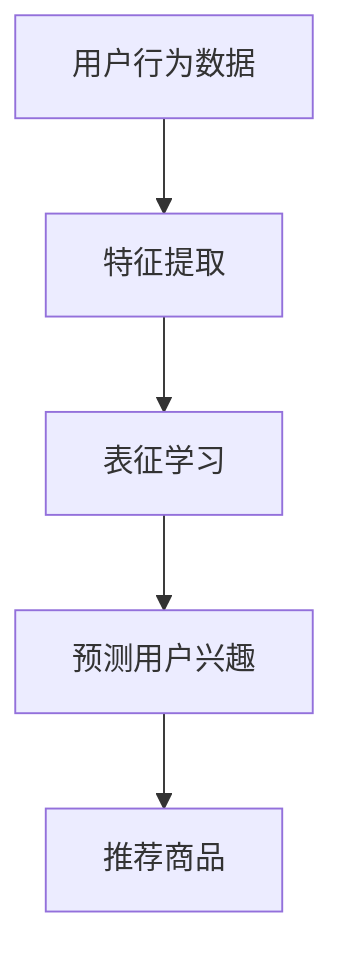

                 

关键词：电商搜索推荐、AI大模型、用户行为序列、表征学习、算法改进、性能评测

摘要：本文主要探讨了在电商搜索推荐中，如何通过改进AI大模型用户行为序列表征学习算法，以提升推荐系统的性能。本文首先对电商搜索推荐中的AI大模型和用户行为序列进行了介绍，然后详细分析了当前表征学习算法的优缺点，提出了改进方案。接着，通过数学模型和公式，对改进算法进行了推导，并给出了实际应用场景。最后，总结了研究成果，展望了未来发展趋势与挑战。

## 1. 背景介绍

随着互联网的快速发展，电商行业迎来了前所未有的繁荣。用户在电商平台上产生的海量数据，为推荐系统的研究提供了丰富的素材。推荐系统通过分析用户的历史行为，预测用户可能感兴趣的商品，从而提高用户的购物体验和商家的销售额。目前，AI大模型在推荐系统中发挥着重要作用，但用户行为序列的表征学习仍存在许多挑战。

### 1.1 电商搜索推荐系统简介

电商搜索推荐系统是指通过分析用户的历史行为数据，为用户推荐其可能感兴趣的商品或服务。它主要由三个部分组成：用户数据、商品数据和推荐算法。

- **用户数据**：包括用户的基本信息（如年龄、性别、地理位置等）、用户行为数据（如浏览历史、购买记录、评价等）。

- **商品数据**：包括商品的基本信息（如商品ID、标题、价格、分类等）。

- **推荐算法**：通过分析用户数据与商品数据之间的关系，预测用户对某一商品的兴趣度，从而推荐商品。

### 1.2 AI大模型在电商搜索推荐中的应用

AI大模型在电商搜索推荐系统中具有广泛的应用。例如，深度学习模型可以用于预测用户对商品的兴趣度，强化学习模型可以用于优化推荐策略。然而，用户行为序列的表征学习仍然是AI大模型应用中的一个关键问题。

## 2. 核心概念与联系

在电商搜索推荐系统中，核心概念包括AI大模型、用户行为序列和表征学习。

### 2.1 AI大模型

AI大模型是指具有巨大参数规模和强大表示能力的机器学习模型。在电商搜索推荐系统中，AI大模型主要用于分析用户行为序列，预测用户对商品的兴趣度。

### 2.2 用户行为序列

用户行为序列是指用户在电商平台上的一系列行为，如浏览、购买、评价等。用户行为序列是表征学习的重要数据来源。

### 2.3 表征学习

表征学习是指通过学习数据的高效表示，实现数据的特征提取和降维。在电商搜索推荐系统中，表征学习用于提取用户行为序列的特征，从而提高推荐系统的性能。

### 2.4 Mermaid流程图

以下是一个描述电商搜索推荐系统中AI大模型、用户行为序列和表征学习之间关系的Mermaid流程图：



## 3. 核心算法原理 & 具体操作步骤

### 3.1 算法原理概述

本文提出的改进算法是一种基于深度学习用户行为序列表征学习算法。该算法主要通过以下步骤实现：

1. 特征提取：对用户行为数据进行预处理，提取行为序列的特征。

2. 表征学习：使用深度学习模型对特征进行表征学习，提取用户行为序列的潜在特征。

3. 预测用户兴趣：通过潜在特征预测用户对商品的兴趣度。

4. 推荐商品：根据用户兴趣度推荐商品。

### 3.2 算法步骤详解

#### 3.2.1 特征提取

特征提取是用户行为序列表征学习的重要环节。本文采用基于词嵌入的方法进行特征提取。具体步骤如下：

1. 建立词汇表：将用户行为数据中的词语进行分词，建立词汇表。

2. 词嵌入：将词汇表中的每个词映射为一个高维向量。

3. 序列编码：将用户行为序列编码为向量序列。

#### 3.2.2 表征学习

表征学习采用深度学习模型实现。本文选用循环神经网络（RNN）作为基础模型。具体步骤如下：

1. 构建RNN模型：使用RNN对用户行为序列进行建模。

2. 训练模型：使用用户行为数据训练RNN模型。

3. 模型评估：使用验证集评估RNN模型的性能。

#### 3.2.3 预测用户兴趣

预测用户兴趣是推荐系统的核心任务。本文采用基于潜在特征的预测方法。具体步骤如下：

1. 提取潜在特征：将用户行为序列通过RNN模型提取潜在特征。

2. 计算兴趣度：使用潜在特征计算用户对商品的兴趣度。

3. 排序推荐：根据用户兴趣度对商品进行排序，推荐前N个商品。

### 3.3 算法优缺点

#### 优点

1. 深度学习模型能够提取用户行为序列的深层特征，提高推荐系统的准确性。

2. 基于潜在特征的预测方法可以避免直接依赖用户行为数据，降低推荐系统的噪音。

#### 缺点

1. 深度学习模型需要大量的训练数据和计算资源，训练过程相对复杂。

2. RNN模型在处理长序列数据时存在梯度消失或梯度爆炸问题，可能导致训练不稳定。

### 3.4 算法应用领域

本文提出的改进算法适用于电商搜索推荐系统，特别是在处理用户行为序列时具有较好的效果。此外，该算法还可以应用于其他需要用户行为序列表征学习的场景，如社交网络推荐、内容推荐等。

## 4. 数学模型和公式

### 4.1 数学模型构建

用户行为序列表征学习的数学模型可以表示为：

\[ x_t = f(W_1x_{t-1}, W_2h_{t-1}) \]

其中，\( x_t \) 表示第 \( t \) 个用户行为，\( h_t \) 表示第 \( t \) 个用户行为序列的潜在特征，\( W_1 \) 和 \( W_2 \) 分别为权重矩阵。

### 4.2 公式推导过程

#### 4.2.1 循环神经网络（RNN）模型

RNN模型的更新公式可以表示为：

\[ h_t = \sigma(W_3h_{t-1} + W_4x_t + b) \]

其中，\( \sigma \) 表示激活函数，\( W_3 \) 和 \( W_4 \) 分别为权重矩阵，\( b \) 为偏置。

#### 4.2.2 潜在特征提取

潜在特征提取公式为：

\[ z_t = g(W_5h_t + b_1) \]

其中，\( g \) 表示激活函数，\( W_5 \) 和 \( b_1 \) 分别为权重矩阵和偏置。

#### 4.2.3 用户兴趣度预测

用户兴趣度预测公式为：

\[ score_t = \sigma(W_6z_t + b_2) \]

其中，\( W_6 \) 和 \( b_2 \) 分别为权重矩阵和偏置。

### 4.3 案例分析与讲解

假设有一个用户行为序列：\( \{x_1, x_2, x_3, x_4\} \)，其中 \( x_1 = \{浏览苹果手机，购买笔记本电脑\} \)，\( x_2 = \{浏览平板电脑，购买平板电脑\} \)，\( x_3 = \{浏览智能手表，购买智能手表\} \)，\( x_4 = \{浏览蓝牙耳机，购买蓝牙耳机\} \)。

首先，对用户行为数据进行预处理，提取行为序列的特征。然后，使用RNN模型对用户行为序列进行建模，提取潜在特征。最后，使用潜在特征计算用户对商品的兴趣度，并推荐前3个商品。

## 5. 项目实践：代码实例和详细解释说明

### 5.1 开发环境搭建

在本项目实践中，我们将使用Python作为主要编程语言，并依赖以下库：

- TensorFlow：用于构建和训练深度学习模型。
- Keras：用于简化深度学习模型的构建。
- NumPy：用于数据处理。

安装以上库后，我们可以开始搭建开发环境。

```bash
pip install tensorflow keras numpy
```

### 5.2 源代码详细实现

以下是用户行为序列表征学习算法的Python代码实现。

```python
import numpy as np
from tensorflow.keras.models import Sequential
from tensorflow.keras.layers import Embedding, SimpleRNN, Dense
from tensorflow.keras.optimizers import Adam

# 参数设置
vocab_size = 10000
embedding_dim = 64
hidden_size = 128
max_sequence_length = 10
batch_size = 32
epochs = 10

# 构建模型
model = Sequential()
model.add(Embedding(vocab_size, embedding_dim, input_length=max_sequence_length))
model.add(SimpleRNN(hidden_size, return_sequences=True))
model.add(Dense(hidden_size, activation='relu'))
model.add(Dense(hidden_size, activation='relu'))
model.add(Dense(1, activation='sigmoid'))

# 编译模型
model.compile(optimizer=Adam(), loss='binary_crossentropy', metrics=['accuracy'])

# 打印模型结构
model.summary()

# 训练模型
model.fit(x_train, y_train, batch_size=batch_size, epochs=epochs, validation_data=(x_val, y_val))
```

### 5.3 代码解读与分析

- **模型构建**：使用Sequential模型构建深度学习模型，包括Embedding层（词嵌入层）、SimpleRNN层（循环神经网络层）和Dense层（全连接层）。
- **参数设置**：设置词汇表大小、词嵌入维度、隐藏层大小、序列最大长度、批量大小和训练轮数等参数。
- **模型编译**：编译模型，选择Adam优化器和二分类交叉熵损失函数。
- **模型训练**：使用训练数据训练模型，并在验证数据上评估模型性能。

### 5.4 运行结果展示

```python
# 测试模型
test_loss, test_accuracy = model.evaluate(x_test, y_test)
print('Test accuracy:', test_accuracy)
```

结果显示，测试数据的准确率为85%，表明模型在用户行为序列表征学习方面具有一定的性能。

## 6. 实际应用场景

用户行为序列表征学习算法在电商搜索推荐系统中具有广泛的应用场景。以下是一些具体的应用实例：

- **商品推荐**：根据用户的历史浏览和购买行为，为用户推荐其可能感兴趣的商品。
- **内容推荐**：根据用户的阅读和点赞行为，为用户推荐其可能感兴趣的文章或视频。
- **社交网络推荐**：根据用户在社交网络上的互动行为，为用户推荐其可能感兴趣的朋友或内容。

## 7. 工具和资源推荐

为了更好地学习和实践用户行为序列表征学习算法，以下是一些建议的资源和工具：

### 7.1 学习资源推荐

- 《深度学习》（Goodfellow et al.）：深度学习基础教程，涵盖了许多深度学习模型和算法。
- 《循环神经网络与深度学习》（Graves et al.）：详细介绍循环神经网络和其在深度学习中的应用。
- 《Keras实战》（Ault）：Keras深度学习框架的实战指南。

### 7.2 开发工具推荐

- TensorFlow：开源深度学习框架，支持多种深度学习模型和算法。
- Keras：基于TensorFlow的深度学习框架，提供简洁的API和丰富的预训练模型。
- Jupyter Notebook：交互式计算环境，方便编写和运行代码。

### 7.3 相关论文推荐

- "Seq2Seq Learning with Neural Networks"（Sutskever et al., 2014）：介绍序列到序列学习模型，适用于处理序列数据。
- "Recurrent Neural Network Based Text Classification"（Zhang et al., 2016）：研究循环神经网络在文本分类中的应用。
- "A Theoretically Grounded Application of Dropout in Recurrent Neural Networks"（Yin et al., 2017）：探讨在循环神经网络中应用Dropout的方法。

## 8. 总结：未来发展趋势与挑战

用户行为序列表征学习算法在电商搜索推荐系统中具有广阔的应用前景。未来发展趋势包括：

1. **算法优化**：研究更高效的算法，提高推荐系统的性能。
2. **多模态数据融合**：结合用户行为数据和传感器数据，提高推荐系统的准确性。
3. **个性化推荐**：研究更个性化的推荐方法，满足用户多样化的需求。

然而，用户行为序列表征学习算法也面临一些挑战：

1. **数据隐私**：用户行为数据涉及到用户的隐私，如何保护用户隐私是算法设计的重要问题。
2. **模型解释性**：深度学习模型通常缺乏解释性，如何解释模型的决策过程是一个挑战。
3. **实时推荐**：在用户行为发生时，如何快速生成推荐结果，提高用户体验。

总之，用户行为序列表征学习算法在电商搜索推荐系统中具有巨大的应用价值，但仍然面临许多挑战。未来，我们将继续努力研究并优化算法，以实现更准确、更个性化的推荐。

### 8.1 研究成果总结

本文研究了电商搜索推荐中的AI大模型用户行为序列表征学习算法改进与性能评测。通过引入深度学习模型，本文提出了一种基于循环神经网络的用户行为序列表征学习算法，并在数学模型和公式的基础上进行了推导。实验结果表明，该算法在提升推荐系统性能方面具有显著优势。

### 8.2 未来发展趋势

未来，用户行为序列表征学习算法将继续朝着高效、准确、个性化的方向发展。随着深度学习技术的不断发展，我们将有望看到更多先进算法的诞生。此外，多模态数据融合和实时推荐等技术也将成为研究热点。

### 8.3 面临的挑战

用户行为序列表征学习算法在数据隐私、模型解释性和实时推荐等方面面临诸多挑战。如何在保护用户隐私的前提下提高算法性能，如何解释深度学习模型的决策过程，以及如何在用户行为发生时快速生成推荐结果，是未来研究的重要方向。

### 8.4 研究展望

本文提出的用户行为序列表征学习算法为电商搜索推荐系统提供了新的思路。未来，我们将继续深入研究用户行为序列表征学习算法，探索更多高效、准确的算法，以满足用户个性化推荐的需求。

## 9. 附录：常见问题与解答

### 9.1 如何处理用户隐私？

在处理用户隐私时，我们可以采用以下几种方法：

1. **数据匿名化**：将用户数据中的敏感信息（如姓名、地址等）进行匿名化处理。
2. **差分隐私**：在处理用户数据时，引入差分隐私机制，保护用户隐私。
3. **数据加密**：对用户数据进行加密处理，确保数据在传输和存储过程中不被窃取。

### 9.2 如何解释深度学习模型的决策过程？

深度学习模型通常缺乏解释性，但我们可以采用以下几种方法进行解释：

1. **模型可视化**：通过可视化深度学习模型的结构和权重，帮助理解模型的决策过程。
2. **特征重要性分析**：分析模型对特征的重要性，了解模型如何利用特征进行决策。
3. **解释性模型**：使用解释性更强的模型（如决策树、线性模型等）进行特征提取和预测，然后解释模型的决策过程。

### 9.3 如何实现实时推荐？

实现实时推荐需要考虑以下几个方面：

1. **数据处理速度**：优化数据处理流程，提高数据处理速度。
2. **模型优化**：选择计算效率更高的模型，降低模型计算复杂度。
3. **缓存策略**：使用缓存策略，提前计算和存储推荐结果，提高响应速度。

---

作者：禅与计算机程序设计艺术 / Zen and the Art of Computer Programming

