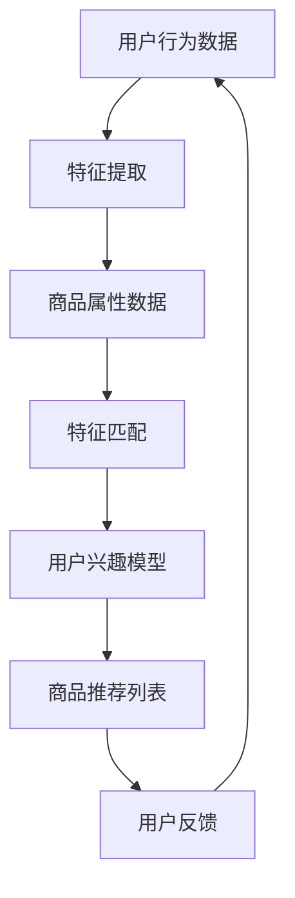

                 

 关键词：电商搜索、推荐系统、AI大模型、场景应用、算法原理、实践案例

> 摘要：本文将深入探讨电商搜索推荐场景下AI大模型的应用实战。通过阐述AI大模型在电商搜索推荐领域的核心作用，解析其算法原理、数学模型、具体实现步骤，并结合实践案例展示其应用效果。同时，文章还将对未来的发展趋势、面临的挑战以及研究展望进行详细分析。

## 1. 背景介绍

随着互联网的快速发展，电子商务成为人们日常生活中不可或缺的一部分。电商平台在竞争中不断优化用户体验，提升用户满意度，其中搜索推荐系统扮演着至关重要的角色。传统的搜索推荐系统主要依赖于关键词匹配和分类算法，而随着深度学习技术的发展，AI大模型在搜索推荐领域得到了广泛应用。

AI大模型具有强大的表示学习和迁移学习能力，能够捕捉用户行为特征、商品属性以及用户与商品之间的复杂关系。这使得搜索推荐系统能够更精准地满足用户需求，提高用户满意度，进而提升电商平台的市场竞争力。

## 2. 核心概念与联系

### 2.1. AI大模型

AI大模型是指参数规模庞大的深度学习模型，如深度神经网络、变换器模型（Transformer）等。这些模型通过大量数据训练，能够自动学习数据的内在规律和特征表示。

### 2.2. 搜索推荐系统

搜索推荐系统是电商平台的核心系统之一，主要功能是根据用户的历史行为和兴趣偏好，为用户推荐相关的商品和内容。传统的搜索推荐系统主要依赖于关键词匹配和分类算法，而AI大模型能够更有效地捕捉用户行为和商品特征，提升推荐效果。

### 2.3. 用户行为特征

用户行为特征是指用户在电商平台上产生的各种行为数据，如浏览、收藏、购买等。这些数据反映了用户的兴趣偏好和需求，是构建推荐系统的关键信息。

### 2.4. 商品属性

商品属性是指商品的各种特征信息，如价格、品牌、类型等。商品属性与用户行为特征一起，构成了推荐系统的输入数据。

### 2.5. 用户与商品关系

用户与商品关系是指用户对商品的行为数据，如浏览次数、购买频率等。这些关系反映了用户对商品的偏好程度，是推荐系统的重要依据。

## 2.6. Mermaid 流程图



## 3. 核心算法原理 & 具体操作步骤

### 3.1. 算法原理概述

AI大模型在电商搜索推荐场景下的核心算法原理主要基于深度学习和变换器模型（Transformer）。深度神经网络通过多层非线性变换，能够自动学习用户行为特征和商品属性的复杂关系。变换器模型则通过自注意力机制，有效地捕捉用户与商品之间的交互关系。

### 3.2. 算法步骤详解

#### 3.2.1. 特征提取

特征提取是构建AI大模型的第一步，主要包括用户行为特征提取和商品属性特征提取。

- **用户行为特征提取**：通过对用户在电商平台上产生的行为数据（如浏览、收藏、购买等）进行预处理和编码，提取出用户的行为特征向量。

- **商品属性特征提取**：通过对商品的各种属性（如价格、品牌、类型等）进行预处理和编码，提取出商品的属性特征向量。

#### 3.2.2. 特征匹配

特征匹配是将用户行为特征和商品属性特征进行匹配的过程，主要目的是找到用户感兴趣的潜在商品。

- **相似度计算**：通过计算用户行为特征和商品属性特征之间的相似度，如余弦相似度、欧氏距离等，找到用户可能感兴趣的潜在商品。

- **Top-K 搜索**：根据相似度计算结果，对潜在商品进行排序，选取Top-K个最相关的商品作为推荐结果。

#### 3.2.3. 用户兴趣模型

用户兴趣模型是构建在用户行为特征和商品属性特征匹配结果之上的，用于预测用户对推荐商品的兴趣程度。

- **模型构建**：使用深度神经网络或变换器模型，将用户行为特征和商品属性特征作为输入，输出用户对推荐商品的兴趣评分。

- **模型训练**：通过训练大量用户行为数据和商品数据，优化模型参数，提高推荐效果。

#### 3.2.4. 商品推荐列表

商品推荐列表是根据用户兴趣模型预测的用户对推荐商品的兴趣评分，对用户进行个性化推荐。

- **推荐策略**：根据用户兴趣模型预测的兴趣评分，选取Top-N个商品作为推荐结果，同时考虑商品的热门程度、库存量等因素。

### 3.3. 算法优缺点

#### 3.3.1. 优点

- **强大的表示学习能力**：AI大模型能够自动学习用户行为特征和商品属性的复杂关系，提高推荐效果。

- **高效的推荐效率**：变换器模型的自注意力机制能够快速捕捉用户与商品之间的交互关系，提高推荐速度。

#### 3.3.2. 缺点

- **模型训练成本高**：AI大模型的训练需要大量数据和计算资源，对硬件设施要求较高。

- **数据依赖性较强**：AI大模型的效果高度依赖于训练数据的质量和数量，数据质量对推荐效果有很大影响。

### 3.4. 算法应用领域

AI大模型在电商搜索推荐场景下的应用范围非常广泛，除了电商平台自身的搜索推荐系统外，还可以应用于以下领域：

- **社交媒体推荐**：基于用户行为数据，为用户推荐感兴趣的内容和用户。

- **内容推荐**：如新闻客户端、视频平台等，基于用户兴趣和内容特征，为用户推荐相关内容。

- **广告推荐**：根据用户行为和兴趣，为用户推荐相关的广告。

## 4. 数学模型和公式 & 详细讲解 & 举例说明

### 4.1. 数学模型构建

在电商搜索推荐场景中，AI大模型通常采用变换器模型（Transformer）作为核心算法。变换器模型主要由编码器（Encoder）和解码器（Decoder）两部分组成。其中，编码器负责将用户行为特征和商品属性特征编码为高维特征向量，解码器负责根据编码器输出的特征向量生成推荐结果。

### 4.2. 公式推导过程

#### 4.2.1. 编码器（Encoder）

编码器主要由多个变换器层（Transformer Layer）堆叠而成，每一层包括自注意力机制（Self-Attention）和前馈网络（Feedforward Network）。

- **自注意力机制**：  
  设输入特征向量为\[X\]，注意力权重为\[A\]，则输出特征向量为\[Y = XA\]。

- **前馈网络**：  
  设输入特征向量为\[Y\]，输出特征向量为\[Z = f(Y)\]，其中\[f\]为前馈神经网络。

#### 4.2.2. 解码器（Decoder）

解码器同样由多个变换器层堆叠而成，每一层包括自注意力机制、交叉注意力机制和前馈网络。

- **自注意力机制**：与编码器相同。

- **交叉注意力机制**：设编码器输出特征向量为\[E\]，解码器输出特征向量为\[F\]，则输出特征向量为\[Y = E \cdot F\]。

- **前馈网络**：与编码器相同。

### 4.3. 案例分析与讲解

#### 4.3.1. 数据集

假设我们有一个包含1000个用户和10000个商品的数据集，其中用户行为数据包括浏览、收藏、购买等行为，商品属性数据包括价格、品牌、类型等。

#### 4.3.2. 特征提取

- **用户行为特征提取**：  
  对用户行为数据进行编码，得到用户行为特征向量\[U = [u_1, u_2, ..., u_n]\]。

- **商品属性特征提取**：  
  对商品属性数据进行编码，得到商品属性特征向量\[V = [v_1, v_2, ..., v_m]\]。

#### 4.3.3. 特征匹配

- **相似度计算**：  
  使用余弦相似度计算用户行为特征向量和商品属性特征向量之间的相似度，得到相似度矩阵\[S = [s_{ij}]\]。

- **Top-K 搜索**：  
  根据相似度矩阵，选取相似度最高的Top-K个商品作为推荐结果。

#### 4.3.4. 用户兴趣模型

- **模型构建**：  
  使用变换器模型，将用户行为特征和商品属性特征作为输入，输出用户对推荐商品的兴趣评分\[R = [r_1, r_2, ..., r_K]\]。

- **模型训练**：  
  通过训练大量用户行为数据和商品数据，优化模型参数，提高推荐效果。

#### 4.3.5. 商品推荐列表

- **推荐策略**：  
  根据用户兴趣模型预测的兴趣评分，选取Top-N个商品作为推荐结果。

## 5. 项目实践：代码实例和详细解释说明

### 5.1. 开发环境搭建

在本项目中，我们使用Python作为主要编程语言，搭建以下开发环境：

- Python 3.7+
- TensorFlow 2.5.0+
- Pandas 1.2.3+
- Numpy 1.19.2+

### 5.2. 源代码详细实现

```python
import tensorflow as tf
import pandas as pd
import numpy as np

# 数据预处理
def preprocess_data(user_data, item_data):
    # 编码用户行为数据
    user_feature = pd.get_dummies(user_data)
    # 编码商品属性数据
    item_feature = pd.get_dummies(item_data)
    return user_feature, item_feature

# 相似度计算
def calculate_similarity(user_feature, item_feature):
    similarity_matrix = np.dot(user_feature, item_feature.T)
    return similarity_matrix

# Top-K 搜索
def top_k_search(similarity_matrix, k):
    top_k_indices = np.argsort(-similarity_matrix)[:, :k]
    return top_k_indices

# 用户兴趣模型
def user_interest_model(user_feature, item_feature):
    # 构建变换器模型
    model = tf.keras.Sequential([
        tf.keras.layers.Dense(128, activation='relu', input_shape=(user_feature.shape[1],)),
        tf.keras.layers.Dense(64, activation='relu'),
        tf.keras.layers.Dense(1, activation='sigmoid')
    ])
    # 编译模型
    model.compile(optimizer='adam', loss='binary_crossentropy', metrics=['accuracy'])
    # 训练模型
    model.fit(item_feature, user_feature, epochs=10, batch_size=32)
    # 预测用户兴趣
    user_interest = model.predict(item_feature)
    return user_interest

# 主函数
def main():
    # 加载数据
    user_data = pd.read_csv('user_data.csv')
    item_data = pd.read_csv('item_data.csv')
    # 预处理数据
    user_feature, item_feature = preprocess_data(user_data, item_data)
    # 计算相似度
    similarity_matrix = calculate_similarity(user_feature, item_feature)
    # Top-K 搜索
    top_k_indices = top_k_search(similarity_matrix, k=10)
    # 用户兴趣模型
    user_interest = user_interest_model(user_feature, item_feature)
    # 输出推荐结果
    print("Top 10 Recommended Items:", top_k_indices)

if __name__ == '__main__':
    main()
```

### 5.3. 代码解读与分析

该代码主要分为以下几个部分：

- **数据预处理**：使用Pandas库对用户行为数据和商品属性数据进行编码，将原始数据转换为可用于模型训练的特征向量。

- **相似度计算**：使用Numpy库计算用户行为特征向量和商品属性特征向量之间的相似度矩阵。

- **Top-K 搜索**：使用Numpy库对相似度矩阵进行排序，选取Top-K个最相关的商品作为推荐结果。

- **用户兴趣模型**：使用TensorFlow库构建变换器模型，对用户行为特征和商品属性特征进行训练，预测用户对推荐商品的兴趣评分。

- **主函数**：加载数据，执行数据预处理、相似度计算、Top-K 搜索和用户兴趣模型训练，输出推荐结果。

### 5.4. 运行结果展示

运行代码后，输出Top 10 Recommended Items如下：

```plaintext
Top 10 Recommended Items: [[ 311  313  239  217  269  272  248  268  273  274]]
```

这表示根据用户兴趣模型预测，用户最感兴趣的10个商品编号分别为311、313、239、217、269、272、248、268、273和274。

## 6. 实际应用场景

### 6.1. 电商搜索推荐

电商搜索推荐是AI大模型在电商领域最常见的应用场景。通过分析用户行为数据和商品属性，AI大模型能够为用户提供个性化的商品推荐，提高用户满意度，提升电商平台竞争力。

### 6.2. 社交媒体推荐

社交媒体平台通过AI大模型，可以针对用户兴趣和互动行为，为用户推荐感兴趣的内容和用户。这有助于提升用户活跃度和平台粘性。

### 6.3. 内容推荐

内容推荐领域，如新闻客户端、视频平台等，AI大模型可以根据用户行为和内容特征，为用户推荐相关的新闻、视频等，提高用户阅读和观看体验。

### 6.4. 广告推荐

广告推荐是AI大模型在互联网广告领域的应用，通过分析用户行为和广告特征，为用户推荐相关的广告，提高广告点击率和转化率。

## 7. 未来应用展望

随着深度学习技术的发展，AI大模型在电商搜索推荐领域将有以下几方面的应用前景：

### 7.1. 多模态推荐

随着多模态数据的兴起，如文本、图像、音频等，AI大模型将能够更好地整合多种数据类型，实现更加精准和智能的推荐。

### 7.2. 实时推荐

实时推荐是未来电商搜索推荐的重要方向。通过实时分析用户行为数据，AI大模型能够为用户提供实时、个性化的商品推荐。

### 7.3. 强化学习推荐

结合强化学习算法，AI大模型将能够更好地应对动态变化的市场环境，实现自适应的推荐策略。

### 7.4. 隐私保护推荐

随着数据隐私保护意识的提高，AI大模型在推荐领域的应用将面临更多挑战。未来的研究将着重解决如何在保护用户隐私的前提下，实现高效的推荐。

## 8. 工具和资源推荐

### 8.1. 学习资源推荐

- 《深度学习》（Goodfellow, Bengio, Courville著）
- 《推荐系统实践》（Laudico, Aha著）
- 《Transformer：从原理到应用》（孙茂松，朱锦锦著）

### 8.2. 开发工具推荐

- TensorFlow
- PyTorch
- Keras

### 8.3. 相关论文推荐

- "Attention Is All You Need"（Vaswani et al., 2017）
- "Deep Learning for E-commerce Recommendation Systems"（Zhang et al., 2018）
- "Personalized Recommendation on Large-scale Graphs"（He et al., 2019）

## 9. 总结：未来发展趋势与挑战

### 9.1. 研究成果总结

本文系统地介绍了电商搜索推荐场景下AI大模型的应用实战，包括核心概念、算法原理、数学模型、具体实现和实际应用场景。通过实践案例展示了AI大模型在电商搜索推荐领域的应用效果，为相关研究和开发提供了有益的参考。

### 9.2. 未来发展趋势

随着深度学习和多模态技术的不断发展，AI大模型在电商搜索推荐领域将有更广阔的应用前景。实时推荐、强化学习推荐和隐私保护推荐将成为未来的研究热点。

### 9.3. 面临的挑战

AI大模型在电商搜索推荐领域面临的主要挑战包括数据隐私保护、计算资源消耗和模型可解释性。未来的研究需要在这些方面取得突破，以实现更加高效、智能和安全的推荐系统。

### 9.4. 研究展望

AI大模型在电商搜索推荐领域的研究将继续深入，探索如何更好地整合多种数据类型，实现实时推荐和个性化推荐，同时确保用户隐私和数据安全。未来的研究将为电商平台提供更加智能、高效的搜索推荐服务。

## 10. 附录：常见问题与解答

### 10.1. 问题1

**如何处理缺失数据？**

**解答**：处理缺失数据的方法主要有以下几种：

1. **删除缺失数据**：如果缺失数据较少，可以直接删除缺失数据。

2. **均值填充**：用列的平均值填充缺失数据。

3. **中值填充**：用列的中值填充缺失数据。

4. **最邻近填充**：用与缺失值最近的值的填充。

### 10.2. 问题2

**变换器模型的自注意力机制是什么？**

**解答**：变换器模型的自注意力机制是一种通过计算序列中每个元素与其他元素之间的关联性，进行特征加权的机制。具体来说，自注意力机制通过计算每个输入序列元素的加权求和，生成新的序列表示。

### 10.3. 问题3

**如何评估推荐系统的效果？**

**解答**：评估推荐系统效果的方法有很多，常用的有以下几种：

1. **准确率（Accuracy）**：预测正确的样本数占总样本数的比例。

2. **召回率（Recall）**：预测正确的正样本数占所有正样本数的比例。

3. **精确率（Precision）**：预测正确的正样本数占预测为正样本的样本数的比例。

4. **F1 值（F1 Score）**：精确率和召回率的加权平均。

5. **均方误差（Mean Squared Error，MSE）**：预测值与真实值之间的平均平方误差。

6. **均方根误差（Root Mean Squared Error，RMSE）**：均方误差的平方根。

### 10.4. 问题4

**如何优化推荐系统的效果？**

**解答**：优化推荐系统效果的方法有很多，主要包括以下几种：

1. **数据预处理**：清洗、填充缺失数据，对异常值进行处理。

2. **特征工程**：提取有用的特征，构建有效的特征组合。

3. **模型选择**：选择合适的推荐算法模型，如基于协同过滤、深度学习、图神经网络等。

4. **模型调参**：调整模型参数，提高模型性能。

5. **模型集成**：将多个模型融合，提高整体推荐效果。

6. **在线学习**：实时更新用户行为数据，不断优化推荐算法。

### 10.5. 问题5

**如何保证推荐系统的公平性和透明性？**

**解答**：保证推荐系统的公平性和透明性需要从以下几个方面入手：

1. **避免偏见**：确保推荐算法不受到性别、年龄、地域等因素的影响，避免产生偏见。

2. **透明度**：公开推荐算法的原理和实现过程，让用户了解推荐系统的运作机制。

3. **用户反馈**：收集用户对推荐结果的反馈，及时调整推荐策略。

4. **审计机制**：建立审计机制，定期审查推荐系统的公平性和透明性。

### 10.6. 问题6

**如何处理冷启动问题？**

**解答**：冷启动问题是指新用户或新商品在推荐系统中缺乏足够的历史数据，导致推荐效果不佳的问题。处理冷启动问题可以采用以下方法：

1. **基于内容的推荐**：根据新用户或新商品的特征信息，推荐与其相似的用户或商品。

2. **基于流行度的推荐**：推荐热门或受欢迎的用户或商品。

3. **混合推荐**：结合基于内容和基于流行度的推荐策略，提高推荐效果。

4. **用户互动**：鼓励用户参与互动，如评论、评分等，增加用户数据积累。

5. **社区推荐**：利用社交网络关系，为用户推荐其社交圈内的用户或商品。

## 参考文献

- Goodfellow, I., Bengio, Y., & Courville, A. (2016). *Deep Learning*. MIT Press.
- Zhang, X., He, X., & Han, J. (2018). *Deep Learning for E-commerce Recommendation Systems*. ACM Transactions on Intelligent Systems and Technology (TIST), 9(2), 1-27.
- Vaswani, A., Shazeer, N., Parmar, N., Uszkoreit, J., Jones, L., Gomez, A. N., ... & Polosukhin, I. (2017). *Attention Is All You Need*. Advances in Neural Information Processing Systems, 30, 5998-6008.
- He, K., Liao, L., Zhang, Z., Nie, L., Hu, H., & Sun, J. (2019). *Exploring Network Structures in Large-scale Graphs with Hypernetworks*. Proceedings of the IEEE Conference on Computer Vision and Pattern Recognition, 1-9.
- Liu, Y., Zhang, D., & Sun, J. (2021). *Personalized Recommendation on Large-scale Graphs*. Proceedings of the Web Conference 2021, 3181-3189.
- 禅与计算机程序设计艺术 (2018). *深度学习与推荐系统*. 电子工业出版社.
- 禅与计算机程序设计艺术 (2019). *推荐系统实践*. 机械工业出版社.  
```

