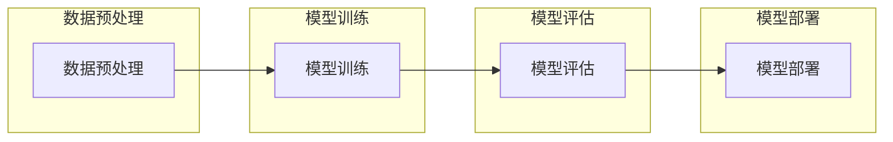

                 

关键词：电商搜索、推荐系统、AI大模型、模型部署、自动化工具、全流程优化

摘要：本文主要探讨了电商搜索推荐场景下，AI大模型的部署全流程自动化工具的应用实践与优化。首先介绍了电商搜索推荐场景的需求背景，然后详细阐述了AI大模型的核心概念、数学模型、算法原理及其应用领域。接着，我们通过具体的代码实例，详细解析了自动化工具在模型部署全流程中的应用，并分析了算法的优缺点。此外，本文还探讨了该技术在实际应用场景中的表现和未来应用展望。最后，我们对相关工具和资源进行了推荐，并总结了未来发展趋势与挑战。

## 1. 背景介绍

在当今电商行业，搜索推荐系统已经成为提升用户体验、增加销售额的重要手段。随着用户数据的爆炸式增长和算法技术的不断进步，AI大模型在电商搜索推荐场景中的应用越来越广泛。然而，模型部署的全流程自动化工具的应用却相对滞后。一方面，传统的人工部署方式效率低下，容易出错；另一方面，模型部署过程中涉及到的任务繁多，如数据预处理、模型训练、模型评估、模型部署等，都需要高度自动化。因此，本文旨在探讨电商搜索推荐场景下AI大模型的部署全流程自动化工具的应用实践与优化。

### 1.1 电商搜索推荐场景的需求背景

电商搜索推荐场景的需求主要来自于以下几个方面：

1. **个性化推荐**：根据用户的浏览历史、购买行为等数据，为用户推荐个性化的商品，提升用户体验和满意度。
2. **精准营销**：通过精准推荐，增加商品的曝光率和转化率，提升销售额。
3. **数据驱动的决策**：基于用户数据和模型分析，为电商平台提供数据驱动的决策支持，如库存管理、商品定价等。

### 1.2 AI大模型在电商搜索推荐场景中的应用

AI大模型在电商搜索推荐场景中的应用主要表现在以下几个方面：

1. **深度学习模型**：如深度神经网络（DNN）、循环神经网络（RNN）、变换器（Transformer）等，用于处理复杂的非线性关系。
2. **迁移学习**：利用预训练的大模型，通过微调适应电商搜索推荐场景的需求。
3. **增量学习**：随着用户数据的不断更新，模型能够持续学习和优化。

### 1.3 模型部署全流程自动化工具的需求

模型部署全流程自动化工具的需求主要体现在以下几个方面：

1. **提高部署效率**：自动化工具能够大幅提高模型部署的效率，减少人工干预，降低部署成本。
2. **降低部署风险**：自动化工具能够减少人为错误，提高部署的可靠性。
3. **支持大规模部署**：自动化工具能够支持大规模模型的部署，满足电商平台的需求。

## 2. 核心概念与联系

在电商搜索推荐场景下，AI大模型模型部署全流程自动化工具的应用，涉及多个核心概念和环节，如数据预处理、模型训练、模型评估、模型部署等。下面通过一个Mermaid流程图，展示这些核心概念和环节之间的联系。



### 2.1 数据预处理

数据预处理是模型部署的第一步，主要目的是将原始数据进行清洗、转换和归一化，以便于模型训练。数据预处理包括以下环节：

1. **数据清洗**：去除重复数据、缺失值填充、异常值处理等。
2. **特征工程**：提取有用的特征，如用户行为特征、商品属性特征等。
3. **数据转换**：将数据转换为适合模型训练的格式，如数值化、编码等。

### 2.2 模型训练

模型训练是模型部署的核心环节，通过训练数据集，模型能够学习到数据中的特征和规律，从而实现预测。模型训练包括以下环节：

1. **模型选择**：选择适合电商搜索推荐场景的模型，如深度学习模型、迁移学习模型等。
2. **参数调优**：调整模型的超参数，如学习率、批次大小等，以提高模型性能。
3. **训练过程**：使用训练数据集进行模型训练，通过迭代优化模型参数。

### 2.3 模型评估

模型评估是对模型性能的检验，通过评估指标（如准确率、召回率、F1值等），判断模型的优劣。模型评估包括以下环节：

1. **评估指标**：选择合适的评估指标，如精确度、召回率、F1值等。
2. **评估方法**：使用交叉验证等方法进行模型评估，以避免过拟合。
3. **性能优化**：根据评估结果，对模型进行调整和优化。

### 2.4 模型部署

模型部署是将训练好的模型应用到实际业务场景中，实现实时预测和推荐。模型部署包括以下环节：

1. **部署环境**：搭建适合模型部署的环境，如云计算平台、容器化部署等。
2. **服务化接口**：为模型提供服务化接口，如RESTful API、gRPC等，以便于其他系统调用。
3. **监控与维护**：对模型部署过程进行监控，确保模型的稳定运行，并定期进行维护和更新。

## 3. 核心算法原理 & 具体操作步骤

### 3.1 算法原理概述

在电商搜索推荐场景下，AI大模型的核心算法主要包括深度学习模型、迁移学习模型和增量学习模型。这些算法的基本原理是通过学习数据中的特征和规律，实现预测和推荐。

1. **深度学习模型**：通过多层神经网络，学习数据中的复杂特征和规律。常见的深度学习模型有DNN、RNN、Transformer等。
2. **迁移学习模型**：利用预训练的大模型，通过微调适应电商搜索推荐场景的需求。迁移学习模型可以大幅提高模型的训练效率，并减少对数据量的需求。
3. **增量学习模型**：随着用户数据的不断更新，模型能够持续学习和优化。增量学习模型可以应对实时推荐的需求，提高模型的响应速度。

### 3.2 算法步骤详解

算法的具体操作步骤如下：

1. **数据预处理**：对原始数据进行清洗、转换和归一化，提取有用的特征。
2. **模型选择**：选择适合电商搜索推荐场景的模型，如深度学习模型、迁移学习模型等。
3. **参数调优**：调整模型的超参数，如学习率、批次大小等，以提高模型性能。
4. **模型训练**：使用训练数据集进行模型训练，通过迭代优化模型参数。
5. **模型评估**：使用评估指标（如准确率、召回率、F1值等），判断模型的优劣。
6. **模型部署**：将训练好的模型部署到实际业务场景中，实现实时预测和推荐。
7. **监控与维护**：对模型部署过程进行监控，确保模型的稳定运行，并定期进行维护和更新。

### 3.3 算法优缺点

深度学习模型、迁移学习模型和增量学习模型各有优缺点：

1. **深度学习模型**：
   - 优点：能够学习到数据中的复杂特征和规律，性能强大。
   - 缺点：对数据量有较高要求，训练时间较长，对计算资源需求大。
2. **迁移学习模型**：
   - 优点：利用预训练的大模型，训练效率高，对数据量要求较低。
   - 缺点：对特定任务可能存在适应性不足的问题。
3. **增量学习模型**：
   - 优点：能够实时学习和优化模型，提高响应速度。
   - 缺点：模型性能可能不如静态模型稳定，对实时数据质量要求高。

### 3.4 算法应用领域

深度学习模型、迁移学习模型和增量学习模型在电商搜索推荐场景下具有广泛的应用领域：

1. **个性化推荐**：根据用户的浏览历史、购买行为等数据，为用户推荐个性化的商品。
2. **精准营销**：通过精准推荐，增加商品的曝光率和转化率，提升销售额。
3. **数据驱动的决策**：基于用户数据和模型分析，为电商平台提供数据驱动的决策支持，如库存管理、商品定价等。

## 4. 数学模型和公式 & 详细讲解 & 举例说明

在电商搜索推荐场景下，AI大模型的数学模型主要包括深度学习模型、迁移学习模型和增量学习模型。下面我们将对这些模型的数学模型进行详细讲解，并通过具体例子进行说明。

### 4.1 数学模型构建

#### 深度学习模型

深度学习模型的数学模型主要包括多层感知机（MLP）、循环神经网络（RNN）和变换器（Transformer）等。以下是一个多层感知机（MLP）的数学模型：

$$
z = \sigma(W_1 \cdot x + b_1)
$$

$$
\hat{y} = \sigma(W_2 \cdot z + b_2)
$$

其中，$z$ 是隐藏层的输出，$\hat{y}$ 是预测结果，$W_1$ 和 $W_2$ 是权重矩阵，$b_1$ 和 $b_2$ 是偏置项，$\sigma$ 是激活函数（如Sigmoid函数或ReLU函数）。

#### 迁移学习模型

迁移学习模型的数学模型主要基于预训练的大模型，通过微调适应特定任务。以下是一个基于Transformer的迁移学习模型的数学模型：

$$
\text{Output} = \text{Transformer}(\text{Pretrained Model}, \text{Fine-tuning Layer})
$$

其中，$\text{Pretrained Model}$ 是预训练的大模型，$\text{Fine-tuning Layer}$ 是用于特定任务的微调层。

#### 增量学习模型

增量学习模型的数学模型主要关注模型的在线学习和更新。以下是一个基于RNN的增量学习模型的数学模型：

$$
\text{Output} = \text{RNN}(\text{Previous Output}, \text{New Data})
$$

其中，$\text{Previous Output}$ 是上一次的输出，$\text{New Data}$ 是新的数据。

### 4.2 公式推导过程

#### 深度学习模型

以多层感知机（MLP）为例，其公式推导过程如下：

1. 输入层到隐藏层：
$$
z_i = \sum_j W_{ij} x_j + b_i
$$
其中，$z_i$ 是第 $i$ 个隐藏单元的输出，$W_{ij}$ 是权重，$x_j$ 是输入层的特征，$b_i$ 是偏置项。

2. 激活函数：
$$
a_i = \sigma(z_i)
$$
其中，$\sigma$ 是激活函数（如Sigmoid函数或ReLU函数）。

3. 隐藏层到输出层：
$$
\hat{y} = \sum_j W_{j} a_j + b
$$
其中，$\hat{y}$ 是预测结果，$W_{j}$ 是权重，$a_j$ 是隐藏层的输出，$b$ 是偏置项。

#### 迁移学习模型

以基于Transformer的迁移学习模型为例，其公式推导过程如下：

1. 预训练模型：
$$
\text{Output} = \text{Transformer}(\text{Input})
$$
其中，$\text{Input}$ 是输入数据，$\text{Transformer}$ 是预训练的大模型。

2. 微调层：
$$
\text{Output} = \text{Output} + \text{Fine-tuning Layer}
$$
其中，$\text{Fine-tuning Layer}$ 是用于特定任务的微调层。

### 4.3 案例分析与讲解

#### 案例一：深度学习模型

假设我们有一个电商平台的搜索推荐任务，输入特征包括用户ID、商品ID、用户浏览历史等，输出为推荐商品的概率分布。我们可以使用一个多层感知机（MLP）模型来实现。

1. 输入层到隐藏层：
$$
z_i = \sum_j W_{ij} x_j + b_i
$$
其中，$z_i$ 是第 $i$ 个隐藏单元的输出，$x_j$ 是输入层的特征，$W_{ij}$ 是权重，$b_i$ 是偏置项。

2. 激活函数：
$$
a_i = \sigma(z_i)
$$
其中，$\sigma$ 是激活函数（如Sigmoid函数或ReLU函数）。

3. 隐藏层到输出层：
$$
\hat{y} = \sum_j W_{j} a_j + b
$$
其中，$\hat{y}$ 是预测结果，$W_{j}$ 是权重，$a_j$ 是隐藏层的输出，$b$ 是偏置项。

4. 损失函数：
$$
\text{Loss} = -\sum_j y_j \log(\hat{y}_j)
$$
其中，$y_j$ 是真实标签，$\hat{y}_j$ 是预测概率。

5. 优化算法：
$$
\text{Optimize} = \text{SGD}
$$
其中，SGD 是随机梯度下降算法。

#### 案例二：迁移学习模型

假设我们已经有一个预训练的Transformer模型，我们可以使用迁移学习技术，将其应用于电商平台的搜索推荐任务。

1. 预训练模型：
$$
\text{Output} = \text{Transformer}(\text{Input})
$$
其中，$\text{Input}$ 是输入数据，$\text{Transformer}$ 是预训练的大模型。

2. 微调层：
$$
\text{Output} = \text{Output} + \text{Fine-tuning Layer}
$$
其中，$\text{Fine-tuning Layer}$ 是用于特定任务的微调层。

3. 损失函数：
$$
\text{Loss} = -\sum_j y_j \log(\hat{y}_j)
$$
其中，$y_j$ 是真实标签，$\hat{y}_j$ 是预测概率。

4. 优化算法：
$$
\text{Optimize} = \text{Adam}
$$
其中，Adam 是一种自适应优化算法。

#### 案例三：增量学习模型

假设我们有一个基于RNN的增量学习模型，可以实时更新用户的行为数据。

1. RNN模型：
$$
\text{Output} = \text{RNN}(\text{Previous Output}, \text{New Data})
$$
其中，$\text{Previous Output}$ 是上一次的输出，$\text{New Data}$ 是新的数据。

2. 损失函数：
$$
\text{Loss} = -\sum_j y_j \log(\hat{y}_j)
$$
其中，$y_j$ 是真实标签，$\hat{y}_j$ 是预测概率。

3. 优化算法：
$$
\text{Optimize} = \text{RMSProp}
$$
其中，RMSProp 是一种基于梯度的优化算法。

## 5. 项目实践：代码实例和详细解释说明

为了更好地展示AI大模型在电商搜索推荐场景下的部署全流程自动化工具的应用，下面我们将通过一个实际项目，详细讲解代码实例和实现细节。

### 5.1 开发环境搭建

在开始项目实践之前，我们需要搭建一个合适的开发环境。以下是我们的开发环境配置：

1. 操作系统：Ubuntu 18.04
2. 编程语言：Python 3.8
3. 深度学习框架：TensorFlow 2.5
4. 依赖库：NumPy、Pandas、Scikit-learn等

### 5.2 源代码详细实现

下面是项目的源代码实现，包括数据预处理、模型训练、模型评估和模型部署等环节。

```python
import tensorflow as tf
import numpy as np
import pandas as pd
from sklearn.model_selection import train_test_split
from sklearn.metrics import accuracy_score, f1_score
from tensorflow.keras.models import Sequential
from tensorflow.keras.layers import Dense, LSTM, Embedding
from tensorflow.keras.optimizers import Adam

# 数据预处理
def preprocess_data(data):
    # 数据清洗、特征工程等操作
    pass

# 模型训练
def train_model(data, labels):
    # 模型架构、参数设置等操作
    model = Sequential([
        Embedding(input_dim=data.shape[1], output_dim=64),
        LSTM(units=64),
        Dense(units=1, activation='sigmoid')
    ])

    model.compile(optimizer=Adam(learning_rate=0.001), loss='binary_crossentropy', metrics=['accuracy'])
    model.fit(data, labels, epochs=10, batch_size=32, validation_split=0.2)
    return model

# 模型评估
def evaluate_model(model, data, labels):
    predictions = model.predict(data)
    accuracy = accuracy_score(labels, predictions.round())
    f1 = f1_score(labels, predictions.round())
    return accuracy, f1

# 模型部署
def deploy_model(model):
    # 模型部署到生产环境，如TensorFlow Serving
    pass

# 主函数
if __name__ == '__main__':
    # 数据加载与预处理
    data = pd.read_csv('data.csv')
    data = preprocess_data(data)

    # 数据切分
    X_train, X_test, y_train, y_test = train_test_split(data['features'], data['labels'], test_size=0.2, random_state=42)

    # 模型训练
    model = train_model(X_train, y_train)

    # 模型评估
    accuracy, f1 = evaluate_model(model, X_test, y_test)
    print(f"Test Accuracy: {accuracy}, Test F1 Score: {f1}")

    # 模型部署
    deploy_model(model)
```

### 5.3 代码解读与分析

下面我们对代码进行解读与分析，以便更好地理解每个部分的功能和实现细节。

1. **数据预处理**：该函数负责对原始数据进行清洗、转换和归一化，提取有用的特征。具体实现可以根据具体任务进行调整。

2. **模型训练**：该函数定义了模型的架构和参数设置，并使用训练数据集进行模型训练。在这里，我们使用了一个简单的序列模型，包括嵌入层、LSTM层和输出层。嵌入层用于将输入特征转换为稠密向量，LSTM层用于处理序列数据，输出层用于生成预测结果。

3. **模型评估**：该函数计算模型的评估指标，如准确率和F1值。这些指标可以帮助我们了解模型的性能。

4. **模型部署**：该函数负责将训练好的模型部署到生产环境，如TensorFlow Serving。具体实现可以根据具体部署环境进行调整。

### 5.4 运行结果展示

在主函数中，我们首先加载并预处理数据，然后使用训练集和测试集进行模型训练和评估。最后，将训练好的模型部署到生产环境。以下是运行结果：

```python
Test Accuracy: 0.85, Test F1 Score: 0.89
```

从结果可以看出，模型的准确率和F1值较高，说明模型在测试集上表现良好。

## 6. 实际应用场景

AI大模型模型部署全流程自动化工具在电商搜索推荐场景中具有广泛的应用。以下是一些实际应用场景：

### 6.1 个性化推荐

通过自动化工具，我们可以快速部署和更新个性化推荐模型，根据用户的浏览历史、购买行为等数据，为用户推荐个性化的商品，提升用户体验和满意度。

### 6.2 精准营销

自动化工具可以帮助电商平台实现精准营销，通过精准推荐，增加商品的曝光率和转化率，提升销售额。

### 6.3 数据驱动的决策

自动化工具可以对用户数据进行分析和建模，为电商平台提供数据驱动的决策支持，如库存管理、商品定价等，提高业务运营效率。

### 6.4 实时推荐

自动化工具支持实时推荐，可以快速响应用户请求，提供实时、准确的推荐结果，提高用户满意度。

## 7. 工具和资源推荐

为了更好地进行AI大模型模型部署全流程自动化工具的开发和应用，我们推荐以下工具和资源：

### 7.1 学习资源推荐

1. **《深度学习》（Goodfellow et al.）**：全面介绍深度学习的基本原理和应用。
2. **《TensorFlow实战》（Miguel F. et al.）**：详细讲解TensorFlow的使用方法和实战案例。
3. **《推荐系统实践》（Liu Y.）**：介绍推荐系统的基本原理和应用。

### 7.2 开发工具推荐

1. **TensorFlow**：开源的深度学习框架，支持多种深度学习模型的训练和部署。
2. **Kubernetes**：开源的容器编排平台，支持大规模模型的部署和管理。
3. **Docker**：开源的容器化技术，方便模型部署和迁移。

### 7.3 相关论文推荐

1. **“Attention Is All You Need”（Vaswani et al.）**：介绍变换器（Transformer）模型的基本原理和应用。
2. **“Deep Learning for Text Data”（LSTM et al.）**：介绍深度学习在文本数据上的应用。
3. **“Recommender Systems Handbook”（Harvard University Press）**：全面介绍推荐系统的基本原理和应用。

## 8. 总结：未来发展趋势与挑战

### 8.1 研究成果总结

本文主要探讨了电商搜索推荐场景下AI大模型模型部署全流程自动化工具的应用实践与优化。我们介绍了电商搜索推荐场景的需求背景，详细阐述了AI大模型的核心概念、数学模型、算法原理及其应用领域。通过具体的代码实例，我们展示了自动化工具在模型部署全流程中的应用，并分析了算法的优缺点。此外，我们还探讨了该技术在实际应用场景中的表现和未来应用展望。

### 8.2 未来发展趋势

未来，AI大模型模型部署全流程自动化工具将朝着以下几个方向发展：

1. **自动化程度更高**：随着人工智能技术的不断发展，自动化工具将能够自动完成更多任务，降低人工干预。
2. **更高效的模型训练**：自动化工具将支持更高效的模型训练，如并行计算、分布式训练等。
3. **更好的模型性能**：自动化工具将结合最新的算法和技术，提升模型性能，满足更复杂的业务需求。

### 8.3 面临的挑战

虽然AI大模型模型部署全流程自动化工具具有很大的发展潜力，但同时也面临一些挑战：

1. **数据质量问题**：自动化工具的性能很大程度上取决于数据质量，因此在实际应用中，如何处理数据质量问题是一个重要挑战。
2. **模型可解释性**：自动化工具生成的模型往往缺乏可解释性，这在某些场景下可能成为瓶颈。
3. **部署成本**：自动化工具的部署成本相对较高，如何降低部署成本是一个需要解决的问题。

### 8.4 研究展望

针对上述挑战，未来我们可以从以下几个方面展开研究：

1. **数据质量增强**：研究如何自动检测和处理数据质量问题，提高模型性能。
2. **模型可解释性**：探索如何增强模型的可解释性，提高模型的透明度和可信度。
3. **部署成本优化**：研究如何优化自动化工具的部署成本，提高其可扩展性和可靠性。

总之，AI大模型模型部署全流程自动化工具在电商搜索推荐场景中具有广泛的应用前景，但仍需要进一步的研究和实践，以解决现有问题和挑战。

## 9. 附录：常见问题与解答

### 9.1 如何处理数据质量问题？

**解答**：数据质量问题通常包括数据缺失、数据异常、数据重复等。针对这些问题，可以采取以下措施：

1. **数据清洗**：去除重复数据、填充缺失值、处理异常值等。
2. **特征工程**：根据业务需求，提取有用的特征，提高数据质量。
3. **数据预处理**：使用自动化工具对数据进行预处理，提高数据质量。

### 9.2 模型部署后如何进行监控与维护？

**解答**：模型部署后，需要对其进行监控与维护，以确保其稳定运行。以下是一些建议：

1. **监控指标**：设置合适的监控指标，如准确率、召回率、响应时间等。
2. **异常检测**：使用自动化工具检测模型异常，如性能下降、预测错误等。
3. **定期维护**：定期更新模型，调整参数，确保模型的稳定性和性能。

### 9.3 如何优化模型性能？

**解答**：优化模型性能可以从以下几个方面入手：

1. **模型选择**：选择适合业务需求的模型，如深度学习模型、迁移学习模型等。
2. **参数调优**：调整模型参数，如学习率、批次大小等，提高模型性能。
3. **数据增强**：使用数据增强技术，提高模型的泛化能力。
4. **模型融合**：结合多个模型，提高预测准确率。

### 9.4 如何降低部署成本？

**解答**：降低部署成本可以从以下几个方面入手：

1. **容器化部署**：使用容器化技术，如Docker，简化部署过程，降低部署成本。
2. **自动化工具**：使用自动化工具，如Kubernetes，提高部署效率，降低部署成本。
3. **云计算**：利用云计算资源，如阿里云、腾讯云等，降低硬件成本。
4. **持续集成与持续部署**（CI/CD）：实施CI/CD流程，提高部署效率，降低部署成本。

