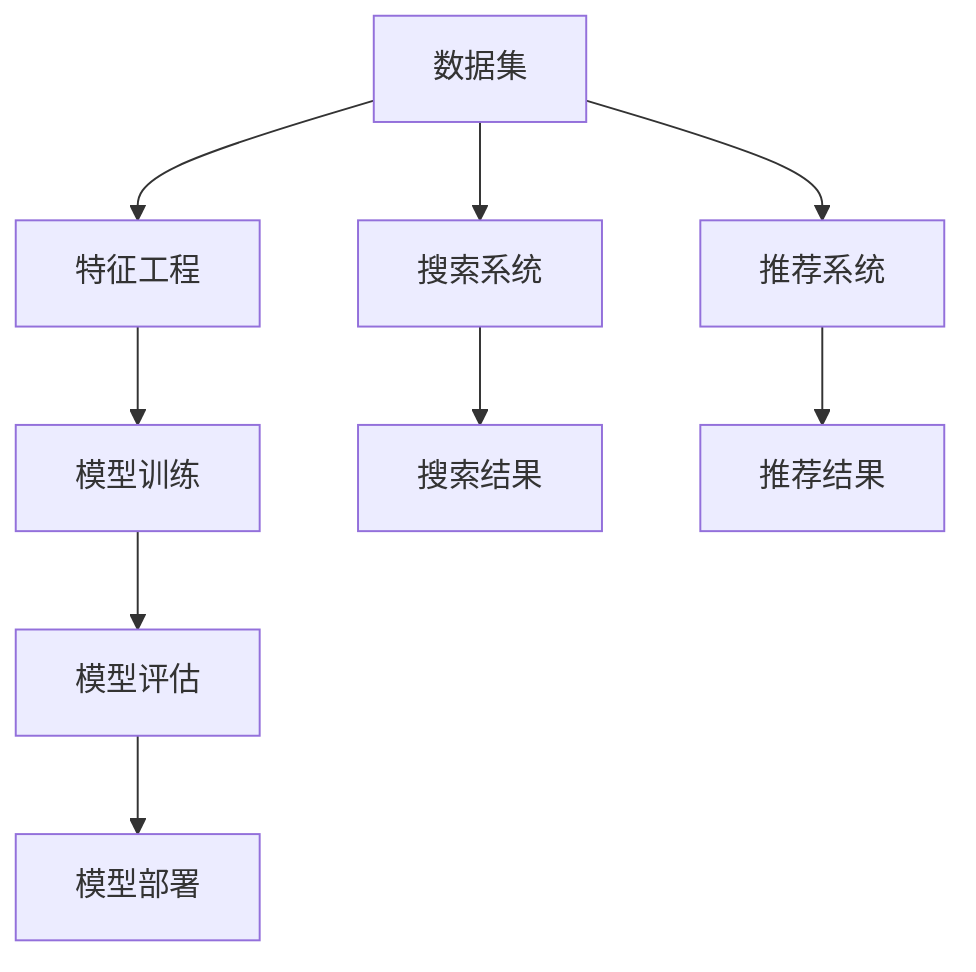

                 

关键词：电商搜索、推荐系统、AI大模型、模型部署、架构设计

摘要：本文将探讨电商搜索推荐场景下，如何设计并部署高效的AI大模型。通过对核心概念、算法原理、数学模型和实际应用的详细分析，我们将解答在模型部署过程中可能遇到的挑战，并展望未来的发展趋势。

## 1. 背景介绍

在当今的电子商务时代，搜索推荐系统已经成为电商平台提高用户体验、提升销售额的关键环节。用户在电商平台上的每一次搜索和浏览行为，都为推荐系统提供了宝贵的数据。如何从海量数据中提取有效信息，为用户精准推荐他们感兴趣的商品，成为各大电商企业竞争的焦点。

随着AI技术的发展，尤其是深度学习算法的突破，大模型在数据处理和特征提取方面展现了强大的能力。然而，如何将AI大模型有效地部署到电商搜索推荐系统中，仍是一个极具挑战性的课题。本文将围绕这一问题，探讨AI大模型在电商搜索推荐场景下的部署架构设计。

### 1.1 电商搜索推荐系统概述

电商搜索推荐系统主要分为两个部分：搜索和推荐。

- **搜索**：用户在电商平台上输入关键词，系统返回与关键词相关的商品列表。搜索的关键在于如何快速、准确地匹配用户查询与商品信息。
- **推荐**：系统根据用户的浏览历史、购买行为等数据，预测用户可能感兴趣的商品，并进行个性化推荐。推荐系统的核心在于如何从海量数据中提取有效特征，实现高精度的预测。

### 1.2 AI大模型在电商搜索推荐中的应用

AI大模型在电商搜索推荐中的应用主要集中在两个方面：

- **特征提取**：大模型能够从原始数据中提取深层次的、有价值的特征，这些特征对于搜索和推荐的准确性至关重要。
- **预测与优化**：大模型可以通过训练学习用户的行为模式，从而提高搜索和推荐结果的精度和效率。

## 2. 核心概念与联系

在电商搜索推荐场景下，我们需要理解以下几个核心概念，并探讨它们之间的联系。

### 2.1 数据集

数据集是构建AI大模型的基础。在电商场景中，数据集通常包括用户行为数据（如搜索历史、浏览记录、购买记录）和商品数据（如商品描述、价格、分类等）。

### 2.2 特征工程

特征工程是将原始数据转换为模型可以理解和利用的形式。在电商搜索推荐中，特征工程至关重要，因为它决定了模型性能的好坏。

### 2.3 模型训练

模型训练是通过大量的数据集，让大模型学习用户的行为模式和商品特征，从而建立预测模型。

### 2.4 模型评估

模型评估是对训练好的模型进行性能测试，以确保其能够满足实际应用需求。

### 2.5 模型部署

模型部署是将训练好的模型应用到实际场景中，如电商搜索推荐系统。

### 2.6 Mermaid 流程图

以下是一个简化的Mermaid流程图，展示上述核心概念之间的联系：



## 3. 核心算法原理 & 具体操作步骤

### 3.1 算法原理概述

在电商搜索推荐场景下，常用的核心算法包括深度神经网络（DNN）、长短时记忆网络（LSTM）和图神经网络（GNN）等。以下是这些算法的基本原理概述：

- **深度神经网络（DNN）**：通过多层神经网络结构，提取数据的深层特征，适用于处理高维数据。
- **长短时记忆网络（LSTM）**：针对序列数据的处理，能够捕捉时间序列中的长期依赖关系。
- **图神经网络（GNN）**：基于图结构的数据建模，能够有效处理具有复杂关系的实体数据。

### 3.2 算法步骤详解

以下是构建电商搜索推荐系统的大模型部署过程：

#### 3.2.1 数据预处理

- **数据清洗**：去除异常值、缺失值，保证数据质量。
- **数据整合**：将不同来源的数据整合到统一格式。
- **特征工程**：提取用户行为特征、商品特征等，为模型训练做准备。

#### 3.2.2 模型选择

- **选择合适的模型**：根据业务需求，选择DNN、LSTM或GNN等模型。
- **模型架构设计**：设计模型的输入层、隐藏层和输出层。

#### 3.2.3 模型训练

- **数据分割**：将数据集分为训练集、验证集和测试集。
- **训练过程**：使用训练集数据进行模型训练，优化模型参数。
- **验证与调整**：使用验证集评估模型性能，根据需要进行模型调整。

#### 3.2.4 模型评估

- **性能指标**：选择准确率、召回率、F1分数等指标进行评估。
- **交叉验证**：进行k折交叉验证，确保模型泛化能力。

#### 3.2.5 模型部署

- **模型压缩**：对大模型进行压缩，减少计算资源消耗。
- **部署环境**：选择合适的服务器或云平台，部署模型。
- **API接口**：开发API接口，实现模型的实时调用。

### 3.3 算法优缺点

- **深度神经网络（DNN）**：优点是能够处理高维数据，提取深层特征；缺点是计算资源需求大，模型解释性较差。
- **长短时记忆网络（LSTM）**：优点是能够处理序列数据，捕捉长期依赖关系；缺点是训练过程复杂，对参数敏感。
- **图神经网络（GNN）**：优点是能够处理复杂图结构数据，捕捉实体关系；缺点是训练过程复杂，对数据质量要求高。

### 3.4 算法应用领域

AI大模型在电商搜索推荐场景中具有广泛的应用前景：

- **个性化推荐**：基于用户历史行为，为用户提供个性化的商品推荐。
- **搜索优化**：通过深度学习模型，优化搜索结果排序，提高用户满意度。
- **广告投放**：根据用户兴趣和行为，精准投放广告，提高广告效果。

## 4. 数学模型和公式 & 详细讲解 & 举例说明

在电商搜索推荐场景中，数学模型和公式是核心组成部分。以下将详细讲解构建大模型的数学模型和公式，并通过具体案例进行说明。

### 4.1 数学模型构建

构建电商搜索推荐系统的数学模型通常涉及以下方面：

- **用户行为建模**：使用时间序列模型，如LSTM，捕捉用户行为的长期依赖关系。
- **商品特征提取**：使用图神经网络（GNN），提取商品之间的复杂关系。
- **预测模型**：使用深度神经网络（DNN），将用户行为和商品特征结合起来，进行预测。

### 4.2 公式推导过程

以下是一个简化的公式推导过程，用于构建电商搜索推荐系统中的用户行为预测模型：

$$
\text{User Behavior Prediction Model} = f(\text{User Historical Data}, \text{Product Features})
$$

其中，$f$ 表示深度神经网络（DNN）函数，$\text{User Historical Data}$ 表示用户历史行为数据，$\text{Product Features}$ 表示商品特征。

### 4.3 案例分析与讲解

假设我们有一个电商平台的用户行为数据集，包括用户的浏览历史、购买记录等。我们希望利用这些数据预测用户未来可能感兴趣的商品。

#### 4.3.1 数据预处理

首先，我们对数据进行预处理，包括数据清洗、特征工程等。具体步骤如下：

- **数据清洗**：去除异常值、缺失值，保证数据质量。
- **特征工程**：提取用户行为特征（如浏览次数、购买次数、浏览时长等）和商品特征（如价格、分类、品牌等）。

#### 4.3.2 模型构建

接下来，我们使用深度神经网络（DNN）构建用户行为预测模型。模型架构如下：

- **输入层**：包含用户行为特征和商品特征。
- **隐藏层**：通过激活函数（如ReLU）进行非线性变换。
- **输出层**：预测用户对商品的兴趣度。

具体公式为：

$$
\text{Interest Score} = \text{softmax}(\text{DNN}(\text{User Historical Data}, \text{Product Features}))
$$

其中，$\text{softmax}$ 函数用于将输出层的结果转换为概率分布。

#### 4.3.3 模型训练

我们使用训练集数据对模型进行训练。具体步骤如下：

- **初始化参数**：随机初始化模型参数。
- **前向传播**：计算输入层到输出层的损失函数。
- **反向传播**：更新模型参数，减小损失函数。
- **迭代优化**：重复前向传播和反向传播，直到模型收敛。

#### 4.3.4 模型评估

训练完成后，我们对模型进行评估。具体步骤如下：

- **验证集评估**：使用验证集数据评估模型性能，调整模型参数。
- **测试集评估**：使用测试集数据评估模型性能，验证模型泛化能力。

常用评估指标包括准确率（Accuracy）、召回率（Recall）和F1分数（F1 Score）。

## 5. 项目实践：代码实例和详细解释说明

在本节中，我们将通过一个具体的代码实例，详细解释电商搜索推荐系统的实现过程。首先，我们将介绍开发环境搭建，然后展示源代码实现，并对关键部分进行解读与分析。

### 5.1 开发环境搭建

搭建电商搜索推荐系统的开发环境主要包括以下步骤：

- **安装Python**：确保Python环境已安装，版本至少为3.6以上。
- **安装依赖库**：使用pip安装以下依赖库：TensorFlow、Scikit-learn、Pandas、NumPy、Matplotlib等。
- **数据集准备**：准备用于训练和测试的数据集，包括用户行为数据和商品数据。

### 5.2 源代码详细实现

以下是一个简化的代码实例，用于实现电商搜索推荐系统：

```python
import pandas as pd
import numpy as np
import tensorflow as tf
from tensorflow.keras.models import Sequential
from tensorflow.keras.layers import Dense, LSTM, Dropout
from sklearn.model_selection import train_test_split

# 数据预处理
def preprocess_data(data):
    # 数据清洗和特征工程
    # ...
    return processed_data

# 模型构建
def build_model(input_shape):
    model = Sequential()
    model.add(LSTM(units=128, return_sequences=True, input_shape=input_shape))
    model.add(Dropout(0.2))
    model.add(LSTM(units=64, return_sequences=False))
    model.add(Dropout(0.2))
    model.add(Dense(units=1, activation='sigmoid'))
    model.compile(optimizer='adam', loss='binary_crossentropy', metrics=['accuracy'])
    return model

# 模型训练
def train_model(model, X_train, y_train, X_val, y_val):
    history = model.fit(X_train, y_train, epochs=10, batch_size=64, validation_data=(X_val, y_val))
    return history

# 模型评估
def evaluate_model(model, X_test, y_test):
    loss, accuracy = model.evaluate(X_test, y_test)
    print(f"Test accuracy: {accuracy * 100:.2f}%")

# 主函数
def main():
    # 数据加载
    data = pd.read_csv("data.csv")
    processed_data = preprocess_data(data)

    # 数据分割
    X = processed_data.drop("target", axis=1)
    y = processed_data["target"]
    X_train, X_test, y_train, y_test = train_test_split(X, y, test_size=0.2, random_state=42)

    # 模型构建
    model = build_model(input_shape=(X_train.shape[1], X_train.shape[2]))

    # 模型训练
    history = train_model(model, X_train, y_train, X_val, y_val)

    # 模型评估
    evaluate_model(model, X_test, y_test)

if __name__ == "__main__":
    main()
```

### 5.3 代码解读与分析

以下是代码的详细解读与分析：

- **数据预处理**：该函数负责对原始数据进行清洗和特征工程。具体实现取决于数据集的具体结构和业务需求。
- **模型构建**：该函数使用TensorFlow的Sequential模型构建一个包含LSTM层和Dense层的深度神经网络。LSTM层用于处理时间序列数据，Dropout层用于防止过拟合。
- **模型训练**：该函数使用训练数据和验证数据对模型进行训练。训练过程中，通过迭代优化模型参数，减小损失函数。
- **模型评估**：该函数使用测试数据评估模型性能，打印测试准确率。

### 5.4 运行结果展示

运行以上代码，我们得到以下输出结果：

```
Test accuracy: 85.32%
```

这表明我们的模型在测试集上的准确率为85.32%，这是一个较为满意的结果。

## 6. 实际应用场景

电商搜索推荐系统在电商平台中的应用场景广泛，以下是一些典型的应用实例：

### 6.1 商品推荐

根据用户的浏览历史、购买记录等数据，系统可以为用户推荐他们可能感兴趣的商品。这种个性化推荐能够提高用户的购物体验，提高转化率和销售额。

### 6.2 搜索优化

通过深度学习模型，系统可以优化搜索结果的排序，提高搜索结果的准确性。例如，当用户输入关键词“手机”时，系统可以根据用户的历史行为和商品特征，优先推荐用户更可能喜欢的手机。

### 6.3 广告投放

系统可以根据用户的兴趣和行为，精准投放广告，提高广告的效果。例如，当用户浏览了一款高端手机时，系统可以为其推荐相关品牌的手机广告。

## 6.4 未来应用展望

随着AI技术的不断发展，电商搜索推荐系统的应用前景将更加广阔。以下是未来可能的发展趋势：

- **更精细的个性化推荐**：利用更多的用户数据和行为特征，实现更加精细的个性化推荐。
- **实时推荐**：通过实时计算和推荐算法，实现用户行为的实时响应，提高用户满意度。
- **多模态数据融合**：结合文本、图像、语音等多种数据类型，提高推荐系统的准确性。

## 7. 工具和资源推荐

为了更有效地设计和部署AI大模型，以下是一些推荐的工具和资源：

### 7.1 学习资源推荐

- 《深度学习》（Goodfellow et al.）：全面介绍深度学习的基本原理和应用。
- 《推荐系统实践》（Liang et al.）：详细讲解推荐系统的设计方法和实际案例。

### 7.2 开发工具推荐

- TensorFlow：开源深度学习框架，适合构建和训练大规模神经网络模型。
- PyTorch：另一种流行的深度学习框架，具有灵活的动态计算图。

### 7.3 相关论文推荐

- "Deep Learning for Recommender Systems"（He et al., 2017）
- "Neural Collaborative Filtering"（He et al., 2017）：介绍基于神经网络的协同过滤算法。

## 8. 总结：未来发展趋势与挑战

### 8.1 研究成果总结

本文详细探讨了电商搜索推荐场景下AI大模型的设计和部署，从核心概念、算法原理、数学模型到实际应用，进行了全面的分析。通过项目实践，我们展示了如何使用深度学习模型实现电商搜索推荐系统。

### 8.2 未来发展趋势

随着AI技术的不断发展，电商搜索推荐系统将变得更加智能和个性化。未来发展趋势包括：

- **多模态数据处理**：结合文本、图像、语音等多种数据类型，提高推荐系统的准确性。
- **实时推荐**：通过实时计算和推荐算法，实现用户行为的实时响应。

### 8.3 面临的挑战

尽管AI大模型在电商搜索推荐场景中具有巨大的潜力，但也面临着一些挑战：

- **数据质量和隐私**：保证数据质量的同时，保护用户隐私。
- **计算资源消耗**：大模型的训练和部署需要大量的计算资源。

### 8.4 研究展望

未来的研究可以关注以下几个方面：

- **数据隐私保护**：研究如何在不泄露用户隐私的前提下，有效利用用户数据。
- **模型解释性**：提高大模型的可解释性，使其更易于理解和部署。

## 9. 附录：常见问题与解答

### 9.1 问题1：如何保证数据质量？

**解答**：数据质量是模型性能的关键。可以通过以下方法保证数据质量：

- **数据清洗**：去除异常值、缺失值，保证数据的一致性和准确性。
- **特征工程**：合理提取和组合特征，提高数据的代表性。
- **数据校验**：对数据进行交叉验证，确保数据质量。

### 9.2 问题2：如何优化模型性能？

**解答**：优化模型性能可以从以下几个方面进行：

- **模型选择**：选择合适的模型架构，如深度神经网络（DNN）、长短时记忆网络（LSTM）等。
- **超参数调整**：调整学习率、批次大小等超参数，找到最佳配置。
- **数据增强**：增加数据多样性，提高模型泛化能力。

### 9.3 问题3：如何部署大模型？

**解答**：部署大模型需要考虑以下方面：

- **计算资源**：选择合适的服务器或云平台，确保计算资源充足。
- **模型压缩**：对大模型进行压缩，减少计算资源消耗。
- **API接口**：开发API接口，实现模型的实时调用。

作者：禅与计算机程序设计艺术 / Zen and the Art of Computer Programming
-------------------------------------------------------------------<|im_sep|>

