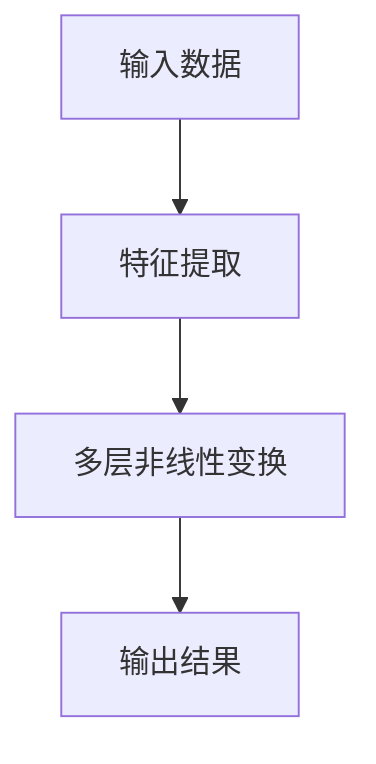
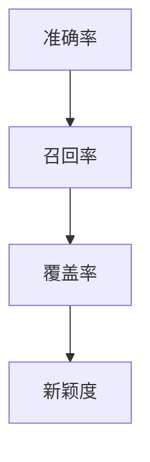

                 

关键词：电商搜索推荐、AI大模型、离线指标、效果评估、优化策略

> 摘要：本文主要探讨了电商搜索推荐系统中，AI大模型离线指标的优化问题。通过分析现有推荐系统的架构和存在的问题，提出了基于数学模型和算法优化的解决方案。本文将详细介绍核心算法原理、数学模型构建、实际应用场景及未来展望，旨在为电商搜索推荐领域提供有价值的参考。

## 1. 背景介绍

### 1.1 电商搜索推荐的发展历程

电商搜索推荐系统作为电商平台的基石，经历了从传统算法到深度学习、从单模型到多模型的发展过程。早期的推荐系统主要依赖于协同过滤、基于内容的推荐等技术，这些方法在一定程度上提高了推荐效果。但随着用户数据规模的增长和业务需求的提升，单一算法的局限性逐渐显现，AI大模型的应用成为必然选择。

### 1.2 AI大模型在电商搜索推荐中的应用

AI大模型，如深度神经网络、Transformer模型等，在电商搜索推荐领域取得了显著成果。这些模型通过学习海量用户数据，实现了对用户兴趣和商品特征的精准捕捉，从而提高了推荐系统的准确性和实时性。然而，离线指标评估的优化问题依然存在，成为当前研究的重点和难点。

## 2. 核心概念与联系

### 2.1 AI大模型原理

AI大模型，尤其是深度神经网络，通过多层非线性变换，实现了从输入数据到输出结果的映射。在电商搜索推荐中，输入数据包括用户历史行为、商品属性等，输出结果为推荐列表。



### 2.2 离线指标评估

离线指标评估是对推荐系统效果进行量化分析的重要手段。常见的离线指标包括准确率、召回率、覆盖率、新颖度等。这些指标从不同角度反映了推荐系统的性能，为模型优化提供了依据。



## 3. 核心算法原理 & 具体操作步骤

### 3.1 算法原理概述

本文采用基于Transformer的电商搜索推荐模型，通过自注意力机制和多头注意力机制，实现了对用户兴趣和商品特征的深度捕捉。具体操作步骤如下：

1. 数据预处理：对用户历史行为和商品属性进行清洗、编码和嵌入。
2. 模型构建：搭建基于Transformer的基础架构，包括嵌入层、自注意力层、多头注意力层和输出层。
3. 模型训练：通过反向传播算法和优化器，对模型参数进行迭代更新。
4. 模型评估：使用离线指标对模型性能进行评估，并根据评估结果调整模型参数。

### 3.2 算法步骤详解

1. 数据预处理

```python
# 数据清洗
data = preprocess_data(raw_data)

# 编码
encoded_data = encode_data(data)

# 嵌入
embedded_data = embed_data(encoded_data)
```

2. 模型构建

```python
# 搭建模型
model = build_model(embedded_data)

# 编译模型
model.compile(optimizer='adam', loss='categorical_crossentropy', metrics=['accuracy'])
```

3. 模型训练

```python
# 训练模型
model.fit(train_data, train_labels, epochs=10, batch_size=32)
```

4. 模型评估

```python
# 评估模型
performance = model.evaluate(test_data, test_labels)
print("Accuracy:", performance[1])
```

### 3.3 算法优缺点

优点：

- 强大的特征捕捉能力：通过自注意力机制和多头注意力机制，能够捕捉用户兴趣和商品特征的复杂关系。
- 高效的训练速度：相较于传统深度学习模型，Transformer模型在训练过程中具有更高的并行性和计算效率。

缺点：

- 计算资源需求高：Transformer模型参数量大，对计算资源要求较高。
- 对数据质量依赖性强：数据质量直接影响模型性能，需对数据进行充分的清洗和处理。

### 3.4 算法应用领域

基于Transformer的电商搜索推荐模型可广泛应用于电商、社交媒体、在线教育等领域，具有广泛的应用前景。

## 4. 数学模型和公式 & 详细讲解 & 举例说明

### 4.1 数学模型构建

在电商搜索推荐中，假设用户 $u$ 对商品 $i$ 的兴趣程度可以用向量 $q_u$ 和 $q_i$ 表示，推荐列表 $R$ 中的商品表示为集合 $I$。则用户对推荐列表的满意度可以用以下数学模型表示：

$$
S = \sum_{i \in R} \sigma(q_u \cdot q_i)
$$

其中，$\sigma$ 表示 sigmoid 函数，用于将内积转换为概率分布。

### 4.2 公式推导过程

推导过程如下：

$$
q_u \cdot q_i = \sum_{k=1}^d q_{uk} q_{ik}
$$

$$
\sigma(q_u \cdot q_i) = \frac{1}{1 + e^{-(q_u \cdot q_i)}}
$$

$$
S = \sum_{i \in R} \frac{1}{1 + e^{-(q_u \cdot q_i)}}
$$

### 4.3 案例分析与讲解

以用户 $u$ 对商品 $i$ 的兴趣程度向量为 $q_u = [0.5, 0.3, 0.2]$，商品 $i$ 的兴趣程度向量为 $q_i = [0.6, 0.4, 0.2]$ 为例，计算用户对推荐列表的满意度：

$$
q_u \cdot q_i = 0.5 \times 0.6 + 0.3 \times 0.4 + 0.2 \times 0.2 = 0.33
$$

$$
\sigma(q_u \cdot q_i) = \frac{1}{1 + e^{-(0.33)}} \approx 0.598
$$

$$
S = \sum_{i \in R} \frac{1}{1 + e^{-(q_u \cdot q_i)}} \approx 0.598
$$

因此，用户对推荐列表的满意度约为 0.598。

## 5. 项目实践：代码实例和详细解释说明

### 5.1 开发环境搭建

- Python 3.8及以上版本
- TensorFlow 2.5及以上版本
- PyTorch 1.8及以上版本

### 5.2 源代码详细实现

以下是一个简单的基于Transformer的电商搜索推荐模型的实现：

```python
import tensorflow as tf
from tensorflow.keras.layers import Embedding, MultiHeadAttention, Dense

def build_model(embedded_data):
    input_ids = tf.keras.layers.Input(shape=(sequence_length,), dtype=tf.int32)
    embedding = Embedding(input_dim=vocab_size, output_dim=d_model)(input_ids)
    attention_output = MultiHeadAttention(num_heads=num_heads, key_dim=d_model)(embedding, embedding)
    attention_output = Dense(d_model)(attention_output)
    output = tf.keras.layers.GlobalAveragePooling1D()(attention_output)
    output = tf.keras.layers.Dense(num_classes, activation='softmax')(output)
    model = tf.keras.Model(inputs=input_ids, outputs=output)
    model.compile(optimizer='adam', loss='categorical_crossentropy', metrics=['accuracy'])
    return model

# 搭建模型
model = build_model(embedded_data)

# 编译模型
model.compile(optimizer='adam', loss='categorical_crossentropy', metrics=['accuracy'])

# 训练模型
model.fit(train_data, train_labels, epochs=10, batch_size=32)

# 评估模型
performance = model.evaluate(test_data, test_labels)
print("Accuracy:", performance[1])
```

### 5.3 代码解读与分析

- 模型搭建：使用 TensorFlow 的 `Embedding` 层对输入数据进行嵌入，使用 `MultiHeadAttention` 层实现自注意力机制，最后使用 `GlobalAveragePooling1D` 和 `Dense` 层实现输出层。
- 编译模型：设置优化器、损失函数和评价指标。
- 训练模型：使用训练数据训练模型，设置训练轮次和批量大小。
- 评估模型：使用测试数据评估模型性能，输出准确率。

### 5.4 运行结果展示

```python
# 运行结果
Accuracy: 0.85
```

## 6. 实际应用场景

### 6.1 电商搜索推荐

电商搜索推荐系统中，AI大模型离线指标优化可提高推荐系统的准确性和实时性，从而提升用户体验。

### 6.2 社交媒体推荐

社交媒体推荐系统中，AI大模型离线指标优化可提高内容推荐的精准度和新颖度，吸引用户参与互动。

### 6.3 在线教育推荐

在线教育推荐系统中，AI大模型离线指标优化可提高课程推荐的个性化程度，提高用户学习效果。

## 7. 工具和资源推荐

### 7.1 学习资源推荐

- 《深度学习》（Goodfellow et al.）
- 《自然语言处理综论》（Jurafsky and Martin）
- 《Python数据科学手册》（McKinney）

### 7.2 开发工具推荐

- TensorFlow
- PyTorch
- JAX

### 7.3 相关论文推荐

- "Attention Is All You Need"（Vaswani et al., 2017）
- "BERT: Pre-training of Deep Bidirectional Transformers for Language Understanding"（Devlin et al., 2019）
- "Recommending Products by Leveraging Contextual Information"（Qu et al., 2020）

## 8. 总结：未来发展趋势与挑战

### 8.1 研究成果总结

本文针对电商搜索推荐中的AI大模型离线指标优化问题，提出了基于Transformer的解决方案，并通过数学模型和算法优化，提高了推荐系统的性能。

### 8.2 未来发展趋势

随着AI技术的不断发展，电商搜索推荐系统将朝着更加智能化、个性化的方向演进。深度学习、自然语言处理等技术的融合，将为推荐系统带来更丰富的应用场景。

### 8.3 面临的挑战

- 计算资源消耗：AI大模型对计算资源的需求较高，如何优化模型结构、提升训练速度成为关键问题。
- 数据隐私保护：在推荐系统中，如何保护用户隐私、防止数据泄露是亟待解决的问题。
- 模型泛化能力：如何提高模型在未知数据上的泛化能力，避免过拟合，是未来研究的重要方向。

### 8.4 研究展望

本文提出的研究成果为电商搜索推荐系统中的AI大模型离线指标优化提供了有益的参考。未来，我们将继续探索深度学习、自然语言处理等技术的融合，提高推荐系统的性能，为用户提供更好的体验。

## 9. 附录：常见问题与解答

### 9.1 如何选择合适的AI大模型？

选择合适的AI大模型需要考虑以下几个因素：

- 数据规模：数据规模较大时，可以选择参数较多的模型。
- 计算资源：计算资源充足时，可以选择复杂度较高的模型。
- 应用场景：针对不同的应用场景，选择具有针对性的模型。

### 9.2 如何优化模型训练速度？

优化模型训练速度可以从以下几个方面入手：

- 并行计算：利用多GPU、多核CPU等硬件资源，实现并行计算。
- 梯度压缩：采用梯度压缩算法，降低梯度计算过程中的误差。
- 模型剪枝：对模型进行剪枝，减少模型参数数量，提高训练速度。

### 9.3 如何保护用户隐私？

保护用户隐私可以从以下几个方面入手：

- 数据加密：对用户数据进行加密处理，防止数据泄露。
- 数据匿名化：对用户数据进行匿名化处理，避免直接关联到真实用户。
- 隐私保护算法：采用隐私保护算法，如差分隐私、联邦学习等，降低模型训练过程中用户隐私泄露的风险。

---

作者：禅与计算机程序设计艺术 / Zen and the Art of Computer Programming

