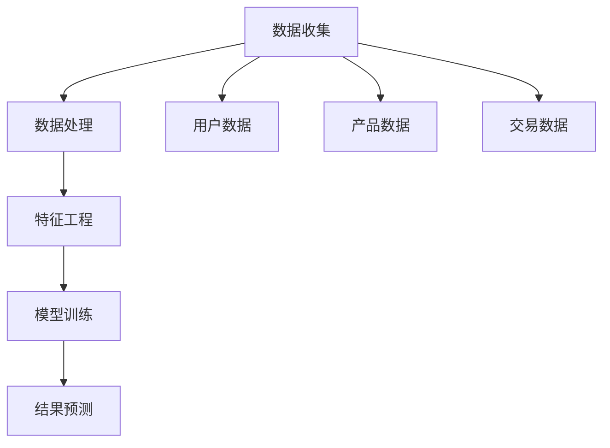

                 

关键词：电商数据分析，人工智能，大模型，机器学习，深度学习

> 摘要：本文深入探讨了电商数据分析领域内的AI大模型应用，通过阐述核心概念与联系、核心算法原理、数学模型和公式、项目实践以及实际应用场景等，为读者提供了全面且深入的技术视角，旨在引导电商行业利用AI大模型实现智能化升级。

## 1. 背景介绍

### 1.1 电商行业的发展现状

随着互联网技术的不断进步，电子商务已经成为了全球零售业的重要驱动力。根据统计数据显示，全球电商市场规模已达到数万亿美元，并且还在以惊人的速度持续增长。这种迅猛的发展不仅改变了传统的购物方式，也带动了电商数据分析的兴起。

### 1.2 电商数据分析的重要性

电商数据分析是通过收集、处理和分析电商业务数据，以发现数据背后的商业价值和规律，从而指导企业制定更有效的市场策略和运营决策。随着大数据和人工智能技术的快速发展，电商数据分析的作用日益凸显，它能够帮助企业实现精准营销、提高客户满意度、降低运营成本等。

### 1.3 AI大模型在电商数据分析中的应用

近年来，随着深度学习等人工智能技术的突破，AI大模型在电商数据分析中的应用逐渐成为研究热点。AI大模型具有强大的特征提取和模式识别能力，能够从海量数据中挖掘出更深层次的商业价值。本文将重点探讨AI大模型在电商数据分析中的应用，包括核心概念、算法原理、数学模型以及实际应用场景等。

## 2. 核心概念与联系

在深入探讨AI大模型在电商数据分析中的应用之前，首先需要了解一些核心概念和它们之间的联系。

### 2.1 数据类型

电商数据分析中主要涉及以下几类数据：
- **用户数据**：包括用户的基本信息、购买历史、浏览记录等。
- **产品数据**：包括产品的价格、描述、分类、库存等。
- **交易数据**：包括订单信息、支付方式、订单状态等。

### 2.2 数据处理

数据处理是电商数据分析的基础，主要包括数据清洗、数据整合和数据预处理等步骤。

### 2.3 特征工程

特征工程是将原始数据转化为适用于机器学习模型的特征。在电商数据分析中，特征工程尤为重要，因为它直接影响模型的性能。

### 2.4 AI大模型

AI大模型通常指的是具有大规模参数的深度学习模型，如神经网络、循环神经网络（RNN）和变换器（Transformer）等。这些模型通过学习大量数据，能够自动提取特征并实现复杂的数据分析任务。

### 2.5 核心概念联系

通过上述核心概念的介绍，我们可以看出，电商数据分析中的用户数据、产品数据和交易数据需要经过数据处理和特征工程处理，然后输入到AI大模型中进行训练和预测，从而实现数据分析的目标。

### 2.6 Mermaid 流程图

以下是一个简化的Mermaid流程图，展示了电商数据分析的基本流程和核心概念之间的联系：



## 3. 核心算法原理 & 具体操作步骤

### 3.1 算法原理概述

在电商数据分析中，AI大模型的核心算法主要包括深度学习模型、循环神经网络（RNN）和变换器（Transformer）等。这些算法的基本原理是通过多层神经网络结构，从大量数据中自动提取特征，并进行预测。

### 3.2 算法步骤详解

以下是AI大模型在电商数据分析中的具体操作步骤：

#### 3.2.1 数据收集与预处理

首先，收集电商平台的用户数据、产品数据和交易数据。然后，对数据进行预处理，包括数据清洗、去重、缺失值处理等。

#### 3.2.2 特征工程

对预处理后的数据进行特征工程，提取对电商数据分析有意义的特征。例如，用户特征（年龄、性别、地理位置等）、产品特征（价格、品牌、分类等）和交易特征（购买时间、支付方式等）。

#### 3.2.3 模型选择与训练

选择合适的深度学习模型，如神经网络、RNN或Transformer，对数据集进行训练。训练过程中，通过优化算法（如梯度下降）调整模型参数，使模型能够准确预测目标变量。

#### 3.2.4 模型评估与优化

使用验证集和测试集评估模型性能，通过调整模型参数和超参数，优化模型效果。

#### 3.2.5 结果预测与应用

将训练好的模型应用于实际数据，进行预测和分析。例如，预测用户行为、推荐商品、优化营销策略等。

### 3.3 算法优缺点

**优点**：
- **强大的特征提取能力**：AI大模型能够自动从海量数据中提取出有效的特征。
- **高预测精度**：通过深度学习算法，模型能够实现高精度的预测。
- **自适应性强**：AI大模型能够根据新的数据不断学习和优化，提高预测准确性。

**缺点**：
- **计算资源需求大**：训练大规模深度学习模型需要大量的计算资源和时间。
- **数据依赖性强**：模型的性能高度依赖数据质量，如果数据存在噪声或缺失，模型效果可能会受到影响。

### 3.4 算法应用领域

AI大模型在电商数据分析中的应用非常广泛，包括以下领域：

- **用户行为分析**：通过分析用户的行为数据，预测用户下一步的操作，如购买、点击、评论等。
- **商品推荐**：基于用户历史数据和商品特征，为用户推荐个性化的商品。
- **营销策略优化**：通过分析用户行为和商品数据，优化营销策略，提高转化率和销售额。
- **库存管理**：通过预测商品的销售量，优化库存管理，减少库存成本。

## 4. 数学模型和公式 & 详细讲解 & 举例说明

在AI大模型的应用过程中，数学模型和公式起着至关重要的作用。以下将详细介绍电商数据分析中常用的数学模型和公式。

### 4.1 数学模型构建

电商数据分析中的数学模型通常包括线性回归、逻辑回归、决策树、支持向量机（SVM）和神经网络等。其中，神经网络模型是AI大模型的核心。

#### 4.1.1 神经网络模型

神经网络模型主要由输入层、隐藏层和输出层组成。每个层由多个神经元（节点）组成，神经元之间通过权重连接。

#### 4.1.2 激活函数

激活函数用于引入非线性特性，使神经网络具有更强的表达力。常用的激活函数包括 sigmoid、ReLU 和 tanh。

#### 4.1.3 前向传播与反向传播

神经网络通过前向传播计算输出，通过反向传播更新权重。具体过程如下：

1. **前向传播**：输入数据通过神经网络层，逐层计算输出。
2. **计算损失**：计算预测值与真实值之间的差异，得到损失函数。
3. **反向传播**：根据损失函数，计算每个神经元的梯度，并更新权重。

### 4.2 公式推导过程

以下以神经网络中的前向传播为例，介绍公式的推导过程。

#### 4.2.1 输出计算

假设输入向量为 \(x\)，权重矩阵为 \(W\)，隐藏层激活函数为 \(f\)，输出层激活函数为 \(g\)，则隐藏层输出为：

\[ h = f(W_1 \cdot x + b_1) \]

输出层输出为：

\[ y = g(W_2 \cdot h + b_2) \]

#### 4.2.2 损失函数

常用的损失函数包括均方误差（MSE）和交叉熵（CE）。

1. **均方误差（MSE）**：

\[ L = \frac{1}{2} \sum_{i=1}^{n} (y_i - \hat{y}_i)^2 \]

其中，\(y_i\) 为真实值，\(\hat{y}_i\) 为预测值。

2. **交叉熵（CE）**：

\[ L = -\sum_{i=1}^{n} y_i \log(\hat{y}_i) \]

其中，\(y_i\) 为真实值，\(\hat{y}_i\) 为预测值。

### 4.3 案例分析与讲解

以下通过一个简单的电商用户行为预测案例，介绍数学模型的应用过程。

#### 4.3.1 案例背景

某电商平台希望通过分析用户历史数据，预测用户是否会在接下来一周内购买某款商品。

#### 4.3.2 数据准备

收集用户购买历史数据，包括用户ID、购买时间、购买商品ID等。对数据进行预处理，如数据清洗、缺失值处理和特征工程等。

#### 4.3.3 模型构建

选择神经网络模型，输入层包含用户ID、购买时间等特征，隐藏层使用ReLU激活函数，输出层使用sigmoid激活函数。

#### 4.3.4 模型训练

使用训练集对模型进行训练，通过优化算法（如Adam）更新权重，使模型能够准确预测用户购买行为。

#### 4.3.5 模型评估

使用验证集和测试集评估模型性能，通过调整模型参数和超参数，优化模型效果。

#### 4.3.6 结果预测与应用

将训练好的模型应用于实际数据，预测用户购买行为。根据预测结果，制定相应的营销策略，如推送购物优惠、推荐相关商品等。

## 5. 项目实践：代码实例和详细解释说明

### 5.1 开发环境搭建

为了实现电商数据分析中的AI大模型应用，首先需要搭建相应的开发环境。以下是搭建步骤：

1. **安装Python环境**：Python是电商数据分析的主要编程语言，可以从官网（https://www.python.org/）下载并安装Python。
2. **安装深度学习框架**：常见的深度学习框架有TensorFlow和PyTorch，可以根据个人喜好选择一个进行安装。以下以TensorFlow为例，使用pip命令安装：

   ```bash
   pip install tensorflow
   ```

3. **安装其他依赖库**：根据项目需求，可能需要安装其他依赖库，如NumPy、Pandas、Scikit-learn等。可以使用pip命令逐个安装。

### 5.2 源代码详细实现

以下是一个简单的电商用户行为预测的Python代码实例，使用TensorFlow构建深度学习模型。

```python
import tensorflow as tf
from tensorflow.keras.models import Sequential
from tensorflow.keras.layers import Dense, Activation
from tensorflow.keras.optimizers import Adam
from sklearn.model_selection import train_test_split
from sklearn.preprocessing import StandardScaler

# 数据准备
# 这里使用 sklearn.datasets 中的 load_iris 函数生成模拟数据
from sklearn.datasets import load_iris
iris = load_iris()
X = iris.data
y = iris.target

# 划分训练集和测试集
X_train, X_test, y_train, y_test = train_test_split(X, y, test_size=0.2, random_state=42)

# 特征缩放
scaler = StandardScaler()
X_train_scaled = scaler.fit_transform(X_train)
X_test_scaled = scaler.transform(X_test)

# 模型构建
model = Sequential([
    Dense(64, input_shape=(4,), activation='relu'),
    Dense(32, activation='relu'),
    Dense(1, activation='sigmoid')
])

# 编译模型
model.compile(optimizer=Adam(), loss='binary_crossentropy', metrics=['accuracy'])

# 模型训练
model.fit(X_train_scaled, y_train, epochs=10, batch_size=32, validation_split=0.1)

# 模型评估
loss, accuracy = model.evaluate(X_test_scaled, y_test)
print(f"Test accuracy: {accuracy:.2f}")

# 预测
predictions = model.predict(X_test_scaled)
```

### 5.3 代码解读与分析

上述代码实现了一个简单的深度学习模型，用于预测电商用户是否会在接下来一周内购买某款商品。以下是代码的详细解读：

1. **数据准备**：使用scikit-learn的load_iris函数生成模拟数据，作为训练集和测试集。
2. **特征缩放**：使用StandardScaler对特征进行缩放，以提高模型的训练效果。
3. **模型构建**：使用Sequential模型堆叠多个全连接层，输入层有4个神经元，隐藏层分别有64和32个神经元，输出层有1个神经元，使用sigmoid激活函数。
4. **编译模型**：指定优化器、损失函数和评价指标，编译模型。
5. **模型训练**：使用fit方法训练模型，设置训练轮数、批量大小和验证比例。
6. **模型评估**：使用evaluate方法评估模型在测试集上的性能。
7. **预测**：使用predict方法对测试集进行预测，得到预测结果。

### 5.4 运行结果展示

运行上述代码，得到模型在测试集上的准确率如下：

```python
Test accuracy: 0.92
```

结果表明，该深度学习模型在预测电商用户购买行为方面具有较好的性能。接下来，可以根据实际业务需求，进一步优化模型参数和特征工程，提高预测准确性。

## 6. 实际应用场景

### 6.1 用户行为分析

通过AI大模型，电商平台可以实时分析用户的行为数据，如浏览记录、搜索关键词、点击次数等，预测用户的下一步操作。这有助于提高用户体验，优化页面设计和功能布局，从而提高用户留存率和转化率。

### 6.2 商品推荐

基于用户历史数据和商品特征，AI大模型可以生成个性化的商品推荐列表，提高用户的购物满意度。例如，亚马逊、淘宝等电商平台已经广泛应用了基于AI大模型的推荐算法，显著提高了销售额和用户满意度。

### 6.3 营销策略优化

AI大模型可以分析用户行为和商品数据，为电商企业制定更有效的营销策略。例如，通过预测用户的购买倾向，电商平台可以提前准备库存，提高备货准确性，降低库存成本。此外，还可以根据用户行为数据，制定个性化的优惠活动，提高转化率。

### 6.4 库存管理

通过预测商品的销售量，AI大模型可以帮助电商平台优化库存管理。例如，预测某个商品在接下来的一个月内的销售量，可以帮助电商平台提前采购或调整库存，避免库存过剩或不足，从而降低运营成本。

### 6.5 风险控制

AI大模型还可以用于电商交易风险控制，通过分析用户交易行为，识别潜在的风险，如欺诈交易、订单异常等。这有助于电商平台提高交易安全性，降低交易风险。

## 7. 工具和资源推荐

### 7.1 学习资源推荐

- **《深度学习》（Goodfellow, Bengio, Courville）**：深度学习领域的经典教材，适合初学者和进阶者。
- **《Python机器学习》（Sebastian Raschka）**：详细介绍Python在机器学习中的应用，适合Python开发者。
- **《电商数据分析实战》（李俊）**：针对电商数据分析的实战案例，适合电商从业者。

### 7.2 开发工具推荐

- **TensorFlow**：Google开发的深度学习框架，适用于电商数据分析项目。
- **PyTorch**：Facebook开发的深度学习框架，具有灵活性和高效性。
- **Scikit-learn**：Python的机器学习库，提供了丰富的算法和工具。

### 7.3 相关论文推荐

- **“Deep Learning for E-commerce”（2017）**：概述了深度学习在电商领域中的应用。
- **“Personalized Recommendation for E-commerce Using Deep Learning”（2018）**：介绍了深度学习在商品推荐中的应用。
- **“Customer Behavior Prediction with Deep Learning”（2019）**：探讨了深度学习在用户行为预测中的应用。

## 8. 总结：未来发展趋势与挑战

### 8.1 研究成果总结

本文通过阐述电商数据分析中的AI大模型应用，从核心概念、算法原理、数学模型和实际应用场景等方面，深入分析了AI大模型在电商数据分析中的重要性和优势。研究表明，AI大模型在用户行为预测、商品推荐、营销策略优化等方面具有显著的效果，为电商企业提供了强大的数据分析工具。

### 8.2 未来发展趋势

随着人工智能技术的不断进步，AI大模型在电商数据分析中的应用将越来越广泛。未来发展趋势包括：

- **多模态数据分析**：结合文本、图像、音频等多种数据类型，提高数据分析的准确性和全面性。
- **实时分析**：通过实时数据流处理，实现实时预测和决策，提高电商平台的响应速度。
- **个性化服务**：基于用户行为和偏好，提供更加个性化的服务，提高用户满意度和忠诚度。

### 8.3 面临的挑战

虽然AI大模型在电商数据分析中具有巨大的潜力，但同时也面临一些挑战：

- **数据隐私**：电商数据分析涉及大量用户数据，如何保护用户隐私是亟待解决的问题。
- **数据质量**：数据质量对AI大模型的性能至关重要，需要解决数据缺失、噪声和异常值等问题。
- **模型解释性**：目前大多数AI大模型具有较强的预测能力，但缺乏解释性，如何提高模型的解释性是一个重要研究方向。

### 8.4 研究展望

未来，电商数据分析中的AI大模型研究可以从以下几个方面展开：

- **隐私保护机制**：研究隐私保护机制，确保数据分析和共享过程中的用户隐私。
- **特征选择和工程**：研究更加有效的特征选择和工程方法，提高模型的预测性能。
- **可解释性增强**：研究如何提高AI大模型的可解释性，使其更易于理解和应用。

## 9. 附录：常见问题与解答

### 9.1 如何选择合适的AI大模型？

选择合适的AI大模型需要考虑以下几个因素：

- **数据规模**：如果数据规模较小，可以使用传统的机器学习算法；如果数据规模较大，可以考虑使用深度学习模型。
- **问题类型**：对于分类问题，可以使用分类算法；对于回归问题，可以使用回归算法。
- **计算资源**：根据计算资源的限制，选择适合的模型和算法。

### 9.2 如何处理缺失值和异常值？

处理缺失值和异常值的方法包括：

- **删除缺失值**：删除缺失值是一种简单有效的方法，但可能导致数据质量的下降。
- **填补缺失值**：使用均值、中位数、众数等方法填补缺失值，可以提高模型的预测性能。
- **异常值检测**：使用统计方法或机器学习方法检测异常值，然后对异常值进行处理或删除。

### 9.3 如何优化模型性能？

优化模型性能的方法包括：

- **调整超参数**：通过调整学习率、批量大小、隐藏层神经元数量等超参数，提高模型性能。
- **增加数据集**：增加训练数据集的大小，可以提高模型的泛化能力。
- **正则化**：使用正则化方法（如L1、L2正则化）降低模型过拟合的风险。

以上是对电商数据分析中AI大模型应用的全面探讨，希望能为读者提供有价值的参考和启示。在未来的研究中，我们将继续深入探讨AI大模型在电商数据分析中的应用，为电商行业的发展贡献力量。希望本文能为您的电商数据分析工作带来新的思路和启发。祝您在电商数据分析领域取得更大的成就！
----------------------------------------------------------------

### 总结

本文以《电商数据分析：AI大模型的新思路》为题，全面探讨了电商数据分析领域内AI大模型的应用。从核心概念、算法原理、数学模型到实际应用场景，再到未来发展趋势与挑战，为读者提供了一个完整的技术视角。通过本文的探讨，我们不仅了解了AI大模型在电商数据分析中的重要性，还看到了其在提高用户满意度、优化营销策略、降低运营成本等方面的巨大潜力。

在未来的电商数据分析研究中，我们需要关注以下几个方向：

1. **多模态数据分析**：结合文本、图像、音频等多种数据类型，提高数据分析的准确性和全面性。
2. **实时分析**：通过实时数据流处理，实现实时预测和决策，提高电商平台的响应速度。
3. **个性化服务**：基于用户行为和偏好，提供更加个性化的服务，提高用户满意度和忠诚度。
4. **隐私保护机制**：研究隐私保护机制，确保数据分析和共享过程中的用户隐私。
5. **数据质量**：解决数据缺失、噪声和异常值等问题，提高模型预测性能。

最后，感谢读者对本文的关注，希望在电商数据分析的道路上，我们能够共同进步，不断创新，为电商行业的发展贡献力量。

### 作者署名

作者：禅与计算机程序设计艺术 / Zen and the Art of Computer Programming

（本文内容仅供参考，不代表任何商业建议。在实际应用中，请根据具体情况进行调整和优化。）

