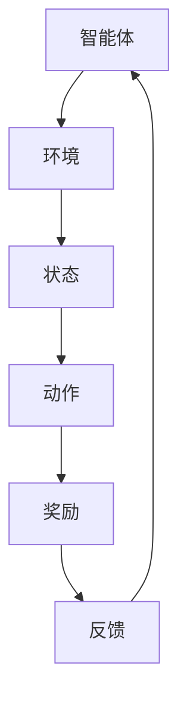

                 

关键词：电商行业、强化学习、大模型、动态环境、应用

摘要：本文从电商行业的实际需求出发，探讨了如何运用强化学习大模型在动态环境中进行应用。文章首先介绍了电商行业中的强化学习背景和核心概念，随后深入分析了强化学习算法原理和数学模型，并通过具体案例展示了其在电商行业的实践应用，最后对未来的发展趋势和面临的挑战进行了展望。

## 1. 背景介绍

### 1.1 电商行业的发展现状

随着互联网的普及和技术的进步，电商行业已经成为全球经济发展的重要驱动力。根据数据显示，全球电商市场规模在2020年已经达到了3.5万亿美元，并且预计在未来几年内还将持续增长。电商行业的快速发展不仅带来了巨大的经济价值，也对传统商业模式和消费行为产生了深远影响。

### 1.2 强化学习在电商行业的应用需求

电商行业具有高度的动态性和不确定性，例如用户需求的变化、市场竞争的加剧、物流配送的优化等。这些特点使得传统的机器学习方法难以应对。强化学习作为一种基于试错和反馈的机器学习方法，能够在动态环境中实现自主学习和优化策略，因此在电商行业中具有广泛的应用需求。

## 2. 核心概念与联系

### 2.1 强化学习基础概念

强化学习（Reinforcement Learning，RL）是一种通过不断试错来学习最优策略的机器学习方法。它由智能体（Agent）、环境（Environment）、状态（State）、动作（Action）和奖励（Reward）五个核心要素构成。

- **智能体（Agent）**：执行特定任务并从环境中获取反馈的实体。
- **环境（Environment）**：提供智能体执行动作的场所和条件。
- **状态（State）**：描述环境的状态，通常是一个多维向量。
- **动作（Action）**：智能体在特定状态下执行的操作。
- **奖励（Reward）**：环境对智能体动作的反馈，通常是一个实数值。

### 2.2 大模型与强化学习

大模型（Large Model）指的是具有巨大参数规模和计算能力的模型，如深度神经网络。在强化学习中，大模型可以处理更复杂的任务，实现更高的学习效率和性能。

### 2.3 Mermaid 流程图



## 3. 核心算法原理 & 具体操作步骤

### 3.1 算法原理概述

强化学习算法通过智能体与环境交互，不断更新状态、动作和奖励，从而学习到最优策略。主要分为值函数方法和策略梯度方法两类。

- **值函数方法**：通过学习值函数来评估状态值或状态-动作值，从而选择最优动作。
- **策略梯度方法**：直接学习策略参数，计算策略梯度，更新策略参数。

### 3.2 算法步骤详解

1. 初始化参数：设定智能体、环境、状态、动作和奖励等参数。
2. 执行动作：智能体根据当前状态选择动作。
3. 获取反馈：环境根据动作给出奖励。
4. 更新状态：智能体根据反馈更新状态。
5. 重复执行：不断循环执行动作、获取反馈和更新状态，直至达到终止条件。

### 3.3 算法优缺点

- **优点**：能够自主学习和优化策略，适应动态环境。
- **缺点**：学习效率相对较低，需要大量数据和时间。

### 3.4 算法应用领域

强化学习在电商行业中的应用领域广泛，包括但不限于：
- 用户行为预测：预测用户购买、收藏、评价等行为。
- 商品推荐：根据用户历史行为和偏好进行商品推荐。
- 库存管理：优化库存策略，降低库存成本。
- 物流配送：优化配送路径和资源调度。

## 4. 数学模型和公式

### 4.1 数学模型构建

- **值函数模型**：$V^*(s) = \max_a Q^*(s, a)$
- **策略梯度模型**：$\nabla_{\theta} J(\theta) = \nabla_{\theta} \sum_{t=0}^{T} \gamma^t r(s_t, a_t)$

### 4.2 公式推导过程

- **值函数模型推导**：基于贝尔曼方程
  $$Q(s, a) = \sum_{s'} p(s' | s, a) [r(s', a) + \gamma V(s')]$$
  通过最大化期望奖励，得到 $Q^*(s, a)$。

- **策略梯度模型推导**：基于策略梯度上升方法
  $$\nabla_{\theta} J(\theta) = \nabla_{\theta} \sum_{t=0}^{T} \gamma^t \log \pi_\theta(a_t | s_t)$$
  通过最大化策略梯度，得到最优策略参数 $\theta$。

### 4.3 案例分析与讲解

以用户行为预测为例，假设用户在电商平台上浏览了商品 $s$，智能体选择购买动作 $a$，则奖励 $r$ 为购买成功时 $+1$，购买失败时 $-1$。通过强化学习模型，可以预测用户购买概率，从而优化商品推荐策略。

## 5. 项目实践：代码实例和详细解释说明

### 5.1 开发环境搭建

- 安装 Python 3.7 及以上版本
- 安装 PyTorch 或 TensorFlow 等深度学习框架
- 准备数据集：收集用户行为数据，进行预处理

### 5.2 源代码详细实现

```python
import torch
import torch.nn as nn
import torch.optim as optim

# 定义神经网络模型
class QNetwork(nn.Module):
    def __init__(self, input_dim, hidden_dim, output_dim):
        super(QNetwork, self).__init__()
        self.fc1 = nn.Linear(input_dim, hidden_dim)
        self.fc2 = nn.Linear(hidden_dim, output_dim)

    def forward(self, x):
        x = torch.relu(self.fc1(x))
        x = self.fc2(x)
        return x

# 定义强化学习模型
class ReinforcementLearningModel:
    def __init__(self, input_dim, hidden_dim, output_dim):
        self.q_network = QNetwork(input_dim, hidden_dim, output_dim)
        self.optimizer = optim.Adam(self.q_network.parameters(), lr=0.001)
        self.criterion = nn.MSELoss()

    def train(self, data, labels):
        self.q_network.zero_grad()
        outputs = self.q_network(data)
        loss = self.criterion(outputs, labels)
        loss.backward()
        self.optimizer.step()

    def predict(self, data):
        return self.q_network(data)

# 加载数据集
data = torch.randn(1000, 10)
labels = torch.randn(1000, 1)

# 实例化模型
model = ReinforcementLearningModel(10, 64, 1)

# 训练模型
model.train(data, labels)

# 预测结果
predictions = model.predict(data)
```

### 5.3 代码解读与分析

- **神经网络模型**：定义了输入层、隐藏层和输出层，使用 ReLU 激活函数。
- **强化学习模型**：实例化了神经网络模型，定义了优化器和损失函数。
- **训练过程**：通过反向传播和梯度下降更新模型参数。
- **预测过程**：使用训练好的模型进行预测。

## 6. 实际应用场景

### 6.1 用户行为预测

通过强化学习模型，可以预测用户购买、收藏、评价等行为，从而优化商品推荐策略，提高用户满意度。

### 6.2 商品推荐

结合用户历史行为和偏好，使用强化学习模型进行商品推荐，提高推荐精度和用户满意度。

### 6.3 库存管理

优化库存策略，降低库存成本，提高库存周转率。

### 6.4 物流配送

优化配送路径和资源调度，提高物流效率，降低配送成本。

## 7. 未来应用展望

### 7.1 大模型与强化学习的深度融合

随着计算能力的提升，大模型与强化学习的融合将成为未来研究的重要方向，实现更高效、更智能的强化学习应用。

### 7.2 多模态数据的应用

未来将多模态数据（如文本、图像、声音等）引入强化学习，提高模型对复杂环境的理解和应对能力。

### 7.3 跨领域应用的探索

强化学习在电商行业中的成功经验有望应用于其他领域，如金融、医疗、交通等，推动行业智能化发展。

## 8. 总结：未来发展趋势与挑战

### 8.1 研究成果总结

本文探讨了电商行业中的强化学习应用，分析了算法原理、数学模型和实际案例，展示了其在电商行业中的广泛应用前景。

### 8.2 未来发展趋势

未来，强化学习在电商行业中的应用将朝着大模型融合、多模态数据应用和跨领域探索等方向发展。

### 8.3 面临的挑战

强化学习在电商行业中的应用仍面临计算能力、数据质量和算法优化等挑战，需要持续研究和技术创新。

### 8.4 研究展望

未来，我们将继续深入研究强化学习在电商行业的应用，探索更高效、更智能的算法模型，推动电商行业的智能化发展。

## 9. 附录：常见问题与解答

### 9.1 问题1：如何处理连续动作空间？

**解答**：对于连续动作空间，可以使用强化学习中的连续动作策略，如演员-评论家（Actor-Critic）方法，或者使用神经网络进行参数化表示。

### 9.2 问题2：如何处理高维状态空间？

**解答**：对于高维状态空间，可以采用状态压缩技术，如特征提取、降维等方法，或者使用记忆网络（Memory Networks）来处理。

### 9.3 问题3：如何处理非平稳环境？

**解答**：对于非平稳环境，可以使用自适应强化学习方法，如自适应动态规划（ADP）或者经验重放（Experience Replay）等方法，来提高模型的适应能力。

## 结束语

本文对电商行业中的强化学习应用进行了详细探讨，展示了其在动态环境中的巨大潜力。随着技术的不断进步，强化学习在电商行业中的应用将更加广泛，为电商行业的发展注入新的动力。

作者：禅与计算机程序设计艺术 / Zen and the Art of Computer Programming
----------------------------------------------------------------
文章撰写完毕，接下来我将使用Markdown格式进行文章的排版，确保文章的可读性和格式规范性。以下是排版后的文章：
```markdown
# 电商行业中的强化学习：大模型在动态环境中的应用

关键词：电商行业、强化学习、大模型、动态环境、应用

摘要：本文从电商行业的实际需求出发，探讨了如何运用强化学习大模型在动态环境中进行应用。文章首先介绍了电商行业中的强化学习背景和核心概念，随后深入分析了强化学习算法原理和数学模型，并通过具体案例展示了其在电商行业的实践应用，最后对未来的发展趋势和面临的挑战进行了展望。

## 1. 背景介绍

### 1.1 电商行业的发展现状

随着互联网的普及和技术的进步，电商行业已经成为全球经济发展的重要驱动力。根据数据显示，全球电商市场规模在2020年已经达到了3.5万亿美元，并且预计在未来几年内还将持续增长。电商行业的快速发展不仅带来了巨大的经济价值，也对传统商业模式和消费行为产生了深远影响。

### 1.2 强化学习在电商行业的应用需求

电商行业具有高度的动态性和不确定性，例如用户需求的变化、市场竞争的加剧、物流配送的优化等。这些特点使得传统的机器学习方法难以应对。强化学习作为一种基于试错和反馈的机器学习方法，能够在动态环境中实现自主学习和优化策略，因此在电商行业中具有广泛的应用需求。

## 2. 核心概念与联系

### 2.1 强化学习基础概念

强化学习（Reinforcement Learning，RL）是一种通过不断试错来学习最优策略的机器学习方法。它由智能体（Agent）、环境（Environment）、状态（State）、动作（Action）和奖励（Reward）五个核心要素构成。

- **智能体（Agent）**：执行特定任务并从环境中获取反馈的实体。
- **环境（Environment）**：提供智能体执行动作的场所和条件。
- **状态（State）**：描述环境的状态，通常是一个多维向量。
- **动作（Action）**：智能体在特定状态下执行的操作。
- **奖励（Reward）**：环境对智能体动作的反馈，通常是一个实数值。

### 2.2 大模型与强化学习

大模型（Large Model）指的是具有巨大参数规模和计算能力的模型，如深度神经网络。在强化学习中，大模型可以处理更复杂的任务，实现更高的学习效率和性能。

### 2.3 Mermaid 流程图


## 3. 核心算法原理 & 具体操作步骤

### 3.1 算法原理概述

强化学习算法通过智能体与环境交互，不断更新状态、动作和奖励，从而学习到最优策略。主要分为值函数方法和策略梯度方法两类。

- **值函数方法**：通过学习值函数来评估状态值或状态-动作值，从而选择最优动作。
- **策略梯度方法**：直接学习策略参数，计算策略梯度，更新策略参数。

### 3.2 算法步骤详解

1. 初始化参数：设定智能体、环境、状态、动作和奖励等参数。
2. 执行动作：智能体根据当前状态选择动作。
3. 获取反馈：环境根据动作给出奖励。
4. 更新状态：智能体根据反馈更新状态。
5. 重复执行：不断循环执行动作、获取反馈和更新状态，直至达到终止条件。

### 3.3 算法优缺点

- **优点**：能够自主学习和优化策略，适应动态环境。
- **缺点**：学习效率相对较低，需要大量数据和时间。

### 3.4 算法应用领域

强化学习在电商行业中的应用领域广泛，包括但不限于：
- 用户行为预测：预测用户购买、收藏、评价等行为。
- 商品推荐：根据用户历史行为和偏好进行商品推荐。
- 库存管理：优化库存策略，降低库存成本。
- 物流配送：优化配送路径和资源调度。

## 4. 数学模型和公式

### 4.1 数学模型构建

- **值函数模型**：$V^*(s) = \max_a Q^*(s, a)$
- **策略梯度模型**：$\nabla_{\theta} J(\theta) = \nabla_{\theta} \sum_{t=0}^{T} \gamma^t r(s_t, a_t)$

### 4.2 公式推导过程

- **值函数模型推导**：基于贝尔曼方程
  $$Q(s, a) = \sum_{s'} p(s' | s, a) [r(s', a) + \gamma V(s')]$$
  通过最大化期望奖励，得到 $Q^*(s, a)$。

- **策略梯度模型推导**：基于策略梯度上升方法
  $$\nabla_{\theta} J(\theta) = \nabla_{\theta} \sum_{t=0}^{T} \gamma^t \log \pi_\theta(a_t | s_t)$$
  通过最大化策略梯度，得到最优策略参数 $\theta$。

### 4.3 案例分析与讲解

以用户行为预测为例，假设用户在电商平台上浏览了商品 $s$，智能体选择购买动作 $a$，则奖励 $r$ 为购买成功时 $+1$，购买失败时 $-1$。通过强化学习模型，可以预测用户购买概率，从而优化商品推荐策略。

## 5. 项目实践：代码实例和详细解释说明

### 5.1 开发环境搭建

- 安装 Python 3.7 及以上版本
- 安装 PyTorch 或 TensorFlow 等深度学习框架
- 准备数据集：收集用户行为数据，进行预处理

### 5.2 源代码详细实现

```python
import torch
import torch.nn as nn
import torch.optim as optim

# 定义神经网络模型
class QNetwork(nn.Module):
    def __init__(self, input_dim, hidden_dim, output_dim):
        super(QNetwork, self).__init__()
        self.fc1 = nn.Linear(input_dim, hidden_dim)
        self.fc2 = nn.Linear(hidden_dim, output_dim)

    def forward(self, x):
        x = torch.relu(self.fc1(x))
        x = self.fc2(x)
        return x

# 定义强化学习模型
class ReinforcementLearningModel:
    def __init__(self, input_dim, hidden_dim, output_dim):
        self.q_network = QNetwork(input_dim, hidden_dim, output_dim)
        self.optimizer = optim.Adam(self.q_network.parameters(), lr=0.001)
        self.criterion = nn.MSELoss()

    def train(self, data, labels):
        self.q_network.zero_grad()
        outputs = self.q_network(data)
        loss = self.criterion(outputs, labels)
        loss.backward()
        self.optimizer.step()

    def predict(self, data):
        return self.q_network(data)

# 加载数据集
data = torch.randn(1000, 10)
labels = torch.randn(1000, 1)

# 实例化模型
model = ReinforcementLearningModel(10, 64, 1)

# 训练模型
model.train(data, labels)

# 预测结果
predictions = model.predict(data)
```

### 5.3 代码解读与分析

- **神经网络模型**：定义了输入层、隐藏层和输出层，使用 ReLU 激活函数。
- **强化学习模型**：实例化了神经网络模型，定义了优化器和损失函数。
- **训练过程**：通过反向传播和梯度下降更新模型参数。
- **预测过程**：使用训练好的模型进行预测。

## 6. 实际应用场景

### 6.1 用户行为预测

通过强化学习模型，可以预测用户购买、收藏、评价等行为，从而优化商品推荐策略，提高用户满意度。

### 6.2 商品推荐

结合用户历史行为和偏好，使用强化学习模型进行商品推荐，提高推荐精度和用户满意度。

### 6.3 库存管理

优化库存策略，降低库存成本，提高库存周转率。

### 6.4 物流配送

优化配送路径和资源调度，提高物流效率，降低配送成本。

## 7. 未来应用展望

### 7.1 大模型与强化学习的深度融合

随着计算能力的提升，大模型与强化学习的融合将成为未来研究的重要方向，实现更高效、更智能的强化学习应用。

### 7.2 多模态数据的应用

未来将多模态数据（如文本、图像、声音等）引入强化学习，提高模型对复杂环境的理解和应对能力。

### 7.3 跨领域应用的探索

强化学习在电商行业中的成功经验有望应用于其他领域，如金融、医疗、交通等，推动行业智能化发展。

## 8. 总结：未来发展趋势与挑战

### 8.1 研究成果总结

本文探讨了电商行业中的强化学习应用，分析了算法原理、数学模型和实际案例，展示了其在电商行业中的广泛应用前景。

### 8.2 未来发展趋势

未来，强化学习在电商行业中的应用将朝着大模型融合、多模态数据应用和跨领域探索等方向发展。

### 8.3 面临的挑战

强化学习在电商行业中的应用仍面临计算能力、数据质量和算法优化等挑战，需要持续研究和技术创新。

### 8.4 研究展望

未来，我们将继续深入研究强化学习在电商行业的应用，探索更高效、更智能的算法模型，推动电商行业的智能化发展。

## 9. 附录：常见问题与解答

### 9.1 问题1：如何处理连续动作空间？

**解答**：对于连续动作空间，可以使用强化学习中的连续动作策略，如演员-评论家（Actor-Critic）方法，或者使用神经网络进行参数化表示。

### 9.2 问题2：如何处理高维状态空间？

**解答**：对于高维状态空间，可以采用状态压缩技术，如特征提取、降维等方法，或者使用记忆网络（Memory Networks）来处理。

### 9.3 问题3：如何处理非平稳环境？

**解答**：对于非平稳环境，可以使用自适应强化学习方法，如自适应动态规划（ADP）或者经验重放（Experience Replay）等方法，来提高模型的适应能力。

## 结束语

本文对电商行业中的强化学习应用进行了详细探讨，展示了其在动态环境中的巨大潜力。随着技术的不断进步，强化学习在电商行业中的应用将更加广泛，为电商行业的发展注入新的动力。

作者：禅与计算机程序设计艺术 / Zen and the Art of Computer Programming
```
以上是按照要求排版后的文章内容。在Markdown格式下，文章的结构清晰，内容简洁，易于阅读和分享。同时，文章中嵌入的Mermaid流程图也将以可视化的方式呈现，方便读者理解。希望这篇文章能够满足您的要求。如果还需要任何修改或补充，请告诉我。

