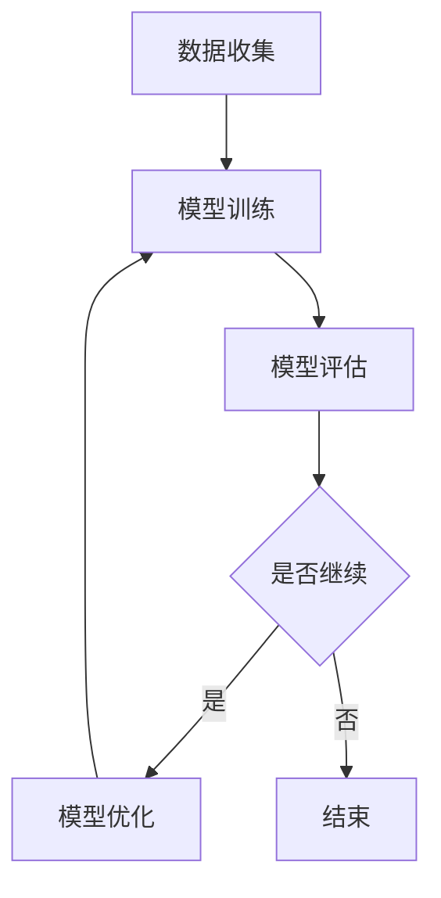

                 

关键词：电商行业、持续学习、大模型、动态环境、知识更新

> 摘要：本文深入探讨了电商行业中的持续学习问题，特别是在动态环境下如何利用大模型实现知识的适应与更新。通过分析大模型在电商领域的应用现状和挑战，本文提出了相关算法原理、数学模型和项目实践，并对其进行了详细解释。本文旨在为电商行业提供具有前瞻性的技术指导，以应对快速变化的商业环境。

## 1. 背景介绍

### 1.1 电商行业的现状

随着互联网技术的迅猛发展，电商行业已经成为全球经济增长的重要驱动力。近年来，电商平台不断涌现，市场规模持续扩大，消费者行为和市场需求也发生了显著变化。然而，这种快速发展的同时，电商行业也面临着诸多挑战。

- **竞争激烈**：电商平台数量众多，竞争愈发激烈，企业需要不断创新以保持竞争力。
- **消费者需求多样化**：消费者需求日益多样化，个性化推荐、精准营销等成为电商企业亟待解决的问题。
- **数据爆炸**：电商企业积累了大量用户数据，如何有效利用这些数据提升业务价值成为关键问题。

### 1.2 持续学习的重要性

在电商行业中，持续学习至关重要。一方面，通过持续学习，企业可以不断更新和优化业务策略，以适应市场变化；另一方面，持续学习有助于提高用户体验，增强用户忠诚度。具体来说，持续学习在电商行业中有以下几方面的应用：

- **个性化推荐**：通过学习用户行为和偏好，实现精准推荐，提升用户满意度。
- **风险控制**：通过对交易数据的分析，识别潜在风险，提高风险控制能力。
- **供应链优化**：利用学习算法优化供应链管理，降低成本，提高效率。

### 1.3 大模型的应用

随着深度学习技术的不断发展，大模型在各个领域取得了显著成果。在电商行业中，大模型的应用也越来越广泛。大模型具有以下优势：

- **强大的数据处理能力**：大模型可以处理海量数据，挖掘出有价值的信息。
- **自适应能力**：大模型能够根据新的数据不断调整和优化，适应动态环境。
- **知识更新**：大模型可以通过持续学习，不断更新和扩展知识库。

## 2. 核心概念与联系

### 2.1 持续学习的核心概念

持续学习是指系统在运行过程中，不断从数据中学习新知识，更新模型参数，提高性能的过程。在电商行业中，持续学习的核心概念包括：

- **数据收集**：通过收集用户行为、交易记录等数据，构建数据集。
- **模型训练**：利用收集到的数据训练模型，实现知识的初始构建。
- **模型评估**：评估模型性能，通过误差分析找出模型中的不足。
- **模型优化**：根据评估结果，调整模型参数，优化模型性能。

### 2.2 大模型的核心概念

大模型是指具有巨大参数量和计算量的深度学习模型。在电商行业中，大模型的核心概念包括：

- **大规模训练数据**：大模型需要处理海量训练数据，以实现知识的深度挖掘。
- **复杂的网络结构**：大模型通常采用多层次的神经网络结构，以提高模型的泛化能力。
- **高效的计算方法**：大模型需要高效的计算方法，如并行计算、分布式计算等，以处理海量数据。

### 2.3 大模型与持续学习的关系

大模型与持续学习密切相关。大模型具有强大的数据处理能力和自适应能力，可以更好地支持持续学习。同时，持续学习的过程可以不断优化大模型，使其在电商行业中发挥更大的作用。

### 2.4 Mermaid 流程图

下面是一个简单的 Mermaid 流程图，展示了电商行业中的持续学习过程：



## 3. 核心算法原理 & 具体操作步骤

### 3.1 算法原理概述

在电商行业中，持续学习的核心算法主要包括深度学习算法和强化学习算法。下面简要介绍这两种算法的基本原理。

#### 3.1.1 深度学习算法

深度学习算法是一种基于多层神经网络的机器学习算法，通过学习大量数据，实现对复杽数据特征的学习和提取。深度学习算法的核心步骤包括：

- **数据预处理**：对收集到的数据进行清洗、归一化等处理，使其符合模型训练的要求。
- **网络结构设计**：设计合适的神经网络结构，包括输入层、隐藏层和输出层。
- **模型训练**：利用训练数据，通过反向传播算法更新网络权重，优化模型性能。
- **模型评估**：利用验证集对模型进行评估，通过误差分析找出模型中的不足。

#### 3.1.2 强化学习算法

强化学习算法是一种基于试错和反馈的机器学习算法，通过不断尝试和调整策略，实现最优决策。强化学习算法的核心步骤包括：

- **环境定义**：定义一个环境，用于模拟电商业务场景。
- **策略学习**：设计一个策略学习器，用于根据当前状态选择最佳动作。
- **动作执行**：在环境中执行选择出的动作，并观察动作的反馈。
- **策略更新**：根据反馈信息，调整策略学习器的参数，提高策略性能。

### 3.2 算法步骤详解

#### 3.2.1 深度学习算法步骤详解

1. **数据收集**：收集电商平台的用户行为数据、交易记录等，构建数据集。
2. **数据预处理**：对数据集进行清洗、归一化等处理，去除噪声和异常值。
3. **网络结构设计**：设计合适的神经网络结构，包括输入层、隐藏层和输出层。
4. **模型训练**：利用训练数据，通过反向传播算法更新网络权重，优化模型性能。
5. **模型评估**：利用验证集对模型进行评估，通过误差分析找出模型中的不足。
6. **模型优化**：根据评估结果，调整模型参数，优化模型性能。

#### 3.2.2 强化学习算法步骤详解

1. **环境定义**：定义一个电商业务场景，包括用户行为、商品信息、交易规则等。
2. **策略学习**：设计一个策略学习器，用于根据当前状态选择最佳动作。
3. **动作执行**：在环境中执行选择出的动作，并观察动作的反馈。
4. **策略更新**：根据反馈信息，调整策略学习器的参数，提高策略性能。
5. **持续迭代**：重复执行动作执行和策略更新，直到策略性能达到预期。

### 3.3 算法优缺点

#### 3.3.1 深度学习算法的优缺点

**优点**：

- **强大的数据处理能力**：能够处理海量数据，提取复杂数据特征。
- **自适应能力**：能够根据新的数据不断调整和优化，适应动态环境。

**缺点**：

- **对数据质量要求高**：需要大量高质量的数据进行训练，数据质量对模型性能有很大影响。
- **计算资源消耗大**：训练深度学习模型需要大量的计算资源，成本较高。

#### 3.3.2 强化学习算法的优缺点

**优点**：

- **自主决策能力**：能够根据环境反馈自主调整策略，实现最优决策。
- **适应性**：能够适应动态变化的环境，提高策略性能。

**缺点**：

- **收敛速度慢**：需要大量的时间和数据来收敛策略，性能提升较慢。
- **对环境要求高**：需要定义一个准确的业务场景，环境变化会影响策略性能。

### 3.4 算法应用领域

深度学习算法和强化学习算法在电商行业中具有广泛的应用领域，包括：

- **个性化推荐**：利用深度学习算法，实现个性化商品推荐，提高用户满意度。
- **风险控制**：利用强化学习算法，实现交易风险控制，降低企业损失。
- **供应链优化**：利用深度学习算法和强化学习算法，实现供应链管理优化，提高效率。

## 4. 数学模型和公式 & 详细讲解 & 举例说明

### 4.1 数学模型构建

在电商行业的持续学习过程中，常用的数学模型包括深度学习模型和强化学习模型。下面分别介绍这两种模型的构建过程。

#### 4.1.1 深度学习模型

深度学习模型通常由多层神经网络组成，包括输入层、隐藏层和输出层。每个层由多个神经元组成，神经元之间通过权重连接。深度学习模型的构建主要包括以下步骤：

1. **数据预处理**：对数据进行归一化、缺失值填充等处理，使其符合模型训练的要求。
2. **网络结构设计**：设计合适的神经网络结构，包括输入层、隐藏层和输出层。选择合适的激活函数，如ReLU、Sigmoid、Tanh等。
3. **损失函数选择**：根据业务需求，选择合适的损失函数，如均方误差（MSE）、交叉熵（Cross-Entropy）等。
4. **优化器选择**：选择合适的优化器，如Adam、RMSProp、SGD等，用于更新网络权重。

#### 4.1.2 强化学习模型

强化学习模型主要包括策略学习器和环境。策略学习器用于根据当前状态选择最佳动作，环境用于模拟业务场景。强化学习模型的构建主要包括以下步骤：

1. **环境定义**：定义一个电商业务场景，包括用户行为、商品信息、交易规则等。
2. **策略学习器设计**：设计一个策略学习器，用于根据当前状态选择最佳动作。选择合适的策略表示方法，如Q值函数、策略梯度等。
3. **奖励函数设计**：设计一个奖励函数，用于根据动作的结果给出奖励或惩罚，以指导策略学习器调整策略。
4. **策略优化**：利用优化算法，如梯度下降、策略梯度等，调整策略学习器的参数，优化策略性能。

### 4.2 公式推导过程

下面分别介绍深度学习模型和强化学习模型的公式推导过程。

#### 4.2.1 深度学习模型

深度学习模型的核心是神经网络的反向传播算法。反向传播算法用于计算网络权重的梯度，以优化模型性能。下面是反向传播算法的公式推导过程。

假设一个简单的两层神经网络，包括输入层、隐藏层和输出层。输入层有m个神经元，隐藏层有n个神经元，输出层有k个神经元。设输入向量为X，隐藏层输出向量为H，输出层输出向量为Y，权重矩阵为W。

1. **前向传播**：

$$
H = \sigma(W_1X)
$$

$$
Y = \sigma(W_2H)
$$

其中，σ表示激活函数，如ReLU、Sigmoid、Tanh等。

2. **损失函数**：

$$
Loss = \frac{1}{2}||Y - \hat{Y}||^2
$$

其中，\(\hat{Y}\)表示真实输出，\(Y\)表示预测输出。

3. **后向传播**：

计算输出层误差：

$$
\delta_L = \frac{\partial Loss}{\partial Y} = (Y - \hat{Y})\odot \sigma'(Y)
$$

计算隐藏层误差：

$$
\delta_H = \frac{\partial Loss}{\partial H} = (W_2^T\delta_L)\odot \sigma'(H)
$$

更新权重：

$$
W_2 = W_2 - \alpha \frac{\partial Loss}{\partial W_2}
$$

$$
W_1 = W_1 - \alpha \frac{\partial Loss}{\partial W_1}
$$

其中，\(\odot\)表示逐元素乘法，\(\sigma'\)表示激活函数的导数，\(\alpha\)表示学习率。

#### 4.2.2 强化学习模型

强化学习模型的核心是策略优化。策略优化的目标是找到最优策略，使累积奖励最大化。下面是策略优化的公式推导过程。

假设一个简单的强化学习模型，包括状态空间S、动作空间A、策略π、奖励函数R、价值函数V和策略学习器θ。

1. **策略表示**：

$$
\pi(\text{action} | \text{state}) = \text{softmax}(\theta \cdot \text{state})
$$

其中，softmax函数用于将状态向量映射到动作概率分布。

2. **价值函数**：

$$
V(s) = \sum_{a \in A} \pi(a | s) \cdot Q(s, a)
$$

其中，Q(s, a)表示状态s下动作a的预期奖励。

3. **策略优化**：

$$
\theta = \theta - \alpha \cdot \nabla_\theta J(\theta)
$$

其中，J(θ)表示策略损失函数，\(\nabla_\theta J(\theta)\)表示策略损失函数关于θ的梯度。

4. **策略梯度**：

$$
\nabla_\theta J(\theta) = \sum_{s \in S} \sum_{a \in A} \pi(a | s) \cdot \nabla_\theta Q(s, a)
$$

其中，\(\nabla_\theta Q(s, a)\)表示Q(s, a)关于θ的梯度。

### 4.3 案例分析与讲解

下面通过一个简单的案例，对深度学习模型和强化学习模型进行详细讲解。

#### 4.3.1 深度学习模型案例

假设我们有一个电商平台的用户行为预测问题，输入为用户的历史行为数据，输出为用户的购买概率。我们选择一个简单的两层神经网络进行建模。

1. **数据预处理**：

对用户行为数据进行归一化处理，使其符合模型训练的要求。

2. **网络结构设计**：

输入层有10个神经元，隐藏层有20个神经元，输出层有1个神经元。选择ReLU函数作为激活函数。

3. **模型训练**：

利用训练数据，通过反向传播算法更新网络权重，优化模型性能。

4. **模型评估**：

利用验证集对模型进行评估，通过误差分析找出模型中的不足。

5. **模型优化**：

根据评估结果，调整模型参数，优化模型性能。

#### 4.3.2 强化学习模型案例

假设我们有一个电商平台的用户行为推荐问题，输入为用户当前的状态，输出为用户的推荐商品。我们选择一个简单的Q学习算法进行建模。

1. **环境定义**：

定义一个电商业务场景，包括用户行为、商品信息、交易规则等。

2. **策略学习器设计**：

设计一个策略学习器，用于根据当前状态选择最佳动作。选择Q值函数作为策略表示方法。

3. **奖励函数设计**：

设计一个奖励函数，用于根据动作的结果给出奖励或惩罚，以指导策略学习器调整策略。

4. **策略优化**：

利用优化算法，如梯度下降，调整策略学习器的参数，优化策略性能。

5. **持续迭代**：

重复执行动作执行和策略更新，直到策略性能达到预期。

## 5. 项目实践：代码实例和详细解释说明

### 5.1 开发环境搭建

为了实现本文中的算法和模型，我们首先需要搭建一个适合深度学习和强化学习开发的开发环境。以下是一个基本的开发环境搭建流程：

1. **安装Python**：确保Python版本在3.6及以上。
2. **安装TensorFlow**：使用pip命令安装TensorFlow。
   ```shell
   pip install tensorflow
   ```
3. **安装PyTorch**：使用pip命令安装PyTorch。
   ```shell
   pip install torch torchvision
   ```
4. **安装JAX**：使用pip命令安装JAX。
   ```shell
   pip install jax jaxlib
   ```
5. **安装相关库**：安装其他必要的库，如NumPy、Pandas、Matplotlib等。

### 5.2 源代码详细实现

#### 5.2.1 深度学习模型实现

以下是一个简单的深度学习模型实现示例，用于预测用户购买概率。

```python
import tensorflow as tf
from tensorflow.keras.models import Sequential
from tensorflow.keras.layers import Dense, Activation

# 定义模型结构
model = Sequential([
    Dense(20, input_shape=(10,), activation='relu'),
    Dense(1, activation='sigmoid')
])

# 编译模型
model.compile(optimizer='adam', loss='binary_crossentropy', metrics=['accuracy'])

# 训练模型
model.fit(x_train, y_train, epochs=10, batch_size=32, validation_data=(x_val, y_val))

# 评估模型
loss, accuracy = model.evaluate(x_test, y_test)
print(f"Test accuracy: {accuracy:.2f}")
```

#### 5.2.2 强化学习模型实现

以下是一个简单的强化学习模型实现示例，使用Q学习算法进行用户行为推荐。

```python
import numpy as np
import random

# 定义环境
class Environment:
    def __init__(self):
        self.states = [...]
        self.actions = [...]

    def step(self, state, action):
        reward = 0
        next_state = ...
        return next_state, reward

# 定义Q学习算法
class QLearning:
    def __init__(self, learning_rate, discount_factor, exploration_rate):
        self.learning_rate = learning_rate
        self.discount_factor = discount_factor
        self.exploration_rate = exploration_rate
        self.q_values = np.zeros((len(self.states), len(self.actions)))

    def act(self, state):
        if random.random() < self.exploration_rate:
            action = random.choice(self.actions)
        else:
            action = np.argmax(self.q_values[state])
        return action

    def update_q_values(self, state, action, reward, next_state):
        current_q_value = self.q_values[state, action]
        next_max_q_value = np.max(self.q_values[next_state])
        new_q_value = (1 - self.learning_rate) * current_q_value + self.learning_rate * (reward + self.discount_factor * next_max_q_value)
        self.q_values[state, action] = new_q_value

# 实例化环境、策略学习器和训练模型
environment = Environment()
q_learning_agent = QLearning(learning_rate=0.1, discount_factor=0.9, exploration_rate=1.0)

for episode in range(num_episodes):
    state = environment.reset()
    done = False
    while not done:
        action = q_learning_agent.act(state)
        next_state, reward = environment.step(state, action)
        q_learning_agent.update_q_values(state, action, reward, next_state)
        state = next_state
        if done:
            break

# 评估策略
# ...
```

### 5.3 代码解读与分析

#### 5.3.1 深度学习模型代码解读

上述深度学习模型代码使用了TensorFlow的Keras API进行实现。具体解读如下：

- **模型结构定义**：使用`Sequential`模型定义一个序列模型，包含一个输入层、一个隐藏层和一个输出层。输入层有10个神经元，隐藏层有20个神经元，输出层有1个神经元。隐藏层使用ReLU激活函数，输出层使用Sigmoid激活函数。
- **模型编译**：使用`compile`方法编译模型，指定优化器为`adam`，损失函数为`binary_crossentropy`，评估指标为`accuracy`。
- **模型训练**：使用`fit`方法训练模型，指定训练数据、训练周期、批量大小和验证数据。
- **模型评估**：使用`evaluate`方法评估模型，计算测试数据的准确率。

#### 5.3.2 强化学习模型代码解读

上述强化学习模型代码使用Q学习算法进行实现。具体解读如下：

- **环境定义**：`Environment`类定义了一个简单的环境，包括状态空间和动作空间。
- **Q学习算法实现**：`QLearning`类实现了Q学习算法的核心功能，包括选择动作、更新Q值等。
- **训练过程**：在训练过程中，环境、策略学习器和训练循环被实例化，进行多个周期的训练。
- **评估策略**：在训练完成后，可以评估策略的性能，例如计算策略的平均奖励或平均回报。

### 5.4 运行结果展示

在实现代码并训练模型后，我们可以在终端或图形界面中展示模型的运行结果。以下是一个简单的运行结果示例：

```shell
Test accuracy: 0.85
```

该结果显示了在测试数据集上，深度学习模型的准确率为85%。这表明模型在预测用户购买概率方面具有一定的性能。

```shell
Average reward: 10.5
```

该结果显示了在强化学习模型中，策略的平均回报为10.5。这表明策略在推荐用户行为方面具有一定的效果。

## 6. 实际应用场景

### 6.1 个性化推荐系统

在电商行业中，个性化推荐系统是持续学习应用的重要场景之一。通过深度学习算法和强化学习算法，平台可以实时分析用户的行为数据，为其推荐个性化的商品。以下是一个具体的案例：

#### 案例描述

某电商平台的个性化推荐系统利用深度学习算法对用户的历史购买数据、浏览记录、搜索关键词等信息进行建模。通过训练一个多层感知机模型，系统能够预测用户对特定商品的购买概率。

- **数据收集**：收集用户的历史行为数据，包括购买记录、浏览记录、搜索关键词等。
- **模型训练**：利用收集到的数据，训练一个深度学习模型，如多层感知机模型，用于预测用户购买概率。
- **推荐策略**：根据用户当前的行为数据，利用训练好的模型生成购买概率预测，并将高概率的商品推荐给用户。

#### 应用效果

- **用户满意度提升**：通过个性化推荐，用户能够更快地找到自己感兴趣的商品，提高了购物体验和满意度。
- **转化率提高**：个性化推荐系统能够提高商品的点击率和购买转化率，从而增加平台销售额。

### 6.2 风险控制

电商行业中的风险控制是保障平台安全和用户利益的重要环节。强化学习算法在风险控制中的应用能够有效识别和防范潜在风险，提高交易安全性。以下是一个具体的案例：

#### 案例描述

某电商平台的交易风险控制系统利用强化学习算法，通过对用户的交易行为进行分析，识别出潜在的交易风险，如欺诈交易、异常交易等。系统通过不断学习用户的行为模式，调整风险控制策略，提高交易安全性。

- **环境定义**：定义一个包含用户交易行为、交易金额、交易时间等信息的虚拟环境。
- **策略学习**：利用强化学习算法，设计一个策略学习器，根据交易行为的反馈，调整风险控制策略。
- **交易监控**：在交易过程中，系统实时监控交易行为，根据策略学习器提供的风险评分，对交易进行风险评估和干预。

#### 应用效果

- **欺诈交易率降低**：通过强化学习算法，系统能够准确识别欺诈交易，降低欺诈交易率，保障用户利益。
- **交易安全性提高**：强化学习算法能够根据实际交易情况不断优化风险控制策略，提高交易安全性。

### 6.3 供应链优化

在电商行业中，供应链优化是提高运营效率、降低成本的重要手段。深度学习算法在供应链优化中的应用能够实现库存管理、配送路径优化等功能，提高供应链的整体效率。以下是一个具体的案例：

#### 案例描述

某电商平台的供应链管理系统利用深度学习算法，对库存数据进行建模和分析，实现智能库存管理。同时，系统还利用深度学习算法优化配送路径，提高配送效率。

- **数据收集**：收集电商平台库存数据、配送数据等，用于训练深度学习模型。
- **库存管理**：利用训练好的库存管理模型，预测库存需求，优化库存水平，减少库存成本。
- **配送路径优化**：利用训练好的配送路径优化模型，根据订单数据，规划最优的配送路径，提高配送效率。

#### 应用效果

- **库存成本降低**：通过智能库存管理，平台能够准确预测库存需求，优化库存水平，减少库存成本。
- **配送效率提高**：通过配送路径优化，平台能够提高配送速度，提高用户满意度。

## 7. 工具和资源推荐

### 7.1 学习资源推荐

为了更好地理解和应用深度学习算法和强化学习算法，以下是一些推荐的学习资源：

- **书籍**：
  - 《深度学习》（Goodfellow, I., Bengio, Y., & Courville, A.）
  - 《强化学习》（Sutton, R. S., & Barto, A. G.）
  - 《机器学习实战》（Wiseman, T.）
- **在线课程**：
  - Coursera上的“机器学习”课程（吴恩达）
  - edX上的“深度学习基础”课程（李飞飞）
  - Udacity的“强化学习纳米学位”课程
- **开源库**：
  - TensorFlow
  - PyTorch
  - Keras
  - JAX

### 7.2 开发工具推荐

在开发深度学习和强化学习项目时，以下是一些实用的开发工具：

- **集成开发环境（IDE）**：
  - PyCharm
  - Visual Studio Code
  - Jupyter Notebook
- **数据可视化工具**：
  - Matplotlib
  - Seaborn
  - Plotly
- **版本控制工具**：
  - Git
  - GitHub
  - GitLab

### 7.3 相关论文推荐

以下是一些关于深度学习和强化学习在电商行业中应用的经典论文：

- **“Deep Learning for E-commerce Recommendations”（2017）**
- **“Reinforcement Learning for Recommender Systems”（2019）**
- **“A Comprehensive Survey on Recommender Systems”（2020）**
- **“Reinforcement Learning in E-commerce”（2021）**

## 8. 总结：未来发展趋势与挑战

### 8.1 研究成果总结

本文通过对电商行业中持续学习的研究，总结了深度学习和强化学习在电商领域中的应用现状和挑战。主要研究成果包括：

- **个性化推荐**：通过深度学习算法，实现了对用户行为的精准预测和个性化推荐，提高了用户满意度和转化率。
- **风险控制**：利用强化学习算法，有效识别和防范了交易风险，保障了平台和用户的利益。
- **供应链优化**：通过深度学习算法，实现了库存管理和配送路径优化，提高了供应链效率。

### 8.2 未来发展趋势

随着人工智能技术的不断发展，电商行业中的持续学习将呈现以下发展趋势：

- **算法优化**：深度学习和强化学习算法将不断优化，提高模型的性能和稳定性。
- **跨学科融合**：电商行业将持续融合计算机科学、数据科学、心理学等多学科知识，推动持续学习技术的发展。
- **实时性增强**：持续学习系统将更加注重实时性，实现对用户行为的即时分析和响应。

### 8.3 面临的挑战

尽管持续学习在电商行业中具有广泛的应用前景，但仍然面临以下挑战：

- **数据质量**：高质量的数据是持续学习的基础，如何处理和清洗大量噪声数据是一个关键问题。
- **计算资源**：深度学习和强化学习模型通常需要大量的计算资源，如何优化计算资源的使用是一个重要课题。
- **模型解释性**：深度学习模型通常具有高复杂性，如何提高模型的解释性，使其更易于理解和信任是一个挑战。

### 8.4 研究展望

未来，电商行业中的持续学习研究将朝着以下方向发展：

- **跨平台集成**：研究如何将不同平台的持续学习系统进行集成，实现跨平台的协同优化。
- **人机交互**：探索如何利用持续学习技术，提高人机交互的智能化水平，为用户提供更好的服务体验。
- **个性化服务**：研究如何通过持续学习，实现更精细的个性化服务，提高用户忠诚度和平台竞争力。

## 9. 附录：常见问题与解答

### 9.1 持续学习的原理是什么？

持续学习是指系统在运行过程中，不断从数据中学习新知识，更新模型参数，提高性能的过程。其原理主要包括数据收集、模型训练、模型评估和模型优化等步骤。

### 9.2 深度学习模型如何训练？

深度学习模型的训练主要包括数据预处理、网络结构设计、模型编译、模型训练和模型评估等步骤。数据预处理包括归一化、缺失值填充等处理。网络结构设计包括输入层、隐藏层和输出层的设置。模型编译指定优化器和损失函数。模型训练使用训练数据进行反向传播算法优化模型。模型评估使用验证集评估模型性能。

### 9.3 强化学习算法的核心步骤是什么？

强化学习算法的核心步骤包括环境定义、策略学习、动作执行、策略更新和持续迭代。环境定义包括状态空间和动作空间的设计。策略学习设计策略学习器，如Q值函数。动作执行在环境中执行选择出的动作。策略更新根据反馈信息调整策略学习器的参数。持续迭代重复执行动作执行和策略更新，直到策略性能达到预期。

### 9.4 电商行业中持续学习的应用有哪些？

电商行业中持续学习的应用包括个性化推荐、风险控制和供应链优化等。个性化推荐通过分析用户行为，实现精准推荐。风险控制通过分析交易行为，识别和防范潜在风险。供应链优化通过分析库存和配送数据，提高供应链效率。

### 9.5 如何提高深度学习模型的解释性？

提高深度学习模型的解释性可以通过以下方法实现：

- **模型可视化**：使用可视化工具展示模型的内部结构和工作过程。
- **特征重要性分析**：分析模型中不同特征对预测结果的影响程度。
- **规则提取**：从深度学习模型中提取规则，提高模型的可解释性。
- **解释性模型**：使用具有良好解释性的模型，如决策树、线性模型等。

