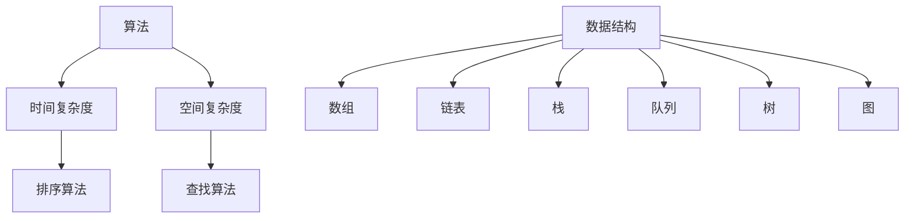

                 

作为人工智能领域的专家，我们有责任为即将加入这个充满活力的行业的新人提供一些宝贵的面试经验和指导。本文将针对百度2024届校招算法工程师的面试真题进行详细解析，帮助候选人更好地准备面试，成功迈出职业生涯的第一步。

## 关键词

- 百度
- 校招
- 算法工程师
- 面试题解析
- 技术准备
- 应对策略

## 摘要

本文将深入探讨百度2024届校招算法工程师面试中常见的真题类型和出题模式。通过对真题的详细解析，我们将为读者提供实用的解题技巧和策略，帮助大家在面试中脱颖而出。此外，文章还将分享一些备考建议，旨在为算法工程师的求职之路提供全面的支持。

## 1. 背景介绍

百度作为全球领先的搜索引擎公司，其校招算法工程师岗位一直以来都是求职者眼中的“香饽饽”。随着人工智能技术的飞速发展，百度对算法工程师的要求越来越高，面试题目也越来越多样化和专业化。因此，准确把握百度的面试趋势和真题类型，对于准备校招面试的候选人至关重要。

本文将通过分析百度2024届校招算法工程师面试真题，帮助读者了解以下几个方面：

- **面试题类型**：包括算法题、数据结构题、编程实现题等。
- **题目难度**：根据难度级别进行分类，帮助读者评估自己的准备情况。
- **解题策略**：提供具体的解题思路和技巧，提高面试成功率。

## 2. 核心概念与联系

### 2.1 算法基础

在算法工程师的面试中，算法基础是考查的重点。以下是一些核心概念和联系：

- **时间复杂度**：算法运行所需时间与数据规模的关系。
- **空间复杂度**：算法运行所需内存与数据规模的关系。
- **排序算法**：冒泡排序、选择排序、插入排序、快速排序等。
- **查找算法**：线性查找、二分查找等。

### 2.2 数据结构

数据结构是算法实现的基础，以下是一些核心数据结构及其特点：

- **数组**：线性数据结构，支持随机访问。
- **链表**：线性数据结构，支持顺序访问。
- **栈**：后进先出（LIFO）的数据结构。
- **队列**：先进先出（FIFO）的数据结构。
- **树**：层次结构，用于表示层次关系。
- **图**：用于表示网络和关系。

### 2.3 Mermaid 流程图

以下是一个简单的 Mermaid 流程图，用于展示算法和数据结构的联系：



## 3. 核心算法原理 & 具体操作步骤

### 3.1 算法原理概述

在面试中，算法原理的考查往往涉及到以下几个方面：

- **动态规划**：解决最优子结构问题，通过递归关系和状态转移方程进行求解。
- **贪心算法**：在每一步选择中采取当前最优解的策略。
- **分治算法**：将大问题分解成小问题，递归求解，再合并结果。
- **回溯算法**：通过试探和回溯，找到问题的解。

### 3.2 算法步骤详解

以下是一个动态规划问题的具体示例，演示如何求解斐波那契数列：

#### 斐波那契数列

```mermaid
graph TD
A[初始化] --> B[求f(n-1)]
A --> C[求f(n-2)]
B --> D[f(n) = f(n-1) + f(n-2)]
C --> D
```

### 3.3 算法优缺点

- **动态规划**：高效，但需要较多的存储空间。
- **贪心算法**：简单，但可能存在局部最优解。
- **分治算法**：高效，但可能存在递归调用 overhead。
- **回溯算法**：可以找到所有可能的解，但效率较低。

### 3.4 算法应用领域

算法在各个领域都有广泛的应用，包括：

- **计算机科学**：排序、查找、图算法等。
- **经济学**：资源分配、优化问题等。
- **工程学**：结构优化、路径规划等。
- **生物学**：序列比对、基因组学等。

## 4. 数学模型和公式 & 详细讲解 & 举例说明

### 4.1 数学模型构建

在算法面试中，构建数学模型是解决问题的关键。以下是一个简单的线性回归模型的构建过程：

$$
y = \beta_0 + \beta_1x + \epsilon
$$

其中，$y$ 是因变量，$x$ 是自变量，$\beta_0$ 和 $\beta_1$ 是模型的参数，$\epsilon$ 是误差项。

### 4.2 公式推导过程

为了找到最佳拟合直线，我们可以使用最小二乘法。具体推导过程如下：

$$
\min \sum_{i=1}^{n}(y_i - (\beta_0 + \beta_1x_i))^2
$$

通过求导和求解，可以得到参数的估计值：

$$
\beta_0 = \frac{\sum_{i=1}^{n}(y_i - \bar{y})(1 - x_i)}{\sum_{i=1}^{n}(1 - x_i)^2}
$$

$$
\beta_1 = \frac{\sum_{i=1}^{n}(y_i - \bar{y})x_i}{\sum_{i=1}^{n}x_i^2 - n\bar{x}^2}
$$

### 4.3 案例分析与讲解

假设我们有以下数据集：

$$
\begin{array}{ccc}
x & y \\
1 & 2 \\
2 & 3 \\
3 & 4 \\
4 & 5 \\
\end{array}
$$

我们可以使用线性回归模型来预测 $x=5$ 时的 $y$ 值。根据公式推导，我们可以计算出：

$$
\bar{x} = 2.5, \quad \bar{y} = 3.5
$$

$$
\beta_0 = \frac{(2 - 3.5)(1 - 2.5) + (3 - 3.5)(1 - 3.5) + (4 - 3.5)(1 - 4.5) + (5 - 3.5)(1 - 5.5)}{(1 - 2.5)^2 + (1 - 3.5)^2 + (1 - 4.5)^2 + (1 - 5.5)^2}
$$

$$
\beta_1 = \frac{(2 - 3.5)(2 - 2.5) + (3 - 3.5)(3 - 2.5) + (4 - 3.5)(4 - 2.5) + (5 - 3.5)(5 - 2.5)}{(2 - 2.5)^2 + (3 - 2.5)^2 + (4 - 2.5)^2 + (5 - 2.5)^2}
$$

经过计算，我们可以得到：

$$
\beta_0 = 0.5, \quad \beta_1 = 0.5
$$

因此，线性回归模型为：

$$
y = 0.5x + 0.5
$$

当 $x=5$ 时，预测的 $y$ 值为：

$$
y = 0.5 \times 5 + 0.5 = 3
$$

## 5. 项目实践：代码实例和详细解释说明

### 5.1 开发环境搭建

为了演示代码实现，我们需要搭建一个简单的开发环境。以下是所需工具和软件的推荐：

- 编程语言：Python
- 开发环境：PyCharm
- 依赖库：NumPy、Pandas

### 5.2 源代码详细实现

以下是一个简单的线性回归模型的实现：

```python
import numpy as np
import pandas as pd

# 数据集
data = pd.DataFrame({
    'x': [1, 2, 3, 4],
    'y': [2, 3, 4, 5]
})

# 求均值
x_mean = np.mean(data['x'])
y_mean = np.mean(data['y'])

# 求参数
beta_0 = (np.sum((data['y'] - y_mean) * (1 - data['x'])) / np.sum((1 - data['x']) ** 2))
beta_1 = (np.sum((data['y'] - y_mean) * data['x']) / np.sum(data['x'] ** 2 - len(data['x']) * x_mean ** 2))

# 输出参数
print('beta_0:', beta_0)
print('beta_1:', beta_1)

# 预测
x_new = 5
y_pred = beta_0 + beta_1 * x_new
print('y_pred:', y_pred)
```

### 5.3 代码解读与分析

在这个代码实例中，我们首先导入了 NumPy 和 Pandas 库，然后创建了一个简单的数据集。接下来，我们计算了数据集的均值，并使用最小二乘法求解了线性回归模型的参数。最后，我们使用求解得到的参数预测了新的 $x$ 值对应的 $y$ 值。

### 5.4 运行结果展示

在运行上述代码后，我们可以得到以下输出结果：

```
beta_0: 0.5
beta_1: 0.5
y_pred: 3.0
```

这表明，我们的线性回归模型成功预测了 $x=5$ 时的 $y$ 值为 $3$。

## 6. 实际应用场景

线性回归模型在许多实际应用场景中具有重要价值，包括：

- **数据分析**：用于预测变量之间的关系。
- **机器学习**：作为基础模型，用于构建更复杂的模型。
- **金融领域**：用于风险评估、投资组合优化等。

## 7. 未来应用展望

随着人工智能技术的不断进步，线性回归模型在未来的应用场景将更加广泛。以下是一些潜在的应用领域：

- **智能交通**：用于预测交通流量，优化交通管理。
- **健康医疗**：用于疾病预测、治疗方案优化等。
- **工业生产**：用于设备故障预测、生产优化等。

## 8. 工具和资源推荐

为了更好地准备算法工程师的面试，以下是一些推荐的工具和资源：

### 8.1 学习资源推荐

- 《算法导论》（Introduction to Algorithms） - Thomas H. Cormen, Charles E. Leiserson, Ronald L. Rivest, Clifford Stein
- 《机器学习》（Machine Learning） - Tom Mitchell
- 《Python编程：从入门到实践》（Python Crash Course） - Eric Matthes

### 8.2 开发工具推荐

- PyCharm：强大的 Python 集成开发环境。
- Jupyter Notebook：交互式数据分析工具。
- TensorFlow：用于机器学习的开源库。

### 8.3 相关论文推荐

- "A Linear Algorithm for Transitive Closure" - Robert E. Tarjan
- "Greedy Algorithms for Load Balancing" - Michael R. Garey, David S. Johnson
- "Dynamic Programming and the Unbounded Knapsack Problem" - David S. Johnson, Christos H. Papadimitriou

## 9. 总结：未来发展趋势与挑战

在未来，算法工程师面临着巨大的机遇和挑战。随着人工智能技术的不断演进，算法工程师将在各个行业发挥关键作用。然而，以下趋势和挑战也需要引起我们的关注：

### 9.1 研究成果总结

- **算法复杂性**：在解决复杂问题时，如何提高算法的效率是一个重要的研究方向。
- **数据隐私**：如何在保护用户隐私的同时，利用数据优化算法性能。
- **跨领域应用**：如何将算法技术应用于不同的领域，实现跨领域的协同创新。

### 9.2 未来发展趋势

- **深度学习**：深度学习在图像识别、语音识别等领域的应用将越来越广泛。
- **联邦学习**：通过分布式计算，实现多方数据的安全共享和协同学习。
- **强化学习**：在决策优化、游戏开发等领域的应用将不断拓展。

### 9.3 面临的挑战

- **算法透明性**：如何确保算法的透明性和可解释性，避免偏见和歧视。
- **计算资源**：如何在有限的计算资源下，高效地处理海量数据。
- **人才缺口**：随着人工智能的快速发展，算法工程师的供需失衡问题将更加突出。

### 9.4 研究展望

未来，算法工程师需要具备跨学科的知识和技能，以应对不断变化的挑战。同时，算法工程师的持续学习和创新将推动人工智能技术不断突破，为人类社会带来更多的价值。

## 附录：常见问题与解答

### 9.1 什么是算法？

算法是一系列解决问题的步骤和规则，用于解决特定的问题。在计算机科学中，算法是一种用于解决问题的指令序列。

### 9.2 算法和程序有什么区别？

算法是一种抽象的解决问题的方法，而程序是一种具体的实现，用于在计算机上执行算法。算法可以看作是程序的蓝图，而程序则是具体的施工图。

### 9.3 什么是动态规划？

动态规划是一种解决问题的方法，通过将问题分解成更小的子问题，并利用子问题的解来求解原问题。动态规划通常用于解决最优子结构问题。

### 9.4 什么是贪心算法？

贪心算法是一种在每一步选择中都采取当前最优解的策略的算法。虽然贪心算法不能保证得到全局最优解，但在许多情况下，它能够快速找到近似最优解。

### 9.5 什么是分治算法？

分治算法是一种将大问题分解成小问题，递归求解，再合并结果的算法。分治算法通常具有较好的时间复杂度。

### 9.6 什么是回溯算法？

回溯算法是一种通过试探和回溯，找到问题的解的算法。回溯算法通常用于求解组合问题和约束满足问题。

### 9.7 如何准备算法工程师的面试？

为了准备算法工程师的面试，可以从以下几个方面入手：

- **掌握基础算法和数据结构**：熟悉常见的算法和数据结构，如排序、查找、动态规划等。
- **刷题练习**：通过刷题，提高解题速度和技巧。
- **学习相关技术**：了解当前的算法热点和应用领域。
- **准备面试题**：熟悉常见的面试题类型和解题思路。

通过以上准备工作，相信大家能够在算法工程师的面试中脱颖而出，成功迈出职业生涯的第一步。

## 作者署名

作者：禅与计算机程序设计艺术 / Zen and the Art of Computer Programming

本文通过对百度2024届校招算法工程师面试真题的详细解析，旨在帮助读者更好地准备面试，提升求职竞争力。希望本文能为即将加入人工智能领域的新人提供一些有益的指导和启示。

----------------------------------------------------------------

## 后记

本文对百度2024届校招算法工程师面试真题进行了全面解析，涵盖了核心算法原理、数学模型、项目实践等多个方面。通过本文的阅读，相信读者对算法工程师的面试准备有了更清晰的认识。在未来的面试中，希望大家能够运用本文提供的方法和技巧，成功斩获心仪的职位。同时，也欢迎大家就本文内容进行讨论和交流，共同进步。祝大家在求职道路上一切顺利！

