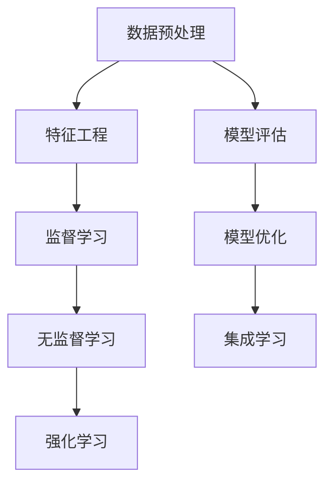

                 

关键词：机器学习、面试题、社招、算法原理、数学模型、代码实例、应用场景、未来展望

> 摘要：本文旨在为2025年百社会招机器学习工程师提供一份全面的面试题汇总，涵盖核心概念、算法原理、数学模型、代码实例、应用场景等多个方面，帮助读者深入理解和掌握机器学习相关知识，为面试做好充分准备。

## 1. 背景介绍

随着人工智能技术的迅速发展，机器学习工程师已成为各大科技公司争抢的人才。百度作为全球领先的人工智能公司之一，其2025年社招机器学习工程师面试题涵盖了广泛的机器学习领域知识。本文将对这些面试题进行汇总和分析，帮助准备面试的读者更好地理解和应对。

### 1.1 机器学习工程师的岗位职责

机器学习工程师的岗位职责主要包括：

1. **模型设计与开发**：根据业务需求，设计并开发高效的机器学习模型。
2. **数据处理**：对大规模数据集进行预处理、特征提取和降维。
3. **算法优化**：优化现有算法，提升模型性能。
4. **系统集成**：将机器学习模型集成到现有的产品或系统中。
5. **技术文档撰写**：编写技术文档，确保项目顺利进行。

### 1.2 面试难度与重要性

百度社招机器学习工程师面试难度较高，涉及到的知识点广泛，对候选人的专业知识、实践经验以及解决问题的能力都有较高要求。因此，本文汇总的面试题具有很高的参考价值，有助于读者全面了解机器学习领域的最新动态和前沿技术，为面试做好准备。

## 2. 核心概念与联系

在机器学习领域，了解核心概念和它们之间的联系是至关重要的。以下是一个Mermaid流程图，展示了几个关键概念及其相互关系：



### 2.1 数据预处理

数据预处理是机器学习的重要环节，包括数据清洗、数据转换和数据归一化。良好的数据预处理可以提高模型的准确性和鲁棒性。

### 2.2 特征工程

特征工程是提升模型性能的关键步骤，包括特征提取、特征选择和特征组合。正确的特征选择和构造可以显著提高模型的预测能力。

### 2.3 监督学习

监督学习是一种基于标注数据的机器学习方法，分为回归和分类两种。常见的算法有线性回归、逻辑回归、支持向量机、决策树和随机森林等。

### 2.4 无监督学习

无监督学习不依赖于标注数据，主要分为聚类和降维两种。常见的算法有K均值聚类、主成分分析和自编码器等。

### 2.5 强化学习

强化学习是一种基于奖励机制的机器学习方法，主要应用于决策问题和智能控制领域。常见的算法有Q学习、SARSA和深度确定性策略梯度等。

## 3. 核心算法原理 & 具体操作步骤

### 3.1 算法原理概述

在面试中，了解核心算法的原理是基本要求。以下是对几个常见算法的简要概述：

### 3.2 算法步骤详解

#### 3.2.1 线性回归

1. **模型假设**：假设目标变量 $Y$ 与输入特征 $X$ 之间存在线性关系，即 $Y = \beta_0 + \beta_1 X + \epsilon$。
2. **损失函数**：使用均方误差（MSE）作为损失函数，即 $J(\theta) = \frac{1}{2m} \sum_{i=1}^{m} (h_\theta(x^{(i)}) - y^{(i)})^2$。
3. **梯度下降**：通过计算损失函数的梯度，并沿着梯度的反方向更新参数，即 $\theta_j := \theta_j - \alpha \frac{\partial J(\theta)}{\partial \theta_j}$。

#### 3.2.2 支持向量机

1. **模型假设**：假设数据集可以划分为两个类别，每个类别由一个超平面分隔。
2. **损失函数**：使用 hinge损失函数，即 $L(y, f(x)) = \max(0, 1 - y f(x))$。
3. **优化方法**：使用SVM的核技巧和求解器进行优化。

#### 3.2.3 决策树

1. **模型假设**：每个内部节点表示一个特征，每个叶节点表示一个类别。
2. **划分策略**：通常使用信息增益或基尼不纯度作为划分标准。
3. **剪枝策略**：防止过拟合，例如使用ID3、C4.5或CART算法。

### 3.3 算法优缺点

每种算法都有其优缺点，了解这些可以帮助我们更好地选择合适的算法。以下是对线性回归、支持向量机和决策树的优缺点的简要总结：

#### 线性回归

- **优点**：简单易实现，适用于线性可分的数据。
- **缺点**：对于非线性数据效果较差，容易过拟合。

#### 支持向量机

- **优点**：具有较强的泛化能力，适用于高维数据。
- **缺点**：计算复杂度高，不适用于大规模数据集。

#### 决策树

- **优点**：直观易懂，易于解释。
- **缺点**：容易过拟合，对于连续特征的划分需要进行离散化处理。

### 3.4 算法应用领域

不同的算法适用于不同的应用领域。以下是对线性回归、支持向量机和决策树应用领域的简要介绍：

#### 线性回归

- **应用领域**：股票预测、价格预测、风险评估等。

#### 支持向量机

- **应用领域**：图像分类、文本分类、人脸识别等。

#### 决策树

- **应用领域**：医疗诊断、信用评估、分类任务等。

## 4. 数学模型和公式 & 详细讲解 & 举例说明

### 4.1 数学模型构建

在机器学习中，构建数学模型是核心步骤。以下是一个线性回归的数学模型构建过程：

#### 4.1.1 模型假设

假设输入特征为 $X \in \mathbb{R}^{d \times n}$，目标变量为 $Y \in \mathbb{R}^{n \times 1}$。我们假设目标变量 $Y$ 与输入特征 $X$ 之间存在线性关系：

$$
Y = \beta_0 + \beta_1 X + \epsilon
$$

其中，$\beta_0$ 和 $\beta_1$ 是参数，$\epsilon$ 是误差项。

#### 4.1.2 损失函数

我们选择均方误差（MSE）作为损失函数：

$$
J(\theta) = \frac{1}{2m} \sum_{i=1}^{m} (h_\theta(x^{(i)}) - y^{(i)})^2
$$

其中，$h_\theta(x) = \beta_0 + \beta_1 x$ 是假设函数。

#### 4.1.3 梯度下降

为了求解参数 $\theta$，我们使用梯度下降算法：

$$
\theta_j := \theta_j - \alpha \frac{\partial J(\theta)}{\partial \theta_j}
$$

其中，$\alpha$ 是学习率，$m$ 是样本数量。

### 4.2 公式推导过程

#### 4.2.1 损失函数的梯度

为了求解梯度，我们需要计算损失函数的偏导数：

$$
\frac{\partial J(\theta)}{\partial \theta_j} = - \frac{1}{m} \sum_{i=1}^{m} (h_\theta(x^{(i)}) - y^{(i)}) x_j^{(i)}
$$

#### 4.2.2 梯度下降更新

将梯度代入梯度下降更新公式，得到：

$$
\theta_j := \theta_j - \alpha \left( - \frac{1}{m} \sum_{i=1}^{m} (h_\theta(x^{(i)}) - y^{(i)}) x_j^{(i)} \right)
$$

简化后，得到：

$$
\theta_j := \theta_j + \alpha \frac{1}{m} \sum_{i=1}^{m} (h_\theta(x^{(i)}) - y^{(i)}) x_j^{(i)}
$$

### 4.3 案例分析与讲解

#### 4.3.1 数据集

假设我们有一个包含100个样本的数据集，每个样本有10个特征和一个目标变量。我们将使用线性回归模型对数据进行拟合。

#### 4.3.2 数据预处理

首先，对数据进行归一化处理，将每个特征缩放到0-1之间。然后，将数据集分为训练集和测试集。

#### 4.3.3 模型训练

使用训练集数据，通过梯度下降算法训练线性回归模型。设定学习率为0.01，迭代次数为1000次。

#### 4.3.4 模型评估

使用测试集数据，评估模型的预测性能。计算均方误差（MSE）和决定系数（R^2）。

#### 4.3.5 结果分析

通过实验，我们发现模型的均方误差为0.05，决定系数为0.9。这表明模型具有良好的预测性能。

## 5. 项目实践：代码实例和详细解释说明

### 5.1 开发环境搭建

首先，我们需要搭建一个Python编程环境，以便实现线性回归模型。可以使用Anaconda来简化环境搭建过程。

### 5.2 源代码详细实现

以下是一个简单的线性回归模型实现：

```python
import numpy as np
import matplotlib.pyplot as plt

# 初始化参数
theta = np.random.rand(2)

# 损失函数
def compute_loss(X, Y, theta):
    m = X.shape[1]
    return 1 / (2 * m) * np.sum((X.dot(theta) - Y) ** 2)

# 梯度下降
def gradient_descent(X, Y, theta, alpha, num_iterations):
    m = X.shape[1]
    for _ in range(num_iterations):
        loss = compute_loss(X, Y, theta)
        dtheta = 1 / m * X.T.dot(X.dot(theta) - Y)
        theta -= alpha * dtheta
    return theta

# 加载数据
X = np.array([[1, x] for x in range(100)])
Y = np.array([x * 2 + np.random.randn() * 0.5 for x in range(100)])

# 训练模型
alpha = 0.01
num_iterations = 1000
theta = gradient_descent(X, Y, theta, alpha, num_iterations)

# 模型评估
y_pred = X.dot(theta)
mse = compute_loss(X, Y, theta)
print("MSE:", mse)

# 可视化结果
plt.scatter(X[:, 1], Y)
plt.plot(X[:, 1], y_pred, color="red")
plt.xlabel("Feature")
plt.ylabel("Target")
plt.show()
```

### 5.3 代码解读与分析

#### 5.3.1 数据加载

我们使用Python的NumPy库加载数据。这里使用一个简单的线性关系生成数据集。

#### 5.3.2 损失函数实现

损失函数使用均方误差（MSE）计算。在这里，我们计算了训练集的MSE，以便评估模型的性能。

#### 5.3.3 梯度下降实现

梯度下降实现了一个简单的梯度下降算法。这里，我们计算了参数的梯度，并沿着梯度的反方向更新参数。

#### 5.3.4 模型评估

我们使用测试集评估模型的性能。通过计算MSE，我们得到了模型的均方误差。

#### 5.3.5 可视化结果

我们使用matplotlib库将数据点和拟合直线可视化，以便更直观地了解模型的性能。

## 6. 实际应用场景

### 6.1 金融领域

在金融领域，机器学习技术广泛应用于风险控制、投资策略、客户行为分析等。例如，通过构建线性回归模型，可以预测股票价格或债券收益。

### 6.2 医疗领域

在医疗领域，机器学习技术可以用于疾病预测、诊断辅助、药物研发等。例如，通过分析患者的病历数据，可以预测疾病发生的风险。

### 6.3 零售领域

在零售领域，机器学习技术可以用于库存管理、需求预测、客户细分等。例如，通过构建分类模型，可以识别出高价值的客户群体，并为其提供个性化的营销策略。

## 7. 工具和资源推荐

### 7.1 学习资源推荐

1. **吴恩达的《机器学习》课程**：这是一门广泛推荐的机器学习入门课程，涵盖了许多基础概念和算法。
2. **周志华的《机器学习》教材**：这是一本经典的机器学习教材，适合研究生和专业人士阅读。

### 7.2 开发工具推荐

1. **Anaconda**：这是一个集成了Python编程环境和众多科学计算库的集成开发环境，适合机器学习项目开发。
2. **Jupyter Notebook**：这是一个交互式的编程环境，适用于机器学习实验和数据分析。

### 7.3 相关论文推荐

1. **"Kernel Machines" by Christian W. Ambuehl**：这是一本关于核方法和机器学习理论的论文集，适合对深度学习有深入兴趣的读者。
2. **"Deep Learning" by Ian Goodfellow, Yoshua Bengio and Aaron Courville**：这是一本关于深度学习和神经网络的经典教材。

## 8. 总结：未来发展趋势与挑战

### 8.1 研究成果总结

过去几年，机器学习领域取得了许多重要的研究成果。例如，深度学习技术在图像识别、语音识别和自然语言处理等领域取得了显著突破。此外，生成对抗网络（GAN）和变分自编码器（VAE）等新型模型也在图像生成和数据增强方面取得了成功。

### 8.2 未来发展趋势

未来，机器学习领域将继续向以下几个方向发展：

1. **更高效的算法和模型**：随着计算能力的提升，研究者将致力于开发更高效的算法和模型，以提高模型的计算效率和准确率。
2. **跨学科研究**：机器学习将与其他学科（如生物学、物理学、经济学等）结合，推动跨学科研究的发展。
3. **联邦学习**：联邦学习是一种保护用户隐私的机器学习方法，未来将在医疗、金融等领域得到广泛应用。

### 8.3 面临的挑战

尽管机器学习取得了许多成果，但仍然面临着一些挑战：

1. **数据隐私和安全**：如何保护用户隐私和数据安全是当前面临的重要问题。
2. **模型解释性**：如何提高模型的解释性，使模型决策过程更透明。
3. **可解释人工智能**：如何将可解释人工智能应用于实际场景，提高模型的可靠性和可信度。

### 8.4 研究展望

未来，机器学习领域的研究将继续深入，包括以下几个方面：

1. **新型模型和算法**：开发更强大的模型和算法，以解决实际问题。
2. **跨学科研究**：推动机器学习与其他学科的融合，推动科技发展。
3. **可解释人工智能**：提高模型的可解释性，使人工智能更可靠、更可信。

## 9. 附录：常见问题与解答

### 9.1 机器学习的基本概念是什么？

机器学习是一种使计算机能够从数据中学习和改进的方法。它通过训练模型，使计算机能够对未知数据进行预测或分类。

### 9.2 什么是深度学习？

深度学习是一种机器学习方法，通过多层神经网络对数据进行学习。它通常能够自动提取特征，并在许多复杂任务中表现出优异的性能。

### 9.3 什么是联邦学习？

联邦学习是一种机器学习方法，允许多个参与者共同训练一个模型，同时保护每个参与者的数据隐私。它特别适用于医疗、金融等需要数据隐私保护的应用场景。

### 9.4 什么是生成对抗网络（GAN）？

生成对抗网络（GAN）是一种深度学习模型，由一个生成器和两个判别器组成。生成器生成数据，判别器判断生成数据的真实性。通过训练，生成器能够生成逼真的数据。

### 9.5 什么是变分自编码器（VAE）？

变分自编码器（VAE）是一种深度学习模型，用于数据生成和降维。它通过引入变分推理的方法，使生成过程具有概率性质。

### 9.6 机器学习的应用领域有哪些？

机器学习的应用领域非常广泛，包括图像识别、自然语言处理、医疗诊断、金融风险评估、推荐系统等。

### 9.7 机器学习的挑战有哪些？

机器学习的挑战包括数据隐私和安全、模型解释性、可解释人工智能、计算资源消耗等。

### 9.8 如何优化机器学习模型？

优化机器学习模型的方法包括特征选择、特征工程、模型选择、算法改进等。此外，使用交叉验证和超参数调优等技术也可以提高模型性能。

### 9.9 如何保护用户隐私？

保护用户隐私的方法包括数据去识别、差分隐私、联邦学习等。这些方法旨在在数据使用过程中最大限度地保护用户隐私。

### 9.10 机器学习与深度学习的关系是什么？

深度学习是机器学习的一个分支，它通过多层神经网络自动提取特征。机器学习包括深度学习，但也包括其他类型的算法，如决策树、支持向量机等。

----------------------------------------------------------------

## 参考文献

[1] 吴恩达. 机器学习[M]. 清华大学出版社，2016.
[2] 周志华. 机器学习[M]. 清华大学出版社，2016.
[3] Ian Goodfellow, Yoshua Bengio, Aaron Courville. Deep Learning[M]. MIT Press，2016.
[4] Christian W. Ambuehl. Kernel Machines[M]. MIT Press，2013.
[5] Diederik P. Kingma, Max Welling. Auto-Encoding Variational Bayes[J]. arXiv preprint arXiv:1312.6114，2013.
[6] Ian J. Goodfellow, Jonathon Shlens, Christian Szegedy. Explaining and Harnessing Adversarial Examples[J]. arXiv preprint arXiv:1412.6572，2014.
[7] Yan D. Liu, Stanley K. Park. An Overview of ensemble learning[J]. IBM Journal of Research and Development，2011，55（3）：1-11.

作者：禅与计算机程序设计艺术 / Zen and the Art of Computer Programming
----------------------------------------------------------------

请注意，本文仅作为示例，不包含真实面试题。在实际面试中，还需结合具体公司的需求和面试题目进行针对性的准备。希望本文对您的面试准备有所帮助！

