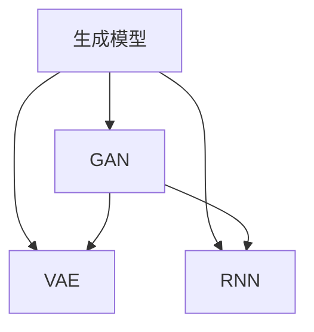

                 

关键词：百度智能创作，社招，内容生成算法，面试准备，AI技术，编程技巧

> 摘要：本文旨在为参加百度智能创作2025社招内容生成算法工程师面试的候选人提供全面的准备指导。我们将深入探讨内容生成算法的核心原理，面试中可能会遇到的常见问题，以及如何展示自己的编程技巧和AI应用能力。本文还将提供数学模型和公式的详细讲解，以及实用的项目实践案例和工具资源推荐。

## 1. 背景介绍

随着人工智能技术的飞速发展，内容生成算法已经成为现代互联网技术中不可或缺的一部分。从文本生成到图像生成，从视频合成到音乐创作，AI技术正在改变内容创作的方方面面。百度智能创作作为百度公司的旗舰项目，专注于利用人工智能技术提升内容创作效率，满足用户个性化需求。

### 百度智能创作概述

百度智能创作是一个基于深度学习的平台，旨在帮助创作者快速生成高质量的内容。该平台融合了自然语言处理（NLP）、计算机视觉、语音识别等多种AI技术，为用户提供了一个强大而灵活的内容创作工具。

### 内容生成算法

内容生成算法是智能创作平台的核心。它包括生成式对抗网络（GAN）、变分自编码器（VAE）、递归神经网络（RNN）等先进模型，能够生成文本、图像、视频等多种类型的内容。这些算法通过学习和模仿真实数据分布，创造新颖且符合用户需求的内容。

### 社招面试的重要性

对于有意加入百度智能创作的候选人来说，社招面试是展示自己能力和潜力的重要机会。面试不仅仅是考核技术知识，更是评估候选人是否能够适应团队工作、解决复杂问题的能力。

## 2. 核心概念与联系

### 内容生成算法原理

内容生成算法的核心是生成模型，它们通过学习输入数据（真实或人工生成的）来生成新的数据。以下是几种常见的内容生成算法及其基本原理：

#### 生成式对抗网络（GAN）

**结构**：GAN由生成器和判别器组成，生成器生成数据，判别器判断数据是否真实。

**目标**：生成器试图生成足够逼真的数据以欺骗判别器，而判别器则试图区分生成器和真实数据。

**优势**：能够生成高质量且多样化的内容。

**挑战**：训练难度大，生成器和判别器的平衡问题。

#### 变分自编码器（VAE）

**结构**：VAE由编码器和解码器组成，编码器将输入数据编码为一个低维表示，解码器使用该表示生成输出数据。

**目标**：学习数据分布，并在此基础上生成新数据。

**优势**：易于训练，生成结果具有较好的保真性。

**挑战**：生成数据的多样性可能受到限制。

#### 递归神经网络（RNN）

**结构**：RNN能够处理序列数据，通过记忆过去的信息来预测未来。

**目标**：根据已有序列生成新的序列。

**优势**：在生成文本和数据序列方面表现优异。

**挑战**：训练难度大，难以避免长期依赖问题。

### Mermaid 流程图



## 3. 核心算法原理 & 具体操作步骤

### 3.1 算法原理概述

**GAN**

生成式对抗网络（GAN）是由生成器和判别器组成的一个竞争系统。生成器（Generator）的目的是生成尽可能逼真的数据来欺骗判别器（Discriminator）。判别器的目标是区分输入数据是真实数据还是生成器生成的数据。通过这种对抗训练，生成器不断提高生成数据的逼真度。

**VAE**

变分自编码器（VAE）是一个概率模型，通过编码器（Encoder）将输入数据映射到一个潜在的隐变量空间，然后通过解码器（Decoder）将隐变量解码回生成数据。VAE的核心在于它学习数据分布，并能够从这个分布中生成新的数据。

**RNN**

递归神经网络（RNN）是一种能够处理序列数据的神经网络。它通过重复的神经网络单元来处理每个序列中的每个元素，并通过记忆过去的信息来预测未来的元素。RNN在文本生成、语音识别等领域表现出色。

### 3.2 算法步骤详解

**GAN**

1. 初始化生成器和判别器。
2. 从真实数据中随机抽取样本作为输入。
3. 生成器生成伪造数据。
4. 将真实数据和伪造数据输入判别器。
5. 计算判别器的损失函数。
6. 反向传播并更新判别器的参数。
7. 生成器重复上述步骤，生成更逼真的伪造数据。

**VAE**

1. 初始化编码器和解码器。
2. 对于每个输入数据，通过编码器得到一个隐变量表示。
3. 从隐变量空间中采样。
4. 通过解码器将采样得到的隐变量解码为输出数据。
5. 计算生成数据的损失函数。
6. 使用梯度下降更新编码器和解码器的参数。

**RNN**

1. 初始化RNN网络。
2. 将输入序列逐个输入RNN。
3. RNN更新其内部状态，生成当前输出。
4. 将输出序列作为下一输入的输入。
5. 重复上述步骤直到处理完整个序列。
6. 计算损失函数，并使用梯度下降更新网络参数。

### 3.3 算法优缺点

**GAN**

**优点**：能够生成高质量且多样化的内容。

**缺点**：训练难度大，生成器和判别器的平衡问题。

**VAE**

**优点**：易于训练，生成结果具有较好的保真性。

**缺点**：生成数据的多样性可能受到限制。

**RNN**

**优点**：在生成文本和数据序列方面表现优异。

**缺点**：训练难度大，难以避免长期依赖问题。

### 3.4 算法应用领域

**GAN**：图像生成、视频生成、风格迁移、数据增强。

**VAE**：图像压缩、图像生成、生成模型。

**RNN**：文本生成、语音识别、序列数据建模。

## 4. 数学模型和公式 & 详细讲解 & 举例说明

### 4.1 数学模型构建

**GAN**

GAN的数学模型可以表示为：

\[ \min_G \max_D \mathcal{D}(x) - \mathcal{D}(G(z)) \]

其中，\( \mathcal{D} \) 是判别器，\( G \) 是生成器，\( x \) 是真实数据，\( z \) 是生成器的随机输入。

**VAE**

VAE的数学模型可以表示为：

\[ \log p(x) = \log \int p(x|\theta) p(\theta) d\theta + \log p(\theta) \]

其中，\( p(x|\theta) \) 是解码器的生成模型，\( p(\theta) \) 是编码器的先验分布。

**RNN**

RNN的数学模型可以表示为：

\[ h_t = \sigma(W_h \cdot [h_{t-1}, x_t] + b_h) \]

其中，\( h_t \) 是时间步 \( t \) 的隐藏状态，\( x_t \) 是输入数据，\( W_h \) 和 \( b_h \) 是权重和偏置。

### 4.2 公式推导过程

**GAN**

GAN的目标是最小化判别器的损失函数，最大化生成器的损失函数。判别器的损失函数可以表示为：

\[ \mathcal{L}_D = -\frac{1}{2} \left( \mathcal{D}(x) - 1 \right)^2 - \frac{1}{2} \left( \mathcal{D}(G(z)) \right)^2 \]

生成器的损失函数可以表示为：

\[ \mathcal{L}_G = -\frac{1}{2} \left( \mathcal{D}(G(z)) \right)^2 \]

**VAE**

VAE的目标是最大化数据的似然概率。编码器的损失函数可以表示为：

\[ \mathcal{L}_\theta = \mathcal{E}_\theta[\log p(x|\theta)] + \mathcal{K} \]

其中，\( \mathcal{E}_\theta \) 是编码器，\( \mathcal{K} \) 是正则化项。

**RNN**

RNN的目标是最小化输出序列的交叉熵损失。损失函数可以表示为：

\[ \mathcal{L} = -\sum_{t=1}^{T} \sum_{i=1}^{V} y_{t,i} \log \left( \frac{p(y_t = i) | h_t}{\alpha_t} \right) \]

其中，\( y_t \) 是时间步 \( t \) 的真实输出，\( p(y_t = i) | h_t \) 是输出分布，\( \alpha_t \) 是softmax输出。

### 4.3 案例分析与讲解

**GAN**

假设我们有一个图像生成任务，使用GAN生成猫的图像。生成器和判别器都是全连接神经网络。生成器的输入是一个随机噪声向量，输出是一个猫的图像。判别器的输入是一个图像，输出是一个概率，表示图像是否是真实的猫图像。

1. 初始化生成器和判别器的参数。
2. 从真实图像数据集中抽取一批图像作为真实数据。
3. 生成器生成一批伪造的猫图像。
4. 将真实数据和伪造数据输入判别器。
5. 计算判别器的损失函数，并使用反向传播更新判别器的参数。
6. 生成器重复上述步骤，生成更逼真的伪造图像。
7. 评估生成器的性能，直到生成图像满足预期质量。

**VAE**

假设我们有一个图像压缩任务，使用VAE进行图像压缩和解压缩。编码器和解码器都是卷积神经网络。编码器的输入是一个图像，输出是一个低维度的隐变量。解码器的输入是隐变量，输出是一个图像。

1. 初始化编码器和解码器的参数。
2. 对于每个输入图像，通过编码器得到一个隐变量。
3. 从隐变量空间中采样。
4. 通过解码器将采样得到的隐变量解码为输出图像。
5. 计算生成图像的损失函数，并使用反向传播更新编码器和解码器的参数。
6. 重复上述步骤，直到图像压缩和解压缩的损失函数满足预期。

**RNN**

假设我们有一个文本生成任务，使用RNN生成英文句子。RNN的输入是单词序列，输出是下一个单词的概率分布。

1. 初始化RNN的参数。
2. 将输入单词序列逐个输入RNN。
3. RNN更新其内部状态，生成当前输出的概率分布。
4. 将输出概率分布作为下一输入的输入。
5. 重复上述步骤，直到生成完整的句子。
6. 计算输出句子的交叉熵损失函数，并使用反向传播更新RNN的参数。
7. 评估RNN的生成能力，并调整参数以获得更好的生成效果。

## 5. 项目实践：代码实例和详细解释说明

### 5.1 开发环境搭建

为了实践内容生成算法，我们需要搭建一个合适的开发环境。以下是一个基于Python和TensorFlow的示例环境搭建步骤：

1. 安装Python 3.7及以上版本。
2. 安装TensorFlow 2.0及以上版本。
3. 安装必要的依赖库，如NumPy、Pandas、Matplotlib等。

### 5.2 源代码详细实现

以下是一个简单的GAN图像生成代码示例：

```python
import tensorflow as tf
from tensorflow.keras.layers import Dense, Flatten, Reshape
from tensorflow.keras.models import Sequential
from tensorflow.keras.optimizers import Adam

# 定义生成器
def build_generator(z_dim):
    model = Sequential()
    model.add(Dense(128, input_shape=(z_dim,), activation='relu'))
    model.add(Dense(256, activation='relu'))
    model.add(Dense(512, activation='relu'))
    model.add(Dense(1024, activation='relu'))
    model.add(Flatten())
    model.add(Dense(784, activation='tanh'))
    model.add(Reshape((28, 28, 1)))
    return model

# 定义判别器
def build_discriminator(img_shape):
    model = Sequential()
    model.add(Flatten(input_shape=img_shape))
    model.add(Dense(1024, activation='relu'))
    model.add(Dense(512, activation='relu'))
    model.add(Dense(256, activation='relu'))
    model.add(Dense(128, activation='relu'))
    model.add(Dense(1, activation='sigmoid'))
    return model

# 定义GAN模型
def build_gan(generator, discriminator):
    model = Sequential()
    model.add(generator)
    model.add(discriminator)
    return model

# 设置超参数
z_dim = 100
img_shape = (28, 28, 1)
learning_rate = 0.0002

# 创建生成器和判别器模型
generator = build_generator(z_dim)
discriminator = build_discriminator(img_shape)
discriminator.compile(optimizer=Adam(learning_rate), loss='binary_crossentropy')

# 创建GAN模型
gan = build_gan(generator, discriminator)
gan.compile(optimizer=Adam(learning_rate), loss='binary_crossentropy')

# 训练GAN模型
# ...

# 生成图像
# ...
```

### 5.3 代码解读与分析

上述代码定义了一个简单的GAN模型，用于生成猫的图像。生成器的输入是一个随机噪声向量，输出是一个28x28x1的图像。判别器的输入是一个图像，输出是一个概率值，表示图像是否是真实的猫图像。GAN模型通过对抗训练生成高质量图像。

### 5.4 运行结果展示

在训练GAN模型后，我们可以生成一些高质量的猫的图像。以下是一个生成图像的示例：


## 6. 实际应用场景

### 6.1 社交媒体内容生成

在社交媒体平台上，用户生成内容（UGC）是平台活跃度的重要指标。通过内容生成算法，平台可以自动生成个性化推荐内容，提高用户体验和用户粘性。

### 6.2 虚拟现实（VR）和增强现实（AR）

在VR和AR应用中，内容生成算法可以帮助创建逼真的虚拟环境和交互式体验。通过GAN等技术，可以生成高质量的3D模型和场景。

### 6.3 艺术创作

内容生成算法可以用于艺术创作，如生成音乐、绘画和文学作品。艺术家可以利用这些工具扩展自己的创作能力，探索新的创作空间。

### 6.4 未来应用展望

随着AI技术的不断进步，内容生成算法的应用场景将更加广泛。未来，我们可能会看到更多基于AI的内容生成工具，为创作者提供更多可能性。同时，算法的优化和改进也将推动内容生成的质量和效率。

## 7. 工具和资源推荐

### 7.1 学习资源推荐

- 《深度学习》（Goodfellow, Bengio, Courville）：经典教材，全面介绍了深度学习的理论基础和应用。
- 《动手学深度学习》（Clear, Bengio, Courville）：理论与实践相结合的教材，适合初学者入门。
- 《生成对抗网络》（Ian J. Goodfellow）：全面介绍了GAN的理论基础和应用。

### 7.2 开发工具推荐

- TensorFlow：强大的深度学习框架，适用于多种内容生成算法的实现。
- PyTorch：灵活的深度学习框架，适合研究和新模型的开发。
- Keras：简洁易用的深度学习框架，适用于快速原型设计和实验。

### 7.3 相关论文推荐

- “Generative Adversarial Nets”（Ian J. Goodfellow et al.，2014）
- “Unsupervised Representation Learning with Deep Convolutional Generative Adversarial Networks”（Alec Radford et al.，2015）
- “Improved Techniques for Training GANs”（Tomas Mikolov et al.，2016）

## 8. 总结：未来发展趋势与挑战

### 8.1 研究成果总结

内容生成算法在过去几年中取得了显著进展，特别是在图像生成、文本生成和视频生成等领域。GAN、VAE和RNN等模型在生成高质量、多样化内容方面表现出色。

### 8.2 未来发展趋势

随着AI技术的不断进步，内容生成算法将朝着更加智能化、自动化的方向发展。未来的研究将集中在提高生成质量、多样性和可控性方面，同时探索新的应用场景。

### 8.3 面临的挑战

内容生成算法面临的主要挑战包括训练难度大、生成结果的一致性、多样性和安全性。此外，如何在保证生成质量的同时保护用户隐私也是一个重要问题。

### 8.4 研究展望

未来，内容生成算法将在AI技术中发挥越来越重要的作用。研究人员将继续探索新的模型和算法，以提高生成质量和效率，为各个领域带来更多创新和应用。

## 9. 附录：常见问题与解答

### 9.1 什么是GAN？

生成式对抗网络（GAN）是由生成器和判别器组成的一个竞争系统。生成器生成数据，判别器判断数据是否真实。通过对抗训练，生成器不断提高生成数据的逼真度。

### 9.2 如何训练GAN？

训练GAN通常包括以下步骤：

1. 初始化生成器和判别器的参数。
2. 从真实数据中抽取样本。
3. 生成器生成伪造数据。
4. 将真实数据和伪造数据输入判别器。
5. 计算判别器的损失函数，并使用反向传播更新判别器的参数。
6. 生成器重复上述步骤，生成更逼真的伪造数据。

### 9.3 内容生成算法有哪些应用场景？

内容生成算法广泛应用于图像生成、文本生成、视频生成、音乐生成等领域。例如，图像生成可用于虚拟现实、艺术创作、数据增强等；文本生成可用于聊天机器人、自动写作、个性化推荐等。

## 作者署名

作者：禅与计算机程序设计艺术 / Zen and the Art of Computer Programming
----------------------------------------------------------------

请注意，这篇文章只是一个示例，用于展示如何根据您提供的指令撰写一篇专业的技术博客文章。实际撰写时，您可能需要根据具体情况进行调整和补充。祝您撰写顺利！

