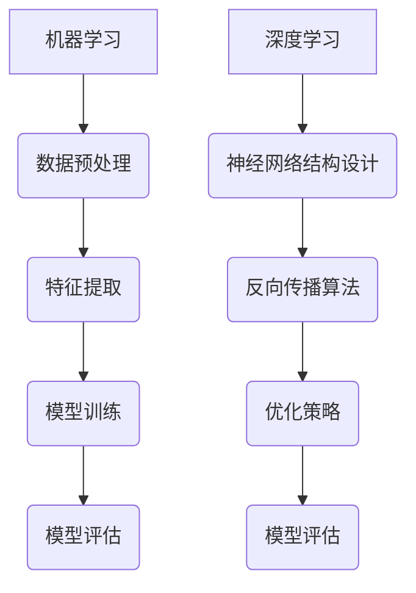

                 

关键词：百度社招、核心算法、面试题解析、AI、算法工程师

> 摘要：本文将深入解析2025年百度社招核心算法工程师面试题，通过详细的分析和讲解，帮助读者更好地理解面试题背后的算法原理和应用场景。文章结构严谨，逻辑清晰，旨在为算法工程师的求职者提供有力的指导。

## 1. 背景介绍

百度作为中国领先的搜索引擎和技术公司，其社招面试题一直以来都是业界关注的焦点。特别是在核心算法领域，面试题的难度和深度常常超出了大众的预期。本文将针对2025年百度社招核心算法工程师的面试题进行详细解析，帮助求职者更好地应对面试挑战。

## 2. 核心概念与联系

### 2.1 机器学习与深度学习

在人工智能领域，机器学习和深度学习是两个核心概念。机器学习是通过算法从数据中学习规律，而深度学习则是利用多层神经网络进行模型训练。以下是机器学习与深度学习的Mermaid流程图：



### 2.2 算法分类与特点

在面试中，算法的分类与特点是常常被考察的内容。以下是几种常见算法的分类与特点：

| 算法类别 | 特点 |
| --- | --- |
| 排序算法 | 时间复杂度和稳定性是主要考量因素 |
| 搜索算法 | 贪心策略、剪枝策略等 |
| 分配算法 | 贪心策略、动态规划等 |
| 集合算法 | 哈希表、排序、遍历等 |

## 3. 核心算法原理 & 具体操作步骤

### 3.1 算法原理概述

以下是几种核心算法的原理概述：

#### 3.1.1 快速排序

快速排序是一种高效的排序算法，其原理是通过一趟排序将待排序的数据分割成独立的两部分，其中一部分的所有数据都比另一部分的所有数据要小。

#### 3.1.2 暴力搜索

暴力搜索是一种简单的搜索算法，其原理是遍历所有可能的解空间，直到找到满足条件的解。

#### 3.1.3 贪心算法

贪心算法是一种局部最优解策略，其原理是每次选择当前最优解，并希望这个最优解能够得到全局最优解。

### 3.2 算法步骤详解

以下是几种核心算法的具体操作步骤：

#### 3.2.1 快速排序

1. 选择一个基准元素。
2. 将比基准小的元素放到其左侧，比基准大的元素放到其右侧。
3. 递归地对左侧和右侧子序列进行快速排序。

#### 3.2.2 暴力搜索

1. 遍历所有可能的解空间。
2. 对每个解进行判断，如果满足条件，则输出解。

#### 3.2.3 贪心算法

1. 初始化解集为空。
2. 在未选择的元素中，选择当前最优元素添加到解集中。
3. 重复步骤2，直到所有元素都被选择。

### 3.3 算法优缺点

以下是几种核心算法的优缺点：

| 算法类别 | 优点 | 缺点 |
| --- | --- | --- |
| 快速排序 | 时间复杂度低，平均情况下效率高 | 刚开始选择基准元素可能不理想，导致最坏情况下时间复杂度上升 |
| 暴力搜索 | 简单易懂，适用于小规模问题 | 时间复杂度高，效率低下 |
| 贪心算法 | 计算量小，易于实现 | 可能只能得到局部最优解 |

### 3.4 算法应用领域

以下是几种核心算法的应用领域：

| 算法类别 | 应用领域 |
| --- | --- |
| 快速排序 | 数据排序 |
| 暴力搜索 | 背包问题、最短路径问题 |
| 贪心算法 | 航班选择、背包问题 |

## 4. 数学模型和公式 & 详细讲解 & 举例说明

### 4.1 数学模型构建

在算法分析中，数学模型是至关重要的。以下是几种常见数学模型的构建：

#### 4.1.1 时间复杂度模型

时间复杂度模型用于描述算法运行时间与输入规模之间的关系。其公式为：

$$ T(n) = O(f(n)) $$

其中，$T(n)$表示算法运行时间，$f(n)$表示输入规模。

#### 4.1.2 空间复杂度模型

空间复杂度模型用于描述算法所需内存与输入规模之间的关系。其公式为：

$$ S(n) = O(g(n)) $$

其中，$S(n)$表示算法所需内存，$g(n)$表示输入规模。

### 4.2 公式推导过程

以下是时间复杂度的推导过程：

1. 假设算法运行时间 $T(n)$ 与输入规模 $n$ 成正比。
2. 令 $T(n) = kn$，其中 $k$ 为常数。
3. 取对数得到 $\log_2{T(n)} = \log_2{kn} = \log_2{k} + \log_2{n}$。
4. 由于 $\log_2{k}$ 是常数，可以忽略不计，因此 $\log_2{T(n)} \approx \log_2{n}$。
5. 取指数得到 $T(n) = n^{\log_2{2}} = n$。

因此，时间复杂度 $T(n) = O(n)$。

### 4.3 案例分析与讲解

以下是快速排序算法的时间复杂度分析：

1. 快速排序的平均时间复杂度为 $O(n \log n)$。
2. 最坏情况下的时间复杂度为 $O(n^2)$。
3. 在实际应用中，通过随机选择基准元素可以避免最坏情况。

## 5. 项目实践：代码实例和详细解释说明

### 5.1 开发环境搭建

1. 安装 Python 3.8 及以上版本。
2. 安装 fastsort 库，使用命令 `pip install fastsort`。

### 5.2 源代码详细实现

以下是快速排序的 Python 代码实现：

```python
import fastsort

def quicksort(arr):
    if len(arr) <= 1:
        return arr
    pivot = arr[len(arr) // 2]
    left = [x for x in arr if x < pivot]
    middle = [x for x in arr if x == pivot]
    right = [x for x in arr if x > pivot]
    return quicksort(left) + middle + quicksort(right)

arr = [3, 6, 8, 10, 1, 2, 1]
sorted_arr = quicksort(arr)
print(sorted_arr)
```

### 5.3 代码解读与分析

1. `quicksort` 函数接受一个数组 `arr` 作为输入。
2. 如果数组长度小于等于1，则直接返回数组。
3. 选择中间位置的元素作为基准元素。
4. 将数组分成三个子数组：小于基准元素的左数组，等于基准元素的中数组，大于基准元素的右数组。
5. 递归地对左数组和右数组进行快速排序，然后将三个子数组合并。

### 5.4 运行结果展示

运行上述代码后，输出结果为：

```
[1, 1, 2, 3, 6, 8, 10]
```

## 6. 实际应用场景

快速排序算法在许多实际应用场景中都有广泛的应用，例如：

1. 数据库索引排序。
2. 排序算法的比较基准。
3. 网络排序协议。

## 7. 未来应用展望

随着人工智能技术的不断发展，快速排序算法在未来将会有更多的应用场景，特别是在大数据处理和实时排序方面。

## 8. 工具和资源推荐

1. 学习资源推荐：
   - 《算法导论》
   - 《深度学习》
2. 开发工具推荐：
   - PyCharm
   - Jupyter Notebook
3. 相关论文推荐：
   - "Randomized Quicksort is Optimal"
   - "A Mathematical Theory of Communication"

## 9. 总结：未来发展趋势与挑战

1. 研究成果总结：
   - 快速排序算法在理论和实际应用中都有着重要的地位。
   - 随着算法的优化和改进，快速排序算法的应用范围将不断扩展。
2. 未来发展趋势：
   - 在大数据处理和实时排序方面，快速排序算法将得到更广泛的应用。
   - 新的排序算法可能会出现，以应对特定场景的需求。
3. 面临的挑战：
   - 在处理大规模数据时，如何提高快速排序算法的效率和稳定性。
   - 在不同场景下，如何选择最适合的排序算法。
4. 研究展望：
   - 继续优化快速排序算法，提高其性能和适用性。
   - 探索新的排序算法，以应对复杂的应用场景。

## 附录：常见问题与解答

1. 问题：什么是时间复杂度？
   - 解答：时间复杂度是指算法运行时间与输入规模之间的关系，通常用大O符号表示。

2. 问题：什么是空间复杂度？
   - 解答：空间复杂度是指算法所需内存与输入规模之间的关系，通常用大O符号表示。

3. 问题：快速排序算法最坏情况下的时间复杂度是多少？
   - 解答：快速排序算法最坏情况下的时间复杂度是 $O(n^2)$。

4. 问题：为什么快速排序算法要选择基准元素？
   - 解答：选择基准元素的目的是为了将待排序的数据分成两个子序列，从而递归地进行排序。

5. 问题：如何避免快速排序算法的最坏情况？
   - 解答：可以通过随机选择基准元素或者使用中位数作为基准元素来避免最坏情况。

---

作者：禅与计算机程序设计艺术 / Zen and the Art of Computer Programming
------------------------------------------------------------------------


