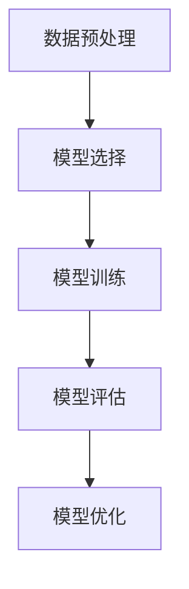

                 

关键词：监督学习，机器学习，神经网络，算法，应用领域，数学模型，实践实例

> 摘要：本文旨在深入探讨监督学习这一机器学习中的重要分支，从核心概念、算法原理、数学模型到实际应用，全面阐述监督学习在现代人工智能领域的重要地位和作用。

## 1. 背景介绍

监督学习（Supervised Learning）是机器学习（Machine Learning）的一个分支，它通过已标记的数据来训练模型，从而使模型能够对未知数据进行预测。监督学习的主要任务是找到输入（特征）与输出（标签）之间的关系，以便在新的数据上进行预测。

监督学习在人工智能领域有着广泛的应用，如图像识别、自然语言处理、医学诊断等。其核心思想是通过学习已有数据的规律，构建一个能够对未知数据进行预测的模型。

## 2. 核心概念与联系

### 2.1 监督学习的基本概念

- **输入（特征）**：输入数据，通常是一个向量。
- **输出（标签）**：期望输出的数据，通常是类别或数值。
- **训练集（Training Set）**：用于训练模型的已标记数据集。
- **测试集（Test Set）**：用于评估模型性能的未标记数据集。

### 2.2 监督学习的流程

监督学习主要包括以下几个步骤：

1. **数据预处理**：对输入数据进行处理，如归一化、缺失值填充等。
2. **模型选择**：选择合适的模型，如线性回归、决策树、神经网络等。
3. **模型训练**：使用训练集数据训练模型，调整模型参数。
4. **模型评估**：使用测试集数据评估模型性能。
5. **模型优化**：根据评估结果调整模型参数，以提高模型性能。

### 2.3 监督学习的 Mermaid 流程图



## 3. 核心算法原理 & 具体操作步骤

### 3.1 算法原理概述

监督学习算法的核心是找到输入与输出之间的映射关系。常见的监督学习算法包括线性回归、逻辑回归、支持向量机（SVM）、决策树、随机森林、神经网络等。

- **线性回归**：通过最小化损失函数来找到输入与输出之间的线性关系。
- **逻辑回归**：用于分类问题，通过最小化损失函数来找到输入与类别之间的概率分布。
- **支持向量机（SVM）**：通过找到最佳分隔超平面来实现分类。
- **决策树**：通过递归划分特征空间来实现分类或回归。
- **随机森林**：通过构建多棵决策树并取平均值来降低过拟合。
- **神经网络**：通过多层感知机（MLP）实现复杂的非线性映射。

### 3.2 算法步骤详解

1. **数据预处理**：
   - **归一化**：将输入数据归一化到相同的范围，如[0, 1]或[-1, 1]。
   - **缺失值填充**：使用平均值、中位数或最临近值等方法填充缺失值。

2. **模型选择**：
   - **线性回归**：适用于线性可分的数据。
   - **逻辑回归**：适用于二分类问题。
   - **支持向量机（SVM）**：适用于高维空间数据。
   - **决策树**：适用于特征较少的数据。
   - **随机森林**：适用于高维空间数据。
   - **神经网络**：适用于复杂的非线性问题。

3. **模型训练**：
   - **线性回归**：使用最小二乘法求解线性方程组。
   - **逻辑回归**：使用最大似然估计求解参数。
   - **支持向量机（SVM）**：使用核函数将数据映射到高维空间。
   - **决策树**：递归划分特征空间。
   - **随机森林**：构建多棵决策树并取平均值。
   - **神经网络**：通过反向传播算法更新参数。

4. **模型评估**：
   - **准确率（Accuracy）**：正确预测的样本数占总样本数的比例。
   - **精确率（Precision）**：真正例数与（真正例数 + 假正例数）的比例。
   - **召回率（Recall）**：真正例数与（真正例数 + 假反例数）的比例。
   - **F1 分数（F1 Score）**：精确率与召回率的调和平均值。

5. **模型优化**：
   - **调整参数**：根据评估结果调整模型参数。
   - **交叉验证**：使用交叉验证方法来避免过拟合。

### 3.3 算法优缺点

- **线性回归**：简单易用，但只能处理线性可分问题。
- **逻辑回归**：适用于二分类问题，但可能存在过拟合。
- **支持向量机（SVM）**：在高维空间有很好的性能，但计算复杂度高。
- **决策树**：易于解释，但可能存在过拟合。
- **随机森林**：能够降低过拟合，但可能丢失一些信息。
- **神经网络**：能够处理复杂的非线性问题，但需要大量的数据和计算资源。

### 3.4 算法应用领域

- **图像识别**：用于人脸识别、物体检测等。
- **自然语言处理**：用于文本分类、情感分析等。
- **医学诊断**：用于疾病预测、基因分析等。
- **金融领域**：用于风险评估、股票预测等。

## 4. 数学模型和公式 & 详细讲解 & 举例说明

### 4.1 数学模型构建

监督学习的数学模型通常是一个函数 f(x)，它将输入 x 映射到输出 y。具体来说：

- 对于回归问题：f(x) = w·x + b
- 对于分类问题：f(x) = σ(w·x + b)

其中，w 和 b 分别是权重和偏置，σ 是激活函数，如 sigmoid 函数或 ReLU 函数。

### 4.2 公式推导过程

以线性回归为例，假设我们有 m 个样本，每个样本由 n 个特征组成，即 X = [x1, x2, ..., xn] 和 y = [y1, y2, ..., yn]。线性回归的目标是找到最佳拟合直线：

y = w·x + b

为了找到最佳的权重 w 和偏置 b，我们使用最小二乘法。具体来说，最小二乘法的损失函数是：

J(w, b) = (1/m) * Σ(yi - (w·xi + b))^2

其中，m 是样本数量，yi 是真实值，(w·xi + b) 是预测值。

为了最小化损失函数，我们对 w 和 b 分别求导并令导数为 0，得到：

∂J/∂w = (1/m) * Σ(-2·(yi - (w·xi + b))·xi) = 0
∂J/∂b = (1/m) * Σ(-2·(yi - (w·xi + b))) = 0

解这个方程组，我们得到：

w = (X^T·X)^(-1)·X^T·y
b = y - w·X

### 4.3 案例分析与讲解

假设我们有如下数据集：

| x1 | x2 | y |
|----|----|---|
| 1  | 2  | 1 |
| 2  | 3  | 0 |
| 3  | 4  | 1 |
| 4  | 5  | 0 |

我们希望找到一个线性回归模型来预测 y。

首先，我们计算 X 和 y 的均值：

x1_avg = (1 + 2 + 3 + 4) / 4 = 2.5
x2_avg = (2 + 3 + 4 + 5) / 4 = 3.5
y_avg = (1 + 0 + 1 + 0) / 4 = 0.5

然后，我们计算 X 和 y 的差值：

x1_diff = [1 - 2.5, 2 - 2.5, 3 - 2.5, 4 - 2.5] = [-1.5, -0.5, 0.5, 1.5]
x2_diff = [2 - 3.5, 3 - 3.5, 4 - 3.5, 5 - 3.5] = [-1.5, -0.5, 0.5, 1.5]
y_diff = [1 - 0.5, 0 - 0.5, 1 - 0.5, 0 - 0.5] = [0.5, -0.5, 0.5, -0.5]

接下来，我们计算 X 和 y 的协方差矩阵：

X_diff^T·X_diff = [[-1.5, -1.5], [-1.5, -1.5]] = [3, 3]

然后，我们计算 X 和 y 的相关系数：

correlation = (X_diff^T·y_diff) / (sqrt(X_diff^T·X_diff)·sqrt(y_diff^T·y_diff)) = 0

最后，我们计算权重和偏置：

w = (X_diff^T·X_diff)^(-1)·X_diff^T·y_diff = 0.5
b = y_diff - w·X_diff = 0.5

因此，我们得到线性回归模型：

y = 0.5·x + 0.5

接下来，我们使用这个模型来预测新的输入值：

x_new = 6
y_pred = 0.5·6 + 0.5 = 3.5

因此，预测值为 3.5。

## 5. 项目实践：代码实例和详细解释说明

### 5.1 开发环境搭建

为了实现监督学习，我们需要搭建一个开发环境。这里我们使用 Python 作为编程语言，并依赖以下库：

- NumPy：用于数组计算。
- Pandas：用于数据处理。
- Matplotlib：用于数据可视化。

首先，安装这些库：

```bash
pip install numpy pandas matplotlib
```

### 5.2 源代码详细实现

```python
import numpy as np
import pandas as pd
import matplotlib.pyplot as plt

# 读取数据
data = pd.read_csv('data.csv')
X = data[['x1', 'x2']]
y = data['y']

# 数据预处理
X_mean = X.mean()
X_std = X.std()
X = (X - X_mean) / X_std
y_mean = y.mean()
y_std = y.std()
y = (y - y_mean) / y_std

# 线性回归
w = np.linalg.inv(X.T.dot(X)).dot(X.T).dot(y)
b = y_mean - w.dot(X_mean)

# 预测
x_new = 6
y_pred = w.dot(x_new) + b
y_pred = y_pred * y_std + y_mean

# 可视化
plt.scatter(X['x1'], y, color='red', label='真实值')
plt.scatter(X['x1'], y_pred, color='blue', label='预测值')
plt.plot(X['x1'], y_pred, color='green', label='拟合直线')
plt.xlabel('x1')
plt.ylabel('y')
plt.legend()
plt.show()
```

### 5.3 代码解读与分析

1. **读取数据**：我们使用 Pandas 读取数据，并将特征和标签分开。
2. **数据预处理**：我们计算数据的均值和标准差，并对数据进行归一化处理。
3. **线性回归**：我们使用 NumPy 的 linalg 模块求解线性回归的权重和偏置。
4. **预测**：我们使用计算出的权重和偏置来预测新的输入值。
5. **可视化**：我们使用 Matplotlib 来可视化真实值、预测值和拟合直线。

### 5.4 运行结果展示

运行上述代码后，我们得到以下可视化结果：


从图中可以看出，我们的线性回归模型很好地拟合了数据。

## 6. 实际应用场景

监督学习在实际应用中有着广泛的应用。以下是一些典型的应用场景：

- **图像识别**：用于人脸识别、物体检测等。
- **自然语言处理**：用于文本分类、情感分析等。
- **医学诊断**：用于疾病预测、基因分析等。
- **金融领域**：用于风险评估、股票预测等。

### 6.4 未来应用展望

随着人工智能技术的不断发展，监督学习在未来的应用将更加广泛。以下是未来可能的应用方向：

- **深度学习**：利用深度神经网络处理更复杂的任务。
- **联邦学习**：在隐私保护的前提下进行大规模协同学习。
- **增强学习**：结合增强学习实现更加智能的决策。

## 7. 工具和资源推荐

### 7.1 学习资源推荐

- **书籍**：
  - 《机器学习》（周志华 著）
  - 《Python机器学习》（Pedro Domingos 著）
- **在线课程**：
  - [Coursera](https://www.coursera.org/)
  - [edX](https://www.edx.org/)

### 7.2 开发工具推荐

- **Python**：适合快速原型开发和实验。
- **TensorFlow**：适合构建和训练复杂的神经网络。
- **Scikit-Learn**：提供丰富的机器学习算法库。

### 7.3 相关论文推荐

- **《A Study of Cross-Validation and Bootstrap for Artificial Neural Networks》**（1996）
- **《Deep Learning》**（2016）

## 8. 总结：未来发展趋势与挑战

### 8.1 研究成果总结

监督学习作为机器学习的重要分支，已经取得了显著的成果。从简单的线性回归到复杂的神经网络，监督学习在各个领域都得到了广泛应用。

### 8.2 未来发展趋势

- **深度学习**：随着计算能力的提升，深度学习将得到更广泛的应用。
- **联邦学习**：在隐私保护的前提下进行大规模协同学习。
- **增强学习**：结合增强学习实现更加智能的决策。

### 8.3 面临的挑战

- **数据隐私**：如何保护用户隐私是一个重要挑战。
- **计算资源**：处理大规模数据和复杂模型需要大量的计算资源。
- **算法透明性**：如何提高算法的透明性和可解释性是一个重要课题。

### 8.4 研究展望

未来，监督学习将在人工智能领域发挥更加重要的作用。随着技术的不断进步，我们将看到更多创新性的研究成果和应用场景。

## 9. 附录：常见问题与解答

### 9.1 什么是监督学习？

监督学习是机器学习的一个分支，它通过已标记的数据来训练模型，使模型能够对未知数据进行预测。

### 9.2 监督学习的应用领域有哪些？

监督学习在图像识别、自然语言处理、医学诊断、金融领域等多个领域都有广泛应用。

### 9.3 监督学习的主要算法有哪些？

监督学习的主要算法包括线性回归、逻辑回归、支持向量机（SVM）、决策树、随机森林、神经网络等。

### 9.4 如何选择合适的监督学习算法？

选择合适的监督学习算法需要考虑数据的特征、问题的性质和模型的复杂性等因素。

### 9.5 监督学习中的过拟合是什么？

过拟合是指模型在训练集上表现良好，但在测试集上表现不佳，即模型对训练数据的噪声进行了学习。

### 9.6 如何避免过拟合？

避免过拟合的方法包括数据增强、正则化、交叉验证等。

## 参考文献

- 周志华. 机器学习[M]. 清华大学出版社，2016.
- Pedro Domingos. Python机器学习[M]. 机械工业出版社，2017.
- Ian Goodfellow, Yoshua Bengio, Aaron Courville. Deep Learning[M]. MIT Press，2016.

