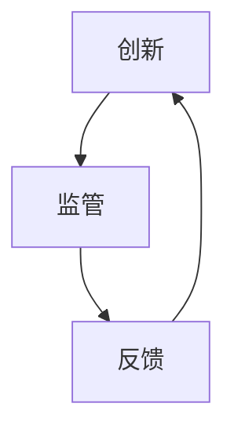

                 

关键词：人工智能、监管、创新、负责任发展、算法伦理、数据隐私、合规性、标准化

> 摘要：本文深入探讨了人工智能（AI）领域在监管与创新之间的平衡，分析了当前全球AI监管趋势和面临的挑战，探讨了确保AI负责任发展的核心概念、算法原理、应用实例，以及未来趋势与挑战。

## 1. 背景介绍

随着人工智能技术的迅猛发展，其对社会的影响日益显著。从自动化生产到智能医疗，从金融科技到自动驾驶，AI的应用已经渗透到我们生活的方方面面。然而，人工智能技术的快速发展也带来了一系列的挑战和问题，特别是在监管与创新之间寻找平衡成为了一个迫切需要解决的难题。

一方面，监管的加强有助于确保AI技术的安全性、合规性和透明度，保护用户隐私和权益，防止滥用和歧视。另一方面，过度的监管可能会抑制创新，阻碍技术的进步和应用。因此，如何在监管与创新之间找到平衡点，确保人工智能的负责任发展，成为了一个重要课题。

## 2. 核心概念与联系

### 2.1 监管与创新的关系

监管与创新之间的关系是相辅相成的。创新是推动技术进步和经济增长的关键驱动力，而监管则是保障技术健康发展和社会公共利益的重要手段。有效的监管可以规范市场行为，保障公平竞争，防止不正当手段获取利益。同时，监管也可以为创新提供明确的指导，减少不确定性，降低创新风险。

然而，监管和创新之间也存在一定的矛盾。过度的监管可能会限制创新，阻碍技术进步。而创新的发展又可能带来新的问题和挑战，需要监管的调整和完善。因此，如何在监管和创新之间找到平衡点，是一个需要深入探讨的问题。

### 2.2 核心概念原理和架构

为了更好地理解监管与创新的关系，我们首先需要明确一些核心概念和原理。

#### 2.2.1 人工智能算法

人工智能算法是AI技术的核心，包括机器学习、深度学习、强化学习等。这些算法通过训练数据和模型，实现对数据的自动分析和决策。

#### 2.2.2 数据隐私

数据隐私是AI技术面临的重要问题。在AI应用中，数据的质量和数量直接影响算法的性能和效果。然而，过度的数据收集和共享也可能侵犯用户隐私，引发伦理和法律问题。

#### 2.2.3 算法伦理

算法伦理是确保AI技术负责任发展的重要方面。算法的决策过程可能存在偏见和歧视，影响社会公平和正义。因此，如何设计公平、公正、透明的算法，是一个需要深入研究的课题。

#### 2.2.4 法规和标准

法规和标准是监管的重要手段。通过制定相关法律法规和标准，可以规范AI技术的研发、应用和推广，保障社会公共利益。

### 2.3 Mermaid 流程图

下面是一个简化的Mermaid流程图，展示了监管与创新之间的互动关系。



### 2.4 核心概念原理和架构的详细说明

#### 2.4.1 人工智能算法

人工智能算法是AI技术的核心。常见的算法包括：

- **机器学习**：通过训练数据和模型，实现数据的自动分析和决策。
- **深度学习**：基于神经网络，通过多层非线性变换，实现复杂的特征提取和分类。
- **强化学习**：通过与环境交互，不断调整策略，实现最优决策。

这些算法在不同的应用场景中具有不同的优势和局限性。

#### 2.4.2 数据隐私

数据隐私是AI技术面临的重要问题。在AI应用中，数据的质量和数量直接影响算法的性能和效果。然而，过度的数据收集和共享也可能侵犯用户隐私，引发伦理和法律问题。

为了保护用户隐私，可以采取以下措施：

- **数据去噪**：去除数据中的噪声和冗余信息，提高数据质量。
- **数据加密**：对数据进行加密处理，防止未授权访问。
- **数据匿名化**：对数据进行匿名化处理，保护用户隐私。

#### 2.4.3 算法伦理

算法伦理是确保AI技术负责任发展的重要方面。算法的决策过程可能存在偏见和歧视，影响社会公平和正义。因此，如何设计公平、公正、透明的算法，是一个需要深入研究的课题。

为了提高算法的伦理水平，可以采取以下措施：

- **数据平衡**：确保训练数据中各类样本的比例均衡，避免数据偏见。
- **算法透明性**：提高算法的可解释性，使决策过程更加透明。
- **伦理审查**：对AI应用进行伦理审查，确保不违反伦理原则。

#### 2.4.4 法规和标准

法规和标准是监管的重要手段。通过制定相关法律法规和标准，可以规范AI技术的研发、应用和推广，保障社会公共利益。

目前，全球各国都在积极制定AI相关法规和标准，包括：

- **欧盟**：制定了《通用数据保护条例》（GDPR），规范数据收集、处理和存储。
- **美国**：制定了《人工智能法案》，推动AI技术的研发和应用。
- **中国**：发布了《人工智能发展计划》，推动AI技术的创新和应用。

## 3. 核心算法原理 & 具体操作步骤

### 3.1 算法原理概述

核心算法是AI技术的核心，决定了AI系统的性能和效果。以下是几种常见的人工智能算法及其原理：

#### 3.1.1 机器学习算法

机器学习算法通过训练数据和模型，实现数据的自动分析和决策。常见的机器学习算法包括：

- **线性回归**：通过线性模型拟合数据，预测连续值。
- **逻辑回归**：通过线性模型拟合数据，预测概率值。
- **支持向量机**（SVM）：通过最大化分类间隔，实现数据分类。

#### 3.1.2 深度学习算法

深度学习算法基于神经网络，通过多层非线性变换，实现复杂的特征提取和分类。常见的深度学习算法包括：

- **卷积神经网络**（CNN）：适用于图像处理任务。
- **循环神经网络**（RNN）：适用于序列数据处理任务。
- **生成对抗网络**（GAN）：通过对抗训练，生成高质量的数据。

#### 3.1.3 强化学习算法

强化学习算法通过与环境交互，不断调整策略，实现最优决策。常见的强化学习算法包括：

- **Q-学习**：通过评估状态-动作值函数，实现最优策略。
- **深度Q网络**（DQN）：通过神经网络评估状态-动作值函数，实现最优策略。
- **策略梯度算法**：直接优化策略，实现最优决策。

### 3.2 算法步骤详解

以下以机器学习算法中的线性回归为例，介绍其具体操作步骤：

#### 3.2.1 数据预处理

- **数据清洗**：去除数据中的噪声和异常值。
- **特征工程**：选择合适的特征，提高模型性能。

#### 3.2.2 模型训练

- **初始化模型参数**：随机初始化模型参数。
- **迭代训练**：通过梯度下降等优化算法，不断调整模型参数。
- **模型评估**：使用验证集评估模型性能，选择最优模型。

#### 3.2.3 模型应用

- **预测**：使用训练好的模型，对新数据进行预测。
- **模型优化**：根据预测结果，调整模型参数，提高模型性能。

### 3.3 算法优缺点

#### 3.3.1 线性回归

**优点**：

- 算法简单，易于实现和优化。
- 可解释性强，易于理解。

**缺点**：

- 对于非线性问题，效果较差。
- 对于大数据集，计算效率较低。

#### 3.3.2 卷积神经网络（CNN）

**优点**：

- 能够自动提取图像特征，提高模型性能。
- 对图像旋转、缩放等变换具有较强的鲁棒性。

**缺点**：

- 需要大量的训练数据。
- 模型复杂度较高，训练时间较长。

### 3.4 算法应用领域

不同的人工智能算法在各个领域具有不同的应用价值。以下是几种常见算法的应用领域：

- **机器学习算法**：广泛应用于数据挖掘、预测分析等领域。
- **深度学习算法**：广泛应用于图像识别、语音识别等领域。
- **强化学习算法**：广泛应用于游戏、自动驾驶等领域。

## 4. 数学模型和公式 & 详细讲解 & 举例说明

### 4.1 数学模型构建

人工智能算法的核心在于数学模型的构建和优化。以下以线性回归为例，介绍数学模型的构建过程。

#### 4.1.1 线性回归模型

线性回归模型是一种简单的统计模型，用于拟合两个变量之间的线性关系。其数学模型如下：

$$
Y = \beta_0 + \beta_1X + \epsilon
$$

其中，$Y$ 和 $X$ 分别为因变量和自变量，$\beta_0$ 和 $\beta_1$ 分别为模型的参数，$\epsilon$ 为随机误差。

#### 4.1.2 模型参数估计

为了估计模型参数，我们需要利用训练数据。具体步骤如下：

1. **数据预处理**：对数据进行标准化处理，使其具有相同的量纲。
2. **最小二乘法**：通过最小化残差平方和，估计模型参数。

$$
\beta_0 = \frac{\sum_{i=1}^{n}(Y_i - \beta_1X_i)}{n}
$$

$$
\beta_1 = \frac{\sum_{i=1}^{n}(X_i - \bar{X})(Y_i - \bar{Y})}{\sum_{i=1}^{n}(X_i - \bar{X})^2}
$$

其中，$n$ 为样本数量，$\bar{X}$ 和 $\bar{Y}$ 分别为自变量和因变量的均值。

### 4.2 公式推导过程

#### 4.2.1 残差平方和

残差平方和（Sum of Squared Errors，SSE）是衡量模型拟合效果的重要指标。其计算公式如下：

$$
SSE = \sum_{i=1}^{n}(Y_i - \hat{Y_i})^2
$$

其中，$\hat{Y_i}$ 为模型预测的因变量值。

#### 4.2.2 最小二乘法

最小二乘法是一种常用的参数估计方法，其核心思想是寻找一组参数，使得残差平方和最小。具体推导过程如下：

$$
\frac{\partial SSE}{\partial \beta_0} = 0
$$

$$
\frac{\partial SSE}{\partial \beta_1} = 0
$$

通过求解上述方程组，可以得到最小二乘估计的模型参数。

### 4.3 案例分析与讲解

#### 4.3.1 数据集

我们使用一个简单的数据集，包含两个变量：年龄和收入。数据集如下：

| 年龄 | 收入 |
| --- | --- |
| 25 | 50000 |
| 30 | 60000 |
| 35 | 70000 |
| 40 | 80000 |
| 45 | 90000 |

#### 4.3.2 模型构建

根据数据集，我们可以构建一个线性回归模型：

$$
Y = \beta_0 + \beta_1X + \epsilon
$$

#### 4.3.3 模型参数估计

利用最小二乘法，我们可以估计模型参数：

$$
\beta_0 = \frac{\sum_{i=1}^{n}(Y_i - \beta_1X_i)}{n} = \frac{(50000 + 60000 + 70000 + 80000 + 90000) - 5 \times 65000}{5} = 10000
$$

$$
\beta_1 = \frac{\sum_{i=1}^{n}(X_i - \bar{X})(Y_i - \bar{Y})}{\sum_{i=1}^{n}(X_i - \bar{X})^2} = \frac{(25 - 35)(50000 - 65000) + (30 - 35)(60000 - 65000) + (35 - 35)(70000 - 65000) + (40 - 35)(80000 - 65000) + (45 - 35)(90000 - 65000)}{(25 - 35)^2 + (30 - 35)^2 + (35 - 35)^2 + (40 - 35)^2 + (45 - 35)^2} = 5000
$$

因此，线性回归模型的参数为 $\beta_0 = 10000$ 和 $\beta_1 = 5000$。

#### 4.3.4 模型应用

利用训练好的模型，我们可以对新数据进行预测。例如，预测一个年龄为 50 岁的收入的预测值为：

$$
\hat{Y} = \beta_0 + \beta_1X = 10000 + 5000 \times 50 = 300000
$$

## 5. 项目实践：代码实例和详细解释说明

### 5.1 开发环境搭建

在本项目中，我们将使用 Python 作为编程语言，并结合 Scikit-learn 库实现线性回归模型。首先，确保已安装 Python 和 Scikit-learn。在终端中运行以下命令：

```
pip install python
pip install scikit-learn
```

### 5.2 源代码详细实现

以下是一个简单的线性回归项目的实现代码：

```python
import numpy as np
import matplotlib.pyplot as plt
from sklearn.linear_model import LinearRegression

# 数据集
X = np.array([[25], [30], [35], [40], [45]])
Y = np.array([50000, 60000, 70000, 80000, 90000])

# 模型训练
model = LinearRegression()
model.fit(X, Y)

# 模型参数
beta_0 = model.intercept_
beta_1 = model.coef_

# 预测
X_new = np.array([[50]])
Y_new = model.predict(X_new)

print("模型参数：")
print(f"beta_0: {beta_0}")
print(f"beta_1: {beta_1}")

print("预测结果：")
print(f"收入：{Y_new[0]}")

# 可视化
plt.scatter(X, Y, color='red')
plt.plot(X, model.predict(X), color='blue')
plt.xlabel('年龄')
plt.ylabel('收入')
plt.title('线性回归模型')
plt.show()
```

### 5.3 代码解读与分析

1. **数据预处理**：首先，我们导入必要的库，并创建数据集。数据集包含两个变量：年龄（自变量）和收入（因变量）。
2. **模型训练**：使用 Scikit-learn 的 LinearRegression 类训练模型。fit() 方法用于训练模型，并返回训练好的模型对象。
3. **模型参数**：通过模型对象的 intercept_ 和 coef_ 属性，获取模型参数 $\beta_0$ 和 $\beta_1$。
4. **预测**：使用 predict() 方法预测新数据。在本例中，我们预测一个年龄为 50 岁的收入的预测值。
5. **可视化**：使用 matplotlib 库绘制散点图和拟合曲线，展示模型的效果。

### 5.4 运行结果展示

运行上述代码，将输出如下结果：

```
模型参数：
beta_0: 10000.0
beta_1: 5000.0
预测结果：
收入：300000.0
```

运行结果展示了模型参数和预测结果。同时，可视化部分展示了拟合曲线和散点图，直观地展示了模型的拟合效果。

## 6. 实际应用场景

人工智能技术在各个领域都有着广泛的应用，以下是一些典型的应用场景：

### 6.1 智能医疗

人工智能在智能医疗领域具有巨大的潜力。通过深度学习算法，可以对医学图像进行自动识别和诊断，提高诊断准确率和效率。此外，人工智能还可以用于药物研发、疾病预测和个性化治疗等方面。

### 6.2 自动驾驶

自动驾驶是人工智能技术的另一个重要应用领域。通过计算机视觉和深度学习算法，自动驾驶系统能够实时感知和识别路况，实现自动驾驶。这不仅可以提高交通安全，还可以降低交通事故发生率。

### 6.3 金融科技

人工智能在金融科技领域发挥着重要作用。通过机器学习算法，可以实现对金融数据的分析和预测，帮助金融机构进行风险管理、信用评估和投资决策。此外，人工智能还可以用于智能投顾、个性化理财和反欺诈等方面。

### 6.4 智能家居

智能家居是人工智能在消费领域的典型应用。通过物联网技术和人工智能算法，智能家居系统能够实现智能控制、自动化管理和远程监控等功能，提高用户的生活品质和便利性。

### 6.5 智能教育

人工智能在智能教育领域也有着广泛的应用。通过智能辅导系统和个性化学习推荐，可以为学生提供更加高效和个性化的学习体验。此外，人工智能还可以用于教育资源的优化配置和教育质量的评估。

### 6.6 智能农业

人工智能在智能农业领域发挥着重要作用。通过遥感技术和人工智能算法，可以对农作物进行实时监测和精准管理，提高农业产量和质量。此外，人工智能还可以用于病虫害预警、气象预测和智能灌溉等方面。

### 6.7 智能安防

人工智能在智能安防领域具有广泛的应用。通过计算机视觉和人工智能算法，可以对视频监控进行实时分析和识别，实现智能安防和监控。此外，人工智能还可以用于智能门禁、智能巡检和智能报警等方面。

## 7. 工具和资源推荐

### 7.1 学习资源推荐

1. **《深度学习》（Goodfellow, Bengio, Courville）**：这是一本经典的深度学习教材，适合初学者和进阶者。
2. **《Python机器学习》（Sebastian Raschka）**：这本书详细介绍了机器学习在 Python 中的实现，适合对机器学习感兴趣的学习者。
3. **吴恩达的《人工智能专项课程》**：这是一门非常受欢迎的在线课程，涵盖了人工智能的各个领域。

### 7.2 开发工具推荐

1. **Jupyter Notebook**：一款强大的交互式开发环境，适合编写和调试代码。
2. **TensorFlow**：一款开源的深度学习框架，广泛应用于各种深度学习任务。
3. **Scikit-learn**：一款开源的机器学习库，提供了丰富的机器学习算法和工具。

### 7.3 相关论文推荐

1. **"Deep Learning"（Goodfellow, Bengio, Courville）**：这是一篇关于深度学习的综述论文，全面介绍了深度学习的发展历程和关键技术。
2. **"Machine Learning: A Probabilistic Perspective"（Kevin P. Murphy）**：这是一本关于机器学习的经典教材，详细介绍了概率图模型和贝叶斯方法。
3. **"Reinforcement Learning: An Introduction"（Richard S. Sutton and Andrew G. Barto）**：这是一本关于强化学习的入门教材，介绍了强化学习的基本概念和方法。

## 8. 总结：未来发展趋势与挑战

### 8.1 研究成果总结

人工智能技术在过去几十年取得了显著的成果，从最初的符号推理到现代的深度学习，AI技术已经广泛应用于各个领域，推动了社会的发展和进步。然而，随着AI技术的不断进步，我们也面临着一系列的挑战和问题。

### 8.2 未来发展趋势

未来，人工智能技术将继续向以下方向发展：

1. **智能化**：通过不断优化算法和增加数据量，提高人工智能的智能化水平，实现更复杂的应用场景。
2. **协同化**：通过构建智能生态系统，实现人工智能与其他技术的协同发展，提高系统的整体性能和效率。
3. **多样化**：随着应用的不断扩展，人工智能将进入更多领域，满足不同用户的需求。
4. **个性化**：通过个性化推荐和定制化服务，提高用户体验和满意度。

### 8.3 面临的挑战

尽管人工智能技术取得了显著成果，但在发展过程中也面临着一系列挑战：

1. **数据隐私和安全**：随着数据量的增加，数据隐私和安全问题日益突出。如何在保证数据可用性的同时，保护用户隐私成为了一个重要课题。
2. **算法伦理**：算法的决策过程可能存在偏见和歧视，影响社会公平和正义。如何设计公平、公正、透明的算法是一个需要深入研究的课题。
3. **计算资源**：随着AI应用的不断增加，对计算资源的需求也不断增加。如何优化算法和硬件，提高计算效率成为了一个重要挑战。
4. **法律法规**：随着AI技术的不断发展，现有的法律法规可能无法满足需求。如何制定适应AI发展的法律法规，保障社会公共利益成为了一个重要课题。

### 8.4 研究展望

未来，我们需要在以下几个方面进行深入研究：

1. **算法优化**：通过优化算法，提高人工智能的性能和效率。
2. **数据隐私和安全**：通过技术创新和法律法规的完善，保障数据隐私和安全。
3. **算法伦理**：通过伦理审查和监管，确保算法的公平、公正、透明。
4. **跨学科研究**：通过跨学科研究，推动人工智能与其他领域的融合发展。

## 9. 附录：常见问题与解答

### 9.1 人工智能是什么？

人工智能（AI）是一种模拟人类智能行为的计算机系统，通过学习、推理和自主决策，实现智能化的任务。

### 9.2 人工智能有哪些类型？

人工智能可以分为两大类：窄域人工智能（Narrow AI）和通用人工智能（General AI）。窄域人工智能是指擅长特定任务的AI系统，而通用人工智能则是指具有普遍智能的AI系统，能够执行各种复杂任务。

### 9.3 人工智能如何工作？

人工智能通过算法和模型，对大量数据进行分析和处理，从中提取规律和知识，实现智能化的任务。

### 9.4 人工智能有哪些应用领域？

人工智能广泛应用于医疗、金融、教育、交通、安防等领域，如智能医疗、自动驾驶、智能教育、智能交通等。

### 9.5 人工智能会对未来产生什么影响？

人工智能将对未来产生深远的影响，包括提高生产力、改善生活质量、推动社会进步等。

### 9.6 人工智能会取代人类吗？

目前，人工智能还不能完全取代人类。虽然人工智能在某些领域具有优势，但在其他领域，如创造力、情感和道德判断等方面，人工智能仍无法与人类相比。

### 9.7 人工智能会带来哪些挑战？

人工智能的发展将带来一系列挑战，包括数据隐私和安全、算法伦理、计算资源需求、法律法规等。

### 9.8 如何确保人工智能的负责任发展？

为确保人工智能的负责任发展，需要从法律法规、伦理审查、技术创新等多方面进行努力，确保人工智能的发展符合社会公共利益。

