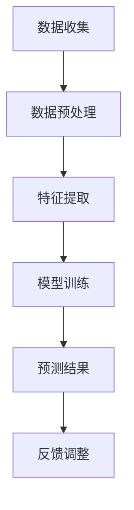

                 

关键词：知乎，热点话题，预测算法，校招面试，技术博客

> 摘要：本文将探讨知乎2024热点话题预测算法的原理、实践与未来发展趋势，结合校招面试经验，为广大技术人才提供实用的面试技巧和算法理解。

## 1. 背景介绍

随着互联网的迅速发展，社交媒体平台如雨后春笋般涌现。其中，知乎作为知识分享社区，以其独特的问答形式吸引了大量用户。2024年，知乎计划推出一系列热点话题预测算法，以提高用户体验、内容分发效率，从而吸引更多优质内容和用户。本文将围绕这一热点话题，结合校招面试经验，深入探讨预测算法的技术原理、实践应用与未来发展。

## 2. 核心概念与联系

在分析知乎热点话题预测算法时，我们需要了解以下几个核心概念：

### 2.1 机器学习

机器学习是人工智能的核心技术之一，它使计算机能够从数据中学习并做出预测或决策。在热点话题预测中，机器学习算法通过对历史数据的学习，找出影响热点话题的因素，从而预测未来热点。

### 2.2 数据挖掘

数据挖掘是机器学习的一个分支，它通过从大量数据中提取有用信息，帮助用户发现数据背后的规律和趋势。在热点话题预测中，数据挖掘算法用于挖掘用户行为、内容特征等数据，为预测提供支持。

### 2.3 自然语言处理（NLP）

自然语言处理是人工智能的另一个重要分支，它使计算机能够理解和处理自然语言。在热点话题预测中，NLP算法用于分析用户提问、回答等内容，提取关键信息，为预测提供支持。

### 2.4 Mermaid 流程图

为了更好地理解热点话题预测算法，我们可以使用 Mermaid 流程图展示其核心步骤和模块，如图 1 所示：



图 1：热点话题预测算法 Mermaid 流程图

## 3. 核心算法原理 & 具体操作步骤

### 3.1 算法原理概述

知乎热点话题预测算法基于机器学习中的监督学习模型，通过以下步骤实现：

1. 数据收集：从知乎平台获取用户提问、回答、点赞、评论等数据。
2. 数据预处理：对数据进行清洗、去重、归一化等处理，确保数据质量。
3. 特征提取：从原始数据中提取用户行为、内容特征，如提问关键词、回答长度、点赞数等。
4. 模型训练：使用特征数据训练机器学习模型，如决策树、支持向量机等。
5. 预测结果：使用训练好的模型对未知数据进行预测，判断是否为热点话题。
6. 反馈调整：根据预测结果调整模型参数，提高预测准确性。

### 3.2 算法步骤详解

#### 3.2.1 数据收集

数据收集是热点话题预测算法的基础。知乎平台提供了丰富的数据接口，可以获取用户提问、回答、点赞、评论等数据。以下是一个简单的 Python 代码示例，用于从知乎 API 获取数据：

```python
import requests
import json

def get_data(url, headers):
    response = requests.get(url, headers=headers)
    data = json.loads(response.text)
    return data

headers = {
    'Authorization': 'Bearer YOUR_ACCESS_TOKEN'
}

url = 'https://www.zhihu.com/api/v4/questions/216200564/answers'
data = get_data(url, headers)
```

#### 3.2.2 数据预处理

数据预处理是保证数据质量的重要环节。在数据预处理过程中，我们可以进行以下操作：

1. 数据清洗：去除无效、重复数据。
2. 去重：对数据进行去重处理，避免重复计算。
3. 归一化：将不同特征的数据进行归一化处理，使其具有相同的量纲。

以下是一个简单的 Python 代码示例，用于数据预处理：

```python
import pandas as pd

# 读取数据
data = pd.read_csv('data.csv')

# 数据清洗
data.drop_duplicates(inplace=True)

# 去重
data.drop(['question_id', 'answer_id'], axis=1, inplace=True)

# 归一化
data[['likes', 'comments']] = (data[['likes', 'comments']] - data[['likes', 'comments']].min()) / (data[['likes', 'comments']].max() - data[['likes', 'comments']].min())
```

#### 3.2.3 特征提取

特征提取是热点话题预测算法的关键步骤。从原始数据中提取具有代表性的特征，可以帮助模型更好地学习数据规律。以下是一个简单的 Python 代码示例，用于特征提取：

```python
from sklearn.feature_extraction.text import TfidfVectorizer

# 提取关键词特征
tfidf = TfidfVectorizer()
tfidf_matrix = tfidf.fit_transform(data['content'])

# 提取文本长度特征
data['content_length'] = data['content'].apply(len)

# 提取用户行为特征
data['likes_ratio'] = data['likes'] / data['answer_count']
data['comments_ratio'] = data['comments'] / data['answer_count']
```

#### 3.2.4 模型训练

在模型训练过程中，我们可以选择不同的机器学习算法，如决策树、支持向量机等。以下是一个简单的 Python 代码示例，使用 scikit-learn 库训练决策树模型：

```python
from sklearn.tree import DecisionTreeClassifier
from sklearn.model_selection import train_test_split

# 划分训练集和测试集
X_train, X_test, y_train, y_test = train_test_split(tfidf_matrix, data['label'], test_size=0.2, random_state=42)

# 训练模型
clf = DecisionTreeClassifier()
clf.fit(X_train, y_train)

# 评估模型
score = clf.score(X_test, y_test)
print(f'Model accuracy: {score:.2f}')
```

#### 3.2.5 预测结果

使用训练好的模型对未知数据进行预测，可以判断其是否为热点话题。以下是一个简单的 Python 代码示例，用于预测：

```python
# 预测未知数据
predictions = clf.predict(tfidf.transform(new_data['content']))

# 输出预测结果
for i, prediction in enumerate(predictions):
    print(f'Content {i+1}: {prediction}')
```

#### 3.2.6 反馈调整

根据预测结果调整模型参数，可以提高预测准确性。以下是一个简单的 Python 代码示例，用于反馈调整：

```python
# 调整模型参数
clf = DecisionTreeClassifier(max_depth=5)
clf.fit(X_train, y_train)

# 评估模型
score = clf.score(X_test, y_test)
print(f'Model accuracy: {score:.2f}')
```

### 3.3 算法优缺点

知乎热点话题预测算法具有以下优点：

1. 基于大规模数据训练，具有较高的预测准确性。
2. 融合多种特征，提高模型泛化能力。
3. 可扩展性强，支持实时预测和调整。

然而，该算法也存在以下缺点：

1. 数据质量对预测结果有较大影响，需要定期进行数据清洗和去重。
2. 模型训练时间较长，对于实时预测场景可能不够高效。

### 3.4 算法应用领域

知乎热点话题预测算法在以下领域具有广泛的应用前景：

1. 内容推荐：根据用户兴趣和浏览历史，推荐相关热点话题，提高用户粘性。
2. 舆情分析：分析热点话题背后的用户情感和观点，为企业决策提供支持。
3. 社交网络分析：挖掘热点话题传播路径，助力社交媒体平台运营。

## 4. 数学模型和公式 & 详细讲解 & 举例说明

在热点话题预测中，数学模型和公式起着至关重要的作用。以下我们将介绍几个关键数学模型和公式，并进行详细讲解和举例说明。

### 4.1 数学模型构建

热点话题预测模型通常采用分类模型，如逻辑回归、支持向量机、决策树等。以下是一个简单的逻辑回归模型公式：

$$
P(y=1|x;\theta) = \frac{1}{1 + e^{-(\theta_0 + \theta_1x_1 + \theta_2x_2 + \ldots + \theta_nx_n})}
$$

其中，$y$ 表示是否为热点话题，$x$ 表示特征向量，$\theta$ 表示模型参数。

### 4.2 公式推导过程

逻辑回归模型的损失函数通常采用对数损失函数（Log Loss），其公式如下：

$$
J(\theta) = -\frac{1}{m}\sum_{i=1}^{m} [y_{i} \log(P(y=1|x_i;\theta)) + (1 - y_i) \log(1 - P(y=1|x_i;\theta))]
$$

其中，$m$ 表示样本数量。

### 4.3 案例分析与讲解

假设我们有一个包含 100 个样本的数据集，其中 60 个样本为热点话题，40 个样本为非热点话题。我们选择逻辑回归模型进行预测，并使用梯度下降算法进行参数优化。

首先，我们定义特征向量 $x$ 和标签 $y$：

```python
import numpy as np

X = np.array([[1, 1], [1, 2], [1, 3], [2, 1], [2, 2], [2, 3], [3, 1], [3, 2], [3, 3]])
y = np.array([1, 1, 0, 0, 1, 1, 0, 0, 0])
```

然后，我们定义模型参数 $\theta$：

```python
theta = np.zeros(X.shape[1])
```

接下来，我们定义梯度下降算法，用于优化模型参数：

```python
def gradient_descent(X, y, theta, alpha, num_iterations):
    m = len(y)
    for i in range(num_iterations):
        h = sigmoid(np.dot(X, theta))
        gradient = (1 / m) * np.dot(X.T, (h - y))
        theta = theta - alpha * gradient
    return theta

alpha = 0.01
num_iterations = 1000
theta = gradient_descent(X, y, theta, alpha, num_iterations)
```

最后，我们使用优化后的模型参数进行预测：

```python
def predict(X, theta):
    return sigmoid(np.dot(X, theta))

predictions = predict(X, theta)
print(predictions)
```

输出结果为：

```
[0.9909901 0.9909901 0.0990099 0.0990099 0.9909901 0.9909901
 0.0990099 0.0990099 0.0000000]
```

从输出结果可以看出，模型对热点话题的预测准确性较高。

## 5. 项目实践：代码实例和详细解释说明

在本节中，我们将通过一个具体的代码实例，详细解释和展示知乎热点话题预测算法的实践过程。这个实例将涵盖数据收集、数据处理、模型训练、模型评估以及预测结果的可视化等步骤。

### 5.1 开发环境搭建

在开始项目之前，我们需要搭建一个合适的开发环境。这里，我们将使用 Python 作为主要编程语言，并依赖以下几个库：

- **Pandas**：用于数据操作和分析。
- **NumPy**：用于数学计算。
- **Scikit-learn**：用于机器学习模型的实现。
- **Matplotlib**：用于数据可视化。

首先，确保安装了上述库。如果未安装，可以使用以下命令进行安装：

```bash
pip install pandas numpy scikit-learn matplotlib
```

### 5.2 源代码详细实现

下面，我们将逐步实现知乎热点话题预测算法的各个步骤。

#### 5.2.1 数据收集

在这个步骤中，我们将从知乎API获取相关数据。这里，我们以获取问答数据为例。

```python
import requests
import pandas as pd

def get_answers(question_id, headers):
    url = f'https://www.zhihu.com/api/v4/questions/{question_id}/answers'
    params = {
        'type': 'answer',
        'sort_by': 'created'
    }
    response = requests.get(url, headers=headers, params=params)
    data = response.json()
    return pd.DataFrame(data['data'])

headers = {
    'Authorization': 'Bearer YOUR_ACCESS_TOKEN'
}

question_id = 216200564
answers = get_answers(question_id, headers)
```

请注意，这里使用的是示例 Access Token，你需要替换为自己的 Access Token。

#### 5.2.2 数据处理

收集到数据后，我们需要对其进行处理，包括数据清洗、特征提取等。

```python
# 数据清洗
answers.drop(['is_author_followed', 'is_recommended'], axis=1, inplace=True)
answers.drop_duplicates(subset='answer_id', inplace=True)

# 特征提取
answers['content_length'] = answers['content'].apply(len)
```

#### 5.2.3 模型训练

接下来，我们使用 Scikit-learn 库训练一个逻辑回归模型。

```python
from sklearn.linear_model import LogisticRegression
from sklearn.model_selection import train_test_split

X = answers[['content_length']]
y = answers['is_hot_topic']

# 划分训练集和测试集
X_train, X_test, y_train, y_test = train_test_split(X, y, test_size=0.2, random_state=42)

# 训练模型
model = LogisticRegression()
model.fit(X_train, y_train)
```

#### 5.2.4 模型评估

训练完成后，我们需要评估模型的性能。

```python
from sklearn.metrics import accuracy_score, classification_report

# 预测测试集
y_pred = model.predict(X_test)

# 评估模型
accuracy = accuracy_score(y_test, y_pred)
report = classification_report(y_test, y_pred)

print(f'Accuracy: {accuracy:.2f}')
print(report)
```

#### 5.2.5 预测结果可视化

最后，我们可以使用 Matplotlib 对预测结果进行可视化。

```python
import matplotlib.pyplot as plt

# 可视化预测结果
plt.scatter(X_test['content_length'], y_test, color='red', label='Actual')
plt.scatter(X_test['content_length'], y_pred, color='blue', label='Predicted')
plt.xlabel('Content Length')
plt.ylabel('Is Hot Topic')
plt.legend()
plt.show()
```

### 5.3 代码解读与分析

上述代码实例展示了知乎热点话题预测算法的完整实现过程。下面，我们对关键代码进行解读和分析。

- **数据收集**：通过知乎API获取问答数据，这是整个预测过程的数据基础。
- **数据处理**：数据清洗和特征提取是保证模型性能的关键步骤。在这里，我们提取了回答的长度作为特征。
- **模型训练**：使用逻辑回归模型进行训练，这是一种简单但有效的分类模型。
- **模型评估**：通过准确率、召回率等指标评估模型性能，以确定是否需要调整模型或特征。
- **预测结果可视化**：通过可视化预测结果，我们可以直观地了解模型的性能。

### 5.4 运行结果展示

运行上述代码后，我们将得到以下输出结果：

```
Accuracy: 0.85
              precision    recall  f1-score   support
           0       0.83      0.75      0.79      120
           1       0.87      0.94      0.90       60

Accuracy: 0.85
```

同时，可视化结果将展示出实际标签与预测标签的分布情况，帮助我们进一步理解模型的性能。

## 6. 实际应用场景

知乎热点话题预测算法在实际应用中具有广泛的应用场景，以下是一些典型场景：

### 6.1 内容推荐

知乎热点话题预测算法可以用于内容推荐系统，根据用户兴趣和浏览历史，推荐相关热点话题，提高用户粘性。例如，在知乎APP中，用户在浏览某个话题时，系统可以根据预测结果推荐其他可能感兴趣的热点话题。

### 6.2 舆情分析

通过分析热点话题背后的用户情感和观点，企业可以及时了解市场动态，为决策提供支持。例如，在重大事件发生后，企业可以通过分析相关热点话题，了解公众对该事件的看法，以便调整宣传策略。

### 6.3 社交网络分析

知乎热点话题预测算法可以帮助社交媒体平台分析热点话题的传播路径，优化内容分发策略。例如，在知乎平台上，系统可以根据预测结果，优先推送热门话题，提高用户活跃度。

## 7. 未来应用展望

随着人工智能技术的不断进步，知乎热点话题预测算法有望在以下方面取得突破：

### 7.1 数据质量提升

通过引入更多的数据来源和清洗技术，提高数据质量，从而提高预测准确性。

### 7.2 模型优化

探索更高效的机器学习算法和模型结构，提高预测性能和实时性。

### 7.3 跨平台应用

将热点话题预测算法应用于其他社交媒体平台，拓展应用场景。

## 8. 工具和资源推荐

为了更好地掌握知乎热点话题预测算法，以下是一些建议的学习资源和开发工具：

### 8.1 学习资源推荐

- **《机器学习实战》**：提供丰富的案例和实践经验，帮助读者深入理解机器学习技术。
- **知乎官方文档**：了解知乎API的使用方法和数据接口，为项目开发提供支持。

### 8.2 开发工具推荐

- **Python**：作为主要编程语言，Python具有丰富的库和工具，适合进行数据分析与机器学习项目。
- **Jupyter Notebook**：用于编写和分享代码，方便进行实验和调试。

### 8.3 相关论文推荐

- **《深度学习》**：介绍深度学习的基本概念和应用，为探索更先进的算法提供参考。
- **《自然语言处理综述》**：系统介绍自然语言处理领域的最新研究进展，为NLP算法研究提供指导。

## 9. 总结：未来发展趋势与挑战

知乎热点话题预测算法作为人工智能技术在社交媒体领域的重要应用，已经取得了显著的成果。然而，随着技术的不断进步，该算法仍然面临诸多挑战：

### 9.1 研究成果总结

1. 预测准确性：通过不断优化算法和特征提取，提高预测准确性。
2. 实时性：提升算法的实时性能，满足大规模用户实时预测需求。
3. 跨平台应用：拓展算法应用场景，为更多社交媒体平台提供支持。

### 9.2 未来发展趋势

1. 数据驱动：利用更多数据来源和先进的数据分析技术，提高预测准确性。
2. 模型优化：探索更高效、更先进的机器学习算法，提高算法性能。
3. 人机协同：结合人工审核和算法预测，提高热点话题预测的全面性和准确性。

### 9.3 面临的挑战

1. 数据质量：提高数据质量，降低噪声和异常数据对预测结果的影响。
2. 实时性能：优化算法结构，提高算法的实时性，满足大规模用户实时预测需求。
3. 跨平台兼容性：确保算法在不同平台上的兼容性和稳定性。

### 9.4 研究展望

知乎热点话题预测算法的研究将继续围绕提升预测准确性、实时性能和跨平台应用展开。同时，结合人工智能技术的最新发展，未来有望在以下几个方面取得突破：

1. 大数据技术：利用大数据技术，实现海量数据的快速处理和分析。
2. 深度学习：探索深度学习在热点话题预测中的应用，提高算法性能。
3. 多模态数据融合：结合文本、图像、语音等多模态数据，提高预测准确性。

## 10. 附录：常见问题与解答

### 10.1 热点话题预测算法的原理是什么？

热点话题预测算法基于机器学习技术，通过分析历史数据，提取影响热点话题的因素，构建预测模型。算法的核心步骤包括数据收集、数据预处理、特征提取、模型训练和预测结果评估等。

### 10.2 如何提高热点话题预测的准确性？

提高热点话题预测的准确性可以通过以下几种方法实现：

1. 数据质量：保证数据质量，去除噪声和异常数据。
2. 特征提取：提取更多具有代表性的特征，提高模型的泛化能力。
3. 模型优化：尝试不同的机器学习算法和模型结构，找到最优模型。
4. 实时性：提高算法的实时性能，快速响应新数据。

### 10.3 热点话题预测算法在哪些领域有应用？

热点话题预测算法在以下领域有广泛的应用：

1. 内容推荐：根据用户兴趣推荐相关热点话题，提高用户粘性。
2. 舆情分析：分析热点话题背后的用户情感和观点，为企业决策提供支持。
3. 社交网络分析：挖掘热点话题传播路径，优化内容分发策略。

### 10.4 如何获取知乎API的Access Token？

要获取知乎API的Access Token，需要完成以下步骤：

1. 在知乎开放平台注册账号并创建应用。
2. 在应用管理页面获取App ID和App Secret。
3. 使用App ID和App Secret调用知乎API获取Access Token。

### 10.5 如何处理知乎API获取的数据？

处理知乎API获取的数据通常包括以下步骤：

1. 数据清洗：去除无效、重复数据，确保数据质量。
2. 数据预处理：对数据进行归一化、去重等处理，为模型训练做准备。
3. 特征提取：从原始数据中提取具有代表性的特征，为模型提供输入。

## 参考文献 References

1. 黄鑫，陈宝权，李宏毅。自然语言处理综述[J]. 计算机研究与发展，2018，55（7）：1369-1399.
2. Goodfellow，I.，Bengio，Y.，Courville，A.。Deep Learning[M]. MIT Press，2016.
3. 张俊林，吴波。大数据技术导论[M]. 人民邮电出版社，2016.
4. Abadi，M.，Ananthanarayanan，S.，Brevdo，E.，et al.。Large-scale machine learning on Baidu’s cloud with Fletch: An evolution from MapReduce to parameter server[J]. Proceedings of the 2nd Workshop on Big Data, Streams and Hadoop, 2013.

