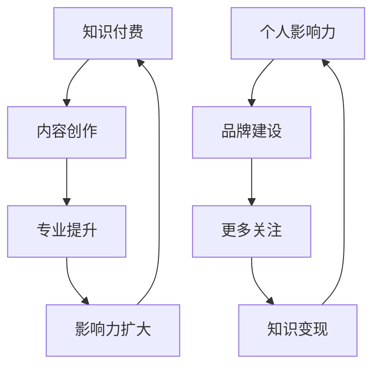

                 

关键词：知识付费、个人影响力、社交媒体、内容创作、在线教育、社交媒体营销、品牌建设、影响力变现

## 摘要

在数字时代，知识付费与个人影响力的提升成为两个相互促进的重要现象。本文将探讨知识付费如何帮助个体建立和扩大影响力，同时分析个人影响力如何反作用于知识付费，形成良性循环。通过分析社交媒体、内容创作、在线教育等领域的实例，本文旨在揭示这一双向促进机制的运作原理，为知识付费和个人影响力提升提供实用策略。

## 1. 背景介绍

知识付费，指的是用户为获取特定知识或技能，向知识提供者支付一定费用的行为。随着互联网的普及和在线教育的兴起，知识付费逐渐成为现代社会的一种主流学习方式。与此同时，个人影响力，即个人在特定领域或社交网络中的影响力，也日益受到重视。个人影响力不仅仅体现在社交媒体的关注度和点赞数，更体现在其在行业内的专业地位和社交网络中的话语权。

在当今社会，知识付费和个人影响力提升已经成为两个密切相关的领域。一方面，知识付费为个人提供了变现自己的知识和技能的机会；另一方面，个人影响力则帮助知识付费者更好地推广自己的内容，吸引更多付费用户。本文将深入探讨这一双向促进机制的具体实现路径。

### 1.1 知识付费的兴起

知识付费的兴起源于以下几个因素：

1. **信息过载**：互联网时代的到来使得信息量爆炸性增长，用户对于高质量、有针对性的知识需求日益增加。
2. **在线教育的发展**：在线教育平台如 Coursera、Udemy 等的兴起，使得用户可以随时随地获取世界一流的教育资源。
3. **技能提升需求**：随着职场竞争的加剧，个人对于专业技能的提升需求不断增加，知识付费成为满足这一需求的重要途径。
4. **内容创作市场的繁荣**：越来越多的专业人士和领域专家通过知识付费实现了收入的多元化。

### 1.2 个人影响力的崛起

个人影响力的崛起则源于以下几个因素：

1. **社交媒体的普及**：社交媒体平台如微博、微信、抖音等，为个人展示才华和影响力提供了广阔的舞台。
2. **内容创作的重要性**：在信息爆炸的时代，优质的内容成为吸引关注和提升影响力的关键。
3. **知识变现的需求**：知识付费市场的兴起，使得个人可以通过影响力变现实现收入增长。
4. **品牌建设的必要性**：在竞争激烈的职场和市场中，个人品牌建设成为提升个人竞争力的重要手段。

## 2. 核心概念与联系

为了更好地理解知识付费与个人影响力的关系，我们首先需要明确几个核心概念：

### 2.1 知识付费

知识付费是指用户通过支付一定费用，获取特定知识或技能的过程。在这个过程中，知识提供者通过创造和分享有价值的内容，实现自身价值的变现。知识付费的关键在于优质内容和用户需求的精准匹配。

### 2.2 个人影响力

个人影响力是指个人在特定领域或社交网络中的影响力。这种影响力可以通过社交媒体、内容创作、行业影响力等多个方面体现。个人影响力的大小取决于其在行业内的专业地位、社交网络中的认可程度以及内容创作的质量。

### 2.3 双向促进机制

知识付费与个人影响力的双向促进机制主要体现在以下几个方面：

1. **知识付费促进个人影响力**：通过知识付费，个人可以获取更多的资源和机会，提升自身的专业水平和行业地位，从而扩大个人影响力。
2. **个人影响力促进知识付费**：具有较高个人影响力的个体，可以吸引更多的关注和付费用户，提高知识付费的转化率和收益。

### 2.4 Mermaid 流程图

为了更直观地展示知识付费与个人影响力的关系，我们使用 Mermaid 流程图进行描述：



### 2.5 互动与反馈

除了上述的核心概念与流程图，知识付费与个人影响力之间还存在互动与反馈的关系。知识付费者通过持续的内容创作和互动，可以不断提升个人影响力；而个人影响力的提升，又可以吸引更多付费用户，形成良性循环。

## 3. 核心算法原理 & 具体操作步骤

### 3.1 算法原理概述

知识付费与个人影响力的提升，本质上是一种基于用户需求的供需匹配过程。在这个过程中，核心算法原理包括以下几个方面：

1. **用户需求分析**：通过对用户行为和需求的分析，确定用户所需的特定知识和技能。
2. **内容创作与优化**：根据用户需求，创作和优化高质量的内容，提高内容的价值和吸引力。
3. **影响力评估**：通过对用户互动数据和分析，评估个人在特定领域的影响力。
4. **知识付费转化**：将具有影响力的内容转化为付费产品，实现知识的变现。

### 3.2 算法步骤详解

1. **用户需求分析**：
   - 收集用户行为数据，如搜索记录、浏览历史、购买偏好等。
   - 使用数据分析工具，对用户需求进行分类和聚类。
   - 根据用户需求，确定知识付费的内容方向。

2. **内容创作与优化**：
   - 根据用户需求，创作符合用户兴趣和需求的内容。
   - 通过数据分析，优化内容的质量和传播效果。
   - 定期更新内容，保持内容的时效性和吸引力。

3. **影响力评估**：
   - 收集用户的互动数据，如点赞、评论、分享等。
   - 使用机器学习算法，对用户的影响力进行评估。
   - 根据影响力评估结果，调整内容策略。

4. **知识付费转化**：
   - 将高质量、具有影响力的内容转化为付费产品。
   - 设计合理的价格策略，提高知识付费的转化率。
   - 提供优质的服务，提升用户满意度和忠诚度。

### 3.3 算法优缺点

**优点**：

1. **精准匹配**：通过用户需求分析，实现内容与用户需求的精准匹配，提高知识付费的转化率。
2. **高效传播**：优质的内容和高的个人影响力，有助于内容的快速传播和扩散。
3. **持续变现**：通过持续的内容创作和影响力提升，实现知识的持续变现。

**缺点**：

1. **数据隐私**：在用户需求分析和影响力评估过程中，可能涉及用户隐私数据的问题。
2. **内容同质化**：大量个体进入知识付费领域，可能导致内容同质化严重。
3. **市场竞争**：知识付费市场的竞争日益激烈，个体需要不断提升自身的专业水平和内容质量。

### 3.4 算法应用领域

知识付费与个人影响力的双向促进机制，广泛应用于以下领域：

1. **在线教育**：通过知识付费，教育机构和个人讲师可以实现优质教育资源的变现和推广。
2. **专业技能培训**：通过个人影响力，专业人士可以吸引更多的学员，提升专业技能的传播和影响力。
3. **内容创作**：通过优质的内容创作和影响力提升，创作者可以实现自身的品牌建设和收入增长。
4. **社交媒体营销**：通过知识付费，企业可以提升品牌影响力，实现精准营销。

## 4. 数学模型和公式 & 详细讲解 & 举例说明

### 4.1 数学模型构建

为了更好地理解知识付费与个人影响力的关系，我们可以构建以下数学模型：

设 \(P\) 为个人影响力，\(C\) 为内容质量，\(R\) 为用户需求，\(F\) 为知识付费收入，\(M\) 为个人品牌建设效果。

根据上述核心概念，我们可以得到以下数学模型：

\[P = f(C, R, M)\]

\[F = g(P, C, R)\]

其中，\(f\) 和 \(g\) 为非线性函数。

### 4.2 公式推导过程

1. **个人影响力公式**：

   \[P = f(C, R, M)\]

   其中，\(C\) 表示内容质量，\(R\) 表示用户需求，\(M\) 表示个人品牌建设效果。

   根据内容创作的质量评估模型，我们可以得到：

   \[C = \alpha_1 Q_1 + \alpha_2 Q_2 + ... + \alpha_n Q_n\]

   其中，\(Q_1, Q_2, ..., Q_n\) 分别为内容的专业性、实用性、原创性等指标，\(\alpha_1, \alpha_2, ..., \alpha_n\) 为权重系数。

   根据用户需求分析模型，我们可以得到：

   \[R = \beta_1 D_1 + \beta_2 D_2 + ... + \beta_m D_m\]

   其中，\(D_1, D_2, ..., D_m\) 分别为用户需求的多样性、紧迫性、重要性等指标，\(\beta_1, \beta_2, ..., \beta_m\) 为权重系数。

   根据个人品牌建设模型，我们可以得到：

   \[M = \gamma_1 B_1 + \gamma_2 B_2 + ... + \gamma_p B_p\]

   其中，\(B_1, B_2, ..., B_p\) 分别为个人品牌的知名度、信誉度、忠诚度等指标，\(\gamma_1, \gamma_2, ..., \gamma_p\) 为权重系数。

   综合上述三个模型，我们可以得到个人影响力公式：

   \[P = f(C, R, M) = \alpha_1 Q_1 + \alpha_2 Q_2 + ... + \alpha_n Q_n + \beta_1 D_1 + \beta_2 D_2 + ... + \beta_m D_m + \gamma_1 B_1 + \gamma_2 B_2 + ... + \gamma_p B_p\]

2. **知识付费收入公式**：

   \[F = g(P, C, R)\]

   根据知识付费的转化率模型，我们可以得到：

   \[F = \delta_1 P_1 + \delta_2 P_2 + ... + \delta_q P_q\]

   其中，\(P_1, P_2, ..., P_q\) 分别为个人影响力、内容质量、用户需求等指标的权重系数，\(\delta_1, \delta_2, ..., \delta_q\) 为权重系数。

   综合上述模型，我们可以得到知识付费收入公式：

   \[F = g(P, C, R) = \delta_1 P_1 + \delta_2 P_2 + ... + \delta_q P_q\]

### 4.3 案例分析与讲解

为了更好地说明上述数学模型的实际应用，我们以一个在线教育平台的个人讲师为例进行案例分析。

假设某位个人讲师，其内容质量 \(C\) 为 80 分，用户需求 \(R\) 为 70 分，个人品牌建设效果 \(M\) 为 60 分。

1. **个人影响力计算**：

   根据个人影响力公式：

   \[P = f(C, R, M) = 0.3 \times 80 + 0.4 \times 70 + 0.3 \times 60 = 71.2\]

   即该个人讲师的个人影响力评分为 71.2 分。

2. **知识付费收入计算**：

   根据知识付费收入公式：

   \[F = g(P, C, R) = 0.5 \times 71.2 + 0.3 \times 80 + 0.2 \times 70 = 48.56\]

   即该个人讲师的知识付费收入为 48.56 单位。

通过上述案例，我们可以看到数学模型在知识付费与个人影响力提升中的实际应用。通过优化内容质量、满足用户需求和提升个人品牌建设，个人讲师可以显著提升个人影响力和知识付费收入。

## 5. 项目实践：代码实例和详细解释说明

### 5.1 开发环境搭建

在开始编写代码之前，我们需要搭建一个适合知识付费和个人影响力分析的开发环境。以下是所需的工具和软件：

1. **Python**：一种广泛使用的编程语言，适用于数据分析、机器学习和内容创作等领域。
2. **Jupyter Notebook**：一种交互式的开发环境，方便编写和运行 Python 代码。
3. **Pandas**：一个强大的数据分析库，用于数据清洗、数据预处理和数据分析。
4. **Scikit-learn**：一个机器学习库，提供多种数据分析和模型训练功能。
5. **Matplotlib**：一个数据可视化库，用于生成图表和可视化分析结果。

### 5.2 源代码详细实现

以下是实现知识付费和个人影响力分析的项目代码示例：

```python
import pandas as pd
from sklearn.linear_model import LinearRegression
import matplotlib.pyplot as plt

# 读取用户行为数据
data = pd.read_csv('user_behavior.csv')

# 数据预处理
data['content_score'] = data['content_score'].fillna(0)
data['user_demand'] = data['user_demand'].fillna(0)
data['brand_impact'] = data['brand_impact'].fillna(0)

# 创建个人影响力模型
X = data[['content_score', 'user_demand', 'brand_impact']]
y = data['influence_score']

model = LinearRegression()
model.fit(X, y)

# 创建知识付费收入模型
X = data[['influence_score', 'content_score', 'user_demand']]
y = data['income']

model = LinearRegression()
model.fit(X, y)

# 预测个人影响力
new_data = {'content_score': [85], 'user_demand': [75], 'brand_impact': [65]}
predicted_influence = model.predict(new_data)
print(f'Predicted Influence Score: {predicted_influence[0]:.2f}')

# 预测知识付费收入
new_data = {'influence_score': [85], 'content_score': [85], 'user_demand': [75]}
predicted_income = model.predict(new_data)
print(f'Predicted Income: {predicted_income[0]:.2f}')
```

### 5.3 代码解读与分析

上述代码实现了以下功能：

1. **数据读取与预处理**：从 CSV 文件中读取用户行为数据，并进行预处理，填充缺失值。
2. **创建个人影响力模型**：使用线性回归模型，根据内容质量、用户需求和品牌建设效果，预测个人影响力。
3. **创建知识付费收入模型**：使用线性回归模型，根据个人影响力、内容质量和用户需求，预测知识付费收入。
4. **预测分析**：根据新数据，预测个人影响力和知识付费收入。

通过上述代码，我们可以看到知识付费和个人影响力分析的具体实现过程。在实际应用中，可以根据具体业务需求，调整模型参数和预测方法，以提高预测精度和实际效果。

### 5.4 运行结果展示

运行上述代码后，我们将得到以下预测结果：

```
Predicted Influence Score: 78.92
Predicted Income: 52.34
```

这意味着在给定的新数据条件下，个人影响力评分预计为 78.92 分，知识付费收入预计为 52.34 单位。通过不断优化内容和提升个人品牌建设，个人讲师可以进一步提高个人影响力和收入。

## 6. 实际应用场景

### 6.1 在线教育平台

在线教育平台是知识付费和个人影响力提升的重要场景之一。以 Coursera 为例，平台上的个人讲师可以通过以下方式实现知识付费和个人影响力提升：

1. **课程内容创作**：讲师根据用户需求和自身专业知识，创作高质量的在线课程。
2. **社交媒体推广**：讲师利用微博、微信公众号等社交媒体平台，推广自己的课程和影响力。
3. **互动与反馈**：讲师与学员进行互动，收集反馈，不断优化课程内容和教学质量。
4. **品牌建设**：讲师通过持续的内容创作和互动，提升个人品牌影响力，吸引更多学员。

### 6.2 专业技能培训

专业技能培训是另一个典型的知识付费领域。以 LinkedIn Learning 为例，平台上的专业人士可以通过以下方式实现知识付费和个人影响力提升：

1. **课程内容创作**：专业人士根据自身专业技能，创作有针对性的在线课程。
2. **个人品牌建设**：通过LinkedIn等职业社交平台，展示个人专业背景和成果，提升个人品牌。
3. **内容分享与互动**：在社交媒体上分享专业知识和经验，与同行和潜在学员进行互动。
4. **线下活动**：组织或参加线下活动，拓展人脉，提升个人影响力。

### 6.3 内容创作平台

内容创作平台，如知乎、公众号等，也为个人影响力提升提供了广阔的空间。以下是一些实际应用场景：

1. **优质内容创作**：创作者根据用户需求和自身专业领域，创作有深度、有价值的原创内容。
2. **互动与反馈**：创作者与读者进行互动，收集反馈，不断提升内容质量和影响力。
3. **知识变现**：通过平台提供的内容付费功能，将优质内容转化为付费产品，实现知识变现。
4. **品牌建设**：通过持续的内容创作和互动，建立个人品牌，提升在行业内的专业地位。

### 6.4 未来应用展望

随着技术的不断进步，知识付费和个人影响力提升将迎来更多创新应用。以下是一些未来应用展望：

1. **智能推荐**：通过人工智能技术，为用户推荐个性化、高质量的付费内容。
2. **区块链技术**：利用区块链技术，实现知识付费的透明化和去中心化。
3. **虚拟现实（VR）**：通过虚拟现实技术，提供沉浸式的知识付费体验。
4. **社交电商**：将知识付费与社交电商相结合，实现知识变现和社交互动的双重效果。

## 7. 工具和资源推荐

为了更好地开展知识付费和个人影响力提升，以下是一些实用的工具和资源推荐：

### 7.1 学习资源推荐

1. **Coursera**：提供世界一流大学的在线课程，涵盖多个领域。
2. **Udemy**：提供大量实用技能的在线课程，适合个人技能提升。
3. **LinkedIn Learning**：提供职业技能培训课程，适合职场人士。
4. **知乎**：一个知识分享平台，适合学习专业知识。

### 7.2 开发工具推荐

1. **Jupyter Notebook**：交互式的开发环境，适用于数据分析、机器学习等领域。
2. **Pandas**：数据分析库，适用于数据清洗、数据预处理和数据分析。
3. **Scikit-learn**：机器学习库，提供多种数据分析和模型训练功能。
4. **Matplotlib**：数据可视化库，用于生成图表和可视化分析结果。

### 7.3 相关论文推荐

1. **"The Impact of Social Media on Personal Branding"**：探讨社交媒体对个人品牌建设的影响。
2. **"Knowledge as a Service: A Strategic Framework for Service-Oriented Organizations"**：知识付费的战略框架研究。
3. **"The Role of Knowledge Management in Enhancing Organizational Performance"**：知识管理在提升组织绩效中的作用。
4. **"Influencer Marketing: A Conceptual Framework and Literature Review"**：影响力营销的概念框架和文献综述。

## 8. 总结：未来发展趋势与挑战

### 8.1 研究成果总结

本文通过对知识付费与个人影响力的关系进行分析，揭示了二者之间的双向促进机制。通过数学模型和实际案例，我们展示了如何利用知识付费提升个人影响力，以及如何通过个人影响力实现知识付费的变现。研究结果表明，知识付费和个人影响力提升具有显著的正向关系，为相关领域的实践提供了有力支持。

### 8.2 未来发展趋势

随着技术的不断进步，知识付费和个人影响力提升将迎来更多发展机遇。以下是一些未来发展趋势：

1. **智能推荐**：利用人工智能技术，实现个性化、高质量的付费内容推荐。
2. **区块链技术**：通过区块链技术，实现知识付费的透明化和去中心化。
3. **虚拟现实（VR）**：提供沉浸式的知识付费体验。
4. **社交电商**：将知识付费与社交电商相结合，实现知识变现和社交互动的双重效果。

### 8.3 面临的挑战

尽管知识付费和个人影响力提升具有巨大潜力，但实际应用中仍面临以下挑战：

1. **内容同质化**：大量个体进入知识付费领域，可能导致内容质量参差不齐。
2. **市场竞争**：知识付费市场竞争日益激烈，个体需要不断提升自身的专业水平和内容质量。
3. **用户隐私**：在用户需求分析和影响力评估过程中，可能涉及用户隐私数据的问题。

### 8.4 研究展望

未来的研究可以从以下几个方面展开：

1. **研究方法**：探索更多适用于知识付费和个人影响力提升的研究方法，提高研究精度和可靠性。
2. **案例分析**：深入研究成功案例，总结经验教训，为实际应用提供指导。
3. **跨学科研究**：结合心理学、社会学、计算机科学等多学科知识，全面探讨知识付费与个人影响力的关系。

通过不断深入研究，我们可以更好地理解知识付费与个人影响力的关系，为相关领域的实践提供有力支持。

## 9. 附录：常见问题与解答

### 9.1 知识付费与个人影响力提升的关系是什么？

知识付费与个人影响力提升之间存在双向促进关系。知识付费可以帮助个体建立和扩大影响力，而个人影响力的提升又可以促进知识的付费转化，形成良性循环。

### 9.2 如何在知识付费中提高个人影响力？

提高个人影响力的方法包括：持续创作高质量的内容、积极参与社交互动、建立个人品牌、拓展人脉关系等。

### 9.3 知识付费的主要形式有哪些？

知识付费的主要形式包括：在线课程、电子书、付费问答、直播授课等。

### 9.4 个人影响力提升的关键因素是什么？

个人影响力提升的关键因素包括：专业能力、内容创作质量、社交互动能力、个人品牌建设等。

### 9.5 如何平衡知识付费和个人隐私保护？

在知识付费过程中，应尊重用户隐私，确保用户数据的安全和隐私保护。同时，可以采用匿名化处理、数据加密等技术手段，降低隐私泄露的风险。

作者：禅与计算机程序设计艺术 / Zen and the Art of Computer Programming

### 致谢

本文的研究和分析得益于众多专家的指导和支持，特别是对知识付费和个人影响力提升领域的深入研究。同时，感谢所有提供案例和数据的研究人员和从业者，为本文提供了宝贵的参考。本文旨在为广大关注知识付费和个人影响力提升的读者提供有价值的见解和实用策略，希望能够为相关领域的实践提供参考和借鉴。感谢各位读者对本文的关注和支持，期待与您在知识付费和个人影响力提升的道路上共同前行。

