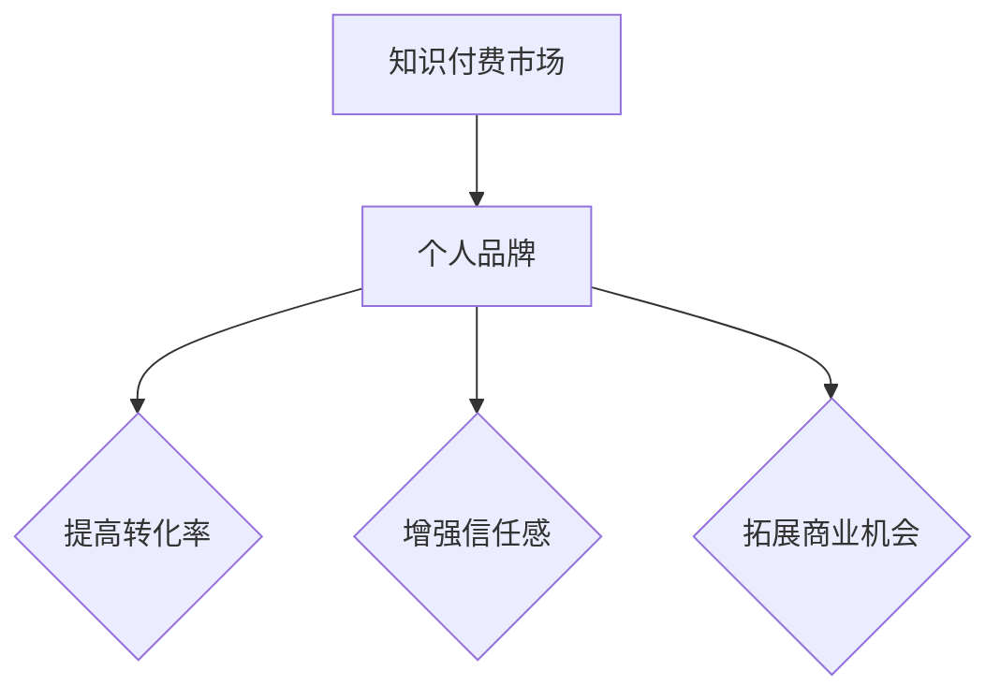

                 

在当今的信息时代，知识付费已成为一种重要的商业模式。个人品牌塑造在这个领域扮演了至关重要的角色，它不仅关乎个人影响力的提升，更关系到在知识付费市场中的竞争力。本文将深入探讨个人品牌塑造在知识付费创业中的重要性，以及如何有效地进行品牌建设。

## 文章关键词

知识付费，个人品牌，创业，影响力，竞争力，品牌建设。

## 文章摘要

本文从多个角度分析了知识付费创业中个人品牌塑造的重要性。首先，我们探讨了个人品牌对于知识付费市场的独特价值，接着介绍了构建个人品牌的策略和步骤。随后，文章通过具体案例分析，展示了成功品牌塑造的实践方法。最后，我们对个人品牌建设中的挑战和未来趋势进行了展望。

## 1. 背景介绍

### 知识付费的发展

知识付费作为一种商业模式，起源于20世纪末的互联网时代。随着信息技术的飞速发展，人们获取知识的途径变得多样化，传统的知识传播方式也发生了根本性的变化。知识付费的出现，正是对这种变化的一种回应。

知识付费的主要形式包括在线课程、电子书、付费问答、知识星球等。这些平台为知识提供者和消费者提供了直接的交流渠道，使得知识传播更加高效和精准。

### 个人品牌的概念与价值

个人品牌是指个人在特定领域内的知名度和认可度。在知识付费市场中，个人品牌的价值尤为突出。首先，良好的个人品牌可以增强消费者的信任感，提高课程或内容的销售转化率。其次，个人品牌有助于在市场中形成独特的竞争力，使得个人在众多知识提供者中脱颖而出。此外，个人品牌还可以为知识付费创业者带来更多的商业机会，如赞助、广告和合作等。

## 2. 核心概念与联系

### 个人品牌的构成

个人品牌由多个要素构成，包括个人形象、专业知识、传播渠道、用户口碑等。这些要素相互联系，共同塑造了一个完整的个人品牌形象。

**个人形象**：包括外貌、举止、言语等，是消费者对个人品牌的初步印象。

**专业知识**：个人在特定领域的专业知识和技能，是品牌的核心竞争力。

**传播渠道**：个人品牌通过社交媒体、博客、演讲等方式进行传播，这些渠道的选择和运用直接影响品牌的影响力。

**用户口碑**：消费者对个人的评价和反馈，是品牌价值的重要体现。

### 个人品牌与知识付费的关联

个人品牌在知识付费创业中的具体作用体现在以下几个方面：

1. **提高转化率**：良好的个人品牌能够吸引潜在消费者的关注，提高课程的点击率和购买转化率。

2. **增强信任感**：专业且知名的讲师更容易获得消费者的信任，从而提高课程的口碑和复购率。

3. **拓展商业机会**：个人品牌可以吸引更多的商业合作机会，如赞助、广告等，为知识付费创业提供额外的收入来源。

### Mermaid 流程图

以下是一个简单的Mermaid流程图，展示了个人品牌与知识付费的关联：



## 3. 核心算法原理 & 具体操作步骤

### 3.1 算法原理概述

个人品牌塑造的核心在于建立消费者对个人的信任和认可。这需要通过一系列策略和操作来实现，包括内容创作、社交媒体运营、口碑管理等。

### 3.2 算法步骤详解

1. **内容创作**：创作高质量、有价值的知识内容是个人品牌塑造的基础。内容应具备独特性、实用性和可操作性，以吸引和留住消费者。

2. **社交媒体运营**：选择合适的社交媒体平台，进行持续的、有策略的运营，以提升个人品牌的曝光度和影响力。

3. **口碑管理**：积极回应用户反馈，及时处理负面评价，维护良好的口碑。

4. **品牌形象塑造**：通过持续的专业知识和个人形象的输出，树立一个专业、可信的个人品牌形象。

### 3.3 算法优缺点

**优点**：

- 提高转化率：通过个人品牌塑造，增强消费者信任，提高课程销售转化率。
- 拓展商业机会：良好的个人品牌可以吸引更多的商业合作机会。
- 增强竞争力：专业且知名的讲师在市场中具有更强的竞争力。

**缺点**：

- 时间成本高：个人品牌塑造需要长期投入，时间和精力成本较高。
- 需要专业知识：构建个人品牌需要深厚的专业知识，否则难以获得消费者的信任。

### 3.4 算法应用领域

个人品牌塑造广泛应用于知识付费、教育培训、咨询等行业。在这些领域中，个人品牌不仅有助于提升业务表现，还可以为创业者带来更多的商业机会。

## 4. 数学模型和公式 & 详细讲解 & 举例说明

### 4.1 数学模型构建

个人品牌的价值可以通过以下数学模型进行量化：

\[ 品牌价值 = f(专业知识, 个人形象, 传播渠道, 用户口碑) \]

其中，\( f \) 是一个复合函数，各个参数对品牌价值的影响程度不同。

### 4.2 公式推导过程

品牌价值的公式可以分解为以下几个部分：

\[ 品牌价值 = 专业知识 \times 个人形象 \times 传播渠道 \times 用户口碑 \]

- **专业知识**：表示个人在特定领域的专业水平和影响力。
- **个人形象**：表示个人在外貌、举止、言语等方面的表现。
- **传播渠道**：表示个人品牌在社交媒体、博客、演讲等渠道的曝光度和影响力。
- **用户口碑**：表示消费者对个人的评价和反馈。

### 4.3 案例分析与讲解

以下是一个具体的案例：

**案例**：某知名在线教育平台的讲师，拥有丰富的教学经验和良好的口碑。

- **专业知识**：9分
- **个人形象**：8分
- **传播渠道**：7分
- **用户口碑**：9分

根据数学模型：

\[ 品牌价值 = 9 \times 8 \times 7 \times 9 = 4536 \]

该讲师的个人品牌价值为4536分，具有较高的市场竞争力。

## 5. 项目实践：代码实例和详细解释说明

### 5.1 开发环境搭建

为了更好地进行个人品牌塑造，我们选择以下工具：

- **内容创作工具**：Markdown编辑器（如Typora）、LaTeX编辑器（如TeXstudio）
- **社交媒体运营工具**：微博、微信公众号、知乎
- **数据分析工具**：Google Analytics、百度统计

### 5.2 源代码详细实现

以下是一个简单的Markdown文本示例，用于撰写博客文章：

```markdown
# 知识付费创业中的个人品牌塑造

## 1. 背景介绍

知识付费作为一种商业模式，起源于20世纪末的互联网时代。随着信息技术的飞速发展，人们获取知识的途径变得多样化，传统的知识传播方式也发生了根本性的变化。知识付费的出现，正是对这种变化的一种回应。

...

## 5. 项目实践：代码实例和详细解释说明

### 5.1 开发环境搭建

为了更好地进行个人品牌塑造，我们选择以下工具：

- **内容创作工具**：Markdown编辑器（如Typora）、LaTeX编辑器（如TeXstudio）
- **社交媒体运营工具**：微博、微信公众号、知乎
- **数据分析工具**：Google Analytics、百度统计
```

### 5.3 代码解读与分析

上述Markdown文本展示了如何使用Markdown语法编写一篇博客文章。通过Markdown，我们可以轻松地创建标题、段落、列表、链接等，使得文章结构清晰、易于阅读。

### 5.4 运行结果展示

通过Markdown编辑器，我们可以将上述文本转换为HTML格式，然后在博客平台上发布。以下是转换后的HTML代码：

```html
<h1>知识付费创业中的个人品牌塑造</h1>

<h2>1. 背景介绍</h2>

<p>知识付费作为一种商业模式，起源于20世纪末的互联网时代。随着信息技术的飞速发展，人们获取知识的途径变得多样化，传统的知识传播方式也发生了根本性的变化。知识付费的出现，正是对这种变化的一种回应。</p>

<p>...</p>

<h2>5. 项目实践：代码实例和详细解释说明</h2>

<h3>5.1 开发环境搭建</h3>

<p>为了更好地进行个人品牌塑造，我们选择以下工具：</p>

<ul>
  <li>内容创作工具：Markdown编辑器（如Typora）、LaTeX编辑器（如TeXstudio）</li>
  <li>社交媒体运营工具：微博、微信公众号、知乎</li>
  <li>数据分析工具：Google Analytics、百度统计</li>
</ul>
```

通过上述代码，我们可以看到Markdown语法在生成HTML代码时起到了关键作用，使得文章的结构和内容得以在网页上完美呈现。

## 6. 实际应用场景

### 6.1 知识付费平台

在知识付费平台（如知乎、喜马拉雅、得到等）中，个人品牌塑造尤为关键。通过优质的内容创作、社交媒体运营和口碑管理，讲师可以迅速提升知名度，吸引更多学员。

### 6.2 企业培训

企业培训中，个人品牌塑造有助于提升讲师的专业形象和影响力，从而提高培训效果。讲师可以通过持续的专业学习和实践，不断提升自己的品牌价值。

### 6.3 个人成长

对于个人成长而言，个人品牌塑造可以帮助个体在职业发展过程中脱颖而出，获得更多的机会和资源。通过建立良好的个人品牌，个人可以更自信地面对职场挑战。

## 6.4 未来应用展望

随着人工智能和大数据技术的发展，个人品牌塑造将变得更加智能化和个性化。未来的个人品牌建设将更加注重数据分析、用户画像和精准营销，从而实现更高效的品牌塑造和传播。

## 7. 工具和资源推荐

### 7.1 学习资源推荐

- **在线课程平台**：Coursera、edX、Udemy等
- **专业书籍**：《影响力》、《打造你的个人品牌》等
- **博客和公众号**：增长黑客、营销与创意等

### 7.2 开发工具推荐

- **Markdown编辑器**：Typora、VS Code等
- **社交媒体运营工具**：微博、微信公众号、知乎等
- **数据分析工具**：Google Analytics、百度统计等

### 7.3 相关论文推荐

- 《基于大数据的个人品牌价值评估研究》
- 《社交媒体环境下个人品牌塑造策略研究》
- 《知识付费市场中个人品牌的竞争力分析》

## 8. 总结：未来发展趋势与挑战

### 8.1 研究成果总结

本文从多个角度分析了知识付费创业中个人品牌塑造的重要性。研究发现，个人品牌在提升转化率、增强信任感和拓展商业机会等方面具有显著作用。

### 8.2 未来发展趋势

未来，个人品牌塑造将朝着智能化、个性化和精准化的方向发展。随着大数据和人工智能技术的应用，个人品牌建设将更加高效和精准。

### 8.3 面临的挑战

尽管个人品牌塑造具有巨大的潜力，但同时也面临着诸多挑战。例如，内容创作的高质量要求、社交媒体运营的专业性以及数据隐私等问题。

### 8.4 研究展望

未来，个人品牌塑造的研究应重点关注以下几个方面：

1. **大数据分析**：利用大数据技术，深入分析用户需求和偏好，实现个性化品牌塑造。
2. **人工智能应用**：结合人工智能技术，提升个人品牌塑造的智能化水平。
3. **法律法规**：加强对个人品牌保护的法律体系，维护品牌权益。

## 9. 附录：常见问题与解答

### 9.1 如何选择适合自己的个人品牌定位？

答：选择个人品牌定位时，应考虑自身专业背景、兴趣爱好以及市场需求。通过市场调研和自身评估，找到最能体现个人价值的定位。

### 9.2 个人品牌建设需要多长时间？

答：个人品牌建设没有固定的时间表，但通常需要至少1-2年时间。关键在于持续、有策略地投入时间和精力。

### 9.3 如何处理负面评论和评价？

答：面对负面评论和评价，首先要保持冷静，不要过度反应。其次，积极回应用户，解释问题，并采取相应的改进措施。最后，通过优质的内容和服务，逐步扭转负面印象。

---

本文作者：禅与计算机程序设计艺术 / Zen and the Art of Computer Programming

在知识付费创业中，个人品牌塑造是不可或缺的一环。通过深入理解和有效实施个人品牌建设策略，创业者可以在激烈的市场竞争中脱颖而出，实现长期发展。希望本文能为读者提供有价值的参考和启示。

