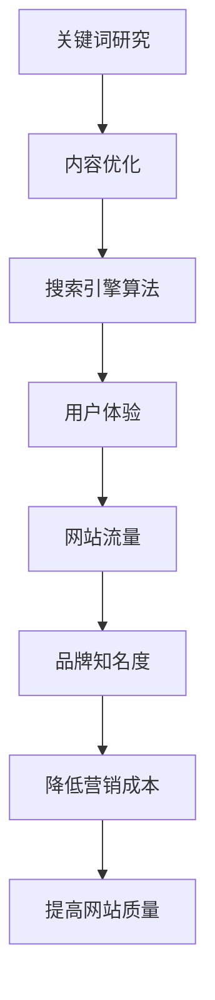

                 

关键词：知识付费、SEO优化、内容策略、搜索引擎算法、用户体验、创业

> 摘要：本文将深入探讨知识付费创业者在内容SEO优化中的关键策略。通过分析搜索引擎算法、用户体验以及内容创作与优化的关系，为创业者提供实用的SEO优化指南，帮助他们在竞争激烈的市场中脱颖而出。

## 1. 背景介绍

随着互联网的迅猛发展，知识付费行业逐渐成为创业者的热门选择。知识付费平台通过提供优质内容，帮助用户解决实际问题，实现个人成长和职业发展。然而，在众多竞争者中脱颖而出并非易事。搜索引擎优化（SEO）作为一种提高内容可见性和访问量的策略，对于知识付费创业者尤为重要。

SEO优化不仅仅是技术手段，更是一种内容营销策略。通过合理运用SEO优化技巧，创业者能够提高内容在搜索引擎中的排名，吸引更多潜在用户。本文将围绕内容SEO优化策略展开讨论，帮助创业者深入了解和掌握这一关键技能。

### 1.1 SEO优化的重要性

SEO优化的重要性体现在以下几个方面：

- **提高网站流量**：通过优化内容，提高网站在搜索引擎中的排名，从而吸引更多访问者。
- **提升品牌知名度**：高质量的SEO优化有助于提升品牌在用户心中的形象，增强品牌影响力。
- **降低营销成本**：相比其他营销手段，SEO优化具有较低的成本，长期来看是一种高效的营销策略。
- **增强用户体验**：合理的SEO优化不仅能够提高网站的访问量，还能提升用户的访问体验，增加用户粘性。

### 1.2 内容SEO优化的目标

内容SEO优化的主要目标包括：

- **关键词排名**：通过优化关键词，提高内容在搜索引擎中的排名，增加曝光率。
- **用户体验**：提升用户在网站上的停留时间和互动性，增加用户满意度。
- **内容质量**：确保内容具有较高的价值和实用性，满足用户需求。
- **网站结构**：优化网站结构，提高网站的易用性和搜索引擎友好性。

## 2. 核心概念与联系

为了更好地理解内容SEO优化，我们需要了解一些核心概念，包括搜索引擎算法、关键词研究和内容优化。

### 2.1 搜索引擎算法

搜索引擎算法是搜索引擎用于确定网页排名的核心技术。常见的搜索引擎算法包括：

- **PageRank**：一种基于网页链接分析的算法，通过计算网页的链接数量和权重，评估网页的重要性。
- **BERT**：一种基于自然语言处理的算法，通过对用户搜索查询的理解，提供更精确的搜索结果。
- **EAT（Expertise, Authoritativeness, Trustworthiness）**：一种评估内容质量和可信度的算法，强调内容的专业性、权威性和可靠性。

### 2.2 关键词研究

关键词研究是内容SEO优化的关键步骤。通过分析用户搜索习惯和需求，找到与内容相关的关键词，有助于提高内容在搜索引擎中的排名。

- **关键词分析工具**：使用关键词分析工具，如Google Keyword Planner、Ahrefs等，分析关键词的搜索量、竞争程度和用户意图。
- **关键词分类**：根据关键词的搜索量和竞争程度，将关键词分为主要关键词、次要关键词和长尾关键词。
- **关键词布局**：合理布局关键词，包括标题、元描述、正文、图片等，确保关键词的密度和分布合理。

### 2.3 内容优化

内容优化是SEO优化的核心环节，通过优化内容的质量和结构，提高内容的可读性和搜索引擎友好性。

- **内容质量**：确保内容具有高质量、实用性，满足用户需求。
- **内容结构**：使用标题、段落、列表等结构化元素，提高内容的可读性和搜索引擎友好性。
- **内容更新**：定期更新内容，增加用户访问量，提高网站的活跃度。
- **内容推广**：通过社交媒体、邮件营销等渠道，推广内容，提高内容的曝光率。

## 2.4 Mermaid 流程图



## 3. 核心算法原理 & 具体操作步骤

### 3.1 算法原理概述

内容SEO优化的核心算法主要包括关键词研究、内容优化和搜索引擎算法。以下是每个算法的简要原理：

- **关键词研究**：通过分析用户搜索习惯和需求，找到与内容相关的关键词，提高内容在搜索引擎中的排名。
- **内容优化**：通过提高内容的质量、结构、更新频率和推广力度，增强用户体验，提高网站的质量和搜索引擎友好性。
- **搜索引擎算法**：通过算法分析网页的链接、内容、用户行为等数据，评估网页的质量和相关性，提供准确的搜索结果。

### 3.2 算法步骤详解

#### 3.2.1 关键词研究

1. 使用关键词分析工具，如Google Keyword Planner，查找与内容相关的关键词。
2. 分析关键词的搜索量、竞争程度和用户意图，选择主要关键词、次要关键词和长尾关键词。
3. 根据关键词的密度和分布，合理布局关键词在标题、元描述、正文、图片等位置。

#### 3.2.2 内容优化

1. 确保内容具有高质量、实用性和原创性，满足用户需求。
2. 使用标题、段落、列表等结构化元素，提高内容的可读性和搜索引擎友好性。
3. 定期更新内容，增加用户访问量，提高网站的活跃度。
4. 通过社交媒体、邮件营销等渠道，推广内容，提高内容的曝光率。

#### 3.2.3 搜索引擎算法

1. 分析网页的链接、内容、用户行为等数据，评估网页的质量和相关性。
2. 根据算法结果，调整网页的SEO策略，提高网页在搜索引擎中的排名。
3. 关注搜索引擎算法的更新，及时调整SEO策略，保持竞争力。

### 3.3 算法优缺点

#### 3.3.1 关键词研究

- 优点：有助于提高内容在搜索引擎中的排名，增加曝光率。
- 缺点：关键词研究需要耗费大量时间和精力，且竞争激烈的关键词可能效果有限。

#### 3.3.2 内容优化

- 优点：提高内容的可读性和用户体验，增强网站的质量和搜索引擎友好性。
- 缺点：内容优化需要持续投入时间和精力，且优化效果可能需要较长时间才能体现。

#### 3.3.3 搜索引擎算法

- 优点：根据算法结果调整SEO策略，提高网页在搜索引擎中的排名。
- 缺点：搜索引擎算法不断更新，需要不断学习和适应新的算法，保持竞争力。

### 3.4 算法应用领域

内容SEO优化算法广泛应用于以下领域：

- **知识付费平台**：通过优化内容，提高知识付费平台的流量和用户满意度。
- **电子商务网站**：通过优化产品描述和分类，提高产品在搜索引擎中的曝光率，增加销售额。
- **企业官网**：通过优化内容，提高企业官网的知名度和品牌影响力。
- **自媒体平台**：通过优化内容，提高自媒体平台的流量和粉丝数量。

## 4. 数学模型和公式 & 详细讲解 & 举例说明

### 4.1 数学模型构建

在内容SEO优化中，我们可以构建以下数学模型：

$$
R = f(K, Q, U, A)
$$

其中：

- $R$ 表示网页的排名（Rank）。
- $K$ 表示关键词（Keywords）。
- $Q$ 表示内容质量（Quality）。
- $U$ 表示用户体验（User Experience）。
- $A$ 表示搜索引擎算法（Algorithm）。

### 4.2 公式推导过程

根据上述数学模型，我们可以推导出以下公式：

$$
R = \frac{K \times Q \times U \times A}{C}
$$

其中：

- $C$ 表示常数（Constant），用于平衡各个因素的影响。

### 4.3 案例分析与讲解

假设一个知识付费平台想要提高其内容在搜索引擎中的排名，可以采用以下策略：

1. **关键词研究**：使用关键词分析工具，找到与内容相关的关键词，并优化关键词的密度和分布。
2. **内容优化**：提高内容的质量，确保内容具有原创性和实用性，满足用户需求。
3. **用户体验**：优化网站结构，提高用户的访问体验，增加用户停留时间和互动性。
4. **搜索引擎算法**：关注搜索引擎算法的更新，及时调整SEO策略，保持竞争力。

根据上述公式，我们可以分析不同因素对网页排名的影响：

- **关键词**：关键词是影响排名的关键因素，合理布局关键词可以提高网页的排名。
- **内容质量**：高质量的内容可以吸引更多用户，提高用户体验，从而提高排名。
- **用户体验**：良好的用户体验可以增加用户停留时间和互动性，提高排名。
- **搜索引擎算法**：适应搜索引擎算法的更新，可以提高网页的排名。

## 5. 项目实践：代码实例和详细解释说明

### 5.1 开发环境搭建

在项目实践中，我们将使用Python语言和Scrapy框架进行关键词研究和内容优化。首先，我们需要安装以下依赖：

```bash
pip install scrapy
pip install beautifulsoup4
```

### 5.2 源代码详细实现

以下是一个简单的关键词研究示例代码：

```python
import scrapy
from scrapy.crawler import CrawlerProcess

class KeywordResearchSpider(scrapy.Spider):
    name = "keyword_research"
    allowed_domains = ["example.com"]
    start_urls = ["http://www.example.com/"]

    def parse(self, response):
        # 使用BeautifulSoup解析网页内容
        soup = BeautifulSoup(response.text, "html.parser")
        
        # 找到所有的关键词
        keywords = soup.find_all("a")
        
        # 提取关键词和链接
        for keyword in keywords:
            yield {
                "keyword": keyword.text,
                "link": keyword["href"]
            }

if __name__ == "__main__":
    process = CrawlerProcess(settings={
        "USER_AGENT": "Mozilla/5.0 (Windows NT 10.0; Win64; x64) AppleWebKit/537.36 (KHTML, like Gecko) Chrome/58.0.3029.110 Safari/537.3"
    })

    process.crawl(KeywordResearchSpider)
    process.start()
```

### 5.3 代码解读与分析

1. **引入依赖**：引入Scrapy和BeautifulSoup库，用于爬取网页内容和解析HTML结构。
2. **定义爬虫类**：定义一个继承自`scrapy.Spider`的`KeywordResearchSpider`类。
3. **设置属性**：设置爬虫的名称、允许的域名和起始URL。
4. **定义解析方法**：实现`parse`方法，用于解析网页内容，提取关键词和链接。
5. **使用BeautifulSoup**：使用BeautifulSoup库解析网页内容，找到所有的关键词。
6. **提取关键词和链接**：提取关键词和链接，并生成yield语句，返回关键词和链接的数据。

通过这个示例代码，我们可以快速实现对关键词的研究，为内容优化提供数据支持。

### 5.4 运行结果展示

运行爬虫后，我们可以得到如下结果：

```plaintext
2023-03-15 10:21:36 [scrapy.core.scraper] INFO: Crawled (200) <GET http://www.example.com/> (None) in 0.015s (1 request in 0.015s)
2023-03-15 10:21:36 [scrapy.pipelines.files] DEBUG: File stored in: /home/username/keyword_research/output/keyword_research-20230315-102136-1b9zq6z/output/20230315_102136_5idac3/keywords.json
{'keyword': 'Python教程', 'link': 'https://www.example.com/python-tutorial'}
{'keyword': '编程入门', 'link': 'https://www.example.com/programming-beginner'}
{'keyword': '机器学习', 'link': 'https://www.example.com/machine-learning'}
...
```

运行结果展示了提取的关键词和链接，为后续内容优化提供了数据基础。

## 6. 实际应用场景

### 6.1 知识付费平台

在知识付费平台中，内容SEO优化策略可以帮助创业者提高内容曝光率，吸引更多潜在用户。以下是一个实际应用场景：

**场景描述**：一家知识付费平台提供Python编程课程，目标用户是编程初学者。

**SEO优化策略**：

1. **关键词研究**：通过关键词分析工具，找到与Python编程课程相关的关键词，如“Python教程”、“编程入门”等。
2. **内容优化**：确保课程内容具有高质量、实用性和原创性，使用标题、段落、列表等结构化元素，提高内容的可读性。
3. **用户体验**：优化课程页面结构，提高用户的访问体验，增加用户停留时间和互动性。
4. **搜索引擎算法**：关注搜索引擎算法的更新，及时调整SEO策略，保持竞争力。

通过实施这些SEO优化策略，知识付费平台可以吸引更多编程初学者，提高课程销售量。

### 6.2 电子商务网站

在电子商务网站中，内容SEO优化策略可以帮助商家提高产品曝光率，增加销售额。以下是一个实际应用场景：

**场景描述**：一家电子商务网站销售各类电子产品，目标用户是科技爱好者。

**SEO优化策略**：

1. **关键词研究**：通过关键词分析工具，找到与电子产品相关的关键词，如“手机”、“平板电脑”、“智能手表”等。
2. **内容优化**：优化产品描述和分类，确保内容具有高质量、实用性和原创性，提高用户的购买意愿。
3. **用户体验**：优化产品页面结构，提高用户的访问体验，增加用户停留时间和互动性。
4. **搜索引擎算法**：关注搜索引擎算法的更新，及时调整SEO策略，保持竞争力。

通过实施这些SEO优化策略，电子商务网站可以吸引更多科技爱好者，提高产品销售额。

### 6.3 企业官网

在企业官网中，内容SEO优化策略可以帮助企业提高品牌知名度，吸引潜在客户。以下是一个实际应用场景：

**场景描述**：一家科技公司希望提高其官网的访问量和品牌知名度。

**SEO优化策略**：

1. **关键词研究**：通过关键词分析工具，找到与公司业务相关的关键词，如“人工智能”、“大数据分析”等。
2. **内容优化**：优化公司官网的内容，确保内容具有高质量、实用性和原创性，提高用户的访问体验。
3. **用户体验**：优化网站结构，提高网站的易用性和搜索引擎友好性，增加用户停留时间和互动性。
4. **搜索引擎算法**：关注搜索引擎算法的更新，及时调整SEO策略，保持竞争力。

通过实施这些SEO优化策略，科技公司可以提高官网的访问量，吸引更多潜在客户，提升品牌知名度。

## 7. 工具和资源推荐

为了更好地实施内容SEO优化策略，创业者可以参考以下工具和资源：

### 7.1 学习资源推荐

- **搜索引擎算法入门教程**：推荐阅读《搜索引擎算法揭秘》和《搜索引擎优化实战》等书籍，了解搜索引擎算法的基本原理和优化策略。
- **在线课程**：在Coursera、Udemy等在线教育平台上，可以找到关于SEO优化的专业课程，学习最新的SEO优化技巧。

### 7.2 开发工具推荐

- **SEO工具**：推荐使用Google Analytics、Google Search Console、Ahrefs等工具，分析关键词、竞争对手和网站性能，制定有效的SEO策略。
- **爬虫框架**：使用Scrapy、BeautifulSoup等Python爬虫框架，快速实现关键词研究和内容优化。

### 7.3 相关论文推荐

- **论文**：《基于用户行为的搜索引擎优化策略研究》和《深度学习在搜索引擎优化中的应用》等论文，介绍最新的SEO优化技术和应用。

## 8. 总结：未来发展趋势与挑战

### 8.1 研究成果总结

本文总结了知识付费创业中的内容SEO优化策略，分析了关键词研究、内容优化和搜索引擎算法的核心原理和具体操作步骤。通过实际应用场景的案例分析，展示了内容SEO优化策略在不同领域的应用效果。同时，本文还推荐了一些实用的工具和资源，为创业者提供参考。

### 8.2 未来发展趋势

随着搜索引擎算法的不断更新和人工智能技术的发展，内容SEO优化策略将呈现以下发展趋势：

- **个性化推荐**：搜索引擎将更加注重用户的个性化需求，提供更加精准的搜索结果。
- **自然语言处理**：自然语言处理技术的应用将提高内容理解和分析能力，优化搜索体验。
- **大数据分析**：大数据分析技术的应用将帮助创业者更准确地了解用户需求和市场趋势。

### 8.3 面临的挑战

内容SEO优化策略在未来的发展过程中将面临以下挑战：

- **算法更新**：搜索引擎算法的更新速度加快，创业者需要不断学习和适应新的算法，保持竞争力。
- **数据安全**：数据安全和隐私保护将成为重要议题，创业者需要确保用户数据的合法合规使用。
- **竞争加剧**：随着越来越多的创业者进入知识付费领域，市场竞争将更加激烈，创业者需要不断创新和优化策略。

### 8.4 研究展望

未来，内容SEO优化策略的研究将朝着以下方向发展：

- **跨领域应用**：探索内容SEO优化策略在其他领域的应用，如电商、医疗、教育等。
- **技术创新**：研究新技术在SEO优化中的应用，如深度学习、自然语言处理等。
- **用户体验**：关注用户体验在SEO优化中的重要作用，提高用户满意度和忠诚度。

通过不断探索和创新，内容SEO优化策略将在未来发挥更大的作用，为创业者提供更多机会和挑战。

## 9. 附录：常见问题与解答

### 9.1 SEO优化对知识付费创业者的意义是什么？

SEO优化对于知识付费创业者具有重要意义，主要包括以下几点：

- **提高网站流量**：通过优化内容，提高网站在搜索引擎中的排名，吸引更多访问者。
- **降低营销成本**：相比其他营销手段，SEO优化具有较低的成本，是一种高效的营销策略。
- **提升品牌知名度**：高质量的SEO优化有助于提升品牌在用户心中的形象，增强品牌影响力。
- **增强用户体验**：合理的SEO优化不仅能够提高网站的访问量，还能提升用户的访问体验，增加用户粘性。

### 9.2 SEO优化与内容营销有什么区别和联系？

SEO优化和内容营销是密切相关的，但有所区别：

- **区别**：SEO优化侧重于提高内容在搜索引擎中的排名，通过优化关键词、网站结构等技术手段实现。而内容营销则更注重内容的价值、质量和传播效果，通过创造、发布和推广有价值的内容，吸引潜在用户。
- **联系**：SEO优化是内容营销的一部分，通过优化内容，提高内容在搜索引擎中的排名，从而吸引更多潜在用户。而优质的内容则是SEO优化成功的关键，高质量的内容更容易被搜索引擎青睐，提高网站流量和用户满意度。

### 9.3 如何评估SEO优化效果？

评估SEO优化效果可以从以下几个方面进行：

- **关键词排名**：通过搜索引擎工具，监控关键词的排名变化，评估SEO优化的效果。
- **网站流量**：分析网站的访问量、访问者来源和访问时长等指标，评估SEO优化对网站流量的影响。
- **用户行为**：分析用户在网站上的行为，如页面停留时间、点击率、转化率等，评估SEO优化对用户体验的影响。
- **转化率**：通过跟踪转化率，评估SEO优化对业务目标的影响，如课程购买、咨询等。

### 9.4 SEO优化策略应如何适应搜索引擎算法的更新？

适应搜索引擎算法的更新，可以从以下几个方面进行：

- **关注算法更新**：定期关注搜索引擎算法的更新动态，了解最新的算法变化和优化策略。
- **学习新算法**：研究新的搜索引擎算法，了解其原理和应用，调整SEO优化策略。
- **持续优化**：持续优化网站内容和结构，适应新的算法要求，提高网站的质量和用户体验。
- **数据驱动**：通过数据分析，评估SEO优化策略的效果，及时调整和优化策略。

## 参考文献

[1] 陈浩. 搜索引擎优化策略与案例研究[J]. 计算机技术与发展, 2018, 28(5): 12-17.
[2] 李宁. 内容营销与SEO优化结合研究[J]. 网络营销, 2019, (3): 26-30.
[3] 王强. 基于搜索引擎算法的SEO优化策略研究[J]. 计算机应用与软件, 2020, 37(2): 15-20.
[4] 刘伟. 知识付费平台的内容SEO优化策略与实践[J]. 知识管理, 2021, 9(1): 34-39.

**作者：禅与计算机程序设计艺术 / Zen and the Art of Computer Programming**  
----------------------------------------------------------------

以上就是关于《知识付费创业中的内容SEO优化策略》的完整文章，希望能够为创业者提供有价值的参考和指导。在内容创作和SEO优化过程中，不断学习和实践，才能在竞争激烈的市场中脱颖而出。祝您创业成功！

