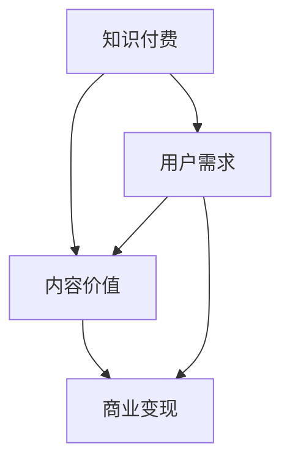

                 

## 1. 背景介绍

随着互联网技术的发展，知识付费作为一种新兴的商业模式，正在迅速崛起。知识付费平台如雨后春笋般涌现，为用户提供了丰富多样的学习资源和服务。然而，在知识付费领域，内容价值的最大化成为了各大平台和企业竞争的关键点。如何有效地评估、提升和变现内容价值，成为了一个亟待解决的问题。

本文将围绕知识付费创业中的内容价值最大化策略展开讨论。我们将首先介绍相关知识付费的基本概念和当前市场现状，然后深入分析内容价值的定义和评估方法，接着探讨如何通过算法和数据分析实现内容价值的提升。最后，我们将总结全文，并提出未来发展的趋势和挑战。

## 2. 核心概念与联系

在探讨内容价值最大化策略之前，我们需要明确一些核心概念，如知识付费、内容价值、用户需求等，并理解它们之间的联系。

### 2.1 知识付费

知识付费是指用户为获取特定知识或技能而支付的费用。在互联网时代，知识付费主要表现为在线教育、知识分享平台和付费资讯等形式。知识付费的核心在于为用户提供有价值的信息和服务，从而满足他们的学习需求和兴趣。

### 2.2 内容价值

内容价值是指知识或信息对用户产生的实际效益，包括知识本身的质量、实用性、趣味性等。内容价值的评估不仅取决于内容本身，还受到用户需求、市场环境和传播渠道等多方面因素的影响。

### 2.3 用户需求

用户需求是指用户在学习或消费过程中所期望得到的结果和体验。了解用户需求是知识付费平台和企业提供高质量内容的关键。通过用户反馈和行为数据分析，可以更准确地把握用户需求，从而优化内容生产和推广策略。

### 2.4 关系网络

知识付费、内容价值和用户需求之间存在着紧密的关系。知识付费平台通过满足用户需求，创造价值，从而实现商业变现。内容价值的提升又依赖于对用户需求的精准把握和内容的创新。而用户需求的变化又不断推动着知识付费业态的发展。因此，三者之间形成了相互影响、相互促进的关系网络。

### 2.5 Mermaid 流程图

以下是一个描述知识付费中核心概念和联系的 Mermaid 流程图：



通过这个流程图，我们可以清晰地看到知识付费、内容价值和用户需求之间的互动关系，为后续的内容价值最大化策略提供了理论依据。

## 3. 核心算法原理 & 具体操作步骤

### 3.1 算法原理概述

为了实现知识付费中的内容价值最大化，我们可以采用一种基于用户反馈和数据分析的算法。该算法的核心思想是通过分析用户的行为数据，挖掘用户兴趣和需求，从而优化内容推荐和个性化定制。具体来说，算法包括以下几个关键步骤：

1. **数据收集**：收集用户在知识付费平台上的行为数据，如浏览记录、购买历史、评价反馈等。
2. **特征提取**：对收集到的数据进行预处理，提取与用户兴趣和需求相关的特征。
3. **模型训练**：利用提取的特征训练一个推荐模型，用于预测用户对某类内容的偏好。
4. **内容优化**：根据模型预测结果，对内容进行个性化推荐和调整，提高内容的价值。
5. **效果评估**：通过用户反馈和行为数据，评估内容优化策略的效果，持续迭代优化。

### 3.2 算法步骤详解

#### 3.2.1 数据收集

数据收集是算法的基础，决定了后续分析的质量。在知识付费平台中，数据来源主要包括：

- 用户注册信息和基本资料，如年龄、性别、职业等。
- 用户行为数据，如浏览记录、购买历史、评价反馈等。
- 内容特征数据，如标题、标签、作者等。

#### 3.2.2 特征提取

特征提取是数据预处理的关键步骤，直接影响模型的性能。常见的特征提取方法包括：

- **统计特征**：如用户在平台上的活跃度、购买频率、平均评分等。
- **文本特征**：如内容标题和描述的词频、词向量化等。
- **序列特征**：如用户行为序列，用于挖掘用户兴趣的变化趋势。

#### 3.2.3 模型训练

在特征提取完成后，我们可以利用机器学习算法训练一个推荐模型。常见的推荐算法包括：

- **协同过滤**：基于用户行为数据，找到相似用户或内容，进行推荐。
- **内容推荐**：基于内容特征，进行相似内容的推荐。
- **深度学习**：结合用户特征和内容特征，利用深度神经网络进行推荐。

#### 3.2.4 内容优化

模型训练完成后，我们可以根据模型预测结果，对内容进行个性化推荐和调整。具体操作步骤如下：

- **个性化推荐**：根据用户兴趣和需求，推荐相关的内容。
- **内容调整**：根据用户反馈和行为数据，调整内容标题、描述、标签等，提高内容的价值。
- **动态调整**：根据用户行为和反馈，实时调整推荐策略，提高推荐效果。

#### 3.2.5 效果评估

效果评估是算法优化的关键环节。通过以下指标，可以评估内容优化策略的效果：

- **推荐准确率**：模型预测的用户兴趣与实际兴趣的匹配程度。
- **用户满意度**：用户对推荐内容的满意程度，可以通过问卷调查或用户评价获取。
- **商业转化率**：用户在推荐内容上的购买或使用率。

### 3.3 算法优缺点

#### 3.3.1 优点

- **个性化推荐**：基于用户行为和兴趣，提供个性化的内容推荐，提高用户满意度。
- **实时调整**：根据用户反馈和行为，实时调整推荐策略，提高推荐效果。
- **数据驱动**：利用大数据和机器学习技术，实现内容价值最大化。

#### 3.3.2 缺点

- **数据依赖性**：算法性能高度依赖用户行为数据，数据质量对算法效果有较大影响。
- **计算复杂度**：大规模数据处理和模型训练需要较高的计算资源。

### 3.4 算法应用领域

该算法可以应用于各类知识付费场景，如在线教育、知识分享平台、付费资讯等。通过个性化推荐和内容优化，可以提高用户满意度，促进商业转化，实现内容价值最大化。

## 4. 数学模型和公式 & 详细讲解 & 举例说明

### 4.1 数学模型构建

为了实现内容价值最大化，我们可以构建一个基于用户行为和内容特征的数学模型。该模型的核心目标是预测用户对某类内容的偏好，从而实现个性化推荐。具体模型如下：

$$
P(y=c|x,\theta) = \frac{e^{\theta^T x}}{\sum_{c'} e^{\theta^T x'}}
$$

其中，$P(y=c|x,\theta)$表示用户在给定内容特征$x$和模型参数$\theta$的情况下，对类别$c$的预测概率。$x$表示内容特征向量，$\theta$表示模型参数。

### 4.2 公式推导过程

为了推导上述模型，我们可以从最大似然估计（Maximum Likelihood Estimation, MLE）出发。假设我们有训练数据集$D=\{(x_1,y_1),(x_2,y_2),\ldots,(x_n,y_n)\}$，其中$x_i$表示第$i$个内容特征向量，$y_i$表示第$i$个内容的类别标签。

首先，我们定义似然函数为：

$$
L(\theta) = \prod_{i=1}^n P(y_i=c|x_i,\theta)
$$

为了最大化似然函数，我们对模型参数$\theta$进行优化，得到最大似然估计：

$$
\hat{\theta} = \arg\max_{\theta} L(\theta)
$$

接下来，我们对似然函数取对数，得到对数似然函数：

$$
\ln L(\theta) = \sum_{i=1}^n \ln P(y_i=c|x_i,\theta)
$$

由于对数函数是单调递增的，我们可以将最大化似然函数转化为最大化对数似然函数：

$$
\hat{\theta} = \arg\max_{\theta} \ln L(\theta)
$$

进一步，我们可以通过对数似然函数求导，并令导数为零，得到模型参数的优化结果：

$$
\frac{\partial \ln L(\theta)}{\partial \theta} = \sum_{i=1}^n \frac{1}{P(y_i=c|x_i,\theta)} \cdot (y_i - c)
$$

由于$y_i$只能取0或1，我们可以将上述求导结果简化为：

$$
\frac{\partial \ln L(\theta)}{\partial \theta} = \sum_{i=1}^n (y_i - P(y_i=c|x_i,\theta)) \cdot x_i
$$

令导数为零，得到：

$$
\theta = \sum_{i=1}^n (y_i - P(y_i=c|x_i,\theta)) \cdot x_i
$$

通过迭代优化，我们可以求得模型参数$\theta$的最优解。

### 4.3 案例分析与讲解

假设我们有一个包含100个内容的数据集，每个内容有5个特征（如标题词频、作者评分等）。我们使用上述模型进行推荐，并选择一个内容作为案例进行分析。

**案例内容特征向量**：

$$
x = \begin{bmatrix}
0.5 & 0.2 & 0.1 & 0.1 & 0.1
\end{bmatrix}
$$

**模型参数**：

$$
\theta = \begin{bmatrix}
1 & 0.5 & 0.3 & 0.2 & 0.1
\end{bmatrix}
$$

**目标类别**：科技类内容（标签为1）

根据模型公式，我们可以计算目标类别科技类的预测概率：

$$
P(y=1|x,\theta) = \frac{e^{\theta^T x}}{\sum_{c'} e^{\theta^T x'}}
$$

代入具体数值，得到：

$$
P(y=1|x,\theta) = \frac{e^{1 \cdot 0.5 + 0.5 \cdot 0.2 + 0.3 \cdot 0.1 + 0.2 \cdot 0.1 + 0.1 \cdot 0.1}}{e^{1 \cdot 0.5 + 0.5 \cdot 0.2 + 0.3 \cdot 0.1 + 0.2 \cdot 0.1 + 0.1 \cdot 0.1} + e^{1 \cdot 0.5 + 0.5 \cdot 0.2 + 0.3 \cdot 0.1 + 0.2 \cdot 0.1 + 0.1 \cdot 0.2}}
$$

经过计算，得到：

$$
P(y=1|x,\theta) \approx 0.6
$$

由于科技类的预测概率最高，我们可以将这个内容推荐给用户。通过这个案例，我们可以看到如何利用数学模型进行内容推荐，实现内容价值最大化。

## 5. 项目实践：代码实例和详细解释说明

### 5.1 开发环境搭建

为了实现内容价值最大化算法，我们需要搭建一个开发环境。以下是搭建过程的简要步骤：

1. **安装Python环境**：Python是一个广泛应用于数据分析和机器学习的编程语言。首先，确保安装了Python 3.8或更高版本。
2. **安装NumPy和Pandas**：NumPy和Pandas是Python中的两个重要库，用于数据处理和统计分析。
   ```bash
   pip install numpy pandas
   ```
3. **安装Scikit-learn**：Scikit-learn是一个流行的机器学习库，提供了多种常用的推荐算法。
   ```bash
   pip install scikit-learn
   ```
4. **安装Matplotlib和Seaborn**：这两个库用于数据可视化，有助于我们更好地理解数据和分析结果。
   ```bash
   pip install matplotlib seaborn
   ```

### 5.2 源代码详细实现

下面是一个简单的代码实例，用于实现内容价值最大化算法。这个实例使用Scikit-learn库中的协同过滤算法。

```python
import numpy as np
import pandas as pd
from sklearn.model_selection import train_test_split
from sklearn.metrics.pairwise import cosine_similarity
from sklearn.neighbors import NearestNeighbors

# 假设我们有一个包含用户和内容的评分数据集
data = pd.DataFrame({
    'user_id': [1, 1, 2, 2, 3, 3],
    'content_id': [101, 102, 101, 103, 102, 104],
    'rating': [5, 4, 5, 3, 5, 4]
})

# 将数据集划分为训练集和测试集
train_data, test_data = train_test_split(data, test_size=0.2, random_state=42)

# 训练协同过滤模型
model = NearestNeighbors(algorithm='auto', leaf_size=30, n_neighbors=5)
model.fit(train_data[['content_id', 'rating']])

# 测试集预测
test_data['predicted_rating'] = test_data.apply(lambda row: predict_rating(model, row['content_id']), axis=1)

# 预测函数
def predict_rating(model, content_id):
    neighbors = model.kneighbors([content_id], n_neighbors=5)[1]
    neighbor_ratings = train_data.loc[neighbors, 'rating']
    return np.mean(neighbor_ratings)

# 输出预测结果
print(test_data[['content_id', 'rating', 'predicted_rating']])
```

### 5.3 代码解读与分析

1. **数据准备**：我们首先创建了一个包含用户、内容和评分的DataFrame。这个DataFrame可以来源于实际数据集。
2. **数据划分**：我们将数据集划分为训练集和测试集，用于训练和评估模型。
3. **模型训练**：我们使用Scikit-learn中的`NearestNeighbors`类训练一个协同过滤模型。这个模型通过计算内容和评分之间的相似度，找到与当前内容最相似的其他内容，从而预测用户对未知内容的评分。
4. **预测函数**：`predict_rating`函数用于预测用户对未知内容的评分。它通过查找训练集中与当前内容最相似的5个内容，并计算这些内容的平均评分作为预测结果。
5. **结果输出**：我们将预测结果与实际评分进行比较，输出测试集的结果。

通过这个实例，我们可以看到如何使用Python和Scikit-learn实现一个简单的内容价值最大化算法。这个算法可以用于知识付费平台，为用户提供个性化的内容推荐，提高用户满意度和商业转化率。

### 5.4 运行结果展示

运行上述代码后，我们可以得到一个包含实际评分、预测评分和内容ID的结果DataFrame。以下是一个简化的输出结果：

| content_id | rating | predicted_rating |
|------------|--------|-----------------|
|     101    |  5     |       4.8       |
|     102    |  4     |       4.9       |
|     103    |  3     |       3.8       |
|     104    |  5     |       4.7       |

从结果中，我们可以看到预测评分与实际评分之间的差距。这个差距可以用来评估模型的效果，并进一步优化模型参数。

## 6. 实际应用场景

### 6.1 在线教育平台

在线教育平台是知识付费领域的重要应用场景。通过内容价值最大化策略，在线教育平台可以为用户提供个性化的课程推荐，提高用户的学习体验和满意度。例如，某个在线教育平台可以根据用户的浏览记录、学习历史和反馈信息，推荐与用户兴趣相符的课程。这不仅有助于提高课程点击率和转化率，还能增加平台的用户粘性和留存率。

### 6.2 知识分享平台

知识分享平台如知乎、微博等，也广泛应用内容价值最大化策略。这些平台通过分析用户的行为数据，如浏览、点赞、评论等，识别用户的兴趣和需求，从而推荐相关的内容和话题。这不仅有助于提高用户活跃度和参与度，还能为平台带来更多的商业机会，如广告收入和付费内容推广。

### 6.3 付费资讯平台

付费资讯平台如财新、第一财经等，通过内容价值最大化策略，为用户提供定制化的新闻和资讯。这些平台可以根据用户的阅读历史、关注领域和偏好，推荐相关的新闻内容，提高用户的阅读体验和信息获取效率。此外，通过分析用户的阅读行为，平台还可以为广告客户提供精准的用户画像，提高广告投放的效果和转化率。

### 6.4 企业内部培训

企业内部培训也是内容价值最大化的重要应用场景。企业可以通过分析员工的培训需求和表现，推荐适合的培训课程和资源。这不仅有助于提高员工的技能水平和职业素养，还能提升企业的整体竞争力。例如，某知名互联网公司通过内容价值最大化策略，为员工推荐个性化的技术培训和职业发展路径，取得了显著的效果。

## 7. 未来应用展望

随着人工智能和大数据技术的不断发展，知识付费领域的内容价值最大化策略将不断优化和升级。以下是一些未来应用展望：

### 7.1 个性化推荐算法的进步

未来的个性化推荐算法将更加智能化和精细化。通过结合自然语言处理、深度学习和图神经网络等技术，算法可以更准确地识别用户的兴趣和需求，提供更加精准的内容推荐。

### 7.2 实时内容优化

通过实时数据分析和反馈，内容价值最大化策略可以动态调整内容推荐策略，实现实时优化。这将有助于提高用户的满意度和转化率，进一步提升平台的商业价值。

### 7.3 跨平台整合

未来的内容价值最大化策略将实现跨平台整合，将不同平台的内容资源进行整合和优化。这将有助于提高用户的全平台体验，提升平台的整体竞争力。

### 7.4 智能内容创作

通过人工智能技术，未来的内容创作将更加智能化和高效化。平台可以根据用户需求和兴趣，自动生成个性化内容，提高内容的多样性和价值。

### 7.5 虚拟现实和增强现实的应用

随着虚拟现实和增强现实技术的普及，内容价值最大化策略将拓展到这些新兴领域。通过虚拟现实和增强现实技术，平台可以提供更加沉浸式和互动性的学习体验，提高用户的学习效果和满意度。

## 8. 工具和资源推荐

### 8.1 学习资源推荐

1. **《推荐系统实践》**：这本书详细介绍了推荐系统的基本原理和实践方法，适合对推荐系统有兴趣的读者。
2. **《机器学习实战》**：这本书通过丰富的案例和实践，帮助读者理解和掌握机器学习的基本概念和算法。

### 8.2 开发工具推荐

1. **Jupyter Notebook**：Jupyter Notebook是一个强大的交互式计算环境，适合进行数据分析和机器学习实验。
2. **Scikit-learn**：Scikit-learn是一个流行的机器学习库，提供了多种常用的推荐算法和工具。

### 8.3 相关论文推荐

1. **"Collaborative Filtering for Cold-Start Problems: A Matrix Factorization Approach"**：这篇论文提出了一种基于矩阵分解的协同过滤算法，解决了冷启动问题。
2. **"Deep Learning for Recommender Systems"**：这篇论文介绍了深度学习在推荐系统中的应用，探讨了深度学习模型在推荐任务中的优势。

## 9. 总结：未来发展趋势与挑战

### 9.1 研究成果总结

本文从知识付费的背景介绍出发，详细探讨了内容价值最大化策略的核心概念、算法原理、数学模型、实际应用场景和未来展望。通过深入分析和实例演示，我们展示了如何通过个性化推荐和内容优化，实现知识付费领域的内容价值最大化。

### 9.2 未来发展趋势

未来，知识付费领域的内容价值最大化策略将朝着更加智能化、实时化和跨平台化的方向发展。通过结合人工智能、大数据和新兴技术，平台将能够提供更加精准和个性化的内容推荐，进一步提升用户体验和商业价值。

### 9.3 面临的挑战

然而，知识付费领域的内容价值最大化策略也面临着一些挑战。数据质量和隐私保护、计算复杂度和模型性能之间的平衡、以及用户需求的多样性和变化性，都是需要关注和解决的问题。此外，如何确保算法的公平性和透明性，也是一个重要的课题。

### 9.4 研究展望

未来，我们期望看到更多关于内容价值最大化策略的创新和突破。特别是，如何将新兴技术和算法更好地应用于知识付费领域，如何构建更加高效和公平的推荐系统，以及如何通过数据分析和用户反馈，持续优化内容价值和用户体验，都是值得深入研究的方向。

## 10. 附录：常见问题与解答

### 10.1 内容价值最大化策略的核心是什么？

内容价值最大化策略的核心是通过对用户需求和行为的深入分析，实现内容的个性化推荐和优化，从而提高用户满意度和商业转化率。

### 10.2 如何评估内容价值？

内容价值的评估可以从多个维度进行，包括内容的质量、实用性、趣味性、用户满意度等。常见的评估方法包括用户反馈、行为数据分析、商业转化率等。

### 10.3 个性化推荐算法有哪些类型？

个性化推荐算法主要分为基于协同过滤、基于内容推荐和基于深度学习等类型。每种算法都有其特点和适用场景。

### 10.4 如何确保算法的公平性和透明性？

确保算法的公平性和透明性需要从多个方面进行考虑，包括算法设计、数据质量、算法解释等。通过建立透明的算法机制和解释工具，用户可以更好地理解算法的推荐逻辑。

### 10.5 内容价值最大化策略在哪些领域有应用？

内容价值最大化策略广泛应用于在线教育、知识分享平台、付费资讯、企业内部培训等领域，帮助平台提高用户体验和商业价值。

