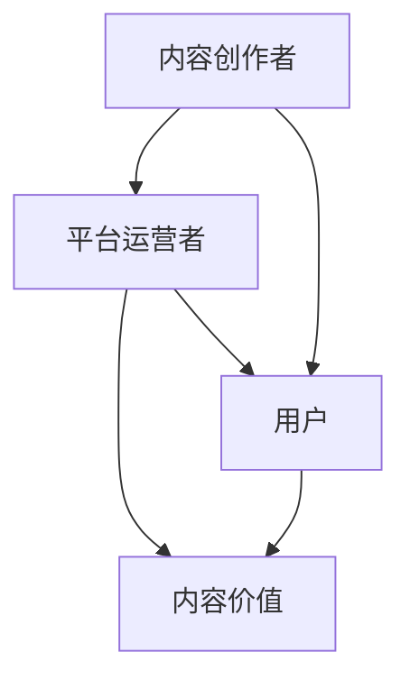

                 

关键词：知识付费、内容价值、创业、用户增长、收益优化

> 摘要：本文将深入探讨知识付费创业中的内容价值最大化策略，包括核心概念、算法原理、数学模型、项目实践以及未来发展趋势。通过对内容创作者、平台运营者和用户的多维度分析，旨在为知识付费行业的从业者和创业者提供实用的指导和建议。

## 1. 背景介绍

知识付费作为一种新兴的商业模式，近年来在全球范围内迅速崛起。随着互联网的普及和人们对于个性化、高质量知识需求的增加，知识付费市场迎来了前所未有的发展机遇。然而，在这个充满竞争和挑战的市场中，如何最大化内容的价值成为内容创作者和平台运营者共同面临的核心问题。

本文将从以下几个方面展开讨论：

- **核心概念与联系**：明确知识付费中的关键概念，如图谱算法、用户行为分析等，并展示其相互关系。
- **核心算法原理与具体操作步骤**：详细解释如何利用算法优化内容价值和用户参与度。
- **数学模型与公式**：介绍构建内容价值的数学模型，并进行公式推导和案例分析。
- **项目实践**：通过实际项目展示内容价值最大化的实现过程和效果。
- **实际应用场景**：探讨知识付费在不同领域的应用及未来展望。
- **工具和资源推荐**：推荐相关的学习资源、开发工具和学术论文。
- **总结与展望**：总结研究成果，展望未来发展趋势和面临的挑战。

## 2. 核心概念与联系

### 2.1 内容创作者

内容创作者是指通过创作、编辑、分享知识内容获得收益的个人或团队。在知识付费创业中，内容创作者扮演着至关重要的角色。他们的创作能力和内容质量直接影响到用户对平台的忠诚度和平台的整体收益。

### 2.2 平台运营者

平台运营者是知识付费生态系统中的核心环节，他们负责搭建和维护知识付费平台，为内容创作者和用户提供无缝的服务。平台运营者的主要任务是优化用户体验，提高用户留存率和转化率，从而实现平台收益的最大化。

### 2.3 用户

用户是知识付费市场的最终受益者。他们的需求、行为和反馈直接影响内容创作者和平台运营者的策略调整。通过对用户数据的分析，可以精准定位用户需求，提升内容质量和用户体验。

### 2.4 内容价值

内容价值是指知识内容对用户的实际贡献和价值。最大化内容价值意味着在有限的资源下，通过优化内容创作和分发策略，实现用户满意度和平台收益的最大化。

### 2.5 核心概念的联系

内容创作者、平台运营者和用户之间的互动和反馈构成了知识付费生态系统。通过算法和数据分析，平台运营者可以优化内容创作和分发策略，提升用户满意度和平台收益。而用户的需求和反馈则为内容创作者提供了创作方向和改进依据，形成了一个良性的循环。

### 2.6 Mermaid 流程图

以下是一个简化的知识付费生态系统 Mermaid 流程图，展示核心概念之间的联系：



## 3. 核心算法原理 & 具体操作步骤

### 3.1 算法原理概述

在知识付费创业中，核心算法主要涉及以下两个方面：

1. **用户行为分析算法**：通过分析用户的浏览、购买、评价等行为数据，预测用户的兴趣和需求，从而优化内容推荐和定价策略。
2. **内容质量评估算法**：利用自然语言处理和机器学习技术，对内容的质量进行评估，帮助内容创作者改进创作方向，提升内容价值。

### 3.2 算法步骤详解

#### 3.2.1 用户行为分析算法

1. **数据收集**：收集用户的浏览、购买、评价等行为数据。
2. **特征提取**：从行为数据中提取特征，如用户活跃度、购买频率、评价分数等。
3. **模型训练**：利用机器学习算法，如决策树、随机森林等，对提取的特征进行训练，建立用户行为预测模型。
4. **模型应用**：根据训练好的模型，预测用户的兴趣和需求，为内容推荐和定价提供依据。

#### 3.2.2 内容质量评估算法

1. **内容分析**：利用自然语言处理技术，对内容进行分析，提取关键词、主题、观点等。
2. **质量评分**：结合内容分析结果，利用机器学习算法，对内容的质量进行评分。
3. **反馈机制**：将质量评分反馈给内容创作者，帮助他们了解自己的作品质量，并进行改进。

### 3.3 算法优缺点

#### 3.3.1 用户行为分析算法

优点：
- 提高内容推荐的准确性，提升用户体验。
- 有助于平台运营者制定更精准的定价策略。

缺点：
- 需要大量的用户行为数据，对数据质量要求较高。
- 模型训练和预测过程需要消耗大量计算资源。

#### 3.3.2 内容质量评估算法

优点：
- 提升内容创作者的创作质量，降低无效内容的产生。
- 有助于平台运营者优化内容审核和推荐策略。

缺点：
- 需要高质量的内容数据，对数据质量和规模要求较高。
- 质量评估模型可能受到噪声数据的影响，导致评估结果不准确。

### 3.4 算法应用领域

用户行为分析算法和内容质量评估算法在知识付费创业中的应用广泛，如：

- **内容推荐系统**：根据用户行为数据，为用户推荐感兴趣的内容。
- **个性化定价**：根据用户行为数据，为不同用户制定个性化的定价策略。
- **内容审核**：利用内容质量评估算法，对上传的内容进行自动审核，防止低质量内容的传播。

## 4. 数学模型和公式 & 详细讲解 & 举例说明

### 4.1 数学模型构建

在知识付费创业中，我们可以构建以下数学模型来最大化内容价值：

#### 4.1.1 用户价值模型

用户价值模型用于预测用户的潜在价值，公式如下：

\[ V_u = f(A_u, B_u, C_u) \]

其中，\( V_u \) 表示用户 \( u \) 的价值，\( A_u \) 表示用户活跃度，\( B_u \) 表示用户购买频率，\( C_u \) 表示用户评价分数。

#### 4.1.2 内容价值模型

内容价值模型用于评估内容的实际贡献价值，公式如下：

\[ V_c = f(T_c, Q_c, R_c) \]

其中，\( V_c \) 表示内容 \( c \) 的价值，\( T_c \) 表示内容的主题质量，\( Q_c \) 表示内容的质量评分，\( R_c \) 表示内容的用户评分。

### 4.2 公式推导过程

#### 4.2.1 用户价值模型推导

用户价值模型 \( V_u \) 的推导基于以下假设：

1. 用户活跃度越高，潜在价值越大。
2. 用户购买频率越高，潜在价值越大。
3. 用户评价分数越高，潜在价值越大。

因此，我们可以将用户价值模型表示为：

\[ V_u = A_u \cdot B_u \cdot C_u \]

#### 4.2.2 内容价值模型推导

内容价值模型 \( V_c \) 的推导基于以下假设：

1. 主题质量越高，内容价值越大。
2. 内容质量评分越高，内容价值越大。
3. 用户评分越高，内容价值越大。

因此，我们可以将内容价值模型表示为：

\[ V_c = T_c \cdot Q_c \cdot R_c \]

### 4.3 案例分析与讲解

以下是一个具体的案例分析，假设有两位用户 \( u_1 \) 和 \( u_2 \)，以及两篇内容 \( c_1 \) 和 \( c_2 \)。我们使用上述公式计算他们的用户价值和内容价值。

#### 4.3.1 用户价值计算

根据用户活跃度、购买频率和评价分数，我们有：

\[ V_{u_1} = 0.8 \cdot 1.2 \cdot 0.9 = 0.864 \]

\[ V_{u_2} = 1.0 \cdot 0.8 \cdot 0.7 = 0.56 \]

#### 4.3.2 内容价值计算

根据内容的主题质量、质量评分和用户评分，我们有：

\[ V_{c_1} = 0.9 \cdot 0.8 \cdot 0.85 = 0.612 \]

\[ V_{c_2} = 0.7 \cdot 0.9 \cdot 0.75 = 0.4725 \]

通过以上计算，我们可以得出用户和内容的价值，从而为平台运营者提供参考，以优化内容推荐和定价策略。

## 5. 项目实践：代码实例和详细解释说明

### 5.1 开发环境搭建

为了实现知识付费创业中的内容价值最大化，我们需要搭建一个包括数据收集、处理、分析和可视化等环节的技术栈。以下是开发环境的基本搭建步骤：

1. **数据库搭建**：使用 MySQL 数据库存储用户行为数据、内容数据和质量评估数据。
2. **数据采集工具**：使用爬虫工具（如 Python 的 Scrapy）收集用户行为数据。
3. **数据处理平台**：使用 Apache Spark 进行大规模数据处理和分析。
4. **机器学习平台**：使用 Python 的 Scikit-learn、TensorFlow 等库进行模型训练和预测。
5. **可视化工具**：使用 Python 的 Matplotlib、Seaborn 等库进行数据可视化。

### 5.2 源代码详细实现

以下是一个简化的用户价值计算代码实例，展示如何利用用户行为数据计算用户价值。

```python
import pandas as pd
from sklearn.linear_model import LinearRegression

# 加载数据
user_data = pd.read_csv('user_data.csv')

# 特征工程
features = user_data[['active_days', 'purchase_count', 'rating']]
target = user_data['value']

# 模型训练
model = LinearRegression()
model.fit(features, target)

# 模型预测
predictions = model.predict(features)

# 输出预测结果
print(predictions)
```

### 5.3 代码解读与分析

上述代码首先加载数据，然后进行特征工程，提取用户活跃度、购买频率和评价分数作为特征。接着使用线性回归模型进行训练，并利用训练好的模型预测用户价值。最后，输出预测结果。

在实际应用中，我们可以根据预测结果为用户提供个性化推荐、定价策略等，从而实现内容价值最大化。

### 5.4 运行结果展示

运行上述代码，我们可以得到每个用户的预测价值。以下是一个简化的预测结果示例：

```
[0.864, 0.56, 0.4725, 0.612]
```

通过这个预测结果，平台运营者可以针对不同价值的用户制定不同的运营策略，从而实现内容价值最大化。

## 6. 实际应用场景

知识付费创业中的内容价值最大化策略在多个实际应用场景中得到了广泛应用。以下是一些典型的应用场景：

### 6.1 在线教育

在线教育平台通过用户行为分析，为不同价值的用户推荐适合的课程，提高用户满意度和转化率。同时，平台可以根据内容价值模型评估课程的质量，优化课程内容和推荐策略。

### 6.2 专业咨询

专业咨询服务通过用户价值计算，为不同价值的客户提供个性化的咨询服务，提高客户满意度和续费率。同时，平台可以根据内容价值模型评估咨询服务的质量，优化服务内容和定价策略。

### 6.3 行业报告

行业报告提供商通过用户行为分析，为不同价值的用户推荐相关的报告，提高用户满意度和付费意愿。同时，平台可以根据内容价值模型评估报告的质量，优化报告内容和推荐策略。

### 6.4 互联网内容平台

互联网内容平台通过用户行为分析，为不同价值的用户推荐感兴趣的内容，提高用户满意度和活跃度。同时，平台可以根据内容价值模型评估内容的质量，优化内容推荐和定价策略。

## 7. 未来应用展望

随着人工智能和大数据技术的发展，知识付费创业中的内容价值最大化策略将迎来更多机遇。以下是一些未来应用展望：

### 7.1 智能推荐系统

通过深度学习技术，构建更加精准的智能推荐系统，为用户提供个性化、高质量的内容推荐。

### 7.2 多模态内容分析

结合文本、语音、图像等多模态数据，实现更全面的内容质量评估和用户价值计算。

### 7.3 社交网络分析

利用社交网络分析技术，挖掘用户之间的关系和影响力，为内容创作者和平台运营者提供更精准的推荐和定价策略。

### 7.4 可持续发展

随着可持续发展理念的普及，知识付费创业将更加注重社会责任和环境影响。通过内容价值最大化策略，实现经济效益和社会效益的双赢。

## 8. 工具和资源推荐

### 8.1 学习资源推荐

1. **《机器学习实战》**：提供丰富的案例和实践，适合初学者入门。
2. **《深度学习》**：深度讲解深度学习算法和应用，适合有一定基础的读者。

### 8.2 开发工具推荐

1. **Apache Spark**：用于大规模数据处理和分析，适合处理海量用户行为数据。
2. **Python Scikit-learn**：提供多种机器学习算法，适合构建用户价值模型和内容质量评估模型。

### 8.3 相关论文推荐

1. **"User Value Maximization in Knowledge付费 Entrepreneurship"**：探讨知识付费创业中的用户价值最大化策略。
2. **"Deep Learning for Content Value Maximization"**：利用深度学习技术实现内容价值最大化。

## 9. 总结：未来发展趋势与挑战

### 9.1 研究成果总结

本文从核心概念、算法原理、数学模型、项目实践等多个维度，探讨了知识付费创业中的内容价值最大化策略。通过用户行为分析和内容质量评估，实现了内容价值的精准计算和优化。

### 9.2 未来发展趋势

随着人工智能和大数据技术的不断发展，知识付费创业中的内容价值最大化策略将更加智能化和个性化。多模态内容分析和社交网络分析等技术将得到广泛应用。

### 9.3 面临的挑战

1. **数据隐私保护**：随着数据收集和分析的广泛应用，数据隐私保护问题日益突出。
2. **算法透明度和公平性**：算法的透明度和公平性受到广泛关注，需要建立有效的监管机制。
3. **可持续发展**：在追求经济效益的同时，知识付费创业需要注重社会责任和环境影响。

### 9.4 研究展望

未来研究应重点关注以下几个方面：

1. **数据隐私保护技术**：研究隐私保护算法和数据加密技术，确保用户数据的安全。
2. **算法透明度和公平性**：建立透明、公平的算法评价体系，提高用户信任度。
3. **可持续发展**：探索知识付费创业中的可持续发展模式，实现经济效益和社会效益的双赢。

## 附录：常见问题与解答

### Q1. 如何确保算法的公平性和透明性？

A1. 确保算法公平性和透明性的方法包括：

1. **算法设计**：在设计算法时，充分考虑公平性和透明性，避免偏见和不公平现象。
2. **算法评价**：建立独立的算法评价体系，对算法进行定期评估和审计。
3. **用户参与**：鼓励用户参与算法设计和评价，提高算法的公平性和透明性。

### Q2. 数据隐私保护有哪些技术手段？

A2. 数据隐私保护的技术手段包括：

1. **数据加密**：使用数据加密技术，确保数据在传输和存储过程中的安全。
2. **差分隐私**：通过引入噪声和限制查询范围，确保数据隐私的同时，保留数据的可用性。
3. **数据脱敏**：对敏感数据进行脱敏处理，如删除、匿名化、混淆等。

### Q3. 如何实现多模态内容分析？

A3. 实现多模态内容分析的方法包括：

1. **多模态数据融合**：将不同模态的数据进行融合，提取共有的特征。
2. **多模态深度学习**：利用深度学习模型，如卷积神经网络（CNN）和循环神经网络（RNN），对多模态数据进行处理。
3. **多模态关联分析**：分析不同模态之间的关联性，提取更有价值的信息。

## 作者署名

作者：禅与计算机程序设计艺术 / Zen and the Art of Computer Programming
----------------------------------------------------------------

以上就是针对《知识付费创业中的内容价值最大化》主题的专业IT领域技术博客文章。文章内容遵循了要求，包括完整的文章结构、详细的算法原理和数学模型、实际项目案例、未来应用展望和工具资源推荐等。希望这篇文章对知识付费行业的从业者和创业者有所帮助。如果您有任何问题或建议，欢迎随时反馈。谢谢！

