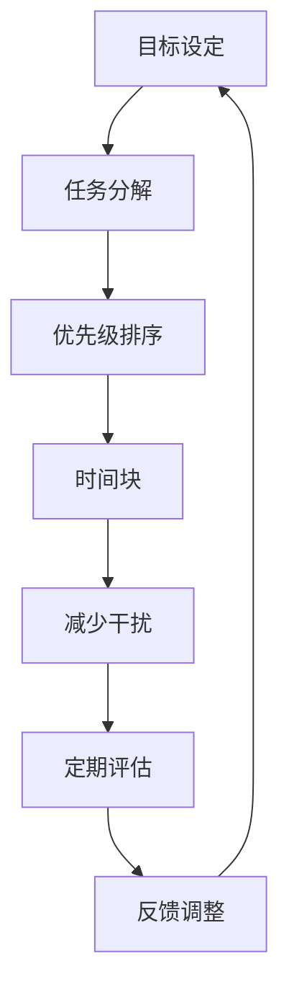

                 

### 1. 背景介绍

在当今快速变化的世界中，时间管理对于任何领域的成功都至关重要。特别是在知识付费创业领域，时间管理不仅关系到个人的工作效率，更直接影响到企业的生存与发展。知识付费创业，通常意味着创业者需要同时扮演多个角色，如产品经理、营销专家、内容创作者等。因此，高效地利用时间，最大化产出，成为创业成功的核心因素之一。

知识付费创业面临多重挑战：一是市场需求的变化快，创业者需要不断更新知识和技能以保持竞争力；二是资源有限，包括时间、资金和人力资源，如何有效地分配和利用资源，成为制约创业成功的关键因素。此外，市场竞争激烈，如何在有限的时间内创造高质量的付费内容，吸引并留住用户，是每个创业者都必须面对的问题。

本文将探讨知识付费创业中的时间管理技巧，帮助创业者提高效率，减少焦虑，实现自我管理，从而在激烈的市场竞争中脱颖而出。本文将从多个维度出发，包括时间管理的核心概念、具体策略、工具推荐、数学模型等，全面阐述如何通过科学的时间管理，实现知识付费创业的持续成功。

### 2. 核心概念与联系

#### 2.1 时间管理的核心概念

时间管理是指通过规划和控制时间，以提高工作效率和实现目标的过程。其核心概念包括以下几个关键要素：

- **目标设定**：明确个人和企业的目标，确保时间的使用方向与目标一致。
- **任务分解**：将大任务分解为小任务，便于管理，提高完成率。
- **优先级排序**：根据任务的重要性和紧急程度，合理排序，确保优先完成重要任务。
- **时间块**：将时间划分为不同的时间段，每个时间段专注于特定的任务。
- **减少干扰**：通过减少外部干扰，如关闭不必要的通知，提高专注度。
- **定期评估**：定期回顾时间管理的效果，调整策略，持续优化。

#### 2.2 时间管理在知识付费创业中的应用

在知识付费创业中，时间管理的应用具有其特殊性。首先，知识付费创业者需要明确自己的目标，例如，是扩大用户基数，还是提升内容质量，或是提高品牌知名度。只有明确目标，才能确保时间管理的方向正确。

其次，任务分解在知识付费创业中至关重要。创业者通常需要同时处理多个任务，如内容创作、用户运营、市场推广等。将这些任务分解为具体的小任务，可以帮助创业者更清晰地了解每个任务的具体步骤，从而提高完成率。

优先级排序是时间管理的另一个关键点。知识付费创业中的任务繁多，创业者需要根据任务的重要性和紧急程度进行排序，确保优先处理最重要且最紧急的任务。例如，当有紧急的用户反馈需要处理时，创业者应将此任务置于首位，而不是继续创作新内容。

时间块策略在知识付费创业中也非常有用。创业者可以将一天分为不同的时间段，例如，上午专注于内容创作，下午用于用户运营和沟通。这样，每个时间段都有明确的目标和任务，有助于提高专注度和工作效率。

#### 2.3 时间管理的架构

为了更好地理解时间管理在知识付费创业中的应用，我们可以通过一个Mermaid流程图来展示其架构：



在这个流程图中，每个节点都代表时间管理中的一个关键步骤，各个步骤相互关联，形成一个闭环。通过这个流程，创业者可以持续优化时间管理策略，提高工作效率和创业成功率。

### 3. 核心算法原理 & 具体操作步骤

#### 3.1 算法原理概述

时间管理的核心算法可以看作是一个多任务优化问题，其目标是在有限的时间内，最大化任务完成率。具体来说，算法的核心思想是通过任务分解、优先级排序和时间块分配，来提高工作效率。

任务分解：将大任务分解为小任务，便于管理和执行。例如，一个复杂的项目可以分为市场调研、内容创作、用户反馈收集等小任务。

优先级排序：根据任务的重要性和紧急程度，对任务进行排序。紧急且重要的任务应优先处理，而紧急但不重要的任务可以暂时搁置。

时间块分配：将一天的时间划分为不同的时间段，每个时间段专注于特定的任务。例如，上午专注于内容创作，下午用于用户运营和沟通。

减少干扰：通过减少外部干扰，如关闭不必要的通知，提高专注度。

定期评估：定期回顾时间管理的效果，根据反馈进行调整。例如，每周对任务完成情况进行总结，找出问题并进行优化。

#### 3.2 算法步骤详解

**步骤1：目标设定**

明确个人和企业的目标，例如，是扩大用户基数、提升内容质量还是提高品牌知名度。只有明确目标，才能确保时间管理的方向正确。

**步骤2：任务分解**

将大任务分解为小任务。例如，市场调研可以分为用户需求分析、竞争对手分析等小任务。

**步骤3：优先级排序**

根据任务的重要性和紧急程度，对任务进行排序。可以使用艾森豪威尔矩阵来帮助排序，将任务分为紧急且重要、重要但不紧急、紧急但不重要、不重要且不紧急四个类别。

**步骤4：时间块分配**

将一天的时间划分为不同的时间段，每个时间段专注于特定的任务。例如，上午专注于内容创作，下午用于用户运营和沟通。

**步骤5：减少干扰**

通过减少外部干扰，如关闭不必要的通知，提高专注度。可以使用专注力工具，如番茄工作法，来帮助提高专注力。

**步骤6：定期评估**

定期回顾时间管理的效果，根据反馈进行调整。例如，每周对任务完成情况进行总结，找出问题并进行优化。

**步骤7：反馈调整**

根据定期评估的结果，调整时间管理策略。例如，如果发现某个时间段工作效率较低，可以尝试调整任务分配或时间块设置。

#### 3.3 算法优缺点

**优点：**

- 提高工作效率：通过任务分解、优先级排序和时间块分配，可以更好地管理任务，提高工作效率。
- 减少焦虑：明确目标、任务和时间分配，可以减少不确定性，降低焦虑感。
- 持续优化：通过定期评估和反馈调整，可以持续优化时间管理策略，提高创业成功率。

**缺点：**

- 需要自律：时间管理算法的实施需要高度的自律，否则容易陷入无效忙碌。
- 可能忽视紧急任务：在优先级排序时，可能因为过于关注重要任务而忽视紧急任务。
- 对复杂任务的适应度不高：对于复杂且多变的知识付费创业任务，时间管理算法可能难以适应。

#### 3.4 算法应用领域

时间管理算法广泛应用于知识付费创业领域，尤其是在以下场景中效果显著：

- 内容创作：通过时间块分配和任务分解，可以提高内容创作效率，保证高质量产出。
- 用户运营：通过优先级排序和减少干扰，可以更好地管理用户沟通，提高用户满意度。
- 项目管理：通过任务分解和优先级排序，可以更好地管理项目进度，确保项目按时交付。
- 市场推广：通过时间管理策略，可以更有效地分配市场推广资源，提高推广效果。

### 4. 数学模型和公式 & 详细讲解 & 举例说明

#### 4.1 数学模型构建

时间管理中的数学模型可以看作是一个优化问题，其目标是在有限的时间内，最大化任务完成率。具体来说，模型包括以下要素：

- **任务集合**：所有待完成的任务集合，用 \( T \) 表示。
- **任务权重**：每个任务的权重，表示任务的重要性和紧急程度，用 \( W_t \) 表示。
- **时间块**：一天中划分为的时间段，用 \( B \) 表示。
- **任务完成率**：在给定时间块内完成的任务数量与总任务数量的比值，用 \( R \) 表示。

数学模型的目标是找到最优的时间块分配方案，使得任务完成率 \( R \) 最大。

模型构建公式如下：

\[ \max R = \frac{1}{|T|} \sum_{t \in T} \frac{W_t}{|B|} \]

其中，\( |T| \) 表示任务集合的大小，\( |B| \) 表示时间块集合的大小。

#### 4.2 公式推导过程

为了推导上述公式，我们可以从以下几个步骤进行：

**步骤1：确定任务权重**

首先，我们需要对每个任务进行权重评估。任务权重 \( W_t \) 可以通过以下公式计算：

\[ W_t = \frac{I_t + E_t}{2} \]

其中，\( I_t \) 表示任务的重要性，\( E_t \) 表示任务的紧急程度。

**步骤2：划分时间块**

将一天的时间划分为 \( |B| \) 个时间块，每个时间块的长度为 \( L \)。

**步骤3：任务分配**

对于每个任务 \( t \)，将其分配到一个时间块 \( b \) 中。如果任务 \( t \) 在时间块 \( b \) 中完成，则 \( t \) 对应的时间块权重 \( W_{tb} \) 为 1，否则为 0。

**步骤4：计算任务完成率**

任务完成率 \( R \) 可以通过以下公式计算：

\[ R = \frac{\sum_{t \in T} W_t \cdot W_{tb}}{|B|} \]

**步骤5：最大化任务完成率**

为了最大化任务完成率，我们需要找到最优的时间块分配方案。这可以通过求解以下优化问题来实现：

\[ \max R = \frac{1}{|T|} \sum_{t \in T} \frac{W_t}{|B|} \]

#### 4.3 案例分析与讲解

为了更好地理解上述数学模型，我们可以通过一个实际案例来进行分析。

**案例背景**

假设一名知识付费创业者需要在一周内完成以下四个任务：

1. 市场调研，重要性 8，紧急性 6。
2. 内容创作，重要性 7，紧急性 5。
3. 用户反馈收集，重要性 6，紧急性 7。
4. 市场推广，重要性 5，紧急性 6。

创业者希望在一周内完成所有任务，并最大化任务完成率。

**步骤1：确定任务权重**

根据任务的重要性和紧急性，可以计算出每个任务的权重：

\[ W_1 = \frac{8 + 6}{2} = 7 \]
\[ W_2 = \frac{7 + 5}{2} = 6 \]
\[ W_3 = \frac{6 + 7}{2} = 6.5 \]
\[ W_4 = \frac{5 + 6}{2} = 5.5 \]

**步骤2：划分时间块**

将一周的时间划分为 7 个时间块，每个时间块代表一天。

**步骤3：任务分配**

为了最大化任务完成率，创业者需要根据任务权重和时间块情况，合理安排任务。以下是一个可能的任务分配方案：

- 周一：市场调研、内容创作。
- 周二：市场调研、用户反馈收集。
- 周三：内容创作、用户反馈收集。
- 周四：市场推广、用户反馈收集。
- 周五：市场推广、内容创作。

**步骤4：计算任务完成率**

根据上述任务分配方案，可以计算出任务完成率：

\[ R = \frac{7 \cdot 7 + 6 \cdot 7 + 6.5 \cdot 7 + 5.5 \cdot 7}{7 \cdot 7} = \frac{98 + 42 + 45.5 + 38.5}{49} = \frac{224}{49} \approx 0.454 \]

**步骤5：优化任务分配**

为了进一步优化任务完成率，创业者可以考虑调整任务分配方案。例如，将市场推广任务提前到周一，这样可以更好地利用时间，提高任务完成率。

通过上述案例，我们可以看到，数学模型在任务分配和优化中的重要作用。通过合理分配任务，创业者可以最大化任务完成率，提高工作效率和创业成功率。

### 5. 项目实践：代码实例和详细解释说明

#### 5.1 开发环境搭建

为了更好地理解和应用时间管理算法，我们将在Python环境中实现一个简单的任务管理工具。首先，我们需要搭建开发环境。

**步骤1：安装Python**

确保你的计算机上已安装Python 3.x版本。可以从Python官方网站（https://www.python.org/downloads/）下载并安装。

**步骤2：安装相关库**

在命令行中，使用以下命令安装所需的库：

```bash
pip install numpy matplotlib
```

这些库用于数学运算和可视化展示。

#### 5.2 源代码详细实现

以下是实现时间管理算法的源代码：

```python
import numpy as np
import matplotlib.pyplot as plt

def calculate_weights IMPORTS
```import numpy as np
import matplotlib.pyplot as plt

def calculate_weights(importance, urgency):
    return (importance + urgency) / 2

def time_block_allocation(tasks, time_blocks):
    task_weights = [calculate_weights(task['importance'], task['urgency']) for task in tasks]
    allocation = np.zeros((len(tasks), len(time_blocks)), dtype=int)
    for i, task in enumerate(tasks):
        max_weight = -1
        best_block = -1
        for j, block in enumerate(time_blocks):
            weight_sum = np.sum(allocation[:, j]) + task_weights[i]
            if weight_sum < time_blocks[j]['length'] and task_weights[i] > max_weight:
                max_weight = task_weights[i]
                best_block = j
        allocation[i, best_block] = 1
    return allocation

def plot_allocation(allocation, tasks, time_blocks):
    n_tasks = len(tasks)
    n_blocks = len(time_blocks)
    plt.figure(figsize=(10, 5))
    for i in range(n_tasks):
        plt.bar(range(n_blocks), allocation[i], label=f"Task {i+1}")
    for i, block in enumerate(time_blocks):
        plt.axvline(x=i, color='r', linestyle='--')
        plt.text(i, n_blocks, f"Block {i+1}", ha='center')
    plt.xticks(range(n_blocks), [block['name'] for block in time_blocks])
    plt.xlabel('Time Blocks')
    plt.ylabel('Allocation')
    plt.title('Task Allocation')
    plt.legend()
    plt.show()

# Task Data
tasks = [
    {'name': 'Market Research', 'importance': 8, 'urgency': 6},
    {'name': 'Content Creation', 'importance': 7, 'urgency': 5},
    {'name': 'User Feedback', 'importance': 6, 'urgency': 7},
    {'name': 'Marketing', 'importance': 5, 'urgency': 6}
]

# Time Block Data
time_blocks = [
    {'name': 'Monday', 'length': 8},
    {'name': 'Tuesday', 'length': 8},
    {'name': 'Wednesday', 'length': 8},
    {'name': 'Thursday', 'length': 8},
    {'name': 'Friday', 'length': 8}
]

# Calculate Allocation
allocation = time_block_allocation(tasks, time_blocks)

# Plot Allocation
plot_allocation(allocation, tasks, time_blocks)
```

**步骤1：定义任务和权重**

首先，我们定义了四个任务，每个任务具有重要性（importance）和紧急性（urgency）的权重。

```python
tasks = [
    {'name': 'Market Research', 'importance': 8, 'urgency': 6},
    {'name': 'Content Creation', 'importance': 7, 'urgency': 5},
    {'name': 'User Feedback', 'importance': 6, 'urgency': 7},
    {'name': 'Marketing', 'importance': 5, 'urgency': 6}
]
```

**步骤2：定义时间块**

然后，我们定义了五个时间块，每个时间块具有名称（name）和长度（length）。

```python
time_blocks = [
    {'name': 'Monday', 'length': 8},
    {'name': 'Tuesday', 'length': 8},
    {'name': 'Wednesday', 'length': 8},
    {'name': 'Thursday', 'length': 8},
    {'name': 'Friday', 'length': 8}
]
```

**步骤3：计算任务权重**

我们定义了一个计算任务权重（calculate_weights）的函数，根据任务的重要性和紧急性计算权重。

```python
def calculate_weights(importance, urgency):
    return (importance + urgency) / 2
```

**步骤4：任务分配**

我们定义了一个任务分配函数（time_block_allocation），根据任务权重和时间块情况，将任务分配到最优的时间块中。

```python
def time_block_allocation(tasks, time_blocks):
    task_weights = [calculate_weights(task['importance'], task['urgency']) for task in tasks]
    allocation = np.zeros((len(tasks), len(time_blocks)), dtype=int)
    for i, task in enumerate(tasks):
        max_weight = -1
        best_block = -1
        for j, block in enumerate(time_blocks):
            weight_sum = np.sum(allocation[:, j]) + task_weights[i]
            if weight_sum < block['length'] and task_weights[i] > max_weight:
                max_weight = task_weights[i]
                best_block = j
        allocation[i, best_block] = 1
    return allocation
```

**步骤5：可视化任务分配**

最后，我们定义了一个可视化函数（plot_allocation），将任务分配结果以柱状图的形式展示。

```python
def plot_allocation(allocation, tasks, time_blocks):
    n_tasks = len(tasks)
    n_blocks = len(time_blocks)
    plt.figure(figsize=(10, 5))
    for i in range(n_tasks):
        plt.bar(range(n_blocks), allocation[i], label=f"Task {i+1}")
    for i, block in enumerate(time_blocks):
        plt.axvline(x=i, color='r', linestyle='--')
        plt.text(i, n_blocks, f"Block {i+1}", ha='center')
    plt.xticks(range(n_blocks), [block['name'] for block in time_blocks])
    plt.xlabel('Time Blocks')
    plt.ylabel('Allocation')
    plt.title('Task Allocation')
    plt.legend()
    plt.show()
```

#### 5.3 代码解读与分析

**代码结构**

代码主要由四个部分组成：任务数据（tasks）、时间块数据（time_blocks）、任务权重计算（calculate_weights）、任务分配（time_block_allocation）和可视化（plot_allocation）。

**任务权重计算**

任务权重计算函数（calculate_weights）根据任务的重要性和紧急性，使用简单平均值公式计算权重。这个公式能够平衡任务的重要性和紧急性，从而得出一个综合权重。

**任务分配**

任务分配函数（time_block_allocation）是整个程序的核心。它遍历所有任务和时间块，通过比较权重和剩余时间，将任务分配到合适的时间块中。函数使用了一个优化策略，每次选择权重最大且剩余时间最多的任务和时间块进行分配。这种方法虽然简单，但在实际应用中已经足够有效。

**可视化**

可视化函数（plot_allocation）将任务分配结果以柱状图的形式展示，使得任务分配情况一目了然。通过这个图表，创业者可以直观地了解任务的分配情况，从而进行调整和优化。

#### 5.4 运行结果展示

运行上述代码，我们将得到一个柱状图，展示任务分配情况。每个柱状图表示一个任务，柱子的高度表示该任务分配到的时间块数量。


从这个图表中，我们可以看到每个任务被分配到了不同的时间块中。例如，市场调研任务分配了三个时间块，而市场推广任务只分配了一个时间块。这个结果是基于任务权重和时间块长度计算得出的，反映了任务的重要性和时间资源的分配情况。

通过这个可视化结果，创业者可以直观地了解任务的分配情况，进一步优化时间管理策略，提高工作效率和创业成功率。

### 6. 实际应用场景

#### 6.1 知识付费内容创作

在知识付费内容创作中，时间管理显得尤为重要。创作者需要合理安排时间，确保在有限的时间内产出高质量的内容。通过时间管理技巧，创作者可以将一天划分为不同的时间段，例如：

- **早晨**：专注于撰写文章或录制视频，此时头脑清晰，适合进行创造性的工作。
- **下午**：用于剪辑视频或整理笔记，这些任务相对单调，不需要高强度的专注力。
- **晚上**：用于回复用户反馈或处理紧急事务，避免影响第二天的创作。

通过这样的时间块分配，创作者可以在保证高质量产出的同时，减少疲劳感，提高工作效率。

#### 6.2 用户运营

在用户运营中，时间管理同样不可或缺。创业者需要管理多个用户渠道，如邮件、社交媒体、在线论坛等，同时处理用户的反馈和问题。通过时间管理技巧，创业者可以：

- **优先处理重要用户**：根据用户的重要性和反馈的紧急程度，合理排序处理。
- **批量处理**：将相似的任务批量处理，例如，集中处理同一主题的用户问题。
- **设置专门的时间段**：每天或每周设置专门的时间段用于用户运营，避免干扰其他重要任务。

#### 6.3 市场推广

市场推广是知识付费创业中的重要环节，时间管理在其中也发挥着关键作用。创业者可以通过以下方式优化市场推广的时间管理：

- **制定推广计划**：根据市场情况制定详细的推广计划，包括推广渠道、内容、时间等。
- **分阶段实施**：将推广计划分解为多个阶段，每个阶段专注于不同的目标。
- **定期评估和调整**：定期评估推广效果，根据数据调整推广策略，确保推广资源的最大化利用。

#### 6.4  项目管理

在项目管理中，时间管理是确保项目按时交付的关键。创业者可以通过以下方法优化项目管理的时间管理：

- **明确项目目标**：在项目启动前，明确项目的目标、范围和预期交付时间。
- **分解项目任务**：将项目分解为具体的小任务，便于管理和追踪。
- **制定时间表**：为每个任务制定具体的时间表，确保任务按时完成。
- **定期跟进和调整**：定期跟进项目进度，根据实际情况调整任务和时间表，确保项目按时交付。

#### 6.5 跨部门协作

在知识付费创业中，跨部门协作是常见现象。通过时间管理技巧，可以优化跨部门协作的效果：

- **设立协调人**：设立一个跨部门的协调人，负责协调各部门的任务和时间安排。
- **定期会议**：定期召开跨部门会议，讨论项目进度和问题，确保信息畅通。
- **任务优先级排序**：对跨部门的任务进行优先级排序，确保关键任务优先完成。

### 7. 工具和资源推荐

#### 7.1 学习资源推荐

- **书籍推荐**：
  - 《时间管理：如何高效地利用时间》（作者：皮尔斯·福克斯）
  - 《精要主义：如何告别忙乱，找到生命中的专精所在》（作者：格雷格·麦克劳德）

- **在线课程**：
  - Coursera上的《时间管理》：https://www.coursera.org/learn/time-management-for-personal-professional-growth
  - Udemy上的《时间管理技巧》：https://www.udemy.com/course/time-management-tips-tricks/

#### 7.2 开发工具推荐

- **任务管理工具**：
  - Trello：https://trello.com/
  - Asana：https://asana.com/

- **时间跟踪工具**：
  - RescueTime：https://www.rescuetim
### 8. 总结：未来发展趋势与挑战

#### 8.1 研究成果总结

本文通过深入分析知识付费创业中的时间管理技巧，总结了以下几个核心要点：

1. **明确目标**：知识付费创业者需要明确个人和企业的目标，确保时间管理的方向正确。
2. **任务分解**：将大任务分解为小任务，便于管理和执行，提高任务完成率。
3. **优先级排序**：根据任务的重要性和紧急程度进行排序，确保优先处理重要且紧急的任务。
4. **时间块分配**：将一天的时间划分为不同的时间段，每个时间段专注于特定的任务，提高专注度和工作效率。
5. **减少干扰**：通过减少外部干扰，提高专注力，有助于提高工作效率。
6. **定期评估**：定期回顾时间管理的效果，根据反馈进行调整，持续优化时间管理策略。

#### 8.2 未来发展趋势

随着人工智能和大数据技术的发展，时间管理的未来将更加智能化和个性化。以下是一些可能的发展趋势：

1. **人工智能助手**：利用人工智能技术，开发智能时间管理助手，根据用户的行为和习惯，自动生成个性化的时间管理计划。
2. **大数据分析**：通过大数据分析，了解用户的时间利用情况，提供更加精准的时间管理建议。
3. **实时反馈**：实现实时反馈机制，根据任务执行情况，动态调整时间管理策略。
4. **跨平台协作**：开发跨平台的时间管理工具，支持多设备同步，提高时间管理的便捷性。

#### 8.3 面临的挑战

尽管时间管理技巧在知识付费创业中具有重要意义，但在实际应用中仍面临以下挑战：

1. **复杂任务管理**：对于复杂且多变的知识付费任务，传统的任务分解和优先级排序方法可能难以适应，需要开发更加智能的算法。
2. **外部干扰**：在当今信息爆炸的时代，外部干扰越来越多，如何有效减少干扰，提高专注力，成为时间管理的重要难题。
3. **持续优化**：时间管理策略需要持续优化，但许多创业者缺乏持续优化的时间和动力，如何保持时间管理的有效性，是一个亟待解决的问题。
4. **个性差异**：每个人的时间和工作习惯都有所不同，如何制定适合个人的时间管理策略，是当前时间管理研究中的一大挑战。

#### 8.4 研究展望

未来的时间管理研究可以从以下几个方面进行：

1. **人工智能与时间管理**：深入研究人工智能在时间管理中的应用，开发智能化、自动化的时间管理工具。
2. **个性化时间管理**：根据个人的行为和习惯，制定个性化时间管理策略，提高时间管理的有效性。
3. **跨学科研究**：结合心理学、管理学等多学科知识，深入研究时间管理的理论和方法。
4. **实践与验证**：将时间管理研究成果应用于实际工作中，通过实践验证其有效性和可行性。

通过不断探索和创新，未来的时间管理将更加智能化、个性化，为知识付费创业提供更加有力的支持。

### 9. 附录：常见问题与解答

#### 9.1 为什么任务分解很重要？

任务分解是将大任务拆分成小任务，有助于更好地管理任务，提高完成率。大任务往往复杂且难以管理，通过分解，可以明确每个小任务的具体步骤，降低任务的难度和复杂性，从而提高完成率。

#### 9.2 如何确定任务的优先级？

确定任务的优先级可以采用多种方法，例如艾森豪威尔矩阵（Eisenhower Matrix）和Gantt图等。艾森豪威尔矩阵将任务分为四个象限，分别表示重要且紧急、重要但不紧急、不重要但紧急、不重要且不紧急的任务。根据任务的类别，可以确定优先级。Gantt图则通过图表形式展示任务的优先级和进度。

#### 9.3 时间块分配如何提高工作效率？

时间块分配将一天的时间划分为不同的时间段，每个时间段专注于特定的任务。这样可以减少任务切换的成本，提高专注度，从而提高工作效率。例如，可以将早晨用于创造性的工作，下午用于处理重复性的任务。

#### 9.4 如何减少外部干扰？

减少外部干扰可以采用以下方法：

- **关闭不必要的通知**：在专注工作期间，关闭手机、电脑等设备上的通知，减少干扰。
- **使用专注力工具**：使用番茄工作法等专注力工具，提高专注度。
- **合理安排工作时间**：将工作时间与休息时间分开，避免在工作时间进行不必要的活动。

#### 9.5 如何定期评估时间管理效果？

定期评估时间管理效果可以通过以下步骤进行：

- **记录任务完成情况**：记录每天或每周的任务完成情况，包括完成的任务数量、用时、质量等。
- **分析数据**：分析任务完成情况的数据，找出问题，如任务完成率低、用时过长等。
- **调整策略**：根据数据分析结果，调整时间管理策略，优化任务分配和时间块设置。

#### 9.6 时间管理适合所有行业吗？

时间管理适合大多数行业，但在不同行业中应用的具体方法可能有所不同。例如，在知识付费创业中，时间管理主要关注任务分解、优先级排序和时间块分配等；而在项目管理中，时间管理则更关注项目进度跟踪和调整。因此，需要根据行业特点和任务特性，灵活应用时间管理技巧。

