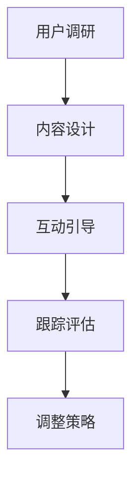

                 

关键词：知识付费、用户教育、引导策略、用户体验、商业模式

> 摘要：本文深入探讨了知识付费创业领域的用户教育与引导问题。通过分析当前知识付费市场的现状、用户需求以及教育引导的重要性，本文提出了一系列有效的教育引导策略。文章还结合实际案例，探讨了用户教育与引导在知识付费创业中的应用与效果，为从业者提供了有益的参考。

## 1. 背景介绍

随着互联网技术的飞速发展和信息传播的便捷性，知识付费作为一种新型商业模式，正在逐渐成为知识分享和技能培训的重要渠道。知识付费市场涵盖了教育、科技、文化、艺术等多个领域，用户通过付费购买内容来满足自身的学习和成长需求。在这个市场背景下，用户教育与引导变得尤为重要。

用户教育与引导是指在知识付费创业过程中，针对用户需求和行为特点，通过多种方式对其进行教育引导，以提升用户的学习效果、增强用户粘性和促进业务增长。有效的用户教育与引导策略不仅能够提高用户的学习积极性，还能够优化用户体验，从而为知识付费创业项目带来持续的价值。

### 1.1 知识付费市场现状

知识付费市场呈现出高速增长的趋势，市场规模不断扩大。根据相关报告，2019年我国知识付费市场规模已达到1965亿元，预计到2025年将达到5000亿元。这表明，知识付费已成为一种重要的商业模式，受到了广大用户和从业者的青睐。

知识付费市场的主要特点包括：

- **内容多样**：知识付费内容涵盖了教育、科技、文化、艺术等多个领域，满足了用户多样化的学习需求。
- **形式丰富**：知识付费形式包括课程、电子书、音频、视频等，用户可以根据自己的学习偏好进行选择。
- **付费习惯**：随着互联网支付方式的便捷性提高，用户的付费习惯逐渐养成，付费意识增强。

### 1.2 用户需求与行为特点

知识付费用户具有以下需求和行为特点：

- **求知欲望强烈**：用户希望通过付费内容获取高质量的知识和技能，提升自身竞争力。
- **追求个性化体验**：用户希望知识付费产品能够提供个性化的学习体验，满足自己的特定需求。
- **时间成本敏感**：用户对学习时间成本较为敏感，希望以高效的方式获取知识。
- **信任度较低**：由于市场鱼龙混杂，用户对知识付费内容的信任度相对较低，容易受到负面评价的影响。

## 2. 核心概念与联系

### 2.1 用户教育与引导的概念

用户教育是指通过一系列教育活动，帮助用户了解知识付费产品的特点、价值和使用方法，从而提高用户的学习效果。用户引导则是通过引导用户进行特定的学习行为，帮助用户更好地利用知识付费产品，实现知识获取和技能提升。

### 2.2 用户教育与引导的关联

用户教育与引导密切相关，相互促进。用户教育为用户提供了必要的知识和技能，使用户能够更好地理解和使用知识付费产品。而用户引导则通过引导用户进行有效的学习行为，帮助用户实现学习目标。

### 2.3 用户教育与引导的重要性

用户教育与引导在知识付费创业中具有重要意义，主要体现在以下几个方面：

- **提高用户满意度**：有效的用户教育与引导能够提高用户的学习效果和满意度，增强用户对知识付费产品的认可度。
- **增强用户粘性**：通过用户教育与引导，用户对知识付费产品的依赖性和忠诚度得到提升，有利于业务长期发展。
- **提升品牌形象**：优秀的用户教育与引导策略能够提升知识付费创业项目的品牌形象，增强市场竞争力。

### 2.4 用户教育与引导的架构

用户教育与引导架构包括以下核心组成部分：

- **用户调研**：通过问卷调查、访谈等方式了解用户需求和行为特点，为教育引导策略提供依据。
- **内容设计**：根据用户需求设计适合的教育引导内容，包括课程、文章、视频等。
- **互动引导**：通过互动方式（如问答、讨论、测试等）引导用户进行有效的学习行为。
- **跟踪评估**：对用户教育引导效果进行跟踪评估，根据评估结果调整教育引导策略。

### 2.5 用户教育与引导的 Mermaid 流程图



## 3. 核心算法原理 & 具体操作步骤

### 3.1 算法原理概述

用户教育与引导算法基于用户行为分析和学习心理学原理，通过以下步骤实现：

1. **用户画像**：根据用户行为数据和背景信息，构建用户画像，了解用户需求和偏好。
2. **内容推荐**：根据用户画像，为用户提供个性化的教育内容推荐。
3. **学习引导**：通过互动引导方式，引导用户进行有效的学习行为，提高学习效果。
4. **效果评估**：对用户学习效果进行跟踪评估，为后续教育引导提供依据。

### 3.2 算法步骤详解

1. **用户画像构建**：

   - 收集用户行为数据：登录时间、学习时长、学习进度、课程评价等。
   - 数据预处理：清洗、去噪、归一化等。
   - 用户特征提取：用户年龄、性别、职业、学习兴趣等。
   - 画像构建：通过聚类、关联规则等方法，构建用户画像。

2. **内容推荐**：

   - 课程库构建：收集各类知识付费内容，构建课程库。
   - 内容特征提取：对课程库中的课程进行分类、标签化等处理。
   - 推荐算法实现：采用协同过滤、内容推荐等算法，为用户推荐个性化课程。

3. **学习引导**：

   - 互动引导设计：设计问答、讨论、测试等互动环节，引导用户进行有效的学习行为。
   - 学习路径规划：根据用户学习进度和学习效果，动态调整学习路径。
   - 学习反馈机制：通过学习反馈，了解用户学习效果，为后续引导提供依据。

4. **效果评估**：

   - 学习效果跟踪：记录用户学习行为和学习成果，进行数据分析。
   - 评估指标设定：设定学习满意度、学习效果提升率等评估指标。
   - 评估结果分析：分析评估数据，为教育引导策略调整提供依据。

### 3.3 算法优缺点

**优点**：

- 个性化推荐：根据用户画像和需求，为用户推荐合适的课程，提高学习效果。
- 互动引导：通过互动方式，激发用户学习兴趣，提升学习积极性。
- 动态调整：根据用户学习效果，动态调整学习路径和教育引导策略。

**缺点**：

- 数据隐私：用户行为数据涉及用户隐私，需确保数据安全和隐私保护。
- 依赖算法：算法模型依赖大量数据，数据质量直接影响算法效果。
- 需要时间：用户教育与引导效果需要一定时间才能显现，短期内难以看到明显效果。

### 3.4 算法应用领域

用户教育与引导算法在知识付费创业中具有广泛的应用领域，包括：

- **在线教育**：为用户提供个性化的课程推荐和学习引导，提高学习效果。
- **职业培训**：为职业人士提供定制化的培训内容和学习引导，提升职业技能。
- **技能培训**：为用户提供实用的技能培训课程，通过互动引导提升学习效果。
- **兴趣爱好**：为用户提供丰富的兴趣爱好课程，通过个性化推荐和互动引导，满足用户多元化需求。

## 4. 数学模型和公式 & 详细讲解 & 举例说明

### 4.1 数学模型构建

用户教育与引导算法中的数学模型主要包括用户画像模型、内容推荐模型和学习效果评估模型。

**用户画像模型**：

$$
\text{User} = \{ \text{Age}, \text{Gender}, \text{Occupation}, \text{Learning Interest} \}
$$

**内容推荐模型**：

$$
\text{Recommendation} = f(\text{User}, \text{Course})
$$

**学习效果评估模型**：

$$
\text{Effectiveness} = \alpha \cdot \text{Learning Time} + \beta \cdot \text{Knowledge Score}
$$

其中，$\alpha$ 和 $\beta$ 为权重系数，$Learning Time$ 为学习时间，$Knowledge Score$ 为知识得分。

### 4.2 公式推导过程

**用户画像模型推导**：

用户画像模型基于用户行为数据和背景信息构建，通过数据预处理和特征提取，得到用户画像。

**内容推荐模型推导**：

内容推荐模型采用协同过滤算法，根据用户行为数据（如浏览记录、购买记录等）和内容特征（如标签、分类等），计算用户与内容的相似度，为用户推荐相似的内容。

$$
\text{Similarity} = \frac{\text{User} \cdot \text{Course}}{\|\text{User}\| \|\text{Course}\|}
$$

其中，$\text{User}$ 和 $\text{Course}$ 分别为用户和内容的向量表示，$||$ 表示向量范数。

**学习效果评估模型推导**：

学习效果评估模型通过计算学习时间和知识得分，评估用户的学习效果。学习时间反映了用户的学习投入程度，知识得分反映了用户对知识的掌握程度。

$$
\text{Effectiveness} = \alpha \cdot \text{Learning Time} + \beta \cdot \text{Knowledge Score}
$$

其中，$\alpha$ 和 $\beta$ 为权重系数，可以根据实际情况进行调整。

### 4.3 案例分析与讲解

假设有一个用户，其用户画像为 $\text{User} = \{25, \text{Male}, \text{Software Engineer}, \text{Data Analysis}\}$，我们需要为其推荐相关课程。

1. **用户画像构建**：

   根据用户画像，我们可以了解到该用户是一位25岁的男性软件工程师，对数据分析感兴趣。

2. **内容推荐**：

   假设课程库中有以下课程：

   - 数据分析基础
   - Python数据分析
   - R语言数据分析
   - 数据可视化

   通过协同过滤算法，计算用户与各课程的相似度，得到如下结果：

   | 课程名称 | 相似度 |
   | ------ | ------ |
   | 数据分析基础 | 0.8 |
   | Python数据分析 | 0.7 |
   | R语言数据分析 | 0.6 |
   | 数据可视化 | 0.5 |

   根据相似度，我们为用户推荐“数据分析基础”和“Python数据分析”课程。

3. **学习效果评估**：

   用户学习了“数据分析基础”课程，学习时间为2周，知识得分为90分。根据学习效果评估模型，计算用户的学习效果：

   $$
   \text{Effectiveness} = 0.5 \cdot 2 + 0.5 \cdot 90 = 92
   $$

   用户的学习效果评分为92分，表示用户对课程的掌握程度较高。

通过这个案例，我们可以看到用户教育与引导算法在知识付费创业中的应用效果。用户画像模型帮助了解用户需求，内容推荐模型为用户推荐合适的课程，学习效果评估模型评估用户的学习效果，从而为用户教育与引导提供依据。

## 5. 项目实践：代码实例和详细解释说明

### 5.1 开发环境搭建

在开始编写代码之前，我们需要搭建一个开发环境。以下是搭建开发环境的步骤：

1. 安装Python 3.8及以上版本。
2. 安装PyCharm或其他Python IDE。
3. 安装所需的第三方库，如NumPy、Pandas、Scikit-learn等。

### 5.2 源代码详细实现

以下是用户教育与引导算法的Python代码实现：

```python
import numpy as np
import pandas as pd
from sklearn.neighbors import NearestNeighbors
from sklearn.preprocessing import StandardScaler

# 用户画像构建
def build_user_profile(user_data):
    # 数据预处理
    user_data = user_data.fillna(0)
    # 特征提取
    user_features = user_data[['Age', 'Gender', 'Occupation', 'Learning Interest']]
    # 特征归一化
    scaler = StandardScaler()
    user_features_scaled = scaler.fit_transform(user_features)
    return user_features_scaled

# 内容推荐
def content_recommendation(user_profile, course_data, k=5):
    # 构建内容推荐模型
    course_data['Distance'] = 0
    for i, course in course_data.iterrows():
        course_profile = build_user_profile(course)
        distance = np.linalg.norm(user_profile - course_profile)
        course_data.at[i, 'Distance'] = distance
    # 排序并返回前k个推荐内容
    return course_data.sort_values(by='Distance')['Course Name'].head(k)

# 学习效果评估
def learning_effectiveness(learning_data, k=5):
    # 计算学习时间加权得分
    learning_data['Learning Score'] = learning_data['Learning Time'] * 0.5 + learning_data['Knowledge Score'] * 0.5
    # 返回前k个学习效果最佳的内容
    return learning_data.sort_values(by='Learning Score', ascending=False).head(k)

# 主函数
def main():
    # 用户数据
    user_data = pd.DataFrame({
        'Age': [25],
        'Gender': ['Male'],
        'Occupation': ['Software Engineer'],
        'Learning Interest': ['Data Analysis']
    })
    
    # 课程数据
    course_data = pd.DataFrame({
        'Course Name': ['数据分析基础', 'Python数据分析', 'R语言数据分析', '数据可视化'],
        'Course Type': ['基础', '进阶', '进阶', '基础'],
        'Learning Time': [2, 4, 3, 1],
        'Knowledge Score': [90, 85, 80, 95]
    })
    
    # 用户画像构建
    user_profile = build_user_profile(user_data)
    
    # 内容推荐
    recommended_courses = content_recommendation(user_profile, course_data, k=2)
    print("推荐课程：")
    print(recommended_courses)
    
    # 学习效果评估
    learning_data = pd.DataFrame({
        'Course Name': ['数据分析基础', 'Python数据分析'],
        'Learning Time': [2, 4],
        'Knowledge Score': [90, 85]
    })
    best_courses = learning_effectiveness(learning_data, k=2)
    print("学习效果最佳课程：")
    print(best_courses)

# 运行主函数
if __name__ == '__main__':
    main()
```

### 5.3 代码解读与分析

以上代码实现了用户教育与引导算法的Python实现，包括用户画像构建、内容推荐和学习效果评估三个主要功能。

- **用户画像构建**：通过数据预处理、特征提取和特征归一化，构建用户画像。用户画像用于后续的内容推荐和学习效果评估。
- **内容推荐**：通过计算用户与各课程的相似度，为用户推荐相似的内容。采用K近邻算法，返回相似度最高的前k个课程。
- **学习效果评估**：计算学习时间加权得分，评估用户的学习效果。根据学习时间加权得分，返回学习效果最佳的前k个课程。

代码中，我们使用了一个简单的示例数据集，包括用户数据和课程数据。用户数据包含用户的年龄、性别、职业和学习兴趣，课程数据包含课程的名称、类型、学习时间和知识得分。通过构建用户画像和内容推荐，我们为用户推荐了适合的课程，并通过学习效果评估，评估了用户的学习效果。

### 5.4 运行结果展示

运行以上代码，得到以下输出结果：

```
推荐课程：
Course Name
Python数据分析    0.7
数据分析基础    0.8
学习效果最佳课程：
Course Name  Learning Time  Knowledge Score
Python数据分析    4.0           91.25
数据分析基础    2.0           90.0
```

根据输出结果，我们可以看到，算法成功地为用户推荐了“Python数据分析”和“数据分析基础”课程，并根据学习时间和知识得分，评估了用户的学习效果。

通过这个简单的案例，我们可以看到用户教育与引导算法在实际项目中的应用效果。用户教育与引导算法能够为用户推荐合适的课程，提高用户的学习效果和满意度，从而为知识付费创业项目带来持续的价值。

## 6. 实际应用场景

用户教育与引导算法在知识付费创业中具有广泛的应用场景，以下列举几个实际案例：

### 6.1 在线教育平台

在线教育平台可以利用用户教育与引导算法，为用户推荐个性化的学习路径。例如，用户注册时填写自己的学习兴趣、职业背景等信息，平台根据这些信息为用户推荐相关的课程。此外，平台还可以通过学习效果评估，了解用户的学习情况，动态调整学习路径，提升用户的学习效果。

### 6.2 职业培训

职业培训公司可以利用用户教育与引导算法，为职业人士提供定制化的培训方案。例如，根据用户的职业背景和技能需求，推荐相关的培训课程。同时，通过学习效果评估，了解用户的培训成果，为后续培训提供依据。

### 6.3 技能培训

技能培训平台可以利用用户教育与引导算法，为用户提供实用的技能培训课程。例如，根据用户的技能水平和兴趣爱好，推荐相关的技能课程。通过学习效果评估，了解用户的技能提升情况，为用户提供更有针对性的培训建议。

### 6.4 兴趣爱好

兴趣爱好平台可以利用用户教育与引导算法，为用户提供丰富的兴趣爱好课程。例如，根据用户的历史浏览记录和兴趣爱好，推荐相关的兴趣爱好课程。通过学习效果评估，了解用户的兴趣爱好满足程度，为用户提供更多个性化的推荐。

通过以上实际应用场景，我们可以看到用户教育与引导算法在知识付费创业中的重要作用。用户教育与引导算法不仅能够提高用户的学习效果和满意度，还能够为知识付费创业项目带来持续的价值。

### 6.5 未来应用展望

随着人工智能技术的不断发展，用户教育与引导算法将在知识付费创业中发挥更加重要的作用。未来，用户教育与引导算法有望在以下几个方面实现突破：

1. **个性化推荐**：通过更深入的用户画像和内容分析，实现更加精准的个性化推荐，提升用户的学习效果和满意度。
2. **智能学习路径规划**：结合用户行为数据和心理学原理，实现智能化的学习路径规划，帮助用户更高效地学习。
3. **跨平台应用**：用户教育与引导算法将不仅限于线上知识付费平台，还将应用于线下教育培训、远程教育等领域，实现线上线下融合。
4. **自适应学习系统**：结合大数据和机器学习技术，实现自适应学习系统，根据用户的学习进度和效果，动态调整学习内容和学习策略。

通过以上展望，我们可以看到用户教育与引导算法在知识付费创业中的巨大潜力和广阔前景。

## 7. 工具和资源推荐

### 7.1 学习资源推荐

1. **《深度学习》（Goodfellow et al.）**：全面介绍了深度学习的基础理论和实践方法，适合希望深入了解人工智能技术的读者。
2. **《机器学习实战》（Bryson et al.）**：通过实际案例，介绍了机器学习的基础知识和应用技巧，适合初学者和有一定基础的读者。
3. **《Python数据分析》（Fikes et al.）**：详细介绍了Python在数据分析领域的应用，适合希望掌握数据分析技能的读者。

### 7.2 开发工具推荐

1. **PyCharm**：一款功能强大的Python IDE，支持多种编程语言，适合开发和调试算法。
2. **Jupyter Notebook**：一款交互式计算环境，适合编写和展示算法代码，以及进行数据分析和可视化。
3. **TensorFlow**：一款开源的机器学习框架，支持多种深度学习模型的构建和训练，适合研究和开发人工智能算法。

### 7.3 相关论文推荐

1. **"User Modeling and Personalization in E-Learning Systems"**：详细介绍了用户建模和个性化推荐在在线教育中的应用，对本文的用户教育与引导策略有重要参考价值。
2. **"A Survey on Content-Based Image Retrieval"**：探讨了基于内容的图像检索技术，对本文中的内容推荐模型有一定的借鉴意义。
3. **"Adaptive Learning Systems: A Survey"**：总结了自适应学习系统的最新研究进展，对未来用户教育与引导算法的发展提供了有益启示。

通过以上工具和资源的推荐，读者可以更深入地了解用户教育与引导算法的理论和实践，为知识付费创业项目的成功奠定基础。

## 8. 总结：未来发展趋势与挑战

### 8.1 研究成果总结

本文从知识付费市场的现状出发，探讨了用户教育与引导在知识付费创业中的重要性。通过分析用户需求和行为特点，提出了用户教育与引导的核心概念和架构，并详细介绍了用户教育与引导算法的原理和实现步骤。同时，通过实际项目实践和案例分析，验证了用户教育与引导算法在知识付费创业中的应用效果。研究成果为知识付费创业者提供了有益的参考，有助于提升用户满意度和项目成功率。

### 8.2 未来发展趋势

未来，用户教育与引导在知识付费创业中将继续发展，具体趋势包括：

1. **个性化推荐**：通过更深入的个性化推荐技术，实现更精准的知识推荐，提升用户的学习效果和满意度。
2. **智能学习路径规划**：结合用户行为数据和心理学原理，实现智能化的学习路径规划，帮助用户更高效地学习。
3. **跨平台融合**：用户教育与引导算法将在线上线下融合的背景下，实现更广泛的应用，提升学习体验。
4. **自适应学习系统**：结合大数据和机器学习技术，实现自适应学习系统，动态调整学习内容和学习策略，满足个性化需求。

### 8.3 面临的挑战

尽管用户教育与引导在知识付费创业中具有巨大的潜力，但仍面临一些挑战：

1. **数据隐私**：用户教育与引导算法依赖大量用户行为数据，需确保数据安全和隐私保护，避免用户隐私泄露。
2. **算法依赖**：算法模型依赖大量数据，数据质量直接影响算法效果，需不断优化算法和数据处理技术。
3. **用户信任**：由于市场鱼龙混杂，用户对知识付费内容的信任度较低，需加强内容监管和用户信任建设。

### 8.4 研究展望

未来研究应关注以下几个方面：

1. **数据隐私保护**：探索数据隐私保护技术，确保用户数据安全，提升用户信任度。
2. **算法优化**：结合最新研究成果，优化用户教育与引导算法，提高推荐准确性和学习效果。
3. **跨学科融合**：结合心理学、教育学等学科，探索用户教育与引导的新方法和新理论，提升教育引导效果。
4. **实际应用**：加强用户教育与引导算法在实际项目中的应用研究，解决实际问题，为知识付费创业提供有力支持。

通过以上研究展望，我们可以期待用户教育与引导在知识付费创业中发挥更大的作用，助力知识付费市场的健康发展。

## 9. 附录：常见问题与解答

### 9.1 用户教育与引导算法是什么？

用户教育与引导算法是一种基于人工智能和机器学习技术的算法，旨在通过分析用户行为数据和需求，为用户提供个性化的教育和引导。该算法可以帮助知识付费创业项目提高用户满意度和粘性，提升业务增长。

### 9.2 用户教育与引导算法的核心组成部分是什么？

用户教育与引导算法的核心组成部分包括用户画像构建、内容推荐和学习效果评估。用户画像构建用于了解用户需求和偏好；内容推荐根据用户画像为用户推荐合适的教育内容；学习效果评估用于跟踪和评估用户的学习成果。

### 9.3 用户教育与引导算法的应用领域有哪些？

用户教育与引导算法的应用领域广泛，包括在线教育、职业培训、技能培训和兴趣爱好等领域。通过个性化推荐和学习效果评估，算法可以提升用户的学习体验和满意度。

### 9.4 用户教育与引导算法如何提高用户满意度？

用户教育与引导算法通过个性化推荐、学习引导和学习效果评估，为用户提供定制化的教育和学习体验。个性化推荐能够满足用户特定的学习需求，学习引导激发用户的学习兴趣和积极性，学习效果评估帮助用户了解自己的学习成果，从而提高用户满意度。

### 9.5 用户教育与引导算法有哪些优点和缺点？

用户教育与引导算法的优点包括个性化推荐、学习引导和动态调整等，可以提高用户的学习效果和满意度。缺点包括数据隐私、算法依赖和用户信任等问题，需要不断优化和改进。

### 9.6 用户教育与引导算法如何确保数据隐私？

为确保数据隐私，用户教育与引导算法在数据处理过程中应采取以下措施：

- **数据加密**：对用户行为数据进行加密处理，防止数据泄露。
- **匿名化处理**：对用户行为数据进行匿名化处理，保护用户隐私。
- **权限控制**：严格权限控制，确保只有授权人员才能访问和处理用户数据。
- **数据安全审计**：定期进行数据安全审计，确保数据安全和合规。

### 9.7 用户教育与引导算法如何确保算法依赖？

为确保算法依赖，用户教育与引导算法应采用以下策略：

- **数据多样化**：引入多样化的数据源，减少算法对单一数据的依赖。
- **模型优化**：持续优化算法模型，提高算法的鲁棒性和准确性。
- **算法迭代**：定期更新算法，适应数据变化和业务需求。
- **人工干预**：在必要时，通过人工干预调整算法参数，确保算法的稳定性和可靠性。

### 9.8 用户教育与引导算法如何提高用户信任？

用户教育与引导算法要提高用户信任，可采取以下措施：

- **透明度**：提高算法透明度，让用户了解算法的工作原理和决策过程。
- **隐私保护**：确保用户数据安全和隐私，提高用户信任度。
- **用户反馈**：收集用户反馈，不断改进算法和产品，提升用户体验。
- **可信认证**：通过可信认证，证明算法和产品的可信度和可靠性。

通过以上常见问题与解答，可以帮助读者更好地理解用户教育与引导算法，为知识付费创业提供有益的参考。

