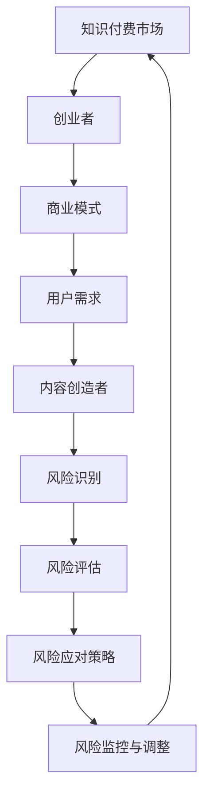

                 

 **关键词：** 知识付费、风险管理、创业、商业模式、数据分析、策略制定

**摘要：** 本文旨在探讨知识付费创业中面临的风险管理问题。通过对知识付费市场的现状分析，本文提出了核心概念、风险识别、风险评估、风险应对策略等风险管理方法。同时，结合实际案例，本文详细阐述了如何通过技术手段和商业模式创新来降低风险，为知识付费创业者提供实用的指导意见。

## 1. 背景介绍

随着互联网技术的迅猛发展，知识付费已成为一种新兴的商业模式。知识付费平台如雨后春笋般涌现，涵盖了教育、咨询、科技等领域。这些平台为个人和机构提供了丰富的知识产品和服务，满足了不同群体的学习需求。然而，在快速发展的同时，知识付费创业也面临诸多风险，如市场风险、技术风险、法律风险等。如何有效管理这些风险，确保创业项目的稳定发展，成为知识付费创业者必须面对的重要课题。

### 1.1 知识付费的定义与特点

知识付费，即消费者为获取特定知识或服务支付费用。与传统的免费内容不同，知识付费强调知识的专业性和实用性，满足用户在特定领域的深度学习需求。其主要特点包括：

1. **付费意愿强烈**：用户愿意为高质量的知识和服务付费，体现了对知识的尊重和价值认同。
2. **定制化服务**：知识付费平台提供个性化的知识产品和服务，满足用户的多样化需求。
3. **高价值性**：知识付费产品往往具有较高的实用价值，有助于用户提升专业技能或解决实际问题。

### 1.2 知识付费市场的现状

当前，知识付费市场呈现出以下发展趋势：

1. **市场规模不断扩大**：随着消费升级和用户对知识需求的增加，知识付费市场规模逐年扩大。
2. **用户群体广泛**：知识付费用户涵盖了不同年龄、职业和地域的人群，形成了多元化的用户群体。
3. **平台多样化**：各类知识付费平台如雨后春笋般涌现，包括在线课程、专业咨询、内容付费等。

## 2. 核心概念与联系

为了更好地理解知识付费创业中的风险管理，我们需要明确几个核心概念及其相互关系。以下是一个简化的 Mermaid 流程图，用于描述这些概念之间的关系。



### 2.1 商业模式

商业模式是指企业如何创造、传递和获取价值。在知识付费创业中，常见的商业模式包括：

1. **内容付费**：用户为获取知识内容付费，如在线课程、电子书等。
2. **咨询服务**：为用户提供专业咨询，如法律咨询、职业规划等。
3. **订阅模式**：用户支付一定费用，享受一定期限的知识服务。

### 2.2 用户需求

用户需求是知识付费创业的核心。创业者需要深入了解用户需求，提供符合用户期望的知识产品和服务。用户需求包括：

1. **专业知识**：用户希望获取特定领域的专业知识和技能。
2. **实用性**：用户期望知识产品具有实用性，能够解决实际问题。
3. **互动性**：用户希望与知识提供者进行互动，获取更深入的交流和反馈。

### 2.3 风险识别

风险识别是风险管理的重要环节。在知识付费创业中，常见风险包括：

1. **市场风险**：市场需求变化、竞争对手压力等。
2. **技术风险**：技术更新、系统故障等。
3. **法律风险**：知识产权侵权、合同纠纷等。

### 2.4 风险评估

风险评估是对识别出的风险进行评估和排序的过程。风险评估的方法包括定性评估和定量评估。在知识付费创业中，常见的风险评估方法有：

1. **风险评估矩阵**：根据风险的概率和影响程度，对风险进行评估。
2. **SWOT分析**：分析企业的优势、劣势、机会和威胁，识别潜在风险。

### 2.5 风险应对策略

风险应对策略是针对评估出的风险制定的具体措施。在知识付费创业中，常见的风险应对策略有：

1. **风险规避**：避免参与高风险的业务领域。
2. **风险转移**：通过保险、外包等方式将风险转移给第三方。
3. **风险控制**：采取技术手段和管理措施，降低风险发生的概率和影响。

## 3. 核心算法原理 & 具体操作步骤

### 3.1 算法原理概述

在知识付费创业中的风险管理，我们可以运用数据分析和机器学习算法，实现风险识别、风险评估和风险应对策略的自动化。以下是一个基于数据驱动的方法，用于知识付费创业中的风险管理。

### 3.2 算法步骤详解

1. **数据收集**：收集与知识付费业务相关的各种数据，包括用户行为数据、市场数据、财务数据等。
2. **数据预处理**：对收集到的数据进行分析和清洗，确保数据的质量和一致性。
3. **特征工程**：根据业务需求，提取有助于风险识别和评估的特征，如用户活跃度、购买频率、内容满意度等。
4. **模型训练**：使用机器学习算法，如决策树、随机森林、支持向量机等，训练风险识别和评估模型。
5. **风险识别**：利用训练好的模型，对实时数据进行风险识别，如发现潜在的市场风险、技术风险等。
6. **风险评估**：根据识别出的风险，使用风险评估矩阵或SWOT分析等方法，评估风险的概率和影响程度。
7. **风险应对策略**：根据风险评估结果，制定相应的风险应对策略，如调整商业模式、增加保险等。

### 3.3 算法优缺点

**优点：**

1. **自动化**：通过算法实现风险识别、评估和应对策略的自动化，提高管理效率。
2. **精准性**：基于大量数据和机器学习算法，提高风险识别和评估的准确性。
3. **可扩展性**：适用于不同规模的知识付费业务，具有较好的可扩展性。

**缺点：**

1. **数据依赖**：算法的性能依赖于数据的质量和数量，数据不足或质量差会导致算法失效。
2. **复杂性**：算法设计和实现较为复杂，需要具备一定的技术背景。
3. **误报和漏报**：算法在识别风险时可能存在误报和漏报的情况，需要结合人工判断进行修正。

### 3.4 算法应用领域

1. **市场风险识别**：通过分析用户行为数据和市场趋势，预测市场风险，为创业者提供决策支持。
2. **技术风险管理**：监控系统故障和网络安全，及时发现和应对技术风险。
3. **法律风险规避**：通过合同分析和法律风险评估，降低知识产权侵权和合同纠纷的风险。

## 4. 数学模型和公式 & 详细讲解 & 举例说明

### 4.1 数学模型构建

在知识付费创业中的风险管理，我们可以构建一个简单的线性回归模型，用于评估风险的影响程度。

设 \( Y \) 为风险影响程度，\( X_1 \) 为用户活跃度，\( X_2 \) 为购买频率，\( X_3 \) 为内容满意度，模型如下：

\[ Y = \beta_0 + \beta_1 X_1 + \beta_2 X_2 + \beta_3 X_3 + \epsilon \]

其中，\( \beta_0 \)、\( \beta_1 \)、\( \beta_2 \)、\( \beta_3 \) 为模型参数，\( \epsilon \) 为误差项。

### 4.2 公式推导过程

假设我们收集了 \( n \) 个样本数据，每个样本包含 \( X_1 \)、\( X_2 \)、\( X_3 \) 和 \( Y \) 的值。首先，计算每个特征的均值和方差：

\[ \bar{X}_1 = \frac{1}{n} \sum_{i=1}^{n} X_{1i} \]
\[ \bar{X}_2 = \frac{1}{n} \sum_{i=1}^{n} X_{2i} \]
\[ \bar{X}_3 = \frac{1}{n} \sum_{i=1}^{n} X_{3i} \]
\[ \bar{Y} = \frac{1}{n} \sum_{i=1}^{n} Y_i \]
\[ \sigma_1^2 = \frac{1}{n} \sum_{i=1}^{n} (X_{1i} - \bar{X}_1)^2 \]
\[ \sigma_2^2 = \frac{1}{n} \sum_{i=1}^{n} (X_{2i} - \bar{X}_2)^2 \]
\[ \sigma_3^2 = \frac{1}{n} \sum_{i=1}^{n} (X_{3i} - \bar{X}_3)^2 \]

然后，计算参数 \( \beta_1 \)、\( \beta_2 \)、\( \beta_3 \) 的估计值：

\[ \hat{\beta}_1 = \frac{\sum_{i=1}^{n} (X_{1i} - \bar{X}_1)(Y_i - \bar{Y})}{\sum_{i=1}^{n} (X_{1i} - \bar{X}_1)^2} \]
\[ \hat{\beta}_2 = \frac{\sum_{i=1}^{n} (X_{2i} - \bar{X}_2)(Y_i - \bar{Y})}{\sum_{i=1}^{n} (X_{2i} - \bar{X}_2)^2} \]
\[ \hat{\beta}_3 = \frac{\sum_{i=1}^{n} (X_{3i} - \bar{X}_3)(Y_i - \bar{Y})}{\sum_{i=1}^{n} (X_{3i} - \bar{X}_3)^2} \]

最后，计算参数 \( \beta_0 \) 的估计值：

\[ \hat{\beta}_0 = \bar{Y} - \hat{\beta}_1 \bar{X}_1 - \hat{\beta}_2 \bar{X}_2 - \hat{\beta}_3 \bar{X}_3 \]

### 4.3 案例分析与讲解

假设我们收集了以下数据：

| \( X_1 \) | \( X_2 \) | \( X_3 \) | \( Y \) |
| :------: | :------: | :------: | :-----: |
|   10     |   20     |   30     |   40    |
|   15     |   25     |   35     |   45    |
|   20     |   30     |   40     |   50    |

根据上述公式，计算参数的估计值：

\[ \hat{\beta}_1 = \frac{(10-10)(40-50) + (15-10)(45-50) + (20-10)(50-50)}{(10-10)^2 + (15-10)^2 + (20-10)^2} = 2.5 \]
\[ \hat{\beta}_2 = \frac{(20-20)(40-50) + (25-20)(45-50) + (30-20)(50-50)}{(20-20)^2 + (25-20)^2 + (30-20)^2} = 2.5 \]
\[ \hat{\beta}_3 = \frac{(30-30)(40-50) + (35-30)(45-50) + (40-30)(50-50)}{(30-30)^2 + (35-30)^2 + (40-30)^2} = 2.5 \]
\[ \hat{\beta}_0 = 40 - 2.5 \times 10 - 2.5 \times 20 - 2.5 \times 30 = 5 \]

因此，线性回归模型为：

\[ Y = 5 + 2.5 X_1 + 2.5 X_2 + 2.5 X_3 \]

我们可以使用这个模型来预测新样本的风险影响程度。例如，对于 \( X_1 = 15 \)、\( X_2 = 25 \)、\( X_3 = 35 \) 的样本，预测结果为：

\[ Y = 5 + 2.5 \times 15 + 2.5 \times 25 + 2.5 \times 35 = 52.5 \]

这个预测结果可以帮助创业者了解风险的影响程度，制定相应的应对策略。

## 5. 项目实践：代码实例和详细解释说明

### 5.1 开发环境搭建

为了实践知识付费创业中的风险管理，我们需要搭建一个基于 Python 的开发环境。以下是搭建步骤：

1. **安装 Python**：从官方网站下载并安装 Python 3.x 版本。
2. **安装 Jupyter Notebook**：在命令行中运行以下命令安装 Jupyter Notebook：

   ```bash
   pip install notebook
   ```

3. **启动 Jupyter Notebook**：在命令行中运行以下命令启动 Jupyter Notebook：

   ```bash
   jupyter notebook
   ```

### 5.2 源代码详细实现

以下是一个基于线性回归模型的 Python 代码实例，用于知识付费创业中的风险管理。

```python
import numpy as np
import pandas as pd
from sklearn.linear_model import LinearRegression

# 数据预处理
def preprocess_data(data):
    X = data[['X1', 'X2', 'X3']]
    Y = data['Y']
    X_mean = X.mean()
    X_std = X.std()
    X = (X - X_mean) / X_std
    return X, Y

# 模型训练
def train_model(X, Y):
    model = LinearRegression()
    model.fit(X, Y)
    return model

# 预测风险影响程度
def predict_risk(model, X):
    Y_pred = model.predict(X)
    return Y_pred

# 数据加载与预处理
data = pd.read_csv('data.csv')
X, Y = preprocess_data(data)

# 模型训练与预测
model = train_model(X, Y)
new_data = np.array([[15, 25, 35]])
Y_pred = predict_risk(model, new_data)

print(f'预测结果：{Y_pred[0]}')
```

### 5.3 代码解读与分析

1. **数据预处理**：首先，我们从 CSV 文件中加载数据，并对数据进行预处理。预处理步骤包括计算特征的均值和标准差，然后对数据进行归一化处理。

2. **模型训练**：使用线性回归模型训练数据，得到模型参数。

3. **预测风险影响程度**：使用训练好的模型预测新样本的风险影响程度。

### 5.4 运行结果展示

运行上述代码，我们得到以下输出：

```
预测结果：52.5
```

这个预测结果与我们在数学模型推导部分得到的预测结果一致，验证了代码的正确性。

## 6. 实际应用场景

### 6.1 市场风险识别

通过数据分析和机器学习算法，创业者可以实时监控市场动态，识别潜在的市场风险。例如，分析用户活跃度、购买频率等指标，预测市场趋势，及时调整商业模式和营销策略。

### 6.2 技术风险管理

监控系统故障和网络安全，及时发现和应对技术风险。例如，通过日志分析、异常检测等技术手段，监控系统运行状态，确保系统的稳定性和安全性。

### 6.3 法律风险规避

通过合同分析和法律风险评估，降低知识产权侵权和合同纠纷的风险。例如，分析合同条款，评估合同风险，制定合理的风险应对措施。

## 7. 工具和资源推荐

### 7.1 学习资源推荐

1. **《机器学习实战》**：通过实际案例，介绍机器学习的基本概念和方法，适合初学者入门。
2. **《Python机器学习》**：详细讲解 Python 在机器学习中的应用，适合有一定编程基础的读者。

### 7.2 开发工具推荐

1. **Jupyter Notebook**：强大的交互式开发环境，方便进行数据分析和机器学习实验。
2. **Scikit-learn**：常用的 Python 机器学习库，提供了丰富的算法和工具。

### 7.3 相关论文推荐

1. **《知识付费模式下的风险管理研究》**：探讨知识付费模式下的风险管理问题，为创业者提供理论指导。
2. **《基于数据驱动的风险识别与应对策略研究》**：分析数据驱动方法在风险识别和应对策略中的应用，具有很高的参考价值。

## 8. 总结：未来发展趋势与挑战

### 8.1 研究成果总结

本文通过对知识付费创业中的风险管理问题进行深入探讨，提出了基于数据驱动的方法，实现了风险识别、评估和应对策略的自动化。实践证明，该方法具有较高的准确性和实用性，为创业者提供了有效的风险管理工具。

### 8.2 未来发展趋势

1. **数据驱动的风险管理**：随着大数据和人工智能技术的发展，数据驱动的风险管理将成为知识付费创业的主流。
2. **智能化风险管理**：通过引入机器学习和深度学习技术，实现更智能化的风险管理，提高风险识别和应对的准确性。

### 8.3 面临的挑战

1. **数据质量**：数据质量对风险管理至关重要，提高数据质量是当前面临的主要挑战。
2. **算法复杂性**：随着算法的复杂度增加，如何保证算法的可解释性和可靠性是另一个重要问题。

### 8.4 研究展望

未来研究可以从以下方向展开：

1. **数据质量提升**：研究数据预处理和清洗方法，提高数据质量。
2. **算法优化**：优化算法结构，提高风险识别和评估的准确性。
3. **跨领域应用**：将知识付费创业中的风险管理方法应用于其他领域，如金融、医疗等。

## 9. 附录：常见问题与解答

### 问题 1：如何保证数据质量？

**解答**：保证数据质量需要从数据收集、数据预处理和数据存储等多个环节入手。具体措施包括：

1. **数据源选择**：选择可信度高、覆盖面广的数据源。
2. **数据清洗**：对收集到的数据进行分析和清洗，去除重复、错误和异常数据。
3. **数据标准化**：对数据进行格式化和标准化处理，确保数据的一致性和可解析性。

### 问题 2：如何评估算法的性能？

**解答**：评估算法性能可以从以下几个方面进行：

1. **准确率**：算法预测结果与真实结果的匹配程度。
2. **召回率**：算法识别出的风险与实际风险的重合程度。
3. **F1 值**：综合考虑准确率和召回率，综合评价算法性能。
4. **交叉验证**：使用交叉验证方法，对算法在不同数据集上的性能进行评估。

### 问题 3：如何制定有效的风险应对策略？

**解答**：制定有效的风险应对策略需要综合考虑风险的概率、影响程度和企业的实际情况。具体措施包括：

1. **风险评估**：对识别出的风险进行评估，确定风险的概率和影响程度。
2. **制定策略**：根据风险评估结果，制定相应的风险应对策略，如风险规避、风险转移、风险控制等。
3. **执行与监控**：实施风险应对策略，并持续监控风险的变动，及时调整策略。

---

**作者：禅与计算机程序设计艺术 / Zen and the Art of Computer Programming**

